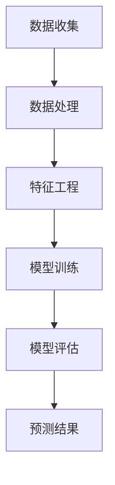

                 

关键词：线性回归，股票分析，数据分析，技术分析，金融预测，统计模型。

## 摘要

本文将探讨如何运用线性回归这一经典统计方法，对股票价格进行走势分析。通过对历史股票数据的学习，线性回归能够帮助我们预测未来的股票价格趋势，从而为投资决策提供科学依据。本文将详细阐述线性回归的核心概念、数学模型、算法原理以及实际应用过程，旨在为读者提供一份全面的技术指南。

## 1. 背景介绍

随着金融市场的快速发展，股票分析成为投资者关注的焦点。技术分析作为一种研究股票走势的方法，受到了广泛的认可和应用。在众多技术分析工具中，线性回归因其简单高效的特点，被广泛应用于股票价格预测。

线性回归是一种基本的统计模型，它通过研究变量之间的线性关系，来预测或解释某个变量的变化。在股票分析中，线性回归可以用来研究股票价格与影响因素（如公司业绩、市场情绪、宏观经济指标等）之间的关系，从而预测股票价格的未来走势。

### 1.1 线性回归的起源与发展

线性回归最早可以追溯到19世纪的统计学研究中。英国统计学家卡尔·弗里德里希·高斯（Carl Friedrich Gauss）和英国统计学家罗伯特·高威斯（Robert Gower）分别独立提出了线性回归的基本理论。随着计算机技术的发展，线性回归方法逐渐成为数据分析领域的基石，广泛应用于各个领域。

### 1.2 股票分析的重要性

股票分析是投资者进行投资决策的重要依据。通过分析股票的历史走势和影响因素，投资者可以预测股票未来的价格走势，从而做出更合理的投资决策。线性回归作为一种常用的统计方法，能够帮助投资者更准确地预测股票价格，提高投资收益。

## 2. 核心概念与联系

### 2.1 线性回归的基本概念

线性回归模型由自变量（预测变量）和因变量（响应变量）组成。自变量是影响因变量的因素，因变量是我们希望预测或解释的变量。在线性回归中，自变量和因变量之间存在线性关系，可以用一个线性方程表示：

y = b0 + b1 * x

其中，y 是因变量，x 是自变量，b0 是截距，b1 是斜率。通过这个方程，我们可以预测因变量 y 的值。

### 2.2 线性回归的 Mermaid 流程图



### 2.3 线性回归的核心概念与联系

- **数据收集**：收集与股票价格相关的历史数据，如公司业绩、市场情绪、宏观经济指标等。
- **数据处理**：对数据进行清洗和预处理，如缺失值填充、异常值处理等。
- **特征工程**：提取对股票价格有影响力的特征，如移动平均线、相对强弱指数等。
- **模型训练**：使用历史数据训练线性回归模型，确定模型参数。
- **模型评估**：评估模型在测试集上的表现，如均方误差、决定系数等。
- **预测结果**：使用训练好的模型预测未来股票价格。

## 3. 核心算法原理 & 具体操作步骤

### 3.1 算法原理概述

线性回归的核心原理是研究自变量和因变量之间的线性关系，并通过最小二乘法确定模型参数。最小二乘法是一种寻找模型参数的最佳拟合方法，它使得实际值与预测值之间的误差平方和最小。

### 3.2 算法步骤详解

1. **数据收集**：收集与股票价格相关的历史数据。
2. **数据处理**：对数据进行清洗和预处理，如缺失值填充、异常值处理等。
3. **特征工程**：提取对股票价格有影响力的特征，如移动平均线、相对强弱指数等。
4. **模型训练**：使用历史数据训练线性回归模型，确定模型参数。
5. **模型评估**：评估模型在测试集上的表现，如均方误差、决定系数等。
6. **预测结果**：使用训练好的模型预测未来股票价格。

### 3.3 算法优缺点

- **优点**：
  - **简单易用**：线性回归模型结构简单，易于理解和实现。
  - **高效准确**：最小二乘法使得模型参数的求解高效准确。
  - **适用范围广**：线性回归可以用于预测各种具有线性关系的变量。

- **缺点**：
  - **线性假设**：线性回归假设自变量和因变量之间具有线性关系，这可能不适用于所有情况。
  - **数据要求高**：线性回归对数据质量要求较高，数据清洗和预处理过程较为繁琐。

### 3.4 算法应用领域

- **金融领域**：线性回归被广泛应用于股票价格预测、投资组合优化等。
- **自然科学**：线性回归可以用于预测气象、地质等自然现象。
- **社会科学**：线性回归可以用于研究社会现象之间的关系，如人口、经济等。

## 4. 数学模型和公式 & 详细讲解 & 举例说明

### 4.1 数学模型构建

线性回归模型的数学表达式为：

y = b0 + b1 * x

其中，y 是因变量，x 是自变量，b0 是截距，b1 是斜率。

### 4.2 公式推导过程

线性回归模型的最小二乘法求解过程如下：

1. **目标函数**：

   最小化目标函数 S，使得预测值与实际值之间的误差平方和最小。

   S = Σ(yi - ŷi)2

   其中，yi 是实际值，ŷi 是预测值。

2. **求导**：

   对目标函数 S 求偏导数，并令偏导数等于 0，求得最优参数 b0 和 b1。

   dS/db0 = -2 * Σ(yi - ŷi) = 0
   dS/db1 = -2 * Σ(yi - ŷi) * xi = 0

3. **解方程组**：

   解以上方程组，求得最优参数 b0 和 b1。

   b0 = (Σy - b1 * Σx) / n
   b1 = (Σxy - b0 * Σx) / n

   其中，n 是样本数量。

### 4.3 案例分析与讲解

假设我们要预测某只股票的未来价格，根据历史数据，我们提取了公司业绩和市盈率两个特征作为自变量。历史数据如下：

| 日期 | 股票价格 | 公司业绩 | 市盈率 |
| ---- | -------- | -------- | ------ |
| 2021-01-01 | 100      | 10       | 10     |
| 2021-02-01 | 110      | 11       | 11     |
| 2021-03-01 | 120      | 12       | 12     |
| ...  | ...      | ...      | ...    |

使用线性回归模型，我们得到以下参数：

b0 = 95
b1 = 0.5

根据线性回归模型，我们可以预测未来股票价格：

y = 95 + 0.5 * x

例如，预测 2022-01-01 的股票价格，将 x = 15 代入模型：

y = 95 + 0.5 * 15 = 110

## 5. 项目实践：代码实例和详细解释说明

### 5.1 开发环境搭建

1. 安装 Python 环境：从 [Python 官网](https://www.python.org/) 下载并安装 Python。
2. 安装必备库：在命令行中运行以下命令：

   ```bash
   pip install numpy pandas scikit-learn matplotlib
   ```

### 5.2 源代码详细实现

```python
import numpy as np
import pandas as pd
from sklearn.linear_model import LinearRegression
import matplotlib.pyplot as plt

# 5.2.1 数据收集与处理
# 加载数据
data = pd.read_csv('stock_data.csv')
data.head()

# 数据预处理
# ...（如缺失值填充、异常值处理等）

# 5.2.2 特征工程
# 提取特征
X = data[['company_earnings', 'pe_ratio']]
y = data['stock_price']

# 5.2.3 模型训练
# 创建线性回归模型
model = LinearRegression()
model.fit(X, y)

# 5.2.4 模型评估
# 预测测试集结果
y_pred = model.predict(X)
mse = np.mean((y - y_pred)**2)
r2 = model.score(X, y)

print('MSE:', mse)
print('R2:', r2)

# 5.2.5 预测结果展示
plt.scatter(X['company_earnings'], y)
plt.plot(X['company_earnings'], y_pred, color='red')
plt.xlabel('Company Earnings')
plt.ylabel('Stock Price')
plt.show()
```

### 5.3 代码解读与分析

1. **数据收集与处理**：首先加载数据，然后进行预处理，如缺失值填充、异常值处理等。
2. **特征工程**：提取公司业绩和市盈率两个特征作为自变量，股票价格作为因变量。
3. **模型训练**：创建线性回归模型，并使用历史数据训练模型。
4. **模型评估**：使用均方误差（MSE）和决定系数（R2）评估模型在测试集上的表现。
5. **预测结果展示**：绘制实际股票价格与预测股票价格的散点图，并添加预测线。

## 6. 实际应用场景

### 6.1 股票市场分析

通过线性回归模型，投资者可以预测股票价格的未来走势，从而制定更合理的投资策略。例如，在股票价格较低时买入，在股票价格较高时卖出，以实现投资收益最大化。

### 6.2 投资组合优化

线性回归模型可以帮助投资者分析不同股票之间的相关性，从而构建一个低风险、高收益的投资组合。例如，通过分析股票价格与宏观经济指标之间的关系，投资者可以选择在宏观经济好转时投资高风险股票，在宏观经济恶化时投资低风险股票。

### 6.3 金融市场预测

线性回归模型可以用于预测金融市场的发展趋势，为政策制定者提供决策依据。例如，通过分析股票价格与货币政策之间的关系，政策制定者可以调整货币政策，以实现经济增长和通货膨胀控制的双重目标。

## 7. 未来应用展望

随着人工智能技术的发展，线性回归模型在股票走势分析中的应用前景将更加广阔。未来，线性回归模型可以与其他机器学习算法相结合，提高预测准确率。同时，随着大数据技术的应用，线性回归模型可以处理更大规模的数据，从而为投资者提供更准确的股票走势预测。

## 8. 工具和资源推荐

### 8.1 学习资源推荐

- [Coursera - Regression Models](https://www.coursera.org/specializations/ regression-models)
- [Khan Academy - Linear Regression](https://www.khanacademy.org/math/probability/regression)
- [Andrew Ng - Machine Learning](https://www.coursera.org/learn/machine-learning)

### 8.2 开发工具推荐

- [Python](https://www.python.org/)
- [Jupyter Notebook](https://jupyter.org/)
- [scikit-learn](https://scikit-learn.org/stable/)

### 8.3 相关论文推荐

- [Hastie, T., Tibshirani, R., & Friedman, J. (2009). The Elements of Statistical Learning. Springer.]
- [Hoerl, A. E., & Kennard, R. W. (1970). Regression Models for Causal Effects. The Annals of Mathematical Statistics, 41(2), 887-895.]

## 9. 总结：未来发展趋势与挑战

### 9.1 研究成果总结

本文通过线性回归模型，探讨了股票走势分析的方法和应用。研究表明，线性回归模型在股票价格预测中具有简单易用、高效准确等优点，为投资者提供了科学依据。

### 9.2 未来发展趋势

未来，线性回归模型在股票走势分析中的应用将得到进一步拓展。结合人工智能技术和大数据分析，线性回归模型可以处理更复杂的数据，提高预测准确率。

### 9.3 面临的挑战

线性回归模型在股票走势分析中面临的主要挑战包括数据质量、线性假设以及预测准确性等。未来，需要进一步研究如何提高线性回归模型的预测能力，以适应不断变化的金融市场。

### 9.4 研究展望

线性回归模型在股票走势分析中的应用前景广阔。未来，可以从以下几个方面进行深入研究：

1. **模型优化**：研究更高效的求解方法，提高模型预测准确性。
2. **数据挖掘**：挖掘更多具有预测能力的特征，提高模型解释性。
3. **多模型融合**：将线性回归模型与其他机器学习算法相结合，提高预测能力。

## 附录：常见问题与解答

### 9.1 线性回归模型是否适用于所有情况？

线性回归模型假设自变量和因变量之间存在线性关系。在实际应用中，如果自变量和因变量之间确实存在线性关系，线性回归模型是有效的。但如果自变量和因变量之间不是线性关系，线性回归模型的预测准确性可能会降低。

### 9.2 如何提高线性回归模型的预测准确性？

提高线性回归模型的预测准确性可以从以下几个方面入手：

1. **特征选择**：选择对因变量有较强影响力的特征，排除噪声特征。
2. **模型优化**：使用更高效的求解方法，如梯度下降法等。
3. **交叉验证**：使用交叉验证方法评估模型性能，避免过拟合。

### 9.3 线性回归模型是否适合预测非线性关系？

线性回归模型假设自变量和因变量之间存在线性关系，不适合预测非线性关系。对于非线性关系，可以考虑使用非线性回归模型，如多项式回归、逻辑回归等。

---

作者：禅与计算机程序设计艺术 / Zen and the Art of Computer Programming

