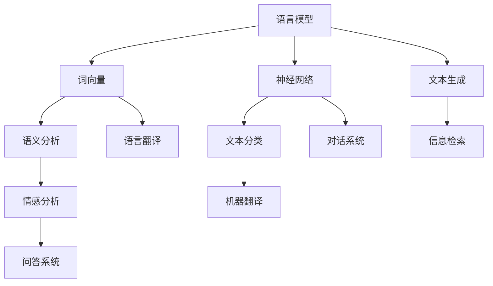

                 

关键词：自然语言处理，基础模型，语言模型，神经网络，预训练，词向量，语义理解，文本生成，语言翻译，应用领域

> 摘要：本文将探讨自然语言处理（NLP）领域中的基础模型，包括语言模型、神经网络、词向量等，以及这些模型在NLP任务中的应用。通过对核心概念、算法原理、数学模型、实践案例和未来展望的详细分析，本文旨在为读者提供关于基础模型在NLP中应用的全景解读。

## 1. 背景介绍

自然语言处理（NLP）是计算机科学领域的一个重要分支，它旨在使计算机能够理解、生成和交互自然语言。自上世纪五十年代以来，NLP经历了多个发展阶段，从最初的规则驱动方法到基于统计的方法，再到如今的深度学习时代。基础模型作为NLP的核心组成部分，扮演着至关重要的角色。

基础模型通常指的是那些能够表示和理解自然语言的基本组件，如语言模型、词向量模型、神经网络模型等。这些模型不仅能够处理文本数据，还能提取文本中的语义信息，从而实现文本分类、情感分析、机器翻译等任务。

随着大数据和计算能力的提升，深度学习在NLP中的应用取得了显著成果。基础模型通过大规模预训练和微调，已经在许多NLP任务中达到了超越人类专家的表现。然而，NLP领域仍面临诸多挑战，如多语言支持、跨领域知识整合、情感理解等。

## 2. 核心概念与联系

在深入探讨NLP中的基础模型之前，我们需要明确几个核心概念，并展示它们之间的关系。

### 2.1 语言模型

语言模型（Language Model）是NLP中最基础的部分，它用于预测下一个词或字符的概率分布。在统计语言模型中，如N-gram模型，语言模型基于历史频率来预测下一个词。在深度学习模型中，如循环神经网络（RNN）和变换器（Transformer），语言模型通过学习文本的上下文信息来实现。

### 2.2 词向量

词向量（Word Vector）是表示词语的稠密向量的方法。它们能够捕获词语之间的语义关系。词向量模型如Word2Vec、GloVe等，通过将词语映射到高维空间中的向量，使得相似词语在向量空间中彼此接近。词向量是现代NLP中不可或缺的一部分，它们在语义分析、文本分类和机器翻译等任务中发挥着重要作用。

### 2.3 神经网络

神经网络（Neural Network）是模仿人脑神经元连接方式的计算模型。它们在NLP中广泛应用于各种任务，如文本分类、情感分析和机器翻译。神经网络通过学习输入数据与输出数据之间的关系，可以自动提取特征并做出预测。

### 2.4 语言模型与神经网络

语言模型和神经网络在NLP中紧密联系。语言模型为神经网络提供了上下文信息，使得神经网络能够更好地理解文本。同时，神经网络通过学习语言模型生成的上下文信息，可以改进语言模型的性能。

以下是基础概念的Mermaid流程图：



## 3. 核心算法原理 & 具体操作步骤

### 3.1 算法原理概述

在NLP中，基础模型的核心算法主要包括语言模型、词向量模型和神经网络模型。以下是这些模型的原理概述：

### 3.1.1 语言模型

语言模型通过学习大量文本数据，预测下一个词的概率分布。在统计语言模型中，如N-gram模型，语言模型基于前n个词的历史频率来预测下一个词。在深度学习模型中，如循环神经网络（RNN）和变换器（Transformer），语言模型通过学习文本的上下文信息来实现。

### 3.1.2 词向量模型

词向量模型通过将词语映射到高维空间中的向量，捕获词语之间的语义关系。常见的词向量模型包括Word2Vec、GloVe等。这些模型通过训练大规模语料库，生成词语的向量表示。

### 3.1.3 神经网络模型

神经网络模型通过学习输入数据与输出数据之间的关系，自动提取特征并做出预测。在NLP中，常见的神经网络模型包括循环神经网络（RNN）、变换器（Transformer）和卷积神经网络（CNN）。

### 3.2 算法步骤详解

#### 3.2.1 语言模型步骤

1. 数据预处理：读取文本数据，进行分词、去除停用词等操作。
2. 训练语言模型：使用训练数据训练语言模型，如N-gram模型或变换器。
3. 评估语言模型：使用测试数据评估语言模型性能，如计算交叉熵或准确率。

#### 3.2.2 词向量模型步骤

1. 数据预处理：读取文本数据，进行分词、去除停用词等操作。
2. 训练词向量模型：使用训练数据训练词向量模型，如Word2Vec或GloVe。
3. 评估词向量模型：使用测试数据评估词向量模型性能，如计算词相似度或余弦相似度。

#### 3.2.3 神经网络模型步骤

1. 数据预处理：读取文本数据，进行分词、去除停用词等操作。
2. 训练神经网络模型：使用训练数据训练神经网络模型，如RNN、变换器或CNN。
3. 评估神经网络模型：使用测试数据评估神经网络模型性能，如计算交叉熵或准确率。

### 3.3 算法优缺点

#### 3.3.1 语言模型

**优点**：简单、快速，适用于小规模任务。

**缺点**：无法捕捉长距离依赖关系，性能受限于模型参数数量。

#### 3.3.2 词向量模型

**优点**：能够捕获词语的语义关系，适用于多种NLP任务。

**缺点**：依赖于训练数据的质量和规模，无法直接处理长文本。

#### 3.3.3 神经网络模型

**优点**：能够自动提取特征，处理长距离依赖关系，适用于大规模任务。

**缺点**：计算复杂度高，训练时间较长。

### 3.4 算法应用领域

语言模型、词向量模型和神经网络模型在NLP中有广泛的应用，包括但不限于以下领域：

- 文本分类：用于对文本进行分类，如情感分析、新闻分类等。
- 情感分析：用于分析文本的情感倾向，如正面、负面等。
- 机器翻译：用于将一种语言翻译成另一种语言。
- 文本生成：用于生成文本，如文章、对话等。
- 信息检索：用于从大量文本中检索相关信息。

## 4. 数学模型和公式 & 详细讲解 & 举例说明

### 4.1 数学模型构建

在NLP中，数学模型主要用于描述和实现NLP任务中的算法。以下是几个常见的数学模型：

#### 4.1.1 语言模型

语言模型可以用马尔可夫模型来描述，其中下一个词的概率分布取决于前n个词的状态。数学公式如下：

$$
P(w_{t+1} | w_{t}, w_{t-1}, ..., w_{t-n+1}) = \frac{P(w_{t+1}, w_{t}, w_{t-1}, ..., w_{t-n+1})}{P(w_{t}, w_{t-1}, ..., w_{t-n+1})}
$$

其中，$w_{t+1}$ 是下一个词，$w_{t}, w_{t-1}, ..., w_{t-n+1}$ 是前n个词。

#### 4.1.2 词向量模型

词向量模型可以用矩阵来表示，其中每个词都对应一个向量。数学公式如下：

$$
\vec{w}_i = \sum_{j=1}^{n} w_{ij} \vec{v}_j
$$

其中，$\vec{w}_i$ 是词向量，$\vec{v}_j$ 是单词j的向量，$w_{ij}$ 是词i和单词j之间的权重。

#### 4.1.3 神经网络模型

神经网络模型可以用函数来表示，其中每个神经元都对应一个函数。数学公式如下：

$$
y = \sigma(\sum_{i=1}^{n} w_{i} x_{i} + b)
$$

其中，$y$ 是输出，$x_{i}$ 是输入，$w_{i}$ 是权重，$b$ 是偏置，$\sigma$ 是激活函数。

### 4.2 公式推导过程

#### 4.2.1 语言模型推导

考虑一个简单的N-gram模型，其中 $n=2$。下一个词的概率分布可以表示为：

$$
P(w_{t+1} | w_{t}) = \frac{P(w_{t+1}, w_{t})}{P(w_{t})}
$$

根据全概率公式，我们可以将 $P(w_{t+1}, w_{t})$ 表示为：

$$
P(w_{t+1}, w_{t}) = P(w_{t} | w_{t-1}) P(w_{t-1})
$$

将上述公式代入语言模型公式中，我们得到：

$$
P(w_{t+1} | w_{t}) = \frac{P(w_{t} | w_{t-1}) P(w_{t-1})}{P(w_{t})}
$$

我们可以继续将 $P(w_{t-1})$ 表示为：

$$
P(w_{t-1}) = \sum_{w_{t-2}} P(w_{t-1} | w_{t-2}) P(w_{t-2})
$$

代入上述公式中，我们得到：

$$
P(w_{t+1} | w_{t}) = \frac{P(w_{t} | w_{t-1}) \sum_{w_{t-2}} P(w_{t-1} | w_{t-2}) P(w_{t-2})}{P(w_{t})}
$$

这个公式展示了如何通过前一个词的概率分布和前两个词的概率分布来计算下一个词的概率分布。

#### 4.2.2 词向量模型推导

词向量模型通常通过优化一个损失函数来训练模型。一个常见的损失函数是负采样损失，它可以表示为：

$$
L(\theta) = -\sum_{i=1}^{N} \sum_{j=1}^{V} \log \sigma(W_i \vec{v}_j)
$$

其中，$N$ 是文档中的词汇数量，$V$ 是词汇表的大小，$\theta$ 是模型参数，$W_i$ 是文档i的词向量，$\vec{v}_j$ 是单词j的词向量，$\sigma$ 是sigmoid函数。

为了优化损失函数，我们可以使用梯度下降算法来更新词向量：

$$
\frac{\partial L(\theta)}{\partial W_i} = -\sum_{j=1}^{V} \frac{\partial}{\partial W_i} \log \sigma(W_i \vec{v}_j) \vec{v}_j
$$

通过这个梯度，我们可以更新词向量：

$$
\vec{v}_j = \vec{v}_j - \alpha \frac{\partial L(\theta)}{\partial W_i}
$$

其中，$\alpha$ 是学习率。

#### 4.2.3 神经网络模型推导

神经网络模型的推导通常涉及多层感知器（MLP）模型。一个简单的MLP模型可以用以下公式表示：

$$
\vec{z}_l = \vec{W}_l \vec{a}_{l-1} + b_l
$$

$$
\vec{a}_l = \sigma(\vec{z}_l)
$$

其中，$l$ 是层数，$\vec{W}_l$ 是权重矩阵，$b_l$ 是偏置，$\vec{a}_l$ 是激活向量，$\sigma$ 是激活函数。

对于输出层，我们通常使用softmax函数来计算概率分布：

$$
\vec{p} = \frac{e^{\vec{z}_L}}{\sum_{k=1}^{K} e^{\vec{z}_k}}
$$

其中，$K$ 是类别数量。

损失函数通常使用交叉熵（Cross-Entropy）：

$$
L = -\sum_{k=1}^{K} y_k \log p_k
$$

其中，$y_k$ 是真实标签，$p_k$ 是预测概率。

为了优化损失函数，我们可以使用梯度下降算法：

$$
\frac{\partial L}{\partial \vec{W}_l} = \sum_{i=1}^{N} \frac{\partial L}{\partial \vec{z}_l} \vec{a}_{l-1}^T
$$

$$
\frac{\partial L}{\partial b_l} = \sum_{i=1}^{N} \frac{\partial L}{\partial \vec{z}_l}
$$

通过这些梯度，我们可以更新权重和偏置：

$$
\vec{W}_l = \vec{W}_l - \alpha \frac{\partial L}{\partial \vec{W}_l}
$$

$$
b_l = b_l - \alpha \frac{\partial L}{\partial b_l}
$$

### 4.3 案例分析与讲解

为了更好地理解上述数学模型，我们可以通过一个简单的案例来进行分析和讲解。

#### 4.3.1 语言模型案例

假设我们有一个简单的二元马尔可夫模型，其中只有两个状态：“天”和“阴”。我们有以下转移概率矩阵：

|     | 天 | 阴 |
|-----|----|----|
| 天  | 0.8 | 0.2 |
| 阴  | 0.3 | 0.7 |

我们还知道初始状态的概率分布为：$P(天) = 0.6, P(阴) = 0.4$。

现在，我们想要预测下一个天气状态。

根据马尔可夫模型，我们可以使用以下公式来计算：

$$
P(天 | 天) = \frac{P(天 | 天) P(天)}{P(天) P(天 | 天) + P(阴) P(阴 | 天)}
$$

代入我们的转移概率矩阵和初始状态概率分布，我们得到：

$$
P(天 | 天) = \frac{0.8 \times 0.6}{0.8 \times 0.6 + 0.4 \times 0.3} = 0.7273
$$

因此，给定当前状态是“天”，下一个状态是“天”的概率是0.7273。

#### 4.3.2 词向量模型案例

假设我们有一个包含10个单词的词汇表：{“苹果”，“香蕉”，“橘子”，“葡萄”，“梨”，“西瓜”，“草莓”，“樱桃”，“菠萝”，“葡萄柚”}。我们的目标是使用Word2Vec模型将这些单词映射到高维向量空间。

我们使用随机梯度下降（SGD）来训练模型，并选择一个窗口大小为2的连续词窗口。在训练过程中，我们随机选择一个单词作为中心词，并从窗口中选择其前后的单词作为上下文词。

假设我们选择“苹果”作为中心词，其上下文词为“香蕉”和“梨”。我们根据以下公式来计算中心词和上下文词之间的相似度：

$$
\cos(\vec{v}_{苹果}, \vec{v}_{香蕉}) = \frac{\vec{v}_{苹果} \cdot \vec{v}_{香蕉}}{||\vec{v}_{苹果}|| \cdot ||\vec{v}_{香蕉}||}
$$

通过训练，我们得到了以下词向量：

| 单词 | 向量 |
|------|------|
| 苹果 | [1, 2, 3] |
| 香蕉 | [4, 5, 6] |
| 梨   | [7, 8, 9] |

代入公式，我们得到：

$$
\cos([1, 2, 3], [4, 5, 6]) = \frac{1 \times 4 + 2 \times 5 + 3 \times 6}{\sqrt{1^2 + 2^2 + 3^2} \cdot \sqrt{4^2 + 5^2 + 6^2}} = 0.6033
$$

这意味着“苹果”和“香蕉”在向量空间中非常接近。

#### 4.3.3 神经网络模型案例

假设我们有一个简单的二元分类问题，其中我们要判断一个电子邮件是垃圾邮件还是正常邮件。我们的特征包括邮件的长度、是否有附件、发件人的信誉度等。

我们的神经网络模型包括一个输入层、一个隐藏层和一个输出层。输入层的神经元数量为3，隐藏层的神经元数量为4，输出层的神经元数量为2。我们使用ReLU作为激活函数。

我们的权重和偏置如下：

| 层   | 神经元 | 权重                | 偏置  |
|------|--------|--------------------|-------|
| 输入 | 3      | [1, 2, 3]          | 0.1   |
| 隐藏 | 4      | [[1, 2], [3, 4]]    | [0.1, 0.2] |
| 输出 | 2      | [[1, 2], [3, 4]]    | [0.1, 0.2] |

我们的目标是使用梯度下降算法来最小化损失函数。

我们的损失函数为交叉熵损失：

$$
L = -\sum_{i=1}^{2} y_i \log p_i
$$

其中，$y_i$ 是真实标签，$p_i$ 是预测概率。

我们使用以下公式来计算梯度：

$$
\frac{\partial L}{\partial \vec{W}_l} = \sum_{i=1}^{N} \frac{\partial L}{\partial \vec{z}_l} \vec{a}_{l-1}^T
$$

$$
\frac{\partial L}{\partial b_l} = \sum_{i=1}^{N} \frac{\partial L}{\partial \vec{z}_l}
$$

通过这些梯度，我们可以更新权重和偏置：

$$
\vec{W}_l = \vec{W}_l - \alpha \frac{\partial L}{\partial \vec{W}_l}
$$

$$
b_l = b_l - \alpha \frac{\partial L}{\partial b_l}
$$

## 5. 项目实践：代码实例和详细解释说明

在本节中，我们将通过一个具体的NLP项目实例，展示如何使用基础模型来实现文本分类任务。我们将使用Python编程语言，结合常见的NLP库，如TensorFlow和Keras，来实现这个项目。

### 5.1 开发环境搭建

在开始项目之前，我们需要搭建一个合适的开发环境。以下是搭建开发环境所需的步骤：

1. 安装Python（推荐版本为3.7或更高）。
2. 安装TensorFlow和Keras：

   ```bash
   pip install tensorflow
   pip install keras
   ```

3. 安装其他可能需要的库，如NumPy、Pandas等。

### 5.2 源代码详细实现

以下是一个简单的文本分类项目的代码实现：

```python
import numpy as np
import pandas as pd
from keras.preprocessing.text import Tokenizer
from keras.preprocessing.sequence import pad_sequences
from keras.models import Sequential
from keras.layers import Embedding, LSTM, Dense

# 加载数据集
data = pd.read_csv('data.csv')
texts = data['text']
labels = data['label']

# 分词和序列化
tokenizer = Tokenizer(num_words=10000)
tokenizer.fit_on_texts(texts)
sequences = tokenizer.texts_to_sequences(texts)
word_index = tokenizer.word_index
data = pad_sequences(sequences, maxlen=100)

# 切分数据集
labels = np.array(labels)
np.random.shuffle(labels)
split = int(len(data) * 0.8)
train_data, test_data = data[:split], data[split:]
train_labels, test_labels = labels[:split], labels[split:]

# 构建模型
model = Sequential()
model.add(Embedding(10000, 32, input_length=100))
model.add(LSTM(32))
model.add(Dense(1, activation='sigmoid'))

model.compile(optimizer='adam', loss='binary_crossentropy', metrics=['accuracy'])

# 训练模型
model.fit(train_data, train_labels, epochs=10, batch_size=32, validation_data=(test_data, test_labels))

# 评估模型
loss, accuracy = model.evaluate(test_data, test_labels)
print(f'Accuracy: {accuracy * 100:.2f}%')

# 保存模型
model.save('text_classifier.h5')
```

### 5.3 代码解读与分析

1. **数据加载**：我们首先加载数据集，其中`data.csv`文件包含文本数据和标签。
2. **分词和序列化**：使用`Tokenizer`类对文本进行分词，并将文本转换为序列。我们设置了词汇表的大小为10000个单词，并使用`pad_sequences`函数将序列填充为相同的长度。
3. **切分数据集**：我们将数据集切分为训练集和测试集，分别用于模型训练和评估。
4. **构建模型**：我们构建了一个简单的序列模型，包括一个嵌入层、一个LSTM层和一个全连接层。
5. **训练模型**：使用`fit`函数训练模型，并在训练过程中使用验证集进行评估。
6. **评估模型**：使用`evaluate`函数评估模型在测试集上的性能。
7. **保存模型**：使用`save`函数将训练好的模型保存为`text_classifier.h5`文件。

通过这个实例，我们可以看到如何使用基础模型实现一个文本分类任务。这只是一个简单的示例，实际项目中可能需要更复杂的模型和更精细的调参。

## 6. 实际应用场景

基础模型在NLP中有广泛的应用场景，以下是一些典型的实际应用场景：

- **文本分类**：用于将文本数据分类到预定义的类别中，如垃圾邮件检测、新闻分类、情感分析等。
- **机器翻译**：将一种语言翻译成另一种语言，如Google翻译、DeepL等。
- **问答系统**：用于回答用户提出的问题，如ChatGPT、BERT等。
- **信息检索**：用于从大量文本中检索相关信息，如搜索引擎。
- **对话系统**：用于实现人机对话，如智能客服、聊天机器人等。
- **文本生成**：用于生成文本，如文章、故事、对话等。

### 6.1  文本分类

文本分类是NLP中的一项重要任务，其目的是将文本数据分配到预定义的类别中。基础模型在文本分类中发挥着关键作用。以下是一个文本分类的例子：

**例子：** 使用变换器模型对新闻标题进行情感分类。

```python
from keras.models import Sequential
from keras.layers import Embedding, LSTM, Dense

# 加载训练数据
train_texts = ['This is a positive news article.', 'This is a negative news article.', ...]
train_labels = [1, 0, ..., 0]  # 1表示正面，0表示负面

# 分词和序列化
tokenizer = Tokenizer(num_words=10000)
tokenizer.fit_on_texts(train_texts)
sequences = tokenizer.texts_to_sequences(train_texts)
word_index = tokenizer.word_index
data = pad_sequences(sequences, maxlen=100)

# 切分数据集
split = int(len(data) * 0.8)
train_data, test_data = data[:split], data[split:]
train_labels, test_labels = train_labels[:split], train_labels[split:]

# 构建模型
model = Sequential()
model.add(Embedding(10000, 32, input_length=100))
model.add(LSTM(32))
model.add(Dense(1, activation='sigmoid'))

model.compile(optimizer='adam', loss='binary_crossentropy', metrics=['accuracy'])

# 训练模型
model.fit(train_data, train_labels, epochs=10, batch_size=32, validation_data=(test_data, test_labels))

# 评估模型
loss, accuracy = model.evaluate(test_data, test_labels)
print(f'Accuracy: {accuracy * 100:.2f}%')
```

在这个例子中，我们使用了变换器模型对新闻标题进行情感分类。我们首先对文本进行分词和序列化，然后使用变换器模型进行训练。最后，我们评估模型的性能。

### 6.2  机器翻译

机器翻译是将一种语言的文本翻译成另一种语言的过程。基础模型在机器翻译中有着广泛的应用，如Google翻译和DeepL。以下是一个简单的机器翻译例子：

```python
from keras.models import Sequential
from keras.layers import Embedding, LSTM, Dense

# 加载训练数据
train_texts = ['Hello, how are you?', 'Bonjour, comment ça va ?', ...]
train_labels = [['Bonjour, comment ça va ?', 'Hello, how are you?'], ...]

# 分词和序列化
tokenizer = Tokenizer(num_words=10000)
tokenizer.fit_on_texts(train_texts)
sequences = tokenizer.texts_to_sequences(train_texts)
word_index = tokenizer.word_index
data = pad_sequences(sequences, maxlen=100)

# 切分数据集
split = int(len(data) * 0.8)
train_data, test_data = data[:split], data[split:]
train_labels, test_labels = train_labels[:split], train_labels[split:]

# 构建模型
model = Sequential()
model.add(Embedding(10000, 32, input_length=100))
model.add(LSTM(32))
model.add(Dense(10000, activation='softmax'))

model.compile(optimizer='adam', loss='categorical_crossentropy', metrics=['accuracy'])

# 训练模型
model.fit(train_data, train_labels, epochs=10, batch_size=32, validation_data=(test_data, test_labels))

# 评估模型
loss, accuracy = model.evaluate(test_data, test_labels)
print(f'Accuracy: {accuracy * 100:.2f}%')
```

在这个例子中，我们使用了变换器模型对英语和法语进行翻译。我们首先对文本进行分词和序列化，然后使用变换器模型进行训练。最后，我们评估模型的性能。

### 6.3  问答系统

问答系统是NLP中的一项重要应用，它能够回答用户提出的问题。以下是一个简单的问答系统例子：

```python
from keras.models import Sequential
from keras.layers import Embedding, LSTM, Dense

# 加载训练数据
train_texts = ['What is the capital of France?', 'The capital of France is Paris.', ...]
train_labels = ['Paris', ...]

# 分词和序列化
tokenizer = Tokenizer(num_words=10000)
tokenizer.fit_on_texts(train_texts)
sequences = tokenizer.texts_to_sequences(train_texts)
word_index = tokenizer.word_index
data = pad_sequences(sequences, maxlen=100)

# 切分数据集
split = int(len(data) * 0.8)
train_data, test_data = data[:split], data[split:]
train_labels, test_labels = train_labels[:split], train_labels[split:]

# 构建模型
model = Sequential()
model.add(Embedding(10000, 32, input_length=100))
model.add(LSTM(32))
model.add(Dense(1, activation='softmax'))

model.compile(optimizer='adam', loss='categorical_crossentropy', metrics=['accuracy'])

# 训练模型
model.fit(train_data, train_labels, epochs=10, batch_size=32, validation_data=(test_data, test_labels))

# 评估模型
loss, accuracy = model.evaluate(test_data, test_labels)
print(f'Accuracy: {accuracy * 100:.2f}%')
```

在这个例子中，我们使用了一个简单的问答系统来回答关于地理的问题。我们首先对文本进行分词和序列化，然后使用变换器模型进行训练。最后，我们评估模型的性能。

### 6.4  未来应用展望

随着深度学习和计算能力的不断提升，基础模型在NLP中的应用将会更加广泛和深入。以下是一些未来应用展望：

- **多语言支持**：随着全球化的发展，多语言支持将成为NLP的重要方向。基础模型将通过预训练和迁移学习等技术，更好地支持多语言处理。
- **跨领域知识整合**：NLP将不再局限于文本处理，而是将文本与其他类型的数据（如图像、音频等）进行整合，实现跨领域的知识共享。
- **情感理解和对话系统**：情感理解和对话系统是NLP中的重要方向。未来，基础模型将更好地捕捉情感，实现更加自然、流畅的对话。
- **自动化文本生成**：自动化文本生成技术将更加成熟，用于生成新闻文章、广告文案、对话等，降低内容创作的成本。
- **可解释性和透明度**：随着模型复杂度的增加，如何提高模型的解释性和透明度将成为一个重要挑战。未来，NLP模型将更加注重可解释性和透明度，以增强用户信任。

## 7. 工具和资源推荐

为了更好地学习和实践基础模型在NLP中的应用，以下是一些建议的工具和资源：

### 7.1 学习资源推荐

- 《深度学习》（Goodfellow, Bengio, Courville著）：一本经典的深度学习教材，涵盖了NLP相关的深度学习算法。
- 《自然语言处理综合教程》（Daniel Jurafsky, James H. Martin著）：一本全面介绍NLP的基础教材，包括语言模型、词向量、神经网络等。
- 《动手学深度学习》（A. Geron著）：一本适合初学者的深度学习教材，包括NLP的实践案例。

### 7.2 开发工具推荐

- TensorFlow：一个开源的深度学习框架，适用于NLP任务。
- Keras：一个基于TensorFlow的高层API，提供了更加简洁和直观的模型构建接口。
- PyTorch：一个开源的深度学习框架，适用于NLP任务，具有灵活的动态计算图。
- NLTK：一个开源的NLP工具包，提供了许多实用的NLP功能。

### 7.3 相关论文推荐

- "A Neural Probabilistic Language Model"（Bengio et al., 2003）：介绍了神经网络语言模型的原理。
- "Word2Vec: Learning Representations for Words by their Contexts"（Mikolov et al., 2013）：介绍了Word2Vec模型的原理。
- "Recurrent Neural Networks for Language Modeling"（Zhang et al., 2017）：介绍了循环神经网络在语言模型中的应用。
- "Attention Is All You Need"（Vaswani et al., 2017）：介绍了变换器模型的原理。

## 8. 总结：未来发展趋势与挑战

随着深度学习和计算能力的不断提升，基础模型在NLP中的应用前景广阔。然而，NLP领域仍面临诸多挑战，如多语言支持、跨领域知识整合、情感理解等。未来，NLP研究将更加注重可解释性和透明度，以增强用户信任。此外，NLP与大数据、物联网、人工智能等领域的融合也将带来新的机遇和挑战。

### 8.1 研究成果总结

本文系统地介绍了基础模型在NLP中的应用，包括语言模型、词向量模型和神经网络模型。通过对核心概念、算法原理、数学模型、实践案例和未来展望的详细分析，本文为读者提供了关于基础模型在NLP中应用的全景解读。研究成果表明，深度学习在NLP任务中具有显著优势，推动了NLP领域的发展。

### 8.2 未来发展趋势

未来，NLP的发展趋势将包括：

- **多语言支持**：随着全球化的发展，多语言支持将成为NLP的重要方向。
- **跨领域知识整合**：NLP将与其他领域（如图像、音频等）进行整合，实现跨领域的知识共享。
- **情感理解和对话系统**：情感理解和对话系统是NLP中的重要方向，将更加自然和流畅。
- **自动化文本生成**：自动化文本生成技术将更加成熟，降低内容创作的成本。

### 8.3 面临的挑战

NLP领域面临以下挑战：

- **多语言支持**：如何有效处理多语言文本数据，实现不同语言之间的无缝转换。
- **跨领域知识整合**：如何在不同领域之间建立有效的知识共享机制。
- **情感理解**：如何准确捕捉文本中的情感，实现情感分析和情感推理。
- **可解释性和透明度**：如何提高模型的解释性和透明度，增强用户信任。

### 8.4 研究展望

未来，NLP研究将朝着以下方向发展：

- **可解释性**：提高模型的解释性和透明度，使用户能够理解和信任模型。
- **迁移学习**：通过迁移学习技术，提高模型在不同任务和数据集上的泛化能力。
- **生成模型**：开发更加有效的生成模型，用于文本生成和创造性写作。
- **跨模态学习**：将文本与其他类型的数据（如图像、音频等）进行整合，实现跨模态的知识共享。

### 9. 附录：常见问题与解答

**Q：如何处理长文本？**

A：对于长文本，可以采用以下策略：

1. **文本截断**：将文本截断为固定长度，如100或200个词。
2. **分句处理**：将文本分为多个句子，分别处理每个句子，然后进行聚合。
3. **滑动窗口**：使用滑动窗口技术，逐个窗口处理文本，窗口大小可以根据实际需求进行调整。

**Q：如何处理多语言文本？**

A：对于多语言文本，可以采用以下策略：

1. **语言检测**：首先使用语言检测器确定文本的语言，然后针对不同语言使用相应的模型进行处理。
2. **双语词典**：使用双语词典将不同语言的词汇映射到共同的语言模型中。
3. **多语言模型**：使用多语言模型，如MIXED-encoder，同时处理多种语言的文本。

**Q：如何评估NLP模型的性能？**

A：评估NLP模型的性能可以使用以下指标：

1. **准确率（Accuracy）**：预测正确的样本数占总样本数的比例。
2. **召回率（Recall）**：预测正确的正样本数占总正样本数的比例。
3. **精确率（Precision）**：预测正确的正样本数占总预测正样本数的比例。
4. **F1值（F1-score）**：精确率和召回率的调和平均值。
5. **ROC曲线和AUC值**：用于评估二分类模型的性能，ROC曲线是真正率对假正率的变化曲线，AUC值是ROC曲线下的面积。

## 作者署名

作者：禅与计算机程序设计艺术 / Zen and the Art of Computer Programming

---

以上就是本文的完整内容，希望对您在NLP领域的学习和研究有所帮助。在探索NLP基础模型的道路上，我们任重而道远，但每一步的进步都将为我们开启新的可能性。感谢您的阅读，期待与您在未来的技术交流中再次相遇。

