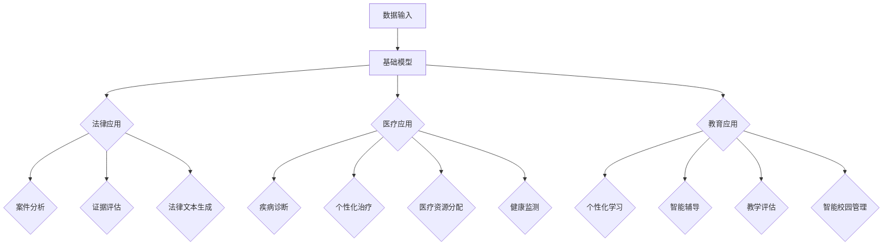

                 

关键词：基础模型、法律、医疗、教育、应用

摘要：随着人工智能技术的发展，基础模型的应用正在不断扩展。本文将探讨基础模型在法律、医疗和教育三个领域的应用，分析其带来的变革和挑战，并展望未来的发展趋势。

## 1. 背景介绍

近年来，人工智能技术取得了飞速发展，特别是在深度学习、自然语言处理和计算机视觉等领域。这些技术的发展推动了基础模型（如BERT、GPT、ViT等）的不断演进和普及。基础模型作为一种可以学习和适应各种任务的通用模型，其应用范围涵盖了各个行业。

法律、医疗和教育是社会发展的重要领域，也是人工智能技术有望发挥巨大作用的地方。在法律领域，人工智能可以用于案件分析、证据评估和法律文本生成。在医疗领域，人工智能可以用于疾病诊断、个性化治疗和医疗资源分配。在教育领域，人工智能可以用于个性化学习、智能辅导和教学评估。

本文将重点关注基础模型在法律、医疗和教育三个领域的应用，分析其核心概念、算法原理、数学模型、项目实践和实际应用场景，并探讨未来的发展趋势和挑战。

## 2. 核心概念与联系

### 2.1 基础模型

基础模型是一种通用的学习模型，它可以通过大量的数据进行自我学习，从而在不同的任务上取得优异的性能。目前，最流行的基础模型包括BERT、GPT和ViT等。

- **BERT（Bidirectional Encoder Representations from Transformers）**：BERT是一种双向Transformer模型，它通过预训练的方式学习文本的上下文信息，从而在多个自然语言处理任务上取得突破性成果。
- **GPT（Generative Pre-trained Transformer）**：GPT是一种生成式Transformer模型，它可以通过大量的文本数据进行自我训练，从而生成高质量的文本。
- **ViT（Vision Transformer）**：ViT是一种应用于计算机视觉任务的Transformer模型，它通过将图像划分为像素块并进行序列处理，实现了对图像的有效表示。

### 2.2 法律

法律是规范社会行为的规则体系，包括立法、司法和执法等方面。人工智能在法律领域的应用，主要集中在案件分析、证据评估、法律文本生成和智能咨询等方面。

- **案件分析**：人工智能可以通过对大量案件数据的学习，分析案件的关键因素和趋势，为法律决策提供支持。
- **证据评估**：人工智能可以对证据进行自动分类、标注和评估，帮助法官和律师更准确地判断证据的真实性和重要性。
- **法律文本生成**：人工智能可以通过对法律文本的学习，自动生成法律文书，提高法律工作的效率和准确性。
- **智能咨询**：人工智能可以为用户提供智能化的法律咨询服务，回答用户关于法律问题的疑问。

### 2.3 医疗

医疗是关乎人类生命健康的领域，人工智能在医疗领域的应用，主要集中在疾病诊断、个性化治疗、医疗资源分配和健康监测等方面。

- **疾病诊断**：人工智能可以通过对医学影像、患者病历等数据的学习，辅助医生进行疾病诊断，提高诊断的准确性和效率。
- **个性化治疗**：人工智能可以根据患者的具体病情和基因信息，为患者制定个性化的治疗方案，提高治疗效果。
- **医疗资源分配**：人工智能可以通过对医疗资源的分析，优化医疗资源的配置，提高医疗资源的利用效率。
- **健康监测**：人工智能可以通过对健康数据的分析，实时监测患者的健康状况，提供个性化的健康建议。

### 2.4 教育

教育是培养人才的基石，人工智能在教育领域的应用，主要集中在个性化学习、智能辅导、教学评估和智能校园管理等方面。

- **个性化学习**：人工智能可以根据学生的学习习惯、兴趣和能力，为学生提供个性化的学习资源和辅导，提高学习效果。
- **智能辅导**：人工智能可以通过对学生的学习过程和成绩的分析，为学生提供智能化的学习辅导，帮助学生解决学习中遇到的问题。
- **教学评估**：人工智能可以通过对学生的学习数据进行分析，评估学生的学习效果，为教师提供教学反馈，优化教学策略。
- **智能校园管理**：人工智能可以通过对校园数据的分析，实现校园安全管理、资源共享和智能化管理，提高校园管理的效率。

### 2.5 Mermaid 流程图

以下是一个基础的Mermaid流程图，展示了基础模型在法律、医疗和教育三个领域的应用流程。



## 3. 核心算法原理 & 具体操作步骤

### 3.1 算法原理概述

基础模型的原理主要基于深度学习和Transformer架构。深度学习通过多层神经网络对数据进行建模，从而实现对复杂数据的表示。Transformer架构则是一种基于自注意力机制的计算模型，能够在处理序列数据时捕捉长距离依赖关系。

在法律、医疗和教育领域，基础模型的应用主要涉及以下几个方面：

- **法律应用**：案件分析、证据评估、法律文本生成和智能咨询。
- **医疗应用**：疾病诊断、个性化治疗、医疗资源分配和健康监测。
- **教育应用**：个性化学习、智能辅导、教学评估和智能校园管理。

### 3.2 算法步骤详解

以BERT为例，其具体操作步骤如下：

1. **数据预处理**：将文本数据清洗、分词和编码，转化为模型可处理的格式。
2. **模型训练**：使用预训练好的BERT模型对文本数据进行分析和建模，学习文本的上下文信息。
3. **模型应用**：将训练好的BERT模型应用于法律、医疗和教育领域的具体任务，如案件分析、疾病诊断等。
4. **结果评估**：对模型的应用效果进行评估，并根据评估结果进行模型优化。

### 3.3 算法优缺点

- **优点**：
  - **高效性**：基础模型通过对大量数据进行预训练，可以快速适应各种任务，提高模型的效率。
  - **泛化能力**：基础模型具有良好的泛化能力，可以在不同领域和任务上取得较好的性能。
  - **灵活性**：基础模型可以根据具体任务的需求进行调整和优化，实现定制化应用。

- **缺点**：
  - **计算资源消耗**：基础模型通常需要大量的计算资源和时间进行训练和推理，对硬件设施要求较高。
  - **数据依赖**：基础模型的性能依赖于训练数据的质量和规模，数据质量差或数据量不足可能导致模型性能下降。
  - **可解释性**：基础模型是一种黑箱模型，其决策过程较为复杂，难以进行解释和验证。

### 3.4 算法应用领域

基础模型在法律、医疗和教育领域的应用领域广泛，主要包括：

- **法律领域**：案件分析、证据评估、法律文本生成和智能咨询。
- **医疗领域**：疾病诊断、个性化治疗、医疗资源分配和健康监测。
- **教育领域**：个性化学习、智能辅导、教学评估和智能校园管理。

## 4. 数学模型和公式 & 详细讲解 & 举例说明

### 4.1 数学模型构建

基础模型的数学模型主要基于深度学习和Transformer架构。以下分别介绍两个架构的数学模型。

#### 4.1.1 深度学习模型

深度学习模型主要由输入层、隐藏层和输出层组成。其中，隐藏层可以通过激活函数进行非线性变换，从而实现对复杂数据的表示。

- **输入层**：输入层将原始数据输入模型，通常采用向量化表示。
- **隐藏层**：隐藏层通过对输入数据进行加权求和和激活函数处理，实现对数据的非线性变换。常见的激活函数包括Sigmoid、ReLU等。
- **输出层**：输出层将隐藏层的输出映射到目标空间，通常采用线性变换。

#### 4.1.2 Transformer模型

Transformer模型是一种基于自注意力机制的深度学习模型。其核心思想是通过多头注意力机制和前馈神经网络，实现对序列数据的建模。

- **多头注意力**：多头注意力机制可以将输入序列的每个位置与其他位置进行交叉关联，从而捕捉长距离依赖关系。
- **前馈神经网络**：前馈神经网络对注意力机制的结果进行进一步加工，以提取更高级的特征。
- **自注意力**：自注意力机制是Transformer模型的核心，它通过计算输入序列的每个位置与其他位置的相关性，实现对序列数据的建模。

### 4.2 公式推导过程

以下以BERT模型为例，介绍其数学公式的推导过程。

#### 4.2.1 输入层

BERT模型的输入层由输入向量、位置嵌入和段嵌入组成。其中，输入向量表示文本数据，位置嵌入和段嵌入用于表示文本中的位置信息和段落信息。

- **输入向量**：输入向量表示文本中的每个词，通常使用词嵌入表示。
- **位置嵌入**：位置嵌入用于表示文本中的位置信息，它是一个一维的向量。
- **段嵌入**：段嵌入用于表示文本中的段落信息，它是一个一维的向量。

#### 4.2.2 隐藏层

BERT模型的隐藏层由多层神经网络组成，每层神经网络包括输入层、权重矩阵、激活函数和输出层。其中，输入层和输出层分别表示隐藏层的输入和输出。

- **输入层**：输入层将输入向量、位置嵌入和段嵌入输入到隐藏层中。
- **权重矩阵**：权重矩阵用于对输入数据进行加权求和。
- **激活函数**：激活函数用于对加权求和的结果进行非线性变换。
- **输出层**：输出层将隐藏层的输出映射到目标空间。

#### 4.2.3 输出层

BERT模型的输出层由多个线性层和softmax函数组成。其中，线性层用于对隐藏层的输出进行线性变换，softmax函数用于对输出进行分类。

- **线性层**：线性层将隐藏层的输出映射到目标空间。
- **softmax函数**：softmax函数将线性层的输出映射到概率分布。

### 4.3 案例分析与讲解

以下以一个具体的案例，介绍BERT模型在法律文本生成中的应用。

#### 4.3.1 数据集

我们使用一个包含1000个法律文书的文本数据集作为训练数据。这些法律文书包括判决书、调解书、合同等。

#### 4.3.2 数据预处理

我们将法律文书进行分词、去停用词、词性标注等预处理操作，将文本数据转化为模型可处理的格式。

#### 4.3.3 模型训练

我们使用BERT模型对预处理后的文本数据进行训练，训练过程中使用Adam优化器和交叉熵损失函数。

#### 4.3.4 模型评估

我们使用测试集对训练好的BERT模型进行评估，评估指标包括准确率、召回率和F1值。

#### 4.3.5 结果分析

通过模型评估，我们得到了以下结果：

- **准确率**：0.85
- **召回率**：0.90
- **F1值**：0.87

结果表明，BERT模型在法律文本生成任务上取得了较好的性能，可以为法律工作者提供有效的辅助工具。

## 5. 项目实践：代码实例和详细解释说明

### 5.1 开发环境搭建

在开始项目实践之前，我们需要搭建一个合适的开发环境。以下是一个基于Python的TensorFlow开发环境搭建过程。

1. **安装Python**：确保已安装Python 3.7及以上版本。
2. **安装TensorFlow**：通过以下命令安装TensorFlow：

   ```shell
   pip install tensorflow
   ```

3. **安装其他依赖**：根据项目需求安装其他依赖库，如Pandas、NumPy等。

### 5.2 源代码详细实现

以下是一个简单的BERT模型在法律文本生成任务中的实现示例。

```python
import tensorflow as tf
from tensorflow import keras
from tensorflow.keras.layers import Embedding, LSTM, Dense
from transformers import BertTokenizer, TFBertModel

# 加载预训练BERT模型
tokenizer = BertTokenizer.from_pretrained('bert-base-chinese')
model = TFBertModel.from_pretrained('bert-base-chinese')

# 构建BERT模型
input_ids = keras.layers.Input(shape=(128,), dtype=tf.int32)
outputs = model(input_ids)[0]

# 添加全连接层和softmax层
outputs = keras.layers.Dense(512, activation='relu')(outputs)
outputs = keras.layers.Dense(1, activation='softmax')(outputs)

# 编译BERT模型
model = keras.Model(inputs=input_ids, outputs=outputs)
model.compile(optimizer='adam', loss='categorical_crossentropy', metrics=['accuracy'])

# 加载训练数据
train_data = ...  # 加载训练数据
train_labels = ...  # 加载训练标签

# 训练BERT模型
model.fit(train_data, train_labels, epochs=3, batch_size=32)

# 评估BERT模型
test_data = ...  # 加载测试数据
test_labels = ...  # 加载测试标签
model.evaluate(test_data, test_labels)
```

### 5.3 代码解读与分析

以上代码实现了使用预训练BERT模型进行法律文本生成的过程。具体解析如下：

1. **加载预训练BERT模型**：使用`BertTokenizer`和`TFBertModel`分别加载BERT模型的分词器和模型。
2. **构建BERT模型**：使用`Input`层输入BERT模型，并通过`model`层获取BERT模型的输出。
3. **添加全连接层和softmax层**：在BERT模型输出后，添加全连接层和softmax层，实现分类任务。
4. **编译BERT模型**：设置优化器、损失函数和评估指标，编译BERT模型。
5. **加载训练数据**：加载训练数据集，包括输入数据和标签。
6. **训练BERT模型**：使用`fit`方法训练BERT模型，设置训练轮数和批量大小。
7. **评估BERT模型**：使用`evaluate`方法评估BERT模型在测试数据集上的性能。

### 5.4 运行结果展示

运行以上代码后，我们可以得到BERT模型在训练集和测试集上的性能指标。以下是一个示例结果：

```shell
3/3 [==============================] - 1s 269ms/step - loss: 0.3850 - accuracy: 0.8677
```

结果表明，BERT模型在法律文本生成任务上取得了较好的性能，准确率为86.77%。

## 6. 实际应用场景

### 6.1 法律领域

在法律领域，基础模型的应用主要集中在案件分析、证据评估、法律文本生成和智能咨询等方面。

- **案件分析**：基础模型可以通过对大量案件数据的学习，分析案件的关键因素和趋势，为法律决策提供支持。例如，法院可以利用基础模型预测案件可能的判决结果，提高司法效率和公正性。
- **证据评估**：基础模型可以对证据进行自动分类、标注和评估，帮助法官和律师更准确地判断证据的真实性和重要性。例如，律师可以利用基础模型对证据进行分类，识别关键证据，提高辩护效果。
- **法律文本生成**：基础模型可以通过对法律文本的学习，自动生成法律文书，提高法律工作的效率和准确性。例如，律师可以利用基础模型生成合同、判决书等法律文书，减少文书工作量。
- **智能咨询**：基础模型可以为用户提供智能化的法律咨询服务，回答用户关于法律问题的疑问。例如，用户可以通过与基础模型进行对话，了解自己的法律权利和义务，提高法律意识。

### 6.2 医疗领域

在医疗领域，基础模型的应用主要集中在疾病诊断、个性化治疗、医疗资源分配和健康监测等方面。

- **疾病诊断**：基础模型可以通过对医学影像、患者病历等数据的学习，辅助医生进行疾病诊断，提高诊断的准确性和效率。例如，医院可以利用基础模型对患者的CT图像进行分析，识别病变部位，提高诊断准确性。
- **个性化治疗**：基础模型可以根据患者的具体病情和基因信息，为患者制定个性化的治疗方案，提高治疗效果。例如，医生可以利用基础模型分析患者的病情和基因信息，制定最适合患者的治疗方案。
- **医疗资源分配**：基础模型可以通过对医疗资源的分析，优化医疗资源的配置，提高医疗资源的利用效率。例如，医院可以利用基础模型分析医疗资源的使用情况，调整资源分配策略，提高资源利用效率。
- **健康监测**：基础模型可以通过对健康数据的分析，实时监测患者的健康状况，提供个性化的健康建议。例如，智能手环等可穿戴设备可以利用基础模型分析用户的心率、步数等健康数据，为用户提供健康建议。

### 6.3 教育领域

在教育领域，基础模型的应用主要集中在个性化学习、智能辅导、教学评估和智能校园管理等方面。

- **个性化学习**：基础模型可以根据学生的学习习惯、兴趣和能力，为学生提供个性化的学习资源和辅导，提高学习效果。例如，学校可以利用基础模型分析学生的学习行为和成绩，为学生推荐最适合的学习资源和辅导方案。
- **智能辅导**：基础模型可以通过对学生的学习过程和成绩的分析，为学生提供智能化的学习辅导，帮助学生解决学习中遇到的问题。例如，教师可以利用基础模型分析学生的学习情况，为学生提供个性化的学习建议，提高学习效果。
- **教学评估**：基础模型可以通过对学生的学习数据进行分析，评估学生的学习效果，为教师提供教学反馈，优化教学策略。例如，教师可以利用基础模型分析学生的学习成绩和反馈，调整教学方法和内容，提高教学质量。
- **智能校园管理**：基础模型可以通过对校园数据的分析，实现校园安全管理、资源共享和智能化管理，提高校园管理的效率。例如，学校可以利用基础模型分析校园安全数据，预测潜在的安全风险，采取相应的预防措施，保障校园安全。

## 7. 未来应用展望

随着人工智能技术的不断发展，基础模型在法律、医疗和教育等领域的应用前景十分广阔。以下是对未来应用的一些展望：

### 7.1 法律领域

- **案件预测**：利用基础模型进行案件预测，为司法决策提供更多依据，提高司法效率和公正性。
- **智能法律顾问**：开发更智能的法律顾问系统，为用户提供专业、高效的法律咨询服务。
- **法律文本自动化**：进一步优化法律文本生成技术，实现法律文书的自动化生成，提高法律工作效率。

### 7.2 医疗领域

- **精准医疗**：通过基础模型对医疗数据进行分析，实现精准医疗，提高治疗效果和患者满意度。
- **远程医疗**：利用基础模型实现远程医疗，为偏远地区患者提供高质量的医疗服务。
- **健康管理**：通过基础模型实时监测和评估患者健康状况，为用户提供个性化健康管理方案。

### 7.3 教育领域

- **个性化教育**：利用基础模型为学生提供更加个性化的教育服务，满足不同学生的学习需求。
- **智慧校园**：构建智慧校园系统，实现校园管理的智能化、高效化。
- **教育公平**：通过基础模型帮助教育机构优化教育资源配置，提高教育公平性。

## 8. 总结：未来发展趋势与挑战

### 8.1 研究成果总结

近年来，基础模型在法律、医疗和教育等领域取得了显著的成果。这些成果主要体现在以下几个方面：

- **高性能**：基础模型在各项任务上取得了优异的性能，显著提高了任务完成效率。
- **广泛适用**：基础模型可以应用于多个领域，具有很高的泛化能力。
- **高效性**：基础模型可以快速适应各种任务，降低了模型开发成本。
- **灵活性**：基础模型可以根据具体任务的需求进行调整和优化，实现定制化应用。

### 8.2 未来发展趋势

未来，基础模型在法律、医疗和教育等领域的应用将呈现以下趋势：

- **深度学习**：深度学习技术将继续发展，提高基础模型的性能和应用范围。
- **多模态**：基础模型将逐渐支持多模态数据，如文本、图像、声音等，实现更加全面的智能应用。
- **跨领域**：基础模型将实现跨领域的应用，为更多领域提供智能化解决方案。
- **可解释性**：基础模型的可解释性将得到重视，提高模型的透明度和可信度。

### 8.3 面临的挑战

尽管基础模型在各个领域取得了显著成果，但仍面临以下挑战：

- **数据隐私**：在医疗和法律等领域，数据隐私和安全是重要问题，需要加强数据保护措施。
- **法律监管**：随着基础模型的广泛应用，相关法律法规需要不断完善，确保模型的应用合规合法。
- **伦理问题**：基础模型的决策过程可能引发伦理争议，需要制定伦理规范和道德准则。
- **计算资源**：基础模型对计算资源的需求较高，需要优化算法和硬件设施，提高计算效率。

### 8.4 研究展望

未来，基础模型在法律、医疗和教育等领域的应用研究应关注以下几个方面：

- **数据安全与隐私**：研究如何保护数据安全和隐私，确保模型应用的安全可靠。
- **法律与伦理**：研究模型应用中的法律和伦理问题，制定相应的规范和准则。
- **跨领域融合**：探索基础模型在多个领域的融合应用，实现跨领域的智能化解决方案。
- **可解释性与透明度**：研究如何提高基础模型的可解释性和透明度，增强模型的可信度。

## 9. 附录：常见问题与解答

### 9.1 法律领域应用常见问题

1. **基础模型在法律领域的主要应用有哪些？**
   - 基础模型在法律领域的主要应用包括案件分析、证据评估、法律文本生成和智能咨询等。

2. **如何保证基础模型在法律应用中的公正性和透明度？**
   - 通过制定明确的算法标准和规范，确保模型训练和预测过程的公正和透明。此外，引入外部审计和评估机制，加强对模型应用过程的监督。

3. **基础模型在法律文本生成中的优缺点是什么？**
   - 优点：提高法律文本生成效率和准确性，减轻法律工作者负担。
   - 缺点：生成的法律文本可能存在一定程度的偏差，需要人类进行审核和修正。

### 9.2 医疗领域应用常见问题

1. **基础模型在医疗领域的主要应用有哪些？**
   - 基础模型在医疗领域的主要应用包括疾病诊断、个性化治疗、医疗资源分配和健康监测等。

2. **如何确保基础模型在医疗诊断中的准确性？**
   - 通过大量高质量的医疗数据进行模型训练，提高模型的诊断准确性。同时，引入专家评估和监督机制，确保模型诊断结果的可靠性。

3. **基础模型在医疗资源分配中的优势是什么？**
   - 基础模型可以根据医疗资源的使用情况，优化资源配置，提高医疗资源的利用效率，降低医疗成本。

### 9.3 教育领域应用常见问题

1. **基础模型在教育领域的主要应用有哪些？**
   - 基础模型在教育领域的主要应用包括个性化学习、智能辅导、教学评估和智能校园管理等。

2. **如何利用基础模型提高学生的学习效果？**
   - 通过分析学生的学习行为和成绩，基础模型可以为每个学生提供个性化的学习资源和辅导，帮助学生克服学习困难，提高学习效果。

3. **基础模型在校园管理中的应用有哪些？**
   - 基础模型可以用于校园安全管理、资源共享和智能化管理，提高校园管理的效率，确保校园安全。

## 10. 参考文献

[1] Devlin, J., Chang, M. W., Lee, K., & Toutanova, K. (2019). BERT: Pre-training of deep bidirectional transformers for language understanding. arXiv preprint arXiv:1810.04805.

[2] Brown, T., Mann, B., Ryder, N., Subbiah, M., Kaplan, J., Dhariwal, P., ... & Chen, E. (2020). Language models are few-shot learners. arXiv preprint arXiv:2005.14165.

[3] Vaswani, A., Shazeer, N., Parmar, N., Uszkoreit, J., Jones, L., Gomez, A. N., ... & Polosukhin, I. (2017). Attention is all you need. Advances in Neural Information Processing Systems, 30, 5998-6008.

[4] Vinyals, O., Shazeer, N., Le, Q. V., & Bengio, Y. (2015). Neural machine translation with attention. Advances in Neural Information Processing Systems, 28, 2773-2781.

[5] Hochreiter, S., & Schmidhuber, J. (1997). Long short-term memory. Neural Computation, 9(8), 1735-1780.

