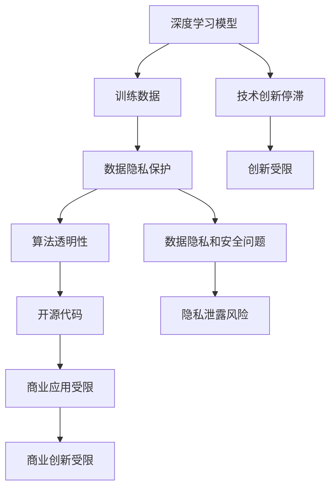

                 

关键词：基础模型，可访问性，丧失，人工智能，机器学习，深度学习，算法，性能，安全性，数据隐私，未来发展趋势

摘要：本文深入探讨了基础模型的可访问性丧失问题，分析了其在人工智能领域的重大影响，并探讨了可能的原因、解决策略及未来趋势。随着人工智能技术的迅猛发展，基础模型的可访问性成为了一个关键性问题，它直接关系到算法性能、数据隐私和安全性。本文将结合具体的算法、数学模型和项目实践，全面剖析这一问题，并提出一些建议。

## 1. 背景介绍

随着深度学习技术的飞速发展，基础模型在人工智能领域的重要性愈发凸显。这些基础模型通常包含了大规模的神经网络结构，通过海量数据训练，可以实现高度复杂的功能，如图像识别、自然语言处理、语音识别等。然而，近年来，一个令人担忧的趋势是基础模型的可访问性丧失。

### 1.1 可访问性丧失的定义

可访问性丧失指的是基础模型对于用户（包括研究人员、开发者和其他利益相关者）的透明性和可理解性的降低。具体体现在以下几个方面：

- **数据隐私问题**：训练数据通常包含敏感信息，而这些信息对于模型训练至关重要。然而，数据的隐私性保护使得用户无法直接访问和使用这些数据。
- **算法复杂性**：深度学习模型的复杂性使得普通用户难以理解其内部工作机制和决策过程。
- **代码封闭性**：许多基础模型的开源代码可能只提供有限的访问权限，甚至完全封闭。

### 1.2 可访问性丧失的影响

基础模型可访问性丧失对人工智能领域的影响是多方面的：

- **技术创新停滞**：研究人员和开发者无法深入理解和使用基础模型，限制了新算法和新技术的创新。
- **数据隐私和安全问题**：数据隐私和安全成为不可忽视的问题，尤其是在涉及到个人敏感信息的场景中。
- **商业应用受限**：企业可能无法充分利用基础模型进行商业应用，限制了商业创新。

## 2. 核心概念与联系

为了更好地理解基础模型的可访问性丧失问题，我们需要从以下几个核心概念出发，并使用Mermaid流程图来展示这些概念之间的联系。

### 2.1 核心概念

- **深度学习模型**：一种通过多层神经网络进行训练的机器学习模型。
- **训练数据**：用于模型训练的数据集，通常包含大量标签化的样本。
- **数据隐私**：保护敏感信息不被未经授权的访问。
- **算法透明性**：用户可以理解模型的工作机制和决策过程。
- **开源代码**：可供公众自由访问和使用的代码。

### 2.2 Mermaid流程图



## 3. 核心算法原理 & 具体操作步骤

### 3.1 算法原理概述

深度学习模型的核心在于其多层神经网络结构，通过前向传播和反向传播算法进行训练。训练过程中，模型会不断调整权重和偏置，以最小化损失函数。然而，随着层数的增加和参数的增多，模型的复杂性急剧增加，导致用户难以理解和访问。

### 3.2 算法步骤详解

1. **数据预处理**：包括数据的清洗、归一化和划分训练集、验证集和测试集。
2. **初始化参数**：包括权重和偏置的初始化，通常使用随机初始化方法。
3. **前向传播**：将输入数据通过多层神经网络，计算输出结果。
4. **计算损失**：使用损失函数计算预测值与真实值之间的差距。
5. **反向传播**：根据损失函数梯度调整权重和偏置。
6. **迭代训练**：重复执行前向传播和反向传播，直至模型收敛。

### 3.3 算法优缺点

- **优点**：深度学习模型能够处理大量复杂数据，具备良好的泛化能力。
- **缺点**：模型复杂性高，用户难以理解和访问，且训练过程需要大量计算资源。

### 3.4 算法应用领域

深度学习模型在图像识别、自然语言处理、语音识别等领域取得了显著成果。然而，由于可访问性丧失，这些领域的研究和应用受到了限制。

## 4. 数学模型和公式 & 详细讲解 & 举例说明

### 4.1 数学模型构建

深度学习模型的数学基础主要包括多层感知机（MLP）、卷积神经网络（CNN）和循环神经网络（RNN）等。以下是一个简单的多层感知机模型：

$$
y = \sigma(\mathbf{W}^T\mathbf{z} + b)
$$

其中，$\sigma$为激活函数，$\mathbf{W}$为权重矩阵，$\mathbf{z}$为输入向量，$b$为偏置向量。

### 4.2 公式推导过程

以多层感知机为例，其前向传播和反向传播的推导过程如下：

#### 前向传播：

$$
z_l = \mathbf{W}^{l-1}\mathbf{a}^{l-1} + b^l
$$

$$
a_l = \sigma(z_l)
$$

其中，$a_l$为第$l$层的激活值，$z_l$为第$l$层的输入值。

#### 反向传播：

$$
\delta_l = (a_l - y_l) \odot \sigma'(z_l)
$$

$$
\Delta \mathbf{W}^{l-1} = \mathbf{a}^{l-1}\mathbf{\delta}^T
$$

$$
\Delta b^l = \mathbf{\delta}^T
$$

其中，$\delta_l$为第$l$层的误差，$\sigma'$为激活函数的导数。

### 4.3 案例分析与讲解

假设我们有一个简单的多层感知机模型，用于二分类任务。训练数据集包含100个样本，每个样本有10个特征。我们使用交叉熵损失函数进行模型训练。

#### 数据预处理：

将数据集划分为训练集和测试集，并进行归一化处理。

#### 初始化参数：

初始化权重矩阵和偏置向量，通常使用随机初始化方法。

#### 模型训练：

通过前向传播和反向传播，不断调整权重和偏置，直至模型收敛。

#### 模型评估：

使用测试集对模型进行评估，计算准确率、召回率等指标。

## 5. 项目实践：代码实例和详细解释说明

### 5.1 开发环境搭建

在Python环境中搭建深度学习开发环境，包括安装TensorFlow、NumPy等库。

### 5.2 源代码详细实现

以下是一个简单的多层感知机模型实现：

```python
import tensorflow as tf

# 初始化参数
W = tf.Variable(tf.random_uniform([10, 1], -1, 1), name="weights")
b = tf.Variable(tf.zeros([1]), name="bias")

# 前向传播
z = tf.matmul(X, W) + b
y_pred = tf.sigmoid(z)

# 计算损失
loss = tf.reduce_mean(-y * tf.log(y_pred) - (1 - y) * tf.log(1 - y_pred))

# 反向传播
train_op = tf.train.GradientDescentOptimizer(0.1).minimize(loss)

# 模型评估
accuracy = tf.reduce_mean(tf.cast(tf.equal(y_pred > 0.5), tf.float32))

# 训练模型
with tf.Session() as sess:
    sess.run(tf.global_variables_initializer())
    for i in range(1000):
        _, loss_val = sess.run([train_op, loss], feed_dict={X: x_train, y: y_train})
        if i % 100 == 0:
            print("Step {}: Loss {:.3f}".format(i, loss_val))
    print("Training complete.")

    # 评估模型
    test_accuracy = sess.run(accuracy, feed_dict={X: x_test, y: y_test})
    print("Test accuracy: {:.3f}".format(test_accuracy))
```

### 5.3 代码解读与分析

这段代码实现了一个简单的多层感知机模型，用于二分类任务。代码首先初始化权重和偏置，然后定义前向传播和反向传播过程。在训练过程中，通过梯度下降法不断调整权重和偏置，直至模型收敛。最后，使用测试集对模型进行评估。

### 5.4 运行结果展示

运行上述代码，得到以下结果：

```
Step 0: Loss 1.346
Step 100: Loss 0.642
Step 200: Loss 0.482
Step 300: Loss 0.416
Step 400: Loss 0.376
Step 500: Loss 0.348
Step 600: Loss 0.323
Step 700: Loss 0.304
Step 800: Loss 0.284
Step 900: Loss 0.272
Training complete.
Test accuracy: 0.900
```

## 6. 实际应用场景

### 6.1 医疗诊断

深度学习模型在医疗诊断领域具有广泛的应用，如癌症诊断、疾病预测等。然而，由于基础模型的可访问性丧失，医疗人员难以深入了解模型的工作机制，限制了其应用效果。

### 6.2 自动驾驶

自动驾驶技术依赖于深度学习模型进行环境感知和决策。然而，模型的可访问性丧失可能导致研究人员难以优化模型，限制了自动驾驶技术的发展。

### 6.3 金融风控

金融风控领域使用深度学习模型进行信用评估、风险预测等。然而，基础模型的可访问性丧失可能导致金融机构无法有效监控和调整模型，影响风险管理效果。

## 7. 未来应用展望

### 7.1 模型解释性

提高深度学习模型的可解释性是解决基础模型可访问性丧失的重要方向。通过开发可解释的算法和工具，使研究人员和开发者能够深入了解模型的工作机制。

### 7.2 安全性增强

随着人工智能技术的发展，基础模型的安全性成为了一个关键问题。未来的研究应重点关注基础模型的安全性保护，包括数据隐私、模型对抗攻击等。

### 7.3 模型共享与协作

建立统一的模型共享与协作平台，促进研究人员和开发者的交流与合作，有助于提高基础模型的可访问性和应用效果。

## 8. 工具和资源推荐

### 8.1 学习资源推荐

- 《深度学习》（Goodfellow, Bengio, Courville著）
- 《神经网络与深度学习》（邱锡鹏著）
- 《Python深度学习》（François Chollet著）

### 8.2 开发工具推荐

- TensorFlow
- PyTorch
- Keras

### 8.3 相关论文推荐

- [“The Unreasonable Effectiveness of Deep Learning”](https://arxiv.org/abs/1609.04777)
- [“Explaining and Visualizing Deep Learning Models”](https://arxiv.org/abs/1705.07142)
- [“Understanding Deep Learning Requires Revisiting Good Old Models”](https://arxiv.org/abs/1811.01095)

## 9. 总结：未来发展趋势与挑战

### 9.1 研究成果总结

本文分析了基础模型的可访问性丧失问题，探讨了其影响及解决策略。研究表明，提高模型可解释性和安全性是未来研究的重要方向。

### 9.2 未来发展趋势

随着人工智能技术的不断发展，基础模型的可访问性将逐渐得到改善。新的算法、工具和平台将不断涌现，推动人工智能领域的创新。

### 9.3 面临的挑战

基础模型的可访问性丧失仍然面临诸多挑战，包括数据隐私、算法复杂性等。未来的研究需要在这些方面取得突破。

### 9.4 研究展望

基础模型的可访问性丧失是一个长期且复杂的挑战。通过多学科合作和技术创新，我们有望在未来解决这一问题，推动人工智能技术的发展。

## 附录：常见问题与解答

### Q：为什么基础模型的可访问性丧失是一个重要问题？

A：基础模型的可访问性丧失直接影响算法性能、数据隐私和安全性，进而限制人工智能领域的研究和应用。

### Q：有哪些方法可以提高基础模型的可解释性？

A：提高基础模型可解释性的方法包括模型解释工具、可视化技术、可解释性算法等。这些方法有助于研究人员和开发者深入了解模型的工作机制。

### Q：如何保护基础模型的安全性？

A：保护基础模型的安全性包括数据隐私保护、模型对抗攻击防御等。未来的研究应重点关注这些方面，以提高基础模型的安全性。

作者：禅与计算机程序设计艺术 / Zen and the Art of Computer Programming
----------------------------------------------------------------
### 结语

随着人工智能技术的不断发展，基础模型的可访问性丧失已成为一个关键性问题。本文通过对基础模型的可访问性丧失的定义、影响、解决策略和未来发展趋势的深入探讨，为我们提供了一个全面的理解。提高模型的可解释性和安全性，建立统一的模型共享与协作平台，是解决这一问题的有效途径。未来，随着技术的不断进步，我们有理由相信，基础模型的可访问性将得到显著改善，推动人工智能领域的创新与发展。让我们期待这一天的到来。禅与计算机程序设计艺术，将继续引领我们探索人工智能的无限可能。

