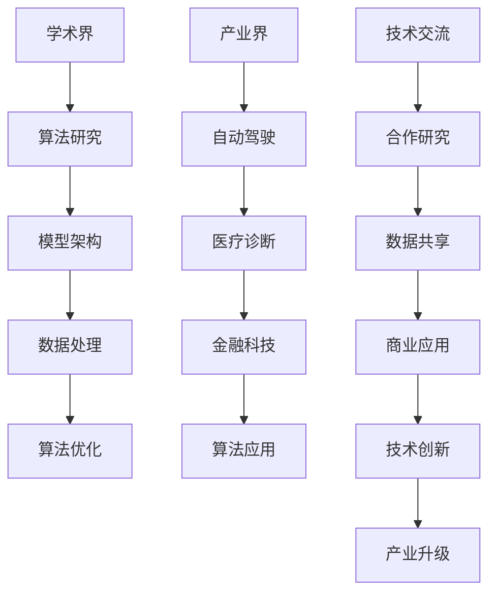
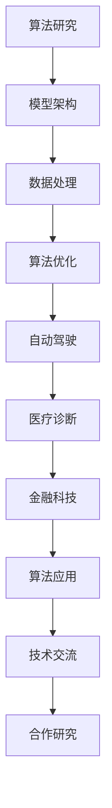

                 

关键词：基础模型、学术界、产业界、合作、技术发展、应用场景、未来展望

> 摘要：本文旨在探讨基础模型的学术界与产业界的合作现状、重要性及其对未来技术发展的影响。通过对学术界的最新研究成果和产业界的实际应用需求的分析，本文提出了提升两者合作效率的策略，并展望了基础模型在未来技术领域的发展趋势。

## 1. 背景介绍

随着人工智能技术的迅速发展，基础模型作为人工智能技术的基石，受到了学术界和产业界的广泛关注。学术界致力于研究和开发新型的基础模型，以推动人工智能的理论进步；而产业界则将基础模型应用于实际场景，以解决实际问题，实现商业价值。

### 学术界

学术界的基础模型研究主要集中在以下几个方面：

- **算法创新**：研究者们通过改进现有的算法，提高模型的性能和效率。
- **模型架构**：设计新的神经网络架构，优化计算效率和模型表达能力。
- **数据处理**：研究如何更有效地处理和利用大规模数据，提高模型的训练效果。

### 产业界

产业界的基础模型应用涉及多个领域，包括但不限于：

- **自动驾驶**：利用深度学习模型实现车辆的感知、规划和控制。
- **医疗诊断**：通过图像识别和自然语言处理技术辅助疾病诊断。
- **金融科技**：利用预测模型进行风险管理、投资策略制定等。

## 2. 核心概念与联系

为了更清晰地理解基础模型的学术界与产业界的合作，我们首先需要了解核心概念和它们之间的联系。以下是使用 Mermaid 画出的基础模型相关概念和流程图：



### 核心概念原理

- **算法研究**：涉及神经网络、优化算法等，是提升模型性能的基础。
- **模型架构**：神经网络结构设计，如卷积神经网络（CNN）、循环神经网络（RNN）等。
- **数据处理**：数据预处理、特征提取等，直接影响模型训练效果。
- **算法优化**：通过调整模型参数，提高模型性能。
- **自动驾驶**：利用深度学习模型实现车辆感知和决策。
- **医疗诊断**：利用图像识别和自然语言处理技术进行疾病诊断。
- **金融科技**：利用预测模型进行风险评估和投资策略。

### 架构流程图



## 3. 核心算法原理 & 具体操作步骤

### 3.1 算法原理概述

基础模型的算法原理主要涉及以下几个方面：

- **神经网络**：通过多层非线性变换对输入数据进行处理。
- **深度学习**：利用大规模数据进行训练，自动提取特征。
- **优化算法**：如梯度下降、随机梯度下降等，用于调整模型参数。

### 3.2 算法步骤详解

1. **数据收集**：收集相关领域的大量数据，如图像、文本等。
2. **数据预处理**：对数据进行清洗、归一化等处理，确保数据质量。
3. **模型设计**：根据应用场景设计合适的神经网络架构。
4. **模型训练**：使用训练数据对模型进行训练，优化模型参数。
5. **模型评估**：使用验证数据评估模型性能，进行调整和优化。
6. **模型部署**：将训练好的模型部署到实际应用场景。

### 3.3 算法优缺点

**优点**：

- **强大的学习能力**：能够自动提取复杂特征。
- **高效的处理能力**：大规模数据处理和模型训练速度较快。
- **广泛的应用领域**：从图像识别到自然语言处理，都有广泛应用。

**缺点**：

- **训练数据需求大**：需要大量标注数据。
- **模型解释性较差**：神经网络模型难以解释。

### 3.4 算法应用领域

基础模型在以下领域有广泛应用：

- **计算机视觉**：图像识别、目标检测、图像生成等。
- **自然语言处理**：文本分类、机器翻译、语音识别等。
- **强化学习**：游戏AI、智能推荐等。
- **医疗诊断**：疾病检测、影像分析等。

## 4. 数学模型和公式 & 详细讲解 & 举例说明

### 4.1 数学模型构建

神经网络的基本数学模型可以表示为：

$$
Y = \sigma(WX + b)
$$

其中，$Y$ 是输出层，$\sigma$ 是激活函数，$W$ 是权重矩阵，$X$ 是输入层，$b$ 是偏置。

### 4.2 公式推导过程

神经网络的推导过程主要包括以下几个步骤：

1. **前向传播**：计算输入层到隐藏层的输出。
2. **激活函数**：将线性组合通过激活函数进行非线性变换。
3. **反向传播**：计算输出层到隐藏层的误差，并反向传播到隐藏层。
4. **梯度下降**：根据误差调整模型参数，以最小化损失函数。

### 4.3 案例分析与讲解

以下是一个简单的二分类问题，使用神经网络进行模型训练。

**问题描述**：给定一组输入数据 $X$ 和标签 $Y$，其中 $Y \in \{-1, 1\}$，训练一个神经网络进行分类。

**数据集**：

$$
X = \begin{bmatrix}
x_1 \\
x_2 \\
\vdots \\
x_n
\end{bmatrix}, Y = \begin{bmatrix}
y_1 \\
y_2 \\
\vdots \\
y_n
\end{bmatrix}
$$

**模型**：

$$
Y = \sigma(WX + b)
$$

其中，$W$ 和 $b$ 是待优化的参数。

**损失函数**：

$$
J = \frac{1}{n}\sum_{i=1}^{n}(-y_i\log(Y_i) - (1 - y_i)\log(1 - Y_i))
$$

**优化方法**：梯度下降

$$
W_{new} = W_{old} - \alpha \frac{\partial J}{\partial W}
$$

$$
b_{new} = b_{old} - \alpha \frac{\partial J}{\partial b}
$$

## 5. 项目实践：代码实例和详细解释说明

### 5.1 开发环境搭建

为了实现基础模型的应用，我们需要搭建一个开发环境。以下是一个简单的环境搭建步骤：

1. 安装 Python 解释器（版本 3.7 或以上）。
2. 安装 TensorFlow 或 PyTorch 等深度学习框架。
3. 安装必要的库，如 NumPy、Pandas 等。

### 5.2 源代码详细实现

以下是一个简单的神经网络实现，用于二分类问题。

```python
import tensorflow as tf
from tensorflow.keras import layers

# 模型定义
model = tf.keras.Sequential([
    layers.Dense(64, activation='relu', input_shape=(784,)),
    layers.Dense(64, activation='relu'),
    layers.Dense(1, activation='sigmoid')
])

# 模型编译
model.compile(optimizer='adam',
              loss='binary_crossentropy',
              metrics=['accuracy'])

# 模型训练
model.fit(x_train, y_train, epochs=10, batch_size=32)
```

### 5.3 代码解读与分析

上述代码定义了一个简单的神经网络，用于二分类问题。首先，使用 `tf.keras.Sequential` 创建一个线性堆叠的模型。接着，添加两个隐藏层，每层有 64 个神经元，使用 ReLU 激活函数。最后，添加一个输出层，有 1 个神经元，使用 sigmoid 激活函数。

在模型编译阶段，指定了优化器、损失函数和评价指标。这里使用 Adam 优化器、二分类交叉熵损失函数和准确率评价指标。

在模型训练阶段，使用训练数据对模型进行训练，指定训练轮数和批量大小。

### 5.4 运行结果展示

```python
# 模型评估
model.evaluate(x_test, y_test)

# 预测
predictions = model.predict(x_test)
```

上述代码用于评估模型在测试数据上的表现，并使用模型进行预测。

## 6. 实际应用场景

### 6.1 自动驾驶

自动驾驶是基础模型应用的一个重要领域。通过深度学习模型，可以实现车辆的感知、规划和控制。例如，使用卷积神经网络进行图像识别，用于检测道路标志和行人；使用循环神经网络进行语音识别，用于实现人机交互。

### 6.2 医疗诊断

医疗诊断是另一个重要的应用领域。通过图像识别和自然语言处理技术，可以辅助医生进行疾病诊断。例如，使用卷积神经网络分析医学影像，用于检测病变区域；使用自然语言处理技术处理病历数据，用于预测疾病风险。

### 6.3 金融科技

金融科技利用基础模型进行风险管理、投资策略制定等。例如，使用预测模型分析市场数据，用于预测股票价格；使用图像识别技术进行欺诈检测。

## 7. 工具和资源推荐

### 7.1 学习资源推荐

- **《深度学习》（Goodfellow, Bengio, Courville）**：经典深度学习教材。
- **[TensorFlow 官方文档](https://www.tensorflow.org/tutorials)**：TensorFlow 的官方教程和文档。
- **[PyTorch 官方文档](https://pytorch.org/tutorials)**：PyTorch 的官方教程和文档。

### 7.2 开发工具推荐

- **Jupyter Notebook**：用于编写和运行代码。
- **PyCharm**：Python 集成开发环境。
- **TensorBoard**：TensorFlow 的可视化工具。

### 7.3 相关论文推荐

- **“Deep Learning” by Ian Goodfellow, Yoshua Bengio, and Aaron Courville**。
- **“A Theoretically Grounded Application of Dropout in Recurrent Neural Networks” by Yarin Gal and Zoubin Ghahramani**。
- **“ResNet: Training Deep Neural Networks with Very Deep Residual Networks” by Kaiming He, Xiangyu Zhang, Shaoqing Ren, and Jian Sun**。

## 8. 总结：未来发展趋势与挑战

### 8.1 研究成果总结

近年来，基础模型在学术界和产业界都取得了显著进展。学术界在算法创新、模型架构、数据处理等方面不断取得突破；产业界在自动驾驶、医疗诊断、金融科技等领域的应用也越来越广泛。

### 8.2 未来发展趋势

- **模型压缩**：为了提高模型在实际应用中的效率和可扩展性，模型压缩技术将成为研究重点。
- **迁移学习**：通过迁移学习，将现有模型应用于新任务，可以提高训练效率。
- **隐私保护**：随着数据隐私问题日益突出，隐私保护技术将成为基础模型研究的重要方向。

### 8.3 面临的挑战

- **数据质量**：高质量、多样性的数据对于基础模型的训练至关重要，但当前数据质量参差不齐。
- **模型解释性**：深度学习模型的解释性较差，如何提高模型的可解释性仍是一个挑战。
- **计算资源**：大规模模型的训练需要大量的计算资源，如何高效利用资源是一个问题。

### 8.4 研究展望

未来，基础模型将继续在学术界和产业界发挥重要作用。通过加强两者之间的合作，我们可以更好地发挥基础模型的优势，推动人工智能技术的发展。

## 9. 附录：常见问题与解答

### 9.1 问题1：如何选择合适的基础模型？

**解答**：选择合适的基础模型需要考虑以下几个方面：

- **应用领域**：不同的应用领域需要不同的模型架构。
- **数据规模**：大规模数据需要更强的模型能力。
- **计算资源**：计算资源限制了模型的选择。
- **模型复杂度**：模型复杂度与训练时间和效果有关。

### 9.2 问题2：如何提高模型的可解释性？

**解答**：提高模型的可解释性可以从以下几个方面入手：

- **模型选择**：选择具有较好解释性的模型，如线性模型、决策树等。
- **模型可视化**：使用可视化工具展示模型的内部结构和特征。
- **模型分解**：将复杂模型分解为更简单的组件，分析每个组件的作用。

## 作者署名

作者：禅与计算机程序设计艺术 / Zen and the Art of Computer Programming
----------------------------------------------------------------
以上就是关于“基础模型的学术界与产业界合作”的文章。希望这篇文章能够帮助读者更好地理解基础模型的研究与应用，以及两者之间的合作。在未来的发展中，期待学术界和产业界能够继续深化合作，共同推动人工智能技术的进步。

