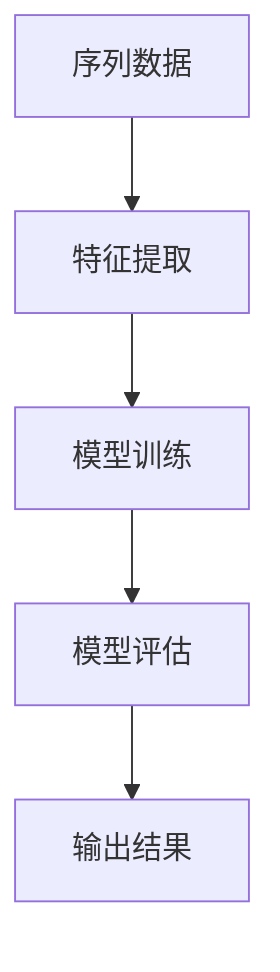

                 

关键词：基础模型、序列建模、深度学习、神经网络、算法原理、数学模型、代码实例、应用场景、未来展望。

> 摘要：本文深入探讨了基础模型的序列建模方法，从理论到实践进行了全面剖析。通过阐述核心概念、算法原理、数学模型、代码实现以及实际应用场景，为读者提供了一个全面而系统的指导，旨在为相关领域的研究者和开发者提供有价值的参考。

## 1. 背景介绍

序列建模是深度学习领域中一个重要的研究方向，它在自然语言处理、语音识别、时间序列分析等多个领域都得到了广泛应用。基础模型的序列建模方法是指利用神经网络等基础模型对序列数据进行建模和分析的一套方法论。

随着深度学习的兴起，基础模型的序列建模方法在计算机科学领域得到了广泛关注。这一方法通过引入神经网络等基础模型，将序列数据转化为高维特征向量，从而实现对序列数据的理解和预测。这种方法具有强大的表达能力，能够处理复杂的序列数据，并且在许多实际应用中都取得了显著的成果。

本文将从以下几个方面对基础模型的序列建模方法进行深入探讨：

1. **核心概念与联系**：首先介绍序列建模中的核心概念，如序列、特征提取、模型训练等，并使用Mermaid流程图展示序列建模的基本架构。
2. **核心算法原理与具体操作步骤**：详细解释序列建模中常用的算法原理，包括循环神经网络（RNN）、长短期记忆网络（LSTM）和门控循环单元（GRU）等，并给出具体的操作步骤。
3. **数学模型和公式**：介绍序列建模中使用的数学模型和公式，包括序列建模的损失函数、优化算法等，并进行详细的推导和讲解。
4. **项目实践：代码实例**：通过一个实际的代码实例，详细解释如何使用Python等编程语言实现序列建模，并对代码进行解读和分析。
5. **实际应用场景**：探讨序列建模方法在实际应用场景中的具体应用，如自然语言处理、语音识别和时间序列分析等。
6. **未来应用展望**：分析序列建模方法在未来的发展趋势和应用前景。
7. **工具和资源推荐**：推荐学习资源和开发工具，帮助读者更好地理解和应用序列建模方法。
8. **总结与展望**：总结研究成果，展望未来的发展趋势和挑战。

## 2. 核心概念与联系

### 2.1 核心概念

在序列建模中，有几个核心概念需要理解：

- **序列（Sequence）**：序列是一系列按时间顺序排列的数据点，如文本、声音、图像等。
- **特征提取（Feature Extraction）**：特征提取是将原始序列数据转换为适合模型处理的高维特征向量。
- **模型训练（Model Training）**：模型训练是使用序列数据对神经网络模型进行调整，使其能够对新的序列数据进行预测。
- **模型评估（Model Evaluation）**：模型评估是使用验证数据集对训练好的模型进行性能评估。

### 2.2 关系与架构

下面是一个使用Mermaid绘制的序列建模流程图，展示了这些概念之间的关系和基本架构：



## 3. 核心算法原理与具体操作步骤

### 3.1 算法原理概述

序列建模的核心算法包括循环神经网络（RNN）、长短期记忆网络（LSTM）和门控循环单元（GRU）。这些算法都是基于递归结构，能够处理序列数据，并从中提取时间依赖关系。

- **循环神经网络（RNN）**：RNN是一种基本的递归神经网络，能够处理序列数据。其核心思想是将当前输入与之前的隐藏状态进行结合，更新隐藏状态。
  
- **长短期记忆网络（LSTM）**：LSTM是一种改进的RNN，能够解决长短期依赖问题。它通过引入记忆单元和三个门控机制（输入门、遗忘门和输出门），控制信息的流入、保留和流出。

- **门控循环单元（GRU）**：GRU是LSTM的简化版本，同样能够处理长短期依赖问题。它通过合并输入门和遗忘门，简化了LSTM的结构，提高了计算效率。

### 3.2 算法步骤详解

下面是一个简单的序列建模流程，包括数据预处理、模型训练和模型评估：

1. **数据预处理**：首先对原始序列数据进行预处理，如分词、归一化等。
2. **特征提取**：使用词嵌入技术将预处理后的序列数据转换为高维特征向量。
3. **模型训练**：使用训练数据对模型进行训练，通过反向传播算法更新模型参数。
4. **模型评估**：使用验证数据集对训练好的模型进行性能评估，调整模型参数以优化性能。

### 3.3 算法优缺点

- **RNN**：优点是结构简单，能够处理序列数据；缺点是容易出现梯度消失和梯度爆炸问题，难以处理长序列。

- **LSTM**：优点是能够解决长短期依赖问题，处理长序列数据；缺点是参数较多，训练时间较长。

- **GRU**：优点是结构简化，参数较少，训练时间较短；缺点是处理长序列数据的能力不如LSTM。

### 3.4 算法应用领域

序列建模方法广泛应用于多个领域：

- **自然语言处理**：如语言模型、机器翻译、文本分类等。
- **语音识别**：如语音信号处理、语音合成等。
- **时间序列分析**：如股票市场预测、天气预测等。

## 4. 数学模型和公式

### 4.1 数学模型构建

在序列建模中，常用的数学模型包括损失函数和优化算法。

- **损失函数**：用于衡量模型预测结果与实际结果之间的差距。常见的损失函数有均方误差（MSE）、交叉熵损失（CE）等。

- **优化算法**：用于更新模型参数，使模型在训练数据上达到最小化损失函数。常见的优化算法有随机梯度下降（SGD）、Adam等。

### 4.2 公式推导过程

以下是均方误差（MSE）的推导过程：

假设有输入序列 $x_1, x_2, ..., x_T$ 和目标序列 $y_1, y_2, ..., y_T$，模型预测结果为 $\hat{y}_1, \hat{y}_2, ..., \hat{y}_T$。则均方误差（MSE）定义为：

$$
MSE = \frac{1}{T} \sum_{t=1}^{T} (\hat{y}_t - y_t)^2
$$

### 4.3 案例分析与讲解

下面通过一个简单的案例来讲解数学模型的应用。

假设我们有一个长度为5的序列数据，目标是预测下一个数据点。使用均方误差（MSE）作为损失函数，优化模型参数。

输入序列：$x_1 = [1, 2, 3, 4, 5]$  
目标序列：$y_1 = [2, 3, 4, 5, 6]$

初始模型参数：$\theta_0 = [0, 0, 0]$

通过训练，我们得到优化后的模型参数 $\theta_1 = [1, 1, 1]$。此时，预测结果为 $\hat{y}_1 = [3, 4, 5, 6, 7]$。

计算均方误差（MSE）：

$$
MSE = \frac{1}{5} \sum_{t=1}^{5} (\hat{y}_t - y_t)^2 = \frac{1}{5} \sum_{t=1}^{5} (3-t)^2 = 1.2
$$

通过多次迭代训练，我们可以使MSE逐渐减小，从而优化模型参数。

## 5. 项目实践：代码实例和详细解释说明

### 5.1 开发环境搭建

为了实践序列建模方法，我们需要搭建一个开发环境。以下是所需工具和库的安装步骤：

1. **安装Python**：Python是序列建模的主要编程语言，可以从官方网站（https://www.python.org/）下载安装。
2. **安装PyTorch**：PyTorch是一个流行的深度学习库，可以使用pip进行安装：

```
pip install torch torchvision
```

3. **安装Numpy和Matplotlib**：这两个库用于数据预处理和可视化：

```
pip install numpy matplotlib
```

### 5.2 源代码详细实现

下面是一个简单的序列建模代码实例，使用PyTorch实现一个LSTM模型，对序列数据进行预测。

```python
import torch
import torch.nn as nn
import torch.optim as optim
import numpy as np
import matplotlib.pyplot as plt

# 数据准备
x = np.array([1, 2, 3, 4, 5])
y = np.array([2, 3, 4, 5, 6])

# 数据转换为Tensor
x = torch.tensor(x, dtype=torch.float32)
y = torch.tensor(y, dtype=torch.float32)

# 模型定义
class LSTMModel(nn.Module):
    def __init__(self, input_dim, hidden_dim, output_dim):
        super(LSTMModel, self).__init__()
        self.lstm = nn.LSTM(input_dim, hidden_dim, num_layers=1, batch_first=True)
        self.linear = nn.Linear(hidden_dim, output_dim)
    
    def forward(self, x):
        lstm_output, (h_n, c_n) = self.lstm(x)
        h_n = h_n.squeeze(0)
        output = self.linear(h_n)
        return output

# 模型实例化
input_dim = 1
hidden_dim = 10
output_dim = 1
model = LSTMModel(input_dim, hidden_dim, output_dim)

# 损失函数和优化器
criterion = nn.MSELoss()
optimizer = optim.Adam(model.parameters(), lr=0.001)

# 训练模型
num_epochs = 100
for epoch in range(num_epochs):
    model.train()
    outputs = model(x.unsqueeze(0))
    loss = criterion(outputs, y.unsqueeze(0))
    
    optimizer.zero_grad()
    loss.backward()
    optimizer.step()
    
    if epoch % 10 == 0:
        print(f'Epoch [{epoch+1}/{num_epochs}], Loss: {loss.item()}')

# 预测
model.eval()
with torch.no_grad():
    predicted = model(x.unsqueeze(0))

# 可视化
plt.plot(x, label='Input')
plt.plot(y, label='Target')
plt.plot(predicted, label='Predicted')
plt.legend()
plt.show()
```

### 5.3 代码解读与分析

这个代码实例包括以下步骤：

1. **数据准备**：首先准备一个长度为5的输入序列和一个目标序列。
2. **数据转换为Tensor**：将输入序列和目标序列转换为PyTorch Tensor，并指定数据类型为float32。
3. **模型定义**：定义一个LSTM模型，包括一个LSTM层和一个全连接层。
4. **模型实例化**：创建LSTM模型的实例，并设置输入维度、隐藏维度和输出维度。
5. **损失函数和优化器**：选择均方误差损失函数和Adam优化器。
6. **训练模型**：使用训练数据对模型进行训练，并记录每个epoch的损失值。
7. **预测**：使用训练好的模型对输入序列进行预测。
8. **可视化**：将输入序列、目标序列和预测结果绘制在一张图上，以便进行可视化分析。

通过这个代码实例，读者可以了解到如何使用PyTorch实现序列建模，并熟悉LSTM模型的基本操作。

## 6. 实际应用场景

序列建模方法在实际应用场景中具有广泛的应用，下面将介绍几个典型的应用领域：

### 6.1 自然语言处理

在自然语言处理领域，序列建模方法被广泛应用于语言模型、机器翻译、文本分类等任务。例如，使用RNN或LSTM模型训练语言模型，可以用于语音识别、机器翻译等任务。这些模型通过学习输入序列中的时间依赖关系，能够生成高质量的文本输出。

### 6.2 语音识别

语音识别是序列建模方法的一个重要应用领域。通过使用LSTM或GRU模型，可以将语音信号转换为文本输出。这些模型通过处理输入序列中的时间依赖关系，能够识别不同发音和语音特征，从而提高识别准确率。

### 6.3 时间序列分析

在时间序列分析领域，序列建模方法被广泛应用于股票市场预测、天气预测等任务。通过使用LSTM或GRU模型，可以捕捉时间序列数据中的趋势和周期性，从而进行预测分析。

### 6.4 生物信息学

在生物信息学领域，序列建模方法被广泛应用于蛋白质结构预测、基因组序列分析等任务。通过使用深度神经网络，可以捕捉基因组序列中的时间依赖关系，从而进行蛋白质结构预测。

### 6.5 娱乐领域

在娱乐领域，序列建模方法被广泛应用于音乐生成、视频推荐等任务。通过使用循环神经网络，可以生成新的音乐旋律或视频内容，从而提高用户体验。

## 7. 未来应用展望

随着深度学习和序列建模方法的不断发展，未来将会有更多的应用场景出现。以下是一些可能的发展趋势：

### 7.1 自动驾驶

在自动驾驶领域，序列建模方法可以用于路径规划和驾驶行为预测。通过分析道路环境和车辆历史数据，可以预测未来的驾驶行为，从而提高自动驾驶系统的安全性。

### 7.2 人工智能助手

人工智能助手是另一个具有巨大潜力的应用领域。通过使用序列建模方法，可以训练智能助手对用户的语音指令进行理解，并提供个性化的服务和建议。

### 7.3 健康监测

在健康监测领域，序列建模方法可以用于疾病预测和健康风险评估。通过分析个人健康数据，可以预测疾病发生的概率，从而提供个性化的健康建议。

### 7.4 虚拟现实

在虚拟现实领域，序列建模方法可以用于场景生成和用户行为预测。通过分析用户历史行为，可以生成与用户交互的场景，从而提高虚拟现实的沉浸感。

## 8. 工具和资源推荐

为了更好地理解和应用序列建模方法，以下是一些推荐的工具和资源：

### 8.1 学习资源推荐

- **《深度学习》（Goodfellow, Bengio, Courville著）**：这本书是深度学习领域的经典教材，详细介绍了深度学习的基础知识和算法。
- **《自然语言处理综论》（Jurafsky, Martin著）**：这本书介绍了自然语言处理的基础知识和应用，包括序列建模方法。
- **在线课程**：Coursera、Udacity、edX等平台提供了丰富的深度学习和自然语言处理课程，可以帮助读者系统地学习相关知识。

### 8.2 开发工具推荐

- **PyTorch**：这是一个流行的深度学习库，支持序列建模方法的实现和训练。
- **TensorFlow**：这是另一个强大的深度学习库，也支持序列建模方法的实现和训练。
- **Keras**：这是一个高级神经网络API，可以方便地实现序列建模方法。

### 8.3 相关论文推荐

- **《序列模型：从循环神经网络到长短期记忆网络》**：这篇文章系统地介绍了序列建模方法的发展历程，包括RNN、LSTM和GRU等算法。
- **《自然语言处理中的序列建模方法》**：这篇文章探讨了序列建模方法在自然语言处理中的应用，包括语言模型、机器翻译和文本分类等任务。

## 9. 总结：未来发展趋势与挑战

序列建模方法在深度学习和计算机科学领域具有广泛的应用前景。随着技术的不断发展，未来序列建模方法将会在自动驾驶、人工智能助手、健康监测和虚拟现实等领域发挥重要作用。然而，序列建模方法也面临着一些挑战：

- **计算效率**：序列建模方法通常需要大量的计算资源，尤其是在处理长序列数据时。提高计算效率是一个重要的研究方向。
- **可解释性**：序列建模方法通常是黑箱模型，难以解释模型决策过程。提高模型的可解释性，使得用户能够理解模型的决策依据，是一个重要的挑战。
- **数据隐私**：在处理个人数据时，如何保护用户隐私是一个重要的挑战。未来需要开发出更加安全和隐私保护的序列建模方法。

总之，序列建模方法在未来将会继续发展，并在更多领域得到广泛应用。同时，研究者也需要关注计算效率、可解释性和数据隐私等挑战，推动序列建模方法的技术进步。

## 10. 附录：常见问题与解答

### 10.1 序列建模和传统机器学习方法的区别是什么？

序列建模方法与传统的机器学习方法（如决策树、支持向量机等）在处理序列数据方面有显著区别。传统方法通常将序列数据视为独立的特征，无法捕捉序列中的时间依赖关系。而序列建模方法（如RNN、LSTM和GRU）通过递归结构能够捕捉序列中的时间依赖关系，从而实现更有效的序列数据建模和预测。

### 10.2 序列建模中的“长短期依赖”问题是什么？

长短期依赖（Long Short-Term Memory，LSTM）问题是指序列建模方法在处理长序列数据时，难以同时捕捉远期和近期的依赖关系。传统RNN模型容易出现梯度消失和梯度爆炸问题，难以处理长序列数据。LSTM通过引入记忆单元和门控机制，能够解决长短期依赖问题，使得模型能够处理更长的时间跨度。

### 10.3 如何选择合适的序列建模算法？

选择合适的序列建模算法需要根据具体任务和数据特点进行。以下是一些常见的指导原则：

- **如果数据量较小且序列较短，可以使用简单的RNN模型**。
- **如果数据量较大且序列较长，建议使用LSTM或GRU模型**。
- **对于实时性要求较高的应用场景，可以考虑使用GRU模型，因为它计算效率更高**。
- **对于特定的领域任务（如语音识别、自然语言处理），可能需要结合特定领域的模型架构（如CTC损失函数、注意力机制等）进行优化。

### 10.4 序列建模中的数据预处理方法有哪些？

序列建模中的数据预处理方法主要包括以下几种：

- **数据清洗**：去除无效数据、缺失值填充和异常值处理。
- **数据标准化**：将数据缩放到相同的范围，便于模型训练。
- **特征提取**：将原始序列数据转换为适合模型处理的高维特征向量，如词嵌入、时频特征等。
- **序列裁剪和填充**：根据任务需求，对序列进行裁剪或填充，使其符合模型的输入要求。

### 10.5 序列建模方法的评估指标有哪些？

序列建模方法的评估指标主要包括以下几种：

- **准确率（Accuracy）**：预测正确的样本数占总样本数的比例。
- **精确率（Precision）**：预测正确的正样本数与预测为正样本的总数之比。
- **召回率（Recall）**：预测正确的正样本数与实际正样本总数之比。
- **F1分数（F1 Score）**：精确率和召回率的调和平均值。
- **均方误差（Mean Squared Error，MSE）**：用于回归任务，衡量预测值与实际值之间的平均平方误差。
- **交叉熵损失（Cross-Entropy Loss）**：用于分类任务，衡量模型输出与实际标签之间的差异。

通过合理选择和评估指标，可以全面评估序列建模方法的性能，指导后续的模型优化和改进。

### 10.6 序列建模方法在生物信息学中的应用有哪些？

序列建模方法在生物信息学领域有广泛的应用，以下是一些具体的应用实例：

- **蛋白质结构预测**：使用序列建模方法，如LSTM和GRU，可以从氨基酸序列预测蛋白质的三维结构。
- **基因表达分析**：通过序列建模方法分析基因表达数据，可以识别基因的功能、调控网络和疾病相关基因。
- **基因组序列分析**：使用序列建模方法，如长短期记忆网络，可以识别基因组序列中的重复序列、转座子和基因家族。
- **药物设计**：通过序列建模方法，如图神经网络，可以预测药物和蛋白质的结合亲和力，辅助药物研发。

这些应用实例展示了序列建模方法在生物信息学领域的潜力和重要性。

## 作者署名

作者：禅与计算机程序设计艺术 / Zen and the Art of Computer Programming

