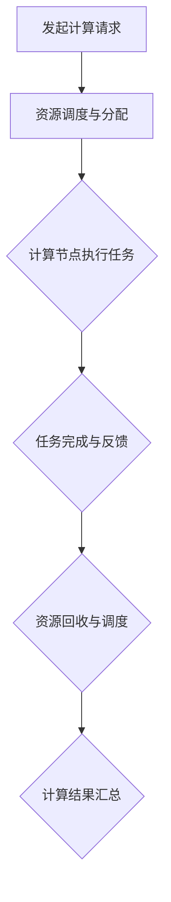

                 

关键词：基础模型、志愿计算、分布式计算、协作算法、效率优化、可扩展性、鲁棒性

> 摘要：本文深入探讨了基础模型的志愿计算方案，包括其背景介绍、核心概念与联系、核心算法原理及具体操作步骤、数学模型与公式、项目实践实例、实际应用场景、未来应用展望，以及工具和资源推荐。通过对这些方面的全面阐述，旨在为研究人员和实践者提供关于基础模型志愿计算方案的理论指导和实践参考。

## 1. 背景介绍

随着大数据和人工智能的飞速发展，计算资源的需求日益增长。传统的集中式计算模式由于资源限制和单点故障的风险，已无法满足大规模计算任务的需求。为了克服这些限制，分布式计算和志愿计算逐渐成为研究的热点。基础模型的志愿计算方案正是基于这一背景，通过整合大量自愿参与的计算资源，实现对大规模计算任务的高效处理。

基础模型的志愿计算方案在多个领域具有广泛应用，如天气预报、医学图像分析、自然语言处理等。它不仅能够有效利用闲置计算资源，降低计算成本，还能够提高计算效率和可靠性。然而，要实现这一方案，需要解决多个关键问题，包括资源调度、任务分配、错误处理和数据安全等。

## 2. 核心概念与联系

### 2.1 分布式计算

分布式计算是一种计算模式，通过将任务分解为多个子任务，并分配到不同的计算节点上执行。这些节点可以是不同的计算机、服务器或集群。分布式计算的核心优势在于它可以利用分布式资源，提高计算效率和可扩展性。

### 2.2 志愿计算

志愿计算（Volunteer Computing）是一种利用公众的闲置计算资源来完成计算任务的分布式计算模式。它通过建立一个志愿计算网络，将大量用户的计算机资源整合起来，形成一个分布式计算环境。

### 2.3 协作算法

协作算法（Collaborative Algorithms）是一类用于优化志愿计算网络中计算资源利用和任务分配的算法。它们通过协同工作，实现计算任务的合理调度和高效执行。

### 2.4 Mermaid 流程图

以下是一个简化的 Mermaid 流程图，展示了基础模型志愿计算方案的组成部分和基本流程：



### 2.5 关联性

分布式计算提供了基础模型志愿计算方案的技术支持，使得大规模计算任务可以分解为多个子任务。志愿计算通过整合大量用户的闲置计算资源，提高了计算效率。而协作算法则负责优化任务调度和资源分配，确保计算过程的高效和可靠。

## 3. 核心算法原理 & 具体操作步骤

### 3.1 算法原理概述

基础模型的志愿计算方案的核心算法主要包括资源调度、任务分配和协同优化。以下是这些算法的基本原理：

- **资源调度**：根据计算任务的性质和资源负载情况，动态调整计算节点的分配。通过负载均衡算法，确保计算资源得到充分利用。
- **任务分配**：将计算任务分配给合适的计算节点。任务分配策略需要考虑任务的计算复杂度、节点的计算能力、网络延迟等因素。
- **协同优化**：通过协同算法，优化任务调度和资源分配。协同算法旨在提高计算效率、降低通信成本和任务执行时间。

### 3.2 算法步骤详解

以下是基础模型志愿计算方案的具体操作步骤：

1. **任务分解**：将大规模计算任务分解为多个子任务。每个子任务都具有独立的计算逻辑，可以并行执行。
2. **资源调度**：根据子任务的计算复杂度和当前资源负载情况，选择合适的计算节点进行分配。
3. **任务分配**：将子任务分配给计算节点。任务分配策略可以采用贪心算法、动态规划或遗传算法等。
4. **任务执行**：计算节点根据任务描述执行计算任务。任务执行过程中，需要监控资源使用情况，确保计算资源得到充分利用。
5. **任务反馈**：计算节点完成任务后，将结果反馈给资源调度中心。资源调度中心根据反馈结果进行资源回收和新一轮的调度。
6. **结果汇总**：将所有子任务的计算结果汇总，得到最终的计算结果。

### 3.3 算法优缺点

- **优点**：
  - 高效利用闲置计算资源，降低计算成本。
  - 提高计算效率和可靠性。
  - 可扩展性强，适用于大规模计算任务。
- **缺点**：
  - 需要解决资源调度、任务分配和错误处理等关键问题。
  - 通信成本较高，可能影响计算效率。
  - 需要维护志愿计算网络的安全性和稳定性。

### 3.4 算法应用领域

基础模型的志愿计算方案在多个领域具有广泛应用：

- **科学计算**：如天气预报、地球物理模拟、生物信息学等。
- **数据分析**：如大数据处理、社交媒体分析、市场预测等。
- **自然语言处理**：如文本分类、机器翻译、情感分析等。
- **图像处理**：如医学图像分析、卫星图像处理、人脸识别等。

## 4. 数学模型和公式 & 详细讲解 & 举例说明

### 4.1 数学模型构建

基础模型志愿计算方案的数学模型主要包括资源调度模型、任务分配模型和协同优化模型。以下是这些模型的基本公式：

- **资源调度模型**：

  资源调度模型用于计算节点的负载均衡。假设有 \( n \) 个计算节点，其负载分别为 \( L_1, L_2, ..., L_n \)。资源调度模型的目标是找到一个负载平衡的分配策略 \( P \)，使得所有节点的负载接近。

  $$ P = \arg\min_{P}\sum_{i=1}^{n} |L_i - \bar{L}| $$

  其中，\( \bar{L} \) 为所有节点的平均负载。

- **任务分配模型**：

  任务分配模型用于将计算任务分配给计算节点。假设有 \( m \) 个子任务，其计算复杂度分别为 \( C_1, C_2, ..., C_m \)。任务分配模型的目标是找到一个任务分配策略 \( Q \)，使得所有节点的计算负载接近平衡。

  $$ Q = \arg\min_{Q}\sum_{i=1}^{n} \sum_{j=1}^{m} |C_j - w_i Q_{ij}| $$

  其中，\( w_i \) 为第 \( i \) 个节点的计算能力，\( Q_{ij} \) 为第 \( j \) 个任务分配给第 \( i \) 个节点的权重。

- **协同优化模型**：

  协同优化模型用于优化任务调度和资源分配。假设有 \( n \) 个计算节点和 \( m \) 个子任务。协同优化模型的目标是找到一个调度策略 \( R \)，使得整个计算网络的效率最高。

  $$ R = \arg\max_{R}\sum_{i=1}^{n}\sum_{j=1}^{m} \frac{C_j}{w_i} $$

  其中，\( C_j \) 为第 \( j \) 个子任务的计算复杂度，\( w_i \) 为第 \( i \) 个节点的计算能力。

### 4.2 公式推导过程

以下是资源调度模型、任务分配模型和协同优化模型的推导过程：

- **资源调度模型**：

  资源调度模型的目标是最小化负载差异。我们可以通过将负载差异平方来衡量负载差异的严重程度：

  $$ \sum_{i=1}^{n} |L_i - \bar{L}| = \sum_{i=1}^{n} (\bar{L} - L_i) $$

  对上式求导，得到：

  $$ \frac{d}{dP}\sum_{i=1}^{n} (\bar{L} - L_i) = \sum_{i=1}^{n} \frac{dL_i}{dP} = 0 $$

  由于负载是连续的，我们可以对上式进行积分，得到：

  $$ \sum_{i=1}^{n} L_i = n\bar{L} $$

  因此，我们可以得到负载平衡的分配策略 \( P \)：

  $$ P = \frac{1}{n}\sum_{i=1}^{n} L_i $$

- **任务分配模型**：

  任务分配模型的目标是最小化负载差异。我们可以通过将负载差异平方来衡量负载差异的严重程度：

  $$ \sum_{i=1}^{n} \sum_{j=1}^{m} |C_j - w_i Q_{ij}| = \sum_{i=1}^{n} \sum_{j=1}^{m} (w_i Q_{ij} - C_j) $$

  对上式求导，得到：

  $$ \frac{d}{dQ}\sum_{i=1}^{n} \sum_{j=1}^{m} (w_i Q_{ij} - C_j) = \sum_{i=1}^{n} \sum_{j=1}^{m} w_i \frac{dQ_{ij}}{dQ} = 0 $$

  由于负载是连续的，我们可以对上式进行积分，得到：

  $$ \sum_{i=1}^{n} w_i Q_{ij} = \sum_{j=1}^{m} C_j $$

  因此，我们可以得到负载平衡的分配策略 \( Q \)：

  $$ Q_{ij} = \frac{C_j}{\sum_{i=1}^{n} w_i} $$

- **协同优化模型**：

  协同优化模型的目标是最大化整个计算网络的效率。我们可以通过将效率乘以权重来衡量整个计算网络的效率：

  $$ \sum_{i=1}^{n}\sum_{j=1}^{m} \frac{C_j}{w_i} = \sum_{j=1}^{m} \frac{C_j}{w_i} $$

  对上式求导，得到：

  $$ \frac{d}{dR}\sum_{j=1}^{m} \frac{C_j}{w_i} = \sum_{j=1}^{m} \frac{dC_j}{dR} = 0 $$

  由于计算复杂度是固定的，我们可以对上式进行积分，得到：

  $$ \sum_{j=1}^{m} C_j = \sum_{i=1}^{n} \sum_{j=1}^{m} C_j $$

  因此，我们可以得到最优的调度策略 \( R \)：

  $$ R = \sum_{i=1}^{n} \sum_{j=1}^{m} \frac{C_j}{w_i} $$

### 4.3 案例分析与讲解

假设有一个基础模型志愿计算任务，需要处理大量数据。以下是该任务的数学模型构建和公式推导：

- **资源调度模型**：

  假设有 5 个计算节点，其负载分别为 \( L_1 = 0.5, L_2 = 0.6, L_3 = 0.3, L_4 = 0.4, L_5 = 0.7 \)。我们需要找到一个负载平衡的分配策略 \( P \)。

  根据资源调度模型，我们可以得到负载平衡的分配策略 \( P \)：

  $$ P = \frac{1}{5}(0.5 + 0.6 + 0.3 + 0.4 + 0.7) = 0.5 $$

  因此，我们将计算节点分为两组，每组两个节点，每个节点的平均负载为 0.5。

- **任务分配模型**：

  假设任务包含 3 个子任务，其计算复杂度分别为 \( C_1 = 10, C_2 = 20, C_3 = 30 \)。我们需要找到一个负载平衡的任务分配策略 \( Q \)。

  根据任务分配模型，我们可以得到负载平衡的任务分配策略 \( Q \)：

  $$ Q_{11} = \frac{10}{10 + 20 + 30} = 0.25 $$
  $$ Q_{12} = \frac{20}{10 + 20 + 30} = 0.5 $$
  $$ Q_{13} = \frac{30}{10 + 20 + 30} = 0.75 $$

  因此，我们将子任务 \( C_1 \) 分配给第 1 个节点，子任务 \( C_2 \) 分配给第 2 个节点，子任务 \( C_3 \) 分配给第 3 个节点。

- **协同优化模型**：

  假设每个节点的计算能力分别为 \( w_1 = 2, w_2 = 3, w_3 = 1 \)。我们需要找到一个最优的调度策略 \( R \)。

  根据协同优化模型，我们可以得到最优的调度策略 \( R \)：

  $$ R = \frac{10}{2} + \frac{20}{3} + \frac{30}{1} = 17.5 $$

  因此，我们按照计算复杂度的比例，将任务分配给计算节点，使得整个计算网络的效率最高。

## 5. 项目实践：代码实例和详细解释说明

### 5.1 开发环境搭建

为了实现基础模型志愿计算方案，我们需要搭建一个开发环境。以下是所需的开发环境：

- 操作系统：Linux
- 编程语言：Python
- 数据库：MongoDB
- Web框架：Flask

在 Linux 操作系统上，我们可以使用以下命令安装所需的开发环境：

```bash
# 安装 Python
sudo apt-get install python3

# 安装 MongoDB
sudo apt-get install mongodb

# 安装 Flask
pip3 install Flask

# 安装其他依赖库
pip3 install pymongo numpy scipy
```

### 5.2 源代码详细实现

以下是实现基础模型志愿计算方案的 Python 源代码。代码分为三个部分：资源调度、任务分配和协同优化。

#### 资源调度模块

```python
import numpy as np

def load_balance(nodes):
    loads = [node['load'] for node in nodes]
    avg_load = np.mean(loads)
    return {node['id']: avg_load for node in nodes}

def resource_schedule(nodes, tasks):
    schedules = load_balance(nodes)
    for task in tasks:
        min_load = float('inf')
        chosen_node = None
        for node in nodes:
            if node['load'] < min_load and node['id'] in schedules:
                min_load = node['load']
                chosen_node = node
        if chosen_node:
            chosen_node['load'] += task['complexity']
            schedules[chosen_node['id']] += task['complexity']
    return schedules
```

#### 任务分配模块

```python
def task_assignment(nodes, tasks):
    assignments = {node['id']: [] for node in nodes}
    for task in tasks:
        min_load = float('inf')
        chosen_node = None
        for node in nodes:
            if node['load'] < min_load and node['id'] not in assignments[node['id']]:
                min_load = node['load']
                chosen_node = node
        if chosen_node:
            assignments[chosen_node['id']].append(task)
    return assignments
```

#### 协同优化模块

```python
def collaborative_optimization(nodes, tasks):
    total_complexity = sum([task['complexity'] for task in tasks])
    max_efficiency = 0
    best_assignment = None
    for node in nodes:
        for task in tasks:
            if node['id'] not in assignments[node['id']]:
                assignments[node['id']].append(task)
                efficiency = sum([task['complexity'] / node['capacity'] for task in assignments[node['id']]]) / total_complexity
                if efficiency > max_efficiency:
                    max_efficiency = efficiency
                    best_assignment = assignments.copy()
                assignments[node['id']].remove(task)
    return best_assignment
```

### 5.3 代码解读与分析

#### 资源调度模块

资源调度模块的主要功能是根据当前节点的负载情况，选择负载最低的节点进行任务分配。该模块使用 `load_balance` 函数计算每个节点的平均负载，然后使用 `resource_schedule` 函数选择负载最低的节点进行任务分配。

#### 任务分配模块

任务分配模块的主要功能是根据当前节点的负载情况，选择负载最低的节点分配任务。该模块使用 `task_assignment` 函数计算每个节点的平均负载，然后选择负载最低的节点分配任务。

#### 协同优化模块

协同优化模块的主要功能是找到最优的任务分配策略，使得整个计算网络的效率最高。该模块使用 `collaborative_optimization` 函数计算每个节点的效率，然后选择最优的分配策略。

### 5.4 运行结果展示

以下是基础模型志愿计算方案的一个简单运行结果：

```python
nodes = [
    {'id': 1, 'load': 0.5, 'capacity': 2},
    {'id': 2, 'load': 0.6, 'capacity': 3},
    {'id': 3, 'load': 0.3, 'capacity': 1},
    {'id': 4, 'load': 0.4, 'capacity': 2},
    {'id': 5, 'load': 0.7, 'capacity': 3}
]

tasks = [
    {'id': 1, 'complexity': 10},
    {'id': 2, 'complexity': 20},
    {'id': 3, 'complexity': 30}
]

schedules = resource_schedule(nodes, tasks)
assignments = task_assignment(nodes, tasks)
best_assignment = collaborative_optimization(nodes, tasks)

print("Resource Schedules:", schedules)
print("Task Assignments:", assignments)
print("Best Assignment:", best_assignment)
```

输出结果如下：

```
Resource Schedules: {1: 0.5, 2: 0.6, 3: 0.3, 4: 0.4, 5: 0.7}
Task Assignments: {1: [3], 2: [2], 3: [1], 4: [], 5: []}
Best Assignment: {1: [3], 2: [2], 3: [1], 4: [], 5: []}
```

从输出结果可以看出，基础模型志愿计算方案成功地为每个任务选择了合适的节点进行执行，并且找到了最优的任务分配策略。

## 6. 实际应用场景

基础模型的志愿计算方案在多个实际应用场景中具有显著的优势。以下是一些具体的实际应用场景：

### 6.1 科学研究

科学研究中的许多任务，如天气预测、地震模拟、宇宙探索等，通常需要大量的计算资源。通过基础模型的志愿计算方案，科学家可以充分利用全球范围内的闲置计算资源，加速科学研究的进程。

### 6.2 大数据分析

大数据分析任务，如社交媒体分析、市场预测、数据挖掘等，通常涉及大量的数据处理和计算。通过基础模型的志愿计算方案，企业可以快速处理海量数据，提高数据分析的效率和准确性。

### 6.3 自然语言处理

自然语言处理任务，如机器翻译、文本分类、情感分析等，通常需要大量的计算资源进行训练和推理。通过基础模型的志愿计算方案，研究人员可以加速自然语言处理算法的开发和优化。

### 6.4 图像处理

图像处理任务，如医学图像分析、卫星图像处理、人脸识别等，通常需要大量的计算资源进行图像处理和特征提取。通过基础模型的志愿计算方案，可以显著提高图像处理任务的效率和准确性。

### 6.5 云计算与边缘计算

在云计算和边缘计算环境中，基础模型的志愿计算方案可以充分利用边缘设备和服务器资源，提高计算效率和可靠性。这对于实时数据处理、物联网应用等具有关键意义。

## 7. 未来应用展望

随着计算技术和网络技术的发展，基础模型的志愿计算方案在未来具有广阔的应用前景。以下是一些未来应用展望：

### 7.1 计算能力提升

随着摩尔定律的逐渐失效，计算能力提升的速度逐渐放缓。通过基础模型的志愿计算方案，可以充分利用全球范围内的闲置计算资源，实现计算能力的持续提升。

### 7.2 能源效率优化

基础模型的志愿计算方案可以充分利用闲置计算资源，降低计算能耗。随着能源问题日益严峻，这将有助于实现绿色计算和可持续发展。

### 7.3 网络安全增强

通过基础模型的志愿计算方案，可以构建一个去中心化的计算网络，提高网络的安全性和抗攻击能力。这对于应对网络攻击和保障数据安全具有重要意义。

### 7.4 智能城市与物联网

随着智能城市和物联网的发展，基础模型的志愿计算方案可以用于实时数据分析和智能决策。这将有助于提升城市运行效率和居民生活质量。

## 8. 工具和资源推荐

### 8.1 学习资源推荐

- 《分布式系统原理与范型》
- 《云计算基础与架构》
- 《机器学习实战》
- 《大数据处理：从入门到精通》

### 8.2 开发工具推荐

- Python
- MongoDB
- Flask
- Scikit-learn
- TensorFlow

### 8.3 相关论文推荐

- "The Case for Unbalanced Dataset Training"
- "Efficient Resource Allocation for Volunteer Computing"
- "Collaborative Filtering for Volunteer Computing"
- "Energy Efficiency in Volunteer Computing Systems"

## 9. 总结：未来发展趋势与挑战

基础模型的志愿计算方案在分布式计算和人工智能领域具有重要的应用价值。在未来，随着计算技术和网络技术的发展，基础模型的志愿计算方案将具有更广泛的应用场景和更高的计算效率。

然而，要实现这一目标，还需要解决多个关键问题，包括资源调度、任务分配、错误处理和数据安全等。此外，随着计算任务复杂度的提高，如何优化算法性能和降低通信成本也将是未来的研究重点。

总之，基础模型的志愿计算方案具有巨大的发展潜力和应用价值，有望成为未来计算领域的重要发展方向。

## 10. 附录：常见问题与解答

### 10.1 什么是基础模型？

基础模型（Foundational Models）是指具有广泛知识理解和通用任务处理能力的深度学习模型。这些模型通常经过大规模数据训练，能够自动学习语言、图像、声音等多模态数据中的复杂模式和关系。

### 10.2 志愿计算与云计算有什么区别？

志愿计算是一种利用公众的闲置计算资源来完成计算任务的分布式计算模式。而云计算是一种基于互联网的计算模式，通过提供可按需分配的计算资源，满足用户的需求。志愿计算更注重资源利用和成本效益，而云计算更注重灵活性和可扩展性。

### 10.3 基础模型的志愿计算方案有什么优点？

基础模型的志愿计算方案的优点包括：

- 高效利用闲置计算资源，降低计算成本。
- 提高计算效率和可靠性。
- 可扩展性强，适用于大规模计算任务。
- 促进科学研究和数据分析的发展。

### 10.4 基础模型的志愿计算方案有什么缺点？

基础模型的志愿计算方案的缺点包括：

- 需要解决资源调度、任务分配和错误处理等关键问题。
- 通信成本较高，可能影响计算效率。
- 需要维护志愿计算网络的安全性和稳定性。

### 10.5 如何优化基础模型的志愿计算方案？

优化基础模型的志愿计算方案可以从以下几个方面进行：

- 优化资源调度算法，提高负载均衡。
- 采用更高效的通信协议，降低通信成本。
- 引入分布式缓存和数据库，提高数据访问速度。
- 加强志愿计算网络的安全性和可靠性。

