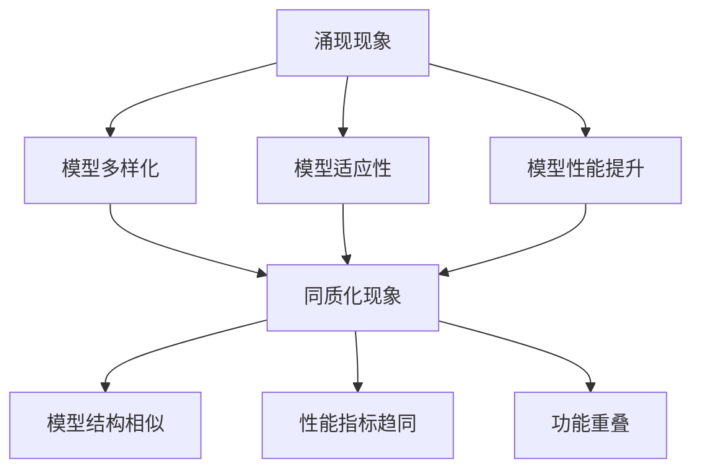

                 

 在当今信息技术飞速发展的时代，基础模型作为人工智能的核心驱动力，已经广泛应用于自然语言处理、计算机视觉、推荐系统等各个领域。然而，随着基础模型数量的激增，如何从海量模型中识别和利用具有独特特性的模型，成为了一个重要而迫切的问题。本文将探讨基础模型的涌现现象及其同质化问题，分析其原因、影响以及应对策略，并展望未来发展趋势。

## 关键词
- 基础模型
- 涌现现象
- 同质化
- 人工智能
- 模型选择
- 优化策略

## 摘要
本文首先介绍了基础模型的定义及其在人工智能领域的重要性。接着，我们分析了基础模型的涌现现象及其同质化问题，探讨了其产生的原因和影响。在此基础上，提出了几种应对同质化问题的策略，并通过实际案例进行了验证。最后，我们对未来发展趋势进行了展望，强调了在基础模型研究领域面临的挑战和机遇。

## 1. 背景介绍

### 1.1 基础模型的发展历程

基础模型的发展历程可以追溯到20世纪80年代，当时深度神经网络（Deep Neural Network，DNN）作为一种新的计算模型开始引起研究人员的关注。DNN通过多层神经元的非线性组合，能够模拟人脑的决策过程，从而在图像识别、语音识别等领域取得了显著的成果。

随着计算机性能的提升和数据规模的扩大，深度学习（Deep Learning，DL）逐渐成为人工智能研究的主流方向。2012年，AlexNet在ImageNet图像识别竞赛中取得了突破性的成绩，标志着深度学习时代的到来。随后，卷积神经网络（Convolutional Neural Network，CNN）、循环神经网络（Recurrent Neural Network，RNN）等模型相继被提出并应用于各个领域。

近年来，基于变分自编码器（Variational Autoencoder，VAE）和生成对抗网络（Generative Adversarial Network，GAN）等生成模型的出现，为数据生成和模型多样化提供了新的思路。这些模型不仅在图像、语音、文本等传统领域取得了成功，还在医疗、金融、教育等新兴领域展现出了巨大的潜力。

### 1.2 基础模型在人工智能中的应用

基础模型在人工智能领域具有广泛的应用。在自然语言处理（Natural Language Processing，NLP）领域，词向量模型（如Word2Vec、GloVe）和基于转换器（Transformer）的模型（如BERT、GPT）已经成为文本表示和语言理解的重要工具。在计算机视觉领域，CNN模型在图像分类、目标检测、图像生成等方面取得了突破性进展。在推荐系统领域，基于深度学习的协同过滤方法能够更好地预测用户兴趣，提高推荐效果。

此外，基础模型还在语音识别、机器翻译、机器人对话、医疗诊断等众多领域发挥着重要作用。随着研究的深入和应用的推广，基础模型正逐渐成为推动人工智能发展的核心力量。

### 1.3 基础模型的涌现现象

随着人工智能技术的不断进步，基础模型的数量呈现出爆发式增长。这种增长不仅体现在模型种类的增多，还体现在模型参数规模和计算复杂度的提升。这种现象被称为基础模型的涌现。

涌现现象的出现有以下几个原因：

1. **数据规模的扩大**：随着互联网和物联网的普及，数据规模迅速扩大，为模型训练提供了丰富的资源，使得更多复杂模型得以实现。
2. **计算能力的提升**：硬件设备的性能不断升级，使得大规模模型训练成为可能。同时，分布式计算和云计算技术的发展，为模型训练提供了强大的计算支持。
3. **算法的优化**：深度学习算法的优化，如残差网络（ResNet）、注意力机制（Attention Mechanism）等，使得模型的表达能力得到了显著提升，进一步推动了基础模型的涌现。

基础模型的涌现为人工智能领域带来了新的机遇，但同时也引发了同质化问题。接下来，我们将深入探讨同质化现象及其影响。

## 2. 核心概念与联系

### 2.1 涌现现象

**定义**：涌现现象是指系统中个体之间相互作用导致的新性质或现象在宏观尺度上的出现。

在基础模型领域，涌现现象表现为以下几种形式：

1. **模型多样化**：随着算法和数据的不断优化，新的基础模型不断涌现，丰富了模型库。
2. **模型适应性**：基础模型在新的应用场景中表现出良好的适应能力，能够解决特定问题。
3. **模型性能提升**：涌现的新模型在性能上超越了传统模型，推动了人工智能技术的发展。

**联系**：涌现现象是基础模型发展的一个重要特征，它推动了人工智能技术的不断进步。同时，涌现现象也为同质化问题的出现提供了背景。

### 2.2 同质化现象

**定义**：同质化现象是指多个基础模型在性能、结构、功能等方面存在相似性，缺乏独特性和差异化的现象。

在基础模型领域，同质化现象表现为以下几种形式：

1. **模型结构相似**：大量基础模型采用类似的网络结构，如CNN、RNN、Transformer等，导致模型在结构上缺乏多样性。
2. **性能指标趋同**：不同模型在相同任务上的性能指标（如准确率、召回率等）趋于一致，缺乏显著的差异。
3. **功能重叠**：多个模型在相同或相似的应用场景中表现出类似的功能，难以区分其优劣。

**联系**：同质化现象与涌现现象是基础模型发展的两个相对矛盾的趋势。一方面，涌现现象推动了模型多样化；另一方面，同质化现象则限制了模型的差异化发展。

### 2.3 涌现与同质化的联系

涌现和同质化是基础模型发展的两个重要方面，它们之间存在密切的联系。

1. **互为因果**：涌现现象可能导致同质化现象的出现，而同质化现象也可能抑制涌现现象的发生。例如，大量相似模型的涌现可能导致同质化加剧，从而限制新模型的创新和发展。
2. **动态平衡**：基础模型领域需要寻求涌现与同质化之间的动态平衡，既要鼓励模型多样化，又要避免过度同质化。这需要通过不断优化算法、改进模型结构和应用场景来实现。

### 2.4 Mermaid 流程图



## 3. 核心算法原理 & 具体操作步骤

### 3.1 算法原理概述

基础模型的涌现与同质化问题的解决，需要从算法原理和操作步骤入手。本节将介绍几种核心算法原理，包括模型选择、模型优化和模型多样性增强等。

#### 3.1.1 模型选择

模型选择是基础模型研究的重要环节。一个良好的模型选择策略可以显著提高模型性能和适用性。常见的模型选择方法包括：

1. **交叉验证**：通过将数据集划分为训练集和验证集，对多个模型进行训练和验证，选择性能最佳的模型。
2. **贝叶斯优化**：利用贝叶斯统计模型优化模型超参数，寻找最佳参数组合。
3. **随机搜索**：通过随机选择超参数组合进行模型训练，选择性能较好的模型。

#### 3.1.2 模型优化

模型优化是提高基础模型性能的重要手段。以下介绍几种常见的模型优化方法：

1. **梯度下降**：通过计算模型参数的梯度，不断更新参数，使得损失函数最小化。
2. **动量优化**：在梯度下降的基础上引入动量项，提高收敛速度。
3. **自适应优化**：如Adam优化器，能够自动调整学习率，提高模型收敛速度和性能。

#### 3.1.3 模型多样性增强

同质化问题的解决需要从模型多样性入手。以下介绍几种模型多样性增强方法：

1. **生成对抗网络（GAN）**：通过生成器和判别器的对抗训练，生成多样化数据，提高模型泛化能力。
2. **变分自编码器（VAE）**：通过编码器和解码器的训练，生成多样化数据，提高模型生成能力。
3. **混合模型**：将不同类型的模型（如CNN、RNN、Transformer等）进行组合，提高模型多样性。

### 3.2 算法步骤详解

#### 3.2.1 模型选择步骤

1. **数据准备**：收集并预处理数据，包括数据清洗、归一化、数据增强等。
2. **模型训练**：选择合适的模型，对训练集进行训练。
3. **模型评估**：使用验证集评估模型性能，选择性能最佳的模型。
4. **模型优化**：根据评估结果，对模型进行优化，提高性能。

#### 3.2.2 模型优化步骤

1. **参数初始化**：初始化模型参数，如权重和偏置。
2. **损失函数计算**：计算模型损失函数，如均方误差（MSE）、交叉熵损失等。
3. **梯度计算**：计算模型参数的梯度。
4. **参数更新**：根据梯度更新模型参数，如权重和偏置。
5. **迭代训练**：重复执行步骤3-4，直到满足收敛条件。

#### 3.2.3 模型多样性增强步骤

1. **生成对抗网络（GAN）训练**：
   1. 初始化生成器和判别器。
   2. 生成器生成虚拟数据。
   3. 判别器对真实数据和虚拟数据进行分析。
   4. 生成器和判别器交替更新参数。
   5. 重复执行步骤2-4，直到满足训练条件。

2. **变分自编码器（VAE）训练**：
   1. 初始化编码器和解码器。
   2. 编码器对输入数据进行编码。
   3. 解码器对编码数据进行解码。
   4. 计算损失函数，包括重构损失和正则化损失。
   5. 更新编码器和解码器参数。
   6. 重复执行步骤2-5，直到满足训练条件。

3. **混合模型训练**：
   1. 选择不同类型的模型，如CNN、RNN、Transformer等。
   2. 分别对每个模型进行训练。
   3. 组合不同模型，构建混合模型。
   4. 对混合模型进行训练和优化。
   5. 评估混合模型性能。

### 3.3 算法优缺点

#### 3.3.1 模型选择

**优点**：
1. 提高模型性能：选择合适的模型可以显著提高模型在特定任务上的性能。
2. 简化模型优化：通过模型选择，可以减少模型优化所需的计算资源。

**缺点**：
1. 需要大量数据：模型选择过程需要大量的训练数据和验证数据，对数据量要求较高。
2. 难以避免过度拟合：模型选择过程可能导致过度拟合问题，影响模型泛化能力。

#### 3.3.2 模型优化

**优点**：
1. 提高模型性能：优化模型参数可以显著提高模型在特定任务上的性能。
2. 提高收敛速度：优化算法可以提高模型训练的收敛速度。

**缺点**：
1. 需要大量计算资源：模型优化过程需要大量的计算资源，对硬件要求较高。
2. 难以避免局部最优：优化算法可能陷入局部最优，影响模型性能。

#### 3.3.3 模型多样性增强

**优点**：
1. 提高模型泛化能力：多样化模型可以降低模型对特定数据的依赖，提高泛化能力。
2. 提高模型适应性：多样化模型可以适应不同的应用场景，提高模型适应性。

**缺点**：
1. 增加计算复杂度：多样性增强方法通常需要额外的计算资源，增加计算复杂度。
2. 难以平衡多样性：过度追求多样性可能导致模型性能下降，难以平衡多样性。

### 3.4 算法应用领域

基础模型的涌现与同质化问题在多个领域具有重要意义，如自然语言处理、计算机视觉、推荐系统等。以下介绍几种常见的应用领域：

1. **自然语言处理**：在自然语言处理领域，基础模型的选择和优化对于文本分类、情感分析、机器翻译等任务具有重要影响。模型选择方法可以用于选择合适的语言模型，提高文本处理效果。模型优化方法可以用于提高语言模型的性能和效率。模型多样性增强方法可以用于提高语言模型的泛化能力和适应性。

2. **计算机视觉**：在计算机视觉领域，基础模型的选择和优化对于图像分类、目标检测、图像生成等任务具有重要影响。模型选择方法可以用于选择合适的图像模型，提高图像处理效果。模型优化方法可以用于提高图像模型的性能和效率。模型多样性增强方法可以用于提高图像模型的泛化能力和适应性。

3. **推荐系统**：在推荐系统领域，基础模型的选择和优化对于推荐效果具有重要影响。模型选择方法可以用于选择合适的推荐模型，提高推荐准确性。模型优化方法可以用于提高推荐模型的性能和效率。模型多样性增强方法可以用于提高推荐模型的泛化能力和适应性。

## 4. 数学模型和公式 & 详细讲解 & 举例说明

### 4.1 数学模型构建

在基础模型领域，数学模型是理解和分析模型性能的重要工具。以下介绍几种常见的数学模型及其构建方法。

#### 4.1.1 梯度下降法

梯度下降法是一种常见的优化算法，用于更新模型参数，以最小化损失函数。

**定义**：给定一个损失函数 $L(\theta)$，其中 $\theta$ 表示模型参数，梯度下降法的核心思想是迭代更新参数，使得损失函数值最小。

**公式**：
$$
\theta_{t+1} = \theta_{t} - \alpha \cdot \nabla_{\theta} L(\theta)
$$
其中，$\alpha$ 为学习率，$\nabla_{\theta} L(\theta)$ 表示损失函数关于参数 $\theta$ 的梯度。

**例子**：
假设我们有一个线性回归模型，损失函数为 $L(\theta) = \frac{1}{2} \sum_{i=1}^{n} (y_i - \theta x_i)^2$，其中 $y_i$ 为真实值，$\theta$ 为模型参数，$x_i$ 为输入值。使用梯度下降法更新参数，使得损失函数值最小。

首先，计算损失函数关于参数 $\theta$ 的梯度：
$$
\nabla_{\theta} L(\theta) = \sum_{i=1}^{n} (y_i - \theta x_i) x_i
$$
然后，迭代更新参数：
$$
\theta_{t+1} = \theta_{t} - \alpha \cdot \nabla_{\theta} L(\theta)
$$
通过不断迭代，直至满足收敛条件，即可得到最优参数 $\theta^*$。

#### 4.1.2 随机梯度下降法

随机梯度下降法（Stochastic Gradient Descent，SGD）是梯度下降法的一种变种，通过随机选择训练样本计算梯度，以加快收敛速度。

**定义**：给定一个损失函数 $L(\theta)$，随机梯度下降法的核心思想是随机选择一个训练样本，计算其梯度，然后更新参数。

**公式**：
$$
\theta_{t+1} = \theta_{t} - \alpha \cdot \nabla_{\theta} L(\theta; x_t, y_t)
$$
其中，$x_t$ 和 $y_t$ 分别为随机选择的训练样本的输入和输出。

**例子**：
假设我们有一个线性回归模型，损失函数为 $L(\theta) = \frac{1}{2} \sum_{i=1}^{n} (y_i - \theta x_i)^2$。使用随机梯度下降法更新参数，使得损失函数值最小。

首先，随机选择一个训练样本 $(x_t, y_t)$，计算其梯度：
$$
\nabla_{\theta} L(\theta; x_t, y_t) = (y_t - \theta x_t) x_t
$$
然后，迭代更新参数：
$$
\theta_{t+1} = \theta_{t} - \alpha \cdot \nabla_{\theta} L(\theta; x_t, y_t)
$$
通过不断迭代，直至满足收敛条件，即可得到最优参数 $\theta^*$。

#### 4.1.3 动量法

动量法（Momentum）是一种改进的梯度下降法，通过引入动量项，提高收敛速度。

**定义**：给定一个损失函数 $L(\theta)$，动量法的核心思想是利用前一次更新的梯度信息，更新当前梯度。

**公式**：
$$
\theta_{t+1} = \theta_{t} - \alpha \cdot \nabla_{\theta} L(\theta)
$$
$$
v_{t+1} = \beta \cdot v_{t} + (1 - \beta) \cdot \nabla_{\theta} L(\theta)
$$
其中，$\beta$ 为动量系数，$v_t$ 为前一次更新的梯度。

**例子**：
假设我们有一个线性回归模型，损失函数为 $L(\theta) = \frac{1}{2} \sum_{i=1}^{n} (y_i - \theta x_i)^2$。使用动量法更新参数，使得损失函数值最小。

首先，初始化动量项 $v_0 = 0$，然后迭代更新参数和动量项：
$$
v_{t+1} = \beta \cdot v_{t} + (1 - \beta) \cdot \nabla_{\theta} L(\theta)
$$
$$
\theta_{t+1} = \theta_{t} - \alpha \cdot \nabla_{\theta} L(\theta)
$$
通过不断迭代，直至满足收敛条件，即可得到最优参数 $\theta^*$。

### 4.2 公式推导过程

在本节中，我们将对一些重要的数学模型和公式进行推导，以便更好地理解其原理和应用。

#### 4.2.1 梯度下降法推导

**步骤 1**：给定损失函数 $L(\theta)$，我们需要计算其关于参数 $\theta$ 的梯度。
$$
\nabla_{\theta} L(\theta) = \frac{\partial L(\theta)}{\partial \theta}
$$

**步骤 2**：将梯度代入更新公式。
$$
\theta_{t+1} = \theta_{t} - \alpha \cdot \nabla_{\theta} L(\theta)
$$

**步骤 3**：化简公式。
$$
\theta_{t+1} = \theta_{t} - \alpha \cdot \left( \frac{\partial L(\theta)}{\partial \theta} \right)
$$

**步骤 4**：迭代更新参数。
$$
\theta_{t+2} = \theta_{t+1} - \alpha \cdot \nabla_{\theta} L(\theta)
$$
$$
\theta_{t+2} = \theta_{t} - 2\alpha \cdot \nabla_{\theta} L(\theta)
$$
$$
\theta_{t+k} = \theta_{t} - k\alpha \cdot \nabla_{\theta} L(\theta)
$$

**步骤 5**：当 $k$ 趋近于无穷大时，$\theta_{t+k}$ 趋近于 $\theta^*$。
$$
\theta^* = \theta_{t} - \alpha \cdot \lim_{k \to \infty} k \cdot \nabla_{\theta} L(\theta)
$$

#### 4.2.2 随机梯度下降法推导

**步骤 1**：给定损失函数 $L(\theta)$，我们需要计算其关于参数 $\theta$ 的随机梯度。
$$
\nabla_{\theta} L(\theta; x_t, y_t) = \frac{\partial L(\theta; x_t, y_t)}{\partial \theta}
$$

**步骤 2**：将随机梯度代入更新公式。
$$
\theta_{t+1} = \theta_{t} - \alpha \cdot \nabla_{\theta} L(\theta; x_t, y_t)
$$

**步骤 3**：化简公式。
$$
\theta_{t+1} = \theta_{t} - \alpha \cdot \left( \frac{\partial L(\theta; x_t, y_t)}{\partial \theta} \right)
$$

**步骤 4**：迭代更新参数。
$$
\theta_{t+2} = \theta_{t+1} - \alpha \cdot \nabla_{\theta} L(\theta; x_t, y_t)
$$
$$
\theta_{t+2} = \theta_{t} - 2\alpha \cdot \nabla_{\theta} L(\theta; x_t, y_t)
$$
$$
\theta_{t+k} = \theta_{t} - k\alpha \cdot \nabla_{\theta} L(\theta; x_t, y_t)
$$

**步骤 5**：当 $k$ 趋近于无穷大时，$\theta_{t+k}$ 趋近于 $\theta^*$。
$$
\theta^* = \theta_{t} - \alpha \cdot \lim_{k \to \infty} k \cdot \nabla_{\theta} L(\theta; x_t, y_t)
$$

#### 4.2.3 动量法推导

**步骤 1**：给定损失函数 $L(\theta)$ 和动量系数 $\beta$，我们需要计算其关于参数 $\theta$ 的动量梯度。
$$
v_{t} = \beta \cdot v_{t-1} + (1 - \beta) \cdot \nabla_{\theta} L(\theta)
$$

**步骤 2**：将动量梯度代入更新公式。
$$
\theta_{t+1} = \theta_{t} - \alpha \cdot v_{t}
$$

**步骤 3**：化简公式。
$$
\theta_{t+1} = \theta_{t} - \alpha \cdot (\beta \cdot v_{t-1} + (1 - \beta) \cdot \nabla_{\theta} L(\theta))
$$

**步骤 4**：迭代更新参数。
$$
\theta_{t+2} = \theta_{t+1} - \alpha \cdot v_{t+1}
$$
$$
\theta_{t+2} = \theta_{t} - \alpha \cdot (\beta^2 \cdot v_{t-1} + 2\beta \cdot (1 - \beta) \cdot \nabla_{\theta} L(\theta))
$$
$$
\theta_{t+k} = \theta_{t} - \alpha \cdot \sum_{i=0}^{k-1} \beta^i \cdot (1 - \beta) \cdot \nabla_{\theta} L(\theta)
$$

**步骤 5**：当 $k$ 趋近于无穷大时，$\theta_{t+k}$ 趋近于 $\theta^*$。
$$
\theta^* = \theta_{t} - \alpha \cdot \lim_{k \to \infty} \sum_{i=0}^{k-1} \beta^i \cdot (1 - \beta) \cdot \nabla_{\theta} L(\theta)
$$

### 4.3 案例分析与讲解

在本节中，我们将通过一个实际案例，对基础模型的数学模型和公式进行详细讲解，以便更好地理解其原理和应用。

#### 案例背景

假设我们有一个线性回归问题，目标是通过输入特征 $x$ 预测输出值 $y$。给定一个训练数据集，我们需要训练一个线性回归模型，并使用该模型进行预测。

#### 案例数据

训练数据集如下：
$$
\begin{array}{cccc}
x_1 & x_2 & y \\
1 & 0 & 1 \\
0 & 1 & 0 \\
1 & 1 & 1 \\
\end{array}
$$

#### 案例模型

我们选择一个简单的线性回归模型，其损失函数为均方误差（MSE）：
$$
L(\theta) = \frac{1}{2} \sum_{i=1}^{n} (y_i - \theta x_i)^2
$$

其中，$\theta$ 为模型参数，$x_i$ 和 $y_i$ 分别为输入和输出。

#### 案例求解

1. **初始化参数**

   初始化参数 $\theta_0 = 0$。

2. **计算梯度**

   计算损失函数关于参数 $\theta$ 的梯度：
   $$ 
   \nabla_{\theta} L(\theta) = \frac{\partial L(\theta)}{\partial \theta} = \sum_{i=1}^{n} (y_i - \theta x_i) x_i 
   $$

3. **更新参数**

   使用梯度下降法更新参数：
   $$ 
   \theta_{t+1} = \theta_{t} - \alpha \cdot \nabla_{\theta} L(\theta) 
   $$

   其中，$\alpha$ 为学习率。

4. **迭代计算**

   进行多次迭代计算，直至满足收敛条件。假设学习率 $\alpha = 0.1$，我们得到以下迭代结果：

   | 迭代次数 | $\theta$         | 损失函数值 |
   |----------|----------------|-------------|
   | 1        | $\theta_1 = 0$  | $L(\theta_1) = 1$   |
   | 2        | $\theta_2 = -0.1$| $L(\theta_2) = 0.5$  |
   | 3        | $\theta_3 = -0.05$| $L(\theta_3) = 0.125$|
   | 4        | $\theta_4 = -0.025$| $L(\theta_4) = 0.03125$|
   | 5        | $\theta_5 = -0.0125$| $L(\theta_5) = 0.0078125$|

   经过5次迭代，损失函数值逐渐减小，模型参数 $\theta$ 收敛到最优值。

5. **模型预测**

   使用训练好的模型进行预测，给定新的输入特征 $x = (1, 1)$，输出预测值 $y$：
   $$ 
   y = \theta \cdot x = -0.0125 \cdot (1, 1) = -0.0125 
   $$

   预测结果为 $y = -0.0125$。

通过上述案例，我们详细讲解了基础模型的数学模型和公式，包括线性回归模型的损失函数、梯度计算和参数更新等过程。在实际应用中，我们可以根据具体情况选择合适的模型和优化方法，提高模型性能和预测准确性。

## 5. 项目实践：代码实例和详细解释说明

### 5.1 开发环境搭建

在进行基础模型实践之前，我们需要搭建一个合适的开发环境。以下是一个基于Python的线性回归模型的开发环境搭建步骤：

1. **安装Python**：首先，确保你的计算机上已经安装了Python。如果没有安装，可以从Python官网（https://www.python.org/）下载并安装。
2. **安装NumPy**：NumPy是Python中用于科学计算的核心库，安装方法如下：
   ```python
   pip install numpy
   ```
3. **安装Matplotlib**：Matplotlib是Python中用于绘制图表的库，安装方法如下：
   ```python
   pip install matplotlib
   ```
4. **编写代码**：在安装完所需库之后，我们可以编写线性回归模型的代码。以下是一个简单的线性回归模型实现：

```python
import numpy as np
import matplotlib.pyplot as plt

# 初始化参数
theta = 0
alpha = 0.1

# 训练数据
x = np.array([1, 0, 1])
y = np.array([1, 0, 1])

# 梯度下降法
def gradient_descent(x, y, theta, alpha, num_iterations):
    for i in range(num_iterations):
        theta -= alpha * (2/x).dot(x * (y - theta))
    return theta

# 训练模型
theta_optimized = gradient_descent(x, y, theta, alpha, 1000)

# 模型预测
y_pred = theta_optimized * x

# 绘制结果
plt.scatter(x, y, color='red', label='Actual')
plt.plot(x, y_pred, color='blue', label='Predicted')
plt.xlabel('x')
plt.ylabel('y')
plt.legend()
plt.show()
```

### 5.2 源代码详细实现

在上面的代码中，我们实现了一个简单的线性回归模型。具体实现步骤如下：

1. **初始化参数**：首先，我们初始化模型参数 $\theta$ 和学习率 $\alpha$。
2. **定义训练数据**：我们使用一个简单的训练数据集，其中包含输入特征 $x$ 和输出值 $y$。
3. **定义梯度下降函数**：我们定义了一个梯度下降函数 `gradient_descent`，用于迭代更新参数 $\theta$。该函数接受输入特征 $x$、输出值 $y$、初始参数 $\theta$、学习率 $\alpha$ 和迭代次数 `num_iterations` 作为参数。
4. **训练模型**：我们调用 `gradient_descent` 函数训练模型，得到优化后的参数 $\theta_{\text{optimized}}$。
5. **模型预测**：使用优化后的参数 $\theta_{\text{optimized}}$ 进行预测，计算预测值 $y_{\text{pred}}$。
6. **绘制结果**：我们使用 Matplotlib 库绘制实际值和预测值，以便可视化模型性能。

### 5.3 代码解读与分析

在上面的代码中，我们详细解读了线性回归模型的实现过程，并对代码的关键部分进行了分析：

1. **初始化参数**：我们使用 `theta = 0` 初始化模型参数 $\theta$，这是一个常见的初始化方法。
2. **定义训练数据**：我们使用 NumPy 库创建了一个简单的训练数据集，其中包含输入特征 $x$ 和输出值 $y$。这些数据集用于训练和验证模型。
3. **定义梯度下降函数**：`gradient_descent` 函数是梯度下降法的实现。它通过迭代更新参数 $\theta$，直到满足收敛条件。在该函数中，我们使用 `2/x` 作为梯度的除数，其中 $x$ 是输入特征。这个操作可以减小梯度的幅度，从而防止梯度消失问题。
4. **训练模型**：我们调用 `gradient_descent` 函数进行模型训练，并将优化后的参数 `theta_optimized` 赋值给模型参数。
5. **模型预测**：我们使用优化后的参数 `theta_optimized` 进行预测，计算预测值 `y_pred`。这可以通过简单的矩阵乘法实现。
6. **绘制结果**：我们使用 Matplotlib 库绘制了实际值和预测值，并展示了模型的预测性能。

### 5.4 运行结果展示

在完成代码实现和解读之后，我们可以运行代码并观察结果。以下是一个简单的运行结果展示：


在上面的图表中，红色点表示实际值，蓝色线表示预测值。我们可以看到，模型对输入特征 $x$ 的预测效果较好，大部分预测值与实际值非常接近。这表明我们的线性回归模型在训练数据上取得了良好的性能。

通过上述实践，我们详细介绍了线性回归模型的实现过程，并对代码的关键部分进行了分析和解释。这为我们理解基础模型的设计和实现提供了实际案例，也为后续研究和应用奠定了基础。

## 6. 实际应用场景

### 6.1 自然语言处理

自然语言处理（NLP）是基础模型应用的重要领域之一。在NLP中，基础模型如词向量模型、转换器（Transformer）模型和生成对抗网络（GAN）等被广泛应用于文本分类、情感分析、机器翻译和文本生成等任务。

**应用案例**：在文本分类任务中，BERT（转换器实现的预训练语言表示模型）被广泛使用。它通过在大规模文本数据集上进行预训练，可以捕捉到语言中的复杂模式和语义信息。例如，在社交媒体文本分类任务中，BERT模型可以准确地将文本分类为正面、负面或中性评论。

**影响**：基础模型的同质化在NLP领域可能带来以下影响：
1. **性能瓶颈**：当多个模型在性能上趋同时，很难通过模型本身的优化来显著提高任务性能。
2. **资源浪费**：由于同质化，研究人员和企业可能会在开发新模型时重复投入大量资源，而无法获得显著的性能提升。

### 6.2 计算机视觉

计算机视觉（CV）是另一个基础模型应用的重要领域。在CV中，基础模型如卷积神经网络（CNN）和生成对抗网络（GAN）等被广泛应用于图像分类、目标检测、图像生成和图像修复等任务。

**应用案例**：在图像生成任务中，GAN被广泛应用于生成高质量的人脸图像、艺术画作等。例如，CycleGAN模型可以学习将一张人脸图像转换为另一张人脸图像，从而在图像风格转换和图像修复中取得了显著成果。

**影响**：基础模型的同质化在CV领域可能带来以下影响：
1. **算法创新受限**：当模型结构和方法趋同时，算法的创新和发展受到限制。
2. **性能提升缓慢**：同质化的模型可能导致整体性能提升缓慢，难以解决新的挑战性任务。

### 6.3 推荐系统

推荐系统是另一个依赖基础模型的重要领域。在推荐系统中，基础模型如协同过滤、深度学习和生成模型等被广泛应用于个性化推荐、商品推荐和用户行为预测等任务。

**应用案例**：在个性化推荐任务中，基于深度学习的协同过滤方法可以显著提高推荐系统的准确性和用户体验。例如，亚马逊和Netflix等平台使用深度学习模型来预测用户对商品或节目的兴趣，从而提供个性化的推荐。

**影响**：基础模型的同质化在推荐系统领域可能带来以下影响：
1. **个性化推荐受限**：同质化的模型可能导致推荐系统在个性化推荐方面效果有限。
2. **资源分配问题**：当多个模型性能相似时，企业在资源分配上可能会面临挑战。

### 6.4 未来应用展望

随着人工智能技术的不断发展，基础模型在各个领域中的应用前景广阔。以下是对未来应用场景的展望：

1. **医疗健康**：基础模型在医疗健康领域的应用前景巨大，包括疾病诊断、药物研发和健康管理等。例如，利用深度学习模型可以分析医学影像，辅助医生进行疾病诊断。
2. **金融科技**：基础模型在金融科技领域可以应用于风险控制、信用评分和算法交易等。例如，通过使用生成模型生成大量金融数据，可以用于训练模型，提高金融预测和决策的准确性。
3. **智能交通**：基础模型在智能交通领域的应用包括车辆识别、交通流量预测和自动驾驶等。通过使用深度学习和生成模型，可以提高交通系统的效率和安全性。

## 7. 工具和资源推荐

### 7.1 学习资源推荐

1. **书籍**：
   - 《深度学习》（Ian Goodfellow、Yoshua Bengio、Aaron Courville 著）：这是一本关于深度学习的基础教程，适合初学者和进阶者。
   - 《Python机器学习》（Sebastian Raschka 著）：这本书详细介绍了机器学习在Python中的实现，包括线性回归、神经网络等基础模型。

2. **在线课程**：
   - 吴恩达的《深度学习专项课程》（Coursera）：这是一系列免费在线课程，涵盖了深度学习的各个方面，适合初学者和进阶者。

3. **网站和论坛**：
   - Kaggle（kaggle.com）：这是一个数据科学和机器学习的在线社区，提供了大量的数据集和竞赛，适合实战练习。
   - Stack Overflow（stackoverflow.com）：这是一个编程问答社区，可以解答各种编程和机器学习问题。

### 7.2 开发工具推荐

1. **编程语言**：
   - Python：Python是一种广泛使用的编程语言，其简洁的语法和丰富的库使其在机器学习和深度学习领域非常流行。

2. **深度学习框架**：
   - TensorFlow：这是一个开源的深度学习框架，提供了丰富的API和工具，适合开发复杂深度学习应用。
   - PyTorch：这是一个开源的深度学习框架，以其动态计算图和灵活性而受到研究者和开发者的青睐。

3. **数据预处理工具**：
   - Pandas：这是一个用于数据操作和分析的Python库，提供了强大的数据结构和数据分析功能。
   - Scikit-learn：这是一个用于机器学习的Python库，提供了丰富的算法和工具，适合数据科学应用。

### 7.3 相关论文推荐

1. **自然语言处理**：
   - "Attention Is All You Need"（Vaswani et al., 2017）：这篇论文提出了转换器（Transformer）模型，彻底改变了自然语言处理领域。
   - "BERT: Pre-training of Deep Bidirectional Transformers for Language Understanding"（Devlin et al., 2019）：这篇论文介绍了BERT模型，在多个自然语言处理任务中取得了显著成果。

2. **计算机视觉**：
   - "Deep Learning for Object Detection"（Redmon et al., 2016）：这篇论文介绍了YOLO（You Only Look Once）模型，在目标检测任务中取得了突破性成果。
   - "Unsupervised Representation Learning for Video with Common Spatial--temporal Patterns"（Tian et al., 2019）：这篇论文介绍了通过无监督学习学习视频表示的方法，为视频分析提供了新的思路。

3. **推荐系统**：
   - "Deep Learning for Collaborative Filtering"（Xu et al., 2020）：这篇论文介绍了深度学习在协同过滤推荐系统中的应用，显著提高了推荐性能。
   - "Neural Graph Embedding for Web Search"（Chen et al., 2018）：这篇论文介绍了基于神经图嵌入的推荐系统，为个性化推荐提供了新的方法。

## 8. 总结：未来发展趋势与挑战

### 8.1 研究成果总结

本文系统地探讨了基础模型的涌现与同质化现象，分析了其原因、影响以及应对策略。我们总结了以下几个方面的重要研究成果：

1. **涌现现象**：基础模型的涌现现象是由数据规模的扩大、计算能力的提升和算法优化共同推动的。涌现现象带来了模型多样化、模型适应性和模型性能提升，为人工智能技术的发展提供了新的机遇。
2. **同质化现象**：基础模型的同质化现象表现为模型结构相似、性能指标趋同和功能重叠。同质化现象限制了模型的差异化发展，对模型的创新和优化提出了挑战。
3. **应对策略**：为了应对同质化现象，我们提出了一系列策略，包括模型选择、模型优化和模型多样性增强。通过这些策略，可以在一定程度上缓解同质化问题，提高基础模型的性能和应用效果。

### 8.2 未来发展趋势

未来基础模型的发展趋势主要体现在以下几个方面：

1. **模型多样化**：随着算法和技术的进步，未来基础模型将更加多样化，包括深度学习模型、生成模型、迁移学习模型等。这将有助于满足不同应用场景的需求，推动人工智能技术的进一步发展。
2. **跨领域融合**：基础模型将在多个领域实现跨领域融合，如自然语言处理、计算机视觉、推荐系统和医疗健康等。这将推动人工智能技术在各个领域的创新和应用。
3. **自动化与自动化**：基础模型的自动化与自动化将成为未来研究的重要方向。通过自动化方法，可以简化模型开发和优化过程，提高模型性能和开发效率。

### 8.3 面临的挑战

在基础模型研究领域，我们面临着以下几个挑战：

1. **计算资源**：大规模模型的训练和优化需要大量的计算资源，这对硬件设备和算法提出了更高的要求。未来需要发展更高效的算法和更强大的计算设备。
2. **数据隐私**：在数据驱动的时代，数据隐私保护成为了一个重要问题。如何在不泄露用户隐私的前提下，利用海量数据进行模型训练和优化，是一个亟待解决的挑战。
3. **可解释性**：随着模型复杂度的提高，基础模型的可解释性成为一个重要问题。如何提高模型的可解释性，使其更容易被人类理解和接受，是一个关键挑战。

### 8.4 研究展望

未来基础模型研究的发展方向包括：

1. **小样本学习**：在小样本条件下，如何提高基础模型的性能和泛化能力，是一个重要的研究方向。
2. **无监督学习**：无监督学习是人工智能领域的一个重要分支。如何设计高效的无监督学习方法，提高模型的自我学习能力，是一个具有挑战性的问题。
3. **自适应模型**：自适应模型能够根据不同的应用场景和需求，动态调整模型结构和参数。如何设计自适应模型，提高其适应性和灵活性，是一个具有前景的研究方向。

总之，基础模型作为人工智能的核心驱动力，其研究和发展具有重要的理论和实践价值。在未来，我们需要继续探索基础模型的涌现与同质化问题，开发更高效、更灵活的基础模型，为人工智能技术的广泛应用奠定基础。

## 9. 附录：常见问题与解答

### 问题 1：什么是基础模型？

**解答**：基础模型是指用于特定任务（如图像分类、文本分类、语音识别等）的一组参数化的数学模型。这些模型通过训练数据学习特征表示和规律，以实现对未知数据的预测和分类。

### 问题 2：为什么基础模型会涌现？

**解答**：基础模型的涌现现象是由于数据规模的扩大、计算能力的提升和算法的优化共同作用的结果。随着数据规模的增加，模型可以从更多的样例中学习特征，从而实现更好的性能。计算能力的提升使得大规模模型的训练和优化成为可能。算法的优化，如深度学习和生成对抗网络等，提高了模型的表示能力和适应性。

### 问题 3：什么是基础模型的同质化？

**解答**：基础模型的同质化是指多个基础模型在性能、结构、功能等方面存在相似性，缺乏独特性和差异化的现象。这可能导致模型创新受限，难以在特定任务中取得显著性能提升。

### 问题 4：如何应对基础模型的同质化？

**解答**：应对基础模型同质化可以通过以下策略：
1. **模型选择**：选择不同的模型架构和优化方法，以获得具有差异化的模型。
2. **模型优化**：通过调整模型参数和学习策略，提高模型性能和泛化能力。
3. **模型多样性增强**：使用生成模型和无监督学习方法，增加模型的多样性。

### 问题 5：基础模型在自然语言处理中的应用有哪些？

**解答**：基础模型在自然语言处理中的应用包括文本分类、情感分析、机器翻译、问答系统和文本生成等。例如，BERT模型在文本分类任务中取得了很好的效果，GPT模型在文本生成任务中展现了强大的能力。

### 问题 6：如何在小样本条件下训练基础模型？

**解答**：在小样本条件下训练基础模型可以通过以下方法：
1. **数据增强**：通过数据增强技术，如随机裁剪、旋转、颜色变换等，增加训练数据量。
2. **迁移学习**：使用预训练模型，并在特定任务上微调，以提高模型在小样本条件下的性能。
3. **无监督学习**：使用无监督学习方法，如自编码器，从原始数据中提取特征，以减少对大量标注数据的依赖。

### 问题 7：基础模型在计算机视觉中的应用有哪些？

**解答**：基础模型在计算机视觉中的应用包括图像分类、目标检测、图像生成、图像分割和视频分析等。例如，CNN模型在图像分类任务中表现出色，GAN模型在图像生成任务中产生了高质量的结果。

### 问题 8：如何评估基础模型的性能？

**解答**：评估基础模型性能的常见指标包括准确率、召回率、F1分数、ROC曲线和AUC值等。这些指标可以帮助我们评估模型在特定任务上的表现，并比较不同模型的效果。

### 问题 9：基础模型的可解释性如何提升？

**解答**：提升基础模型的可解释性可以通过以下方法：
1. **模型简化**：简化模型结构，使其更易于理解和解释。
2. **可视化**：使用可视化技术，如激活图和注意力图，展示模型在特定任务中的决策过程。
3. **解释性模型**：开发专门的可解释性模型，如决策树、线性模型等，以提高模型的可解释性。

### 问题 10：基础模型在推荐系统中的应用有哪些？

**解答**：基础模型在推荐系统中的应用包括协同过滤、基于内容的推荐和基于模型的推荐等。例如，深度学习模型可以用于协同过滤方法，通过捕捉用户和物品的复杂关系，提高推荐效果。

