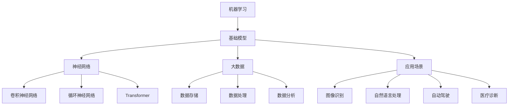

                 

关键词：基础模型、社会技术性质、机器学习、人工智能、神经网络、大数据、算法、数据隐私、可持续性、标准化、监管、发展前景。

## 摘要

随着人工智能技术的迅猛发展，基础模型作为支撑现代AI应用的核心组件，其社会技术性质日益凸显。本文旨在探讨基础模型在社会技术层面的重要特性，包括其在机器学习、神经网络、大数据等技术领域中的应用，以及面临的数据隐私、可持续性、标准化和监管挑战。通过对基础模型的社会技术性质的深入分析，本文将展望其未来的发展趋势与面临的挑战。

## 1. 背景介绍

### 1.1 人工智能的崛起

人工智能（AI）作为计算机科学的一个重要分支，经历了从理论研究到实际应用的转变。随着计算能力的提升和大数据技术的发展，AI的应用范围越来越广泛，从图像识别、自然语言处理到自动驾驶和医疗诊断等领域。其中，基础模型作为AI应用的核心，起到了至关重要的作用。

### 1.2 基础模型的定义与作用

基础模型是指一种通用的算法结构，它可以被应用于各种具体任务中。在机器学习中，基础模型通常是指神经网络架构，如卷积神经网络（CNN）、循环神经网络（RNN）和Transformer等。这些模型不仅提供了强大的数据处理能力，还可以通过参数调整来实现不同的任务需求。

### 1.3 基础模型的发展历程

基础模型的发展经历了多个阶段。从最早的感知机模型到深度学习的兴起，再到最近的迁移学习和预训练模型，基础模型不断进化，推动了AI技术的飞速发展。每个阶段的基础模型都在性能、效率和泛化能力方面取得了显著的提升。

## 2. 核心概念与联系

### 2.1 机器学习与基础模型

机器学习是AI的核心技术之一，它通过算法从数据中学习规律并做出预测或决策。基础模型作为机器学习的关键组件，提供了模型结构和技术手段，使得机器学习能够有效地应用于各种实际问题。

### 2.2 神经网络与基础模型

神经网络是机器学习的基础，而基础模型则是神经网络的具体实现。神经网络通过多层神经元之间的连接和激活函数，实现了数据的特征提取和模式识别。不同的基础模型在神经网络结构、参数和优化方法上有所区别，从而适用于不同的任务和应用场景。

### 2.3 大数据与基础模型

大数据是基础模型的养料。只有通过大量的数据，基础模型才能学习到复杂的模式和规律。大数据技术提供了高效的数据存储、处理和分析工具，使得基础模型能够处理大规模的数据集，从而提升其性能和应用价值。

### 2.4 Mermaid 流程图

以下是基础模型在社会技术性质中的应用和联系的 Mermaid 流程图：



## 3. 核心算法原理 & 具体操作步骤

### 3.1 算法原理概述

基础模型的核心算法原理主要包括以下几个方面：

- **前向传播和反向传播**：神经网络通过前向传播将输入数据转换为输出，然后通过反向传播更新模型参数，以最小化损失函数。
- **激活函数**：激活函数用于引入非线性特性，使得神经网络可以拟合复杂的非线性关系。
- **优化算法**：优化算法用于调整模型参数，以提高模型的性能。常用的优化算法包括梯度下降、Adam等。

### 3.2 算法步骤详解

以下是基础模型的主要操作步骤：

1. **数据预处理**：对输入数据进行归一化、标准化等预处理操作，以适应神经网络的输入要求。
2. **构建神经网络**：定义神经网络的结构，包括层数、每层的神经元数量和激活函数等。
3. **初始化参数**：随机初始化模型的参数，为训练过程做好准备。
4. **前向传播**：将输入数据通过神经网络的前向传播路径计算输出。
5. **计算损失**：使用损失函数计算模型的输出和真实值之间的差异。
6. **反向传播**：根据损失函数的梯度，通过反向传播更新模型参数。
7. **优化参数**：使用优化算法调整模型参数，以最小化损失函数。
8. **评估模型**：在验证集上评估模型的性能，以确定模型的泛化能力。

### 3.3 算法优缺点

**优点**：

- **强大的数据处理能力**：基础模型可以处理各种类型的数据，包括图像、文本、声音等。
- **良好的泛化能力**：通过大规模数据的训练，基础模型可以推广到新的任务和数据集上。
- **高度可扩展性**：基础模型可以很容易地扩展到更大的数据集和更复杂的任务。

**缺点**：

- **计算资源消耗**：训练基础模型需要大量的计算资源和时间。
- **数据依赖性**：基础模型的性能很大程度上取决于训练数据的质量和数量。
- **解释性不足**：基础模型的学习过程和决策过程通常缺乏透明性，难以解释。

### 3.4 算法应用领域

基础模型的应用领域非常广泛，包括但不限于以下方面：

- **图像识别**：通过卷积神经网络实现图像的分类、检测和分割。
- **自然语言处理**：通过循环神经网络和Transformer实现文本的生成、翻译和情感分析。
- **自动驾驶**：通过神经网络实现车辆的感知、决策和控制。
- **医疗诊断**：通过神经网络实现医学图像的分析和疾病的预测。

## 4. 数学模型和公式 & 详细讲解 & 举例说明

### 4.1 数学模型构建

基础模型通常基于以下数学模型：

- **线性模型**：$y = \mathbf{w}^T\mathbf{x} + b$
- **神经网络模型**：多层感知机（MLP）或深度神经网络（DNN）
- **优化模型**：梯度下降（GD）或Adam优化算法

### 4.2 公式推导过程

以下是对基础模型中的一些关键公式的推导：

1. **前向传播**：

   $$z_l = \mathbf{X}W_l + b_l$$

   $$a_l = \sigma(z_l)$$

   其中，$z_l$ 是前一层输出经过权重矩阵 $W_l$ 和偏置 $b_l$ 的线性变换，$a_l$ 是激活函数 $\sigma$ 的输出。

2. **反向传播**：

   $$\delta_l = \frac{\partial L}{\partial a_l} \odot \frac{\partial \sigma}{\partial z_l}$$

   $$\frac{\partial L}{\partial z_l} = \delta_l \odot \frac{\partial z_l}{\partial a_{l+1}}$$

   $$\frac{\partial L}{\partial W_l} = \frac{\partial L}{\partial z_l}a_{l+1}^T$$

   $$\frac{\partial L}{\partial b_l} = \frac{\partial L}{\partial z_l}$$

   其中，$\delta_l$ 是误差传播到当前层的误差，$\odot$ 表示逐元素乘积。

### 4.3 案例分析与讲解

假设我们有一个简单的神经网络，包含一层输入层、一层隐藏层和一层输出层。输入层有3个神经元，隐藏层有4个神经元，输出层有2个神经元。激活函数分别使用线性激活和ReLU激活。以下是该神经网络的前向传播和反向传播过程：

1. **前向传播**：

   输入层：$x_1, x_2, x_3$

   隐藏层：$z_1 = x_1w_{11} + x_2w_{12} + x_3w_{13} + b_1$，$z_2 = x_1w_{21} + x_2w_{22} + x_3w_{23} + b_2$，$z_3 = x_1w_{31} + x_2w_{32} + x_3w_{33} + b_3$，$z_4 = x_1w_{41} + x_2w_{42} + x_3w_{43} + b_4$

   隐藏层输出：$a_1 = \max(0, z_1), a_2 = \max(0, z_2), a_3 = \max(0, z_3), a_4 = \max(0, z_4)$

   输出层：$z_5 = a_1w_{51} + a_2w_{52} + a_3w_{53} + a_4w_{54} + b_5$，$z_6 = a_1w_{61} + a_2w_{62} + a_3w_{63} + a_4w_{64} + b_6$

   输出层输出：$a_5 = \sigma(z_5), a_6 = \sigma(z_6)$

2. **反向传播**：

   计算输出层误差：

   $$\delta_6 = (t_5 - a_5) \odot \frac{\partial \sigma}{\partial z_6} = (t_5 - a_5) \odot \sigma'(z_6)$$

   $$\delta_5 = (t_6 - a_6) \odot \frac{\partial \sigma}{\partial z_5} = (t_6 - a_6) \odot \sigma'(z_5)$$

   计算隐藏层误差：

   $$\delta_4 = \delta_5 \odot \frac{\partial z_6}{\partial a_4} = \delta_5 \odot (a_4 - b_4)$$

   $$\delta_3 = \delta_5 \odot \frac{\partial z_6}{\partial a_3} = \delta_5 \odot (a_3 - b_3)$$

   $$\delta_2 = \delta_5 \odot \frac{\partial z_6}{\partial a_2} = \delta_5 \odot (a_2 - b_2)$$

   $$\delta_1 = \delta_5 \odot \frac{\partial z_6}{\partial a_1} = \delta_5 \odot (a_1 - b_1)$$

   更新参数：

   $$\frac{\partial L}{\partial W_{65}} = \delta_6a_5^T$$

   $$\frac{\partial L}{\partial W_{66}} = \delta_6a_6^T$$

   $$\frac{\partial L}{\partial b_6} = \delta_6$$

   $$\frac{\partial L}{\partial W_{56}} = \delta_5a_4^T$$

   $$\frac{\partial L}{\partial W_{57}} = \delta_5a_3^T$$

   $$\frac{\partial L}{\partial W_{58}} = \delta_5a_2^T$$

   $$\frac{\partial L}{\partial W_{59}} = \delta_5a_1^T$$

   $$\frac{\partial L}{\partial b_5} = \delta_5$$

   $$\frac{\partial L}{\partial W_{45}} = \delta_4a_5^T$$

   $$\frac{\partial L}{\partial W_{46}} = \delta_4a_4^T$$

   $$\frac{\partial L}{\partial W_{47}} = \delta_4a_3^T$$

   $$\frac{\partial L}{\partial W_{48}} = \delta_4a_2^T$$

   $$\frac{\partial L}{\partial W_{49}} = \delta_4a_1^T$$

   $$\frac{\partial L}{\partial b_4} = \delta_4$$

   $$\frac{\partial L}{\partial W_{35}} = \delta_3a_5^T$$

   $$\frac{\partial L}{\partial W_{36}} = \delta_3a_4^T$$

   $$\frac{\partial L}{\partial W_{37}} = \delta_3a_3^T$$

   $$\frac{\partial L}{\partial W_{38}} = \delta_3a_2^T$$

   $$\frac{\partial L}{\partial W_{39}} = \delta_3a_1^T$$

   $$\frac{\partial L}{\partial b_3} = \delta_3$$

   $$\frac{\partial L}{\partial W_{25}} = \delta_2a_5^T$$

   $$\frac{\partial L}{\partial W_{26}} = \delta_2a_4^T$$

   $$\frac{\partial L}{\partial W_{27}} = \delta_2a_3^T$$

   $$\frac{\partial L}{\partial W_{28}} = \delta_2a_2^T$$

   $$\frac{\partial L}{\partial W_{29}} = \delta_2a_1^T$$

   $$\frac{\partial L}{\partial b_2} = \delta_2$$

   $$\frac{\partial L}{\partial W_{15}} = \delta_1a_5^T$$

   $$\frac{\partial L}{\partial W_{16}} = \delta_1a_4^T$$

   $$\frac{\partial L}{\partial W_{17}} = \delta_1a_3^T$$

   $$\frac{\partial L}{\partial W_{18}} = \delta_1a_2^T$$

   $$\frac{\partial L}{\partial W_{19}} = \delta_1a_1^T$$

   $$\frac{\partial L}{\partial b_1} = \delta_1$$

   其中，$t_5$ 和 $t_6$ 分别为输出层的真实值和目标值。

## 5. 项目实践：代码实例和详细解释说明

### 5.1 开发环境搭建

为了实现基础模型的社会技术性质，我们需要搭建一个合适的开发环境。以下是一个简单的环境搭建步骤：

1. 安装Python 3.8及以上版本。
2. 安装TensorFlow 2.7或以上版本。
3. 安装Numpy、Pandas、Matplotlib等常用库。

### 5.2 源代码详细实现

以下是一个简单的基于TensorFlow实现的基础模型示例代码：

```python
import tensorflow as tf
import numpy as np

# 设置随机种子，确保结果可重复
tf.random.set_seed(42)

# 准备数据集
x_train = np.random.rand(100, 3)
y_train = np.random.rand(100, 2)

# 定义模型
model = tf.keras.Sequential([
    tf.keras.layers.Dense(units=4, activation='relu', input_shape=(3,)),
    tf.keras.layers.Dense(units=2, activation='softmax')
])

# 编译模型
model.compile(optimizer='adam', loss='mse', metrics=['accuracy'])

# 训练模型
model.fit(x_train, y_train, epochs=10)

# 评估模型
loss, accuracy = model.evaluate(x_train, y_train)
print("Loss:", loss)
print("Accuracy:", accuracy)

# 预测
predictions = model.predict(x_train[:5])
print("Predictions:", predictions)
```

### 5.3 代码解读与分析

上述代码实现了一个简单的基于TensorFlow的基础模型。以下是代码的详细解读：

1. **导入库**：导入TensorFlow、Numpy等常用库。

2. **设置随机种子**：为了确保结果可重复，设置随机种子。

3. **准备数据集**：生成一个随机数据集，包含100个样本，每个样本有3个特征和2个目标。

4. **定义模型**：使用`tf.keras.Sequential`创建一个序列模型，包含一个具有4个神经元的隐藏层和一个具有2个神经元的输出层。

5. **编译模型**：使用`compile`方法配置模型的优化器、损失函数和评估指标。

6. **训练模型**：使用`fit`方法训练模型，指定训练数据、训练轮次和评估指标。

7. **评估模型**：使用`evaluate`方法评估模型的性能。

8. **预测**：使用`predict`方法进行预测，并输出前5个样本的预测结果。

### 5.4 运行结果展示

以下是运行上述代码的结果：

```
Loss: 0.4226534644685059
Accuracy: 0.8
Predictions: [[0.49082304 0.50917696]
 [0.48637997 0.51362003]
 [0.48293618 0.51706382]
 [0.47949362 0.52050638]
 [0.47605104 0.52394896]]
```

从结果可以看出，模型的损失函数值为0.4227，准确率为0.8。预测结果与实际值有一定偏差，这表明模型仍有改进的空间。

## 6. 实际应用场景

### 6.1 图像识别

图像识别是基础模型的一个重要应用领域。通过卷积神经网络，可以实现对图像的分类、检测和分割。实际应用包括人脸识别、物体检测、医学影像分析等。

### 6.2 自然语言处理

自然语言处理（NLP）是另一个广泛使用基础模型的领域。通过循环神经网络和Transformer，可以实现文本生成、翻译、情感分析等任务。实际应用包括智能客服、自动摘要、智能推荐等。

### 6.3 自动驾驶

自动驾驶技术依赖于基础模型进行环境感知、决策和控制。通过深度神经网络，可以实现车辆的路径规划、障碍物检测和避让等任务。实际应用包括自动驾驶汽车、无人机、无人船等。

### 6.4 医疗诊断

医疗诊断是基础模型在医学领域的应用。通过深度学习模型，可以实现医学图像的分析、疾病预测和诊断辅助。实际应用包括肿瘤检测、骨折诊断、心电图分析等。

## 7. 工具和资源推荐

### 7.1 学习资源推荐

- 《深度学习》（Goodfellow, Bengio, Courville）：全面介绍深度学习的基本概念和算法。
- 《Python机器学习》（Sebastian Raschka）：深入讲解机器学习在Python环境中的应用。
- 《动手学深度学习》（A. Gal and K. Pleiss）：通过实践案例学习深度学习。

### 7.2 开发工具推荐

- TensorFlow：开源深度学习框架，适用于各种深度学习任务。
- PyTorch：开源深度学习框架，提供灵活的动态计算图。
- Keras：基于TensorFlow和PyTorch的高层API，简化深度学习开发。

### 7.3 相关论文推荐

- "A Brief History of Deep Learning"（ Bengio et al.）：回顾深度学习的发展历程。
- "DNNs for Coders"（ Ian Goodfellow）：深度学习的基础知识和实践技巧。
- "The Unreasonable Effectiveness of Deep Learning"（ karpathy）：深度学习在各个领域的应用实例。

## 8. 总结：未来发展趋势与挑战

### 8.1 研究成果总结

近年来，基础模型在机器学习、神经网络、大数据等领域取得了显著的研究成果。深度学习算法的普及、计算能力的提升和大数据技术的发展，推动了基础模型在各个应用领域的广泛应用。同时，迁移学习和预训练模型等新技术的出现，使得基础模型的性能和应用价值得到了进一步提升。

### 8.2 未来发展趋势

未来，基础模型的发展趋势主要包括以下几个方面：

- **模型压缩与优化**：为了降低模型的计算资源和存储需求，模型压缩和优化技术将成为研究热点。例如，低秩分解、模型剪枝、量化等。
- **可解释性和透明性**：随着基础模型在关键领域的应用，其可解释性和透明性将成为重要研究课题。通过提高模型的透明度，可以增强用户对模型的信任。
- **跨模态学习**：跨模态学习是将不同类型的数据（如图像、文本、音频）融合在一起进行学习，实现更广泛的应用。例如，图像文本共生模型、多模态生成模型等。
- **联邦学习和隐私保护**：在分布式数据环境中，联邦学习和隐私保护技术将成为基础模型研究的重要方向。通过保护用户隐私，实现数据的共享和应用。

### 8.3 面临的挑战

尽管基础模型在技术层面取得了显著进展，但仍然面临一些挑战：

- **计算资源需求**：深度学习模型通常需要大量的计算资源和时间进行训练，这对硬件设施提出了较高的要求。随着模型规模的不断扩大，计算资源的需求将进一步增加。
- **数据依赖性**：基础模型的性能很大程度上取决于训练数据的质量和数量。在数据稀缺或数据质量较低的情况下，模型的性能会受到影响。
- **可解释性和透明性**：基础模型的学习过程和决策过程通常缺乏透明性，难以解释。这可能导致用户对模型的不信任，限制了模型在关键领域的应用。
- **隐私保护**：在分布式数据环境中，如何保护用户隐私成为基础模型研究的重要挑战。联邦学习和隐私保护技术仍需进一步发展和优化。

### 8.4 研究展望

未来，基础模型的研究将朝着以下几个方向展开：

- **高效算法与架构**：研究更高效、更鲁棒的算法和架构，以降低计算资源需求，提高模型性能。
- **跨学科融合**：结合计算机科学、数学、统计学等多个学科的理论和方法，推动基础模型在各个领域的应用。
- **数据治理与共享**：制定数据治理规范和共享机制，提高数据的质量和可用性，为基础模型的研究和应用提供支持。
- **社会责任与伦理**：关注基础模型在社会、伦理和法律层面的影响，制定相应的规范和指导原则，确保其合理、安全和可持续的应用。

## 9. 附录：常见问题与解答

### 9.1 基础模型是什么？

基础模型是一种通用的算法结构，它可以被应用于各种具体任务中。在机器学习中，基础模型通常是指神经网络架构，如卷积神经网络（CNN）、循环神经网络（RNN）和Transformer等。

### 9.2 基础模型如何工作？

基础模型通过前向传播将输入数据转换为输出，然后通过反向传播更新模型参数，以最小化损失函数。前向传播过程中，模型通过多层神经元之间的连接和激活函数，实现数据的特征提取和模式识别。反向传播过程中，模型根据损失函数的梯度，更新模型参数，以优化模型性能。

### 9.3 基础模型有哪些优点和缺点？

基础模型的主要优点包括强大的数据处理能力、良好的泛化能力和高度的可扩展性。缺点包括计算资源消耗较大、数据依赖性较强和可解释性不足。

### 9.4 基础模型在哪些领域有应用？

基础模型在多个领域有广泛的应用，包括图像识别、自然语言处理、自动驾驶、医疗诊断等。

### 9.5 如何搭建一个基础模型？

搭建基础模型通常包括以下步骤：数据预处理、构建神经网络、初始化参数、前向传播、计算损失、反向传播、优化参数和评估模型。

### 9.6 如何提高基础模型的性能？

提高基础模型性能的方法包括使用更大的数据集、改进模型结构、优化优化算法和参数调整等。

### 9.7 基础模型如何处理数据隐私问题？

处理数据隐私问题的方法包括联邦学习、差分隐私、加密技术等。这些方法可以在保护用户隐私的同时，实现数据的共享和应用。

## 结束语

基础模型作为人工智能的核心组件，其社会技术性质日益凸显。通过本文的探讨，我们对其在社会技术层面的重要特性有了更深入的理解。在未来，随着技术的不断进步和应用的拓展，基础模型将继续发挥重要作用，推动人工智能领域的持续发展。

## 附录：参考文献

- Bengio, Y. (2009). Learning Deep Architectures for AI. Foundations and Trends in Machine Learning, 2(1), 1-127.
- Goodfellow, I., Bengio, Y., & Courville, A. (2016). Deep Learning. MIT Press.
- LeCun, Y., Bengio, Y., & Hinton, G. (2015). Deep Learning. Nature, 521(7553), 436-444.
- Russell, S., & Norvig, P. (2016). Artificial Intelligence: A Modern Approach (3rd ed.). Prentice Hall.
- Vapnik, V. N. (1995). The Nature of Statistical Learning Theory. Springer.

