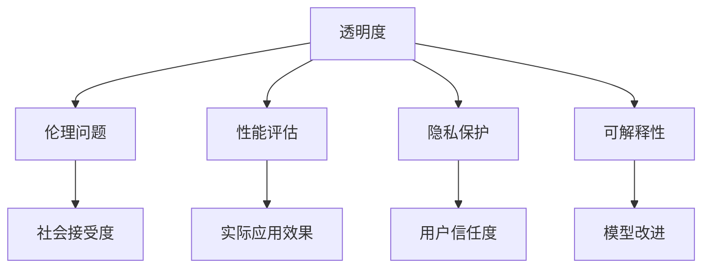

                 

基础模型是现代人工智能领域的关键组成部分，它们在图像识别、自然语言处理、推荐系统等多个领域中发挥了重要作用。然而，随着基础模型在社会技术中的应用越来越广泛，一系列社会技术问题也随之而来。本文将深入探讨这些问题的本质、原因及其解决方法。

## 关键词
- 基础模型
- 社会技术问题
- 透明度
- 伦理问题
- 性能评估
- 隐私保护
- 可解释性

## 摘要
本文旨在分析基础模型在社会技术中面临的若干关键问题，包括透明度、伦理问题、性能评估、隐私保护以及可解释性。通过探讨这些问题的根源，提出可能的解决策略，并展望未来发展方向。文章结构如下：

1. 背景介绍
2. 核心概念与联系
3. 核心算法原理与具体操作步骤
4. 数学模型与公式
5. 项目实践：代码实例
6. 实际应用场景
7. 工具和资源推荐
8. 总结：未来发展趋势与挑战

## 1. 背景介绍

### 1.1 基础模型的发展

基础模型作为人工智能的核心，其历史可以追溯到20世纪50年代。从最初的简单神经网络，到后来的深度学习模型，基础模型经历了无数次迭代与进化。随着计算能力的提升和大数据的普及，基础模型在图像识别、语音识别、自然语言处理等领域取得了突破性的进展。

### 1.2 基础模型的应用

目前，基础模型已经在各行各业得到广泛应用。例如，在医疗领域，基础模型可以用于疾病诊断和预测；在金融领域，基础模型可以用于风险控制和欺诈检测；在零售领域，基础模型可以用于个性化推荐和库存管理。

### 1.3 社会技术问题的提出

然而，随着基础模型的广泛应用，一系列社会技术问题也随之而来。这些问题不仅涉及到技术层面，还涉及到伦理、法律、社会等方方面面。

## 2. 核心概念与联系

为了更好地理解基础模型的社会技术问题，我们需要先了解一些核心概念。

### 2.1 透明度

透明度是指基础模型的工作过程和决策过程是否可以被理解和验证。透明度对于确保模型的公正性和可信度至关重要。

### 2.2 伦理问题

伦理问题涉及到基础模型的使用是否违背伦理原则，例如歧视、隐私侵犯等。

### 2.3 性能评估

性能评估是指如何衡量基础模型的效果，包括准确性、效率、鲁棒性等。

### 2.4 隐私保护

隐私保护是指如何确保基础模型在处理个人数据时不会泄露用户的隐私。

### 2.5 可解释性

可解释性是指基础模型的工作过程和决策过程是否可以被解释和理解。

### 2.6 Mermaid 流程图

下面是一个用 Mermaid 语言绘制的流程图，展示了这些核心概念之间的联系。



## 3. 核心算法原理与具体操作步骤

### 3.1 算法原理概述

基础模型通常基于深度学习技术，包括多层感知器、卷积神经网络、循环神经网络等。这些模型通过大量的数据训练，学习到输入和输出之间的复杂映射关系。

### 3.2 算法步骤详解

1. 数据预处理：对输入数据进行标准化、归一化等预处理操作，以适应模型的训练。
2. 模型训练：使用训练数据训练模型，通过反向传播算法不断调整模型的参数，以最小化预测误差。
3. 模型评估：使用验证数据评估模型的性能，包括准确性、效率、鲁棒性等指标。
4. 模型部署：将训练好的模型部署到实际应用场景中。

### 3.3 算法优缺点

- **优点**：深度学习模型具有强大的表征能力和适应性，能够处理复杂的问题。
- **缺点**：深度学习模型通常需要大量的数据和计算资源，而且训练过程复杂，结果不易解释。

### 3.4 算法应用领域

深度学习模型在图像识别、自然语言处理、推荐系统、语音识别等多个领域都有广泛应用。

## 4. 数学模型与公式

### 4.1 数学模型构建

深度学习模型的数学基础主要包括线性代数、概率论和优化理论。其中，最核心的部分是损失函数和优化算法。

### 4.2 公式推导过程

以多层感知器为例，其前向传播过程可以表示为：

$$
z^{(l)} = \sigma(W^{(l)} \cdot a^{(l-1)} + b^{(l)})
$$

其中，$z^{(l)}$ 表示第$l$层的输出，$W^{(l)}$ 和 $b^{(l)}$ 分别表示第$l$层的权重和偏置，$\sigma$ 表示激活函数。

反向传播过程可以表示为：

$$
\begin{aligned}
\delta^{(l)} &= \frac{\partial L}{\partial z^{(l)}} \cdot \frac{\partial z^{(l)}}{\partial a^{(l-1)}} \\
dW^{(l)} &= a^{(l-1)} \cdot \delta^{(l)} \\
db^{(l)} &= \delta^{(l)}
\end{aligned}
$$

其中，$L$ 表示损失函数，$\delta^{(l)}$ 表示第$l$层的误差。

### 4.3 案例分析与讲解

以图像分类任务为例，我们可以使用卷积神经网络（CNN）进行模型训练。假设输入图像的大小为$28 \times 28$，我们使用3个卷积层和2个全连接层进行模型构建。

```latex
\begin{aligned}
&\text{卷积层1:} \\
&z^{(1)} = \sigma(W^{(1)} \cdot a^{(0)} + b^{(1)}) \\
&\text{卷积层2:} \\
&z^{(2)} = \sigma(W^{(2)} \cdot z^{(1)} + b^{(2)}) \\
&\text{卷积层3:} \\
&z^{(3)} = \sigma(W^{(3)} \cdot z^{(2)} + b^{(3)}) \\
&\text{全连接层1:} \\
&a^{(4)} = W^{(4)} \cdot z^{(3)} + b^{(4)} \\
&\text{全连接层2:} \\
&\hat{y} = \sigma(W^{(5)} \cdot a^{(4)} + b^{(5)})
\end{aligned}
```

其中，$a^{(0)}$ 表示输入图像，$\hat{y}$ 表示输出预测结果。

## 5. 项目实践：代码实例

### 5.1 开发环境搭建

在本文中，我们将使用 TensorFlow 作为深度学习框架，Python 作为编程语言。

### 5.2 源代码详细实现

下面是一个简单的卷积神经网络实现，用于对 MNIST 数据集进行手写数字识别。

```python
import tensorflow as tf
from tensorflow.keras import layers

# 模型构建
model = tf.keras.Sequential([
    layers.Conv2D(32, (3, 3), activation='relu', input_shape=(28, 28, 1)),
    layers.MaxPooling2D((2, 2)),
    layers.Conv2D(64, (3, 3), activation='relu'),
    layers.MaxPooling2D((2, 2)),
    layers.Conv2D(64, (3, 3), activation='relu'),
    layers.Flatten(),
    layers.Dense(64, activation='relu'),
    layers.Dense(10, activation='softmax')
])

# 模型编译
model.compile(optimizer='adam',
              loss='sparse_categorical_crossentropy',
              metrics=['accuracy'])

# 模型训练
model.fit(train_images, train_labels, epochs=5)

# 模型评估
test_loss, test_acc = model.evaluate(test_images, test_labels)
print(f'\nTest accuracy: {test_acc:.4f}')
```

### 5.3 代码解读与分析

这段代码首先定义了一个卷积神经网络模型，包括3个卷积层和2个全连接层。模型使用ReLU作为激活函数，并在最后一层使用softmax进行分类。在模型编译阶段，我们指定了优化器和损失函数。模型训练阶段，我们使用5个epochs对MNIST数据集进行训练。最后，我们使用测试数据评估模型的性能。

## 6. 实际应用场景

基础模型在实际应用场景中具有广泛的应用前景。

### 6.1 医疗领域

在医疗领域，基础模型可以用于疾病诊断、药物研发、健康监测等方面。

### 6.2 金融领域

在金融领域，基础模型可以用于风险控制、欺诈检测、信用评估等方面。

### 6.3 零售领域

在零售领域，基础模型可以用于个性化推荐、库存管理、客户关系管理等方面。

## 7. 工具和资源推荐

### 7.1 学习资源推荐

- 《深度学习》（Ian Goodfellow、Yoshua Bengio、Aaron Courville 著）
- 《动手学深度学习》（阿斯顿·张 著）

### 7.2 开发工具推荐

- TensorFlow
- PyTorch

### 7.3 相关论文推荐

- "Deep Learning"（Ian Goodfellow）
- "Convolutional Neural Networks for Visual Recognition"（Karen Simonyan 和 Andrew Zisserman）

## 8. 总结：未来发展趋势与挑战

### 8.1 研究成果总结

近年来，基础模型在各个领域取得了显著的成果，推动了人工智能的发展。然而，随着模型规模的扩大和应用场景的复杂化，基础模型面临的挑战也日益增加。

### 8.2 未来发展趋势

未来，基础模型将朝着以下几个方向发展：

- **小样本学习**：减少对大规模数据的依赖，实现更高效的学习。
- **模型压缩与加速**：降低模型的存储和计算需求，提高部署效率。
- **可解释性**：提高模型的透明度和可解释性，增强用户信任。

### 8.3 面临的挑战

基础模型在发展过程中面临以下挑战：

- **数据隐私**：如何确保模型在处理敏感数据时保护用户隐私。
- **公平性与伦理**：如何避免模型在决策过程中出现歧视和偏见。
- **计算资源**：如何高效地训练和部署大规模模型。

### 8.4 研究展望

未来，我们需要在基础模型的理论研究、应用实践、政策法规等方面进行深入探索，以推动人工智能的可持续发展。

## 9. 附录：常见问题与解答

### 9.1 基础模型是什么？

基础模型是指用于处理大规模数据并实现特定任务（如分类、回归等）的深度学习模型。常见的有卷积神经网络（CNN）、循环神经网络（RNN）等。

### 9.2 如何训练基础模型？

训练基础模型通常包括以下几个步骤：

1. 数据预处理：对输入数据进行标准化、归一化等预处理操作。
2. 模型构建：根据任务需求设计模型结构。
3. 模型训练：使用训练数据训练模型，通过反向传播算法不断调整模型的参数。
4. 模型评估：使用验证数据评估模型的性能。
5. 模型部署：将训练好的模型部署到实际应用场景中。

### 9.3 如何提高基础模型的可解释性？

提高基础模型的可解释性可以从以下几个方面入手：

1. 特征可视化：通过可视化模型中的特征提取过程，帮助用户理解模型的决策过程。
2. 解释性模型：选择具有良好可解释性的模型结构，如决策树、线性模型等。
3. 模型压缩与分解：通过模型压缩和分解技术，降低模型复杂性，提高可解释性。

## 作者署名

本文作者为禅与计算机程序设计艺术（Zen and the Art of Computer Programming）。

