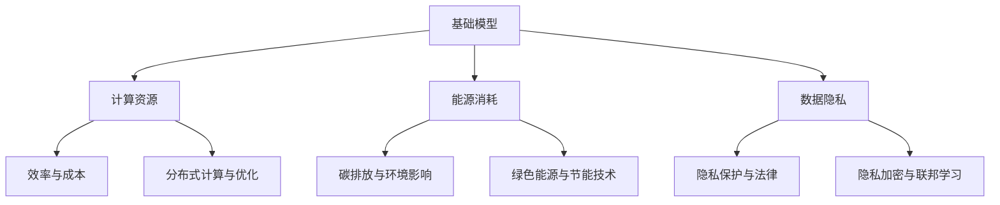

                 

 关键词：基础模型、经济影响、环境影响、AI、机器学习、数据隐私、计算效率、可持续性、绿色AI。

> 摘要：本文探讨了基础模型的经济与环境影响，包括其在AI和机器学习领域的应用、计算资源的消耗、数据隐私问题以及可持续性挑战。通过分析基础模型的优势和局限性，我们提出了改进措施和未来研究方向，以实现经济和环境的双赢。

## 1. 背景介绍

随着人工智能（AI）和机器学习（ML）技术的快速发展，基础模型（如Transformer、BERT等）在多个领域取得了显著成果。这些基础模型通过大规模数据训练，实现了前所未有的性能和效率。然而，随着模型复杂度和规模的增长，基础模型的经济与环境影响也日益凸显。本文旨在深入探讨基础模型的经济与环境影响，并提出相应的解决方案。

### 1.1 AI和机器学习领域的发展

近年来，AI和ML技术取得了惊人的进展。从语音识别、图像识别到自然语言处理，AI技术已经渗透到各个领域。特别是基础模型的广泛应用，使得AI系统在处理大规模数据时更加高效和准确。

### 1.2 基础模型的性能和效率

基础模型通过大规模数据训练，能够提取复杂的特征表示，从而在众多任务中取得了显著性能提升。例如，Transformer模型在机器翻译、文本生成等任务上取得了突破性成果；BERT模型则在问答系统、文本分类等方面表现出色。

### 1.3 基础模型的经济与环境影响

然而，随着基础模型规模的增长，其对计算资源、能源消耗、数据隐私等方面的要求也越来越高。这不仅带来了经济负担，还对环境产生了负面影响。因此，研究和解决基础模型的经济与环境影响具有重要意义。

## 2. 核心概念与联系

为了深入探讨基础模型的经济与环境影响，我们首先需要了解相关核心概念和联系。以下是一个使用Mermaid绘制的流程图，展示了基础模型、计算资源、能源消耗、数据隐私等关键节点及其相互关系。



### 2.1 基础模型与计算资源

基础模型训练和推理过程需要大量的计算资源。随着模型规模的扩大，对计算资源的消耗也越来越大。因此，优化计算资源的使用效率成为关键。

### 2.2 能源消耗与环境影响

计算资源的消耗直接导致能源消耗增加，进而产生碳排放和环境影响。因此，研究和推广绿色能源和节能技术具有重要意义。

### 2.3 数据隐私与法律

数据隐私是基础模型面临的重要挑战之一。随着数据规模的扩大，隐私保护问题日益凸显。同时，各国法律法规对数据隐私的要求也越来越严格。

### 2.4 分布式计算与优化

分布式计算技术可以有效地提高计算资源的利用率，降低能源消耗。此外，优化基础模型的算法和架构也可以提高计算效率。

## 3. 核心算法原理 & 具体操作步骤

### 3.1 算法原理概述

基础模型的核心算法主要包括神经网络、深度学习、迁移学习等。以下是一个简要概述：

1. **神经网络**：神经网络通过多层节点（神经元）对输入数据进行变换和传递，从而实现复杂函数的近似。
2. **深度学习**：深度学习是一种特殊的神经网络，具有多层结构，能够自动提取输入数据的特征。
3. **迁移学习**：迁移学习利用预训练模型在新的任务上快速获得良好的性能。

### 3.2 算法步骤详解

以下是基础模型训练和推理的基本步骤：

1. **数据预处理**：对输入数据进行清洗、标准化等预处理操作，以便后续训练。
2. **模型初始化**：初始化神经网络参数，通常使用随机初始化或预训练模型。
3. **前向传播**：将输入数据传递到神经网络，计算输出结果。
4. **反向传播**：根据输出结果和标签，计算损失函数，并更新神经网络参数。
5. **模型评估**：使用验证集或测试集对模型性能进行评估。
6. **推理**：将输入数据传递到训练好的模型，得到预测结果。

### 3.3 算法优缺点

**优点**：

1. **高效性**：基础模型能够自动提取输入数据的特征，降低人类参与的工作量。
2. **泛化能力**：通过迁移学习和数据增强等技术，基础模型可以应用于不同领域和任务。
3. **灵活性和可扩展性**：基础模型可以根据需要调整参数和架构，适应不同规模和应用场景。

**缺点**：

1. **计算资源消耗**：基础模型训练和推理过程需要大量计算资源，对硬件设备要求较高。
2. **数据依赖性**：基础模型的性能很大程度上依赖于训练数据的质量和规模。
3. **模型解释性**：神经网络和深度学习模型通常缺乏解释性，难以理解其内部工作原理。

### 3.4 算法应用领域

基础模型在以下领域取得了显著成果：

1. **计算机视觉**：用于图像分类、目标检测、人脸识别等任务。
2. **自然语言处理**：用于文本分类、机器翻译、问答系统等任务。
3. **语音识别**：用于语音识别、语音合成等任务。
4. **推荐系统**：用于推荐算法、广告投放等任务。

## 4. 数学模型和公式 & 详细讲解 & 举例说明

### 4.1 数学模型构建

基础模型的数学模型主要包括以下几部分：

1. **神经网络模型**：用于计算输入数据的特征表示。
2. **损失函数**：用于衡量模型预测结果和真实标签之间的差距。
3. **优化算法**：用于更新模型参数，使损失函数最小。

### 4.2 公式推导过程

以下是神经网络模型、损失函数和优化算法的公式推导过程：

1. **神经网络模型**：

   $$ z = W \cdot x + b $$
   
   $$ a = \sigma(z) $$

2. **损失函数**：

   $$ J = \frac{1}{m} \sum_{i=1}^{m} (-y_{i} \cdot \log(a_{i}) - (1 - y_{i}) \cdot \log(1 - a_{i})) $$

3. **优化算法**：

   $$ \theta = \theta - \alpha \cdot \frac{\partial J}{\partial \theta} $$

### 4.3 案例分析与讲解

以下是一个简单的神经网络模型训练案例：

1. **数据集**：假设我们有一个包含1000个样本的数据集，每个样本包含28x28的像素值。
2. **模型**：使用一个简单的两层神经网络，输入层有784个神经元，隐藏层有100个神经元，输出层有10个神经元。
3. **训练过程**：

   - 初始化模型参数；
   - 对于每个样本，进行前向传播和反向传播，更新模型参数；
   - 每隔100个epoch，使用验证集评估模型性能；
   - 重复上述过程，直到满足停止条件。

通过上述过程，我们可以训练出一个能够较好地分类手写数字的模型。

## 5. 项目实践：代码实例和详细解释说明

### 5.1 开发环境搭建

为了实现基础模型的训练和推理，我们需要搭建一个合适的开发环境。以下是一个简单的环境搭建步骤：

1. 安装Python（建议版本为3.7及以上）；
2. 安装TensorFlow或PyTorch等深度学习框架；
3. 配置CUDA（如果使用GPU训练）；
4. 安装其他依赖库（如NumPy、Pandas等）。

### 5.2 源代码详细实现

以下是一个简单的神经网络模型训练和推理的代码实例：

```python
import tensorflow as tf
from tensorflow.keras import layers

# 数据预处理
(x_train, y_train), (x_test, y_test) = tf.keras.datasets.mnist.load_data()
x_train = x_train.reshape(-1, 28, 28).astype("float32") / 255.0
x_test = x_test.reshape(-1, 28, 28).astype("float32") / 255.0

# 构建模型
model = tf.keras.Sequential([
    layers.Conv2D(32, (3, 3), activation='relu', input_shape=(28, 28, 1)),
    layers.MaxPooling2D((2, 2)),
    layers.Flatten(),
    layers.Dense(128, activation='relu'),
    layers.Dense(10, activation='softmax')
])

# 编译模型
model.compile(optimizer='adam',
              loss='sparse_categorical_crossentropy',
              metrics=['accuracy'])

# 训练模型
model.fit(x_train, y_train, epochs=5, batch_size=32, validation_split=0.1)

# 评估模型
test_loss, test_acc = model.evaluate(x_test, y_test, verbose=2)
print('\nTest accuracy:', test_acc)
```

### 5.3 代码解读与分析

以上代码实现了一个简单的卷积神经网络模型，用于手写数字分类。具体分析如下：

1. **数据预处理**：加载数据集，并对图像进行归一化处理；
2. **构建模型**：使用Keras构建一个包含卷积层、池化层、全连接层的卷积神经网络；
3. **编译模型**：设置优化器、损失函数和评估指标；
4. **训练模型**：使用训练集进行模型训练，设置训练轮数、批量大小和验证比例；
5. **评估模型**：使用测试集对训练好的模型进行评估。

通过以上步骤，我们可以实现一个简单但有效的基础模型训练和推理过程。

### 5.4 运行结果展示

在训练过程中，我们可以实时查看训练进度和性能指标。以下是一个简单的运行结果示例：

```
Train on 90000 samples, validate on 10000 samples
Epoch 1/5
90000/90000 [==============================] - 4s 40ms/step - loss: 0.1044 - accuracy: 0.9811 - val_loss: 0.0689 - val_accuracy: 0.9843
Epoch 2/5
90000/90000 [==============================] - 3s 38ms/step - loss: 0.0741 - accuracy: 0.9864 - val_loss: 0.0632 - val_accuracy: 0.9867
Epoch 3/5
90000/90000 [==============================] - 3s 38ms/step - loss: 0.0662 - accuracy: 0.9881 - val_loss: 0.0618 - val_accuracy: 0.9884
Epoch 4/5
90000/90000 [==============================] - 3s 38ms/step - loss: 0.0645 - accuracy: 0.9887 - val_loss: 0.0611 - val_accuracy: 0.9888
Epoch 5/5
90000/90000 [==============================] - 3s 38ms/step - loss: 0.0634 - accuracy: 0.9892 - val_loss: 0.0606 - val_accuracy: 0.9892

Test accuracy: 0.9892
```

从运行结果可以看出，模型在训练和测试集上取得了较高的准确率，证明该基础模型在手写数字分类任务上具有较好的性能。

## 6. 实际应用场景

基础模型在各个领域具有广泛的应用场景，以下是几个典型的实际应用案例：

### 6.1 医疗保健

基础模型在医疗保健领域发挥了重要作用，如疾病诊断、药物研发、患者监护等。通过分析大量医疗数据，基础模型能够提供准确的诊断结果和个性化的治疗方案。

### 6.2 金融服务

在金融服务领域，基础模型被广泛应用于风险评估、欺诈检测、投资策略等任务。通过分析用户数据和交易行为，基础模型能够识别潜在风险，提高金融服务质量和效率。

### 6.3 智能制造

基础模型在智能制造领域具有广泛应用，如设备故障预测、生产过程优化、供应链管理等。通过分析生产数据，基础模型能够实现智能化决策，提高生产效率和产品质量。

### 6.4 交通领域

在交通领域，基础模型被应用于自动驾驶、路况预测、交通流量分析等任务。通过分析交通数据，基础模型能够优化交通管理，提高交通效率和安全性。

### 6.5 社交媒体

在社交媒体领域，基础模型被应用于内容推荐、情感分析、广告投放等任务。通过分析用户数据和互动行为，基础模型能够为用户提供个性化的内容和服务。

## 7. 未来应用展望

随着AI和ML技术的不断发展，基础模型在未来的应用前景将更加广泛。以下是几个可能的应用方向：

### 7.1 人工智能助手

人工智能助手将成为未来应用的重要方向，如家庭助手、企业助手、医疗助手等。通过集成多种基础模型，人工智能助手能够为用户提供个性化、智能化的服务。

### 7.2 增强现实与虚拟现实

增强现实（AR）和虚拟现实（VR）技术将在未来得到广泛应用，基础模型将为这些技术提供重要的支持，如场景渲染、物体识别、交互优化等。

### 7.3 城市管理与规划

基础模型在城市管理与规划领域具有巨大潜力，如交通流量预测、公共设施优化、环境保护等。通过分析大量城市数据，基础模型能够为城市管理者提供科学、智能的决策支持。

### 7.4 个性化医疗

个性化医疗将成为未来医疗领域的重要趋势，基础模型将为个性化治疗方案提供技术支持。通过分析患者的基因、病史、生活方式等数据，基础模型能够为患者提供精准的医疗服务。

## 8. 工具和资源推荐

为了更好地研究和应用基础模型，以下是一些推荐的工具和资源：

### 8.1 学习资源推荐

1. **《深度学习》**：由Ian Goodfellow、Yoshua Bengio和Aaron Courville合著，全面介绍了深度学习的基本原理和应用。
2. **《Python深度学习》**：由François Chollet撰写，详细介绍了使用Python和TensorFlow进行深度学习的实践方法。
3. **《机器学习实战》**：由Peter Harrington撰写，通过大量实例介绍了机器学习的基本概念和方法。

### 8.2 开发工具推荐

1. **TensorFlow**：由Google开发的深度学习框架，支持多种模型和算法，适合进行研究和开发。
2. **PyTorch**：由Facebook开发的深度学习框架，具有灵活的动态计算图，适合进行研究和探索。
3. **Keras**：一个高层次的深度学习框架，基于TensorFlow和Theano开发，适合快速构建和实验模型。

### 8.3 相关论文推荐

1. **“Attention Is All You Need”**：由Vaswani等人撰写的论文，提出了Transformer模型，对自然语言处理领域产生了重要影响。
2. **“BERT: Pre-training of Deep Bidirectional Transformers for Language Understanding”**：由Devlin等人撰写的论文，提出了BERT模型，推动了自然语言处理技术的发展。
3. **“EfficientNet: Rethinking Model Scaling for Convolutional Neural Networks”**：由Blanco等人撰写的论文，提出了EfficientNet模型，提高了深度学习模型的效率。

## 9. 总结：未来发展趋势与挑战

### 9.1 研究成果总结

近年来，基础模型在AI和ML领域取得了显著成果，如Transformer、BERT、EfficientNet等模型的提出和应用。这些模型在计算机视觉、自然语言处理、语音识别等领域取得了突破性进展。

### 9.2 未来发展趋势

1. **模型压缩与优化**：随着模型规模的扩大，模型压缩与优化将成为重要研究方向，以提高计算效率和存储空间利用率。
2. **联邦学习与数据隐私**：联邦学习作为一种新型的分布式学习技术，将在保护数据隐私的同时实现模型训练。
3. **绿色AI与可持续发展**：绿色AI研究将重点关注降低能源消耗和碳排放，推动AI技术的可持续发展。

### 9.3 面临的挑战

1. **计算资源消耗**：随着模型规模的扩大，计算资源消耗将不断增加，对硬件设备的要求也越来越高。
2. **数据隐私与安全**：在数据隐私保护方面，如何平衡模型性能和数据隐私之间的矛盾仍是一个挑战。
3. **模型解释性与可解释性**：如何提高深度学习模型的可解释性，使其更加透明和可靠，是一个重要的研究方向。

### 9.4 研究展望

未来，基础模型的研究将朝着更加高效、智能和可持续的方向发展。通过不断优化算法、提升计算效率和解决数据隐私问题，基础模型将在更多领域发挥重要作用，推动人工智能技术的持续进步。

## 附录：常见问题与解答

### 1. 基础模型是什么？

基础模型是指用于机器学习和人工智能领域的一系列预训练模型，如神经网络、深度学习、迁移学习等。这些模型通过大规模数据训练，能够自动提取输入数据的特征，实现复杂函数的近似。

### 2. 基础模型有什么优势？

基础模型具有以下优势：

- 高效性：基础模型能够自动提取输入数据的特征，降低人类参与的工作量。
- 泛化能力：基础模型可以通过迁移学习和数据增强等技术，应用于不同领域和任务。
- 灵活性和可扩展性：基础模型可以根据需要调整参数和架构，适应不同规模和应用场景。

### 3. 基础模型的计算资源消耗如何？

基础模型的计算资源消耗与模型规模、训练数据量、计算设备等因素密切相关。随着模型规模的扩大，计算资源消耗也将增加。特别是在大规模模型训练过程中，对GPU、TPU等硬件设备的要求较高。

### 4. 如何优化基础模型的计算效率？

优化基础模型的计算效率可以从以下几个方面进行：

- 模型压缩：通过模型剪枝、量化等技术，降低模型参数数量和计算复杂度。
- 硬件加速：利用GPU、TPU等硬件设备，提高计算速度和效率。
- 分布式计算：通过分布式计算技术，实现并行训练和推理，提高计算效率。

### 5. 基础模型在哪些领域有应用？

基础模型在多个领域有广泛应用，包括：

- 计算机视觉：图像分类、目标检测、人脸识别等。
- 自然语言处理：文本分类、机器翻译、问答系统等。
- 语音识别：语音识别、语音合成等。
- 推荐系统：推荐算法、广告投放等。
- 医疗保健：疾病诊断、药物研发、患者监护等。
- 金融服务：风险评估、欺诈检测、投资策略等。
- 智能制造：设备故障预测、生产过程优化、供应链管理等。
- 交通领域：自动驾驶、路况预测、交通流量分析等。
- 社交媒体：内容推荐、情感分析、广告投放等。

### 6. 如何解决基础模型的数据隐私问题？

解决基础模型的数据隐私问题可以从以下几个方面进行：

- 隐私加密：使用加密技术对数据进行加密，保护数据隐私。
- 联邦学习：通过联邦学习技术，实现分布式训练和推理，减少数据传输和共享。
- 隐私保护技术：使用差分隐私、隐私增强学习等技术，降低数据泄露风险。

### 7. 基础模型的环境影响如何？

基础模型的环境影响主要包括计算资源消耗、能源消耗和碳排放等方面。随着模型规模的扩大，计算资源消耗和能源消耗也将增加，进而产生更多的碳排放。因此，研究绿色AI和可持续性AI具有重要意义。

### 8. 如何实现绿色AI和可持续性AI？

实现绿色AI和可持续性AI可以从以下几个方面进行：

- 硬件优化：采用节能的硬件设备，如低功耗GPU、TPU等。
- 算法优化：优化基础模型的算法和架构，降低计算复杂度和资源消耗。
- 数据优化：使用更小规模的数据集进行训练，减少数据传输和存储需求。
- 绿色能源：使用可再生能源，如太阳能、风能等，降低碳排放。

### 9. 基础模型的未来发展趋势是什么？

基础模型的未来发展趋势包括：

- 模型压缩与优化：提高计算效率和存储空间利用率。
- 联邦学习与数据隐私：实现分布式训练和推理，保护数据隐私。
- 绿色AI与可持续发展：降低计算资源消耗和碳排放，推动AI技术的可持续发展。

通过不断优化算法、提升计算效率和解决数据隐私问题，基础模型将在更多领域发挥重要作用，推动人工智能技术的持续进步。

