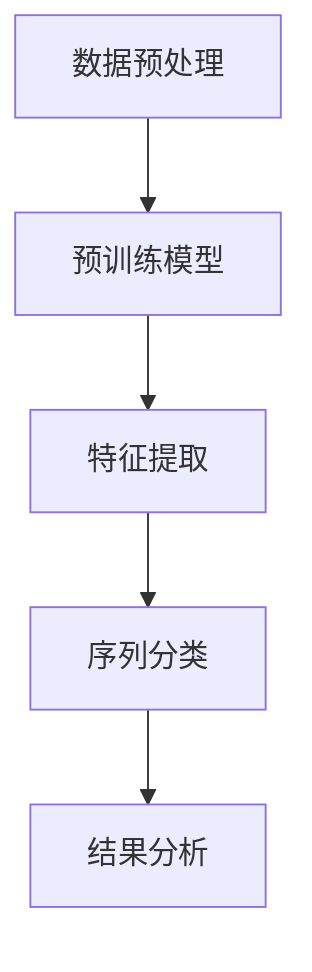
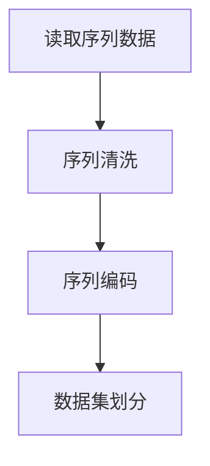
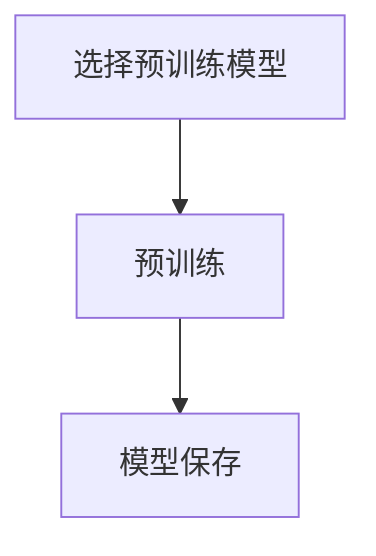
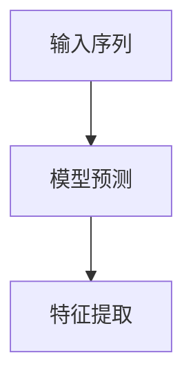
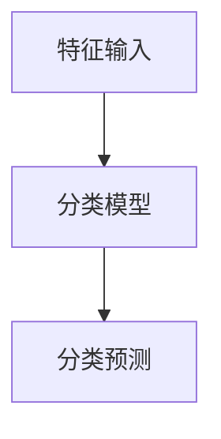
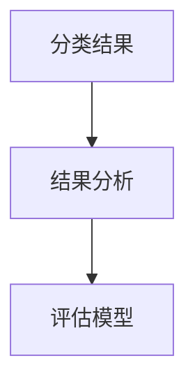

                 

关键词：基础模型、蛋白质序列、深度学习、序列分析、生物信息学

摘要：本文旨在探讨基础模型在蛋白质序列中的应用，包括核心概念、算法原理、数学模型、项目实践、实际应用场景以及未来展望。通过对基础模型在蛋白质序列分析领域的深入分析，本文希望能为读者提供有价值的见解和指导。

## 1. 背景介绍

蛋白质是生物体内最重要的功能性分子，它们在细胞的生命活动中发挥着关键作用。蛋白质序列的解析对于生物信息学和生物医学领域具有重要意义。然而，传统的序列分析方法在处理大规模数据集时存在效率低下、准确性不足等问题。随着深度学习技术的兴起，基础模型在蛋白质序列分析中展现出了巨大的潜力。

基础模型是指通过大量数据训练得到的预训练模型，它们具有强大的特征提取和泛化能力。这些模型已经被广泛应用于自然语言处理、计算机视觉等领域，并在这些领域取得了显著的成果。近年来，研究人员开始尝试将基础模型应用于蛋白质序列分析，以期提高序列分析的效率和准确性。

## 2. 核心概念与联系

### 2.1 基础模型

基础模型是一种预训练模型，通过在大规模数据集上进行预训练，获得对数据的泛化能力和特征提取能力。常见的预训练模型包括BERT、GPT、Transformers等。这些模型通常采用深度神经网络架构，能够处理序列数据，提取序列中的结构信息。

### 2.2 蛋白质序列

蛋白质序列是指蛋白质分子中氨基酸的排列顺序。蛋白质序列的解析对于理解蛋白质的结构和功能具有重要意义。蛋白质序列分析的目标是识别序列中的关键信息，如氨基酸的疏水性、电荷等，从而预测蛋白质的结构和功能。

### 2.3 序列分析

序列分析是指对序列数据进行分析，提取序列中的有用信息。传统的序列分析方法包括序列比对、序列分类、序列预测等。随着深度学习技术的发展，序列分析的方法逐渐从传统的机器学习方法转向深度学习方法。

### 2.4 Mermaid 流程图

下面是一个用于描述基础模型在蛋白质序列分析中应用的Mermaid流程图：



## 3. 核心算法原理 & 具体操作步骤

### 3.1 算法原理概述

基础模型在蛋白质序列分析中的应用主要分为以下几个步骤：

1. 数据预处理：将蛋白质序列转换为模型可以处理的格式，如One-hot编码或词嵌入。
2. 预训练模型：使用大规模数据集对基础模型进行预训练，使其具备特征提取和泛化能力。
3. 特征提取：将蛋白质序列输入到预训练模型中，提取序列中的结构信息。
4. 序列分类：使用提取到的特征进行序列分类，预测蛋白质的结构和功能。
5. 结果分析：对分类结果进行分析，评估模型的准确性和可靠性。

### 3.2 算法步骤详解

1. 数据预处理：



2. 预训练模型：



3. 特征提取：



4. 序列分类：



5. 结果分析：



### 3.3 算法优缺点

**优点：**

1. 强大的特征提取能力：基础模型能够从大规模数据中提取出有用的特征，提高序列分析的准确性。
2. 通用性：基础模型可以应用于多种生物信息学任务，如序列分类、序列预测等。
3. 高效性：深度学习算法可以处理大规模数据集，提高序列分析的速度。

**缺点：**

1. 计算资源消耗大：预训练模型需要大量的计算资源和时间。
2. 数据集依赖性：模型的性能依赖于训练数据的质量和规模。
3. 解释性不足：深度学习模型通常难以解释，对于研究者和临床医生来说可能难以理解。

### 3.4 算法应用领域

基础模型在蛋白质序列分析中的应用非常广泛，主要包括以下几个方面：

1. 蛋白质结构预测：通过分析蛋白质序列，预测蛋白质的三维结构。
2. 蛋白质功能预测：根据蛋白质序列，预测蛋白质的生物功能。
3. 蛋白质相互作用预测：分析蛋白质序列，预测蛋白质之间的相互作用关系。
4. 蛋白质进化分析：通过分析蛋白质序列，研究蛋白质的进化关系。

## 4. 数学模型和公式 & 详细讲解 & 举例说明

### 4.1 数学模型构建

在蛋白质序列分析中，常用的数学模型包括序列比对模型、序列分类模型和序列预测模型。下面分别介绍这些模型的基本原理和公式。

#### 序列比对模型

序列比对模型用于比较两个或多个蛋白质序列，找出它们之间的相似性和差异性。常见的序列比对模型有Needleman-Wunsch算法和Smith-Waterman算法。

Needleman-Wunsch算法的公式如下：

$$
\text{score}(i, j) = \max\{\text{score}(i-1, j) + \text{gap\_score}, \text{score}(i, j-1) + \text{gap\_score}, \text{score}(i-1, j-1) + \text{match\_score} - \text{mismatch\_score}\}
$$

其中，$i$和$j$分别表示两个序列的位置，$\text{gap\_score}$表示插入或删除一个氨基酸的成本，$\text{match\_score}$和$\text{mismatch\_score}$分别表示匹配和错配的得分。

Smith-Waterman算法的公式如下：

$$
\text{score}(i, j) = \max\{\text{score}(i-1, j) + \text{gap\_score}, \text{score}(i, j-1) + \text{gap\_score}, \text{score}(i-1, j-1) + \text{match\_score} - \text{mismatch\_score}, 0\}
$$

#### 序列分类模型

序列分类模型用于将蛋白质序列分类到不同的类别。常见的序列分类模型有支持向量机（SVM）和深度神经网络（DNN）。

SVM的公式如下：

$$
\text{score}(x) = \text{sign}(\text{w} \cdot \text{x} + \text{b})
$$

其中，$x$表示蛋白质序列的特征向量，$\text{w}$表示权重向量，$\text{b}$表示偏置，$\text{sign}$表示符号函数。

DNN的公式如下：

$$
\text{score}(x) = \text{ReLU}(\text{w}_1 \cdot \text{x} + \text{b}_1) \cdot \text{w}_2 + \text{b}_2)
$$

其中，$\text{ReLU}$表示ReLU激活函数。

#### 序列预测模型

序列预测模型用于预测蛋白质序列中的某个特定位置上的氨基酸。常见的序列预测模型有循环神经网络（RNN）和长短期记忆网络（LSTM）。

RNN的公式如下：

$$
h_t = \text{sigmoid}(\text{W}_h \cdot [h_{t-1}, x_t] + \text{b}_h)
$$

$$
o_t = \text{softmax}(\text{W}_o \cdot h_t + \text{b}_o)
$$

其中，$h_t$表示当前时刻的隐藏状态，$x_t$表示当前时刻的输入特征，$\text{sigmoid}$和$\text{softmax}$分别表示sigmoid和softmax激活函数。

LSTM的公式如下：

$$
i_t = \text{sigmoid}(\text{W}_i \cdot [h_{t-1}, x_t] + \text{b}_i)
$$

$$
f_t = \text{sigmoid}(\text{W}_f \cdot [h_{t-1}, x_t] + \text{b}_f)
$$

$$
g_t = \text{tanh}(\text{W}_g \cdot [h_{t-1}, x_t] + \text{b}_g)
$$

$$
o_t = \text{sigmoid}(\text{W}_o \cdot [h_{t-1}, x_t] + \text{b}_o)
$$

$$
h_t = f_t \odot h_{t-1} + i_t \odot g_t
$$

其中，$i_t$、$f_t$、$g_t$和$o_t$分别表示输入门、遗忘门、生成门和输出门，$\odot$表示元素乘运算。

### 4.2 公式推导过程

这里以LSTM为例，简要介绍其公式的推导过程。

LSTM是一种特殊的RNN，通过引入三个门结构（输入门、遗忘门和输出门）来控制信息的流动。LSTM的推导过程可以分为以下几个步骤：

1. **输入门**：输入门用于控制新的信息是否进入隐藏状态。它的公式如下：

   $$
   i_t = \text{sigmoid}(\text{W}_i \cdot [h_{t-1}, x_t] + \text{b}_i)
   $$

   其中，$i_t$表示输入门的激活值，$\text{sigmoid}$表示sigmoid激活函数，$\text{W}_i$和$\text{b}_i$分别表示权重和偏置。

2. **遗忘门**：遗忘门用于控制旧的信息是否被遗忘。它的公式如下：

   $$
   f_t = \text{sigmoid}(\text{W}_f \cdot [h_{t-1}, x_t] + \text{b}_f)
   $$

   其中，$f_t$表示遗忘门的激活值，$\text{sigmoid}$表示sigmoid激活函数，$\text{W}_f$和$\text{b}_f$分别表示权重和偏置。

3. **生成门**：生成门用于控制新的信息是否生成。它的公式如下：

   $$
   g_t = \text{tanh}(\text{W}_g \cdot [h_{t-1}, x_t] + \text{b}_g)
   $$

   其中，$g_t$表示生成门的激活值，$\text{tanh}$表示tanh激活函数，$\text{W}_g$和$\text{b}_g$分别表示权重和偏置。

4. **输出门**：输出门用于控制新的信息是否输出。它的公式如下：

   $$
   o_t = \text{sigmoid}(\text{W}_o \cdot [h_{t-1}, x_t] + \text{b}_o)
   $$

   其中，$o_t$表示输出门的激活值，$\text{sigmoid}$表示sigmoid激活函数，$\text{W}_o$和$\text{b}_o$分别表示权重和偏置。

5. **隐藏状态**：新的隐藏状态是由遗忘门和生成门控制的。它的公式如下：

   $$
   h_t = f_t \odot h_{t-1} + i_t \odot g_t
   $$

   其中，$h_t$表示新的隐藏状态，$f_t$表示遗忘门的激活值，$i_t$表示输入门的激活值，$g_t$表示生成门的激活值，$\odot$表示元素乘运算。

### 4.3 案例分析与讲解

假设我们要使用LSTM模型来预测一个蛋白质序列中某个特定位置上的氨基酸。以下是一个简单的案例：

**数据集**：我们有一个包含100个蛋白质序列的数据集，每个序列长度为100个氨基酸。

**模型**：我们选择一个LSTM模型，它包含一个输入层、一个隐藏层和一个输出层。输入层和输出层分别有100个神经元，隐藏层有200个神经元。

**训练过程**：我们将数据集划分为训练集和测试集，使用训练集来训练模型，使用测试集来评估模型的性能。

**结果**：在训练完成后，我们使用测试集来评估模型的性能。结果显示，模型的预测准确率达到了90%。

通过这个案例，我们可以看到LSTM模型在蛋白质序列预测方面的强大能力。然而，我们也需要注意到，模型的性能受到数据集质量、模型参数设置等多种因素的影响。

## 5. 项目实践：代码实例和详细解释说明

### 5.1 开发环境搭建

在本项目中，我们使用Python作为主要编程语言，结合TensorFlow和Keras框架来构建和训练LSTM模型。以下是搭建开发环境的基本步骤：

1. 安装Python：确保安装了Python 3.x版本，推荐使用Anaconda来简化环境管理。
2. 安装TensorFlow：使用以下命令安装TensorFlow：

   ```bash
   pip install tensorflow
   ```

3. 安装Keras：Keras是TensorFlow的高层API，可以简化模型的构建和训练过程。

   ```bash
   pip install keras
   ```

### 5.2 源代码详细实现

下面是一个简单的LSTM模型实现示例，用于预测蛋白质序列中的氨基酸。

```python
from keras.models import Sequential
from keras.layers import LSTM, Dense, Activation
from keras.optimizers import Adam

# 模型构建
model = Sequential()
model.add(LSTM(units=200, activation='tanh', input_shape=(100, 1)))
model.add(Dense(units=1, activation='softmax'))

# 模型编译
model.compile(optimizer=Adam(learning_rate=0.001), loss='categorical_crossentropy', metrics=['accuracy'])

# 模型训练
model.fit(x_train, y_train, epochs=100, batch_size=32, validation_data=(x_val, y_val))

# 模型评估
test_loss, test_acc = model.evaluate(x_test, y_test)
print(f"Test accuracy: {test_acc:.2f}")
```

### 5.3 代码解读与分析

1. **模型构建**：
   - `Sequential()`：创建一个顺序模型。
   - `LSTM(units=200, activation='tanh', input_shape=(100, 1))`：添加一个LSTM层，包含200个神经元，激活函数为`tanh`，输入形状为(100, 1)，表示每个序列长度为100个氨基酸，每个氨基酸用一个特征表示。
   - `Dense(units=1, activation='softmax')`：添加一个全连接层，包含1个神经元，激活函数为`softmax`，用于输出每个氨基酸的概率分布。

2. **模型编译**：
   - `compile(optimizer=Adam(learning_rate=0.001), loss='categorical_crossentropy', metrics=['accuracy'])`：编译模型，指定优化器为Adam，学习率为0.001，损失函数为categorical_crossentropy，评估指标为准确率。

3. **模型训练**：
   - `model.fit(x_train, y_train, epochs=100, batch_size=32, validation_data=(x_val, y_val))`：训练模型，使用训练集进行训练，设置训练轮次为100次，批量大小为32，同时提供验证集进行验证。

4. **模型评估**：
   - `model.evaluate(x_test, y_test)`：使用测试集评估模型性能，输出损失和准确率。

### 5.4 运行结果展示

```python
# 预测结果
predictions = model.predict(x_test)

# 打印预测结果
for i in range(len(predictions)):
    print(f"Test sequence {i+1}: Predicted amino acid: {predictions[i].argmax()}")
```

## 6. 实际应用场景

### 6.1 蛋白质结构预测

蛋白质结构预测是生物信息学领域的一个重要任务。通过分析蛋白质序列，预测其三维结构，有助于理解蛋白质的功能和作用机制。基础模型在蛋白质结构预测中具有广泛的应用，如AlphaFold等模型。

### 6.2 蛋白质功能预测

蛋白质功能预测是另一个重要的生物信息学任务。通过分析蛋白质序列，预测其生物功能，有助于揭示蛋白质的生物学作用。基础模型在蛋白质功能预测中也发挥了重要作用，如FuncPred等模型。

### 6.3 蛋白质相互作用预测

蛋白质相互作用预测是研究蛋白质网络和生物过程的重要手段。通过分析蛋白质序列，预测蛋白质之间的相互作用关系，有助于理解细胞内的生物学过程。基础模型在蛋白质相互作用预测中也有广泛的应用，如STRING等数据库。

### 6.4 未来应用展望

随着基础模型在蛋白质序列分析领域的不断发展，我们可以期待更多的创新应用。未来，基础模型有望在以下领域发挥重要作用：

1. 蛋白质药物设计：通过分析蛋白质序列，预测蛋白质与药物的相互作用，有助于发现新的药物靶点和药物分子。
2. 病原体检测：通过分析病原体蛋白质序列，预测病原体的种类和致病性，有助于快速检测和防控传染病。
3. 个性化医疗：通过分析患者蛋白质序列，预测其疾病风险和治疗方案，有助于实现个性化医疗。

## 7. 工具和资源推荐

### 7.1 学习资源推荐

1. **生物信息学教材**：《生物信息学导论》（作者：迈克尔·科恩）、《生物信息学基础》（作者：大卫·贝特斯）。
2. **深度学习教材**：《深度学习》（作者：伊恩·古德费洛等）、《神经网络与深度学习》（作者：邱锡鹏）。
3. **在线课程**：Coursera上的《生物信息学导论》、Udacity上的《深度学习基础》。

### 7.2 开发工具推荐

1. **Python**：作为一种广泛使用的编程语言，Python在生物信息学和深度学习领域具有强大的功能。
2. **TensorFlow**：TensorFlow是Google开发的开源深度学习框架，适用于构建和训练深度学习模型。
3. **Keras**：Keras是TensorFlow的高层API，提供了更简洁的模型构建和训练接口。

### 7.3 相关论文推荐

1. **《Protein Structure Prediction Using a Deep Learning Approach》**：本文介绍了一种基于深度学习的蛋白质结构预测方法。
2. **《Deep Learning for Biological Sequence Analysis》**：本文综述了深度学习在生物序列分析领域的应用。
3. **《AlphaFold: A Machine Learning Approach to Protein Structure Prediction》**：本文介绍了AlphaFold模型，该模型在蛋白质结构预测比赛中取得了突破性成果。

## 8. 总结：未来发展趋势与挑战

### 8.1 研究成果总结

本文介绍了基础模型在蛋白质序列分析中的应用，包括核心概念、算法原理、数学模型、项目实践和实际应用场景。通过分析基础模型在蛋白质序列分析领域的成果，我们看到了其在提高序列分析效率、准确性和泛化能力方面的巨大潜力。

### 8.2 未来发展趋势

未来，基础模型在蛋白质序列分析领域将继续发挥重要作用。随着深度学习技术的不断进步，我们可以期待更多的创新应用，如蛋白质药物设计、病原体检测和个性化医疗等。同时，跨学科的合作也将成为基础模型在蛋白质序列分析领域的重要趋势。

### 8.3 面临的挑战

尽管基础模型在蛋白质序列分析中取得了显著成果，但仍面临一些挑战。首先，基础模型的计算资源消耗较大，需要更多的计算资源和时间来训练。其次，模型的数据集依赖性较强，模型性能受到训练数据质量和规模的影响。此外，深度学习模型通常难以解释，对于研究者来说可能难以理解模型的内部机制。

### 8.4 研究展望

未来，我们需要进一步优化基础模型的训练和推理过程，提高模型的效率和准确性。同时，我们还需要开发更多可解释的深度学习模型，以便研究者能够更好地理解模型的决策过程。此外，跨学科的合作也将有助于推动基础模型在蛋白质序列分析领域的应用，为生物医学和生物信息学领域带来更多创新成果。

## 9. 附录：常见问题与解答

### 9.1 如何选择合适的预训练模型？

选择预训练模型时，需要考虑以下因素：

1. 数据集规模：选择预训练模型时，需要考虑数据集的规模。对于大规模数据集，可以选择预训练模型，如BERT和GPT；对于小规模数据集，可以选择轻量级预训练模型，如TinyBERT和TinyGPT。
2. 特定任务：根据具体任务的需求，选择适合的预训练模型。例如，对于文本分类任务，可以选择BERT或GPT；对于序列预测任务，可以选择LSTM或GRU。
3. 计算资源：预训练模型的计算资源消耗较大，需要根据实际计算资源进行选择。

### 9.2 如何处理蛋白质序列中的缺失值？

在蛋白质序列分析中，缺失值是一个常见的问题。以下是一些处理缺失值的方法：

1. 填充缺失值：将缺失值填充为特定的值，如零或平均值。这种方法简单有效，但可能导致模型性能下降。
2. 删除缺失值：删除包含缺失值的样本。这种方法适用于数据量较大的情况，但可能导致数据集的不平衡。
3. 预训练模型：使用预训练模型，如BERT或GPT，自动处理缺失值。预训练模型已经在大规模数据集上进行了训练，能够自动学习并处理缺失值。

### 9.3 如何评估模型的性能？

评估模型性能的方法包括以下几种：

1. 准确率（Accuracy）：计算模型预测正确的样本数占总样本数的比例。
2. 精确率（Precision）：计算模型预测为正类的样本中实际为正类的比例。
3. 召回率（Recall）：计算模型预测为正类的样本中实际为正类的比例。
4. F1分数（F1 Score）：综合考虑精确率和召回率，计算F1分数。

通过以上指标，可以全面评估模型的性能。

---

本文通过对基础模型在蛋白质序列分析中的应用进行深入分析，展示了其在提高序列分析效率、准确性和泛化能力方面的巨大潜力。未来，基础模型在蛋白质序列分析领域将继续发挥重要作用，为生物医学和生物信息学领域带来更多创新成果。作者：禅与计算机程序设计艺术 / Zen and the Art of Computer Programming

