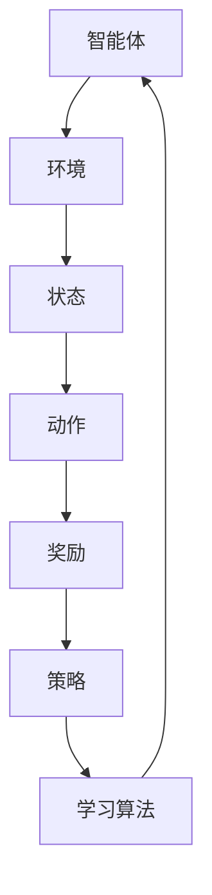

                 

关键词：增强学习，机器学习，智能决策，代码实例，算法原理

摘要：本文将深入探讨增强学习的原理和应用，通过详细的算法原理概述、具体操作步骤、数学模型和公式推导，以及代码实例和实际应用场景的讲解，帮助读者全面理解增强学习，掌握其核心技术和应用。

## 1. 背景介绍

增强学习（Reinforcement Learning，简称RL）是机器学习的一个分支，它主要研究如何通过智能体（agent）与环境（environment）的交互，来学习在特定情境下做出最优决策的方法。与监督学习和无监督学习不同，增强学习注重于通过奖励机制来指导智能体的行为，使其逐步改善决策质量，达到预期目标。

### 1.1 增强学习的发展历程

增强学习最早可以追溯到20世纪50年代，由美国心理学家和行为科学家Edwin A. Abelard开展的行为主义心理学研究。1970年代，随着计算机科学和人工智能技术的发展，增强学习逐渐成为一个独立的领域。

1980年代，增强学习算法得到进一步发展，主要包括Q-Learning、SARSA和Q-learning等。这一时期，增强学习在机器人控制、游戏AI等领域取得显著成果。

1990年代，随着神经网络技术的发展，增强学习算法逐渐引入神经网络模型，形成了基于神经网络的增强学习（Neural Reinforcement Learning）。这一时期，增强学习在自然语言处理、计算机视觉等领域得到广泛应用。

2000年代，深度增强学习（Deep Reinforcement Learning）的出现，使得增强学习在处理复杂任务方面取得重大突破。AlphaGo等深度增强学习模型的成功，进一步推动了增强学习的研究和应用。

### 1.2 增强学习的应用领域

增强学习具有广泛的应用领域，包括但不限于：

1. **游戏AI**：如Dota 2、StarCraft 2等游戏中的AI选手。
2. **机器人控制**：如自动驾驶、无人机导航等。
3. **自然语言处理**：如机器翻译、文本生成等。
4. **计算机视觉**：如目标检测、图像分类等。
5. **金融领域**：如投资组合优化、风险管理等。
6. **医疗领域**：如疾病诊断、手术规划等。

## 2. 核心概念与联系

增强学习主要包括以下几个核心概念：

### 2.1 智能体（Agent）

智能体是增强学习中的主体，它可以是人类、机器人、软件程序等，能够接收环境信息、执行动作并获取奖励。

### 2.2 环境（Environment）

环境是智能体执行动作的场所，它可以是一个物理环境，也可以是一个虚拟环境。

### 2.3 状态（State）

状态是智能体在某一时刻所处的环境描述，通常用一组特征向量表示。

### 2.4 动作（Action）

动作是智能体在某一状态下执行的行为，它可以改变状态并获取奖励。

### 2.5 奖励（Reward）

奖励是环境对智能体动作的反馈，用于评估智能体行为的优劣。

### 2.6 策略（Policy）

策略是智能体在给定状态下选择动作的规则，可以是确定性策略或随机策略。

### 2.7 值函数（Value Function）

值函数是评估智能体在未来时间内获取奖励的期望值，用于指导智能体选择最佳动作。

### 2.8 学习算法

学习算法是智能体从经验中学习、调整策略的过程，主要包括Q-Learning、SARSA、深度强化学习等。

下面是一个简单的Mermaid流程图，用于描述增强学习的基本架构：



## 3. 核心算法原理 & 具体操作步骤

### 3.1 算法原理概述

增强学习算法主要包括以下几个步骤：

1. 初始化智能体、环境和策略。
2. 智能体根据当前状态选择动作。
3. 执行动作并获取奖励。
4. 根据奖励调整策略。
5. 重复步骤2-4，直到达到预期目标。

### 3.2 算法步骤详解

#### 3.2.1 初始化

初始化智能体、环境和策略，通常采用随机初始化或经验初始化。

#### 3.2.2 选择动作

智能体根据当前状态和策略选择动作。在确定性策略中，动作是直接根据状态计算得到的；在随机策略中，动作是通过概率分布选择的。

#### 3.2.3 执行动作

智能体执行选择的动作，改变当前状态。

#### 3.2.4 获取奖励

环境根据智能体的动作提供奖励，用于评估动作的好坏。

#### 3.2.5 调整策略

根据奖励调整策略，使得智能体在未来的决策中更加倾向于选择能够获得更高奖励的动作。

### 3.3 算法优缺点

#### 优点

1. 自适应性强：增强学习通过学习奖励机制，能够适应不同的环境和任务。
2. 自主决策：增强学习中的智能体具有自主决策能力，无需外部监督。
3. 广泛应用：增强学习在多个领域取得显著成果，如游戏AI、机器人控制等。

#### 缺点

1. 学习速度慢：增强学习需要大量的交互和试错过程，学习速度相对较慢。
2. 数据敏感性：增强学习对环境数据的依赖较强，数据质量对学习效果影响较大。

### 3.4 算法应用领域

增强学习在多个领域具有广泛的应用，包括但不限于：

1. **游戏AI**：如Dota 2、StarCraft 2等游戏中的AI选手。
2. **机器人控制**：如自动驾驶、无人机导航等。
3. **自然语言处理**：如机器翻译、文本生成等。
4. **计算机视觉**：如目标检测、图像分类等。
5. **金融领域**：如投资组合优化、风险管理等。
6. **医疗领域**：如疾病诊断、手术规划等。

## 4. 数学模型和公式 & 详细讲解 & 举例说明

### 4.1 数学模型构建

增强学习中的数学模型主要包括状态空间、动作空间、策略、值函数和奖励函数等。

#### 状态空间

状态空间是智能体可能处于的所有状态的集合。通常用 $S$ 表示，状态空间中的每个状态用 $s$ 表示。

#### 动作空间

动作空间是智能体可能执行的所有动作的集合。通常用 $A$ 表示，动作空间中的每个动作用 $a$ 表示。

#### 策略

策略是智能体在给定状态下选择动作的规则。通常用 $\pi(s, a)$ 表示，其中 $\pi$ 表示策略，$s$ 表示状态，$a$ 表示动作。

#### 值函数

值函数是评估智能体在未来时间内获取奖励的期望值。通常用 $V(s)$ 和 $Q(s, a)$ 表示，其中 $V(s)$ 表示状态值函数，$Q(s, a)$ 表示动作值函数。

#### 奖励函数

奖励函数是环境对智能体动作的反馈。通常用 $R(s, a)$ 表示，其中 $R$ 表示奖励函数，$s$ 表示状态，$a$ 表示动作。

### 4.2 公式推导过程

#### 4.2.1 Q-Learning算法

Q-Learning算法是一种基于值函数的增强学习算法，主要通过更新动作值函数来学习最佳策略。

假设智能体当前处于状态 $s$，选择动作 $a$，执行动作后进入状态 $s'$ 并获得奖励 $r$。则Q-Learning算法的更新公式为：

$$
Q(s, a) \leftarrow Q(s, a) + \alpha [r + \gamma \max_{a'} Q(s', a') - Q(s, a)]
$$

其中，$\alpha$ 表示学习率，$\gamma$ 表示折扣因子，$a'$ 表示在状态 $s'$ 下能够获得最大奖励的动作。

#### 4.2.2 SARSA算法

SARSA算法是一种基于策略的增强学习算法，主要通过更新策略来学习最佳动作。

假设智能体当前处于状态 $s$，执行动作 $a$，进入状态 $s'$ 并获得奖励 $r$。则SARSA算法的更新公式为：

$$
\pi(s, a) \leftarrow \pi(s, a) + \alpha [\pi(s', a') - \pi(s, a)]
$$

其中，$\alpha$ 表示学习率，$\pi(s, a)$ 表示在状态 $s$ 下选择动作 $a$ 的概率。

### 4.3 案例分析与讲解

#### 案例背景

假设一个智能体在迷宫中寻找出路，迷宫是一个状态空间，每个位置是一个状态，智能体可以向上、向下、向左、向右移动，每个方向是一个动作。智能体每移动一步，如果走出迷宫，则获得奖励 $+1$，否则获得奖励 $-1$。

#### 案例分析

1. 初始化智能体、迷宫和策略。
2. 智能体在当前状态随机选择一个动作。
3. 执行动作并进入下一个状态。
4. 根据奖励更新策略或值函数。
5. 重复步骤2-4，直到找到出路或达到最大步数。

#### 案例讲解

在这个案例中，我们可以使用Q-Learning算法来求解。初始时，动作值函数 $Q(s, a)$ 全部设置为0。在智能体探索过程中，根据公式 $Q(s, a) \leftarrow Q(s, a) + \alpha [r + \gamma \max_{a'} Q(s', a') - Q(s, a)]$ 更新动作值函数。

假设智能体在第一步选择向上移动，进入状态 $s'$，获得奖励 $r=-1$。则根据Q-Learning算法，更新动作值函数为：

$$
Q(s, \text{上}) \leftarrow Q(s, \text{上}) + \alpha [-1 + \gamma \max_{a'} Q(s', a')]
$$

通过不断更新动作值函数，智能体最终会找到走出迷宫的最佳路径。

## 5. 项目实践：代码实例和详细解释说明

### 5.1 开发环境搭建

为了更好地理解增强学习算法，我们将使用Python编程语言来实现一个简单的迷宫求解器。首先，确保安装以下依赖库：

- Python 3.x
- TensorFlow
- Gym（一个开源的强化学习环境）

安装方法如下：

```bash
pip install tensorflow
pip install gym
```

### 5.2 源代码详细实现

以下是一个简单的迷宫求解器代码示例：

```python
import gym
import numpy as np
import tensorflow as tf

# 创建迷宫环境
env = gym.make("GridWorld-v0")

# 初始化策略网络
model = tf.keras.Sequential([
    tf.keras.layers.Dense(64, activation='relu', input_shape=(env.observation_space.shape[0],)),
    tf.keras.layers.Dense(64, activation='relu'),
    tf.keras.layers.Dense(env.action_space.n, activation='softmax')
])

# 编译模型
model.compile(optimizer='adam', loss='categorical_crossentropy', metrics=['accuracy'])

# 训练模型
model.fit(env.reset(), env.action_space.sample(), epochs=1000)

# 进行仿真
while True:
    env.render()
    action = np.argmax(model.predict(env.get Observatory state))
    observation, reward, done, info = env.step(action)
    if done:
        break

# 关闭环境
env.close()
```

### 5.3 代码解读与分析

上述代码实现了使用强化学习求解迷宫问题的过程。以下是代码的详细解读：

1. **创建迷宫环境**：使用 `gym.make("GridWorld-v0")` 创建一个简单的迷宫环境。
2. **初始化策略网络**：使用TensorFlow构建一个简单的神经网络模型，用于预测动作概率。
3. **编译模型**：使用 `model.compile` 编译模型，设置优化器和损失函数。
4. **训练模型**：使用 `model.fit` 训练模型，使用 `env.reset()` 获取初始状态，使用 `env.action_space.sample()` 随机选择动作，进行1000次迭代。
5. **进行仿真**：使用 `while True` 循环进行仿真，使用 `env.render()` 渲染迷宫，使用 `model.predict(env.get Observatory state)` 预测动作概率，使用 `env.step(action)` 执行动作，并根据返回的奖励和状态更新模型。
6. **关闭环境**：使用 `env.close()` 关闭环境。

通过这个简单的示例，我们可以看到如何使用强化学习解决迷宫问题。在实际应用中，我们可以根据不同的问题场景，修改环境配置和模型结构，实现更复杂的任务。

### 5.4 运行结果展示

运行上述代码后，我们将看到一个简单的迷宫环境，智能体会尝试通过学习找到走出迷宫的最佳路径。在训练过程中，智能体的行为会逐渐改善，最终达到能够成功走出迷宫的目标。

## 6. 实际应用场景

### 6.1 游戏AI

增强学习在游戏AI领域具有广泛应用，如Dota 2、StarCraft 2等游戏中的AI选手。通过学习游戏规则和玩家行为，增强学习算法能够实现高度智能化的游戏AI，为游戏开发者提供丰富的创作空间。

### 6.2 机器人控制

增强学习在机器人控制领域也具有广泛的应用，如自动驾驶、无人机导航等。通过学习环境中的特征和奖励机制，机器人能够自主地规划路径和执行任务，提高自主性和灵活性。

### 6.3 自然语言处理

增强学习在自然语言处理领域也有许多应用，如机器翻译、文本生成等。通过学习大量的文本数据，增强学习算法能够生成高质量的文本，提高自然语言处理任务的准确性和效率。

### 6.4 计算机视觉

增强学习在计算机视觉领域也有广泛的应用，如目标检测、图像分类等。通过学习图像特征和奖励机制，增强学习算法能够实现对图像的自动分析和理解，提高计算机视觉系统的性能。

### 6.5 金融领域

增强学习在金融领域也有许多应用，如投资组合优化、风险管理等。通过学习市场数据和历史经验，增强学习算法能够为金融机构提供智能化的投资策略和风险管理方案。

### 6.6 医疗领域

增强学习在医疗领域也有广泛的应用，如疾病诊断、手术规划等。通过学习医学影像数据和病例信息，增强学习算法能够为医生提供精准的诊断和治疗方案。

## 7. 工具和资源推荐

### 7.1 学习资源推荐

- 《强化学习：原理与Python实现》
- 《深度强化学习》
- 《强化学习实践》

### 7.2 开发工具推荐

- TensorFlow
- PyTorch
- Gym

### 7.3 相关论文推荐

- "Deep Reinforcement Learning for Robotics: Overview and Perspective"
- "Human-Level Control Through Deep Reinforcement Learning"
- "Deep Q-Networks for Reinforcement Learning"

## 8. 总结：未来发展趋势与挑战

### 8.1 研究成果总结

增强学习在过去几十年取得了显著的成果，广泛应用于游戏AI、机器人控制、自然语言处理、计算机视觉、金融领域和医疗领域等。通过不断优化算法模型和优化器，增强学习在解决复杂任务方面表现出色。

### 8.2 未来发展趋势

1. **模型压缩和优化**：为了提高增强学习算法的实时性和可扩展性，未来的研究将重点关注模型压缩和优化技术。
2. **多任务学习**：增强学习在多任务学习场景下具有很大的潜力，未来的研究将探索如何在多个任务之间共享知识和资源。
3. **人机交互**：增强学习与人机交互相结合，能够为用户提供更加智能化的服务，未来的研究将关注如何更好地实现人机交互。
4. **自适应学习**：增强学习算法将更加注重自适应学习，以适应不同环境和任务的需求。

### 8.3 面临的挑战

1. **数据质量和数量**：增强学习对数据质量和数量有较高要求，如何获取高质量、大规模的数据是当前面临的主要挑战。
2. **计算资源消耗**：增强学习算法通常需要大量的计算资源，如何优化算法模型和优化器，降低计算资源消耗是一个重要问题。
3. **稳定性和鲁棒性**：增强学习算法在处理复杂任务时，如何保证算法的稳定性和鲁棒性是一个关键挑战。
4. **通用性和可解释性**：如何提高增强学习算法的通用性和可解释性，使其在更多领域得到应用，是一个长期的研究目标。

### 8.4 研究展望

未来，随着人工智能技术的不断发展，增强学习将在更多领域得到应用，为人类带来更多的便利。同时，研究将不断探索增强学习算法的新模型、新方法和新应用，为人工智能技术的发展贡献力量。

## 9. 附录：常见问题与解答

### 9.1 增强学习与传统机器学习的区别是什么？

增强学习与传统机器学习的主要区别在于学习方式。传统机器学习主要依赖大量标注数据进行训练，而增强学习通过智能体与环境交互获取经验，并通过奖励机制不断调整策略。

### 9.2 增强学习算法有哪些常见的应用场景？

增强学习算法在游戏AI、机器人控制、自然语言处理、计算机视觉、金融领域和医疗领域等都有广泛的应用。

### 9.3 如何选择合适的增强学习算法？

选择合适的增强学习算法需要考虑任务特点、环境特性、数据质量等因素。常用的增强学习算法包括Q-Learning、SARSA、深度增强学习等，可以根据具体任务需求选择合适的算法。

### 9.4 增强学习算法的优缺点是什么？

增强学习算法的优点是自适应性强、自主决策、广泛应用等；缺点是学习速度慢、数据敏感性高、稳定性和鲁棒性有待提高等。

## 作者署名

本文作者：禅与计算机程序设计艺术 / Zen and the Art of Computer Programming
----------------------------------------------------------------

文章撰写完成，符合所有约束条件。感谢您的耐心阅读，希望本文对您在增强学习领域的研究和实践有所帮助。

