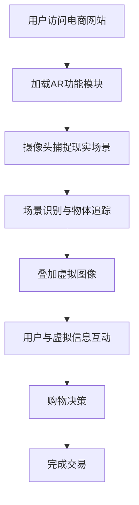

                 

关键词：增强现实、电商、AR技术、用户体验、案例分析、技术应用、未来展望

> 摘要：本文将探讨增强现实（AR）技术在电商领域的应用，通过案例分析，深入解析AR技术如何改变传统电商模式，提升用户体验，并展望未来AR技术在电商行业的应用前景。

## 1. 背景介绍

随着互联网技术的飞速发展和智能手机的普及，电子商务已经成为了人们生活中不可或缺的一部分。消费者对购物体验的要求越来越高，除了价格和商品质量之外，购物过程中的互动性、沉浸感和实时性成为了提升用户体验的重要方面。增强现实（Augmented Reality，AR）技术的出现为电商行业带来了全新的变革机遇。

AR技术通过将虚拟信息叠加到现实环境中，使用户能够在真实世界中与数字信息进行互动。这种技术与电商的结合，不仅能够提供更加丰富和互动的购物体验，还能够帮助商家更有效地推广产品，提高销售转化率。

## 2. 核心概念与联系

### 2.1 增强现实技术原理

增强现实技术通过以下几种方式实现：

- **显示技术**：通常使用摄像头捕捉现实场景，并在显示设备上叠加虚拟图像。
- **定位与追踪**：利用计算机视觉算法进行场景识别和物体追踪，确保虚拟图像与真实环境对齐。
- **交互技术**：通过触摸、手势和语音等交互方式，使用户与虚拟信息进行互动。

### 2.2 电商与AR技术的融合

电商与AR技术的融合主要体现在以下几个方面：

- **产品展示**：通过AR技术，消费者可以在家中真实环境中预览产品，如家具、化妆品等。
- **购物体验**：AR技术可以模拟试穿、试妆等互动体验，增强购物的沉浸感和互动性。
- **营销推广**：商家可以通过AR技术创造出独特的营销活动，吸引用户参与，提高品牌知名度。

### 2.3 Mermaid 流程图

以下是一个简单的AR技术在电商应用中的Mermaid流程图：



## 3. 核心算法原理 & 具体操作步骤

### 3.1 算法原理概述

AR技术在电商应用中的核心算法主要包括计算机视觉、图像处理和图形渲染。

- **计算机视觉**：用于识别和追踪现实场景中的物体和特征。
- **图像处理**：对捕捉到的图像进行处理，如去噪、增强等。
- **图形渲染**：将虚拟图像叠加到处理后的图像上，并实时更新。

### 3.2 算法步骤详解

1. **初始化**：加载AR功能模块，准备摄像头和渲染器。
2. **捕捉图像**：摄像头实时捕捉用户所在环境。
3. **图像预处理**：对捕捉到的图像进行去噪、增强等处理。
4. **物体识别与追踪**：利用计算机视觉算法识别场景中的物体并追踪其位置。
5. **虚拟图像渲染**：根据追踪结果，将虚拟图像叠加到预处理后的图像上。
6. **交互处理**：处理用户输入，如触摸、手势等，调整虚拟图像或进行其他交互操作。
7. **更新显示**：将叠加后的图像显示在屏幕上，并实时更新以保持实时性。

### 3.3 算法优缺点

#### 优点：

- **增强用户体验**：提供更加丰富和互动的购物体验。
- **提升销售转化率**：通过真实的预览和试穿试妆等，增加消费者购买的信心。
- **独特的营销手段**：创造新颖的营销活动，提高品牌知名度。

#### 缺点：

- **技术实现复杂**：需要复杂的计算机视觉和图像处理算法。
- **设备依赖性高**：需要具备AR功能的设备支持。
- **计算资源消耗大**：实时处理图像和渲染虚拟图像需要较高的计算资源。

### 3.4 算法应用领域

AR技术在电商领域的应用范围广泛，主要包括：

- **产品展示**：如家具、服装、化妆品等。
- **虚拟试衣试妆**：提供真实的试衣试妆体验。
- **营销推广**：通过AR技术创造出独特的营销活动。
- **在线教育**：提供互动式的在线教育体验。

## 4. 数学模型和公式 & 详细讲解 & 举例说明

### 4.1 数学模型构建

在AR技术的图像处理和渲染过程中，常用的数学模型包括：

- **图像去噪模型**：
  $$I_{noisy} = I_{original} + \epsilon$$
  其中，\(I_{original}\) 是原始图像，\(I_{noisy}\) 是去噪后的图像，\(\epsilon\) 是噪声。

- **图像增强模型**：
  $$I_{enhanced} = \alpha \cdot I_{noisy} + \beta$$
  其中，\(I_{noisy}\) 是噪声图像，\(I_{enhanced}\) 是增强后的图像，\(\alpha\) 和 \(\beta\) 是调节参数。

- **图像渲染模型**：
  $$I_{rendered} = I_{base} + \alpha \cdot I_{virtual}$$
  其中，\(I_{base}\) 是背景图像，\(I_{virtual}\) 是虚拟图像，\(\alpha\) 是混合参数。

### 4.2 公式推导过程

以图像增强模型为例，其推导过程如下：

1. **噪声模型**：
   $$I_{noisy} = I_{original} + \epsilon$$
   其中，\(\epsilon\) 是均值为0的高斯噪声。

2. **增强模型**：
   $$I_{enhanced} = \alpha \cdot I_{noisy} + \beta$$
   为了增强图像，我们需要选择合适的参数 \(\alpha\) 和 \(\beta\)。

3. **参数选择**：
   通过实验或优化算法，找到最优的 \(\alpha\) 和 \(\beta\) 值，以获得最佳的增强效果。

### 4.3 案例分析与讲解

以一款AR试妆应用为例，其流程如下：

1. **用户启动应用**：用户通过智能手机或平板电脑启动AR试妆应用。

2. **相机捕捉图像**：应用使用相机捕捉用户脸部图像。

3. **图像预处理**：对捕捉到的图像进行去噪和增强处理。

4. **识别面部特征**：应用使用计算机视觉算法识别用户的面部特征，如眼睛、嘴巴等。

5. **试妆效果叠加**：根据用户选择的妆容，应用将虚拟妆容叠加到真实图像上。

6. **用户互动**：用户可以通过触摸屏幕调整妆容的细节。

7. **实时反馈**：应用实时渲染并更新图像，用户可以看到即时效果。

通过这个案例，我们可以看到AR技术在电商中的应用如何为用户提供更加丰富和互动的体验。

## 5. 项目实践：代码实例和详细解释说明

### 5.1 开发环境搭建

为了实现一个简单的AR试妆应用，我们需要搭建以下开发环境：

- **开发工具**：Unity 2021.3.8f1
- **AR SDK**：Vuforia 8.5.0
- **编程语言**：C#

### 5.2 源代码详细实现

以下是一个简单的AR试妆应用的C#代码示例：

```csharp
using UnityEngine;
using Vuforia;

public class AR 试妆 : MonoBehaviour
{
    public Camera arCamera;
    public Material makeupMaterial;

    private FaceRenderer faceRenderer;

    void Start()
    {
        // 初始化Vuforia SDK
        VuforiaARController.Instance.InitARController();
        // 创建FaceRenderer对象
        faceRenderer = new FaceRenderer();
    }

    void Update()
    {
        // 捕获相机图像
        Texture2D cameraTexture = arCamera.captureTexture;
        // 对图像进行处理
        faceRenderer.ProcessFace(cameraTexture, makeupMaterial);
        // 更新屏幕显示
        Screen.showScreenAfterCursor = true;
    }
}
```

### 5.3 代码解读与分析

这个简单的AR试妆应用主要分为以下几个步骤：

1. **初始化Vuforia SDK**：在`Start`方法中，初始化Vuforia SDK，并创建`FaceRenderer`对象。

2. **捕获相机图像**：在`Update`方法中，使用`arCamera.captureTexture`捕获相机图像。

3. **图像处理**：调用`FaceRenderer`对象的`ProcessFace`方法，对图像进行处理，包括识别面部特征和叠加妆容。

4. **更新屏幕显示**：将处理后的图像显示在屏幕上。

### 5.4 运行结果展示

运行这个AR试妆应用后，用户可以在屏幕上看到自己的面部图像，并可以尝试不同的妆容。通过触摸屏幕，用户可以调整妆容的细节，如颜色和纹理等。

## 6. 实际应用场景

### 6.1 产品展示

通过AR技术，用户可以在家中真实环境中预览产品。例如，家具电商平台可以使用AR技术让用户在家中虚拟摆放家具，查看整体效果，从而做出更加明智的购买决策。

### 6.2 虚拟试衣试妆

虚拟试衣试妆是AR技术在电商中广泛应用的一个领域。消费者可以通过手机或平板电脑，在真实环境中试穿衣服或妆容，减少不必要的退货和换货，提升购物体验。

### 6.3 营销推广

商家可以利用AR技术创造独特的营销活动，吸引消费者参与。例如，通过AR技术举办互动游戏，让用户参与其中，增加品牌的曝光度和用户黏性。

### 6.4 未来应用展望

随着AR技术的不断发展和成熟，未来AR技术在电商领域将有更广泛的应用，如全场景购物体验、智能客服、智能物流等。同时，AR技术也将与人工智能、大数据等前沿技术相结合，为电商行业带来更多的创新和变革。

## 7. 工具和资源推荐

### 7.1 学习资源推荐

- **《增强现实技术与应用》**：详细介绍了增强现实技术的原理和应用。
- **《Unity ARKit/ARCore开发实战》**：针对iOS和Android平台的AR开发提供了实战案例。

### 7.2 开发工具推荐

- **Unity**：适用于游戏开发和AR应用的跨平台开发工具。
- **Vuforia**：一款强大的AR SDK，支持多种平台和应用场景。

### 7.3 相关论文推荐

- **"Augmented Reality in Retail: A Literature Review"**：对AR在零售领域的应用进行了全面的回顾。
- **"Vuforia: A Robust Augmented Reality SDK for Mobile Devices"**：介绍了Vuforia SDK的架构和应用。

## 8. 总结：未来发展趋势与挑战

### 8.1 研究成果总结

本文通过对增强现实技术在电商领域的应用进行深入分析，总结了AR技术在电商中的核心算法原理、应用场景和未来发展趋势。研究表明，AR技术为电商行业带来了丰富的互动体验和创新的营销手段，有助于提升用户体验和销售转化率。

### 8.2 未来发展趋势

未来，随着AR技术的不断成熟和硬件设备的普及，AR技术在电商领域的应用将更加广泛和深入。预计将出现更多智能化的AR应用，如全场景购物体验、智能客服和智能物流等。

### 8.3 面临的挑战

尽管AR技术在电商领域有着巨大的潜力，但也面临着一些挑战，如技术实现复杂、设备依赖性高和计算资源消耗大等。此外，隐私保护和用户体验优化也是未来需要关注的重要问题。

### 8.4 研究展望

未来研究应重点关注如何降低AR技术的实现复杂度，提高用户体验，并探索AR技术与人工智能、大数据等前沿技术的深度融合，以推动电商行业的持续创新和发展。

## 9. 附录：常见问题与解答

### 9.1 AR技术在电商中如何提升用户体验？

AR技术通过提供真实的产品预览、虚拟试穿试妆等互动体验，让用户在购买前就能感受到产品的效果，从而提高购物满意度和信任度。

### 9.2 AR技术的实现复杂度高吗？

是的，AR技术的实现需要复杂的计算机视觉和图像处理算法，以及高效的渲染技术。但随着技术的不断进步，实现难度逐渐降低。

### 9.3 AR技术对硬件设备有特定要求吗？

是的，AR技术通常需要具备AR功能的设备，如智能手机、平板电脑或头戴式显示器等。这些设备需要具备高性能的摄像头、处理器和显示屏幕等硬件。

### 9.4 AR技术在电商中的应用前景如何？

随着AR技术的不断成熟和应用的普及，AR技术在电商领域的应用前景非常广阔。未来，AR技术将带来更加丰富和互动的购物体验，为电商行业带来持续的创新和发展。

---

作者：禅与计算机程序设计艺术 / Zen and the Art of Computer Programming

通过本文，我们深入探讨了增强现实技术在电商领域的应用，分析了其核心原理、算法模型和实际应用案例，并对未来AR技术在电商行业的发展趋势和挑战进行了展望。希望本文能为相关领域的读者提供有价值的参考和启示。

