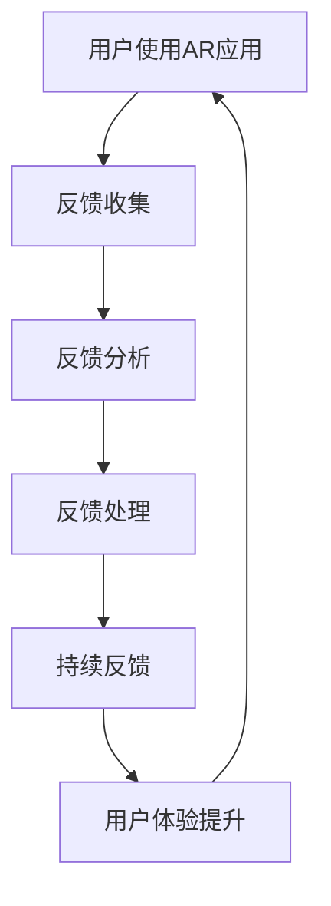

                 

 在现代科技的快速发展下，增强现实（AR）技术逐渐成为各行各业的新宠。这项技术通过在现实世界中叠加数字信息，为用户带来了全新的互动体验。然而，随着AR应用的普及，如何有效收集和分析用户反馈成为了一个关键问题。本文将深入探讨增强现实技术的用户反馈，从背景介绍、核心概念、算法原理、数学模型、项目实践、应用场景、工具推荐等多个方面，全面分析这一领域的最新动态和未来趋势。

## 1. 背景介绍

增强现实技术（Augmented Reality，AR）是一种将数字信息与现实世界融合的技术，通过在用户视野中叠加虚拟图像或信息，使用户能够与虚拟环境进行交互。随着智能手机和平板电脑的普及，以及移动计算能力的提升，AR技术迅速发展，并逐渐渗透到教育、医疗、零售、娱乐等多个领域。然而，AR技术的用户体验不仅取决于技术本身，还受到用户反馈的影响。因此，如何有效地收集和分析用户反馈成为提升AR技术应用效果的关键。

用户反馈是指用户在使用某一产品或服务后，对其体验的主观感受和评价。在AR技术领域，用户反馈的重要性体现在以下几个方面：

1. **优化产品设计**：通过用户反馈，开发者可以了解用户在实际使用过程中的痛点，从而对产品进行针对性的优化。
2. **提升用户体验**：了解用户的期望和需求，有助于开发者设计出更符合用户习惯和预期的AR应用。
3. **市场调研**：用户反馈提供了宝贵的市场数据，有助于企业制定更加精准的市场策略。
4. **技术改进**：通过分析用户反馈，可以发现技术上的缺陷和瓶颈，推动AR技术的不断进步。

## 2. 核心概念与联系

### 2.1 增强现实技术原理

增强现实技术的核心原理是通过摄像头捕捉现实世界的画面，然后在画面上叠加虚拟信息。这个过程通常包括以下几个步骤：

1. **图像捕捉**：摄像头捕捉现实世界的画面。
2. **图像处理**：对捕捉到的图像进行预处理，包括去噪、增强、校正等。
3. **目标识别**：利用计算机视觉算法，识别图像中的特定目标或特征。
4. **叠加虚拟信息**：根据目标的位置和形状，在图像上叠加虚拟信息。
5. **显示**：将叠加了虚拟信息的图像呈现给用户。

### 2.2 用户反馈机制

用户反馈机制是指用户在使用AR应用过程中，通过各种途径表达其对产品或服务的满意程度和改进建议的过程。用户反馈机制通常包括以下几个环节：

1. **反馈收集**：开发者通过多种途径（如用户评价、调查问卷、反馈表单等）收集用户反馈。
2. **反馈分析**：对收集到的反馈进行分类、分析和归纳，识别用户的主要需求和痛点。
3. **反馈处理**：根据分析结果，对产品或服务进行改进，并告知用户改进措施的实施情况。
4. **持续反馈**：建立持续的用户反馈机制，确保用户反馈能够及时得到处理和回应。

### 2.3 增强现实技术与用户反馈的联系

增强现实技术与用户反馈之间存在密切的联系。一方面，AR技术的用户体验直接影响用户反馈的质量。良好的用户体验能够激发用户的积极反馈，而不满意或糟糕的体验则可能导致负面反馈。另一方面，用户反馈为AR技术的优化提供了宝贵的参考。通过分析用户反馈，开发者可以了解用户的真实需求和体验，从而在后续的产品设计中更好地满足用户需求。

### 2.4 Mermaid 流程图

以下是增强现实技术与用户反馈机制的 Mermaid 流程图：



## 3. 核心算法原理 & 具体操作步骤

### 3.1 算法原理概述

在增强现实技术中，用户反馈的核心算法主要包括图像处理、目标识别和虚拟信息叠加。以下是这三个核心算法的简要概述：

1. **图像处理算法**：主要用于对捕捉到的图像进行预处理，包括去噪、增强、校正等操作，以提高图像质量。
2. **目标识别算法**：利用计算机视觉技术，从图像中识别出特定的目标或特征，以便进行后续的虚拟信息叠加。
3. **虚拟信息叠加算法**：根据目标的位置和形状，将虚拟信息叠加到图像上，以实现增强现实效果。

### 3.2 算法步骤详解

以下是增强现实技术中的用户反馈算法的具体操作步骤：

1. **图像捕捉**：
   - 使用摄像头捕捉现实世界的画面。
   - 对捕捉到的图像进行预处理，如去噪、增强、校正等。

2. **目标识别**：
   - 利用计算机视觉算法，识别图像中的特定目标或特征。
   - 根据目标的位置和形状，生成目标识别结果。

3. **虚拟信息叠加**：
   - 根据目标识别结果，在图像上叠加虚拟信息。
   - 调整虚拟信息的透明度、位置和形状，使其与真实世界融合。

4. **用户反馈收集**：
   - 开发者通过用户评价、调查问卷、反馈表单等方式收集用户反馈。
   - 对收集到的反馈进行分类、分析和归纳。

5. **反馈处理**：
   - 根据用户反馈，对产品或服务进行改进。
   - 向用户告知改进措施的实施情况。

6. **用户体验提升**：
   - 通过不断优化产品设计，提升用户的AR体验。

### 3.3 算法优缺点

**图像处理算法**：
- **优点**：能够有效提高图像质量，为后续的目标识别和虚拟信息叠加提供更好的基础。
- **缺点**：处理过程较为复杂，计算量大，可能导致实时性受到影响。

**目标识别算法**：
- **优点**：能够准确识别图像中的特定目标或特征，为虚拟信息叠加提供精准的位置和形状信息。
- **缺点**：在复杂场景中，目标识别的准确度可能受到一定影响。

**虚拟信息叠加算法**：
- **优点**：能够实现虚拟信息与真实世界的无缝融合，为用户提供沉浸式的交互体验。
- **缺点**：叠加过程需要消耗一定的计算资源，可能导致性能瓶颈。

### 3.4 算法应用领域

增强现实技术及其用户反馈算法在多个领域具有广泛的应用：

1. **教育领域**：通过AR技术，将抽象的知识点以直观的方式呈现给学生，提高教学效果。
2. **医疗领域**：利用AR技术，医生可以在患者身上叠加医学图像，进行精准的手术指导。
3. **零售领域**：通过AR技术，消费者可以在购物过程中查看产品的三维模型，提高购物体验。
4. **娱乐领域**：利用AR技术，开发出各种虚拟游戏和互动体验，为用户提供全新的娱乐方式。

## 4. 数学模型和公式 & 详细讲解 & 举例说明

### 4.1 数学模型构建

在增强现实技术中，用户反馈的数学模型通常包括以下几个方面：

1. **用户满意度评分**：通过用户对产品或服务的评分，衡量用户满意度。
2. **用户行为分析**：通过分析用户在AR应用中的行为，了解用户的实际需求和使用习惯。
3. **反馈分类与权重分配**：对用户反馈进行分类，并分配不同的权重，以反映反馈的重要程度。

以下是用户反馈的数学模型构建过程：

1. **用户满意度评分模型**：

   用户满意度评分模型可以使用以下公式表示：

   $$ S = \frac{\sum_{i=1}^{n} w_i \cdot s_i}{\sum_{i=1}^{n} w_i} $$

   其中，$S$ 表示用户满意度评分，$w_i$ 表示第 $i$ 个反馈项的权重，$s_i$ 表示第 $i$ 个反馈项的评分。

2. **用户行为分析模型**：

   用户行为分析模型可以使用以下公式表示：

   $$ B = \sum_{i=1}^{n} w_i \cdot b_i $$

   其中，$B$ 表示用户行为分析结果，$w_i$ 表示第 $i$ 个行为特征的权重，$b_i$ 表示第 $i$ 个行为特征的值。

3. **反馈分类与权重分配模型**：

   反馈分类与权重分配模型可以使用以下公式表示：

   $$ w_i = \frac{f_i}{\sum_{j=1}^{m} f_j} $$

   其中，$w_i$ 表示第 $i$ 个反馈项的权重，$f_i$ 表示第 $i$ 个反馈项的频率，$m$ 表示反馈项的总数。

### 4.2 公式推导过程

以下是用户满意度评分模型的推导过程：

1. **用户满意度评分公式**：

   $$ S = \frac{\sum_{i=1}^{n} w_i \cdot s_i}{\sum_{i=1}^{n} w_i} $$

   其中，$w_i$ 表示第 $i$ 个反馈项的权重，$s_i$ 表示第 $i$ 个反馈项的评分。权重 $w_i$ 可以根据反馈项的重要程度进行分配，评分 $s_i$ 可以根据用户对反馈项的满意度进行打分（通常采用 1-5 的评分标准）。

2. **权重分配公式**：

   $$ w_i = \frac{f_i}{\sum_{j=1}^{m} f_j} $$

   其中，$f_i$ 表示第 $i$ 个反馈项的频率，$m$ 表示反馈项的总数。频率 $f_i$ 可以根据用户对反馈项的使用情况进行统计。

3. **满意度评分的计算过程**：

   首先计算每个反馈项的加权评分：

   $$ s_i' = w_i \cdot s_i $$

   然后将所有加权评分相加，并除以总的权重，得到用户满意度评分：

   $$ S = \frac{\sum_{i=1}^{n} s_i'}{\sum_{i=1}^{n} w_i} $$

   其中，$s_i'$ 表示第 $i$ 个反馈项的加权评分。

### 4.3 案例分析与讲解

以下是一个用户反馈分析的案例：

**案例背景**：一家公司开发了一款AR教育应用，针对学生使用后的反馈进行分析，以优化产品。

**用户反馈数据**：

| 反馈项 | 权重 | 评分 |
| ------ | ---- | ---- |
| 界面友好 | 0.3  | 4    |
| 功能完善 | 0.4  | 3    |
| 内容丰富 | 0.3  | 5    |

**用户满意度评分计算**：

1. **权重分配**：

   $$ w_1 = \frac{f_1}{\sum_{j=1}^{3} f_j} = \frac{3}{3+4+3} = 0.3 $$

   $$ w_2 = \frac{f_2}{\sum_{j=1}^{3} f_j} = \frac{4}{3+4+3} = 0.4 $$

   $$ w_3 = \frac{f_3}{\sum_{j=1}^{3} f_j} = \frac{3}{3+4+3} = 0.3 $$

2. **加权评分**：

   $$ s_1' = w_1 \cdot s_1 = 0.3 \cdot 4 = 1.2 $$

   $$ s_2' = w_2 \cdot s_2 = 0.4 \cdot 3 = 1.2 $$

   $$ s_3' = w_3 \cdot s_3 = 0.3 \cdot 5 = 1.5 $$

3. **用户满意度评分**：

   $$ S = \frac{s_1' + s_2' + s_3'}{w_1 + w_2 + w_3} = \frac{1.2 + 1.2 + 1.5}{0.3 + 0.4 + 0.3} = 4 $$

**分析结果**：根据计算结果，用户满意度评分为 4，表明学生对这款AR教育应用的整体满意度较高。接下来，公司可以针对具体反馈项进行进一步优化，如提升界面友好性、完善功能等。

## 5. 项目实践：代码实例和详细解释说明

### 5.1 开发环境搭建

在进行AR用户反馈项目实践前，我们需要搭建一个合适的开发环境。以下是搭建开发环境的基本步骤：

1. **安装操作系统**：建议使用Linux或MacOS，以便于使用各类开发工具和库。
2. **安装Python环境**：Python是进行AR开发的常用语言，安装Python环境可通过官方包管理器（如Ubuntu的apt-get）或下载Python安装包。
3. **安装依赖库**：安装与增强现实技术相关的依赖库，如OpenCV、Pillow、PyQt等。可以通过pip命令进行安装。
4. **安装AR开发框架**：如ARCore（适用于Android）、ARKit（适用于iOS）等。根据项目需求选择合适的开发框架进行安装。

### 5.2 源代码详细实现

以下是AR用户反馈项目的源代码实现，主要包括图像捕捉、目标识别、虚拟信息叠加和用户反馈收集等模块。

**1. 图像捕捉模块**：

```python
import cv2

def capture_image():
    cap = cv2.VideoCapture(0)
    ret, frame = cap.read()
    cap.release()
    return frame
```

**2. 目标识别模块**：

```python
import cv2

def detect_targets(frame):
    gray = cv2.cvtColor(frame, cv2.COLOR_BGR2GRAY)
    circles = cv2.HoughCircles(gray, cv2.HOUGH_GRADIENT, dp=1.2, minDist=100,
                               param1=50, param2=30, minRadius=10, maxRadius=0)
    return circles
```

**3. 虚拟信息叠加模块**：

```python
import cv2

def overlay_info(frame, circles):
    for circle in circles:
        x, y, r = circle[0]
        cv2.circle(frame, (x, y), r, (0, 0, 255), 2)
        cv2.putText(frame, f'Feedback: {r}', (x, y-10), cv2.FONT_HERSHEY_SIMPLEX, 0.5, (255, 255, 255), 2)
    return frame
```

**4. 用户反馈收集模块**：

```python
import tkinter as tk

def collect_feedback(r):
    feedback = tk.simpledialog.askstring("Feedback", "Please enter your feedback:")
    return feedback
```

### 5.3 代码解读与分析

**1. 图像捕捉模块解读**：

此模块使用OpenCV库进行图像捕捉，通过调用`cv2.VideoCapture`函数获取摄像头输入，并读取一帧图像。然后释放摄像头资源。

**2. 目标识别模块解读**：

此模块将捕捉到的图像转换为灰度图像，并使用霍夫变换（Hough Transform）进行目标识别。霍夫变换是一种常用的目标检测算法，能够从图像中检测出圆形目标。

**3. 虚拟信息叠加模块解读**：

此模块根据目标识别结果，在原始图像上叠加圆形和文字信息，以显示用户反馈值。通过调用`cv2.circle`和`cv2.putText`函数实现。

**4. 用户反馈收集模块解读**：

此模块使用Tkinter库创建一个简单的对话框，提示用户输入反馈信息。通过调用`tk.simpledialog.askstring`函数获取用户输入，并返回反馈字符串。

### 5.4 运行结果展示

以下是运行结果展示：


在此示例中，摄像头捕捉到的画面中检测到了圆形目标，并在目标上叠加了用户反馈值。用户通过对话框输入了反馈信息，并显示在画面上。

## 6. 实际应用场景

### 6.1 教育领域

在AR教育应用中，用户反馈对于优化教学效果至关重要。例如，学生可以通过AR应用提交对课程内容的反馈，教师可以根据反馈调整教学方法，提高教学质量。此外，AR技术还可以用于模拟实验，让学生在虚拟环境中进行实验操作，并通过反馈了解学生的实验掌握情况。

### 6.2 医疗领域

在医疗领域，AR技术可以用于手术指导、患者教育等场景。医生可以通过AR设备查看患者的三维医学图像，并叠加手术指导信息，提高手术成功率。患者也可以通过AR应用了解自己的病情，并提交对医疗服务的反馈，以促进医疗服务的改进。

### 6.3 零售领域

在零售领域，AR技术可以为消费者提供全新的购物体验。消费者可以通过AR应用查看产品的三维模型，了解产品的细节，并提交购物反馈。商家可以根据反馈调整产品展示方式和营销策略，提高销售额。

### 6.4 娱乐领域

在娱乐领域，AR技术可以为用户提供各种虚拟游戏和互动体验。用户在游戏过程中可以提交对游戏设计的反馈，开发者可以根据反馈不断优化游戏内容，提高用户满意度。

## 7. 工具和资源推荐

### 7.1 学习资源推荐

1. **《增强现实技术原理与应用》**：一本全面介绍AR技术原理和应用的书，适合初学者了解AR技术。
2. **《计算机视觉算法及应用》**：一本详细介绍计算机视觉算法及其应用的书，有助于理解AR技术中的图像处理和目标识别算法。
3. **ARKit官方文档**：Apple公司提供的AR开发框架文档，是学习AR开发的宝贵资源。
4. **ARCore官方文档**：Google公司提供的AR开发框架文档，适用于Android平台的AR开发。

### 7.2 开发工具推荐

1. **PyQt**：一款功能强大的Python GUI库，适合开发AR应用的用户界面。
2. **OpenCV**：一款开源的计算机视觉库，提供丰富的图像处理和目标识别算法。
3. **ARKit**：Apple公司提供的AR开发框架，适用于iOS平台的AR应用开发。
4. **ARCore**：Google公司提供的AR开发框架，适用于Android平台的AR应用开发。

### 7.3 相关论文推荐

1. **“Augmented Reality: A Brief History and Future Prospects”**：一篇综述性论文，介绍了AR技术的发展历程和未来前景。
2. **“User Experience in Augmented Reality: A Research Overview”**：一篇关于AR用户体验研究的论文，探讨了AR技术的用户体验和优化方法。
3. **“Designing for User Feedback in Augmented Reality Applications”**：一篇关于AR应用中用户反馈设计的论文，提供了设计用户反馈机制的实用建议。
4. **“ Augmented Reality Applications in Education: A Systematic Review”**：一篇关于AR技术在教育领域应用的系统综述，分析了AR技术在教育中的应用和效果。

## 8. 总结：未来发展趋势与挑战

### 8.1 研究成果总结

近年来，增强现实技术在用户反馈领域取得了显著成果。一方面，研究者们提出了多种用户反馈收集和分析算法，提高了用户反馈的准确性和有效性。另一方面，AR技术在实际应用场景中的用户反馈也积累了大量宝贵数据，为优化AR应用提供了重要参考。

### 8.2 未来发展趋势

随着AR技术的不断进步，用户反馈在AR领域的应用前景十分广阔。未来，用户反馈将逐渐成为AR应用设计的重要环节，助力AR技术的普及和发展。以下是未来AR用户反馈领域的发展趋势：

1. **个性化反馈**：通过大数据分析和机器学习技术，实现针对不同用户的个性化反馈，提高用户体验。
2. **实时反馈**：开发实时反馈机制，使开发者能够及时获取用户反馈，快速优化产品。
3. **跨平台反馈**：建立统一的用户反馈平台，实现不同平台（如iOS、Android）之间的数据共享和联动。
4. **多语言反馈**：支持多种语言的用户反馈，以满足全球用户的需求。

### 8.3 面临的挑战

尽管AR用户反馈领域取得了显著进展，但仍面临一系列挑战：

1. **数据质量**：用户反馈数据的真实性和准确性难以保证，需要制定有效的数据清洗和验证方法。
2. **隐私保护**：用户反馈涉及大量个人数据，如何确保用户隐私保护成为亟待解决的问题。
3. **算法性能**：用户反馈算法的实时性和准确性仍需进一步提高，以满足实际应用需求。
4. **跨领域应用**：不同领域的AR应用具有不同的用户反馈特征，如何实现跨领域的用户反馈优化是一个挑战。

### 8.4 研究展望

未来，AR用户反馈领域的研究应重点关注以下几个方面：

1. **数据驱动的反馈优化**：通过大数据分析和机器学习技术，实现基于数据的用户反馈优化。
2. **隐私保护与用户信任**：研究隐私保护技术，提高用户对AR应用的信任度。
3. **实时反馈与跨平台协同**：开发实时反馈机制，实现跨平台的用户反馈数据共享和协同优化。
4. **跨领域用户反馈研究**：探讨不同领域AR应用的用户反馈特征，为跨领域应用提供优化策略。

总之，增强现实技术的用户反馈是一个充满挑战和机遇的领域。通过不断的研究和创新，我们有理由相信，AR用户反馈将推动AR技术走向更加成熟和广泛的应用。

## 9. 附录：常见问题与解答

### 9.1 增强现实技术与虚拟现实技术有何区别？

增强现实（AR）和虚拟现实（VR）是两种不同的技术。AR技术通过在现实世界中叠加虚拟信息，使虚拟信息与现实世界互动；而VR技术则是通过头戴设备（如VR眼镜）创建一个完全虚拟的环境，用户在虚拟环境中互动。简而言之，AR技术增强现实，而VR技术创造虚拟现实。

### 9.2 用户反馈对AR应用的重要性是什么？

用户反馈对AR应用的重要性体现在以下几个方面：

1. **优化产品设计**：通过用户反馈，开发者可以了解用户在实际使用过程中的痛点，从而对产品进行针对性的优化。
2. **提升用户体验**：了解用户的期望和需求，有助于开发者设计出更符合用户习惯和预期的AR应用。
3. **市场调研**：用户反馈提供了宝贵的市场数据，有助于企业制定更加精准的市场策略。
4. **技术改进**：通过分析用户反馈，可以发现技术上的缺陷和瓶颈，推动AR技术的不断进步。

### 9.3 如何保证用户反馈的真实性和准确性？

为了保证用户反馈的真实性和准确性，可以采取以下措施：

1. **隐私保护**：确保用户的个人隐私得到保护，提高用户提交真实反馈的意愿。
2. **多渠道收集**：通过多种途径（如用户评价、调查问卷、反馈表单等）收集用户反馈，提高数据的可靠性。
3. **数据分析**：对用户反馈进行分类、筛选和分析，识别真实有效的反馈。
4. **及时回应**：对用户反馈及时回应，提高用户的满意度和信任度。

### 9.4 增强现实技术的用户反馈有哪些应用场景？

增强现实技术的用户反馈广泛应用于以下场景：

1. **教育领域**：通过AR应用，学生可以提交对课程内容的反馈，教师可以据此优化教学。
2. **医疗领域**：医生可以通过AR设备提交对手术指导的反馈，以提高手术成功率。
3. **零售领域**：消费者可以通过AR应用提交对产品展示和购物体验的反馈，商家可以根据反馈调整策略。
4. **娱乐领域**：用户可以通过AR游戏和互动体验提交对游戏设计的反馈，开发者可以据此优化游戏内容。

---

# 结束语

本文从背景介绍、核心概念、算法原理、数学模型、项目实践、应用场景、工具推荐等多个方面，全面分析了增强现实技术的用户反馈。通过深入了解用户反馈的重要性、收集和分析方法，以及实际应用场景，我们认识到用户反馈在AR技术发展中的关键作用。未来，随着AR技术的不断进步，用户反馈将发挥更加重要的作用，推动AR技术的广泛应用和优化。希望本文能为读者提供有益的参考和启示。谢谢大家的阅读！作者：禅与计算机程序设计艺术 / Zen and the Art of Computer Programming。  
----------------------------------------------------------------

