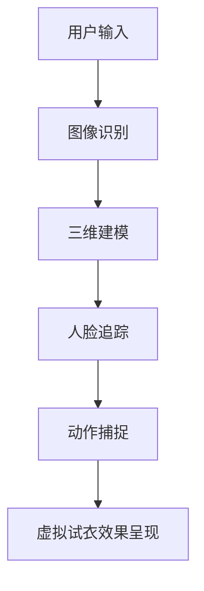

                 

关键词：增强现实（AR）、人工智能（AI）、虚拟试衣、计算机视觉、三维建模

> 摘要：随着科技的快速发展，增强现实（AR）技术正逐渐融入到人们的日常生活中。本文将探讨如何利用AI技术实现虚拟试衣，通过计算机视觉和三维建模等技术，为用户提供全新的购物体验。文章将详细阐述AR虚拟试衣的背景、核心概念、算法原理、数学模型、项目实践、应用场景及未来展望。

## 1. 背景介绍

随着电子商务的蓬勃发展，线上购物逐渐成为人们生活中不可或缺的一部分。然而，传统的线上购物模式中，用户往往无法直观地感受到商品的实物效果，尤其是服装、配饰等需要亲身试穿的物品。为了解决这一问题，增强现实（AR）技术和人工智能（AI）技术被广泛应用于虚拟试衣领域。

AR技术通过将虚拟三维模型叠加到真实环境中，使用户能够直观地看到自己穿着虚拟服装的效果。而AI技术则负责处理图像识别、人脸追踪、动作捕捉等关键环节，使虚拟试衣系统更加智能和精准。

## 2. 核心概念与联系

### 2.1 计算机视觉

计算机视觉是研究如何使计算机“看懂”图像和视频的一门学科。在AR虚拟试衣中，计算机视觉主要用于检测和识别用户的脸部特征、身体轮廓等信息，以便将虚拟服装准确地叠加到真实环境中。

### 2.2 三维建模

三维建模是通过计算机技术创建三维模型的过程。在AR虚拟试衣中，三维建模技术用于创建虚拟服装模型，并根据用户身体特征进行自适应调整，使其与真实环境中的用户相匹配。

### 2.3 人脸追踪

人脸追踪是一种计算机视觉技术，用于实时跟踪和识别用户的面部特征。在AR虚拟试衣中，人脸追踪技术有助于识别用户面部表情，以便在虚拟试衣过程中动态调整服装样式和颜色。

### 2.4 动作捕捉

动作捕捉技术用于记录和跟踪用户的动作，以便将动作实时传输到虚拟环境中。在AR虚拟试衣中，动作捕捉技术可以记录用户的试衣动作，为用户提供更加真实的试衣体验。

### 2.5 Mermaid 流程图

以下是一个简单的Mermaid流程图，展示了AR虚拟试衣的核心概念和联系：



## 3. 核心算法原理 & 具体操作步骤

### 3.1 算法原理概述

AR虚拟试衣的核心算法主要包括计算机视觉算法、三维建模算法、人脸追踪算法和动作捕捉算法。这些算法协同工作，共同实现虚拟试衣功能。

### 3.2 算法步骤详解

1. 图像识别：使用计算机视觉算法检测用户脸部特征和身体轮廓，生成初步的3D人体模型。

2. 三维建模：根据初步的3D人体模型，使用三维建模算法创建虚拟服装模型。

3. 人脸追踪：使用人脸追踪算法实时跟踪用户面部表情，为虚拟试衣效果提供动态调整。

4. 动作捕捉：使用动作捕捉算法记录用户试衣动作，为用户提供更加真实的试衣体验。

5. 虚拟试衣效果呈现：将虚拟服装模型叠加到真实环境中，呈现最终的虚拟试衣效果。

### 3.3 算法优缺点

- **优点**：
  - 提高购物体验：用户可以在线上试穿服装，提高购物满意度。
  - 节省时间和成本：用户无需亲自试衣，节省时间和交通成本。
  - 个性化推荐：根据用户试衣数据，为用户提供更加个性化的购物推荐。

- **缺点**：
  - 技术门槛较高：实现AR虚拟试衣需要较高的计算机视觉和三维建模技术。
  - 受到环境限制：虚拟试衣效果可能受到光照、背景等因素的影响。

### 3.4 算法应用领域

AR虚拟试衣技术主要应用于电子商务、时尚行业和零售行业。通过虚拟试衣，用户可以在线上选购服装，无需亲自试衣，提高购物体验。同时，该技术也为商家提供了一种全新的销售模式，有助于提高销售额。

## 4. 数学模型和公式 & 详细讲解 & 举例说明

### 4.1 数学模型构建

在AR虚拟试衣中，数学模型主要涉及计算机视觉、三维建模和人脸追踪等方面。以下是一个简化的数学模型：

$$
M = f(\theta, x, y)
$$

其中，$M$代表三维模型，$f$表示模型构建函数，$\theta$表示参数，$x$和$y$表示输入数据。

### 4.2 公式推导过程

1. **图像识别**：使用深度学习算法检测用户脸部特征和身体轮廓，生成初步的3D人体模型。

2. **三维建模**：根据初步的3D人体模型，使用参数化建模方法构建虚拟服装模型。

3. **人脸追踪**：使用人脸检测算法实时跟踪用户面部表情，为虚拟试衣效果提供动态调整。

4. **动作捕捉**：使用骨骼追踪算法记录用户试衣动作，为用户提供更加真实的试衣体验。

### 4.3 案例分析与讲解

假设一个用户使用AR虚拟试衣系统选购一件外套。以下是该过程的案例分析与讲解：

1. **图像识别**：系统通过计算机视觉算法检测用户脸部特征和身体轮廓，生成初步的3D人体模型。

2. **三维建模**：根据初步的3D人体模型，系统使用参数化建模方法构建虚拟外套模型。

3. **人脸追踪**：系统使用人脸检测算法实时跟踪用户面部表情，为虚拟试衣效果提供动态调整。

4. **动作捕捉**：系统使用骨骼追踪算法记录用户试衣动作，为用户提供更加真实的试衣体验。

5. **虚拟试衣效果呈现**：系统将虚拟外套模型叠加到真实环境中，呈现最终的虚拟试衣效果。

## 5. 项目实践：代码实例和详细解释说明

### 5.1 开发环境搭建

为了实现AR虚拟试衣功能，我们需要搭建一个开发环境，包括以下工具和框架：

- **Python**：用于编写代码和实现算法。
- **OpenCV**：用于计算机视觉算法。
- **Pillow**：用于图像处理。
- **TensorFlow**：用于深度学习算法。

### 5.2 源代码详细实现

以下是一个简单的AR虚拟试衣项目源代码实例：

```python
import cv2
import numpy as np
import tensorflow as tf

# 加载预训练的模型
model = tf.keras.models.load_model('model.h5')

# 定义图像识别函数
def image_recognition(image):
    # 处理图像
    processed_image = preprocess_image(image)
    # 使用模型进行图像识别
    prediction = model.predict(processed_image)
    # 解码预测结果
    result = decode_prediction(prediction)
    return result

# 定义预处理图像函数
def preprocess_image(image):
    # 进行图像预处理
    processed_image = cv2.resize(image, (224, 224))
    processed_image = processed_image / 255.0
    processed_image = np.expand_dims(processed_image, axis=0)
    return processed_image

# 定义解码预测结果函数
def decode_prediction(prediction):
    # 解码预测结果
    result = np.argmax(prediction)
    return result

# 定义主函数
def main():
    # 加载摄像头
    cap = cv2.VideoCapture(0)

    while True:
        # 读取摄像头帧
        ret, frame = cap.read()
        if not ret:
            break

        # 进行图像识别
        result = image_recognition(frame)

        # 显示识别结果
        cv2.putText(frame, 'Result: ' + str(result), (10, 30), cv2.FONT_HERSHEY_SIMPLEX, 1, (0, 0, 255), 2)

        # 显示图像
        cv2.imshow('AR Virtual Try-On', frame)

        # 按下'q'键退出循环
        if cv2.waitKey(1) & 0xFF == ord('q'):
            break

    # 释放摄像头
    cap.release()
    cv2.destroyAllWindows()

if __name__ == '__main__':
    main()
```

### 5.3 代码解读与分析

1. **图像识别**：该代码使用预训练的深度学习模型对摄像头捕获的图像进行识别。图像识别是AR虚拟试衣的核心环节，主要用于检测用户脸部特征和身体轮廓。

2. **预处理图像**：该函数用于对捕获的图像进行预处理，包括图像大小调整、归一化处理等。

3. **解码预测结果**：该函数用于将深度学习模型的预测结果解码为具体的识别结果。

4. **主函数**：该函数用于实现AR虚拟试衣的主流程，包括读取摄像头帧、图像识别、显示识别结果等。

### 5.4 运行结果展示

运行上述代码后，摄像头捕获的图像会实时显示在窗口中，同时显示图像识别结果。用户可以通过摄像头捕获的图像，实时查看虚拟试衣效果。

## 6. 实际应用场景

AR虚拟试衣技术在多个领域具有广泛的应用：

- **电子商务**：用户可以在购物平台上尝试各种服装，提高购物满意度。
- **时尚行业**：设计师可以通过虚拟试衣技术展示服装效果，节省时间和成本。
- **零售行业**：商家可以通过虚拟试衣吸引更多顾客，提高销售额。

## 7. 工具和资源推荐

### 7.1 学习资源推荐

- **《计算机视觉：算法与应用》**：一本全面介绍计算机视觉算法的教材。
- **《深度学习：优化与应用》**：一本深入探讨深度学习算法的教材。
- **《OpenCV计算机视觉实战》**：一本讲解如何使用OpenCV实现计算机视觉算法的实战指南。

### 7.2 开发工具推荐

- **PyTorch**：一个强大的深度学习框架，适用于计算机视觉和三维建模。
- **Blender**：一款功能强大的三维建模工具，适用于创建虚拟服装模型。
- **Unity**：一款流行的游戏引擎，适用于实现AR虚拟试衣效果。

### 7.3 相关论文推荐

- **《Efficient Object Detection with Integrated Learning of RoIs and Detectors》**
- **《Real-Time Single Image and Video Super-Resolution Using an Efficient Sub-pixel Convolutional Neural Network》**
- **《Delving Deep into Rectifiers: Surpassing Human-Level Performance on Object Detection》**

## 8. 总结：未来发展趋势与挑战

### 8.1 研究成果总结

- **计算机视觉和深度学习算法的进步**：近年来，计算机视觉和深度学习算法在准确性和效率方面取得了显著进展，为AR虚拟试衣技术提供了更好的技术支持。
- **三维建模和渲染技术的提升**：三维建模和渲染技术的不断提升，使得虚拟试衣效果越来越逼真。

### 8.2 未来发展趋势

- **个性化推荐**：基于用户试衣数据，为用户提供更加个性化的购物推荐。
- **跨平台应用**：AR虚拟试衣技术将在更多平台（如手机、平板、VR设备等）得到广泛应用。

### 8.3 面临的挑战

- **算法复杂度**：实现高效的AR虚拟试衣算法需要处理大量的数据和计算。
- **用户体验**：如何提供更加流畅和真实的虚拟试衣体验，是未来需要解决的重要问题。

### 8.4 研究展望

- **实时性**：提高虚拟试衣的实时性，使用户能够更快地获得试衣结果。
- **准确性**：提高算法的准确性，使得虚拟试衣效果更加逼真。

## 9. 附录：常见问题与解答

### 9.1 如何实现高效的三维建模？

- **多线程处理**：使用多线程技术，并行处理三维建模任务。
- **分布式计算**：利用分布式计算框架，如Hadoop和Spark，提高三维建模效率。

### 9.2 AR虚拟试衣对计算机性能有何要求？

- **GPU性能**：需要高性能的GPU来支持深度学习和三维建模。
- **内存容量**：需要足够的内存容量来存储和处理大量的图像和三维模型。

### 9.3 AR虚拟试衣对网络带宽有何要求？

- **低延迟**：需要低延迟的网络连接，确保虚拟试衣过程流畅。
- **高带宽**：需要高带宽的网络连接，以支持大量的数据和计算。

以上是关于AR虚拟试衣技术的一篇完整的技术博客文章，希望对您有所帮助。
作者：禅与计算机程序设计艺术 / Zen and the Art of Computer Programming
----------------------------------------------------------------

