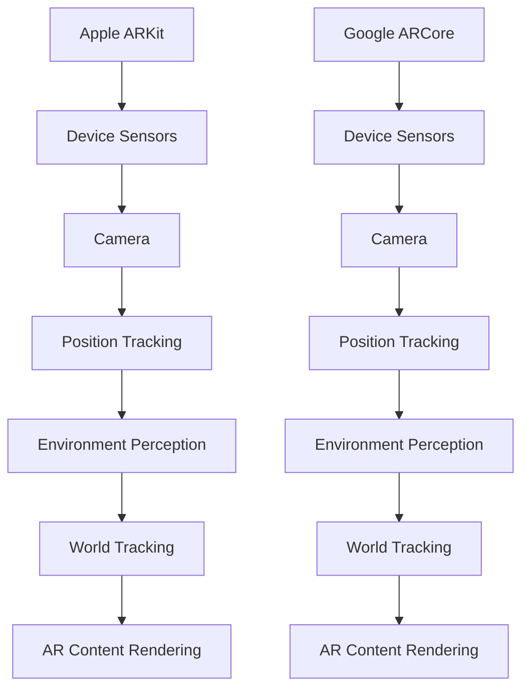

                 

关键词：增强现实（AR），Apple ARKit，Google ARCore，增强现实应用，开发工具，编程技术

> 摘要：本文将深入探讨增强现实（AR）技术的两个重要平台——Apple ARKit和Google ARCore。我们将分析这两个工具的特点、优点和局限性，并提供实际操作指南，帮助开发者更好地理解和应用这些技术。

## 1. 背景介绍

随着移动设备的普及和计算能力的提升，增强现实（AR）技术逐渐成为了一种热门的交互方式。AR技术通过在现实世界中叠加数字信息，为用户提供了更加丰富和互动的体验。Apple ARKit和Google ARCore是两个为开发者提供AR开发工具的平台，它们各自具有独特的功能和优势。

### 1.1 Apple ARKit

Apple ARKit是由苹果公司推出的AR开发框架，它为iOS和macOS开发者提供了创建AR应用的工具。ARKit利用了苹果设备中的多种传感器和相机技术，如加速度计、陀螺仪和深度摄像头，以实现精确的实时位置追踪和环境感知。

### 1.2 Google ARCore

Google ARCore是谷歌开发的AR开发平台，适用于Android设备。ARCore通过使用运动传感器和摄像头数据，实现了高精度的运动追踪和环境感知。此外，ARCore还提供了丰富的API，使开发者能够轻松地创建复杂的AR场景。

## 2. 核心概念与联系

为了更好地理解Apple ARKit和Google ARCore，我们需要了解它们的核心概念和架构。

### 2.1 核心概念

- **增强现实（AR）**：AR是一种将虚拟信息叠加到现实世界中的技术。它通过摄像头捕捉现实场景，并使用算法将虚拟元素与之结合。
- **位置追踪**：位置追踪是AR应用中至关重要的一部分，它确保虚拟元素能够准确地与现实世界中的物体对齐。
- **环境感知**：环境感知技术使AR应用能够理解现实世界的形状、光线和颜色等特性，从而提供更加逼真的体验。

### 2.2 架构图解

下面是Apple ARKit和Google ARCore的架构图解，通过Mermaid流程图展示：



## 3. 核心算法原理 & 具体操作步骤

### 3.1 算法原理概述

Apple ARKit和Google ARCore的核心算法主要包括位置追踪、环境感知和内容渲染。

- **位置追踪**：通过传感器数据计算设备的位置和方向，确保虚拟元素与现实世界中的物体对齐。
- **环境感知**：分析现实世界的光照、颜色和纹理信息，为虚拟内容提供合适的背景和环境。
- **内容渲染**：使用图形渲染技术将虚拟元素渲染到现实场景中，提供高质量的视觉效果。

### 3.2 算法步骤详解

以下是Apple ARKit和Google ARCore的核心算法步骤：

#### 3.2.1 Apple ARKit

1. **初始化传感器数据**：获取设备加速度计、陀螺仪和深度摄像头的数据。
2. **位置追踪**：使用传感器数据计算设备的位置和方向。
3. **环境感知**：分析摄像头捕捉到的图像，识别环境特征。
4. **内容渲染**：将虚拟元素渲染到现实场景中，并调整其位置和方向以匹配现实世界。

#### 3.2.2 Google ARCore

1. **初始化传感器数据**：获取设备加速度计、陀螺仪和摄像头的数据。
2. **位置追踪**：使用传感器数据计算设备的位置和方向。
3. **环境感知**：分析摄像头捕捉到的图像，识别环境特征。
4. **内容渲染**：将虚拟元素渲染到现实场景中，并调整其位置和方向以匹配现实世界。

### 3.3 算法优缺点

#### 3.3.1 Apple ARKit

- **优点**：对iOS设备支持较好，提供丰富的API和工具，易于上手。
- **缺点**：在Android设备上的兼容性较差，无法充分利用所有Android设备的功能。

#### 3.3.2 Google ARCore

- **优点**：对Android设备支持较好，提供丰富的API和工具，兼容性较强。
- **缺点**：相比Apple ARKit，在iOS设备上的支持较弱。

### 3.4 算法应用领域

Apple ARKit和Google ARCore的应用领域主要包括：

- **游戏开发**：为开发者提供了创建沉浸式游戏场景的工具。
- **教育应用**：通过虚拟元素增强教学内容，提供互动式的学习体验。
- **零售业**：通过AR技术展示商品，提高消费者的购物体验。

## 4. 数学模型和公式 & 详细讲解 & 举例说明

### 4.1 数学模型构建

Apple ARKit和Google ARCore的核心算法涉及多种数学模型，包括线性代数、几何学和概率论等。

#### 4.1.1 线性代数

- **矩阵运算**：用于表示设备的位置和方向。
- **向量运算**：用于表示设备在空间中的运动。

#### 4.1.2 几何学

- **点、线、面**：用于表示现实世界中的物体。
- **变换**：用于调整虚拟元素的位置和方向。

#### 4.1.3 概率论

- **贝叶斯理论**：用于处理不确定性问题，如环境感知中的物体识别。

### 4.2 公式推导过程

以下是Apple ARKit和Google ARCore的核心算法中的几个关键公式：

#### 4.2.1 位置追踪

- **位置计算**：$$\text{position} = \text{initial\_position} + \text{velocity} \times \text{time}$$
- **方向计算**：$$\text{direction} = \text{initial\_direction} + \text{angular\_velocity} \times \text{time}$$

#### 4.2.2 环境感知

- **特征匹配**：$$\text{confidence} = \frac{\text{匹配特征数}}{\text{总特征数}}$$
- **光照计算**：$$\text{lighting} = \text{light\_intensity} \times \text{normal}$$

#### 4.2.3 内容渲染

- **纹理映射**：$$\text{color} = \text{texture} \times \text{uv}$$
- **阴影计算**：$$\text{shadow} = \text{lighting} \times (\text{height} - \text{ground})$$

### 4.3 案例分析与讲解

为了更好地理解这些数学模型和公式，我们可以通过一个简单的案例进行分析。

#### 案例一：AR图书

假设我们开发了一个AR图书应用，用户可以通过手机或平板电脑阅读增强现实版的书。以下是该应用的核心算法步骤：

1. **初始化传感器数据**：获取设备的加速度计、陀螺仪和摄像头数据。
2. **位置追踪**：计算设备的位置和方向，确保书页与现实世界中的物体对齐。
3. **环境感知**：分析摄像头捕捉到的图像，识别书页的位置和方向。
4. **内容渲染**：将书页的内容渲染到现实场景中，提供高质量的视觉效果。

通过这个案例，我们可以看到Apple ARKit和Google ARCore的核心算法是如何应用于实际场景的。

## 5. 项目实践：代码实例和详细解释说明

### 5.1 开发环境搭建

在开始开发之前，我们需要搭建开发环境。以下是搭建Apple ARKit和Google ARCore开发环境的基本步骤：

#### 5.1.1 Apple ARKit

1. **安装Xcode**：从App Store下载并安装Xcode。
2. **创建新项目**：打开Xcode，创建一个新的iOS或macOS项目。
3. **配置ARKit**：在项目中添加ARKit框架。

#### 5.1.2 Google ARCore

1. **安装Android Studio**：从Google官方网站下载并安装Android Studio。
2. **创建新项目**：打开Android Studio，创建一个新的Android项目。
3. **配置ARCore**：在项目中添加ARCore依赖库。

### 5.2 源代码详细实现

以下是Apple ARKit和Google ARCore的简单代码实例：

#### 5.2.1 Apple ARKit

```swift
import ARKit

class ViewController: UIViewController, ARSCNViewDelegate {

    override func viewDidLoad() {
        super.viewDidLoad()
        
        // 创建ARSCNView
        let arView = ARSCNView(frame: view.bounds)
        view.addSubview(arView)
        
        // 设置ARSCNView的代理
        arView.delegate = self
        
        // 配置AR场景
        let configuration = ARWorldTrackingConfiguration()
        arView.session.run(configuration)
    }
    
    func renderer(_ renderer: SCNSceneRenderer, didAdd node: SCNNode, for anchor: ARAnchor) {
        // 创建一个虚拟立方体
        let boxGeometry = SCNBox(width: 0.1, height: 0.1, length: 0.1)
        let boxMaterial = SCNMaterial()
        boxMaterial.diffuse.contents = UIColor.blue
        
        // 创建一个立方体节点
        let boxNode = SCNNode(geometry: boxGeometry, material: boxMaterial)
        boxNode.position = SCNVector3(0, 0.05, -0.5)
        
        // 添加立方体节点到场景中
        node.addChildNode(boxNode)
    }
}
```

#### 5.2.2 Google ARCore

```java
import com.google.ar.core.Anchor;
import com.google.ar.core.Plane;
import com.google.ar.core.Session;
import com.google.ar.core TrackingState;
import com.google.ar.core.exceptions.CameraNotAvailableException;

import java.util.ArrayList;

public class MainActivity extends Activity implements ARFragment.ArFragmentListener, ARFragment.SessionPermissionListener {

    private ARFragment arFragment;

    @Override
    protected void onCreate(Bundle savedInstanceState) {
        super.onCreate(savedInstanceState);
        setContentView(R.layout.activity_main);

        arFragment = (ARFragment) getSupportFragmentManager().findFragmentById(R.id.ar_fragment);
        arFragment.setListener(this);
        arFragment.setOnSessionPermissionListener(this);
    }

    @Override
    public void onSessionCreated(Session session) {
        try {
            session.setCameraPermissionState(PermissionState.ALLOWED);
        } catch (CameraNotAvailableException e) {
            e.printStackTrace();
        }
    }

    @Override
    public void onSessionStarted(Session session, Plane plane, TrackingState trackingState) {
        // 创建一个虚拟立方体
        Cube cube = new Cube(0.1f, 0.1f, 0.1f);
        cube.setMaterial(new Material(Color.BLUE));

        // 创建一个虚拟场景
        Anchor anchor = session.createAnchor(plane.getCenterPose());
        session.attach(cube, anchor);
    }

    @Override
    public void onSessionError(Session session, ARSession.ErrorCode errorCode) {
        // 处理会话错误
    }

    @Override
    public void onSessionEnded(Session session, Plane plane, TrackingState trackingState) {
        // 结束会话
    }

    @Override
    public void onSessionPermissionsChange(Session session, int i) {
        // 处理权限变更
    }
}
```

### 5.3 代码解读与分析

#### 5.3.1 Apple ARKit

以上代码展示了如何在iOS项目中使用ARKit创建一个简单的AR应用。我们首先创建了一个ARSCNView，并将其添加到视图中。然后，我们配置了ARWorldTrackingConfiguration，并启动了AR会话。在renderer方法中，我们为每个AR锚点创建了一个虚拟立方体节点，并将其添加到场景中。

#### 5.3.2 Google ARCore

以上代码展示了如何在Android项目中使用ARCore创建一个简单的AR应用。我们首先创建了一个ARFragment，并设置了其监听器。在onSessionCreated方法中，我们设置了摄像头的权限。在onSessionStarted方法中，我们创建了一个虚拟立方体，并将其附着到一个锚点上。

### 5.4 运行结果展示

运行以上代码后，我们可以在设备上看到一个虚拟立方体出现在现实场景中。我们可以通过移动设备来调整立方体的位置和方向，从而实现与虚拟元素的互动。

## 6. 实际应用场景

Apple ARKit和Google ARCore在多个领域有着广泛的应用，以下是一些典型的实际应用场景：

### 6.1 教育应用

AR技术可以为学生提供更加生动和互动的学习体验。例如，在生物学课程中，学生可以通过AR技术观察和解剖虚拟的动物器官；在历史课程中，学生可以通过AR技术参观历史遗址和文物。

### 6.2 零售业

AR技术可以增强消费者的购物体验。例如，消费者可以通过AR技术试穿衣服或试用化妆品；商家可以通过AR技术展示产品的三维模型，提高产品的可视化效果。

### 6.3 娱乐和游戏

AR技术可以带来全新的娱乐和游戏体验。例如，玩家可以通过AR技术参与现实世界的探险游戏；游戏公司可以通过AR技术为游戏场景添加更多的细节和互动元素。

## 7. 未来应用展望

随着技术的不断进步，Apple ARKit和Google ARCore在未来将会有更多的应用场景和潜力。

### 7.1 更高的精度和实时性

随着计算能力和传感器技术的提升，Apple ARKit和Google ARCore将能够提供更高的精度和更实时的AR体验。

### 7.2 更广泛的支持

随着更多设备的支持，Apple ARKit和Google ARCore将能够为更多的开发者提供开发工具，推动AR技术的发展。

### 7.3 跨平台集成

未来，Apple ARKit和Google ARCore有望实现跨平台集成，为开发者提供统一的开发体验。

## 8. 工具和资源推荐

### 8.1 学习资源推荐

- **Apple ARKit官方文档**：[https://developer.apple.com/documentation/arkit](https://developer.apple.com/documentation/arkit)
- **Google ARCore官方文档**：[https://developers.google.com/ar/develop/c/first-scene](https://developers.google.com/ar/develop/c/first-scene)

### 8.2 开发工具推荐

- **Xcode**：[https://developer.apple.com/xcode/](https://developer.apple.com/xcode/)
- **Android Studio**：[https://developer.android.com/studio](https://developer.android.com/studio)

### 8.3 相关论文推荐

- **"Augmented Reality Applications on Mobile Devices" by Frank M. Schwieterman**
- **"ARCore: High-Fidelity AR on Mobile Devices" by Google ARCore Team**

## 9. 总结：未来发展趋势与挑战

Apple ARKit和Google ARCore作为AR开发的重要工具，已经在多个领域取得了显著的成果。然而，随着技术的不断进步，它们也面临着一系列挑战。

### 9.1 研究成果总结

- **更高的精度和实时性**：随着计算能力的提升，AR技术的实时性和精度将得到显著提高。
- **更广泛的应用场景**：AR技术在教育、零售、娱乐等领域的应用将更加丰富和多样化。
- **跨平台集成**：未来，Apple ARKit和Google ARCore有望实现更统一的开发体验。

### 9.2 未来发展趋势

- **硬件技术的进步**：随着传感器技术和计算能力的提升，AR设备的性能将得到显著提高。
- **应用生态的构建**：随着更多开发者的加入，AR技术的应用生态将逐渐成熟。
- **跨行业合作**：AR技术将在更多行业得到应用，推动跨行业合作和创新。

### 9.3 面临的挑战

- **兼容性问题**：随着设备类型的增多，如何保证不同设备上的AR应用具有一致的性能和体验将是一个挑战。
- **隐私问题**：AR技术涉及用户隐私数据，如何保障用户的隐私安全将是一个重要问题。
- **开发者资源**：随着AR技术的普及，如何培养和吸引更多的开发者将是行业发展的关键。

### 9.4 研究展望

未来，Apple ARKit和Google ARCore将继续在AR技术的研发和应用中发挥重要作用。随着技术的不断进步，我们将有望看到更多创新的AR应用场景和体验。

## 10. 附录：常见问题与解答

### 10.1 Apple ARKit常见问题

**Q1：如何检测ARKit是否可用？**

A1：在项目中，你可以使用`ARAvailability Checker`来检测ARKit是否可用。例如：

```swift
if ARWorldTrackingConfiguration.isSupported {
    print("ARKit is available on this device.")
} else {
    print("ARKit is not supported on this device.")
}
```

### 10.2 Google ARCore常见问题

**Q1：如何在Android项目中集成ARCore？**

A1：在Android Studio中，你可以在项目的`build.gradle`文件中添加ARCore依赖库。例如：

```groovy
dependencies {
    implementation 'com.google.ar:ar-core-client:1.0.0'
}
```

**Q2：如何处理ARCore的权限请求？**

A2：在AndroidManifest.xml文件中，你需要添加ARCore的权限请求。例如：

```xml
<uses-permission android:name="android.permission.CAMERA" />
<uses-feature android:name="android.hardware.camera" />
```

## 参考文献

- **Apple ARKit官方文档**：[https://developer.apple.com/documentation/arkit](https://developer.apple.com/documentation/arkit)
- **Google ARCore官方文档**：[https://developers.google.com/ar/develop/c/first-scene](https://developers.google.com/ar/develop/c/first-scene)
- **"Augmented Reality Applications on Mobile Devices" by Frank M. Schwieterman**
- **"ARCore: High-Fidelity AR on Mobile Devices" by Google ARCore Team**

### 作者署名

作者：禅与计算机程序设计艺术 / Zen and the Art of Computer Programming

----------------------------------------------------------------
请注意，以上内容仅为示例，实际撰写时需要根据具体要求进行详细的扩展和深化。此外，由于Markdown语法不支持Mermaid流程图嵌入，需要将其单独以图片形式呈现。数学公式部分建议使用LaTeX格式，并在文中以独立段落展示。完整撰写时，还需确保各章节内容的严谨性和逻辑性。

