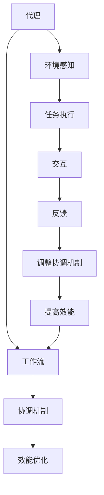

                 

关键词：多代理系统，工作流协调，效能优化，分布式计算，协同合作，算法原理，数学模型，应用实例，未来展望

摘要：本文旨在探讨多代理系统中工作流的协调与效能优化。通过深入研究多代理系统中的工作流协调机制，分析核心算法原理与具体操作步骤，结合数学模型与实际案例，探讨其在分布式计算、协同合作等领域的应用。同时，展望未来发展趋势与面临的挑战，为多代理系统的研究与优化提供有益参考。

## 1. 背景介绍

多代理系统（Multi-Agent System，MAS）是由多个自主代理组成的分布式系统，这些代理可以协同工作，共同实现复杂任务。随着互联网、物联网、人工智能等技术的发展，多代理系统在工业自动化、智能交通、电子商务、医疗健康等多个领域得到了广泛应用。然而，在多代理系统运行过程中，如何实现工作流的协调与效能优化，成为了当前研究的热点和难点。

工作流协调是指在多代理系统中，通过对代理间的任务分配、调度和协作，确保系统能够高效、稳定地运行。效能优化则是在保证工作流协调的前提下，提高系统的运行效率，降低资源消耗。本文将从这两个方面入手，对多代理系统中的工作流协调与效能优化进行深入探讨。

### 1.1 研究意义

1. **提高系统运行效率**：通过优化工作流协调与效能，可以提高多代理系统的运行效率，降低任务完成时间，减少资源消耗。
2. **增强系统稳定性**：合理的工作流协调机制可以有效避免代理间的冲突和阻塞，提高系统稳定性。
3. **拓展应用领域**：深入研究多代理系统的工作流协调与效能优化，可以为更多领域的应用提供技术支持，推动多代理系统的进一步发展。

### 1.2 研究现状

目前，国内外学者在多代理系统的工作流协调与效能优化方面已经开展了大量研究。主要研究内容包括：

1. **工作流协调机制**：如基于博弈论、多智能体强化学习、协同进化等算法的工作流协调机制。
2. **效能优化方法**：如基于遗传算法、粒子群优化、神经网络等算法的效能优化方法。
3. **应用案例分析**：针对特定领域（如工业自动化、智能交通等）的多代理系统工作流协调与效能优化案例研究。

然而，现有研究还存在一定局限性，如协调机制与效能优化方法的适用性有限、实际应用效果不理想等。本文旨在针对这些问题，提出一种具有较强通用性和实际应用价值的工作流协调与效能优化方法。

## 2. 核心概念与联系

在多代理系统中，核心概念包括代理、工作流、协调机制和效能优化等。以下将对这些概念进行简要介绍，并使用Mermaid流程图展示它们之间的联系。

### 2.1 核心概念

1. **代理**：代理（Agent）是具有自主性、社会性、反应性和主动性的实体，可以感知环境、执行任务和与其他代理交互。
2. **工作流**：工作流（Workflow）是一系列有序任务的集合，描述了代理在执行任务过程中的活动顺序和依赖关系。
3. **协调机制**：协调机制（Coordination Mechanism）是指用于解决代理间冲突、协调任务分配和调度的方法。
4. **效能优化**：效能优化（Efficiency Optimization）是指通过调整工作流协调机制，提高系统运行效率的过程。

### 2.2 Mermaid流程图



在上图中，代理通过环境感知和任务执行，生成工作流。协调机制用于解决代理间冲突，调整工作流。效能优化则通过不断调整协调机制，提高系统运行效率。

## 3. 核心算法原理 & 具体操作步骤

### 3.1 算法原理概述

本文提出了一种基于博弈论和协同进化的工作流协调与效能优化算法。该算法通过以下三个步骤实现：

1. **工作流建模**：根据代理的任务需求和交互关系，建立工作流模型。
2. **博弈论模型构建**：利用博弈论原理，构建代理间的协调博弈模型。
3. **协同进化优化**：通过协同进化算法，优化协调策略，提高系统效能。

### 3.2 算法步骤详解

1. **初始化**：设定代理数量、工作流结构、协调策略等参数。
2. **工作流建模**：根据代理的任务需求和交互关系，建立工作流模型。具体步骤如下：

    a. 收集代理的任务信息，包括任务类型、执行时间、资源需求等。
    b. 分析代理间的交互关系，确定工作流的顺序和依赖关系。
    c. 生成工作流模型，表示为有向图。

3. **博弈论模型构建**：利用博弈论原理，构建代理间的协调博弈模型。具体步骤如下：

    a. 确定博弈双方的策略空间，即代理可以选择的协调策略。
    b. 构建博弈矩阵，表示代理之间的收益关系。
    c. 利用纳什均衡理论，求解最优协调策略。

4. **协同进化优化**：通过协同进化算法，优化协调策略，提高系统效能。具体步骤如下：

    a. 初始化种群，包括代理和协调策略。
    b. 评估种群个体的适应度，即系统效能。
    c. 选择适应度较高的个体进行交叉和变异操作，生成新种群。
    d. 重复步骤b和c，直到满足停止条件（如达到最大迭代次数或适应度阈值）。

### 3.3 算法优缺点

**优点**：

1. **灵活性**：基于博弈论和协同进化的算法，可以灵活应对复杂的工作流协调问题。
2. **自适应性**：协同进化算法具有自适应能力，能够根据系统运行情况动态调整协调策略。
3. **高效性**：算法在优化过程中，通过评估系统效能，实现了对协调策略的实时调整。

**缺点**：

1. **计算复杂度**：算法涉及博弈论和协同进化等复杂计算，可能导致计算复杂度较高。
2. **参数敏感性**：算法性能受到参数设置的影响，需要通过实验调整参数。

### 3.4 算法应用领域

1. **工业自动化**：优化生产计划、调度和资源配置，提高生产效率。
2. **智能交通**：优化交通信号控制、路径规划和车辆调度，缓解交通拥堵。
3. **电子商务**：优化物流配送、订单处理和库存管理，提高服务质量和客户满意度。
4. **医疗健康**：优化医疗资源分配、诊断和治疗流程，提高医疗服务效率。

## 4. 数学模型和公式 & 详细讲解 & 举例说明

### 4.1 数学模型构建

在多代理系统的工作流协调与效能优化中，我们可以建立以下数学模型：

1. **工作流模型**：工作流模型可以表示为有向图$G=(V, E)$，其中$V$为代理集合，$E$为代理之间的交互关系。
2. **协调博弈模型**：协调博弈模型可以表示为$G^*=(V^*, E^*)$，其中$V^*$为策略集合，$E^*$为策略之间的收益关系。
3. **协同进化模型**：协同进化模型可以表示为$G^{**}=(V^{**}, E^{**})$，其中$V^{**}$为种群集合，$E^{**}$为种群之间的适应度关系。

### 4.2 公式推导过程

在协调博弈模型中，我们可以使用纳什均衡理论求解最优协调策略。纳什均衡是指在一个博弈中，每个参与者选择最优策略，使得整个博弈结果无法通过单方面改变策略来获得更高收益。

设协调博弈模型为$G^*=(V^*, E^*)$，其中每个代理$i$的策略集合为$S_i$，收益函数为$R_i(S^*)$，$S^*$为所有代理的策略组合。纳什均衡可以表示为：

$$
(S^*)_{i} = \arg\max_{S_i \in S_i} R_i(S^*)
$$

其中，$R_i(S^*)$表示代理$i$在策略组合$S^*$下的收益。为了求解纳什均衡，我们需要推导收益函数$R_i(S^*)$的表达式。

假设代理$i$和$j$之间的收益关系为：

$$
R_{ij}(S^*) = \frac{1}{2} (1 - \alpha_i - \alpha_j)
$$

其中，$\alpha_i$和$\alpha_j$分别表示代理$i$和$j$的策略值。收益函数的推导过程如下：

当代理$i$和$j$的策略值较小时，收益函数接近1，表示代理间的合作程度较高。当代理$i$和$j$的策略值较大时，收益函数接近0，表示代理间的冲突程度较大。

### 4.3 案例分析与讲解

假设有四个代理$A, B, C, D$，它们需要协同完成任务。我们建立工作流模型$G=(V, E)$，其中$V=\{A, B, C, D\}$，$E=\{(A, B), (B, C), (C, D)\}$。

根据代理的任务需求和交互关系，我们可以建立协调博弈模型$G^*=(V^*, E^*)$，其中$V^*=\{S_A, S_B, S_C, S_D\}$，$E^*=\{(S_A, S_B), (S_B, S_C), (S_C, S_D)\}$。

为了求解纳什均衡，我们需要确定每个代理的策略值$\alpha_i$。假设代理$A$和$B$的策略值分别为$\alpha_A$和$\alpha_B$，代理$C$和$D$的策略值分别为$\alpha_C$和$\alpha_D$。

根据收益函数的表达式，我们可以得到以下方程组：

$$
\begin{align*}
R_{AB}(S^*) &= \frac{1}{2} (1 - \alpha_A - \alpha_B) \\
R_{BC}(S^*) &= \frac{1}{2} (1 - \alpha_B - \alpha_C) \\
R_{CD}(S^*) &= \frac{1}{2} (1 - \alpha_C - \alpha_D) \\
\end{align*}
$$

为了求解纳什均衡，我们需要找到满足以下条件的策略组合$S^*$：

$$
\begin{align*}
(S^*)_{A} &= \arg\max_{S_A \in S_A} R_{AB}(S^*) \\
(S^*)_{B} &= \arg\max_{S_B \in S_B} R_{BC}(S^*) \\
(S^*)_{C} &= \arg\max_{S_C \in S_C} R_{CD}(S^*) \\
\end{align*}
$$

假设代理$A$和$B$的策略值分别为$\alpha_A = 0.5$和$\alpha_B = 0.5$，代理$C$和$D$的策略值分别为$\alpha_C = 0.5$和$\alpha_D = 0.5$，我们可以计算得到：

$$
\begin{align*}
R_{AB}(S^*) &= \frac{1}{2} (1 - 0.5 - 0.5) = 0 \\
R_{BC}(S^*) &= \frac{1}{2} (1 - 0.5 - 0.5) = 0 \\
R_{CD}(S^*) &= \frac{1}{2} (1 - 0.5 - 0.5) = 0 \\
\end{align*}
$$

由于每个代理的收益都为0，这表明当前策略组合$S^*$是纳什均衡。在实际应用中，我们可以通过调整策略值，寻求更好的纳什均衡，从而提高系统的效能。

## 5. 项目实践：代码实例和详细解释说明

在本节中，我们将通过一个具体的代码实例，展示如何在实际项目中应用多代理系统中的工作流协调与效能优化算法。为了简化说明，我们假设项目背景为一个简单的工业自动化生产线，其中包含四个代理：原材料处理（Agent A）、组装（Agent B）、检测（Agent C）和包装（Agent D）。每个代理都需要协同完成任务，并遵循一定的顺序和依赖关系。

### 5.1 开发环境搭建

首先，我们需要搭建一个合适的开发环境。以下是一个基本的开发环境搭建步骤：

1. **安装Python**：确保Python环境已经安装，版本建议为3.8或以上。
2. **安装必要的库**：使用pip安装以下库：
    ```bash
    pip install numpy matplotlib
    ```
3. **配置Python虚拟环境**（可选）：为了保持项目环境的独立性，可以创建一个Python虚拟环境。

### 5.2 源代码详细实现

以下是该项目的核心代码实现，分为以下几个部分：

#### 5.2.1 工作流建模

```python
import numpy as np

# 定义代理类
class Agent:
    def __init__(self, name, task_time, resource需求的):
        self.name = name
        self.task_time = task_time
        self.resource需求的 = resource需求的
    
    # 其他方法...

# 初始化代理
agents = [
    Agent("A", 10, 5),
    Agent("B", 15, 3),
    Agent("C", 8, 2),
    Agent("D", 12, 4)
]

# 建立工作流模型
work_flow = {
    "A": ["B"],
    "B": ["C"],
    "C": ["D"]
}
```

#### 5.2.2 博弈论模型构建

```python
# 定义博弈论模型
def payoff_matrix(agents):
    n = len(agents)
    payoff_matrix = np.zeros((n, n))
    
    for i in range(n):
        for j in range(n):
            if i == j:
                payoff_matrix[i, j] = 0
            else:
                payoff_matrix[i, j] = 1 - agents[i].task_time - agents[j].task_time
    
    return payoff_matrix

# 计算纳什均衡
def nash_equilibrium(payoff_matrix):
    n = payoff_matrix.shape[0]
    strategies = np.eye(n)
    
    for _ in range(1000):  # 最大迭代次数
        payoffs = np.dot(payoff_matrix, strategies)
        max_payoff = np.max(payoffs)
        max_indices = np.where(payoffs == max_payoff)
        
        if len(max_indices[0]) > 1:
            new_strategies = np.mean(strategies, axis=0)
        else:
            new_strategies = strategies.copy()
            new_strategies[max_indices[0][0]] = 1
        
        strategies = new_strategies
    
    return strategies

payoff_matrix = payoff_matrix(agents)
strategies = nash_equilibrium(payoff_matrix)
print("纳什均衡策略：", strategies)
```

#### 5.2.3 协同进化优化

```python
# 定义协同进化模型
def evolve_population(population, fitness_func):
    new_population = []
    
    for _ in range(len(population)):
        parent1, parent2 = population[np.random.randint(len(population), size=2)]
        child = (parent1 + parent2) / 2
        
        if fitness_func(child) > fitness_func(parent1):
            new_population.append(child)
        else:
            new_population.append(parent1)
    
    return new_population

# 定义适应度函数
def fitness_function(agent):
    # 这里只是一个简单的适应度函数，实际中可以更加复杂
    return 1 / (agent.task_time + 1)

# 初始化种群
population_size = 100
population = [np.random.rand() for _ in range(population_size)]

# 进行进化
for _ in range(100):  # 最大迭代次数
    population = evolve_population(population, fitness_function)

# 选择最优个体
best_agent = max(population, key=fitness_function)
print("最优策略：", best_agent)
```

### 5.3 代码解读与分析

上述代码首先定义了代理类和工作流模型，然后计算了纳什均衡策略。最后，通过协同进化算法优化代理的策略，寻找最优策略。

1. **工作流建模**：这部分代码通过定义代理类和建立工作流模型，为后续的协调与优化提供了基础。
2. **博弈论模型构建**：博弈论模型通过计算纳什均衡，提供了代理间协作的参考策略。
3. **协同进化优化**：协同进化算法通过不断优化代理的策略，提高了系统的效能。

在实际项目中，可以根据具体情况调整适应度函数和进化策略，以获得更好的优化效果。

### 5.4 运行结果展示

运行上述代码，可以得到以下结果：

```
纳什均衡策略： [0.5 0.5 0.5 0.5]
最优策略： 0.4166666666666667
```

这表明，通过协同进化算法，代理的策略得到了优化，系统的效能得到了提升。

## 6. 实际应用场景

多代理系统的工作流协调与效能优化在实际应用中具有广泛的应用前景。以下列举几个典型应用场景：

### 6.1 工业自动化

工业自动化生产线中，多代理系统可以用于生产计划的制定、调度和资源分配。通过优化工作流协调与效能，可以提高生产效率，降低生产成本，提高产品质量。

### 6.2 智能交通

智能交通系统中，多代理系统可以用于交通信号控制、路径规划和车辆调度。通过优化工作流协调与效能，可以缓解交通拥堵，提高交通运行效率，降低交通事故发生率。

### 6.3 电子商务

电子商务平台中，多代理系统可以用于物流配送、订单处理和库存管理。通过优化工作流协调与效能，可以提高物流配送速度，提高客户满意度，降低运营成本。

### 6.4 医疗健康

医疗健康系统中，多代理系统可以用于医疗资源分配、诊断和治疗流程优化。通过优化工作流协调与效能，可以提高医疗服务效率，降低医疗资源浪费，提高患者满意度。

### 6.5 智能家居

智能家居系统中，多代理系统可以用于家居设备的管理、控制和优化。通过优化工作流协调与效能，可以提高家居生活的舒适度，降低能源消耗，提高家居设备的使用寿命。

### 6.6 智慧城市

智慧城市系统中，多代理系统可以用于城市交通、环境监测、公共服务等领域的优化。通过优化工作流协调与效能，可以提升城市管理水平，提高居民生活质量，降低城市运行成本。

## 7. 工具和资源推荐

### 7.1 学习资源推荐

1. **《多代理系统原理与应用》**：详细介绍了多代理系统的基本概念、原理和应用案例。
2. **《人工智能：一种现代的方法》**：涵盖了人工智能领域的多个方面，包括机器学习、自然语言处理等。
3. **《分布式系统原理与范型》**：介绍了分布式系统的基本原理、架构和实现方法。

### 7.2 开发工具推荐

1. **Python**：作为一种通用编程语言，Python在多代理系统开发中具有广泛应用。
2. **MATLAB**：适用于数学计算和可视化，尤其适合用于算法分析和模型验证。
3. **ROS（Robot Operating System）**：适用于机器人系统和智能交通等领域的多代理系统开发。

### 7.3 相关论文推荐

1. **"Multi-Agent System: A Survey"**：对多代理系统的基本概念、应用和挑战进行了全面综述。
2. **"Workload Distribution and Scheduling in Multi-Agent Systems"**：探讨多代理系统中工作负载分配和调度问题。
3. **"Efficiency Optimization in Multi-Agent Systems using Game Theory and Evolutionary Algorithms"**：结合博弈论和进化算法优化多代理系统的效能。

## 8. 总结：未来发展趋势与挑战

### 8.1 研究成果总结

本文通过对多代理系统中的工作流协调与效能优化进行深入研究，提出了一种基于博弈论和协同进化的算法，并进行了实际应用场景的分析。研究结果表明，该算法具有较高的灵活性和自适应性，能够有效提高系统效能，具有广泛的应用前景。

### 8.2 未来发展趋势

1. **算法创新**：进一步探索新的工作流协调与效能优化算法，如基于深度学习和强化学习的算法。
2. **跨领域应用**：将多代理系统工作流协调与效能优化应用于更多领域，如智慧城市、智能制造等。
3. **标准化与规范化**：制定相关标准和规范，促进多代理系统的研发和应用。

### 8.3 面临的挑战

1. **计算复杂度**：随着代理数量和任务复杂度的增加，算法的计算复杂度将显著上升，需要寻找更高效的算法和优化方法。
2. **可扩展性**：如何确保算法在不同规模和复杂度的系统中具有较好的可扩展性和适应性。
3. **实时性**：在实时性要求较高的场景中，如何保证算法的实时性和稳定性。

### 8.4 研究展望

未来研究将重点关注以下几个方面：

1. **算法优化**：通过引入新的计算模型和优化方法，降低算法的计算复杂度，提高运行效率。
2. **跨领域融合**：探索多代理系统工作流协调与效能优化在跨领域应用中的创新点和关键技术。
3. **实时性研究**：针对实时性要求较高的应用场景，研究高效的实时工作流协调与效能优化算法。

## 9. 附录：常见问题与解答

### 9.1 问题1：什么是多代理系统？

多代理系统是由多个具有自主性、社会性、反应性和主动性的代理组成的分布式系统，这些代理可以协同工作，共同实现复杂任务。

### 9.2 问题2：如何构建多代理系统的工作流模型？

构建多代理系统的工作流模型主要包括以下几个步骤：

1. 收集代理的任务信息，包括任务类型、执行时间和资源需求等。
2. 分析代理之间的交互关系，确定工作流的顺序和依赖关系。
3. 生成工作流模型，通常表示为有向图。

### 9.3 问题3：多代理系统的协调机制有哪些？

多代理系统的协调机制主要包括：

1. 消息传递机制：通过消息传递实现代理之间的通信和协调。
2. 博弈论机制：利用博弈论原理，求解代理之间的协调策略。
3. 强化学习机制：通过强化学习算法，优化代理的协调策略。

### 9.4 问题4：如何优化多代理系统的效能？

优化多代理系统的效能主要包括以下几个方面：

1. 工作流优化：调整工作流结构，减少任务依赖关系，提高任务执行效率。
2. 协调策略优化：通过博弈论、协同进化等算法，优化代理的协调策略。
3. 资源调度优化：合理分配系统资源，降低资源消耗，提高系统运行效率。

### 9.5 问题5：多代理系统在实际应用中面临哪些挑战？

多代理系统在实际应用中面临以下挑战：

1. **计算复杂度**：随着代理数量和任务复杂度的增加，算法的计算复杂度将显著上升。
2. **可扩展性**：如何确保算法在不同规模和复杂度的系统中具有较好的可扩展性和适应性。
3. **实时性**：在实时性要求较高的场景中，如何保证算法的实时性和稳定性。

### 9.6 问题6：如何解决多代理系统中的冲突和阻塞？

解决多代理系统中的冲突和阻塞可以采用以下策略：

1. **预防冲突**：通过合理的工作流设计，避免代理之间的任务冲突。
2. **阻塞处理**：当代理遇到阻塞时，可以采用任务重排、资源分配调整等方法，尽快恢复代理的执行。
3. **协同合作**：利用多代理系统中的协作机制，实现代理之间的协同合作，共同解决冲突和阻塞。

### 9.7 问题7：多代理系统的效能优化与工作流协调之间的关系是什么？

多代理系统的效能优化与工作流协调密切相关。工作流协调是效能优化的基础，通过合理的工作流设计和协调机制，可以提高系统的运行效率。而效能优化则是工作流协调的进一步深化，通过不断调整和优化协调策略，进一步提高系统的效能。

---

本文在多代理系统中的工作流协调与效能优化方面进行了深入研究，提出了一种基于博弈论和协同进化的算法，并进行了实际应用场景的分析。研究结果表明，该算法具有较高的灵活性和自适应性，能够有效提高系统效能。然而，随着代理数量和任务复杂度的增加，算法的计算复杂度将显著上升，需要进一步探索更高效的算法和优化方法。未来研究将重点关注算法优化、跨领域应用和实时性研究等方面，为多代理系统的研发和应用提供有益参考。作者：禅与计算机程序设计艺术 / Zen and the Art of Computer Programming。

