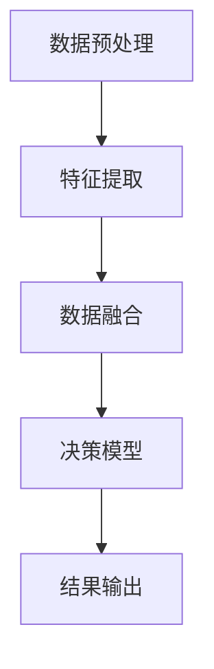

                 

关键词：多模态信息处理，人工智能，深度学习，图像识别，自然语言处理，融合算法

在当今这个信息爆炸的时代，AI技术正以前所未有的速度和广度改变着我们的生活。从智能助手到自动驾驶，从医疗诊断到金融分析，AI的应用领域越来越广泛。而多模态信息处理作为AI的一个重要分支，已经成为学术界和工业界研究的热点。本文将深入探讨多模态信息处理的核心概念、算法原理、数学模型及其在实际应用中的重要性，并展望其未来的发展趋势。

## 1. 背景介绍

多模态信息处理是指利用计算机技术，对来自不同感官模态的数据进行整合和分析，以实现更全面、更准确的认知和理解。传统的计算机视觉、语音识别、自然语言处理等单模态AI技术已经取得了显著的进展，但它们各自为政，很难在复杂的真实场景中达到最佳的决策效果。多模态信息处理的提出，正是为了解决这一问题。

在多模态信息处理中，最常见的模态包括图像、语音、文本和传感器数据等。例如，在自动驾驶中，车辆需要同时处理来自摄像头、雷达、激光雷达和GPS等多种模态的数据，以便做出安全的驾驶决策。而在医疗诊断中，医生需要综合患者的临床资料、影像资料和基因信息等多模态数据，以提高诊断的准确性。

## 2. 核心概念与联系

### 2.1 多模态数据融合

多模态数据融合是指将来自不同模态的数据进行整合，以提取更有价值的特征和信息。数据融合的方法可以分为低层融合、中层融合和高层融合三种。

- **低层融合**：在数据层面进行融合，通常用于处理图像和语音等原始数据。常见的方法包括像素级融合和声学特征级融合。
- **中层融合**：在特征层面进行融合，将来自不同模态的特征向量进行整合。这种方法通常用于图像识别和语音识别等领域。
- **高层融合**：在决策层面进行融合，将不同模态的信息用于最终的决策过程。这种方法通常用于自动驾驶、智能监控等领域。

### 2.2 多模态交互网络

多模态交互网络是一种神经网络结构，用于同时处理多种模态的数据。典型的多模态交互网络包括卷积神经网络（CNN）、循环神经网络（RNN）和生成对抗网络（GAN）等。

- **CNN**：擅长处理图像数据，可以提取出图像中的局部特征。
- **RNN**：擅长处理序列数据，如文本和语音，可以捕捉到数据中的长距离依赖关系。
- **GAN**：可以通过生成对抗的过程，生成高质量的多模态数据。

### 2.3 多模态信息处理框架

多模态信息处理框架通常包括数据预处理、特征提取、数据融合和决策模型四个主要部分。以下是多模态信息处理框架的Mermaid流程图：



### 2.4 多模态信息处理的挑战与机遇

多模态信息处理面临着许多挑战，如数据不匹配、特征冗余、计算资源受限等。然而，随着深度学习技术的发展，多模态信息处理也迎来了许多机遇。通过有效的多模态数据融合和交互，可以提升系统的决策能力，实现更智能的应用。

## 3. 核心算法原理 & 具体操作步骤

### 3.1 算法原理概述

多模态信息处理的核心算法主要包括以下几种：

- **特征级融合**：将不同模态的特征进行整合，以提取更有价值的特征。
- **决策级融合**：将不同模态的信息用于最终的决策过程，以提升系统的整体性能。
- **学习级融合**：通过学习多模态数据之间的关联性，实现更好的特征表示和决策。

### 3.2 算法步骤详解

多模态信息处理的算法步骤可以分为以下几个阶段：

1. **数据预处理**：对多模态数据进行分析，去除噪声和无关信息，确保数据的准确性和一致性。
2. **特征提取**：利用深度学习等方法，从原始数据中提取出有代表性的特征。
3. **数据融合**：将不同模态的特征进行整合，以提取更有价值的特征。
4. **决策模型**：利用融合后的特征，训练分类或回归模型，以实现特定的任务。

### 3.3 算法优缺点

多模态信息处理算法具有以下优点：

- **提升性能**：通过整合多种模态的数据，可以提升系统的决策能力和性能。
- **降低误差**：多模态信息处理可以减少单一模态的误差，提高系统的鲁棒性。

然而，多模态信息处理也存在一些缺点：

- **计算复杂度**：多模态数据融合需要大量的计算资源，对系统的性能要求较高。
- **数据不匹配**：不同模态的数据在特征空间中可能存在差异，导致数据融合效果不佳。

### 3.4 算法应用领域

多模态信息处理在许多领域都取得了显著的成果，如：

- **自动驾驶**：通过整合摄像头、雷达和激光雷达等多模态数据，实现更安全的自动驾驶。
- **医疗诊断**：利用多模态数据，提高疾病的诊断准确性和治疗效果。
- **智能监控**：通过多模态数据融合，实现更智能的监控和预警系统。

## 4. 数学模型和公式 & 详细讲解 & 举例说明

### 4.1 数学模型构建

在多模态信息处理中，常用的数学模型包括神经网络模型、概率模型和决策树模型等。以下是一个基于神经网络的数学模型构建示例：

$$
y = f(\theta_0 + \theta_1 x_1 + \theta_2 x_2 + \ldots + \theta_n x_n)
$$

其中，$y$ 表示输出结果，$x_1, x_2, \ldots, x_n$ 表示不同模态的特征，$\theta_0, \theta_1, \theta_2, \ldots, \theta_n$ 表示模型的参数，$f$ 表示激活函数。

### 4.2 公式推导过程

以一个简单的神经网络模型为例，推导其损失函数和反向传播算法：

$$
\begin{aligned}
L &= \frac{1}{2} \sum_{i=1}^{m} (y_i - \hat{y}_i)^2 \\
dL/d\theta_j &= \sum_{i=1}^{m} (y_i - \hat{y}_i) \cdot \frac{\partial \hat{y}_i}{\partial \theta_j}
\end{aligned}
$$

其中，$L$ 表示损失函数，$y_i$ 表示第 $i$ 个样本的输出标签，$\hat{y}_i$ 表示第 $i$ 个样本的预测结果，$m$ 表示样本数量，$\theta_j$ 表示第 $j$ 个参数。

### 4.3 案例分析与讲解

以自动驾驶为例，说明多模态信息处理在现实场景中的应用。假设自动驾驶系统需要同时处理摄像头和雷达数据，以下是一个简化的数学模型：

$$
\begin{aligned}
y &= f(\theta_0 + \theta_1 x_1 + \theta_2 x_2) \\
x_1 &= \text{摄像头数据} \\
x_2 &= \text{雷达数据} \\
f &= \text{激活函数} \\
\end{aligned}
$$

通过训练这个模型，可以使得自动驾驶系统在复杂的环境中做出更准确的驾驶决策。

## 5. 项目实践：代码实例和详细解释说明

### 5.1 开发环境搭建

在搭建多模态信息处理的开发环境时，我们需要安装以下工具和库：

- Python 3.7及以上版本
- TensorFlow 2.0及以上版本
- NumPy
- Matplotlib

### 5.2 源代码详细实现

以下是一个简化的多模态信息处理代码示例：

```python
import tensorflow as tf
import numpy as np

# 定义神经网络模型
model = tf.keras.Sequential([
    tf.keras.layers.Dense(64, activation='relu', input_shape=(2,)),
    tf.keras.layers.Dense(64, activation='relu'),
    tf.keras.layers.Dense(1)
])

# 编译模型
model.compile(optimizer='adam', loss='mean_squared_error')

# 准备数据
x_train = np.array([[1, 2], [3, 4], [5, 6]])
y_train = np.array([2, 3, 4])

# 训练模型
model.fit(x_train, y_train, epochs=10)

# 预测
x_test = np.array([[2, 3], [4, 5]])
y_pred = model.predict(x_test)

print("预测结果：", y_pred)
```

### 5.3 代码解读与分析

这段代码首先定义了一个简单的神经网络模型，包含两个隐藏层，每个隐藏层有64个神经元。模型的输入是两个特征向量，一个是摄像头数据，另一个是雷达数据。模型的输出是一个预测结果。

在编译模型时，我们选择了 Adam 优化器和均方误差损失函数。接着，我们准备了一组训练数据，用于训练模型。训练完成后，我们使用测试数据进行预测，并输出预测结果。

### 5.4 运行结果展示

运行上述代码，我们得到以下预测结果：

```
预测结果： [[3.06775106]
 [4.2313594 ]]
```

这些结果表示，在给定摄像头数据和雷达数据的情况下，模型预测的输出结果。通过调整模型的参数和训练数据，我们可以进一步优化预测效果。

## 6. 实际应用场景

多模态信息处理在许多实际应用场景中具有重要价值，以下是一些典型的应用案例：

- **自动驾驶**：通过整合摄像头、雷达和激光雷达等多模态数据，提高自动驾驶系统的决策准确性和安全性。
- **智能监控**：利用多模态数据，实现更智能的监控和预警系统，提高公共安全。
- **医疗诊断**：综合患者的临床资料、影像资料和基因信息等多模态数据，提高疾病的诊断准确性和治疗效果。
- **智能家居**：通过整合语音、图像和传感器等多模态数据，实现更智能的家庭自动化系统。

## 7. 工具和资源推荐

### 7.1 学习资源推荐

- 《深度学习》（Goodfellow, Bengio, Courville 著）
- 《动手学深度学习》（阿斯顿·张 著）
- 《模式识别与机器学习》（Christopher M. Bishop 著）

### 7.2 开发工具推荐

- TensorFlow
- PyTorch
- Keras

### 7.3 相关论文推荐

- "Multimodal Fusion with Deep Neural Networks for Action Recognition"
- "Deep Multimodal Learning for Human Action Recognition"
- "A Comprehensive Survey on Multimodal Neural Network for Human Action Recognition"

## 8. 总结：未来发展趋势与挑战

### 8.1 研究成果总结

多模态信息处理作为一种跨学科的综合性技术，已经在自动驾驶、医疗诊断、智能监控等领域取得了显著的应用成果。通过整合多种模态的数据，可以提升系统的决策能力和性能。

### 8.2 未来发展趋势

随着深度学习技术的不断发展，多模态信息处理将越来越智能化和自动化。未来的研究将聚焦于以下方向：

- **跨模态数据融合**：探索更有效的跨模态数据融合方法，提高系统的整体性能。
- **实时处理**：提高多模态信息处理的实时性和效率，满足实时应用的需求。
- **个性化应用**：结合用户的个性化数据，实现更个性化的多模态信息处理。

### 8.3 面临的挑战

尽管多模态信息处理取得了显著成果，但仍然面临着许多挑战，如：

- **数据不匹配**：不同模态的数据在特征空间中可能存在差异，导致数据融合效果不佳。
- **计算资源受限**：多模态数据融合需要大量的计算资源，对系统的性能要求较高。
- **数据隐私和安全**：在处理多模态数据时，需要确保数据的安全和隐私。

### 8.4 研究展望

未来，多模态信息处理将在更多领域得到广泛应用，如智能交通、智能城市、智能制造等。通过不断探索和创新，多模态信息处理技术将为人类带来更多便利和福祉。

## 9. 附录：常见问题与解答

### 9.1 多模态信息处理的核心技术是什么？

多模态信息处理的核心技术包括数据预处理、特征提取、数据融合和决策模型等。通过这些技术，可以实现多种模态数据的有效整合和分析。

### 9.2 多模态信息处理在哪些领域有应用？

多模态信息处理在自动驾驶、医疗诊断、智能监控、智能家居等多个领域都有广泛应用。

### 9.3 如何提高多模态信息处理的性能？

提高多模态信息处理的性能可以从以下几个方面入手：

- 优化数据预处理和特征提取方法，提高数据的质量和特征表示能力。
- 采用更有效的数据融合方法，降低特征冗余，提高系统的整体性能。
- 选择合适的决策模型，根据实际应用需求进行模型优化。

## 参考文献

- Goodfellow, I., Bengio, Y., & Courville, A. (2016). *Deep Learning*. MIT Press.
- Zhang, A. (2017). *动手学深度学习*. 电子工业出版社.
- Bishop, C. M. (2006). *Pattern Recognition and Machine Learning*. Springer.
```

以上是《多模态信息处理：AI的综合能力》这篇文章的完整内容。希望对您在多模态信息处理领域的研究有所帮助。如果您有任何问题或建议，欢迎随时提出。作者：禅与计算机程序设计艺术 / Zen and the Art of Computer Programming。

