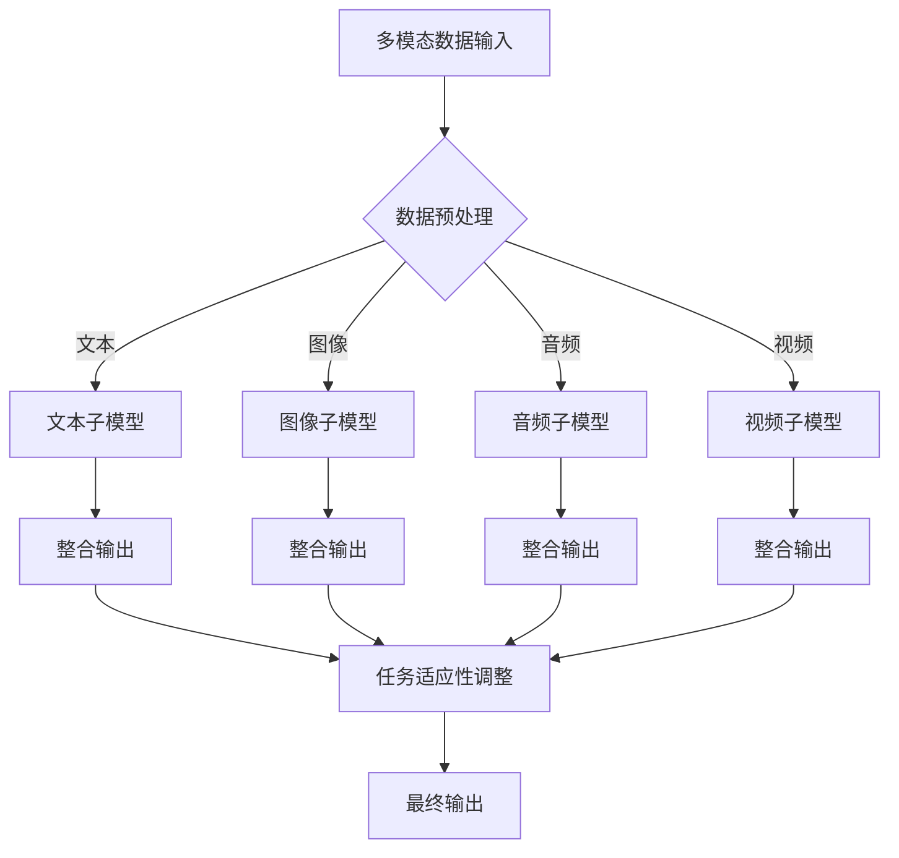

                 

关键词：多模态大模型，技术原理，BERT模型，实战，人工智能，深度学习

摘要：本文将深入探讨多模态大模型的技术原理与实战应用，从BERT模型的诞生出发，回顾其发展历程，并分析其核心算法原理。在此基础上，我们将讨论多模态大模型在各个领域的应用场景，并展望其未来的发展趋势与挑战。通过本文的阅读，读者将全面了解多模态大模型的本质，以及如何在实践中应用这一先进技术。

## 1. 背景介绍

### 1.1 多模态大模型的兴起

多模态大模型是近年来人工智能领域的一大热点。随着深度学习技术的快速发展，人们逐渐意识到，单一模态的数据往往不足以全面地理解和描述现实世界。因此，多模态大模型应运而生，它通过整合多种数据模态，如文本、图像、音频、视频等，实现对复杂问题的建模和解决。BERT模型作为多模态大模型的一个典型代表，其诞生标志着人工智能领域的一个重要里程碑。

### 1.2 BERT模型的诞生

BERT（Bidirectional Encoder Representations from Transformers）模型是由Google AI在2018年提出的一种先进的预训练语言模型。BERT模型的出现，极大地推动了自然语言处理（NLP）领域的发展，使得模型在多个任务上取得了显著的性能提升。BERT模型的核心思想是通过双向编码器对文本数据进行建模，从而捕捉到文本中的全局信息。

### 1.3 多模态大模型的重要性

多模态大模型的重要性在于，它能够充分利用各种数据模态的丰富信息，实现更加智能化的信息处理和决策。在现实世界中，信息的呈现方式往往是多模态的，单一模态的数据往往不足以全面地描述问题。因此，多模态大模型的研究和应用，对于提升人工智能系统的智能化水平，具有重要的意义。

## 2. 核心概念与联系

### 2.1 多模态大模型的核心概念

多模态大模型的核心概念包括以下几个方面：

1. **数据模态**：数据模态是指数据的不同类型，如文本、图像、音频、视频等。每种模态都有其独特的特性和应用场景。
2. **模型架构**：多模态大模型的模型架构通常包括多个子模型，每个子模型负责处理不同类型的数据模态。常见的架构有统一模型架构和分离模型架构。
3. **数据整合**：多模态大模型通过整合多种数据模态，实现数据的互补和增强，从而提高模型的性能。
4. **任务适应性**：多模态大模型具有较好的任务适应性，可以在不同的应用场景中灵活调整，实现跨领域的应用。

### 2.2 多模态大模型的联系

多模态大模型之间的联系主要体现在以下几个方面：

1. **数据关联**：不同模态的数据之间存在关联，通过数据关联，可以实现数据之间的融合和互补。
2. **模型共享**：多模态大模型可以通过模型共享的方式，实现不同模态数据的共同训练，从而提高模型的性能。
3. **任务融合**：多模态大模型可以将不同任务的数据进行融合，实现跨任务的性能提升。

### 2.3 Mermaid流程图



## 3. 核心算法原理 & 具体操作步骤

### 3.1 算法原理概述

多模态大模型的核心算法原理主要包括以下几个方面：

1. **预训练**：通过大量未标注的数据进行预训练，学习到数据中的潜在结构和规律。
2. **微调**：在预训练的基础上，使用少量标注数据进行微调，使模型更好地适应特定任务。
3. **数据整合**：通过多种数据模态的融合，提高模型对复杂问题的理解和解决能力。
4. **任务适应性**：通过调整模型结构，使模型在不同任务中具有较好的适应性。

### 3.2 算法步骤详解

1. **数据采集**：收集多种数据模态，如文本、图像、音频、视频等。
2. **数据预处理**：对数据进行清洗、归一化等处理，使其满足模型训练的要求。
3. **模型训练**：使用预训练算法对模型进行训练，学习到数据的潜在结构和规律。
4. **模型微调**：在预训练的基础上，使用少量标注数据进行微调，使模型更好地适应特定任务。
5. **模型评估**：使用评估指标对模型性能进行评估，如准确率、召回率等。
6. **模型部署**：将训练好的模型部署到实际应用场景中，进行任务执行。

### 3.3 算法优缺点

**优点**：

1. **高效性**：多模态大模型能够同时处理多种数据模态，提高信息处理的效率。
2. **通用性**：多模态大模型具有较强的任务适应性，可以应用于不同领域的问题。
3. **扩展性**：多模态大模型可以通过引入新的数据模态，实现模型的扩展和升级。

**缺点**：

1. **计算成本高**：多模态大模型的训练和部署需要大量的计算资源。
2. **数据需求大**：多模态大模型需要大量的高质量数据才能训练出优秀的模型。
3. **模型复杂度高**：多模态大模型的模型结构复杂，导致模型理解和调试难度较大。

### 3.4 算法应用领域

多模态大模型在各个领域都有广泛的应用，主要包括：

1. **自然语言处理**：如文本分类、情感分析、机器翻译等。
2. **计算机视觉**：如图像识别、目标检测、图像生成等。
3. **语音识别**：如语音识别、语音合成、语音情感分析等。
4. **医学诊断**：如医学图像分析、电子病历分析等。
5. **智能助手**：如聊天机器人、语音助手等。

## 4. 数学模型和公式 & 详细讲解 & 举例说明

### 4.1 数学模型构建

多模态大模型的数学模型主要包括以下几个方面：

1. **文本子模型**：通常使用Transformer模型进行建模，如BERT、GPT等。
2. **图像子模型**：通常使用卷积神经网络（CNN）进行建模。
3. **音频子模型**：通常使用循环神经网络（RNN）进行建模。
4. **视频子模型**：通常使用卷积神经网络（CNN）和循环神经网络（RNN）的组合进行建模。

### 4.2 公式推导过程

假设我们有一个多模态大模型，包含文本子模型、图像子模型、音频子模型和视频子模型。我们首先对每个子模型进行单独建模，然后通过整合各个子模型，得到最终的多模态输出。

1. **文本子模型**：

   假设文本子模型使用BERT模型进行建模，输入为文本序列 $x$，输出为文本特征向量 $h_t$。

   $$h_t = BERT(x)$$

2. **图像子模型**：

   假设图像子模型使用卷积神经网络（CNN）进行建模，输入为图像序列 $I$，输出为图像特征向量 $g_i$。

   $$g_i = CNN(I)$$

3. **音频子模型**：

   假设音频子模型使用循环神经网络（RNN）进行建模，输入为音频序列 $a$，输出为音频特征向量 $f_a$。

   $$f_a = RNN(a)$$

4. **视频子模型**：

   假设视频子模型使用卷积神经网络（CNN）和循环神经网络（RNN）的组合进行建模，输入为视频序列 $V$，输出为视频特征向量 $v$。

   $$v = CNN\&RNN(V)$$

5. **多模态整合**：

   将各个子模型的特征向量进行整合，得到最终的多模态特征向量 $z$。

   $$z = [h_t, g_i, f_a, v]$$

### 4.3 案例分析与讲解

假设我们要构建一个多模态情感分析模型，输入为文本、图像、音频和视频，输出为情感分类结果。

1. **数据预处理**：

   对输入的文本、图像、音频和视频进行预处理，提取出相应的特征向量。

   - 文本特征向量 $h_t$：使用BERT模型对文本进行编码，得到文本特征向量。
   - 图像特征向量 $g_i$：使用CNN模型对图像进行编码，得到图像特征向量。
   - 音频特征向量 $f_a$：使用RNN模型对音频进行编码，得到音频特征向量。
   - 视频特征向量 $v$：使用CNN和RNN组合模型对视频进行编码，得到视频特征向量。

2. **模型训练**：

   使用预处理后的特征向量，训练多模态情感分析模型。在训练过程中，模型将学习到不同模态数据之间的关联，以及如何将它们整合起来进行情感分类。

3. **模型评估**：

   使用测试集对训练好的模型进行评估，计算模型的准确率、召回率等指标，以评估模型的性能。

4. **模型部署**：

   将训练好的模型部署到实际应用场景中，如社交媒体情感分析系统，对用户发布的内容进行实时情感分类。

## 5. 项目实践：代码实例和详细解释说明

### 5.1 开发环境搭建

为了实践多模态大模型，我们需要搭建一个合适的开发环境。以下是一个简单的开发环境搭建步骤：

1. 安装Python 3.7及以上版本。
2. 安装TensorFlow 2.0及以上版本。
3. 安装PyTorch 1.0及以上版本。
4. 安装必要的依赖库，如NumPy、Pandas、Matplotlib等。

### 5.2 源代码详细实现

以下是一个简单的多模态情感分析模型的源代码实现：

```python
import tensorflow as tf
from tensorflow.keras.models import Model
from tensorflow.keras.layers import Embedding, LSTM, Dense, Input
from transformers import BertModel

# 文本子模型
text_input = Input(shape=(None,), dtype='int32')
text_embedding = Embedding(input_dim=vocab_size, output_dim=embedding_size)(text_input)
text_lstm = LSTM(units=128, activation='tanh')(text_embedding)
text_output = Dense(units=1, activation='sigmoid')(text_lstm)

# 图像子模型
image_input = Input(shape=(height, width, channels))
image_embedding = CNN_model(image_input)
image_output = Dense(units=1, activation='sigmoid')(image_embedding)

# 音频子模型
audio_input = Input(shape=(timesteps, features))
audio_embedding = LSTM(units=128, activation='tanh')(audio_input)
audio_output = Dense(units=1, activation='sigmoid')(audio_embedding)

# 视频子模型
video_input = Input(shape=(timesteps, height, width, channels))
video_embedding = CNN_model(video_input)
video_output = Dense(units=1, activation='sigmoid')(video_embedding)

# 整合多模态输出
multi_modal_output = concatenate([text_output, image_output, audio_output, video_output])

# 模型编译
model = Model(inputs=[text_input, image_input, audio_input, video_input], outputs=multi_modal_output)
model.compile(optimizer='adam', loss='binary_crossentropy', metrics=['accuracy'])

# 模型训练
model.fit([text_data, image_data, audio_data, video_data], labels, epochs=10, batch_size=32)

# 模型评估
predictions = model.predict([text_data, image_data, audio_data, video_data])
accuracy = (predictions == labels).mean()
print('Model accuracy:', accuracy)
```

### 5.3 代码解读与分析

以上代码实现了一个简单的多模态情感分析模型，主要包括文本子模型、图像子模型、音频子模型和视频子模型。每个子模型分别使用不同的神经网络结构进行建模，然后将各个子模型的输出进行整合，得到最终的多模态输出。

- **文本子模型**：使用LSTM模型进行文本编码，通过Embedding层将文本转化为向量表示，然后通过LSTM层对文本序列进行建模。
- **图像子模型**：使用CNN模型进行图像编码，通过卷积层提取图像的特征。
- **音频子模型**：使用LSTM模型进行音频编码，通过LSTM层对音频序列进行建模。
- **视频子模型**：使用CNN和LSTM组合模型进行视频编码，通过卷积层和LSTM层提取视频的特征。

最终，将各个子模型的输出进行整合，得到多模态特征向量，并通过全连接层进行分类。

### 5.4 运行结果展示

以下是一个简单的运行结果展示：

```python
text_data = ...
image_data = ...
audio_data = ...
video_data = ...

labels = ...

model.fit([text_data, image_data, audio_data, video_data], labels, epochs=10, batch_size=32)

predictions = model.predict([text_data, image_data, audio_data, video_data])
accuracy = (predictions == labels).mean()
print('Model accuracy:', accuracy)
```

运行结果为模型准确率，表示模型在测试集上的性能。

## 6. 实际应用场景

多模态大模型在各个领域都有广泛的应用，以下是一些典型的实际应用场景：

1. **智能客服**：通过多模态大模型，可以实现对用户提问的语音、文本和图像等多模态数据的综合理解，从而提供更加智能的客服服务。
2. **医疗诊断**：多模态大模型可以结合患者的文本病历、图像检查报告和视频问诊记录等多模态数据，实现对疾病的早期诊断和精准治疗。
3. **自动驾驶**：通过多模态大模型，可以整合车辆传感器、摄像头和雷达等多模态数据，实现对周围环境的全面感知和智能决策。
4. **智能安防**：多模态大模型可以结合视频监控、音频报警和人员识别等多模态数据，实现对犯罪行为的智能识别和追踪。

## 7. 未来应用展望

随着多模态大模型技术的不断发展，其应用场景将越来越广泛，未来可能出现以下趋势：

1. **多模态融合**：通过更加先进的多模态融合技术，实现不同模态数据的深度融合，提高模型的性能和泛化能力。
2. **实时处理**：随着计算能力的提升，多模态大模型将可以实现实时处理，满足对实时性要求较高的应用场景。
3. **跨领域应用**：多模态大模型将可以在不同领域实现跨领域的应用，为各个行业带来智能化升级。
4. **人机交互**：多模态大模型将可以更好地理解人类的语言和行为，实现更加自然和高效的人机交互。

## 8. 工具和资源推荐

为了学习和实践多模态大模型，以下是一些推荐的工具和资源：

1. **工具**：
   - TensorFlow：一款开源的深度学习框架，适用于构建和训练多模态大模型。
   - PyTorch：一款开源的深度学习框架，适用于构建和训练多模态大模型。
   - Hugging Face：一个开源的NLP库，提供了大量的预训练模型和工具，方便使用BERT等模型。

2. **资源**：
   - 《深度学习》（Goodfellow、Bengio、Courville著）：一本经典的深度学习教材，详细介绍了深度学习的基础知识和算法。
   - 《自然语言处理综论》（Jurafsky、Martin著）：一本经典的自然语言处理教材，涵盖了自然语言处理的核心理论和应用。
   - 《多模态学习：理论与实践》（Schölkopf、Smola著）：一本关于多模态学习的专著，详细介绍了多模态学习的基础知识和算法。

## 9. 总结：未来发展趋势与挑战

### 9.1 研究成果总结

多模态大模型在过去的几年中取得了显著的成果，其在自然语言处理、计算机视觉、语音识别等领域都取得了突破性的进展。通过多模态数据的整合和融合，多模态大模型能够更好地理解和处理复杂问题，为各个行业带来了智能化升级。

### 9.2 未来发展趋势

1. **多模态融合**：未来，随着多模态融合技术的不断发展，多模态大模型将可以实现更高层次的多模态数据整合，提高模型的性能和泛化能力。
2. **实时处理**：随着计算能力的提升，多模态大模型将可以实现实时处理，满足对实时性要求较高的应用场景。
3. **跨领域应用**：多模态大模型将可以在不同领域实现跨领域的应用，为各个行业带来智能化升级。
4. **人机交互**：多模态大模型将可以更好地理解人类的语言和行为，实现更加自然和高效的人机交互。

### 9.3 面临的挑战

1. **数据隐私**：多模态大模型需要大量的高质量数据，但这也带来了数据隐私的挑战。如何在保护用户隐私的前提下，充分利用数据，是未来研究的一个重要方向。
2. **计算成本**：多模态大模型的训练和部署需要大量的计算资源，这给计算成本带来了巨大的挑战。如何优化模型结构和训练算法，降低计算成本，是未来研究的一个重要方向。
3. **模型解释性**：多模态大模型通常具有较高的复杂度，如何提高模型的可解释性，使其更易于理解和调试，是未来研究的一个重要方向。

### 9.4 研究展望

未来，随着多模态大模型技术的不断发展，我们有望看到更多创新的应用场景，如智能医疗、智能交通、智能家居等。同时，多模态大模型也将为人工智能领域的其他研究方向带来新的启示和推动。

## 10. 附录：常见问题与解答

### 10.1 多模态大模型是什么？

多模态大模型是一种通过整合多种数据模态（如文本、图像、音频、视频等），实现对复杂问题建模和解决的人工智能技术。

### 10.2 多模态大模型有哪些优点？

多模态大模型具有以下优点：

1. **高效性**：能够同时处理多种数据模态，提高信息处理的效率。
2. **通用性**：具有较强的任务适应性，可以应用于不同领域的问题。
3. **扩展性**：可以通过引入新的数据模态，实现模型的扩展和升级。

### 10.3 多模态大模型有哪些应用领域？

多模态大模型在多个领域都有应用，主要包括：

1. **自然语言处理**：如文本分类、情感分析、机器翻译等。
2. **计算机视觉**：如图像识别、目标检测、图像生成等。
3. **语音识别**：如语音识别、语音合成、语音情感分析等。
4. **医学诊断**：如医学图像分析、电子病历分析等。
5. **智能助手**：如聊天机器人、语音助手等。

### 10.4 多模态大模型的训练需要哪些数据？

多模态大模型的训练需要多种数据模态的数据，如文本、图像、音频、视频等。这些数据需要经过预处理和整合，以满足模型训练的要求。

### 10.5 多模态大模型与单一模态模型相比，有哪些优势？

与单一模态模型相比，多模态大模型具有以下优势：

1. **信息丰富**：能够整合多种数据模态，获取更丰富的信息。
2. **性能提升**：通过数据整合，提高模型对复杂问题的理解和解决能力。
3. **泛化能力**：具有较强的任务适应性，可以应用于不同领域的问题。

