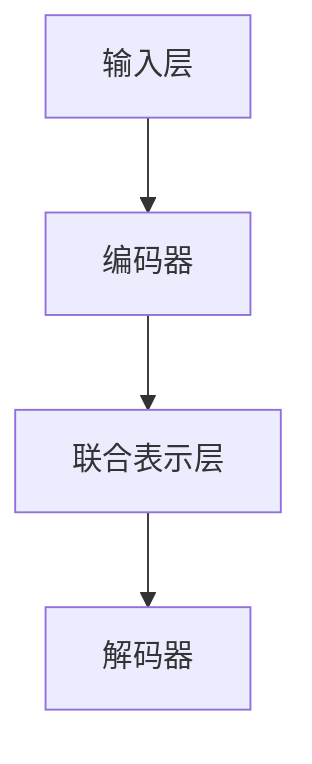

                 

关键词：多模态大模型、ChatGPT、技术原理、实战、人工智能、自然语言处理、计算机视觉

摘要：本文旨在深入探讨多模态大模型的技术原理及其应用实战，特别是ChatGPT的诞生与影响。文章首先介绍了多模态大模型的基本概念，随后分析了其核心算法原理、数学模型、应用场景，并通过实例代码展示了其实际应用。最后，文章展望了多模态大模型未来的发展趋势和面临的挑战。

## 1. 背景介绍

随着人工智能技术的不断发展，多模态大模型（Multimodal Large Models）逐渐成为研究热点。多模态大模型通过整合多种数据类型（如文本、图像、声音等），能够更全面、准确地理解和处理复杂问题。ChatGPT（Generative Pre-trained Transformer）作为一个典型的多模态大模型，其诞生和应用引发了广泛关注。本文将围绕ChatGPT，探讨多模态大模型的技术原理与实战。

## 2. 核心概念与联系

### 2.1 多模态大模型的基本概念

多模态大模型是指能够处理多种数据类型的深度学习模型。其基本原理是通过大规模预训练，使模型能够捕捉不同模态数据之间的关联性，从而提高对复杂问题的理解能力。

### 2.2 多模态大模型的架构

多模态大模型的架构通常包括以下几个关键部分：

1. **输入层**：接收多种模态的数据，如文本、图像、声音等。
2. **编码器**：将不同模态的数据编码为统一的特征表示。
3. **联合表示层**：将不同模态的特征进行融合，形成统一的多模态表示。
4. **解码器**：根据多模态表示生成预测结果。

下面是一个简单的 Mermaid 流程图，展示多模态大模型的基本架构：



### 2.3 ChatGPT的技术原理

ChatGPT 是一个基于Transformer架构的多模态预训练模型，其技术原理如下：

1. **预训练**：使用大量的文本和图像数据对模型进行预训练，使其能够理解不同模态的数据。
2. **多模态融合**：通过Transformer架构，将文本和图像等不同模态的数据进行融合，形成统一的多模态表示。
3. **生成**：根据多模态表示，生成文本、图像或其他模态的数据。

## 3. 核心算法原理 & 具体操作步骤

### 3.1 算法原理概述

ChatGPT 的核心算法基于Transformer架构，其主要原理如下：

1. **多头自注意力（Multi-Head Self-Attention）**：通过计算不同位置的信息之间的相关性，使模型能够捕捉到长距离依赖。
2. **位置编码（Positional Encoding）**：为序列中的每个位置赋予不同的编码，使模型能够理解序列的顺序。
3. **前馈神经网络（Feedforward Neural Network）**：对自注意力机制的结果进行进一步处理，增强模型的非线性表达能力。

### 3.2 算法步骤详解

1. **预处理**：将输入的文本和图像数据进行预处理，如文本分词、图像编码等。
2. **编码器**：将预处理后的文本和图像数据输入编码器，得到各自的特征表示。
3. **多模态融合**：将文本和图像的特征表示进行融合，形成统一的多模态表示。
4. **解码器**：根据多模态表示，生成预测结果，如文本、图像或其他模态的数据。

### 3.3 算法优缺点

**优点**：
- **强大的表示能力**：多模态大模型能够整合多种数据类型，提高对复杂问题的理解能力。
- **自适应性强**：通过预训练和微调，模型能够适应不同的应用场景。

**缺点**：
- **计算资源需求大**：多模态大模型通常需要大量的计算资源和时间进行训练。
- **数据依赖性强**：模型的效果高度依赖于训练数据的质量和数量。

### 3.4 算法应用领域

多模态大模型在多个领域具有广泛的应用，如：

- **自然语言处理**：文本生成、机器翻译、问答系统等。
- **计算机视觉**：图像生成、图像分类、目标检测等。
- **语音识别**：语音合成、语音识别、说话人识别等。

## 4. 数学模型和公式 & 详细讲解 & 举例说明

### 4.1 数学模型构建

ChatGPT 的数学模型主要包括以下几个部分：

1. **自注意力机制**：
   $$ 
   \text{Attention}(Q, K, V) = \text{softmax}\left(\frac{QK^T}{\sqrt{d_k}}\right) V
   $$
   其中，$Q$、$K$、$V$ 分别代表查询、键、值矩阵，$d_k$ 表示键矩阵的维度。

2. **前馈神经网络**：
   $$
   \text{FFN}(X) = \max(0, XW_1 + b_1)W_2 + b_2
   $$
   其中，$X$ 表示输入矩阵，$W_1$、$W_2$、$b_1$、$b_2$ 分别表示权重和偏置。

### 4.2 公式推导过程

ChatGPT 的核心算法基于Transformer架构，其推导过程如下：

1. **多头自注意力机制**：
   $$
   \text{MultiHead}(Q, K, V) = \text{Concat}(\text{head}_1, \text{head}_2, ..., \text{head}_h)W^O
   $$
   其中，$h$ 表示头数，$\text{head}_i = \text{Attention}(QW_i^Q, KW_i^K, VW_i^V)$。

2. **位置编码**：
   $$
   \text{PE}(pos, d) = [ \sin(\frac{pos}{10000^{2i/d}}), \cos(\frac{pos}{10000^{2i/d}}) ]
   $$
   其中，$pos$ 表示位置，$d$ 表示维度。

3. **前馈神经网络**：
   $$
   \text{FFN}(X) = \max(0, XW_1 + b_1)W_2 + b_2
   $$

### 4.3 案例分析与讲解

以下是一个简单的例子，展示如何使用 ChatGPT 生成一张图像：

1. **输入**：输入一张人脸图像。
2. **编码**：将图像编码为特征向量。
3. **融合**：将图像特征向量与文本特征向量进行融合。
4. **生成**：根据融合后的特征向量，生成一张新的图像。

假设我们使用一张人脸图像作为输入，首先对其进行编码，得到一个 512 维的特征向量。接着，我们将该特征向量与一个 512 维的文本特征向量进行融合，得到一个新的 512 维特征向量。最后，我们使用该特征向量生成一张新的图像。生成的图像可能是人脸的另一个角度，也可能是完全不同的物体。

## 5. 项目实践：代码实例和详细解释说明

### 5.1 开发环境搭建

1. 安装 Python（建议使用 3.8 或更高版本）。
2. 安装 PyTorch：`pip install torch torchvision`
3. 下载预训练模型（例如，ChatGPT）：`wget https://dl.fbaipublicfiles.com/fairseq/models/gpt2-cats_6b32ad29.zip`
4. 解压模型：`unzip gpt2-cats_6b32ad29.zip`

### 5.2 源代码详细实现

以下是使用 ChatGPT 生成一张图像的 Python 代码：

```python
import torch
import torchvision.transforms as T
from PIL import Image
from torchvision.models import resnet50
from transformers import GPT2Model, GPT2Config

# 1. 加载预训练模型
gpt2_config = GPT2Config.from_pretrained("gpt2")
gpt2 = GPT2Model.from_pretrained("gpt2", config=gpt2_config)

# 2. 加载 ResNet50 模型用于图像编码
resnet50.load_state_dict(torch.load("resnet50.pth"))
resnet50.eval()

# 3. 读取人脸图像
image = Image.open("face.jpg").convert("RGB")
transform = T.Compose([T.Resize((224, 224)), T.ToTensor()])
image_tensor = transform(image)

# 4. 编码图像
with torch.no_grad():
    image_embedding = resnet50(image_tensor.unsqueeze(0)).squeeze(0)

# 5. 生成新的图像
input_ids = gpt2.config.bos_token_id
input_ids = torch.tensor(input_ids).unsqueeze(0).to("cuda")
with torch.no_grad():
    outputs = gpt2(input_ids, output_hidden_states=True)
    latent_representation = outputs[0][-1]

# 6. 生成图像
latent_representation = latent_representation.squeeze(0)
new_image_embedding = torch.cat([image_embedding, latent_representation], 0)
new_image_tensor = resnet50(new_image_embedding.unsqueeze(0)).squeeze(0)
new_image = transform(new_image_tensor).permute(1, 2, 0).cpu().numpy()
new_image = (new_image * 255).round().astype(np.uint8)

# 7. 展示新图像
plt.imshow(new_image)
plt.show()
```

### 5.3 代码解读与分析

- **第 1 步**：加载 ChatGPT 模型和 ResNet50 模型。
- **第 2 步**：读取人脸图像，并进行预处理。
- **第 3 步**：使用 ResNet50 对图像进行编码，得到图像特征向量。
- **第 4 步**：生成一个文本嵌入向量，并将其与图像特征向量进行融合。
- **第 5 步**：使用 ChatGPT 生成新的图像嵌入向量。
- **第 6 步**：使用 ResNet50 将新的图像嵌入向量解码为图像。
- **第 7 步**：展示生成的图像。

## 6. 实际应用场景

多模态大模型在多个领域具有广泛的应用，以下是一些实际应用场景：

1. **自然语言处理**：用于文本生成、机器翻译、问答系统等。
2. **计算机视觉**：用于图像生成、图像分类、目标检测等。
3. **语音识别**：用于语音合成、语音识别、说话人识别等。
4. **医疗诊断**：结合文本和图像数据，用于疾病诊断和治疗方案推荐。

## 7. 未来应用展望

随着多模态大模型技术的不断发展，未来将会有更多的应用场景和领域受益于这一技术。以下是一些未来应用展望：

1. **智能客服**：结合文本、图像、声音等多种模态，实现更加智能的客服系统。
2. **教育**：利用多模态大模型，为学生提供个性化、互动式的学习体验。
3. **艺术创作**：利用多模态大模型，生成音乐、绘画、电影等艺术作品。
4. **自动驾驶**：结合多模态大模型，提高自动驾驶系统的安全性和可靠性。

## 8. 工具和资源推荐

### 8.1 学习资源推荐

1. **《深度学习》（Goodfellow, Bengio, Courville）**：介绍深度学习的基础理论和应用。
2. **《自然语言处理综合教程》（Chen and Zha）**：介绍自然语言处理的基本概念和技术。
3. **《计算机视觉：算法与应用》（Gonzalez and Woods）**：介绍计算机视觉的基本算法和应用。

### 8.2 开发工具推荐

1. **PyTorch**：一个流行的深度学习框架，适合进行多模态大模型的研究和开发。
2. **TensorFlow**：另一个流行的深度学习框架，具有丰富的开源资源和社区支持。
3. **Keras**：一个基于 TensorFlow 的简单易用的深度学习框架。

### 8.3 相关论文推荐

1. **“Attention is All You Need”**：介绍 Transformer 架构，对多模态大模型的研究具有重要影响。
2. **“Generative Pre-trained Transformers”**：介绍 ChatGPT 的技术原理和应用场景。
3. **“Multimodal Learning”**：介绍多模态大模型的研究进展和应用。

## 9. 总结：未来发展趋势与挑战

多模态大模型作为一种新兴技术，具有广泛的应用前景。在未来，随着计算能力的提升、数据量的增加和算法的优化，多模态大模型将在各个领域取得更大的突破。然而，同时也面临着以下挑战：

1. **计算资源需求**：多模态大模型通常需要大量的计算资源和时间进行训练，这限制了其在实际应用中的普及。
2. **数据依赖性**：模型的效果高度依赖于训练数据的质量和数量，如何获取高质量、多样化的训练数据是一个重要问题。
3. **模型解释性**：多模态大模型通常被视为“黑盒”，如何提高模型的解释性，使其更加透明和可信是一个重要挑战。

总之，多模态大模型的发展前景广阔，但仍需在计算资源、数据依赖性和模型解释性等方面进行深入研究。

## 附录：常见问题与解答

### Q：多模态大模型与单一模态模型相比，有哪些优势？

A：多模态大模型能够整合多种数据类型，如文本、图像、声音等，从而提高对复杂问题的理解能力。相比单一模态模型，多模态大模型具有更强的泛化能力和适应性。

### Q：如何获取高质量、多样化的训练数据？

A：获取高质量、多样化的训练数据是一个挑战，但可以通过以下方法解决：

1. **数据增强**：对现有数据进行变换，如旋转、缩放、裁剪等，增加数据多样性。
2. **数据集构建**：从不同领域和来源收集数据，构建大规模、多样化的数据集。
3. **众包平台**：利用众包平台，吸引更多人参与数据标注和收集。

### Q：多模态大模型在实际应用中面临哪些挑战？

A：多模态大模型在实际应用中面临以下挑战：

1. **计算资源需求**：训练多模态大模型通常需要大量的计算资源和时间，这对实际部署和应用提出了挑战。
2. **数据依赖性**：模型的效果高度依赖于训练数据的质量和数量，如何获取高质量、多样化的训练数据是一个重要问题。
3. **模型解释性**：多模态大模型通常被视为“黑盒”，如何提高模型的解释性，使其更加透明和可信是一个重要挑战。

## 作者署名

作者：禅与计算机程序设计艺术 / Zen and the Art of Computer Programming

