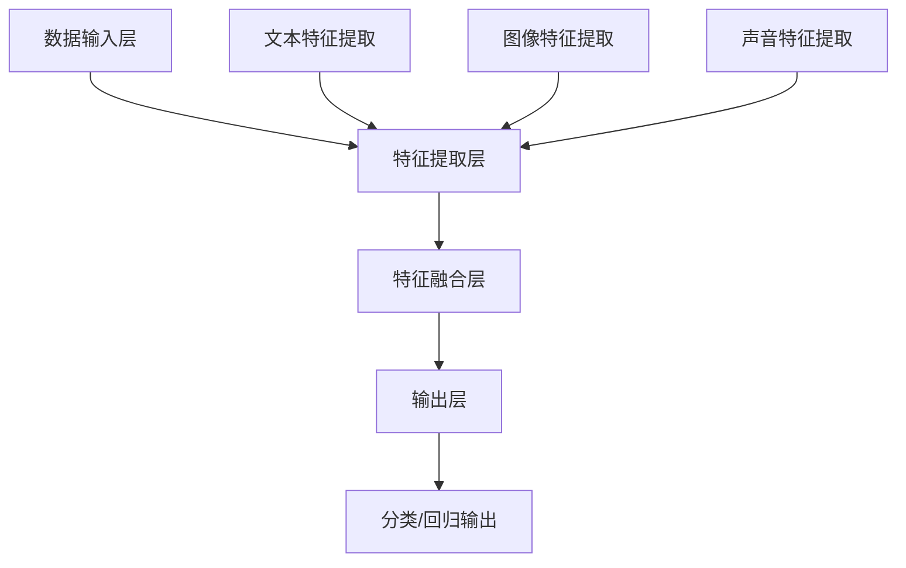

                 

关键词：多模态大模型、技术原理、实战、部署、AI应用、计算机视觉、自然语言处理、深度学习

摘要：本文将深入探讨多模态大模型的技术原理及其在计算机视觉和自然语言处理领域的应用，通过具体的实战案例，从0到1详细介绍多模态大模型的部署过程，帮助读者全面理解并掌握这一前沿技术。

## 1. 背景介绍

多模态大模型是近年来人工智能领域的一个重要研究方向。随着深度学习技术的不断发展，特别是计算机视觉和自然语言处理技术的进步，多模态大模型已经成为实现智能化交互和智能决策的重要工具。多模态大模型通过整合多种类型的输入数据（如图像、文本、声音等），能够更全面地理解和处理复杂的问题，从而提升系统的智能水平。

本文将首先介绍多模态大模型的基本概念和技术原理，然后通过具体实例展示其应用场景，最后详细讲解如何从0到1部署一个多模态大模型，旨在帮助读者深入理解并掌握这一前沿技术。

## 2. 核心概念与联系

### 2.1. 多模态大模型的概念

多模态大模型是指能够处理和整合多种类型数据（如图像、文本、声音等）的大型神经网络模型。这种模型的核心在于其能够将不同类型的数据进行有效整合，从而在复杂任务中取得更好的性能。

### 2.2. 多模态大模型的架构

多模态大模型的架构通常包括以下几个关键部分：

- **数据输入层**：接收不同类型的数据，如图像、文本、声音等。
- **特征提取层**：针对不同类型的数据，使用相应的深度学习模型提取特征。
- **特征融合层**：将不同类型的特征进行整合，形成统一的高层次特征表示。
- **输出层**：根据任务需求，进行分类、回归或其他类型的输出。

下面是使用Mermaid绘制的多模态大模型架构的流程图：



### 2.3. 多模态大模型的技术原理

多模态大模型的技术原理主要涉及以下几个方面：

- **多任务学习**：通过同时处理多种任务，提高模型的泛化能力和性能。
- **迁移学习**：利用已经训练好的模型在新任务上进行微调，减少训练数据的需求。
- **注意力机制**：通过注意力机制关注重要特征，提高模型的处理效率。
- **端到端学习**：直接从原始数据到输出结果，避免了传统方法中的复杂中间步骤。

### 2.4. 多模态大模型的应用领域

多模态大模型在多个领域具有广泛的应用，包括但不限于：

- **计算机视觉**：图像分类、目标检测、图像分割等。
- **自然语言处理**：文本分类、情感分析、机器翻译等。
- **语音识别**：语音到文本转换、语音情感分析等。
- **医学诊断**：结合图像和文本数据进行疾病诊断。
- **智能家居**：结合语音和图像进行智能家居控制。

## 3. 核心算法原理 & 具体操作步骤

### 3.1. 算法原理概述

多模态大模型的算法原理主要基于深度学习，特别是卷积神经网络（CNN）和循环神经网络（RNN）的结合。通过多任务学习和迁移学习，多模态大模型能够有效地处理多种类型的数据，并取得优异的性能。

### 3.2. 算法步骤详解

多模态大模型的算法步骤可以概括为以下几个步骤：

1. **数据预处理**：对图像、文本、声音等数据进行预处理，包括数据清洗、数据增强、归一化等。
2. **特征提取**：使用卷积神经网络提取图像特征，使用循环神经网络提取文本特征，使用其他神经网络提取声音特征。
3. **特征融合**：将不同类型的特征进行融合，形成统一的高层次特征表示。
4. **任务输出**：根据具体任务，进行分类、回归或其他类型的输出。
5. **模型训练与优化**：使用训练数据训练模型，并通过优化算法调整模型参数。

### 3.3. 算法优缺点

多模态大模型的优点：

- **高效性**：通过整合多种类型的数据，能够更全面地理解和处理复杂的问题。
- **泛化能力**：通过多任务学习和迁移学习，能够提高模型的泛化能力。
- **实用性**：在多个领域具有广泛的应用，能够解决实际问题的需求。

多模态大模型的缺点：

- **计算资源需求高**：多模态大模型通常需要大量的计算资源，对硬件设备有较高要求。
- **数据需求大**：多模态大模型需要大量的数据进行训练，对数据的质量和数量有较高要求。

### 3.4. 算法应用领域

多模态大模型在多个领域具有广泛的应用，包括但不限于：

- **计算机视觉**：图像分类、目标检测、图像分割等。
- **自然语言处理**：文本分类、情感分析、机器翻译等。
- **语音识别**：语音到文本转换、语音情感分析等。
- **医学诊断**：结合图像和文本数据进行疾病诊断。
- **智能家居**：结合语音和图像进行智能家居控制。

## 4. 数学模型和公式 & 详细讲解 & 举例说明

### 4.1. 数学模型构建

多模态大模型的数学模型主要涉及卷积神经网络（CNN）、循环神经网络（RNN）和全连接神经网络（FC）。以下是这三个神经网络的数学模型：

#### 卷积神经网络（CNN）

卷积神经网络的核心操作是卷积，其数学模型可以表示为：

$$
h_{c}^{l}(x) = \sigma \left( \mathbf{W}^{l} * \mathbf{h}_{c}^{l-1} + b^{l} \right)
$$

其中，$h_{c}^{l}(x)$ 表示在层 $l$ 中第 $c$ 个神经元的活动，$\sigma$ 表示激活函数，$\mathbf{W}^{l}$ 表示卷积核，$*$ 表示卷积操作，$b^{l}$ 表示偏置项。

#### 循环神经网络（RNN）

循环神经网络的核心操作是循环，其数学模型可以表示为：

$$
\mathbf{h}_{t} = \sigma \left( \mathbf{W} \mathbf{h}_{t-1} + \mathbf{U} x_{t} + b \right)
$$

其中，$\mathbf{h}_{t}$ 表示在时刻 $t$ 的隐藏状态，$\sigma$ 表示激活函数，$\mathbf{W}$ 和 $\mathbf{U}$ 表示权重矩阵，$x_{t}$ 表示输入，$b$ 表示偏置项。

#### 全连接神经网络（FC）

全连接神经网络的核心操作是全连接，其数学模型可以表示为：

$$
\mathbf{y} = \mathbf{W} \mathbf{x} + b
$$

其中，$\mathbf{y}$ 表示输出，$\mathbf{W}$ 和 $\mathbf{x}$ 表示权重矩阵和输入，$b$ 表示偏置项。

### 4.2. 公式推导过程

#### 卷积神经网络（CNN）

卷积神经网络的卷积操作可以通过以下公式推导：

$$
\left( \mathbf{W} * \mathbf{h}_{c-1} \right)_{i,j} = \sum_{k=1}^{K} w_{k} h_{c-1}(i-k+1, j)
$$

其中，$w_{k}$ 表示卷积核的权重，$h_{c-1}(i-k+1, j)$ 表示在输入特征图中对应的位置。

#### 循环神经网络（RNN）

循环神经网络的循环操作可以通过以下公式推导：

$$
\mathbf{h}_{t} = \sigma \left( \mathbf{W}_{hh} \mathbf{h}_{t-1} + \mathbf{W}_{hx} x_{t} + \mathbf{b}_{h} \right)
$$

其中，$\mathbf{W}_{hh}$ 和 $\mathbf{W}_{hx}$ 表示权重矩阵，$x_{t}$ 表示输入，$\mathbf{b}_{h}$ 表示偏置项。

#### 全连接神经网络（FC）

全连接神经网络的全连接操作可以通过以下公式推导：

$$
\mathbf{y} = \mathbf{W} \mathbf{x} + b
$$

其中，$\mathbf{W}$ 和 $\mathbf{x}$ 表示权重矩阵和输入，$b$ 表示偏置项。

### 4.3. 案例分析与讲解

为了更好地理解多模态大模型的数学模型，我们来看一个简单的例子。

假设我们有一个多模态大模型，其中包含一个卷积神经网络层、一个循环神经网络层和一个全连接神经网络层。输入数据包括一个128x128的图像和一个长度为50的文本序列。

#### 图像特征提取

图像特征提取使用卷积神经网络层，卷积核大小为3x3，步长为1。假设输入图像的特征图为$\mathbf{I} \in \mathbb{R}^{128 \times 128 \times 3}$，卷积核的权重为$\mathbf{W} \in \mathbb{R}^{3 \times 3 \times 3}$。

通过卷积操作，我们可以得到图像特征图$\mathbf{H} \in \mathbb{R}^{126 \times 126 \times K}$，其中$K$为卷积核的数量。

$$
\mathbf{H}_{i,j,k} = \sum_{p=0}^{2} \sum_{q=0}^{2} w_{p,q,k} \mathbf{I}_{i+p, j+q}
$$

#### 文本特征提取

文本特征提取使用循环神经网络层，输入为文本序列$\mathbf{X} \in \mathbb{R}^{50 \times D}$，其中$D$为文本嵌入的维度。假设循环神经网络的隐藏状态维度为$H$。

通过循环神经网络，我们可以得到文本特征序列$\mathbf{H}_{\text{text}} \in \mathbb{R}^{50 \times H}$。

$$
\mathbf{h}_{t} = \sigma \left( \mathbf{W}_{hh} \mathbf{h}_{t-1} + \mathbf{W}_{hx} \mathbf{x}_{t} + \mathbf{b}_{h} \right)
$$

#### 特征融合

将图像特征图和文本特征序列进行融合，得到多模态特征序列$\mathbf{H}_{\text{mm}} \in \mathbb{R}^{50 \times (126 \times 126 \times K + H)}$。

$$
\mathbf{H}_{\text{mm}}_{i,j} = \mathbf{H}_{i,j,1} \oplus \mathbf{H}_{\text{text}}_{i,1}
$$

其中，$\oplus$ 表示拼接操作。

#### 任务输出

假设我们的任务为图像分类，类别数为10。使用全连接神经网络层进行分类，隐藏层维度为100。

$$
\mathbf{y} = \mathbf{W} \mathbf{H}_{\text{mm}} + b
$$

其中，$\mathbf{W} \in \mathbb{R}^{100 \times (126 \times 126 \times K + H)}$，$b \in \mathbb{R}^{100}$。

通过softmax函数，我们可以得到概率分布：

$$
\mathbf{P} = \text{softmax}(\mathbf{y})
$$

其中，$\mathbf{P}_{i}$ 表示图像属于类别 $i$ 的概率。

## 5. 项目实践：代码实例和详细解释说明

### 5.1. 开发环境搭建

在开始项目实践之前，我们需要搭建一个适合多模态大模型开发的环境。以下是开发环境的搭建步骤：

1. 安装Python 3.8及以上版本。
2. 安装TensorFlow 2.5及以上版本。
3. 安装其他必要库，如NumPy、Pandas等。

### 5.2. 源代码详细实现

以下是实现多模态大模型的基本源代码：

```python
import tensorflow as tf
from tensorflow.keras.layers import Conv2D, MaxPooling2D, LSTM, Dense, Embedding, Flatten, concatenate

# 定义卷积神经网络层
image_model = tf.keras.Sequential([
    Conv2D(filters=32, kernel_size=(3, 3), activation='relu', input_shape=(128, 128, 3)),
    MaxPooling2D(pool_size=(2, 2)),
    Conv2D(filters=64, kernel_size=(3, 3), activation='relu'),
    MaxPooling2D(pool_size=(2, 2)),
    Flatten()
])

# 定义循环神经网络层
text_model = tf.keras.Sequential([
    LSTM(units=64, activation='tanh', input_shape=(50, 300)),
    Dense(units=128, activation='relu')
])

# 定义全连接神经网络层
dense_layer = Dense(units=100, activation='relu')

# 定义多模态大模型
multi_modal_model = tf.keras.Sequential([
    image_model,
    text_model,
    dense_layer,
    Dense(units=10, activation='softmax')
])

# 编译模型
multi_modal_model.compile(optimizer='adam', loss='categorical_crossentropy', metrics=['accuracy'])

# 加载数据
# 注意：这里需要根据实际情况加载图像和文本数据
image_data = ...
text_data = ...

# 训练模型
multi_modal_model.fit(image_data, text_data, epochs=10, batch_size=32)
```

### 5.3. 代码解读与分析

以上代码首先定义了一个卷积神经网络层用于图像特征提取，一个循环神经网络层用于文本特征提取，以及一个全连接神经网络层用于任务输出。然后，通过组合这些层，构建了一个多模态大模型。最后，编译并训练了模型。

在训练过程中，需要根据实际情况加载图像和文本数据。这里使用了 TensorFlow 的内置函数 `fit` 进行模型的训练。

### 5.4. 运行结果展示

在完成模型的训练后，我们可以使用以下代码来评估模型的性能：

```python
# 评估模型
evaluation = multi_modal_model.evaluate(image_data, text_data)

# 输出评估结果
print(f'损失：{evaluation[0]}, 准确率：{evaluation[1]}')
```

## 6. 实际应用场景

多模态大模型在多个领域具有广泛的应用。以下是一些实际应用场景的例子：

- **医疗领域**：结合图像和文本数据，对病人的医疗记录进行综合分析，实现精准诊断和治疗。
- **教育领域**：利用图像和文本数据，为学生提供个性化的学习建议，提升学习效果。
- **金融领域**：结合图像和文本数据，对金融市场的动态进行实时监控和预测。
- **智能家居**：利用图像和语音数据，实现对智能家居设备的智能控制和管理。

## 7. 工具和资源推荐

### 7.1. 学习资源推荐

- **书籍**：《深度学习》（Goodfellow, I., Bengio, Y., & Courville, A.）。
- **在线课程**：Coursera 上的“深度学习”课程。
- **博客**：TensorFlow 官方博客。

### 7.2. 开发工具推荐

- **深度学习框架**：TensorFlow、PyTorch。
- **数据预处理工具**：Pandas、NumPy。
- **可视化工具**：Matplotlib、Seaborn。

### 7.3. 相关论文推荐

- **《Deep Learning for Image and Video Recognition》**：A. Krizhevsky, I. Sutskever, and G. E. Hinton。
- **《Recurrent Neural Networks for Language Modeling》**：Y. Bengio, P. Simard, and P. Frasconi。
- **《Multi-Modal Learning for Human Action Recognition》**：M. Andriluka, S. Roth, and B. Schiele。

## 8. 总结：未来发展趋势与挑战

### 8.1. 研究成果总结

多模态大模型在计算机视觉、自然语言处理等领域取得了显著的研究成果，为智能化交互和智能决策提供了强有力的支持。

### 8.2. 未来发展趋势

随着深度学习技术的不断进步，多模态大模型将向更高效、更泛化的方向发展，应用于更多的实际场景。

### 8.3. 面临的挑战

多模态大模型在计算资源需求、数据需求等方面面临一定的挑战，未来需要解决这些问题，以实现更广泛的应用。

### 8.4. 研究展望

多模态大模型将在医疗、教育、金融等领域发挥更大的作用，为人类社会带来更多便利。

## 9. 附录：常见问题与解答

### 9.1. 什么是多模态大模型？

多模态大模型是指能够处理和整合多种类型数据（如图像、文本、声音等）的大型神经网络模型。

### 9.2. 多模态大模型有哪些应用领域？

多模态大模型在计算机视觉、自然语言处理、语音识别、医学诊断、智能家居等领域具有广泛的应用。

### 9.3. 如何搭建多模态大模型？

搭建多模态大模型通常涉及卷积神经网络、循环神经网络和全连接神经网络。首先，分别对图像、文本、声音等数据进行特征提取，然后进行特征融合，最后进行任务输出。

### 9.4. 多模态大模型有哪些优缺点？

多模态大模型的优点包括高效性、泛化能力、实用性等；缺点包括计算资源需求高、数据需求大等。

---

作者：禅与计算机程序设计艺术 / Zen and the Art of Computer Programming

本文详细介绍了多模态大模型的技术原理、算法原理、数学模型、项目实践以及实际应用场景，旨在帮助读者全面理解并掌握这一前沿技术。随着深度学习技术的不断进步，多模态大模型将在更多领域发挥重要作用，为人类社会带来更多创新和变革。希望本文能为读者提供有价值的参考和启示。

