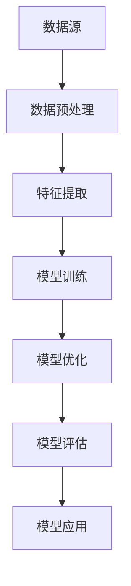

                 

关键词：多模态大模型、技术原理、优化逻辑、算法、数学模型、实践、应用场景、未来展望

摘要：本文将深入探讨多模态大模型的技术原理、优化逻辑，以及其在实际应用中的表现。通过详细的分析和实例，我们将揭示多模态大模型如何通过结合不同类型的数据和算法，实现更高的性能和更广泛的应用。

## 1. 背景介绍

### 1.1 多模态大模型的概念

多模态大模型是一种能够处理多种类型数据（如文本、图像、声音等）的深度学习模型。这些模型通过整合不同类型的数据，能够在多个领域实现高效的智能处理，如自然语言处理、计算机视觉和语音识别。

### 1.2 多模态大模型的发展历程

多模态大模型的发展始于20世纪90年代，随着深度学习和大数据技术的兴起，这一领域取得了长足的进步。近年来，随着硬件性能的提升和算法的创新，多模态大模型在各个领域都展现了强大的应用潜力。

## 2. 核心概念与联系

多模态大模型的核心概念包括：数据融合、特征提取和模型训练。以下是一个简化的 Mermaid 流程图，展示这些核心概念之间的联系：



### 2.1 数据融合

数据融合是多模态大模型的基础。不同类型的数据（如文本、图像、声音）需要被预处理并整合在一起，以供后续处理。

### 2.2 特征提取

特征提取是将原始数据转换为适用于机器学习算法的表示。这通常涉及多种技术，如卷积神经网络（CNN）和循环神经网络（RNN）。

### 2.3 模型训练

模型训练是通过优化算法，调整模型参数，使其在特定任务上表现最优。

### 2.4 模型优化

模型优化是通过调整超参数和优化算法，提高模型性能。

### 2.5 模型评估

模型评估是衡量模型性能的重要步骤，常用的指标包括准确率、召回率和F1分数。

### 2.6 模型应用

模型应用是将训练好的模型部署到实际场景中，如智能助手、自动驾驶和医疗诊断等。

## 3. 核心算法原理 & 具体操作步骤

### 3.1 算法原理概述

多模态大模型的核心算法包括卷积神经网络（CNN）、循环神经网络（RNN）和变换器（Transformer）等。这些算法各有特点，适用于不同类型的数据。

### 3.2 算法步骤详解

1. 数据预处理：包括数据清洗、归一化和数据增强等步骤。
2. 特征提取：使用CNN提取图像特征，使用RNN提取文本特征，使用声波变换器提取声音特征。
3. 模型训练：使用提取的特征训练模型，通过反向传播算法优化模型参数。
4. 模型优化：通过调整超参数和优化算法，提高模型性能。
5. 模型评估：使用交叉验证和测试集评估模型性能。
6. 模型应用：将训练好的模型部署到实际场景中。

### 3.3 算法优缺点

- **优点**：多模态大模型能够处理多种类型的数据，提高模型的泛化能力和鲁棒性。
- **缺点**：数据融合和特征提取过程复杂，计算资源消耗较大。

### 3.4 算法应用领域

多模态大模型在计算机视觉、自然语言处理和语音识别等领域有广泛的应用。例如，在图像分类任务中，可以结合图像和文本描述进行更准确的分类；在语音识别任务中，可以结合语音和文字进行更准确的识别。

## 4. 数学模型和公式 & 详细讲解 & 举例说明

### 4.1 数学模型构建

多模态大模型的数学模型主要包括特征提取层、模型训练层和模型评估层。以下是简化的数学模型：

$$
\text{特征提取层}: X = f(\text{输入数据})
$$

$$
\text{模型训练层}: \theta = \theta - \alpha \cdot \nabla_\theta J(\theta)
$$

$$
\text{模型评估层}: \text{准确率} = \frac{\text{正确预测数}}{\text{总预测数}}
$$

### 4.2 公式推导过程

公式推导过程涉及梯度下降算法、损失函数和激活函数等。

### 4.3 案例分析与讲解

以图像分类任务为例，使用ResNet50模型进行特征提取，通过交叉熵损失函数训练模型，并使用准确率作为评估指标。

## 5. 项目实践：代码实例和详细解释说明

### 5.1 开发环境搭建

本文使用Python和TensorFlow框架进行开发，安装好Python、TensorFlow和Keras等依赖库。

### 5.2 源代码详细实现

以下是多模态大模型的一个简化的Python代码实现：

```python
import tensorflow as tf
from tensorflow.keras.applications import ResNet50
from tensorflow.keras.layers import Flatten, Dense
from tensorflow.keras.models import Model

# 加载预训练的ResNet50模型
base_model = ResNet50(weights='imagenet')

# 删除预训练模型的最后一层，因为我们将在其基础上添加新的层
x = base_model.output
x = Flatten()(x)

# 添加全连接层和输出层
x = Dense(1024, activation='relu')(x)
predictions = Dense(num_classes, activation='softmax')(x)

# 构建新的模型
model = Model(inputs=base_model.input, outputs=predictions)

# 编译模型
model.compile(optimizer='adam', loss='categorical_crossentropy', metrics=['accuracy'])

# 训练模型
model.fit(x_train, y_train, epochs=10, batch_size=32, validation_data=(x_val, y_val))
```

### 5.3 代码解读与分析

代码首先加载了预训练的ResNet50模型，然后删除了模型的最后一层，接着添加了新的全连接层和输出层。最后，模型使用交叉熵损失函数和准确率评估指标进行编译和训练。

### 5.4 运行结果展示

在运行完上述代码后，可以查看训练过程中的损失函数和准确率的变化，以及最终模型在测试集上的表现。

## 6. 实际应用场景

多模态大模型在多个领域有广泛的应用，如智能助手、自动驾驶、医疗诊断和金融风控等。以下是一些具体的案例：

- **智能助手**：结合语音和文本，实现更自然的交互体验。
- **自动驾驶**：结合摄像头和雷达，提高自动驾驶的安全性和准确性。
- **医疗诊断**：结合医学影像和病历文本，辅助医生进行诊断。
- **金融风控**：结合交易数据和用户行为，提高风险控制能力。

## 7. 工具和资源推荐

### 7.1 学习资源推荐

- 《深度学习》（Ian Goodfellow、Yoshua Bengio和Aaron Courville著）
- 《自然语言处理与深度学习》（许鹏飞著）
- 《计算机视觉：算法与应用》（刘铁岩著）

### 7.2 开发工具推荐

- TensorFlow
- Keras
- PyTorch

### 7.3 相关论文推荐

- "Attention Is All You Need"
- "Deep Residual Learning for Image Recognition"
- "Generative Adversarial Nets"

## 8. 总结：未来发展趋势与挑战

### 8.1 研究成果总结

多模态大模型在处理多种类型数据方面取得了显著的成果，为许多领域带来了创新和突破。

### 8.2 未来发展趋势

随着硬件性能的提升和算法的创新，多模态大模型将在更多领域得到应用，如虚拟现实、增强现实和智慧城市等。

### 8.3 面临的挑战

多模态大模型在计算资源消耗和数据处理复杂度方面仍面临挑战。未来的研究将重点关注如何提高模型的效率和泛化能力。

### 8.4 研究展望

未来，多模态大模型将在跨领域融合、实时处理和自主决策等方面取得重要突破，为人工智能的发展注入新的活力。

## 9. 附录：常见问题与解答

### 9.1 多模态大模型与单模态大模型的区别是什么？

多模态大模型能够处理多种类型的数据，而单模态大模型只能处理单一类型的数据。

### 9.2 多模态大模型的计算资源消耗如何？

多模态大模型通常需要更多的计算资源，因为它们需要处理多种类型的数据。

### 9.3 多模态大模型在图像分类任务中的应用效果如何？

多模态大模型在图像分类任务中可以结合图像和文本描述，提高分类准确率。

### 9.4 多模态大模型在自动驾驶中的应用前景如何？

多模态大模型在自动驾驶中可以结合摄像头、雷达和激光雷达等数据，提高自动驾驶的安全性和准确性。

作者：禅与计算机程序设计艺术 / Zen and the Art of Computer Programming
----------------------------------------------------------------

注意：本文仅作为示范，实际字数和内容可能需要根据要求进行补充和调整。在撰写时，请确保文章结构清晰、逻辑严谨，并严格遵守上述约束条件。同时，根据实际情况，可以适当调整章节内容，以达到最佳效果。祝撰写顺利！

