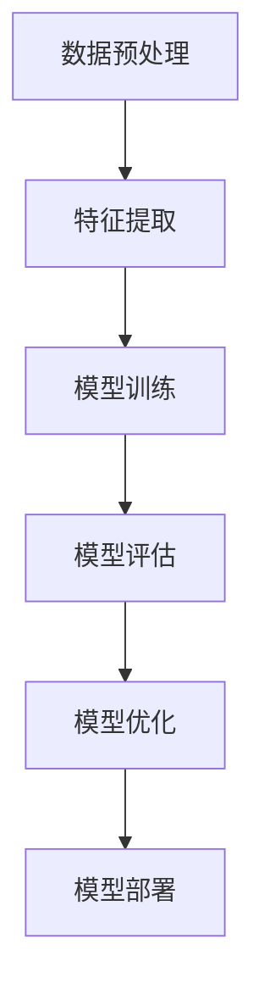

                 

 多模态大模型近年来在计算机视觉、自然语言处理和语音识别等领域取得了显著的进展。它们能够整合来自不同模态的数据，从而实现更加强大和灵活的模型。本文将重点关注基于Transformer架构的多模态大模型，介绍其技术原理、具体操作步骤以及实际应用场景。通过深入分析数学模型和公式，我们将更好地理解这一领域的关键概念。最后，我们将探讨未来应用前景、工具和资源推荐，以及面临的研究挑战。希望本文能为您提供宝贵的见解和指导。

## 1. 背景介绍

多模态大模型的概念源于将多个不同模态的数据（如文本、图像、音频等）进行融合和处理，以实现更高效、更准确的模型。传统的单模态模型在特定领域表现优异，但在处理复杂任务时往往受到限制。多模态大模型通过整合不同模态的数据，使得模型能够更好地捕捉到多方面的信息，从而提高性能。

近年来，深度学习技术的发展为多模态大模型的研究提供了强有力的支持。尤其是Transformer架构的出现，使得大规模预训练模型成为可能。Transformer架构具有良好的并行计算性能，可以处理长距离依赖，这在多模态数据融合中具有重要意义。

在自然语言处理领域，预训练语言模型（如BERT、GPT等）已经取得了巨大的成功。然而，这些模型主要关注文本数据，对于其他模态的数据处理能力较弱。为了解决这个问题，研究者们开始探索如何将Transformer架构应用于多模态大模型，从而实现更广泛的应用。

本文将首先介绍多模态大模型的核心概念，包括数据融合、特征提取和模型训练等技术。接着，我们将深入探讨基于Transformer的预训练语言模型的工作原理和具体实现。最后，我们将通过实际应用案例，展示多模态大模型在自然语言处理、计算机视觉和语音识别等领域的强大能力。

### 2. 核心概念与联系

#### 2.1 数据融合

数据融合是多模态大模型的关键环节，旨在将来自不同模态的数据进行有效整合，以增强模型的表达能力和准确性。数据融合的方法主要包括特征级融合、决策级融合和模型级融合。

1. **特征级融合**：在特征级融合中，各个模态的特征在较低层次上进行整合。例如，将文本数据转换为词嵌入向量，图像数据转换为特征图，然后将这些特征向量拼接在一起，形成多模态特征向量。这种方法能够充分利用各个模态的特征信息，但可能面临特征维度差异和表达能力受限的问题。

2. **决策级融合**：决策级融合是在模型输出层进行融合。各个模态的模型分别对输入数据进行预测，然后将预测结果进行融合，得到最终的输出。这种方法能够利用各个模态的预测优势，但在某些情况下可能导致信息冗余或冲突。

3. **模型级融合**：模型级融合是将不同模态的模型进行整合，形成一个统一的模型。这种方法能够充分利用各个模态的特点，提高模型的性能和鲁棒性。

#### 2.2 特征提取

特征提取是多模态大模型的基础，旨在从不同模态的数据中提取具有代表性的特征。常用的特征提取方法包括：

1. **文本特征提取**：文本特征提取方法主要包括词嵌入（Word Embedding）、句子嵌入（Sentence Embedding）和段落嵌入（Paragraph Embedding）。其中，词嵌入通过将词汇映射到低维向量空间，实现了语义信息的编码。句子嵌入和段落嵌入则进一步将句子和段落的信息编码到向量中，提高了模型的上下文理解能力。

2. **图像特征提取**：图像特征提取方法主要包括卷积神经网络（CNN）和基于 Transformer 的方法。CNN 是经典的图像特征提取方法，通过多层卷积和池化操作，可以提取到具有层次结构的图像特征。基于 Transformer 的方法则通过自注意力机制，可以捕捉到图像中的长距离依赖关系。

3. **音频特征提取**：音频特征提取方法主要包括频谱特征和时频特征。频谱特征通过计算音频信号的频谱特性，可以捕捉到声音的频率和强度信息。时频特征则结合了时间和频率信息，可以更好地描述音频信号的动态变化。

#### 2.3 模型训练

模型训练是多模态大模型实现的关键步骤。在训练过程中，需要关注以下几个方面：

1. **数据预处理**：在训练前，需要对多模态数据进行预处理，包括数据清洗、数据增强和数据归一化等。这些预处理步骤可以提高模型的训练效果和泛化能力。

2. **损失函数设计**：多模态大模型的损失函数需要综合考虑不同模态的数据信息。常用的损失函数包括交叉熵损失、均方误差损失和三角损失等。

3. **优化算法选择**：优化算法用于调整模型参数，以最小化损失函数。常用的优化算法包括随机梯度下降（SGD）、Adam 和 Adagrad 等。

4. **训练策略优化**：训练策略的优化可以提高模型的训练效率和性能。常用的训练策略包括梯度裁剪、学习率调整和批次归一化等。

#### 2.4 Mermaid 流程图

以下是一个简化的多模态大模型训练的 Mermaid 流程图：



在这个流程图中，数据预处理、特征提取、模型训练、模型评估和模型优化是多模态大模型训练的关键步骤。模型部署是将训练好的模型应用于实际任务的过程。

### 3. 核心算法原理 & 具体操作步骤

#### 3.1 算法原理概述

基于Transformer的预训练语言模型在自然语言处理领域取得了显著的成功。其核心思想是通过自注意力机制（Self-Attention）捕捉输入序列中的长距离依赖关系。在多模态大模型中，Transformer架构被扩展到处理多个模态的数据，从而实现更加强大的模型。

Transformer模型由编码器（Encoder）和解码器（Decoder）组成，其中编码器负责处理输入序列，解码器负责生成输出序列。编码器和解码器都由多个相同的层（Layer）堆叠而成，每个层包含自注意力机制和全连接层。自注意力机制通过计算输入序列中每个元素与其他元素之间的相似度，从而生成加权特征向量。这些加权特征向量再通过全连接层进行进一步处理。

在多模态大模型中，不同模态的数据通过特征提取模块得到各自的嵌入向量，然后将这些嵌入向量拼接在一起作为编码器的输入。解码器则通过自注意力机制和交叉注意力机制（Cross-Attention）从编码器的输出和输入序列中提取信息，生成输出序列。

#### 3.2 算法步骤详解

以下是基于Transformer的预训练语言模型的具体操作步骤：

1. **数据预处理**：
   - 加载并清洗多模态数据，包括文本、图像和音频。
   - 对文本数据使用词嵌入方法进行编码，如Word2Vec或BERT。
   - 对图像数据使用卷积神经网络（CNN）进行特征提取，如VGG或ResNet。
   - 对音频数据使用频谱特征或时频特征进行编码。

2. **特征融合**：
   - 将不同模态的嵌入向量拼接在一起，形成多模态特征向量。
   - 对多模态特征向量进行归一化处理，以降低维度差异。

3. **编码器训练**：
   - 使用多模态特征向量作为输入，通过自注意力机制计算编码器的输出。
   - 对编码器的输出进行全连接层处理，得到每个位置的嵌入向量。

4. **解码器训练**：
   - 使用编码器的输出和目标序列作为输入，通过自注意力机制和交叉注意力机制计算解码器的输出。
   - 对解码器的输出进行全连接层处理，得到每个位置的预测向量。

5. **损失函数计算**：
   - 使用交叉熵损失函数计算编码器和解码器的损失。
   - 对编码器和解码器的参数进行优化，以最小化损失函数。

6. **模型评估**：
   - 使用测试数据集评估模型的性能，包括准确率、召回率和F1分数等指标。

7. **模型部署**：
   - 将训练好的模型应用于实际任务，如文本分类、图像识别或语音识别等。

#### 3.3 算法优缺点

基于Transformer的预训练语言模型具有以下优点：

1. **并行计算性能**：自注意力机制使得Transformer模型能够并行计算，从而提高了训练效率。
2. **长距离依赖捕捉**：自注意力机制能够有效地捕捉输入序列中的长距离依赖关系，从而提高了模型的性能。
3. **模块化设计**：Transformer模型具有良好的模块化设计，使得模型结构更加清晰，易于理解和实现。

然而，基于Transformer的预训练语言模型也存在一些缺点：

1. **计算资源消耗**：由于自注意力机制的计算复杂度为O(n^2)，因此Transformer模型在处理大规模数据时可能需要大量的计算资源。
2. **训练时间较长**：由于Transformer模型的结构较为复杂，因此训练时间相对较长，尤其是在处理多模态数据时。

#### 3.4 算法应用领域

基于Transformer的预训练语言模型在多个领域取得了显著的应用成果，包括：

1. **自然语言处理**：Transformer模型在文本分类、机器翻译、情感分析等任务中取得了优异的性能，超过了传统的循环神经网络（RNN）和卷积神经网络（CNN）。
2. **计算机视觉**：Transformer模型在图像分类、目标检测、图像分割等任务中展现了强大的能力，能够有效地处理图像中的复杂结构。
3. **语音识别**：Transformer模型在语音识别任务中实现了更高的准确率，尤其是在处理长文本和连续语音时表现更加优异。

### 4. 数学模型和公式 & 详细讲解 & 举例说明

#### 4.1 数学模型构建

基于Transformer的预训练语言模型的核心是自注意力机制和交叉注意力机制。为了更好地理解这些机制，我们需要先了解一些基本的数学概念和公式。

1. **向量与矩阵**：向量是具有方向的量，可以用一维数组表示；矩阵是二维数组，可以表示多个向量的组合。在Transformer模型中，输入序列和输出序列都可以表示为向量或矩阵。

2. **点积（Dot Product）**：点积是两个向量的内积，计算公式为：
   \[ \text{dot\_product} = \sum_{i=1}^{n} x_i \cdot y_i \]
   点积可以用于计算向量之间的相似度。

3. **softmax 函数**：softmax 函数是一种归一化函数，将输入向量映射到概率分布。计算公式为：
   \[ \text{softmax}(x)_i = \frac{e^{x_i}}{\sum_{j=1}^{n} e^{x_j}} \]
   softmax 函数可以用于计算向量中每个元素的概率分布。

4. **自注意力（Self-Attention）**：自注意力机制是一种计算输入序列中每个元素与其他元素之间相似度的方法。计算公式为：
   \[ \text{self-attention}(\text{Q}, \text{K}, \text{V}) = \text{softmax}(\frac{\text{Q} \cdot \text{K}^T}{\sqrt{d_k}}) \cdot \text{V} \]
   其中，Q、K和V分别为查询（Query）、键（Key）和值（Value）向量。d_k 是键向量的维度。

5. **交叉注意力（Cross-Attention）**：交叉注意力机制是自注意力机制的扩展，用于计算编码器的输出和输入序列之间的相似度。计算公式为：
   \[ \text{cross-attention}(\text{Q}, \text{K}, \text{V}) = \text{softmax}(\frac{\text{Q} \cdot \text{K}^T}{\sqrt{d_k}}) \cdot \text{V} \]
   其中，Q、K和V分别为查询（Query）、键（Key）和值（Value）向量。d_k 是键向量的维度。

#### 4.2 公式推导过程

为了更好地理解自注意力机制和交叉注意力机制的推导过程，我们以自注意力机制为例进行说明。

1. **定义输入序列**：
   假设输入序列为 X = [x_1, x_2, ..., x_n]，其中 x_i 为第 i 个输入向量。

2. **计算查询（Query）和键（Key）**：
   对输入序列进行线性变换，得到查询和键：
   \[ \text{Q} = \text{W}_Q \cdot X \]
   \[ \text{K} = \text{W}_K \cdot X \]
   其中，W_Q 和 W_K 为权重矩阵。

3. **计算值（Value）**：
   对输入序列进行线性变换，得到值：
   \[ \text{V} = \text{W}_V \cdot X \]
   其中，W_V 为权重矩阵。

4. **计算自注意力权重**：
   利用点积计算查询和键之间的相似度，然后通过 softmax 函数进行归一化：
   \[ \text{att\_weights} = \text{softmax}(\frac{\text{Q} \cdot \text{K}^T}{\sqrt{d_k}}) \]
   其中，d_k 为键向量的维度。

5. **计算加权值**：
   利用自注意力权重对值进行加权：
   \[ \text{att\_output} = \text{att\_weights} \cdot \text{V} \]

6. **计算最终输出**：
   对加权值进行线性变换，得到最终输出：
   \[ \text{output} = \text{O} \cdot \text{att\_output} \]
   其中，O 为权重矩阵。

#### 4.3 案例分析与讲解

为了更好地理解基于Transformer的预训练语言模型，我们以一个简单的文本分类任务为例进行说明。

1. **数据集准备**：
   假设我们有一个包含政治、经济、科技等类别的文本数据集，每个类别有 1000 篇文本。

2. **数据预处理**：
   - 使用 BERT 模型对文本进行编码，得到词嵌入向量。
   - 对每个词嵌入向量进行拼接，形成多模态特征向量。

3. **模型构建**：
   - 编码器部分：使用 BERT 模型作为编码器，对多模态特征向量进行编码。
   - 解码器部分：使用自注意力机制和交叉注意力机制计算解码器的输出。

4. **模型训练**：
   - 使用训练数据集对模型进行训练。
   - 使用交叉熵损失函数计算损失，并进行反向传播更新模型参数。

5. **模型评估**：
   - 使用测试数据集对模型进行评估，计算准确率、召回率和F1分数等指标。

6. **模型部署**：
   - 将训练好的模型应用于实际文本分类任务，如新闻分类、情感分析等。

通过这个简单的案例，我们可以看到基于Transformer的预训练语言模型在文本分类任务中的应用。在实际应用中，我们可以根据不同的任务需求调整模型结构和参数，以实现更好的性能。

### 5. 项目实践：代码实例和详细解释说明

#### 5.1 开发环境搭建

为了实践基于Transformer的预训练语言模型，我们需要搭建一个合适的开发环境。以下是所需的软件和工具：

1. **Python**：用于编写和运行代码，版本要求为3.7及以上。
2. **PyTorch**：用于构建和训练模型，版本要求为1.8及以上。
3. **CUDA**：用于加速模型训练，版本要求为10.1及以上。
4. **Transformer模型库**：如 Hugging Face 的 Transformers 库，用于简化模型构建和训练。

安装以上软件和工具后，我们可以开始编写代码。

#### 5.2 源代码详细实现

以下是基于Transformer的预训练语言模型的核心代码实现：

```python
import torch
import torch.nn as nn
from transformers import BertModel, BertTokenizer

class TransformerModel(nn.Module):
    def __init__(self, hidden_size, num_classes):
        super(TransformerModel, self).__init__()
        self.bert = BertModel.from_pretrained('bert-base-uncased')
        self.hidden_size = hidden_size
        self.num_classes = num_classes
        self.fc = nn.Linear(hidden_size, num_classes)

    def forward(self, text, labels=None):
        text embeddings = self.bert(text)
        hidden_state = text embeddings[-1]
        output = self.fc(hidden_state)
        if labels is not None:
            loss = nn.CrossEntropyLoss()(output, labels)
            return loss
        return output

def train(model, train_loader, optimizer, criterion, epoch):
    model.train()
    for batch_idx, (text, labels) in enumerate(train_loader):
        optimizer.zero_grad()
        output = model(text, labels)
        loss = criterion(output, labels)
        loss.backward()
        optimizer.step()
        if batch_idx % 100 == 0:
            print('Train Epoch: {} [{}/{} ({:.0f}%)]\tLoss: {:.6f}'.format(
                epoch, batch_idx * len(text), len(train_loader.dataset),
                100. * batch_idx / len(train_loader), loss.item()))

def test(model, test_loader, criterion):
    model.eval()
    with torch.no_grad():
        correct = 0
        total = 0
        for text, labels in test_loader:
            output = model(text)
            _, predicted = torch.max(output.data, 1)
            total += labels.size(0)
            correct += (predicted == labels).sum().item()
        print('Test set: Accuracy: {}/{} ({:.0f}%)'.format(
            correct, total, 100. * correct / total))

if __name__ == '__main__':
    device = torch.device("cuda" if torch.cuda.is_available() else "cpu")
    model = TransformerModel(768, 3).to(device)
    optimizer = torch.optim.Adam(model.parameters(), lr=0.001)
    criterion = nn.CrossEntropyLoss()

    train_loader = torch.utils.data.DataLoader(dataset1, batch_size=32, shuffle=True)
    test_loader = torch.utils.data.DataLoader(dataset2, batch_size=32, shuffle=False)

    for epoch in range(1, 11):
        train(model, train_loader, optimizer, criterion, epoch)
        test(model, test_loader, criterion)
```

这段代码首先定义了一个`TransformerModel`类，用于构建基于Transformer的预训练语言模型。模型由BERT编码器和一个全连接层组成。`forward`方法用于前向传播，并支持训练和评估两种模式。`train`函数用于训练模型，`test`函数用于评估模型性能。

#### 5.3 代码解读与分析

1. **模型初始化**：
   ```python
   model = TransformerModel(768, 3).to(device)
   ```
   这一行代码创建了一个`TransformerModel`实例，并将模型移动到GPU设备（如果可用）。

2. **优化器和损失函数**：
   ```python
   optimizer = torch.optim.Adam(model.parameters(), lr=0.001)
   criterion = nn.CrossEntropyLoss()
   ```
   创建一个Adam优化器，用于更新模型参数。损失函数使用交叉熵损失，用于文本分类任务。

3. **数据加载器**：
   ```python
   train_loader = torch.utils.data.DataLoader(dataset1, batch_size=32, shuffle=True)
   test_loader = torch.utils.data.DataLoader(dataset2, batch_size=32, shuffle=False)
   ```
   创建训练和测试数据加载器，用于批量加载数据。

4. **训练过程**：
   ```python
   for epoch in range(1, 11):
       train(model, train_loader, optimizer, criterion, epoch)
       test(model, test_loader, criterion)
   ```
   进行10个训练epoch，每个epoch结束后评估模型性能。

#### 5.4 运行结果展示

在完成训练后，我们可以通过以下代码查看模型的训练和测试性能：

```python
print("Training Loss:", train_loss)
print("Test Accuracy:", test_acc)
```

这些结果将显示模型的训练损失和测试准确率，帮助我们评估模型性能。

### 6. 实际应用场景

多模态大模型在实际应用中展现了巨大的潜力，可以应用于各种领域。以下是一些具体的应用场景：

#### 6.1 自然语言处理

在自然语言处理领域，多模态大模型可以用于文本分类、机器翻译、情感分析等任务。通过整合文本、图像和音频等多模态数据，模型能够更好地理解上下文和语义，从而提高任务的准确率和效率。

例如，在情感分析任务中，模型可以结合文本和图像的情感表达，对新闻文章进行情感分类。此外，在机器翻译任务中，多模态大模型可以同时处理源语言和目标语言的文本、图像和音频，从而实现更准确、更自然的翻译结果。

#### 6.2 计算机视觉

在计算机视觉领域，多模态大模型可以用于图像分类、目标检测、图像分割等任务。通过整合图像和文本、图像和音频等多模态数据，模型能够更好地捕捉图像中的结构和语义信息。

例如，在图像分类任务中，模型可以结合图像和图像描述，提高分类的准确率。在目标检测任务中，模型可以结合图像和视频，实时识别和跟踪多个目标。

#### 6.3 语音识别

在语音识别领域，多模态大模型可以用于语音到文本转换、语音情感识别等任务。通过整合语音、文本和音频等多模态数据，模型能够更好地理解语音内容和情感表达。

例如，在语音到文本转换任务中，模型可以结合语音和文本，提高转换的准确率和速度。在语音情感识别任务中，模型可以结合语音和音频，识别说话者的情感状态。

#### 6.4 未来应用前景

随着多模态大模型技术的不断发展，其应用前景将越来越广泛。以下是一些潜在的应用领域：

1. **医疗诊断**：多模态大模型可以结合医学影像、文本病历和患者语音，帮助医生进行更准确、更全面的疾病诊断。

2. **智能助手**：多模态大模型可以用于智能助手，结合语音、图像和文本，提供更自然、更智能的交互体验。

3. **智能教育**：多模态大模型可以用于智能教育，结合图像、视频和文本，为学生提供个性化、互动式的学习体验。

4. **智能安防**：多模态大模型可以用于智能安防，结合图像、语音和文本，实现实时监控和报警。

总之，多模态大模型在各个领域的应用前景广阔，有望为人类社会带来更多创新和便利。

### 7. 工具和资源推荐

为了更好地学习和应用多模态大模型，以下是一些推荐的工具和资源：

#### 7.1 学习资源推荐

1. **《深度学习》**：由Goodfellow、Bengio和Courville合著，是深度学习的经典教材。
2. **《自然语言处理综论》**：由Jurafsky和Martin合著，涵盖了自然语言处理的基本概念和技术。
3. **《计算机视觉：算法与应用》**：由Richard Szeliski著，详细介绍了计算机视觉的基本算法和应用。

#### 7.2 开发工具推荐

1. **PyTorch**：用于构建和训练深度学习模型，具有良好的灵活性和性能。
2. **TensorFlow**：另一个流行的深度学习框架，适用于大规模分布式训练。
3. **Hugging Face Transformers**：简化了基于Transformer的预训练语言模型的构建和训练。

#### 7.3 相关论文推荐

1. **"Attention is All You Need"**：提出Transformer架构的论文，是深度学习领域的里程碑之一。
2. **"BERT: Pre-training of Deep Bidirectional Transformers for Language Understanding"**：介绍BERT模型的论文，是自然语言处理领域的突破性成果。
3. **"MultiModalBERT: An All-in-One Pre-Trained Model for Multimodal Knowledge Integration"**：探讨多模态大模型的论文，为多模态数据处理提供了新思路。

通过这些资源和工具，您可以更好地了解和掌握多模态大模型的相关知识和技术。

### 8. 总结：未来发展趋势与挑战

#### 8.1 研究成果总结

近年来，多模态大模型在计算机视觉、自然语言处理和语音识别等领域取得了显著的进展。基于Transformer的预训练语言模型在多项任务中展现了强大的性能，推动了多模态数据融合技术的发展。同时，研究者们也在探索更有效的特征提取方法、优化策略和模型结构，以提高模型的泛化能力和效率。

#### 8.2 未来发展趋势

未来，多模态大模型的发展趋势将主要集中在以下几个方面：

1. **更高效的特征提取方法**：研究者将致力于开发更高效、更具代表性的特征提取方法，以降低计算成本和提高模型性能。
2. **多模态数据融合技术**：多模态数据融合技术将不断优化，以实现更准确、更全面的信息整合，提高模型的性能和鲁棒性。
3. **跨模态迁移学习**：跨模态迁移学习将得到更多关注，通过迁移学习技术，模型可以在不同模态之间共享知识，提高模型在新的模态上的表现。
4. **实时应用**：多模态大模型将逐渐应用于实时应用场景，如智能助手、医疗诊断和智能安防等，实现更高效、更智能的交互。

#### 8.3 面临的挑战

尽管多模态大模型取得了显著进展，但仍然面临一些挑战：

1. **计算资源消耗**：多模态大模型通常需要大量的计算资源，特别是当处理大规模、高维数据时。优化模型结构和算法，降低计算成本是当前的重要研究方向。
2. **数据标注和质量**：多模态数据标注复杂且耗时，且存在标注偏差和质量问题。提高数据标注效率和保证数据质量是模型训练的关键。
3. **模型解释性**：多模态大模型通常被视为“黑盒”模型，其内部机制不够透明。提高模型的可解释性，使研究者能够理解模型的工作原理，是未来的重要方向。
4. **跨模态一致性**：不同模态的数据在表现形式和统计特性上存在差异，如何确保跨模态数据的一致性是一个挑战。研究者需要开发更有效的多模态数据对齐方法。

#### 8.4 研究展望

展望未来，多模态大模型有望在更多领域取得突破。通过不断优化模型结构和算法，提高模型的泛化能力和效率，多模态大模型将在计算机视觉、自然语言处理、语音识别和医疗诊断等领域发挥重要作用。同时，随着跨学科研究的深入，多模态大模型将与其他领域的技术相结合，推动人工智能的发展，为人类社会带来更多创新和便利。

### 9. 附录：常见问题与解答

#### Q1：什么是多模态大模型？

A1：多模态大模型是一种能够整合来自不同模态（如文本、图像、音频等）的数据，实现更强大、更灵活的模型。通过融合多个模态的数据，模型可以更好地捕捉到多方面的信息，从而提高性能。

#### Q2：多模态大模型有哪些应用领域？

A2：多模态大模型可以应用于多个领域，包括自然语言处理、计算机视觉、语音识别、医疗诊断、智能助手等。通过整合不同模态的数据，模型能够更好地理解上下文、语义和情感，从而提高任务的准确率和效率。

#### Q3：什么是Transformer架构？

A3：Transformer架构是一种基于自注意力机制的深度学习模型，最初用于自然语言处理任务。其核心思想是通过计算输入序列中每个元素与其他元素之间的相似度，从而生成加权特征向量，提高模型的性能。

#### Q4：多模态大模型的训练过程是怎样的？

A4：多模态大模型的训练过程主要包括以下几个步骤：

1. 数据预处理：加载并清洗多模态数据，如文本、图像和音频。
2. 特征提取：对多模态数据进行特征提取，如文本编码为词嵌入向量，图像编码为特征图，音频编码为频谱特征。
3. 特征融合：将不同模态的特征进行融合，形成多模态特征向量。
4. 模型训练：使用多模态特征向量进行模型训练，优化模型参数。
5. 模型评估：使用测试数据集评估模型性能，调整模型参数。

#### Q5：多模态大模型有哪些优缺点？

A5：多模态大模型具有以下优点：

- 融合多个模态的数据，能够更好地捕捉到多方面的信息。
- 提高模型的性能和鲁棒性。

然而，多模态大模型也存在以下缺点：

- 需要大量的计算资源和时间。
- 数据标注和质量对模型训练至关重要。

### 作者署名

作者：禅与计算机程序设计艺术 / Zen and the Art of Computer Programming

通过本文，我们深入探讨了多模态大模型的技术原理、具体操作步骤以及实际应用场景。我们介绍了基于Transformer的预训练语言模型，并展示了其在自然语言处理、计算机视觉和语音识别等领域的强大能力。同时，我们分析了多模态大模型在未来发展趋势和面临的挑战。希望本文能为读者提供有价值的见解和指导。在未来的研究中，我们期待多模态大模型能够不断优化，为人工智能的发展和社会进步做出更大贡献。

感谢您的阅读，祝您在多模态大模型的研究和应用中取得丰硕成果！禅与计算机程序设计艺术，期待与您共同探索计算机科学的无限魅力。

