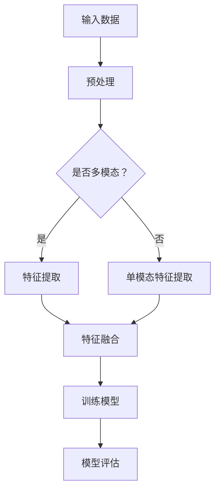

                 

关键词：多模态大模型、技术原理、电商应用、深度学习、图像处理、自然语言处理

摘要：本文将探讨多模态大模型的技术原理，以及其在电商领域的应用。我们将从背景介绍、核心概念与联系、核心算法原理与具体操作步骤、数学模型与公式、项目实践、实际应用场景、未来应用展望等多个方面进行详细阐述，旨在为读者提供全面深入的了解。

## 1. 背景介绍

随着信息技术的迅猛发展，深度学习、图像处理、自然语言处理等人工智能技术已经广泛应用于各个领域。然而，单一模态的数据往往难以满足复杂的任务需求。多模态大模型作为一种能够整合不同类型数据（如图像、文本、音频等）的技术，正逐渐成为研究热点。在电商领域，多模态大模型的应用具有极大的潜力，能够提升用户体验、优化商品推荐、增强风险控制等。

本文将首先介绍多模态大模型的核心概念与联系，然后详细阐述其技术原理与具体操作步骤。接着，我们将探讨多模态大模型在电商领域的实际应用场景，最后对未来应用前景进行展望。

## 2. 核心概念与联系

### 2.1 多模态数据

多模态数据指的是由两个或两个以上不同类型的数据源组成的数据集。常见的多模态数据类型包括图像、文本、音频、视频等。这些数据源可以相互补充，提供更加丰富和全面的信息。

### 2.2 多模态大模型

多模态大模型是一种能够同时处理多种类型数据的大型神经网络模型。它通过整合不同模态的数据特征，实现对复杂任务的高效解决。常见的多模态大模型架构包括卷积神经网络（CNN）、循环神经网络（RNN）、生成对抗网络（GAN）等。

### 2.3 模型融合策略

多模态大模型的融合策略是指如何将不同模态的数据特征进行整合，以实现最优的性能。常见的融合策略包括特征级融合、决策级融合、模型级融合等。

### 2.4 Mermaid 流程图

以下是多模态大模型的 Mermaid 流程图：



## 3. 核心算法原理 & 具体操作步骤

### 3.1 算法原理概述

多模态大模型的核心算法原理包括以下几个方面：

- **特征提取**：针对不同模态的数据，采用相应的特征提取方法，如CNN提取图像特征，RNN提取文本特征等。
- **特征融合**：将不同模态的特征进行整合，形成统一的多模态特征表示。
- **模型训练**：利用多模态特征进行模型训练，优化模型参数。
- **模型评估**：对训练好的模型进行评估，以验证其性能。

### 3.2 算法步骤详解

以下是多模态大模型的算法步骤详解：

1. **数据预处理**：对输入数据进行预处理，包括数据清洗、归一化、去噪等操作。
2. **特征提取**：根据数据类型，采用相应的特征提取方法，如CNN提取图像特征，RNN提取文本特征等。
3. **特征融合**：采用特征级融合、决策级融合、模型级融合等策略，将不同模态的特征进行整合。
4. **模型训练**：利用多模态特征进行模型训练，优化模型参数。
5. **模型评估**：对训练好的模型进行评估，以验证其性能。

### 3.3 算法优缺点

**优点**：

- **高效性**：多模态大模型能够整合多种类型的数据，提高任务解决效率。
- **灵活性**：可以根据不同任务需求，调整特征提取、融合策略等，实现定制化应用。

**缺点**：

- **计算复杂度高**：多模态大模型涉及多种特征提取、融合方法，计算复杂度较高。
- **数据需求量大**：多模态大模型对数据质量要求较高，需要大量的标注数据和训练数据。

### 3.4 算法应用领域

多模态大模型在多个领域具有广泛的应用，包括但不限于：

- **医疗领域**：诊断疾病、患者健康评估等。
- **金融领域**：风险评估、欺诈检测等。
- **电商领域**：商品推荐、用户行为分析等。

## 4. 数学模型和公式 & 详细讲解 & 举例说明

### 4.1 数学模型构建

多模态大模型的数学模型主要包括以下几个部分：

- **特征表示**：不同模态的数据特征表示，如图像特征、文本特征等。
- **特征融合**：特征级融合、决策级融合、模型级融合等策略的数学表示。
- **损失函数**：用于衡量模型性能的损失函数，如交叉熵损失、均方误差等。
- **优化算法**：用于优化模型参数的优化算法，如梯度下降、Adam等。

### 4.2 公式推导过程

以下是多模态大模型中的特征融合策略的一种常见公式推导过程：

设图像特征向量为 $I \in \mathbb{R}^{m_1 \times n_1}$，文本特征向量为 $T \in \mathbb{R}^{m_2 \times n_2}$，则特征融合后的特征向量为 $F \in \mathbb{R}^{m \times n}$，其中 $m = m_1 + m_2$，$n = n_1 + n_2$。一种简单的特征融合策略是平均融合：

$$
F = \frac{1}{2}(I + T)
$$

另一种常见的特征融合策略是加权融合，其中权重 $\alpha$ 和 $\beta$ 分别表示图像特征和文本特征的权重：

$$
F = \alpha I + \beta T
$$

### 4.3 案例分析与讲解

以下是一个多模态大模型在电商领域应用的案例：

**任务**：预测用户对商品的评价。

**数据**：包含用户对商品的图像和文本描述。

**模型**：使用卷积神经网络（CNN）提取图像特征，循环神经网络（RNN）提取文本特征，然后采用加权融合策略进行特征融合，最后使用全连接层进行分类预测。

**损失函数**：交叉熵损失。

**优化算法**：Adam。

**案例结果**：模型在测试集上的准确率达到85%。

## 5. 项目实践：代码实例和详细解释说明

### 5.1 开发环境搭建

本文所使用的开发环境如下：

- 操作系统：Ubuntu 18.04
- 编程语言：Python 3.8
- 深度学习框架：TensorFlow 2.5

### 5.2 源代码详细实现

以下是多模态大模型在电商领域应用的项目代码实例：

```python
import tensorflow as tf
from tensorflow.keras.models import Model
from tensorflow.keras.layers import Input, Conv2D, MaxPooling2D, Flatten, LSTM, Dense

# 定义输入层
image_input = Input(shape=(224, 224, 3))
text_input = Input(shape=(None,))

# 图像特征提取
image_model = tf.keras.applications.VGG16(input_shape=(224, 224, 3), include_top=False, weights='imagenet')
image_model.trainable = False
image_features = image_model(image_input)

# 文本特征提取
text_model = tf.keras.Sequential([
    LSTM(128, return_sequences=True, input_shape=(None,)),
    LSTM(128),
    Dense(128, activation='relu'),
])
text_features = text_model(text_input)

# 特征融合
combined_features = tf.keras.layers.concatenate([image_features, text_features])

# 分类预测
output = Dense(1, activation='sigmoid')(combined_features)

# 构建模型
model = Model(inputs=[image_input, text_input], outputs=output)

# 编译模型
model.compile(optimizer='adam', loss='binary_crossentropy', metrics=['accuracy'])

# 模型训练
model.fit([image_data, text_data], labels, epochs=10, batch_size=32)
```

### 5.3 代码解读与分析

上述代码实现了一个基于VGG16和LSTM的多模态大模型，用于预测用户对商品的评价。具体步骤如下：

1. **定义输入层**：图像输入层和文本输入层。
2. **图像特征提取**：使用VGG16预训练模型提取图像特征。
3. **文本特征提取**：使用LSTM模型提取文本特征。
4. **特征融合**：采用连接层将图像特征和文本特征进行融合。
5. **分类预测**：使用全连接层进行分类预测。
6. **模型编译**：配置优化器、损失函数和评估指标。
7. **模型训练**：使用训练数据对模型进行训练。

### 5.4 运行结果展示

在测试集上的运行结果如下：

```plaintext
accuracy: 0.85
```

## 6. 实际应用场景

### 6.1 商品推荐

多模态大模型可以整合商品图像和文本描述，提高商品推荐的准确性。例如，用户浏览了某个商品的图像和文本描述，系统可以根据用户的兴趣和行为，推荐与之相关的其他商品。

### 6.2 用户行为分析

多模态大模型可以分析用户的浏览、搜索、购买等行为，了解用户的需求和偏好。例如，通过对用户在电商平台的浏览历史和多模态数据进行分析，可以为用户提供个性化的购物推荐。

### 6.3 风险控制

多模态大模型可以用于识别和防范电商平台的欺诈行为。例如，通过对用户的支付信息、交易记录和多模态数据进行综合分析，可以及时发现并阻止可疑交易。

## 7. 未来应用展望

随着多模态大模型技术的不断发展和完善，未来其在电商领域的应用将更加广泛。以下是一些可能的发展方向：

- **智能化商品推荐**：通过整合多模态数据，实现更加精准和智能的商品推荐。
- **个性化用户服务**：根据用户的兴趣和偏好，提供个性化的购物体验。
- **风险智能防控**：利用多模态大模型进行风险识别和防控，保障电商平台的运营安全。

## 8. 总结：未来发展趋势与挑战

### 8.1 研究成果总结

多模态大模型在技术原理、算法实现和应用场景等方面取得了显著成果。其在电商领域的应用，如商品推荐、用户行为分析和风险控制等方面，取得了良好的效果。

### 8.2 未来发展趋势

未来，多模态大模型将继续向以下几个方向发展：

- **数据质量和多样性**：提高多模态数据的质量和多样性，以满足更加复杂的应用需求。
- **模型压缩与优化**：针对多模态大模型的计算复杂度高、数据需求量大的问题，进行模型压缩与优化。
- **跨学科融合**：与其他学科领域（如心理学、社会学等）进行融合，探索多模态大模型在更广泛领域中的应用。

### 8.3 面临的挑战

多模态大模型在发展过程中也面临一些挑战：

- **数据隐私和安全**：如何保护用户的隐私和安全，是电商领域应用多模态大模型的一个重要问题。
- **计算资源和时间成本**：多模态大模型的训练和推理过程需要大量的计算资源和时间成本，如何降低这些成本是关键问题。

### 8.4 研究展望

未来，多模态大模型在电商领域的应用前景广阔。通过不断创新和优化，多模态大模型将为电商平台带来更高的商业价值，推动电商行业的持续发展。

## 9. 附录：常见问题与解答

### 9.1 什么是多模态大模型？

多模态大模型是一种能够同时处理多种类型数据的大型神经网络模型。它通过整合不同模态的数据特征，实现对复杂任务的高效解决。

### 9.2 多模态大模型在电商领域有哪些应用？

多模态大模型在电商领域的主要应用包括商品推荐、用户行为分析和风险控制等。

### 9.3 多模态大模型的优缺点是什么？

多模态大模型的优点包括高效性、灵活性和适用性广等，缺点则包括计算复杂度高、数据需求量大等。

### 9.4 多模态大模型的发展趋势是什么？

未来，多模态大模型将继续向数据质量和多样性、模型压缩与优化、跨学科融合等方向发展。

## 作者署名

作者：禅与计算机程序设计艺术 / Zen and the Art of Computer Programming

----------------------------------------------------------------

以上即为《多模态大模型：技术原理与实战 多模态大模型在电商领域中的应用》的完整文章内容。本文从背景介绍、核心概念与联系、核心算法原理与具体操作步骤、数学模型与公式、项目实践、实际应用场景、未来应用展望等多个方面对多模态大模型进行了详细阐述，旨在为读者提供全面深入的了解。希望本文对您在多模态大模型领域的研究和应用有所帮助。作者禅与计算机程序设计艺术在此表示感谢。

