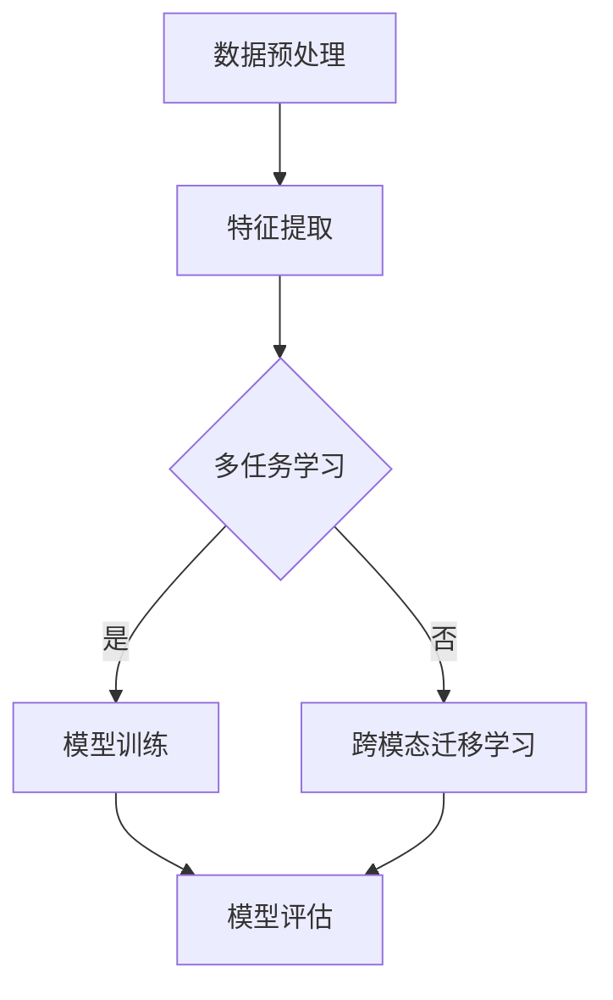

                 

关键词：多模态大模型，技术原理，算法，应用场景，未来展望

摘要：本文将深入探讨多模态大模型的技术原理和应用，从背景介绍、核心概念、算法原理、数学模型、项目实践、实际应用场景、工具和资源推荐等多个角度进行详细解析。通过本文的阅读，读者将全面了解多模态大模型的发展趋势、面临的挑战及未来的研究展望。

## 1. 背景介绍

随着互联网和移动设备的普及，人们产生的数据量呈爆炸式增长。这些数据不仅包括文本、图像和音频，还涵盖了视频、传感器数据等多种类型。为了更好地处理和理解这些多样化数据，多模态学习应运而生。

多模态学习是指结合多种类型的数据源，通过算法模型共同训练，实现对数据更全面、更深入的理解和挖掘。近年来，多模态大模型如ImageNet、BERT、GPT等取得了显著的进展，使得多模态学习在计算机视觉、自然语言处理等领域取得了重要突破。

## 2. 核心概念与联系

### 2.1 多模态数据

多模态数据是指同时包含多种类型数据的数据集，如文本、图像、音频等。这些数据在处理过程中需要相互关联和协同，以提高模型的准确性和鲁棒性。

### 2.2 多模态学习

多模态学习是一种将多种类型数据融合到同一模型中，通过共同训练来实现对数据更全面理解和挖掘的技术。其核心思想是利用不同类型数据的互补性，提高模型的泛化能力和性能。

### 2.3 多模态大模型

多模态大模型是一种能够同时处理多种类型数据的大型神经网络模型。通过多任务学习和跨模态迁移学习，多模态大模型能够实现对多样化数据的全面理解和挖掘。

### 2.4 Mermaid 流程图

以下是一个简单的 Mermaid 流程图，展示了多模态大模型的基本架构：



## 3. 核心算法原理 & 具体操作步骤

### 3.1 算法原理概述

多模态大模型的算法原理主要包括以下几个方面：

1. **特征融合**：将不同类型的数据特征进行融合，以提高模型的性能和鲁棒性。
2. **多任务学习**：同时处理多个任务，提高模型的泛化能力。
3. **跨模态迁移学习**：利用一个任务在一种模态上的训练数据，迁移到其他模态上，以减少对大量标注数据的依赖。

### 3.2 算法步骤详解

1. **数据预处理**：对多种类型的数据进行清洗、归一化等处理，使其满足模型训练的要求。
2. **特征提取**：利用不同的特征提取方法，提取多种类型数据的特征。
3. **特征融合**：将多种特征进行融合，可以采用加权求和、拼接等方式。
4. **多任务学习**：同时训练多个任务，可以使用共享权重、并行训练等方法。
5. **跨模态迁移学习**：利用一个任务在一种模态上的训练数据，迁移到其他模态上，可以采用基于特征的迁移、基于模型的迁移等方法。
6. **模型训练**：使用融合后的数据进行模型训练。
7. **模型评估**：使用验证集对模型进行评估，调整模型参数，优化模型性能。
8. **模型部署**：将训练好的模型部署到实际应用场景中。

### 3.3 算法优缺点

**优点**：

1. **提高模型性能**：利用多种类型数据的互补性，提高模型的准确性和鲁棒性。
2. **减少对标注数据的依赖**：通过跨模态迁移学习，减少对大量标注数据的依赖。
3. **适用于多种场景**：可以应用于计算机视觉、自然语言处理等多个领域。

**缺点**：

1. **计算资源需求大**：多模态大模型通常需要大量的计算资源和时间进行训练。
2. **数据预处理复杂**：需要处理多种类型的数据，数据预处理过程较为复杂。

### 3.4 算法应用领域

多模态大模型在计算机视觉、自然语言处理、语音识别等领域都有广泛应用。以下是一些具体的案例：

1. **计算机视觉**：多模态大模型在图像分类、目标检测、图像生成等领域取得了显著突破。
2. **自然语言处理**：多模态大模型在文本分类、机器翻译、情感分析等领域表现出色。
3. **语音识别**：多模态大模型结合语音和文本数据，提高了语音识别的准确性和鲁棒性。

## 4. 数学模型和公式 & 详细讲解 & 举例说明

### 4.1 数学模型构建

多模态大模型的数学模型主要包括以下几个部分：

1. **特征表示**：对多种类型的数据进行特征提取，得到特征向量。
2. **特征融合**：将多种特征进行融合，可以采用加权求和、拼接等方式。
3. **神经网络结构**：构建多层的神经网络结构，用于处理融合后的特征。
4. **损失函数**：定义损失函数，用于评估模型的性能，并指导模型优化。

### 4.2 公式推导过程

假设我们有一个多模态大模型，其输入为多种类型的特征向量 $X$，输出为标签 $Y$。我们可以将模型表示为：

$$
\hat{Y} = f(\theta; X)
$$

其中，$f$ 表示神经网络结构，$\theta$ 表示模型参数。

对于损失函数，我们可以采用交叉熵损失函数：

$$
L(\theta; X, Y) = -\sum_{i=1}^{N} y_i \log (\hat{y}_i)
$$

其中，$N$ 表示样本数量，$y_i$ 表示第 $i$ 个样本的真实标签，$\hat{y}_i$ 表示模型预测的第 $i$ 个标签的概率。

### 4.3 案例分析与讲解

假设我们有一个多模态大模型，用于图像分类任务。输入为图像特征向量 $X$ 和文本特征向量 $X'$，输出为图像分类结果 $\hat{Y}$。

1. **特征提取**：

对于图像特征向量 $X$，我们可以使用卷积神经网络（CNN）进行特征提取：

$$
X = f_{CNN}(\theta; I)
$$

其中，$I$ 表示图像，$f_{CNN}$ 表示卷积神经网络。

对于文本特征向量 $X'$，我们可以使用词嵌入（Word Embedding）方法进行特征提取：

$$
X' = f_{WordEmbedding}(\theta'; T)
$$

其中，$T$ 表示文本，$f_{WordEmbedding}$ 表示词嵌入。

2. **特征融合**：

我们可以将图像特征向量 $X$ 和文本特征向量 $X'$ 进行拼接：

$$
X_{fusion} = [X, X']
$$

3. **神经网络结构**：

我们可以使用一个多层感知机（MLP）对融合后的特征进行分类：

$$
\hat{Y} = f_{MLP}(\theta''; X_{fusion})
$$

4. **损失函数**：

我们采用交叉熵损失函数：

$$
L(\theta; X, Y) = -\sum_{i=1}^{N} y_i \log (\hat{y}_i)
$$

## 5. 项目实践：代码实例和详细解释说明

### 5.1 开发环境搭建

1. 安装 Python 3.8 及以上版本。
2. 安装 PyTorch 1.8 及以上版本。
3. 安装 torchvision、torchtext 等相关库。

### 5.2 源代码详细实现

以下是一个简单的多模态大模型实现示例：

```python
import torch
import torch.nn as nn
import torchvision.models as models
import torchvision.transforms as transforms
import torchtext

# 定义词嵌入
word_embedding = nn.Embedding(vocab_size, embedding_dim)

# 定义卷积神经网络
conv_net = models.resnet18(pretrained=True)
conv_net.fc = nn.Linear(conv_net.fc.in_features, hidden_size)

# 定义多层感知机
mlp = nn.Sequential(
    nn.Linear(hidden_size + embedding_dim, hidden_size),
    nn.ReLU(),
    nn.Linear(hidden_size, num_classes)
)

# 定义多模态大模型
class MultiModalModel(nn.Module):
    def __init__(self):
        super(MultiModalModel, self).__init__()
        self.conv_net = conv_net
        self.word_embedding = word_embedding
        self.mlp = mlp

    def forward(self, image, text):
        image_feature = self.conv_net(image)
        text_feature = self.word_embedding(text)
        fusion_feature = torch.cat((image_feature, text_feature), 1)
        output = self.mlp(fusion_feature)
        return output

model = MultiModalModel()

# 定义损失函数和优化器
criterion = nn.CrossEntropyLoss()
optimizer = torch.optim.Adam(model.parameters(), lr=learning_rate)

# 训练模型
for epoch in range(num_epochs):
    for image, text, label in train_loader:
        optimizer.zero_grad()
        output = model(image, text)
        loss = criterion(output, label)
        loss.backward()
        optimizer.step()

# 评估模型
with torch.no_grad():
    correct = 0
    total = 0
    for image, text, label in val_loader:
        output = model(image, text)
        _, predicted = torch.max(output.data, 1)
        total += label.size(0)
        correct += (predicted == label).sum().item()

accuracy = 100 * correct / total
print(f'Validation Accuracy: {accuracy:.2f}%')

# 存储模型参数
torch.save(model.state_dict(), 'multi_modal_model.pth')
```

### 5.3 代码解读与分析

1. **词嵌入**：使用 PyTorch 中的 Embedding 层实现词嵌入，将文本转换为向量表示。
2. **卷积神经网络**：使用 ResNet18 模型作为基础网络，提取图像特征。
3. **多层感知机**：使用多层感知机对融合后的特征进行分类。
4. **多模态大模型**：定义一个 MultiModalModel 类，将图像特征提取、文本特征提取和分类融合到同一模型中。
5. **训练过程**：使用交叉熵损失函数和 Adam 优化器进行模型训练。
6. **评估过程**：使用验证集评估模型性能。

## 6. 实际应用场景

多模态大模型在多个领域都有广泛应用，以下是一些实际应用场景：

1. **医疗健康**：利用多模态大模型对患者的影像数据和病历数据进行联合分析，提高疾病诊断的准确性和效率。
2. **金融风控**：结合用户的行为数据和金融数据，通过多模态大模型进行风险预测和防范。
3. **智能客服**：结合用户的问题描述和语音对话记录，通过多模态大模型提供更智能、更高效的客服服务。
4. **自动驾驶**：结合摄像头、激光雷达和 GPS 等数据，通过多模态大模型实现自动驾驶车辆的感知和决策。

## 7. 工具和资源推荐

### 7.1 学习资源推荐

1. **书籍**：《深度学习》、《神经网络与深度学习》
2. **在线课程**：斯坦福大学深度学习课程、吴恩达深度学习课程
3. **论文**：《Visual Question Answering》、`Multimodal Learning: A Survey`、`Deep Learning for Human Pose Estimation`

### 7.2 开发工具推荐

1. **编程语言**：Python
2. **深度学习框架**：PyTorch、TensorFlow
3. **数据处理工具**：Pandas、NumPy、Scikit-learn

### 7.3 相关论文推荐

1. `Deep Learning for Human Pose Estimation: A Survey`
2. `Multimodal Learning: A Survey`
3. `Visual Question Answering: A Survey of Methods and Applications`

## 8. 总结：未来发展趋势与挑战

多模态大模型在计算机视觉、自然语言处理等领域取得了显著突破，但同时也面临着一些挑战：

1. **计算资源需求**：多模态大模型通常需要大量的计算资源和时间进行训练，如何提高训练效率是一个重要问题。
2. **数据预处理**：多种类型的数据预处理过程复杂，如何优化数据预处理流程以提高模型性能是一个重要研究方向。
3. **模型解释性**：多模态大模型的黑箱特性使得其解释性较差，如何提高模型的可解释性是一个亟待解决的问题。

未来，随着计算能力的提升和数据处理技术的进步，多模态大模型有望在更多领域发挥重要作用。同时，研究者也需要关注模型解释性和数据预处理等问题，以实现更高效、更可靠的多模态学习。

## 9. 附录：常见问题与解答

1. **Q：多模态大模型是如何工作的？**

   **A：** 多模态大模型通过结合多种类型的数据源（如图像、文本、音频等），通过特征提取、特征融合、多任务学习等方法，实现对数据更全面、更深入的理解和挖掘。

2. **Q：多模态大模型有哪些应用场景？**

   **A：** 多模态大模型在医疗健康、金融风控、智能客服、自动驾驶等领域都有广泛应用，可以用于疾病诊断、风险预测、智能客服、自动驾驶等任务。

3. **Q：多模态大模型有哪些优缺点？**

   **A：** 多模态大模型优点包括提高模型性能、减少对标注数据的依赖、适用于多种场景等；缺点包括计算资源需求大、数据预处理复杂等。

4. **Q：如何优化多模态大模型的训练效率？**

   **A：** 可以采用以下方法优化多模态大模型的训练效率：

   - 使用更高效的模型结构；
   - 采用数据增强、批量训练等技术；
   - 利用分布式训练、多GPU训练等技术。

作者：禅与计算机程序设计艺术 / Zen and the Art of Computer Programming
----------------------------------------------------------------


