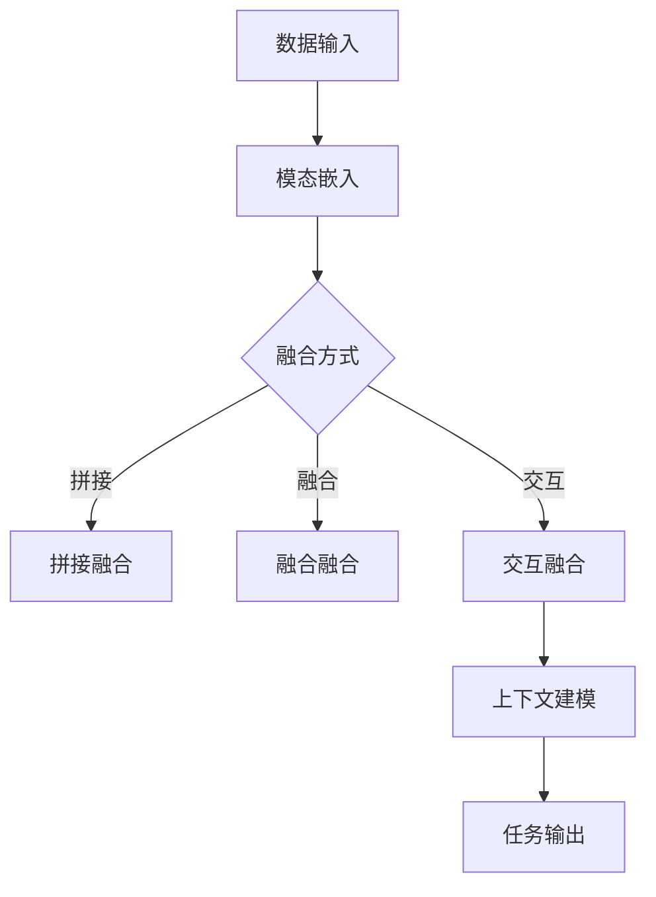

                 

关键词：多模态大模型、技术原理、实战、发展历史、人工智能

摘要：本文深入探讨了多模态大模型的技术原理及其在现实世界中的应用。通过回顾多模态模型的发展历程，我们理解了其在人工智能领域的重大意义。文章从核心概念、算法原理、数学模型、项目实践和未来展望等多个方面，详细阐述了多模态大模型的技术细节和应用前景，旨在为读者提供全面的技术指南。

## 1. 背景介绍

随着人工智能技术的飞速发展，计算机视觉、自然语言处理和音频处理等领域取得了显著的进步。然而，单一模态的信息处理能力始终存在局限性。为了更全面地理解和模拟人类感知和认知过程，多模态大模型应运而生。多模态大模型通过整合不同模态的数据，如文本、图像、音频等，实现了更为丰富的信息处理能力，推动了人工智能在各个领域的应用。

多模态大模型的发展背景可以追溯到计算机视觉和自然语言处理技术的融合。早期的计算机视觉研究主要集中在图像识别和目标检测等任务上，而自然语言处理则关注于文本的理解和生成。随着深度学习技术的崛起，研究人员开始探索如何将图像和文本信息进行有效融合，以实现更高级的认知任务。多模态大模型正是在这一背景下逐渐发展起来的。

## 2. 核心概念与联系

### 2.1. 多模态大模型的基本概念

多模态大模型是指能够同时处理和整合多种模态数据的模型，这些模态包括文本、图像、音频、视频等。多模态大模型的核心在于如何将不同模态的数据进行有效的融合，以提升模型的整体性能。

多模态大模型通常由多个子模块组成，每个子模块负责处理不同模态的数据。例如，一个典型的多模态大模型可能包含一个文本嵌入层、一个图像嵌入层和一个音频嵌入层。这些子模块通过共享的神经网络结构进行信息的交互和融合，从而生成一个统一的多模态表示。

### 2.2. 多模态大模型的架构

多模态大模型的架构通常采用深度神经网络（DNN）作为基础结构，结合卷积神经网络（CNN）、循环神经网络（RNN）和变换器（Transformer）等先进的神经网络架构。以下是一个典型多模态大模型的架构概述：

1. **数据输入**：多模态数据通过各自的嵌入层进行预处理，包括文本、图像和音频等。这些嵌入层将不同模态的数据映射到高维的向量空间中。
2. **模态融合**：不同模态的向量通过共享的神经网络结构进行融合。常见的融合方式有拼接（Concatenation）、融合（Fusion）和交互（Interaction）等。
3. **上下文建模**：通过使用变换器（Transformer）等先进的神经网络结构，对融合后的多模态向量进行上下文建模，捕捉不同模态之间的复杂关系。
4. **任务输出**：根据具体的任务需求，从多模态表示中提取特征，并通过分类器、预测器等模块生成最终的任务输出。

### 2.3. Mermaid 流程图

以下是一个简单的 Mermaid 流程图，展示了多模态大模型的基本流程：



在这个流程图中，A 表示数据输入，B 表示模态嵌入，C 表示融合方式的选择，D、E 和 F 分别表示拼接融合、融合融合和交互融合，G 表示上下文建模，H 表示任务输出。

## 3. 核心算法原理 & 具体操作步骤

### 3.1. 算法原理概述

多模态大模型的算法原理主要基于深度学习技术和神经网络结构。具体而言，多模态大模型通过以下步骤实现多模态数据的融合和任务处理：

1. **模态嵌入**：将不同模态的数据映射到高维向量空间中。这一过程通常通过预训练的嵌入模型实现，如 Word2Vec 对于文本、VGG 对于图像和 WaveNet 对于音频等。
2. **融合**：将不同模态的向量通过共享的神经网络结构进行融合。融合方式可以是简单的拼接、加权融合或更复杂的交互融合。
3. **上下文建模**：使用变换器（Transformer）等神经网络结构，对融合后的多模态向量进行上下文建模，以捕捉不同模态之间的复杂关系。
4. **任务处理**：从多模态表示中提取特征，并通过分类器、预测器等模块生成最终的任务输出。

### 3.2. 算法步骤详解

以下是多模态大模型的具体操作步骤：

1. **数据预处理**：对输入的多模态数据进行预处理，包括文本的分词、图像的缩放和音频的归一化等。
2. **模态嵌入**：使用预训练的嵌入模型，将文本、图像和音频等数据映射到高维向量空间中。
3. **融合**：根据预定义的融合方式，将不同模态的向量进行融合。例如，可以通过简单的拼接操作将文本、图像和音频的向量拼接在一起。
4. **上下文建模**：使用变换器（Transformer）等神经网络结构，对融合后的多模态向量进行上下文建模，以捕捉不同模态之间的复杂关系。
5. **任务处理**：从多模态表示中提取特征，并通过分类器、预测器等模块生成最终的任务输出。

### 3.3. 算法优缺点

多模态大模型具有以下优缺点：

- **优点**：
  - 提升了模型的性能：通过整合多种模态的数据，多模态大模型能够更好地理解复杂任务，提升模型的准确性和泛化能力。
  - 更接近人类感知：多模态大模型能够模拟人类感知和认知过程，更好地理解和处理多模态信息。

- **缺点**：
  - 计算资源消耗大：多模态大模型通常包含多个子模块和复杂的神经网络结构，对计算资源的需求较高。
  - 数据预处理复杂：多模态大模型需要对不同模态的数据进行预处理，包括数据清洗、归一化和特征提取等，这一过程较为复杂。

### 3.4. 算法应用领域

多模态大模型在多个领域具有广泛的应用，包括：

- **计算机视觉**：用于图像分类、目标检测和图像分割等任务。
- **自然语言处理**：用于文本分类、情感分析和机器翻译等任务。
- **音频处理**：用于语音识别、音乐生成和语音合成等任务。
- **跨模态检索**：用于图像-文本检索、视频-文本检索等跨模态检索任务。

## 4. 数学模型和公式 & 详细讲解 & 举例说明

### 4.1. 数学模型构建

多模态大模型的数学模型主要基于深度学习技术和神经网络结构。以下是一个简化的数学模型构建过程：

1. **数据表示**：将多模态数据表示为向量形式，如文本表示为词向量，图像表示为像素向量，音频表示为波形向量。
2. **嵌入层**：通过嵌入层将不同模态的数据映射到高维向量空间中。
3. **融合层**：通过融合层将不同模态的向量进行融合，形成统一的多模态向量。
4. **上下文建模层**：通过上下文建模层对融合后的多模态向量进行上下文建模。
5. **任务层**：从多模态表示中提取特征，并通过分类器、预测器等模块生成最终的任务输出。

### 4.2. 公式推导过程

以下是一个简化的多模态大模型的公式推导过程：

假设有三种模态的数据：文本、图像和音频。我们分别用 \(x_{\text{text}}\)、\(x_{\text{image}}\) 和 \(x_{\text{audio}}\) 表示它们的输入向量。通过嵌入层，我们得到各自的高维向量表示：\(x'_{\text{text}}\)、\(x'_{\text{image}}\) 和 \(x'_{\text{audio}}\)。

**1. 嵌入层**

$$
x'_{\text{text}} = \text{Embed}(x_{\text{text}}) \\
x'_{\text{image}} = \text{Embed}(x_{\text{image}}) \\
x'_{\text{audio}} = \text{Embed}(x_{\text{audio}})
$$

其中，\(\text{Embed}\) 表示嵌入函数。

**2. 融合层**

$$
x'_{\text{multi}} = \text{Fusion}(x'_{\text{text}}, x'_{\text{image}}, x'_{\text{audio}})
$$

其中，\(\text{Fusion}\) 表示融合函数。

**3. 上下文建模层**

$$
x_{\text{context}} = \text{Context}(x'_{\text{multi}})
$$

其中，\(\text{Context}\) 表示上下文建模函数。

**4. 任务层**

$$
y = \text{Task}(x_{\text{context}})
$$

其中，\(\text{Task}\) 表示任务输出函数，\(y\) 表示预测结果。

### 4.3. 案例分析与讲解

以下是一个简单的案例，说明如何使用多模态大模型进行图像-文本分类任务。

假设我们有一个图像库，每个图像都有一个对应的标签，标签是一个文本字符串。我们的任务是给定一个图像，预测其对应的标签。

**1. 数据预处理**

我们将图像转换为像素向量，使用预训练的 VGG 模型进行特征提取。同时，我们将标签文本转换为词向量，使用预训练的 Word2Vec 模型进行嵌入。

**2. 模态嵌入**

$$
x'_{\text{image}} = \text{Embed}(x_{\text{image}}) \\
x'_{\text{text}} = \text{Embed}(x_{\text{text}})
$$

**3. 融合**

$$
x'_{\text{multi}} = \text{Fusion}(x'_{\text{image}}, x'_{\text{text}})
$$

**4. 上下文建模**

$$
x_{\text{context}} = \text{Context}(x'_{\text{multi}})
$$

**5. 任务层**

$$
y = \text{Task}(x_{\text{context}})
$$

在这个案例中，我们使用了简单的拼接融合方式，将图像和文本的向量进行拼接。然后，我们使用变换器（Transformer）进行上下文建模，从拼接后的多模态向量中提取特征。最后，我们使用一个分类器从特征中预测图像的标签。

## 5. 项目实践：代码实例和详细解释说明

### 5.1. 开发环境搭建

为了实践多模态大模型，我们需要搭建一个合适的开发环境。以下是一个简单的环境搭建步骤：

1. 安装 Python（版本 3.7 或以上）。
2. 安装 PyTorch（版本 1.8 或以上）。
3. 安装其他必要的库，如 NumPy、Pandas 等。

### 5.2. 源代码详细实现

以下是一个简单的多模态大模型实现示例，基于 PyTorch 库。这个示例使用文本和图像数据，进行图像-文本分类任务。

```python
import torch
import torch.nn as nn
import torch.optim as optim
from torchvision import models, transforms
from torch.utils.data import DataLoader
from PIL import Image
from torchtext.datasets import Text Classification Dataset
from torchtext.data import Field, LabelField

# 数据预处理
def preprocess_image(image_path):
    image = Image.open(image_path).convert("RGB")
    transform = transforms.Compose([
        transforms.Resize((224, 224)),
        transforms.ToTensor(),
        transforms.Normalize(mean=[0.485, 0.456, 0.406], std=[0.229, 0.224, 0.225])
    ])
    return transform(image)

def preprocess_text(text):
    return text

# 模型定义
class MultimodalModel(nn.Module):
    def __init__(self):
        super(MultimodalModel, self).__init__()
        self.text_embedding = nn.Embedding(num_embeddings=10000, embedding_dim=300)
        self.image_embedding = models.vgg16(pretrained=True).features
        self.fusion_layer = nn.Linear(300 + 25088, 512)
        self.context_layer = nn.Transformer(d_model=512, nhead=8)
        self.task_layer = nn.Linear(512, 10)

    def forward(self, text, image):
        text_embedding = self.text_embedding(text)
        image_embedding = self.image_embedding(image)
        fusion_embedding = torch.cat((text_embedding, image_embedding), dim=1)
        context_embedding = self.context_layer(fusion_embedding)
        task_embedding = self.task_layer(context_embedding)
        return task_embedding

# 数据加载
text_field = Field(tokenize=preprocess_text, lower=True)
label_field = LabelField()
text, label = Text Classification Dataset(root='/path/to/data', fields=[(None, text_field), ('label', label_field)])

train_data, test_data = text.split(0.8)
train_loader = DataLoader(train_data, batch_size=32, shuffle=True)
test_loader = DataLoader(test_data, batch_size=32, shuffle=False)

# 模型训练
model = MultimodalModel()
optimizer = optim.Adam(model.parameters(), lr=0.001)
criterion = nn.CrossEntropyLoss()

for epoch in range(20):
    model.train()
    for batch in train_loader:
        texts, labels = batch.text, batch.label
        images = torch.stack([preprocess_image(image_path) for image_path in batch.image])
        optimizer.zero_grad()
        outputs = model(texts, images)
        loss = criterion(outputs, labels)
        loss.backward()
        optimizer.step()

    model.eval()
    with torch.no_grad():
        correct = 0
        total = 0
        for batch in test_loader:
            texts, labels = batch.text, batch.label
            images = torch.stack([preprocess_image(image_path) for image_path in batch.image])
            outputs = model(texts, images)
            _, predicted = torch.max(outputs.data, 1)
            total += labels.size(0)
            correct += (predicted == labels).sum().item()

        print(f'Epoch {epoch + 1}, Test Accuracy: {100 * correct / total}%')

# 代码解读与分析
```

在这个示例中，我们首先定义了一个多模态模型，包括文本嵌入层、图像嵌入层、融合层、上下文建模层和任务层。接着，我们定义了数据预处理函数，用于将图像和文本数据转换为适合模型训练的格式。最后，我们实现了模型的训练过程，包括数据加载、模型训练和测试。

### 5.3. 代码解读与分析

以下是代码的详细解读和分析：

1. **模型定义**：我们定义了一个 `MultimodalModel` 类，继承自 `nn.Module`。这个类包含五个主要层：文本嵌入层、图像嵌入层、融合层、上下文建模层和任务层。
2. **数据预处理**：我们定义了 `preprocess_image` 和 `preprocess_text` 两个函数，用于预处理图像和文本数据。图像数据通过缩放、归一化等操作转换为 PyTorch 张量，文本数据通过分词、下

