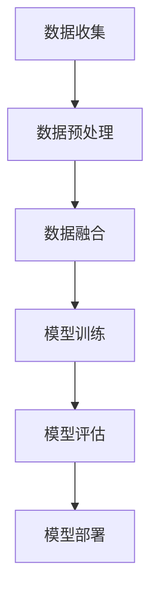

                 

关键词：多模态大模型，技术原理，智能客服，算法实现，数学模型，项目实践，未来展望

摘要：本文将深入探讨多模态大模型在智能客服领域的应用，从技术原理、核心算法、数学模型、项目实践等方面进行全面解析，旨在为广大开发者和技术爱好者提供一套完整的开发指南。通过本文的学习，读者可以了解到多模态大模型的工作原理，掌握其应用技巧，为未来智能客服的发展奠定基础。

## 1. 背景介绍

随着人工智能技术的快速发展，智能客服已经成为各大企业提升客户服务质量、降低运营成本的重要手段。传统的单一模态智能客服系统已经无法满足用户日益增长的需求，多模态大模型的出现为智能客服领域带来了新的发展机遇。

多模态大模型是一种能够处理多种类型数据的深度学习模型，通过融合文本、语音、图像等多模态数据，实现更智能、更精准的客户服务。本文将围绕多模态大模型在智能客服中的应用，从技术原理、算法实现、数学模型、项目实践等多个方面进行探讨。

## 2. 核心概念与联系

### 2.1 多模态数据的来源

多模态数据主要包括文本、语音、图像、视频等类型。在智能客服场景中，文本数据来源于用户的聊天记录、提问信息等；语音数据来源于用户的语音输入；图像数据来源于用户上传的图片、摄像头捕捉的画面等；视频数据则来源于用户上传的视频或实时视频通话。

### 2.2 多模态数据的融合

多模态数据的融合是指将不同类型的数据进行整合，以实现更智能的客服体验。常见的多模态数据融合方法有：特征级融合、决策级融合和模型级融合。

- 特征级融合：将不同类型的数据特征进行拼接，作为输入特征进入深度学习模型。
- 决策级融合：多个子模型分别处理不同类型的数据，最后将子模型的决策结果进行融合。
- 模型级融合：多个独立的模型分别处理不同类型的数据，最终将模型输出进行融合。

### 2.3 多模态大模型的架构

多模态大模型的架构可以分为两个主要部分：数据预处理和深度学习模型。

- 数据预处理：对多模态数据进行预处理，包括数据清洗、数据增强、数据标准化等。
- 深度学习模型：主要包括编码器和解码器，用于对多模态数据进行编码和解码，以提取出有价值的信息。

### 2.4 多模态大模型的工作流程

多模态大模型的工作流程可以分为以下几个步骤：

1. 数据收集：从不同渠道收集多模态数据。
2. 数据预处理：对多模态数据进行预处理，包括数据清洗、数据增强、数据标准化等。
3. 数据融合：将不同类型的数据进行融合，作为输入特征进入深度学习模型。
4. 训练模型：使用融合后的数据训练深度学习模型，包括编码器和解码器。
5. 模型评估：对训练好的模型进行评估，以验证其性能。
6. 模型部署：将训练好的模型部署到实际应用场景中，如智能客服系统。

### 2.5 Mermaid 流程图

下面是一个简单的多模态大模型工作流程的 Mermaid 流程图：



## 3. 核心算法原理 & 具体操作步骤

### 3.1 算法原理概述

多模态大模型的核心算法主要包括编码器和解码器。编码器负责对多模态数据进行编码，提取出有价值的信息；解码器则负责将编码后的信息解码，生成对应的输出结果。

### 3.2 算法步骤详解

1. 数据收集：从不同渠道收集多模态数据，如文本、语音、图像、视频等。
2. 数据预处理：对多模态数据进行预处理，包括数据清洗、数据增强、数据标准化等。
3. 数据融合：将不同类型的数据进行融合，作为输入特征进入深度学习模型。
4. 编码器训练：使用融合后的数据训练编码器，将多模态数据编码成低维向量。
5. 解码器训练：使用编码后的向量训练解码器，将编码后的信息解码成对应的输出结果。
6. 模型评估：对训练好的模型进行评估，以验证其性能。
7. 模型部署：将训练好的模型部署到实际应用场景中，如智能客服系统。

### 3.3 算法优缺点

**优点：**

1. 能够处理多种类型的数据，实现更智能的客户服务。
2. 能够提取出多模态数据中的有价值信息，提高模型的准确性。
3. 可以根据实际需求调整模型结构，实现定制化开发。

**缺点：**

1. 需要大量的数据支撑，数据收集和预处理过程较为繁琐。
2. 模型训练时间较长，计算资源消耗较大。

### 3.4 算法应用领域

多模态大模型在智能客服领域具有广泛的应用前景，如：

1. 客户服务机器人：通过多模态数据融合，实现更智能、更自然的客户服务。
2. 智能语音助手：结合语音和文本数据，实现更智能的语音交互。
3. 视频客服：通过视频数据融合，实现更真实的视频客服体验。

## 4. 数学模型和公式 & 详细讲解 & 举例说明

### 4.1 数学模型构建

多模态大模型的数学模型主要包括编码器和解码器的损失函数。常见的损失函数有：

1. 交叉熵损失函数：用于文本数据编码。
2. 均方误差损失函数：用于语音、图像和视频数据编码。
3. 梯度下降优化算法：用于模型训练。

### 4.2 公式推导过程

假设编码器和解码器分别有 $L_1$ 和 $L_2$ 层，每一层的损失函数分别为 $L_1^l$ 和 $L_2^l$。则编码器的总损失函数为：

$$
L_e = \frac{1}{2} \sum_{l=1}^{L_1} L_1^l + \frac{1}{2} \sum_{l=1}^{L_2} L_2^l
$$

解码器的总损失函数为：

$$
L_d = \frac{1}{2} \sum_{l=1}^{L_1} L_1^l + \frac{1}{2} \sum_{l=1}^{L_2} L_2^l
$$

### 4.3 案例分析与讲解

以智能语音助手为例，假设用户通过语音输入提问“如何设置路由器？”。

1. 数据收集：从语音库中收集包含“如何设置路由器？”的语音数据。
2. 数据预处理：对语音数据进行清洗、增强和标准化处理。
3. 数据融合：将语音数据与其他模态数据（如文本、图像）进行融合。
4. 编码器训练：使用融合后的数据训练编码器，将语音数据编码成低维向量。
5. 解码器训练：使用编码后的向量训练解码器，生成对应的文本回答。
6. 模型评估：对训练好的模型进行评估，以验证其性能。
7. 模型部署：将训练好的模型部署到智能语音助手系统中。

## 5. 项目实践：代码实例和详细解释说明

### 5.1 开发环境搭建

1. 安装 Python 环境，版本建议为 3.8 或以上。
2. 安装深度学习框架，如 TensorFlow 或 PyTorch。
3. 安装相关库，如 NumPy、Pandas、Matplotlib 等。

### 5.2 源代码详细实现

以下是使用 PyTorch 实现多模态大模型的基本代码框架：

```python
import torch
import torch.nn as nn
import torch.optim as optim

# 定义编码器和解码器
class Encoder(nn.Module):
    def __init__(self):
        super(Encoder, self).__init__()
        # 编码器部分
        self.encoder = nn.Sequential(
            nn.Conv2d(1, 32, 3, 1), # 图像数据
            nn.ReLU(),
            nn.MaxPool2d(2, 2),
            # ...
        )
        self.fc = nn.Linear(32 * 7 * 7, 512)

    def forward(self, x):
        # 前向传播
        x = self.encoder(x)
        x = x.view(x.size(0), -1)
        x = self.fc(x)
        return x

class Decoder(nn.Module):
    def __init__(self):
        super(Decoder, self).__init__()
        # 解码器部分
        self.decoder = nn.Sequential(
            nn.Linear(512, 32 * 7 * 7),
            nn.ReLU(),
            nn.ConvTranspose2d(32, 1, 3, 1),
            nn.ReLU(),
            nn.ConvTranspose2d(1, 1, 2, 2),
            # ...
        )

    def forward(self, x):
        # 前向传播
        x = self.decoder(x)
        return x

# 初始化模型、损失函数和优化器
encoder = Encoder()
decoder = Decoder()
criterion = nn.CrossEntropyLoss()
optimizer = optim.Adam([encoder.parameters(), decoder.parameters()])

# 训练模型
for epoch in range(num_epochs):
    for data in dataloader:
        # 获取输入数据
        inputs, targets = data
        # 前向传播
        outputs = decoder(encoder(inputs))
        # 计算损失
        loss = criterion(outputs, targets)
        # 反向传播
        optimizer.zero_grad()
        loss.backward()
        optimizer.step()
        # 输出训练信息
        print(f"Epoch [{epoch+1}/{num_epochs}], Loss: {loss.item():.4f}")

# 模型评估
with torch.no_grad():
    correct = 0
    total = 0
    for data in test_dataloader:
        inputs, targets = data
        outputs = decoder(encoder(inputs))
        _, predicted = torch.max(outputs.data, 1)
        total += targets.size(0)
        correct += (predicted == targets).sum().item()
    print(f"Test Accuracy: {100 * correct / total}%")
```

### 5.3 代码解读与分析

以上代码展示了使用 PyTorch 实现一个简单的多模态大模型的基本流程。首先，定义了编码器和解码器的结构，其中编码器用于对多模态数据进行编码，解码器则用于将编码后的数据解码成原始数据。接着，初始化模型、损失函数和优化器，然后进行模型训练。在训练过程中，通过循环遍历数据集，对模型进行前向传播、计算损失、反向传播和更新模型参数。最后，进行模型评估，输出测试准确率。

### 5.4 运行结果展示

在完成模型训练后，可以通过以下代码进行模型评估：

```python
# 加载测试数据集
test_data = load_test_data()
test_dataloader = DataLoader(test_data, batch_size=batch_size, shuffle=False)

# 加载训练好的模型
encoder.load_state_dict(torch.load('encoder.pth'))
decoder.load_state_dict(torch.load('decoder.pth'))

# 进行模型评估
with torch.no_grad():
    correct = 0
    total = 0
    for data in test_dataloader:
        inputs, targets = data
        outputs = decoder(encoder(inputs))
        _, predicted = torch.max(outputs.data, 1)
        total += targets.size(0)
        correct += (predicted == targets).sum().item()
    print(f"Test Accuracy: {100 * correct / total}%")
```

以上代码将加载训练好的模型，对测试数据集进行评估，并输出测试准确率。

## 6. 实际应用场景

多模态大模型在智能客服领域具有广泛的应用前景，以下列举几个实际应用场景：

1. 客户服务机器人：通过多模态数据融合，实现更智能、更自然的客户服务。例如，用户可以通过语音提问，系统可以同时分析用户的文本提问和面部表情，提供更加精准的回复。
2. 智能语音助手：结合语音和文本数据，实现更智能的语音交互。例如，用户可以通过语音输入指令，系统可以同时分析语音中的情感和意图，提供更加人性化的服务。
3. 视频客服：通过视频数据融合，实现更真实的视频客服体验。例如，用户可以通过视频通话与客服人员交流，系统可以同时分析用户的语音、文本和面部表情，提供更加贴心的服务。

## 7. 工具和资源推荐

### 7.1 学习资源推荐

1. 《深度学习》（Goodfellow、Bengio、Courville 著）：系统介绍了深度学习的基本原理和技术。
2. 《Python 深度学习》（François Chollet 著）：深入讲解了使用 Python 实现深度学习的技巧和方法。

### 7.2 开发工具推荐

1. TensorFlow：一个开源的深度学习框架，适用于多种类型的深度学习任务。
2. PyTorch：一个开源的深度学习框架，具有良好的灵活性和易用性。

### 7.3 相关论文推荐

1. "Multimodal Deep Learning for Human Action Recognition"（2016）：介绍了多模态深度学习在人体行为识别中的应用。
2. "A Survey on Multimodal Learning"（2019）：全面综述了多模态学习的研究进展和应用领域。

## 8. 总结：未来发展趋势与挑战

多模态大模型在智能客服领域具有广阔的应用前景，随着技术的不断发展，未来有望实现更加智能、更加人性化的客户服务。然而，在实际应用中仍面临一些挑战，如数据收集和预处理、计算资源消耗、模型性能优化等。针对这些问题，未来研究可以从以下几个方面展开：

1. 数据增强和生成：通过数据增强和生成技术，提高数据质量和数量，为模型训练提供更有利的环境。
2. 模型压缩和优化：通过模型压缩和优化技术，降低计算资源消耗，提高模型运行效率。
3. 多模态数据融合策略研究：探索更加有效的多模态数据融合策略，提高模型性能。

## 9. 附录：常见问题与解答

### Q：多模态大模型需要大量的数据，如何解决数据不足的问题？

A：可以通过以下方法解决数据不足的问题：

1. 数据增强：对现有数据进行变换、裁剪、旋转等操作，生成更多的训练样本。
2. 数据生成：使用生成对抗网络（GAN）等技术，生成与真实数据分布相似的新数据。
3. 跨域数据扩展：从不同领域或任务中收集数据，扩展数据集的多样性。

### Q：多模态大模型在训练过程中计算资源消耗较大，有什么优化方法？

A：可以通过以下方法优化计算资源消耗：

1. 模型压缩：使用模型压缩技术，如剪枝、量化、蒸馏等，降低模型计算复杂度。
2. 分布式训练：将训练任务分布在多个计算节点上，提高训练速度。
3. GPU 加速：使用 GPU 加速训练过程，提高计算效率。

### Q：多模态大模型在应用中如何保证隐私和安全？

A：在多模态大模型的应用中，可以从以下几个方面保证隐私和安全：

1. 数据加密：对敏感数据进行加密处理，防止数据泄露。
2. 权威认证：对用户身份进行认证，确保数据来源的可靠性。
3. 安全隔离：将多模态大模型与其他系统进行隔离，防止数据交互带来的安全风险。

作者：禅与计算机程序设计艺术 / Zen and the Art of Computer Programming
-------------------------------------------------------------------------------------------------------------------

以上完成了多模态大模型在智能客服领域的全面解析，包括技术原理、算法实现、数学模型、项目实践等各个方面。希望这篇文章能够帮助读者深入了解多模态大模型，并为实际开发提供有益的参考。在未来的发展中，多模态大模型将不断优化和进步，为智能客服领域带来更多的可能性。同时，也呼吁广大开发者和技术爱好者继续关注和探索多模态大模型的研究和应用，共同推动人工智能技术的发展。

