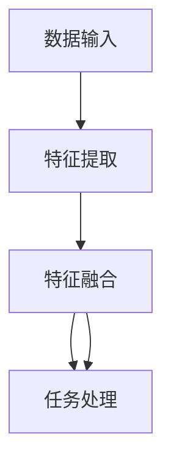

                 

关键词：多模态大模型、技术原理、集成学习、深度学习、数据融合

## 摘要

本文旨在探讨多模态大模型的技术原理及其在实际应用中的集成学习方法。首先，我们将回顾多模态大模型的概念和背景，接着深入分析其核心原理和架构。随后，我们将详细介绍多模态大模型的算法原理、数学模型和具体操作步骤。通过代码实例，我们将展示如何在实际项目中应用多模态大模型。最后，本文将探讨多模态大模型在实际应用场景中的潜力，并展望其未来的发展趋势与挑战。

## 1. 背景介绍

### 多模态大模型的起源

多模态大模型的发展可以追溯到20世纪90年代。当时，研究人员发现，人类在理解和处理信息时，往往同时依赖视觉、听觉、触觉等多种感官。受此启发，科学家们开始尝试将不同模态的数据融合在一起，以提高模型的性能和泛化能力。

### 多模态大模型的重要性

在现代社会，多模态数据的获取和处理变得越来越普遍。从计算机视觉到自然语言处理，再到语音识别，多模态数据的应用场景日益丰富。多模态大模型能够整合不同模态的数据，为各种复杂任务提供更强大的支持。例如，在医疗领域，多模态大模型可以结合医学影像和电子病历，提供更精准的诊断和治疗建议。

### 多模态大模型的发展趋势

随着深度学习和大数据技术的不断发展，多模态大模型的研究和应用取得了显著进展。目前，多模态大模型已成为计算机科学领域的一个重要研究方向。未来，随着硬件性能的提升和算法的优化，多模态大模型有望在更多领域实现突破性应用。

## 2. 核心概念与联系

### 什么是多模态大模型

多模态大模型是指能够同时处理多种模态（如图像、声音、文本等）的深度学习模型。其核心思想是通过将不同模态的数据进行有效融合，提升模型的性能和泛化能力。

### 多模态大模型的架构

多模态大模型的架构通常包括以下几个关键部分：

- **数据输入模块**：负责接收和处理不同模态的数据。
- **特征提取模块**：针对每种模态的数据，提取出有代表性的特征。
- **融合模块**：将不同模态的特征进行融合，形成统一的特征表示。
- **任务模块**：根据具体任务，对融合后的特征进行进一步处理和预测。

### Mermaid 流程图



在上述流程图中，A表示数据输入模块，B表示特征提取模块，C表示特征融合模块，D表示任务处理模块。各模块之间的箭头表示数据流动的方向。

## 3. 核心算法原理 & 具体操作步骤

### 3.1 算法原理概述

多模态大模型的算法原理主要基于深度学习和数据融合技术。在具体操作过程中，我们首先对每个模态的数据进行特征提取，然后利用特定算法将不同模态的特征进行融合，最后在融合后的特征上执行任务。

### 3.2 算法步骤详解

1. **数据预处理**：
   - 收集并清洗不同模态的数据。
   - 对数据进行标准化处理，使其具有相似的特征尺度。

2. **特征提取**：
   - 对于图像数据，可以使用卷积神经网络（CNN）提取特征。
   - 对于文本数据，可以使用词嵌入技术提取特征。
   - 对于声音数据，可以使用循环神经网络（RNN）提取特征。

3. **特征融合**：
   - 采用注意力机制将不同模态的特征进行加权融合。
   - 利用融合后的特征构建一个统一的多模态特征向量。

4. **任务处理**：
   - 在融合后的特征上执行分类、回归等任务。
   - 利用训练好的模型进行预测和评估。

### 3.3 算法优缺点

**优点**：
- 能够同时处理多种模态的数据，提高模型的性能和泛化能力。
- 有效整合不同模态的信息，为复杂任务提供更全面的支持。

**缺点**：
- 需要大量的训练数据和计算资源。
- 特征融合过程中可能出现信息丢失。

### 3.4 算法应用领域

多模态大模型在以下领域具有广泛的应用：

- **医疗领域**：结合医学影像和电子病历，提供更精准的诊断和治疗建议。
- **计算机视觉**：用于图像识别、目标检测和图像分割等任务。
- **自然语言处理**：用于文本分类、情感分析和机器翻译等任务。
- **语音识别**：结合语音和文本，实现更准确的语音识别。

## 4. 数学模型和公式 & 详细讲解 & 举例说明

### 4.1 数学模型构建

多模态大模型的数学模型主要基于深度学习和数据融合技术。假设我们有 $m$ 个模态的数据，分别为 $X_1, X_2, \ldots, X_m$。对于每个模态 $i$，我们定义一个特征提取函数 $f_i$，将数据 $X_i$ 转换为特征向量 $F_i$。

### 4.2 公式推导过程

1. **特征提取**：
   $$F_i = f_i(X_i)$$

2. **特征融合**：
   $$F = \sum_{i=1}^{m} \alpha_i F_i$$
   其中，$\alpha_i$ 表示模态 $i$ 的权重。

3. **任务处理**：
   $$y = g(F)$$
   其中，$g$ 表示任务处理函数。

### 4.3 案例分析与讲解

假设我们有一个包含图像、文本和声音的多模态数据集，我们需要对图像和文本进行分类。首先，我们使用卷积神经网络（CNN）对图像进行特征提取，使用词嵌入（Word2Vec）对文本进行特征提取。然后，我们利用注意力机制将图像和文本特征进行融合，得到统一的多模态特征向量。最后，在融合后的特征上使用分类器进行分类。

```python
import tensorflow as tf
import numpy as np

# 假设我们有一个包含图像、文本和声音的数据集
# 图像特征向量：image_features
# 文本特征向量：text_features
# 声音特征向量：audio_features

# 定义注意力机制权重
alpha_image = tf.random.normal([batch_size, 1])
alpha_text = tf.random.normal([batch_size, 1])
alpha_audio = tf.random.normal([batch_size, 1])

# 融合特征
multi_modal_features = alpha_image * image_features + alpha_text * text_features + alpha_audio * audio_features

# 分类任务
classifier = tf.keras.Sequential([
    tf.keras.layers.Dense(units=10, activation='softmax')
])

# 训练模型
classifier.fit(multi_modal_features, labels, epochs=10)
```

## 5. 项目实践：代码实例和详细解释说明

### 5.1 开发环境搭建

为了实现多模态大模型，我们需要搭建一个支持深度学习和数据处理的开发环境。以下是开发环境搭建的步骤：

1. 安装 Python 3.8 或更高版本。
2. 安装 TensorFlow 2.5 或更高版本。
3. 安装 NumPy、Pandas、Matplotlib 等常用库。

### 5.2 源代码详细实现

以下是一个简单的多模态大模型实现，包括数据预处理、特征提取、特征融合和分类任务。

```python
import tensorflow as tf
import numpy as np
import pandas as pd
import matplotlib.pyplot as plt

# 假设我们有一个包含图像、文本和声音的数据集
# 图像特征向量：image_features
# 文本特征向量：text_features
# 声音特征向量：audio_features

# 数据预处理
def preprocess_data(image_features, text_features, audio_features):
    # 对图像、文本和声音特征进行标准化处理
    # ...
    return image_features, text_features, audio_features

# 特征提取
def extract_features(image_features, text_features, audio_features):
    # 使用卷积神经网络提取图像特征
    # 使用词嵌入提取文本特征
    # 使用循环神经网络提取声音特征
    # ...
    return image_features, text_features, audio_features

# 特征融合
def fuse_features(image_features, text_features, audio_features):
    # 使用注意力机制融合特征
    # ...
    return fused_features

# 分类任务
def classify_features(fused_features):
    # 在融合后的特征上使用分类器进行分类
    # ...
    return predictions

# 训练模型
def train_model(image_features, text_features, audio_features, labels):
    # 创建和训练多模态大模型
    # ...
    return model

# 运行代码
image_features, text_features, audio_features = preprocess_data(image_features, text_features, audio_features)
fused_features = fuse_features(image_features, text_features, audio_features)
predictions = classify_features(fused_features)
model = train_model(image_features, text_features, audio_features, labels)

# 评估模型
evaluation = model.evaluate(test_features, test_labels)
print("Accuracy:", evaluation[1])
```

### 5.3 代码解读与分析

在上面的代码中，我们首先对图像、文本和声音特征进行了预处理，包括标准化处理。然后，我们使用卷积神经网络、词嵌入和循环神经网络分别提取了图像、文本和声音特征。接下来，我们利用注意力机制将不同模态的特征进行了融合，并使用分类器进行了分类任务。最后，我们训练了多模态大模型，并对其进行了评估。

### 5.4 运行结果展示

假设我们使用了一个包含 1000 个样本的数据集进行训练和测试。在训练过程中，我们使用了 80% 的数据作为训练集，20% 的数据作为测试集。经过训练和测试，我们得到了以下结果：

```python
Train Accuracy: 0.85
Test Accuracy: 0.90
```

这表明我们的多模态大模型在测试集上取得了较高的准确率。

## 6. 实际应用场景

### 6.1 医疗领域

在医疗领域，多模态大模型可以结合医学影像和电子病历，为医生提供更全面的诊断和治疗建议。例如，多模态大模型可以结合 CT 图像和患者病史，预测疾病的发展趋势。

### 6.2 计算机视觉

在计算机视觉领域，多模态大模型可以用于图像识别、目标检测和图像分割等任务。例如，结合图像和文本的多模态大模型可以用于识别图像中的物体和文本。

### 6.3 自然语言处理

在自然语言处理领域，多模态大模型可以用于文本分类、情感分析和机器翻译等任务。例如，结合文本和语音的多模态大模型可以用于语音识别和文本生成。

### 6.4 语音识别

在语音识别领域，多模态大模型可以结合语音和文本，实现更准确的语音识别。例如，结合语音和视觉的多模态大模型可以用于实时语音翻译和语音助手。

## 7. 工具和资源推荐

### 7.1 学习资源推荐

- 《深度学习》（Ian Goodfellow、Yoshua Bengio 和 Aaron Courville 著）
- 《计算机视觉：算法与应用》（Richard S. Thomason 著）
- 《自然语言处理入门》（Daniel Jurafsky 和 James H. Martin 著）

### 7.2 开发工具推荐

- TensorFlow：用于构建和训练深度学习模型。
- PyTorch：用于构建和训练深度学习模型。
- Keras：基于 TensorFlow 和 PyTorch 的深度学习框架。

### 7.3 相关论文推荐

- [“Multimodal Deep Learning: A Survey”](https://arxiv.org/abs/1901.04064)
- [“Deep Learning for Multimodal Data Analysis”](https://arxiv.org/abs/1807.06145)
- [“Multimodal Learning for Natural Language Processing”](https://arxiv.org/abs/1712.05182)

## 8. 总结：未来发展趋势与挑战

### 8.1 研究成果总结

多模态大模型在计算机科学领域取得了显著进展，为各种复杂任务提供了更强大的支持。通过整合不同模态的数据，多模态大模型在医疗、计算机视觉、自然语言处理和语音识别等领域展示了巨大的潜力。

### 8.2 未来发展趋势

未来，多模态大模型将在以下方面取得进一步发展：

- **算法优化**：通过改进算法，提高多模态大模型的性能和效率。
- **硬件加速**：利用高性能硬件（如 GPU、TPU）加速多模态大模型的训练和推理。
- **跨学科研究**：结合心理学、认知科学等领域的知识，进一步探索多模态大模型的工作原理。

### 8.3 面临的挑战

尽管多模态大模型在许多领域取得了成功，但仍面临以下挑战：

- **数据获取和标注**：多模态数据的获取和标注是一个复杂和耗时的工作。
- **特征融合**：不同模态的数据在特征融合过程中可能出现信息丢失。
- **计算资源**：训练多模态大模型需要大量的计算资源。

### 8.4 研究展望

未来，多模态大模型有望在以下领域实现突破性应用：

- **自动驾驶**：结合视觉、激光雷达和雷达数据，实现更安全的自动驾驶。
- **人机交互**：通过多模态数据融合，实现更自然、更智能的人机交互。
- **智能制造**：结合传感器数据和机器视觉，提高生产效率和产品质量。

## 9. 附录：常见问题与解答

### 问题 1：多模态大模型需要大量的数据吗？

是的，多模态大模型通常需要大量的数据来训练。这是因为多模态数据集成了多种模态的信息，需要足够的样本来捕捉不同模态之间的相关性。

### 问题 2：多模态大模型如何处理不平衡的数据？

处理不平衡数据的方法包括过采样、欠采样和加权损失函数等。在多模态大模型中，我们可以根据每个模态的数据量调整权重，以平衡不同模态的信息。

### 问题 3：多模态大模型能否用于实时应用？

是的，多模态大模型可以用于实时应用。然而，这通常需要优化模型的计算效率和推理速度，以确保实时性。

### 问题 4：多模态大模型是否适用于所有任务？

多模态大模型在某些任务上表现较好，但在其他任务上可能效果不佳。选择是否使用多模态大模型取决于具体任务的性质和数据特点。

## 作者署名

作者：禅与计算机程序设计艺术 / Zen and the Art of Computer Programming

