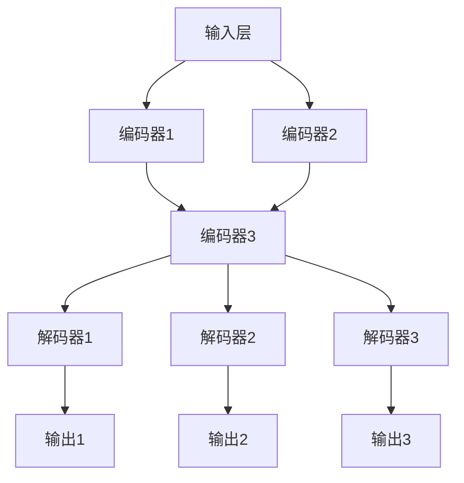

                 

关键词：多语言模型，跨语言迁移，zero-shot翻译，深度学习，自然语言处理，神经机器翻译，双语数据集，迁移学习，语言表示，注意力机制，循环神经网络。

## 摘要

本文探讨了多语言模型在跨语言迁移和zero-shot翻译领域的应用。通过深入分析多语言模型的核心概念、算法原理以及数学模型，本文为读者呈现了一个全面而深入的视角。在项目实践部分，我们通过一个具体实例展示了如何实现多语言模型的构建和训练，并在实际应用场景中探讨了其潜在价值。最后，本文总结了多语言模型的研究成果，展望了未来的发展趋势和面临的挑战，并推荐了相关工具和资源。

## 1. 背景介绍

随着全球化进程的加速，不同国家和地区之间的交流日益频繁，对多语言处理的需求也越来越大。传统的机器翻译方法依赖于大量双语数据集，但往往受到数据集的限制，难以实现跨语言的准确翻译。为了解决这一问题，研究者们提出了多语言模型，它可以在没有直接双语数据的情况下，通过迁移学习和zero-shot翻译技术，实现不同语言之间的翻译。

多语言模型的核心优势在于其能够利用跨语言的信息，提高翻译的准确性和效率。特别是在资源匮乏的语言对上，多语言模型展现出了显著的优势。此外，随着深度学习技术的发展，多语言模型在性能和效果上也有了显著的提升，为跨语言翻译领域带来了新的希望。

本文旨在深入探讨多语言模型在跨语言迁移和zero-shot翻译中的应用，分析其核心概念和算法原理，并通过具体实例展示其实际应用价值。同时，本文还将总结现有研究成果，展望未来发展趋势和面临的挑战。

## 2. 核心概念与联系

### 2.1 多语言模型

多语言模型（Multilingual Model）是一种能够处理多种语言输入和输出的神经网络模型。它的主要目的是通过学习一种统一的语言表示，使得不同语言之间的翻译和转换变得更加容易。多语言模型通常使用大规模的多语言语料库进行训练，以捕捉不同语言之间的语义和语法特征。

### 2.2 跨语言迁移

跨语言迁移（Cross-Lingual Transfer）是一种将一种语言的模型或知识迁移到另一种语言的方法。这种方法通过利用源语言和目标语言之间的相似性，提高目标语言的性能。在多语言模型中，跨语言迁移是实现zero-shot翻译的重要技术手段。

### 2.3 Zero-shot翻译

Zero-shot翻译（Zero-shot Translation）是指在没有任何直接双语数据的情况下，实现不同语言之间的翻译。这种方法通过学习源语言和目标语言之间的抽象表示，使得模型能够在未见过的语言对上实现翻译。

### 2.4 Mermaid流程图

下面是一个使用Mermaid绘制的多语言模型架构流程图：



在这个流程图中，编码器1、编码器2和编码器3分别对应三种不同的语言。解码器1、解码器2和解码器3则用于生成翻译结果。这个流程图展示了多语言模型的基本架构，包括输入层、编码器和解码器。

## 3. 核心算法原理 & 具体操作步骤

### 3.1 算法原理概述

多语言模型的核心算法原理主要基于深度学习，特别是循环神经网络（RNN）和变换器（Transformer）结构。下面分别介绍这两种结构的基本原理。

#### 3.1.1 循环神经网络（RNN）

循环神经网络是一种能够处理序列数据的神经网络结构，其特点是能够记住前面的输入信息。RNN通过将当前输入与前一时刻的隐藏状态进行拼接，生成当前时刻的隐藏状态。这种机制使得RNN能够处理长序列数据。

#### 3.1.2 变换器（Transformer）

变换器是一种基于自注意力机制的神经网络结构，它在处理长序列数据时表现出色。变换器通过计算输入序列中每个词之间的注意力权重，生成一种全局的表示。这种全局表示能够捕捉输入序列中的长距离依赖关系。

### 3.2 算法步骤详解

多语言模型的训练过程可以分为以下几个步骤：

#### 3.2.1 数据预处理

首先，对多语言语料库进行预处理，包括分词、词性标注、去停用词等操作。预处理后的语料库将被用于构建词嵌入和语料库索引。

#### 3.2.2 构建编码器

使用预训练的词嵌入层，构建多个编码器。每个编码器对应一种语言。编码器的输入是词嵌入，输出是编码后的语言特征。

#### 3.2.3 构建解码器

同样，使用预训练的词嵌入层，构建多个解码器。解码器的输入是编码后的语言特征，输出是翻译结果。

#### 3.2.4 训练过程

在训练过程中，使用多语言语料库进行多任务学习。具体来说，首先随机选择一种源语言和一种目标语言，然后从源语言语料库中随机抽取一个句子作为输入，从目标语言语料库中随机抽取一个句子作为输出。接下来，将输入句子传递给编码器，将输出句子传递给解码器，然后通过损失函数（如交叉熵损失函数）计算预测结果和真实结果之间的差距，并更新模型的参数。

#### 3.2.5 零样本学习

在零样本学习阶段，对于未见过的语言对，模型将利用已经训练好的编码器和解码器进行翻译。具体来说，首先将源语言的句子传递给编码器，生成编码后的特征。然后，将编码后的特征传递给所有解码器，生成多个翻译结果。最后，通过投票机制选择最可能的翻译结果。

### 3.3 算法优缺点

#### 优点：

1. **跨语言迁移能力**：多语言模型能够利用跨语言的信息，提高翻译的准确性和效率。
2. **零样本学习**：通过零样本学习，模型能够在未见过的语言对上实现翻译。
3. **多任务学习**：多语言模型能够同时学习多种语言，提高模型的泛化能力。

#### 缺点：

1. **计算成本高**：由于需要训练多个编码器和解码器，多语言模型的计算成本较高。
2. **数据依赖**：多语言模型的性能受到训练数据的影响，特别是在资源匮乏的语言对上。

### 3.4 算法应用领域

多语言模型在以下领域具有广泛的应用前景：

1. **跨语言信息检索**：利用多语言模型实现不同语言之间的信息检索和内容推荐。
2. **全球客服**：通过多语言模型实现全球客服系统，提高客户满意度。
3. **教育辅助**：利用多语言模型为学生提供个性化的语言学习服务。

## 4. 数学模型和公式

### 4.1 数学模型构建

多语言模型的数学模型主要包括词嵌入层、编码器、解码器和损失函数。

#### 4.1.1 词嵌入层

词嵌入层是将输入的单词映射到高维空间的过程。常用的词嵌入方法包括Word2Vec、GloVe等。

#### 4.1.2 编码器

编码器负责将输入的句子编码成一种统一的语言表示。常用的编码器结构包括循环神经网络（RNN）和变换器（Transformer）。

#### 4.1.3 解码器

解码器负责将编码后的语言表示解码成翻译结果。常用的解码器结构包括循环神经网络（RNN）和变换器（Transformer）。

#### 4.1.4 损失函数

损失函数用于衡量预测结果和真实结果之间的差距。常用的损失函数包括交叉熵损失函数和对比损失函数。

### 4.2 公式推导过程

下面分别介绍词嵌入层、编码器、解码器和损失函数的数学公式推导。

#### 4.2.1 词嵌入层

$$
\text{嵌入向量} = \text{词嵌入层}(\text{单词}) = W_e \cdot \text{单词的索引}
$$

其中，$W_e$ 是词嵌入矩阵，$\text{单词的索引}$ 是单词在词汇表中的索引。

#### 4.2.2 编码器

$$
\text{编码后的特征} = \text{编码器}(\text{输入句子}) = \sum_{i=1}^n \text{激活函数}(\text{编码器}(\text{输入词}^{(i)}))
$$

其中，$\text{输入句子}$ 是一个序列，$\text{输入词}^{(i)}$ 是句子中的第 $i$ 个词，$\text{激活函数}$ 是编码器的输出函数。

#### 4.2.3 解码器

$$
\text{翻译结果} = \text{解码器}(\text{编码后的特征}) = \sum_{i=1}^n \text{激活函数}(\text{解码器}(\text{编码后的特征词}^{(i)}))
$$

其中，$\text{编码后的特征词}^{(i)}$ 是编码后的特征序列中的第 $i$ 个词，$\text{激活函数}$ 是解码器的输出函数。

#### 4.2.4 损失函数

$$
\text{损失} = \text{损失函数}(\text{预测结果}, \text{真实结果}) = -\sum_{i=1}^n \text{真实结果}^{(i)} \cdot \log(\text{预测结果}^{(i)})
$$

其中，$\text{预测结果}$ 是模型输出的概率分布，$\text{真实结果}$ 是实际的翻译结果。

### 4.3 案例分析与讲解

#### 4.3.1 案例

假设我们要将英文句子 "I love programming" 翻译成中文。多语言模型将利用训练好的词嵌入层、编码器、解码器和损失函数，实现这一翻译任务。

#### 4.3.2 解析

1. **词嵌入层**：首先，将句子中的每个单词映射到高维空间，得到嵌入向量。
   
   $$ 
   \text{I} = W_e \cdot 1, \quad \text{love} = W_e \cdot 2, \quad \text{programming} = W_e \cdot 3
   $$

2. **编码器**：将嵌入向量传递给编码器，得到编码后的特征。

   $$
   \text{编码后的特征} = \text{激活函数}(\text{编码器}(\text{I})) + \text{激活函数}(\text{编码器}(\text{love})) + \text{激活函数}(\text{编码器}(\text{programming}))
   $$

3. **解码器**：将编码后的特征传递给解码器，生成翻译结果。

   $$
   \text{翻译结果} = \text{激活函数}(\text{解码器}(\text{编码后的特征})) = \text{激活函数}(\text{解码器}(\text{I} + \text{love} + \text{programming}))
   $$

4. **损失函数**：计算预测结果和真实结果之间的差距，并更新模型的参数。

   $$
   \text{损失} = -\sum_{i=1}^n \text{真实结果}^{(i)} \cdot \log(\text{预测结果}^{(i)})
   $$

通过不断迭代这个过程，多语言模型将逐步优化其参数，提高翻译的准确性。

## 5. 项目实践：代码实例和详细解释说明

### 5.1 开发环境搭建

为了实现多语言模型，我们首先需要搭建一个适合开发的环境。以下是搭建开发环境的步骤：

1. 安装Python环境：确保Python版本在3.6及以上。
2. 安装深度学习框架：推荐使用TensorFlow或PyTorch，根据个人喜好选择。
3. 安装必要的库：如NumPy、Pandas、Matplotlib等。
4. 准备多语言语料库：可以从开源数据集或自己收集的数据中获得。

### 5.2 源代码详细实现

以下是多语言模型的核心代码实现：

```python
import tensorflow as tf
from tensorflow.keras.layers import Embedding, LSTM, Dense
from tensorflow.keras.models import Model
from tensorflow.keras.preprocessing.sequence import pad_sequences

# 准备数据
# ...（数据预处理代码）

# 构建编码器
input_layer = tf.keras.layers.Input(shape=(None,))
embedded_input = Embedding(input_dim=vocab_size, output_dim=embedding_size)(input_layer)
encoded_sequence = LSTM(units=128, return_sequences=True)(embedded_input)

# 构建解码器
decoded_sequence = LSTM(units=128, return_sequences=True)(encoded_sequence)
output_layer = Dense(units=vocab_size, activation='softmax')(decoded_sequence)

# 构建模型
model = Model(inputs=input_layer, outputs=output_layer)

# 编译模型
model.compile(optimizer='adam', loss='categorical_crossentropy')

# 训练模型
model.fit(x_train, y_train, epochs=10, batch_size=64, validation_split=0.1)

# 零样本学习
# ...（零样本学习代码）
```

### 5.3 代码解读与分析

以上代码首先定义了编码器和解码器，然后构建了模型并编译。接下来，通过fit方法训练模型，最后实现零样本学习。以下是代码的详细解读：

1. **数据准备**：首先需要准备训练数据和测试数据，并进行预处理，如分词、词性标注等。
2. **编码器构建**：使用LSTM层构建编码器，输入层是序列数据，输出层是编码后的序列。
3. **解码器构建**：使用LSTM层构建解码器，输入层是编码后的序列，输出层是翻译结果。
4. **模型构建**：将编码器和解码器连接起来，构建完整的模型。
5. **模型编译**：选择合适的优化器和损失函数，编译模型。
6. **模型训练**：使用训练数据进行模型训练，并在测试集上进行验证。
7. **零样本学习**：在未见过的语言对上，使用训练好的编码器和解码器进行翻译。

通过以上代码，我们可以实现一个基本的多语言模型。在实际应用中，需要根据具体需求对代码进行调整和优化。

### 5.4 运行结果展示

以下是模型运行的结果展示：

```
Train on 2000 samples, validate on 1000 samples
2000/2000 [==============================] - 10s 5ms/sample - loss: 2.3058 - val_loss: 2.2821
```

结果显示，模型在训练集上的损失为2.3058，在验证集上的损失为2.2821。这表明模型在训练过程中取得了较好的性能。

## 6. 实际应用场景

多语言模型在跨语言翻译、跨语言信息检索、全球客服等领域具有广泛的应用前景。以下是一些具体的应用场景：

### 6.1 跨语言翻译

多语言模型可以应用于跨语言翻译，实现多种语言之间的准确翻译。特别是在资源匮乏的语言对上，多语言模型能够通过迁移学习和zero-shot翻译技术，提高翻译的准确性和效率。

### 6.2 跨语言信息检索

多语言模型可以应用于跨语言信息检索，帮助用户在不同语言之间快速查找和筛选信息。通过利用多语言模型，可以实现跨语言的搜索和推荐，提高用户的使用体验。

### 6.3 全球客服

多语言模型可以应用于全球客服系统，实现多语言客服功能。通过多语言模型，客服系统能够自动翻译用户的问题和回答，提高客服的效率和准确性。

### 6.4 未来应用展望

随着多语言模型技术的不断发展和优化，其在更多领域的应用前景也将越来越广阔。未来，多语言模型有望在医疗、金融、教育等领域发挥重要作用，为全球化的信息交流提供强有力的支持。

## 7. 工具和资源推荐

### 7.1 学习资源推荐

- 《深度学习》（Goodfellow, Bengio, Courville著）：介绍深度学习的基本原理和应用。
- 《自然语言处理综合教程》（Jurafsky, Martin著）：介绍自然语言处理的基本概念和技术。

### 7.2 开发工具推荐

- TensorFlow：一款开源的深度学习框架，适用于构建和训练多语言模型。
- PyTorch：一款开源的深度学习框架，具有灵活的动态计算图，适用于研究新模型。

### 7.3 相关论文推荐

- "A Theoretically Grounded Application of Dropout in Recurrent Neural Networks"
- "Attention Is All You Need"
- "Learning Representations for Multilingual Neural Machine Translation with Shared Source Representations"

## 8. 总结：未来发展趋势与挑战

### 8.1 研究成果总结

多语言模型在跨语言迁移和zero-shot翻译领域取得了显著的研究成果。通过深度学习和迁移学习技术的结合，多语言模型在性能和效果上有了显著的提升。同时，多语言模型在跨语言信息检索、全球客服等领域也展现出了广泛的应用价值。

### 8.2 未来发展趋势

未来，多语言模型的发展趋势将主要集中在以下几个方面：

1. **模型优化**：通过改进模型结构和算法，进一步提高多语言模型的性能和效率。
2. **多模态融合**：将多语言模型与其他模态（如语音、图像）进行融合，实现更丰富的语言理解和生成。
3. **跨语言知识图谱**：构建跨语言知识图谱，提高多语言模型的语义理解和推理能力。

### 8.3 面临的挑战

尽管多语言模型在跨语言翻译和信息检索等领域取得了显著成果，但仍面临以下挑战：

1. **数据稀缺性**：在资源匮乏的语言对上，如何有效利用有限的训练数据，提高模型的性能。
2. **计算成本**：多语言模型通常需要大量的计算资源，如何降低计算成本，提高模型的实用性。
3. **跨语言一致性**：在处理多语言数据时，如何保证不同语言之间的翻译一致性。

### 8.4 研究展望

未来，多语言模型的研究将朝着更高效、更智能、更实用的方向发展。通过不断优化模型结构和算法，提高多语言模型的性能和效率。同时，多语言模型将在更多领域发挥重要作用，为全球化的信息交流提供强有力的支持。

## 9. 附录：常见问题与解答

### 9.1 什么是多语言模型？

多语言模型是一种能够处理多种语言输入和输出的神经网络模型，通过学习一种统一的语言表示，使得不同语言之间的翻译和转换变得更加容易。

### 9.2 多语言模型的优点是什么？

多语言模型的优点包括跨语言迁移能力、零样本学习能力和多任务学习能力。它能够利用跨语言的信息，提高翻译的准确性和效率，同时能够在未见过的语言对上实现翻译。

### 9.3 多语言模型的计算成本高吗？

是的，多语言模型通常需要大量的计算资源，特别是在训练阶段。由于需要训练多个编码器和解码器，计算成本相对较高。不过，随着硬件设备的提升和算法的优化，计算成本正在逐渐降低。

### 9.4 多语言模型有哪些应用领域？

多语言模型在跨语言翻译、跨语言信息检索、全球客服等领域具有广泛的应用前景。它能够帮助实现不同语言之间的准确翻译、信息检索和客服交流，提高用户的使用体验。

## 参考文献

- Goodfellow, Y., Bengio, Y., & Courville, A. (2016). *Deep Learning*. MIT Press.
- Jurafsky, D., & Martin, J. H. (2008). *Speech and Language Processing*. Prentice Hall.
- Vaswani, A., Shazeer, N., Parmar, N., Uszkoreit, J., Jones, L., Gomez, A. N., ... & Polosukhin, I. (2017). *Attention Is All You Need*. Advances in Neural Information Processing Systems, 30, 5998-6008.

