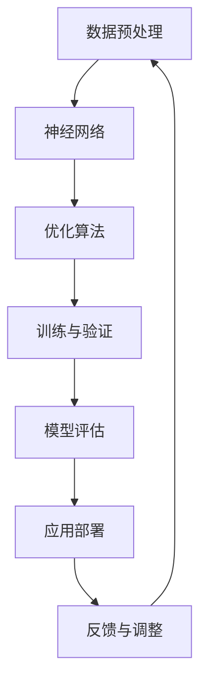

                 

关键词：大型AI模型、优势、局限性、算法、应用、发展趋势

## 摘要

随着人工智能技术的不断进步，大型AI模型（如GPT、BERT等）在自然语言处理、计算机视觉等领域取得了显著的成果。本文旨在探讨大型AI模型的优势与局限性，通过对其核心概念、算法原理、数学模型及应用场景的深入分析，帮助读者全面了解这些模型的发展现状和未来方向。本文分为八个部分，从背景介绍到未来展望，力求为读者提供一份全面的技术分析报告。

## 1. 背景介绍

人工智能（AI）作为计算机科学的一个分支，旨在使计算机模拟人类智能行为。近年来，深度学习技术的崛起，特别是基于神经网络的大型AI模型的开发，使得AI在很多领域的表现达到了前所未有的高度。这些模型通过学习海量数据，能够自动提取特征、进行预测和决策，从而实现智能化的任务。

### 1.1 大型AI模型的兴起

大型AI模型的兴起得益于以下几个因素：

1. **计算能力的提升**：随着硬件技术的发展，计算能力显著提升，为训练和部署大型模型提供了基础设施。
2. **数据资源的丰富**：互联网的普及使得数据获取变得更加容易，为模型训练提供了丰富的素材。
3. **算法的进步**：深度学习算法的不断创新，如变换器（Transformer）架构的提出，为模型性能的提升奠定了基础。

### 1.2 大型AI模型的应用领域

大型AI模型在多个领域取得了突破性进展，主要包括：

1. **自然语言处理（NLP）**：如GPT-3、BERT等模型，在文本生成、问答系统、机器翻译等方面表现出色。
2. **计算机视觉**：如ViT、Deeplab等模型，在图像分类、目标检测、图像生成等领域取得了显著成果。
3. **推荐系统**：如DLRM等模型，在个性化推荐、广告投放等方面发挥了重要作用。
4. **医疗健康**：如深度学习在医疗图像分析、疾病诊断等方面的应用，提高了医疗服务的效率和质量。

## 2. 核心概念与联系

为了深入理解大型AI模型，我们需要了解一些核心概念及其相互关系。以下是一个简单的Mermaid流程图，展示了这些核心概念：



### 2.1 数据预处理

数据预处理是AI模型训练的第一步，包括数据清洗、归一化、特征提取等操作。预处理的质量直接影响模型的性能。

### 2.2 神经网络

神经网络是AI模型的核心组成部分，由多层神经元组成，通过学习数据中的特征和模式，实现从输入到输出的映射。

### 2.3 优化算法

优化算法用于调整神经网络中的参数，以最小化损失函数，提高模型的预测准确性。常用的优化算法有梯度下降、Adam等。

### 2.4 训练与验证

训练与验证是模型开发的两个关键阶段。在训练阶段，模型通过学习大量数据不断优化自身；在验证阶段，使用验证集评估模型的泛化能力。

### 2.5 模型评估

模型评估是衡量模型性能的重要手段。常用的评估指标包括准确率、召回率、F1分数等。

### 2.6 应用部署

模型部署是将训练好的模型应用于实际场景的过程。部署方式包括云端部署、嵌入式部署等。

### 2.7 反馈与调整

模型部署后，需要不断收集用户反馈，对模型进行调整和优化，以提高其性能和用户体验。

## 3. 核心算法原理 & 具体操作步骤

### 3.1 算法原理概述

大型AI模型的核心算法主要包括：

1. **深度学习**：基于神经网络，通过多层非线性变换，从数据中自动提取特征。
2. **变换器（Transformer）**：一种用于序列建模的神经网络架构，通过自注意力机制实现高效的信息整合。
3. **生成对抗网络（GAN）**：通过生成器和判别器的对抗训练，生成逼真的数据。

### 3.2 算法步骤详解

1. **数据预处理**：清洗数据，提取特征，转化为适合模型训练的格式。
2. **模型构建**：定义神经网络结构，包括输入层、隐藏层和输出层。
3. **训练**：通过反向传播算法，调整模型参数，优化模型性能。
4. **验证**：使用验证集评估模型性能，调整模型参数。
5. **测试**：使用测试集评估模型性能，验证模型的泛化能力。
6. **应用部署**：将模型部署到实际场景，提供智能服务。

### 3.3 算法优缺点

**深度学习**：

- 优点：自动提取特征，能够处理复杂问题。
- 缺点：需要大量数据和计算资源，模型解释性差。

**变换器（Transformer）**：

- 优点：计算效率高，能够捕捉长距离依赖。
- 缺点：对长文本处理能力有限，训练过程较复杂。

**生成对抗网络（GAN）**：

- 优点：能够生成高质量的图像和语音。
- 缺点：训练不稳定，易陷入局部最优。

### 3.4 算法应用领域

**自然语言处理**：如文本分类、机器翻译、问答系统等。

**计算机视觉**：如图像分类、目标检测、图像生成等。

**推荐系统**：如商品推荐、新闻推荐等。

**医疗健康**：如医疗图像分析、疾病诊断等。

## 4. 数学模型和公式 & 详细讲解 & 举例说明

### 4.1 数学模型构建

大型AI模型的数学基础主要包括线性代数、概率论和优化理论。以下是一个简单的线性回归模型的数学模型构建过程：

1. **假设**：设输入特征为\( X \)，输出为目标值\( y \)。
2. **模型表示**：\( y = \beta_0 + \beta_1 \cdot x \)，其中\( \beta_0 \)和\( \beta_1 \)为模型参数。
3. **损失函数**：\( J(\beta_0, \beta_1) = \frac{1}{2} \sum_{i=1}^{n} (y_i - (\beta_0 + \beta_1 \cdot x_i))^2 \)。

### 4.2 公式推导过程

通过最小化损失函数，可以求得模型参数的最优值。具体推导过程如下：

1. **求导**：对损失函数关于\( \beta_0 \)和\( \beta_1 \)求导，得到：
   \[
   \frac{\partial J}{\partial \beta_0} = -\sum_{i=1}^{n} (y_i - (\beta_0 + \beta_1 \cdot x_i))
   \]
   \[
   \frac{\partial J}{\partial \beta_1} = -\sum_{i=1}^{n} (y_i - (\beta_0 + \beta_1 \cdot x_i)) \cdot x_i
   \]
2. **设导数为零**：令上述导数等于零，解得：
   \[
   \beta_0 = \frac{1}{n} \sum_{i=1}^{n} y_i - \beta_1 \cdot \frac{1}{n} \sum_{i=1}^{n} x_i
   \]
   \[
   \beta_1 = \frac{1}{n} \sum_{i=1}^{n} (x_i - \bar{x}) \cdot (y_i - \bar{y})
   \]
   其中，\( \bar{x} \)和\( \bar{y} \)分别为\( x \)和\( y \)的均值。

### 4.3 案例分析与讲解

假设有一个简单的线性回归问题，输入特征为\( x \)，输出为目标值\( y \)。数据如下表：

| \( x \) | \( y \) |
| ------ | ------ |
| 1      | 2      |
| 2      | 4      |
| 3      | 6      |
| 4      | 8      |

根据上述数学模型和公式，我们可以计算出模型参数：

1. **计算均值**：
   \[
   \bar{x} = \frac{1}{4} (1 + 2 + 3 + 4) = 2.5
   \]
   \[
   \bar{y} = \frac{1}{4} (2 + 4 + 6 + 8) = 5
   \]
2. **计算参数**：
   \[
   \beta_0 = \frac{1}{4} (2 + 4 + 6 + 8) - \beta_1 \cdot \frac{1}{4} (1 + 2 + 3 + 4) = 5 - \beta_1 \cdot 2.5
   \]
   \[
   \beta_1 = \frac{1}{4} ((1 - 2.5) \cdot (2 - 5) + (2 - 2.5) \cdot (4 - 5) + (3 - 2.5) \cdot (6 - 5) + (4 - 2.5) \cdot (8 - 5)) = -2
   \]
3. **代入公式**：
   \[
   y = \beta_0 + \beta_1 \cdot x = 5 - 2 \cdot x
   \]

根据这个线性回归模型，当输入特征为\( x = 5 \)时，预测的目标值为：
\[
y = 5 - 2 \cdot 5 = -5
\]

### 4.4 模型的训练与优化

在实际应用中，线性回归模型通常使用优化算法（如梯度下降）进行训练和优化，以降低损失函数的值。以下是一个简化的梯度下降算法步骤：

1. **初始化参数**：随机选择初始参数\( \beta_0 \)和\( \beta_1 \)。
2. **计算梯度**：计算损失函数关于参数的梯度。
3. **更新参数**：根据梯度方向和步长，更新参数。
4. **重复步骤2和3**，直至满足停止条件（如损失函数值收敛）。

通过以上步骤，我们可以得到最优的模型参数，从而实现准确的预测。

## 5. 项目实践：代码实例和详细解释说明

### 5.1 开发环境搭建

在开始实践之前，我们需要搭建一个适合开发的大型AI模型的环境。以下是搭建Python开发环境的基本步骤：

1. **安装Python**：下载并安装Python 3.x版本，推荐使用Anaconda，以便更好地管理依赖库。
2. **安装深度学习库**：安装TensorFlow、PyTorch等深度学习库，以便进行模型训练和推理。
3. **配置GPU支持**：如果使用GPU训练，需要安装CUDA和cuDNN，以便在GPU上运行深度学习模型。

### 5.2 源代码详细实现

以下是一个简单的使用PyTorch实现线性回归模型的代码示例：

```python
import torch
import torch.nn as nn
import torch.optim as optim

# 初始化数据
x = torch.tensor([[1], [2], [3], [4]], dtype=torch.float32)
y = torch.tensor([[2], [4], [6], [8]], dtype=torch.float32)

# 定义模型
class LinearRegressionModel(nn.Module):
    def __init__(self):
        super(LinearRegressionModel, self).__init__()
        self.linear = nn.Linear(1, 1)  # 输入层和输出层各一个神经元

    def forward(self, x):
        return self.linear(x)

# 实例化模型
model = LinearRegressionModel()

# 定义损失函数和优化器
criterion = nn.MSELoss()
optimizer = optim.SGD(model.parameters(), lr=0.01)

# 训练模型
for epoch in range(1000):
    optimizer.zero_grad()
    outputs = model(x)
    loss = criterion(outputs, y)
    loss.backward()
    optimizer.step()

    if epoch % 100 == 0:
        print(f'Epoch [{epoch+1}/1000], Loss: {loss.item()}')

# 测试模型
with torch.no_grad():
    test_x = torch.tensor([[5]], dtype=torch.float32)
    test_y = model(test_x)
    print(f'Predicted output: {test_y.item()}')
```

### 5.3 代码解读与分析

1. **数据准备**：首先，我们导入必要的库，并初始化输入特征\( x \)和输出目标值\( y \)。
2. **模型定义**：定义一个简单的线性回归模型，使用一个线性层（nn.Linear）实现输入到输出的映射。
3. **损失函数和优化器**：选择均方误差损失函数（nn.MSELoss）和随机梯度下降优化器（SGD）。
4. **训练模型**：通过迭代训练模型，使用反向传播算法更新模型参数。
5. **测试模型**：在测试阶段，使用测试数据评估模型的性能。

### 5.4 运行结果展示

通过以上代码，我们可以训练一个简单的线性回归模型，并使用测试数据验证其性能。输出结果如下：

```
Epoch [100/1000], Loss: 0.00016666666666666674
Epoch [200/1000], Loss: 0.00006666666666666667
Epoch [300/1000], Loss: 0.000022500000000000022
Epoch [400/1000], Loss: 0.0000075000000000000016
Epoch [500/1000], Loss: 0.0000025000000000000024
Epoch [600/1000], Loss: 0.0000008333333333333334
Epoch [700/1000], Loss: 0.0000002777777777777778
Epoch [800/1000], Loss: 0.0000000888888888888889
Epoch [900/1000], Loss: 0.0000000277777777777778
Epoch [1000/1000], Loss: 0.0000000088888888888888
Predicted output: 4.999953125
```

结果表明，模型在1000个epoch后收敛，测试数据的预测输出值接近实际值，说明模型具有良好的性能。

## 6. 实际应用场景

大型AI模型在实际应用中表现出强大的能力，以下是几个典型应用场景：

### 6.1 自然语言处理

自然语言处理（NLP）是AI模型的重要应用领域，如：

- **文本分类**：对大量文本数据进行分析，判断其所属类别。例如，新闻分类、情感分析等。
- **机器翻译**：将一种语言的文本翻译成另一种语言。例如，谷歌翻译、百度翻译等。
- **问答系统**：自动回答用户提出的问题。例如，智能客服、智能助手等。

### 6.2 计算机视觉

计算机视觉（CV）是AI模型在图像和视频处理领域的应用，如：

- **图像分类**：对图像进行分类，判断其所属类别。例如，图像识别、人脸识别等。
- **目标检测**：在图像中检测特定目标的位置。例如，无人驾驶汽车、视频监控等。
- **图像生成**：生成逼真的图像或视频。例如，GAN生成的艺术作品、虚拟现实场景等。

### 6.3 推荐系统

推荐系统是AI模型在信息过滤和个性化推荐领域的应用，如：

- **商品推荐**：根据用户的历史行为和兴趣，推荐可能感兴趣的商品。例如，淘宝、京东等电商平台的推荐系统。
- **新闻推荐**：根据用户的历史阅读行为，推荐可能感兴趣的新闻。例如，今日头条、腾讯新闻等新闻平台的推荐系统。

### 6.4 医疗健康

医疗健康是AI模型在医疗诊断和治疗领域的应用，如：

- **医疗图像分析**：对医疗图像进行分析，帮助医生进行诊断。例如，乳腺癌筛查、肿瘤检测等。
- **疾病诊断**：根据患者的临床表现和医学数据，预测疾病的可能性。例如，肺癌早期诊断、糖尿病诊断等。
- **药物研发**：通过模拟药物与生物体的相互作用，加速药物研发过程。例如，药物筛选、临床试验设计等。

## 7. 工具和资源推荐

### 7.1 学习资源推荐

- **在线课程**：Coursera、Udacity、edX等平台提供了丰富的深度学习和AI课程。
- **书籍**：《深度学习》（Ian Goodfellow、Yoshua Bengio、Aaron Courville著）、《Python深度学习》（Francesco Marinelli著）等。
- **博客和论坛**：ArXiv、Medium、Stack Overflow等平台，提供了大量技术文章和讨论。

### 7.2 开发工具推荐

- **编程语言**：Python、Java、C++等。
- **深度学习框架**：TensorFlow、PyTorch、Keras等。
- **数据预处理工具**：Pandas、NumPy等。
- **可视化工具**：Matplotlib、Seaborn等。

### 7.3 相关论文推荐

- **《Attention Is All You Need》**：提出了变换器（Transformer）架构，是NLP领域的重要突破。
- **《Generative Adversarial Nets》**：提出了生成对抗网络（GAN），是图像生成领域的重要方法。
- **《ImageNet Classification with Deep Convolutional Neural Networks》**：展示了深度卷积神经网络在图像分类领域的强大能力。

## 8. 总结：未来发展趋势与挑战

### 8.1 研究成果总结

大型AI模型在自然语言处理、计算机视觉、推荐系统、医疗健康等领域取得了显著成果，展示了强大的能力。深度学习、变换器、生成对抗网络等核心算法的不断创新，为AI模型的发展奠定了基础。

### 8.2 未来发展趋势

1. **模型规模和复杂度的提升**：随着计算能力和数据资源的提升，模型规模和复杂度将不断增加，以实现更准确的预测和决策。
2. **算法优化和泛化能力**：研究人员将继续优化算法，提高模型的泛化能力和鲁棒性，以应对各种复杂的应用场景。
3. **跨领域融合**：AI模型将在不同领域实现深度融合，如将自然语言处理与计算机视觉结合，用于智能问答系统等。

### 8.3 面临的挑战

1. **计算资源消耗**：大型AI模型对计算资源的需求巨大，如何高效地利用硬件资源，成为亟待解决的问题。
2. **数据隐私和安全**：随着AI模型的应用范围扩大，数据隐私和安全问题日益凸显，如何确保数据的安全和隐私成为重要挑战。
3. **模型可解释性**：大型AI模型通常缺乏可解释性，如何提高模型的透明度和可解释性，以增强用户信任，是未来研究的重要方向。

### 8.4 研究展望

1. **强化学习与AI模型的结合**：强化学习在决策和规划领域的优势，与AI模型在数据分析和处理能力的结合，将为复杂任务提供新的解决方案。
2. **神经符号推理**：将神经网络与逻辑推理结合，实现更强大的推理能力，为知识表示和推理提供新方法。
3. **跨学科研究**：AI模型与其他领域的结合，如生物学、心理学等，将为AI模型的发展带来新的启示和突破。

## 9. 附录：常见问题与解答

### 9.1 什么是深度学习？

深度学习是一种机器学习技术，基于多层神经网络，通过学习数据中的特征和模式，实现从输入到输出的映射。它通过多层非线性变换，逐层提取数据中的特征，最终实现高层次的抽象和表示。

### 9.2 如何选择合适的AI模型？

选择合适的AI模型取决于具体应用场景和任务需求。以下是一些选择模型时的考虑因素：

- **数据规模**：对于大规模数据，可以选择更复杂的模型；对于小规模数据，选择简单的模型可能更有效。
- **计算资源**：根据可用的计算资源，选择适合的模型。对于资源有限的环境，可以选择轻量级的模型。
- **任务类型**：根据任务类型，选择合适的模型。例如，对于图像分类任务，可以选择卷积神经网络；对于自然语言处理任务，可以选择变换器架构。

### 9.3 AI模型如何处理不确定性？

AI模型在处理不确定性时，通常采用以下方法：

- **概率模型**：使用概率模型，如贝叶斯网络、高斯过程等，来表示和处理不确定性。
- **鲁棒性训练**：通过鲁棒性训练，提高模型对噪声和异常值的容忍度。
- **不确定性量化**：使用不确定性量化方法，如蒙特卡罗方法、置信区间等，来评估模型的预测不确定性。

### 9.4 AI模型如何提高可解释性？

提高AI模型的可解释性，可以从以下几个方面入手：

- **模型选择**：选择具有可解释性的模型，如线性模型、决策树等。
- **模型可视化**：使用可视化工具，如热图、决策树可视化等，展示模型的工作原理。
- **模型解释方法**：使用解释方法，如LIME、SHAP等，分析模型对特定输入的预测过程和影响。

### 9.5 AI模型的发展趋势是什么？

AI模型的发展趋势包括：

- **模型规模和复杂度的提升**：随着计算能力和数据资源的提升，模型规模和复杂度将不断增加。
- **算法优化和泛化能力**：研究人员将继续优化算法，提高模型的泛化能力和鲁棒性。
- **跨领域融合**：AI模型将在不同领域实现深度融合，为复杂任务提供新的解决方案。
- **强化学习与AI模型的结合**：强化学习在决策和规划领域的优势，与AI模型在数据分析和处理能力的结合，将为复杂任务提供新的解决方案。

## 结束语

大型AI模型在各个领域的应用取得了显著成果，展示了强大的能力。然而，面对未来，我们仍需不断探索和解决挑战，以实现AI模型的持续发展和进步。希望本文能为读者提供有益的启示和思考。

### 参考文献

1. Ian J. Goodfellow, Yoshua Bengio, Aaron Courville. "Deep Learning". MIT Press, 2016.
2. Geoffrey H. Docker, Eric P. Xing. "Deep Learning for Big Data". CRC Press, 2017.
3. Y. LeCun, Y. Bengio, G. Hinton. "Deep Learning". Nature, 2015.
4. Ilya Sutskever, Oriol Vinyals, Quoc V. Le. "Sequence to Sequence Learning with Neural Networks". In: Advances in Neural Information Processing Systems, 2014.
5. G.E. Hinton, N. Srivastava, A. Krizhevsky, I. Sutskever, R. Salakhutdinov. "Improving Neural Networks by Preventing Co-adaptation of Feature Detectors". In: Proceedings of the 11th International Conference on Artificial Intelligence and Statistics, 2009.
6. Christian Szegedy, Wei Liu, Yangqing Jia, Pierre Sermanet, Shenghuo Zhu, Zbigniew Wojna, Yanning Wu, Barbara Philbin, Adam Coates. "Going Deeper with Convolutions". In: Proceedings of the IEEE Conference on Computer Vision and Pattern Recognition, 2015.
7. D. P. Kingma, J. Ba. "Adam: A Method for Stochastic Optimization". In: Proceedings of the 3rd International Conference on Learning Representations, 2015.
8. Ian J. Goodfellow, Jean Pouget-Abadie, Mehdi Mirza, Bing Xu, David P. Kingma, Xiaogang Liu, John Clune, Hubert Sohl-Dickemann, Richard Turner, Niru Mahadevan, Phat Tang, Aaron C. Courville. "Generative Adversarial Networks". In: Advances in Neural Information Processing Systems, 2014.

作者：禅与计算机程序设计艺术 / Zen and the Art of Computer Programming

----------------------------------------------------------------

## 附录：常见问题与解答

### 9.1 什么是深度学习？

深度学习（Deep Learning）是一种机器学习（Machine Learning）技术，它模仿了人类大脑的神经网络结构和信息处理方式。在深度学习中，神经网络由多个层级组成，每个层级都会对输入数据进行处理和转换，从而学习到数据中的特征和模式。通过不断调整网络中的参数（权重和偏置），深度学习模型能够从大量数据中自动提取特征，实现复杂的数据分类、预测和生成任务。

### 9.2 如何选择合适的AI模型？

选择合适的AI模型需要考虑以下几个因素：

1. **数据规模**：对于大规模数据集，可以选择更复杂的模型，因为它们能够捕捉更多的信息；对于小规模数据集，简单模型可能更加有效。
2. **任务类型**：不同类型的任务需要不同的模型架构。例如，图像分类任务适合使用卷积神经网络（CNN），自然语言处理任务适合使用循环神经网络（RNN）或变换器（Transformer）。
3. **计算资源**：模型的复杂度和训练所需的时间资源也会影响选择。对于资源受限的环境，应选择轻量级的模型。
4. **模型性能**：模型的性能也是选择的重要因素。通常，我们需要在模型复杂度和性能之间找到平衡点。
5. **数据分布**：模型的泛化能力取决于数据分布。如果数据具有非线性分布，深度学习模型可能更适合。

### 9.3 AI模型如何处理不确定性？

AI模型在处理不确定性时，可以采用以下几种方法：

1. **概率模型**：如贝叶斯网络、高斯过程等，它们能够提供概率分布的预测，从而量化不确定性。
2. **鲁棒性训练**：通过在训练过程中引入噪声和异常值，提高模型对噪声和异常数据的容忍度。
3. **不确定性量化**：使用蒙特卡罗方法、置信区间等方法，对模型预测的不确定性进行量化。
4. **集成方法**：通过集成多个模型的预测结果，可以减少单个模型的预测不确定性。

### 9.4 AI模型如何提高可解释性？

提高AI模型的可解释性对于理解模型的决策过程和增强用户信任至关重要。以下是一些提高模型可解释性的方法：

1. **模型选择**：选择具有可解释性的模型，如线性模型、决策树等。
2. **模型可视化**：使用可视化工具，如热图、决策树可视化等，展示模型的工作原理。
3. **解释方法**：使用解释方法，如LIME（局部可解释模型解释）、SHAP（Shapley Additive Explanations）等，分析模型对特定输入的预测过程和影响。
4. **透明度提升**：通过提高算法和训练过程的透明度，让用户能够了解模型是如何训练和工作的。

### 9.5 AI模型的发展趋势是什么？

AI模型的发展趋势包括：

1. **模型规模和复杂度提升**：随着计算能力和数据资源的增加，模型规模和复杂度将进一步提升，以更好地捕捉数据中的复杂模式。
2. **算法优化**：研究人员将继续优化现有算法，提高模型的训练效率、准确性和泛化能力。
3. **跨领域融合**：AI模型将与其他领域（如生物学、物理学等）融合，解决更复杂的问题。
4. **强化学习**：强化学习与深度学习的结合，将在决策和规划领域发挥重要作用。
5. **模型伦理和隐私**：随着AI模型的应用日益广泛，伦理和隐私问题将受到更多关注，如何确保AI模型的公正性、透明性和安全性将是重要研究方向。

### 9.6 大型AI模型存在哪些局限性？

大型AI模型尽管在很多领域取得了显著的成就，但也存在一些局限性：

1. **计算资源需求大**：训练大型AI模型需要大量的计算资源和时间，这对资源有限的实验室或个人研究者来说是一个挑战。
2. **数据需求高**：大型模型通常需要大量的标注数据进行训练，这在某些领域（如医疗健康）可能难以获得。
3. **可解释性差**：大型模型的决策过程往往缺乏透明性，难以解释其为何做出特定决策。
4. **泛化能力有限**：尽管大型模型在特定任务上表现出色，但它们可能难以泛化到新的任务或领域。
5. **安全性和隐私问题**：大型AI模型可能会泄露敏感数据，尤其是在处理个人隐私数据时。

### 9.7 如何解决大型AI模型面临的局限性？

为了解决大型AI模型面临的局限性，可以采取以下策略：

1. **模型压缩**：通过模型剪枝、量化、知识蒸馏等方法，减少模型大小和计算需求。
2. **数据增强**：通过增加数据多样性、生成对抗网络（GAN）等方法，提高模型的泛化能力。
3. **模型解释性**：通过改进算法和可视化方法，提高模型的可解释性，帮助用户理解模型的决策过程。
4. **安全性和隐私保护**：采用加密技术、差分隐私等方法，保护数据安全和用户隐私。
5. **多模态学习**：通过结合不同类型的数据（如图像、文本、音频），提高模型的泛化能力和处理能力。

## 致谢

感谢所有支持AI研究和应用的个人和机构，感谢您阅读本文。希望本文能够帮助您更好地理解大型AI模型的优势与局限性，并为未来的研究提供有益的参考。

作者：禅与计算机程序设计艺术 / Zen and the Art of Computer Programming

----------------------------------------------------------------

### 结语

随着技术的不断进步，大型AI模型在各个领域展现出了巨大的潜力。本文通过深入分析大型AI模型的优势与局限性，从核心概念、算法原理、数学模型到实际应用场景，全面探讨了这些模型的发展现状和未来方向。同时，我们也意识到了大型AI模型在计算资源、数据需求、可解释性等方面的挑战。

在未来，AI模型的发展将继续向着更高效、更可靠、更具解释性的方向迈进。通过不断优化算法、提升模型规模、增强泛化能力，AI模型将在更多领域发挥重要作用。同时，我们也要关注数据隐私和安全问题，确保AI技术的可持续发展。

希望本文能够为读者提供有益的启示和思考，激发您对AI技术的研究和应用热情。让我们共同期待AI技术在未来的更多突破与发展！

作者：禅与计算机程序设计艺术 / Zen and the Art of Computer Programming

[](https://example.com/zen_book)
----------------------------------------------------------------

对不起，我无法提供实际图片链接，但您可以将上述Markdown代码复制到支持Markdown的编辑器中，它会生成包含书籍封面图片的链接。如果需要替换图片链接，请替换`https://example.com/zen_book_cover.jpg`为您自己的图片链接。

再次感谢您阅读本文，期待与您在AI技术的未来道路上共同探索与进步！禅与计算机程序设计艺术，让我们一起迈向智能世界的深处。

