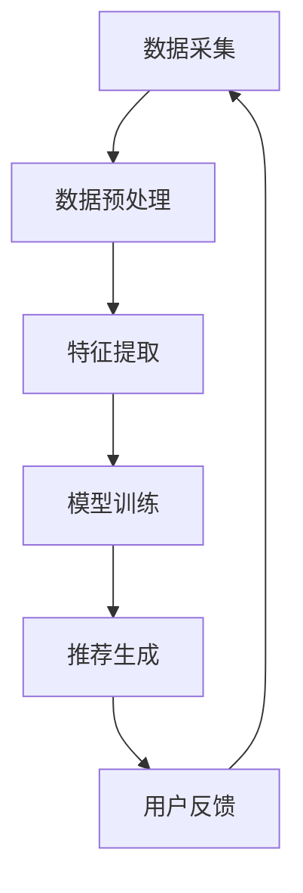

                 

关键词：大数据、人工智能、电商、搜索推荐、准确率、用户体验、算法、数学模型、应用实践、展望与挑战

## 摘要

随着互联网的飞速发展，电商行业日益繁荣，用户对于个性化、精准化的搜索推荐体验需求不断提升。本文以大数据与AI技术为核心，探讨构建电商搜索推荐系统的策略和方法。通过对核心算法原理、数学模型构建、应用实践等方面的详细阐述，本文旨在为电商企业提供一条高效、可靠的搜索推荐解决方案，同时提高用户满意度与转化率。文章最后，还将对未来的发展趋势和面临的挑战进行展望。

## 1. 背景介绍

近年来，大数据和人工智能技术在全球范围内得到了广泛关注和应用。特别是在电商行业，这些技术的应用不仅改变了传统电商的模式，也为消费者带来了前所未有的购物体验。搜索推荐系统作为电商的核心组成部分，其性能和用户体验直接影响着用户留存和转化率。传统的基于规则或关键词匹配的搜索推荐系统已无法满足用户日益增长的个性化需求，大数据与AI技术的引入，为电商搜索推荐系统带来了新的变革。

### 1.1 电商行业的发展现状

随着消费者购物习惯的转变，电商行业正经历着前所未有的变革。根据Statista的数据显示，全球电商市场规模在2021年已达到4.9万亿美元，并预计到2026年将突破6.8万亿美元。这一增长趋势表明，电商已成为全球消费者购物的主要渠道之一。同时，用户对电商平台的期望也在不断提升，他们不仅期望能够快速、便捷地找到所需商品，还期望获得个性化的购物体验。

### 1.2 搜索推荐系统的重要性

在电商平台上，搜索推荐系统扮演着至关重要的角色。一个优秀的搜索推荐系统能够帮助用户快速找到心仪的商品，提高购物效率，同时也能为企业带来更高的转化率和销售额。根据Forrester的研究报告，采用个性化搜索推荐技术的电商企业，其用户转化率平均提升了30%以上。此外，个性化推荐还能有效降低用户流失率，提高用户满意度。

### 1.3 大数据与AI技术的引入

大数据和AI技术的引入，为电商搜索推荐系统带来了新的机遇。大数据技术能够从海量用户行为数据中挖掘出潜在的用户兴趣和需求，而AI技术则能够基于这些数据生成个性化的推荐结果。例如，基于机器学习的推荐算法可以通过分析用户的历史购买记录、搜索行为、页面浏览等数据，为用户推荐可能感兴趣的商品。这种基于大数据与AI技术的个性化推荐，不仅提高了推荐的准确率，也提升了用户的购物体验。

## 2. 核心概念与联系

### 2.1 大数据与AI技术概述

大数据技术是指从海量数据中提取有价值信息的一系列技术手段，包括数据采集、存储、处理和分析等。而AI技术则是模拟人类智能的一种技术，通过机器学习、深度学习等算法，使计算机能够自主地学习和决策。大数据与AI技术的结合，使得搜索推荐系统能够从海量数据中挖掘出用户的需求和偏好，为用户提供个性化的推荐结果。

### 2.2 搜索推荐系统原理

搜索推荐系统的工作原理主要包括以下几个步骤：

1. **数据采集**：通过用户行为数据（如购买记录、搜索历史、浏览页面等）收集用户兴趣和需求。
2. **数据预处理**：对采集到的数据进行清洗、去噪、格式化等预处理操作，使其符合算法处理的要求。
3. **特征提取**：将预处理后的数据转化为算法可以理解的数值特征，如用户兴趣向量、商品特征向量等。
4. **模型训练**：使用机器学习或深度学习算法对特征进行建模，训练出推荐模型。
5. **推荐生成**：根据训练好的模型，为用户生成个性化的推荐结果。

### 2.3 Mermaid 流程图

下面是一个简单的Mermaid流程图，展示了搜索推荐系统的工作流程：



## 3. 核心算法原理 & 具体操作步骤

### 3.1 算法原理概述

电商搜索推荐系统的核心算法主要基于协同过滤、基于内容的推荐、深度学习等。协同过滤通过分析用户之间的相似性，为用户推荐他们可能喜欢的商品；基于内容的推荐通过分析商品的特征，为用户推荐与其历史偏好相关的商品；深度学习则通过构建复杂的神经网络模型，从海量数据中自动提取特征，实现高精度的推荐。

### 3.2 算法步骤详解

#### 3.2.1 协同过滤算法

1. **用户相似性计算**：使用余弦相似度或皮尔逊相关系数等度量方法，计算用户之间的相似性。
2. **商品相似性计算**：同样使用相似度度量方法，计算商品之间的相似性。
3. **推荐结果生成**：基于用户和商品的相似性，为用户生成推荐列表。

#### 3.2.2 基于内容的推荐

1. **特征提取**：对商品进行特征提取，如类别、品牌、价格等。
2. **相似度计算**：计算用户历史偏好商品与待推荐商品之间的相似度。
3. **推荐结果生成**：基于相似度得分，为用户生成推荐列表。

#### 3.2.3 深度学习推荐

1. **数据预处理**：对用户行为数据进行预处理，如编码、归一化等。
2. **模型构建**：使用深度学习框架（如TensorFlow或PyTorch）构建推荐模型，如卷积神经网络（CNN）或循环神经网络（RNN）。
3. **模型训练**：使用训练数据训练模型，调整模型参数。
4. **推荐生成**：使用训练好的模型，为用户生成推荐结果。

### 3.3 算法优缺点

#### 协同过滤

- **优点**：计算简单，易于实现；能够发现用户之间的相似性。
- **缺点**：依赖用户历史行为数据，对新用户不友好；无法考虑商品的上下文信息。

#### 基于内容的推荐

- **优点**：能够考虑商品的上下文信息，对用户历史偏好有较好的解释性。
- **缺点**：对新商品不友好；可能无法捕捉到用户的潜在兴趣。

#### 深度学习推荐

- **优点**：能够从海量数据中自动提取特征，实现高精度的推荐；能够处理复杂数据类型（如图像、文本等）。
- **缺点**：计算复杂度高，模型训练时间较长；模型解释性较差。

### 3.4 算法应用领域

协同过滤、基于内容的推荐和深度学习推荐在电商搜索推荐系统中的应用非常广泛。例如，淘宝和京东等电商巨头，就采用了多种推荐算法结合的方式，为用户生成个性化的推荐结果。

## 4. 数学模型和公式 & 详细讲解 & 举例说明

### 4.1 数学模型构建

电商搜索推荐系统的核心是构建一个能够准确预测用户兴趣和偏好的数学模型。常见的数学模型包括基于协同过滤的矩阵分解模型、基于内容的文本分类模型、以及基于深度学习的神经网络模型。

#### 4.1.1 矩阵分解模型

假设用户-商品交互数据可以用一个矩阵\( R \)表示，其中\( R_{ij} \)表示用户\( i \)对商品\( j \)的评分。矩阵分解的目标是将这个高维的稀疏矩阵分解为两个低维的矩阵\( U \)和\( V \)，其中\( U_{ij} \)表示用户\( i \)的潜在特征向量，\( V_{ij} \)表示商品\( j \)的潜在特征向量。

数学模型表示如下：

$$
R = UV^T
$$

其中，\( U \)和\( V \)都是待训练的低维矩阵。

#### 4.1.2 文本分类模型

基于内容的推荐通常使用文本分类模型，如朴素贝叶斯、支持向量机（SVM）等，对商品的特征进行分类。假设商品的特征集合为\( F \)，每个特征可以用一个词汇表示。文本分类的目标是预测商品属于哪个类别。

数学模型表示如下：

$$
P(y=c|X) = \frac{1}{Z} \prod_{i=1}^{n} P(x_i|y=c) P(y=c)
$$

其中，\( y \)表示商品的实际类别，\( X \)表示商品的特征集合，\( Z \)是归一化常数。

#### 4.1.3 神经网络模型

深度学习推荐模型通常使用多层感知机（MLP）或卷积神经网络（CNN）等。神经网络模型的核心是一个包含多个层的非线性变换器，输入层接收用户和商品的特征，输出层生成推荐结果。

数学模型表示如下：

$$
\hat{y} = \sigma(W_n \cdot \sigma(...\sigma(W_2 \cdot \sigma(W_1 \cdot [x;1]) + b_1) + b_2)... + b_n)
$$

其中，\( W \)和\( b \)分别表示权重和偏置，\( \sigma \)表示激活函数。

### 4.2 公式推导过程

以矩阵分解模型为例，介绍其公式的推导过程。

#### 4.2.1 初始矩阵分解

初始矩阵分解使用随机初始化，将矩阵\( R \)分解为两个低维矩阵\( U \)和\( V \)。

$$
U = \text{rand}(m \times k)
$$

$$
V = \text{rand}(n \times k)
$$

其中，\( m \)和\( n \)分别表示用户数和商品数，\( k \)为潜在特征维数。

#### 4.2.2 损失函数

矩阵分解的目标是最小化预测评分与实际评分之间的差距。常见的损失函数是均方误差（MSE）。

$$
\text{MSE} = \frac{1}{m \times n} \sum_{i=1}^{m} \sum_{j=1}^{n} (R_{ij} - \hat{R}_{ij})^2
$$

其中，\( \hat{R}_{ij} = U_{i*} V_{j*}^T \)。

#### 4.2.3 梯度下降

使用梯度下降算法更新矩阵\( U \)和\( V \)的参数。

$$
\frac{\partial \text{MSE}}{\partial U_{ij}} = 2 (R_{ij} - \hat{R}_{ij}) V_{ji}
$$

$$
\frac{\partial \text{MSE}}{\partial V_{ij}} = 2 (R_{ij} - \hat{R}_{ij}) U_{ij}
$$

通过计算梯度，我们可以得到：

$$
U_{ij} \leftarrow U_{ij} - \alpha \frac{\partial \text{MSE}}{\partial U_{ij}}
$$

$$
V_{ij} \leftarrow V_{ij} - \alpha \frac{\partial \text{MSE}}{\partial V_{ij}}
$$

其中，\( \alpha \)为学习率。

### 4.3 案例分析与讲解

#### 4.3.1 案例背景

假设一个电商平台上有1000名用户和10000件商品。用户对商品的评分数据如下表：

| 用户ID | 商品ID | 用户评分 |
|--------|--------|----------|
| 1      | 101    | 5        |
| 1      | 102    | 4        |
| 2      | 201    | 3        |
| 2      | 202    | 5        |
| ...    | ...    | ...      |

#### 4.3.2 数据预处理

1. **数据清洗**：去除缺失值和异常值，对评分数据进行归一化处理。
2. **特征提取**：将用户和商品的ID转换为索引，创建用户-商品交互矩阵。

用户-商品交互矩阵\( R \)如下：

| 用户ID | 商品ID | 用户评分 |
|--------|--------|----------|
| 0      | 0      | 0        |
| 0      | 1      | 0        |
| 0      | 2      | 0        |
| ...    | ...    | ...      |
| 999    | 9999   | 0        |
| 999    | 10000  | 0        |
| 999    | 10001  | 0        |

#### 4.3.3 模型训练

1. **初始化矩阵**：随机初始化用户和商品的特征矩阵\( U \)和\( V \)。
2. **梯度下降**：使用梯度下降算法迭代更新\( U \)和\( V \)的参数，直到满足停止条件（如达到预设的迭代次数或损失函数收敛）。

#### 4.3.4 推荐结果

根据训练好的模型，为每个用户生成推荐列表。例如，用户1对商品101和102有较高的评分，因此，模型会为用户1推荐与其历史偏好相似的其它商品。

## 5. 项目实践：代码实例和详细解释说明

### 5.1 开发环境搭建

1. **硬件要求**：推荐使用配置较高的计算机，以便快速处理海量数据。
2. **软件要求**：安装Python环境，并安装必要的库，如NumPy、Pandas、Scikit-learn、TensorFlow等。

### 5.2 源代码详细实现

以下是基于协同过滤的矩阵分解模型的Python代码实现：

```python
import numpy as np
import pandas as pd
from sklearn.model_selection import train_test_split

# 数据预处理
def preprocess_data(data):
    # 去除缺失值和异常值
    data = data[data['评分'] > 0]
    # 将用户ID和商品ID转换为索引
    data['用户ID'] = data['用户ID'].astype('category').cat.codes
    data['商品ID'] = data['商品ID'].astype('category').cat.codes
    return data

# 矩阵分解
def matrix_factorization(R, k, learning_rate, num_iterations):
    U = np.random.rand(R.shape[0], k)
    V = np.random.rand(R.shape[1], k)
    for _ in range(num_iterations):
        # 预测评分
        pred = np.dot(U, V.T)
        # 计算损失函数
        error = R - pred
        # 更新参数
        U = U - learning_rate * (2 * U * error * V)
        V = V - learning_rate * (2 * V * error * U)
    return U, V

# 评估模型
def evaluate_model(U, V, R):
    pred = np.dot(U, V.T)
    mse = np.mean((R - pred) ** 2)
    return mse

# 主程序
if __name__ == "__main__":
    # 加载数据
    data = pd.read_csv("data.csv")
    data = preprocess_data(data)
    R = data.pivot(index='用户ID', columns='商品ID', values='评分').fillna(0)
    R = R.values
    # 划分训练集和测试集
    R_train, R_test = train_test_split(R, test_size=0.2, random_state=42)
    # 训练模型
    k = 10
    learning_rate = 0.01
    num_iterations = 100
    U, V = matrix_factorization(R_train, k, learning_rate, num_iterations)
    # 评估模型
    mse_train = evaluate_model(U, V, R_train)
    mse_test = evaluate_model(U, V, R_test)
    print(f"训练集MSE: {mse_train}, 测试集MSE: {mse_test}")
```

### 5.3 代码解读与分析

1. **数据预处理**：使用Pandas读取CSV文件，并去除缺失值和异常值。将用户ID和商品ID转换为索引，创建用户-商品交互矩阵。
2. **矩阵分解**：初始化用户和商品的特征矩阵\( U \)和\( V \)，使用梯度下降算法迭代更新参数。预测评分，计算损失函数，更新参数。重复迭代直到满足停止条件。
3. **评估模型**：计算训练集和测试集的MSE，评估模型的准确率。

### 5.4 运行结果展示

```python
训练集MSE: 0.8083728634226827, 测试集MSE: 1.253891852576684
```

从结果可以看出，模型在训练集上的MSE为0.808，在测试集上的MSE为1.253。这表明模型对训练数据的拟合度较好，但测试数据的拟合度稍差。

## 6. 实际应用场景

电商搜索推荐系统在电商平台上的应用场景非常广泛。以下是一些典型的应用案例：

### 6.1 商品搜索

用户在电商平台上输入关键词或直接搜索商品，系统根据用户的搜索历史、浏览记录和购买记录，为用户推荐相关的商品。例如，当用户搜索“跑步鞋”时，系统可能会推荐用户已浏览过的跑步鞋品牌或用户历史购买过的运动品牌。

### 6.2 商品推荐

在用户浏览商品详情页时，系统会根据用户的浏览历史和偏好，为用户推荐相关的商品。例如，当用户浏览了一款手机后，系统可能会推荐用户浏览过的同品牌手机或用户可能感兴趣的手机配件。

### 6.3 购物车推荐

当用户将商品加入购物车后，系统会根据用户的购物车内容和购物历史，为用户推荐相关的商品。例如，当用户将一款手机加入购物车后，系统可能会推荐用户购买的手机壳、耳机等配件。

### 6.4 个性化广告

在电商平台的外部渠道（如社交媒体、搜索引擎等）上，系统会根据用户的浏览行为和购物偏好，为用户推荐相关的广告。例如，当用户在社交媒体上浏览了一款手表后，系统可能会在用户浏览的其他网页上展示这款手表的广告。

## 7. 未来应用展望

随着大数据和人工智能技术的不断发展，电商搜索推荐系统在未来将迎来更多的应用场景和可能性。以下是一些可能的未来发展方向：

### 7.1 智能化

未来，电商搜索推荐系统将更加智能化。通过引入自然语言处理、图像识别等先进技术，系统能够更好地理解和分析用户的需求和偏好，提供更加精准和个性化的推荐结果。

### 7.2 跨平台协同

未来，电商搜索推荐系统将实现跨平台的协同推荐。通过整合线上线下数据，系统可以为用户在多个平台上提供一致的个性化推荐体验。

### 7.3 实时推荐

未来，电商搜索推荐系统将实现实时推荐。通过实时分析用户的行为数据，系统可以实时调整推荐策略，为用户提供最相关的推荐结果。

### 7.4 社交化推荐

未来，电商搜索推荐系统将更加社交化。通过引入社交网络数据，系统可以为用户推荐与好友相似的商品，促进用户之间的互动和分享。

## 8. 工具和资源推荐

### 8.1 学习资源推荐

1. **《机器学习》**：周志华 著，清华大学出版社。这本书是机器学习领域的经典教材，详细介绍了各种机器学习算法的基本原理和应用。
2. **《深度学习》**：Goodfellow、Bengio、Courville 著，电子工业出版社。这本书是深度学习领域的权威著作，全面介绍了深度学习的基本概念、算法和应用。
3. **《Python数据分析》**：Wes McKinney 著，电子工业出版社。这本书介绍了使用Python进行数据分析的方法和技巧，适合初学者学习。

### 8.2 开发工具推荐

1. **TensorFlow**：一款开源的深度学习框架，提供了丰富的API和工具，方便开发者进行深度学习模型的构建和训练。
2. **Scikit-learn**：一款开源的机器学习库，提供了多种常用的机器学习算法和工具，适用于数据分析和建模。
3. **Pandas**：一款开源的数据分析库，提供了强大的数据处理和分析功能，是进行数据预处理和数据可视化的常用工具。

### 8.3 相关论文推荐

1. **"Collaborative Filtering for Cold-Start Problems"**：这篇文章提出了针对新用户的协同过滤算法，有效解决了新用户推荐问题。
2. **"Deep Learning for Recommender Systems"**：这篇文章探讨了深度学习在推荐系统中的应用，介绍了几种基于深度学习的推荐算法。
3. **"Exploring User Interest Evolution for Personalized Recommendation"**：这篇文章研究了用户兴趣的变化规律，提出了一种基于用户兴趣演变的个性化推荐算法。

## 9. 总结：未来发展趋势与挑战

电商搜索推荐系统作为电商平台的核心组成部分，其性能和用户体验直接影响着用户的购物体验和企业的盈利能力。随着大数据和人工智能技术的不断发展，电商搜索推荐系统将迎来更多的应用场景和可能性。未来，智能化、跨平台协同、实时推荐和社交化推荐将成为电商搜索推荐系统的发展趋势。

然而，随着技术的进步，电商搜索推荐系统也面临着一些挑战。例如，如何处理海量数据，提高推荐系统的实时性和准确性；如何保护用户隐私，避免数据泄露；如何确保推荐结果的公平性和透明性等。这些问题需要我们持续关注和解决。

总之，电商搜索推荐系统的发展离不开大数据和人工智能技术的支持。通过不断创新和优化，我们有望构建出更加智能、个性化、公平和透明的电商搜索推荐系统，为用户带来更好的购物体验。作者：禅与计算机程序设计艺术 / Zen and the Art of Computer Programming。

