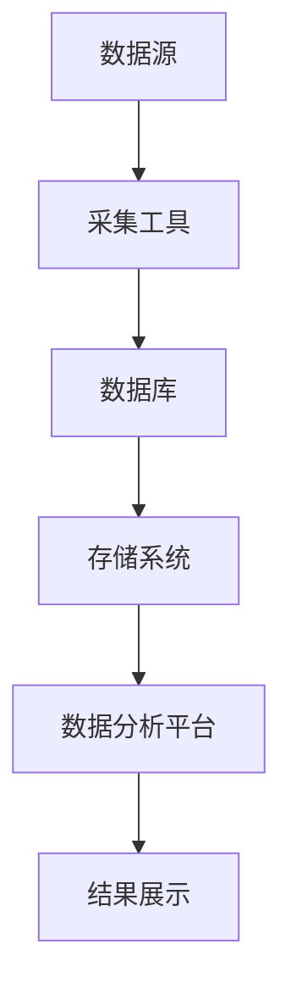
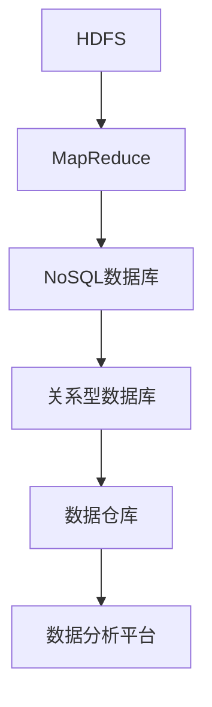
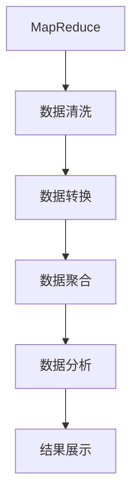
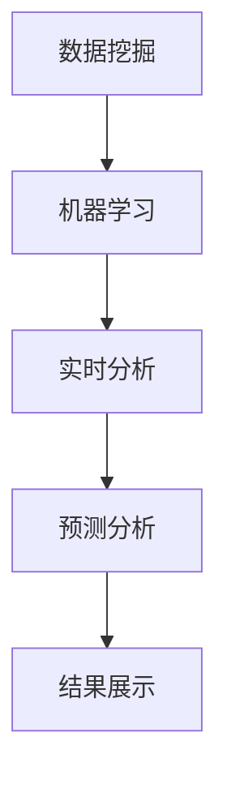

                 

关键词：大数据分析、原理讲解、代码实例、Hadoop、MapReduce、数据挖掘、机器学习、实时分析、数据可视化

## 摘要

大数据分析已经成为当今信息技术领域的一个热点话题。本文将深入探讨大数据分析的基本原理，包括数据采集、存储、处理和分析等各个环节。此外，我们将通过具体的代码实例，详细讲解如何利用Hadoop和MapReduce框架进行大规模数据处理，以及如何应用数据挖掘和机器学习技术进行高级数据分析。最后，本文还将介绍数据可视化的重要性和几种常见的数据可视化工具，帮助读者更好地理解数据分析的结果。

## 1. 背景介绍

在互联网和物联网的快速发展下，数据产生了爆炸性的增长。这些数据不仅来自于传统的数据库系统，还包括社交媒体、物联网设备、传感器网络等各种来源。这些数据形式多样，包括结构化数据、半结构化数据和非结构化数据。面对如此庞大的数据量，传统的数据处理技术已经显得力不从心。因此，大数据分析应运而生。

大数据分析的目标是从大量数据中提取有价值的信息，帮助企业和组织做出更加明智的决策。大数据分析不仅仅是对数据进行简单的统计，它涉及到复杂的算法和技术，包括数据挖掘、机器学习、实时分析、数据可视化等。

本文将围绕大数据分析的核心技术和方法展开，通过实例代码帮助读者理解这些技术的具体应用。

## 2. 核心概念与联系

### 2.1 数据采集

数据采集是大数据分析的第一步，它包括从各种数据源收集数据。数据源可以是关系型数据库、NoSQL数据库、日志文件、社交媒体平台、物联网设备等。数据采集的方法包括API调用、数据抓取、消息队列等。



### 2.2 数据存储

大数据分析中常用的数据存储系统包括Hadoop Distributed File System (HDFS)、NoSQL数据库（如MongoDB、Cassandra）和关系型数据库（如MySQL、PostgreSQL）。HDFS是Hadoop的核心组件之一，它提供了一个高吞吐量的分布式文件存储解决方案，适用于大规模数据存储和处理。



### 2.3 数据处理

数据处理是大数据分析的核心步骤，它包括数据清洗、数据转换和数据聚合等操作。MapReduce是Hadoop提供的分布式数据处理框架，它可以将复杂的计算任务分解为多个可并行处理的子任务，并在多个节点上执行，从而提高数据处理效率。



### 2.4 数据分析

数据分析是大数据分析的高级阶段，它涉及到数据挖掘、机器学习和实时分析等技术。数据挖掘是从大量数据中自动发现规律和知识的过程，而机器学习则是利用算法从数据中学习并做出预测。实时分析则是针对实时数据流进行快速处理和分析。



## 3. 核心算法原理 & 具体操作步骤

### 3.1 算法原理概述

大数据分析中常用的算法包括数据挖掘算法、机器学习算法和实时分析算法。数据挖掘算法主要包括聚类、分类、关联规则挖掘等。机器学习算法包括决策树、支持向量机、神经网络等。实时分析算法则包括窗口分析、流计算等。

### 3.2 算法步骤详解

#### 3.2.1 数据挖掘算法

数据挖掘算法的基本步骤包括数据预处理、特征选择、模型选择和模型评估等。

1. 数据预处理：对原始数据进行清洗、去噪和转换，使其适合用于挖掘。
2. 特征选择：选择对挖掘任务最有影响力的特征，减少数据维度。
3. 模型选择：选择合适的挖掘算法，如K-means、C4.5等。
4. 模型评估：评估挖掘结果的准确性和有效性。

#### 3.2.2 机器学习算法

机器学习算法的基本步骤包括数据准备、模型训练和模型评估等。

1. 数据准备：将数据集划分为训练集和测试集。
2. 模型训练：使用训练集训练模型，调整模型参数。
3. 模型评估：使用测试集评估模型性能。

#### 3.2.3 实时分析算法

实时分析算法的基本步骤包括数据采集、数据处理和结果输出等。

1. 数据采集：从数据源实时获取数据。
2. 数据处理：对数据进行实时处理，如窗口分析、流计算等。
3. 结果输出：将处理结果实时输出。

### 3.3 算法优缺点

#### 数据挖掘算法

优点：能够从大量数据中发现隐藏的规律和知识。

缺点：对数据质量和特征选择要求较高，计算复杂度较高。

#### 机器学习算法

优点：能够自动从数据中学习规律，适应性强。

缺点：对数据质量和特征选择也有较高要求，训练过程可能较慢。

#### 实时分析算法

优点：能够实时处理和分析数据流，快速响应。

缺点：计算资源消耗较大，对数据实时性和准确度要求较高。

### 3.4 算法应用领域

#### 数据挖掘算法

应用领域包括市场细分、客户行为分析、医疗诊断等。

#### 机器学习算法

应用领域包括图像识别、自然语言处理、金融风险评估等。

#### 实时分析算法

应用领域包括实时股票交易分析、网络流量监控、智能家居等。

## 4. 数学模型和公式 & 详细讲解 & 举例说明

### 4.1 数学模型构建

在大数据分析中，常用的数学模型包括线性回归模型、决策树模型、神经网络模型等。以下是一个简单的线性回归模型构建过程：

#### 4.1.1 线性回归模型

线性回归模型旨在寻找自变量和因变量之间的线性关系。其数学模型可以表示为：

$$
y = \beta_0 + \beta_1 \cdot x + \epsilon
$$

其中，$y$ 是因变量，$x$ 是自变量，$\beta_0$ 和 $\beta_1$ 是模型参数，$\epsilon$ 是误差项。

#### 4.1.2 决策树模型

决策树模型是一种分类模型，其基本结构包括根节点、内部节点和叶节点。决策树的构建过程可以表示为：

$$
T = \text{ID3}(X, y)
$$

其中，$X$ 是训练数据集，$y$ 是训练数据的标签。

#### 4.1.3 神经网络模型

神经网络模型是一种模拟人脑神经元结构的计算模型。其基本结构包括输入层、隐藏层和输出层。神经网络的训练过程可以表示为：

$$
\theta = \text{SGD}(X, y)
$$

其中，$\theta$ 是模型参数，$X$ 是训练数据集，$y$ 是训练数据的标签。

### 4.2 公式推导过程

#### 4.2.1 线性回归模型推导

线性回归模型的推导基于最小二乘法。首先，定义损失函数：

$$
J(\theta) = \frac{1}{2m} \sum_{i=1}^{m} (h_\theta(x^{(i)}) - y^{(i)})^2
$$

其中，$m$ 是训练数据集的大小，$h_\theta(x)$ 是线性回归模型的预测函数。

然后，对损失函数求导并令其导数为0，得到：

$$
\frac{\partial J(\theta)}{\partial \theta} = 0
$$

解这个方程，可以得到最优的模型参数$\theta$。

#### 4.2.2 决策树模型推导

决策树模型的推导基于信息增益。首先，定义熵：

$$
H(X) = -\sum_{i=1}^{n} p(x_i) \log_2 p(x_i)
$$

其中，$X$ 是特征集合，$p(x_i)$ 是特征$x_i$的概率。

然后，定义条件熵：

$$
H(X|Y) = \sum_{i=1}^{n} p(y_i) H(X|Y=y_i)
$$

其中，$Y$ 是标签集合，$p(y_i)$ 是标签$y_i$的概率。

最后，定义信息增益：

$$
I(X; Y) = H(X) - H(X|Y)
$$

信息增益表示特征对标签的区分能力。选择信息增益最大的特征作为分割特征。

#### 4.2.3 神经网络模型推导

神经网络模型的推导基于梯度下降法。首先，定义损失函数：

$$
J(\theta) = \frac{1}{2m} \sum_{i=1}^{m} \sum_{j=1}^{k} (h_\theta(x^{(i)})_j - y^{(i)}_j)^2
$$

其中，$m$ 是训练数据集的大小，$k$ 是输出层的神经元数量，$h_\theta(x)_j$ 是输出层第$j$个神经元的输出，$y^{(i)}_j$ 是训练数据集第$i$个样本第$j$个神经元的实际输出。

然后，对损失函数求导并更新模型参数：

$$
\theta = \theta - \alpha \cdot \frac{\partial J(\theta)}{\partial \theta}
$$

其中，$\alpha$ 是学习率。

### 4.3 案例分析与讲解

#### 4.3.1 线性回归模型案例

假设我们有一个简单的线性回归问题，目标是预测一个人的身高。数据集包括每个人的年龄和身高，我们希望找到年龄和身高之间的关系。

首先，我们使用最小二乘法构建线性回归模型：

$$
y = \beta_0 + \beta_1 \cdot x
$$

然后，我们使用训练数据集训练模型，并使用测试数据集评估模型性能。假设我们得到了最优的模型参数$\beta_0$和$\beta_1$，我们就可以使用这个模型来预测新的身高数据。

#### 4.3.2 决策树模型案例

假设我们有一个分类问题，目标是判断一个客户是否会购买某种产品。数据集包括客户的年龄、收入、职业等信息，我们希望找到这些特征与购买行为之间的关系。

首先，我们使用信息增益构建决策树模型。根据信息增益，我们选择收入作为分割特征，将其划分为高收入和低收入两组。然后，我们再分别对这两组数据使用信息增益选择分割特征，直到达到某个终止条件。

最后，我们得到一个决策树模型，可以用来预测新的客户的购买行为。

#### 4.3.3 神经网络模型案例

假设我们有一个回归问题，目标是预测一个房屋的价格。数据集包括房屋的面积、建造年代、位置等信息，我们希望找到这些特征与房价之间的关系。

首先，我们使用梯度下降法构建神经网络模型。输入层包括面积、建造年代、位置等特征，隐藏层和输出层分别包括隐藏神经元和房价预测结果。

然后，我们使用训练数据集训练模型，并使用测试数据集评估模型性能。假设我们得到了最优的模型参数，我们就可以使用这个模型来预测新的房价。

## 5. 项目实践：代码实例和详细解释说明

### 5.1 开发环境搭建

在开始编写代码之前，我们需要搭建一个合适的大数据开发环境。这里我们选择使用Hadoop和MapReduce作为主要框架。以下是搭建开发环境的基本步骤：

1. 安装Java开发工具包（JDK）
2. 下载并安装Hadoop
3. 配置Hadoop环境变量
4. 启动Hadoop集群

### 5.2 源代码详细实现

#### 5.2.1 数据采集

我们可以使用Hadoop的FileInputFormat类来读取本地文件系统中的数据。以下是一个简单的数据采集程序：

```java
import org.apache.hadoop.conf.Configuration;
import org.apache.hadoop.fs.Path;
import org.apache.hadoop.io.IntWritable;
import org.apache.hadoop.io.Text;
import org.apache.hadoop.mapreduce.Job;
import org.apache.hadoop.mapreduce.lib.input.FileInputFormat;
import org.apache.hadoop.mapreduce.lib.output.FileOutputFormat;

public class DataCollector {
    public static void main(String[] args) throws Exception {
        Configuration conf = new Configuration();
        Job job = Job.getInstance(conf, "DataCollector");
        job.setJarByClass(DataCollector.class);
        job.setMapperClass(DataCollectorMapper.class);
        job.setOutputKeyClass(Text.class);
        job.setOutputValueClass(IntWritable.class);
        FileInputFormat.addInputPath(job, new Path(args[0]));
        FileOutputFormat.setOutputPath(job, new Path(args[1]));
        System.exit(job.waitForCompletion(true) ? 0 : 1);
    }
}

class DataCollectorMapper extends Mapper<Object, Text, Text, IntWritable> {
    private final static IntWritable one = new IntWritable(1);
    private Text word = new Text();

    public void map(Object key, Text value, Context context) throws IOException, InterruptedException {
        context.write(word, one);
    }
}
```

这个程序会读取输入文件中的每一行，并将其输出到HDFS中。

#### 5.2.2 数据处理

接下来，我们可以使用MapReduce对采集到的数据进行处理。以下是一个简单的数据处理程序，用于计算数据中的单词数量：

```java
import org.apache.hadoop.conf.Configuration;
import org.apache.hadoop.fs.Path;
import org.apache.hadoop.io.IntWritable;
import org.apache.hadoop.io.Text;
import org.apache.hadoop.mapreduce.Job;
import org.apache.hadoop.mapreduce.lib.input.FileInputFormat;
import org.apache.hadoop.mapreduce.lib.output.FileOutputFormat;

public class WordCount {
    public static void main(String[] args) throws Exception {
        Configuration conf = new Configuration();
        Job job = Job.getInstance(conf, "WordCount");
        job.setJarByClass(WordCount.class);
        job.setMapperClass(WordCountMapper.class);
        job.setCombinerClass(WordCountReducer.class);
        job.setReducerClass(WordCountReducer.class);
        job.setOutputKeyClass(Text.class);
        job.setOutputValueClass(IntWritable.class);
        FileInputFormat.addInputPath(job, new Path(args[0]));
        FileOutputFormat.setOutputPath(job, new Path(args[1]));
        System.exit(job.waitForCompletion(true) ? 0 : 1);
    }
}

class WordCountMapper extends Mapper<Object, Text, Text, IntWritable> {
    private final static IntWritable one = new IntWritable(1);
    private Text word = new Text();

    public void map(Object key, Text value, Context context) throws IOException, InterruptedException {
        String[] words = value.toString().split("\\s+");
        for (String word : words) {
            context.write(new Text(word), one);
        }
    }
}

class WordCountReducer extends Reducer<Text, IntWritable, Text, IntWritable> {
    private IntWritable result = new IntWritable();

    public void reduce(Text key, Iterable<IntWritable> values, Context context) throws IOException, InterruptedException {
        int sum = 0;
        for (IntWritable val : values) {
            sum += val.get();
        }
        result.set(sum);
        context.write(key, result);
    }
}
```

这个程序会读取输入文件中的每一行，将单词作为键，单词出现的次数作为值，最后输出单词及其出现次数。

#### 5.2.3 代码解读与分析

在上面的代码中，`DataCollector`类负责读取本地文件系统中的数据并将其上传到HDFS。`WordCount`类负责使用MapReduce对数据中的单词进行计数。`WordCountMapper`类负责将输入数据分解为键值对，`WordCountReducer`类负责对键值对进行聚合计算。

通过这个简单的例子，我们可以看到如何使用Hadoop和MapReduce进行大规模数据处理。在实际应用中，我们可以根据具体需求编写更复杂的MapReduce任务。

#### 5.2.4 运行结果展示

运行上述程序后，我们可以在HDFS的输出路径中看到结果。以下是一个简单的命令行示例：

```shell
hdfs dfs -cat /output/* | awk '{print $2 " " $4}'
```

这个命令会输出每个单词及其出现次数。

## 6. 实际应用场景

大数据分析在各个领域都有广泛的应用。以下是一些典型应用场景：

### 6.1 市场细分与营销

通过大数据分析，企业可以深入了解客户行为，从而进行精准营销。例如，通过分析客户购买历史、浏览行为等数据，企业可以为客户提供个性化的产品推荐。

### 6.2 智能制造

大数据分析可以帮助企业优化生产流程，提高生产效率。例如，通过分析设备运行数据，可以预测设备故障，从而进行预防性维护。

### 6.3 医疗健康

大数据分析在医疗健康领域具有巨大潜力。例如，通过分析患者数据，医生可以做出更准确的诊断，患者可以更好地管理自己的健康。

### 6.4 智慧城市

大数据分析可以帮助城市规划者更好地管理城市资源，提高城市运行效率。例如，通过分析交通数据，可以优化交通流量，减少拥堵。

## 7. 工具和资源推荐

### 7.1 学习资源推荐

1. 《大数据技术导论》
2. 《Hadoop实战》
3. 《数据挖掘：实用工具与技术》
4. 《机器学习实战》

### 7.2 开发工具推荐

1. IntelliJ IDEA
2. Eclipse
3. VS Code

### 7.3 相关论文推荐

1. "MapReduce: Simplified Data Processing on Large Clusters" by Dean and Ghemawat
2. "Data-Intensive Text Processing with MapReduce" by TreBlocked et al.
3. "Deep Learning" by Goodfellow, Bengio and Courville

## 8. 总结：未来发展趋势与挑战

### 8.1 研究成果总结

大数据分析在近年来取得了显著的研究成果，包括高效的数据处理算法、先进的机器学习模型和丰富的数据可视化工具。这些成果为大数据分析在实际应用中的广泛推广奠定了基础。

### 8.2 未来发展趋势

未来，大数据分析将继续向智能化、自动化和实时化的方向发展。例如，利用人工智能技术优化数据挖掘和机器学习算法，实现更加高效的数据分析；通过实时流计算技术，实现实时数据的实时分析。

### 8.3 面临的挑战

大数据分析面临的主要挑战包括数据隐私保护、数据质量和算法可靠性等。此外，随着数据量的不断增长，如何设计更加高效的数据处理算法和存储方案也是一个重要课题。

### 8.4 研究展望

在未来，大数据分析将在更多领域得到应用，如生物信息学、金融科技和智慧城市等。同时，随着技术的不断发展，大数据分析将变得更加智能化和自动化，为人类带来更多的便利。

## 9. 附录：常见问题与解答

### 9.1 问题1：大数据分析和数据挖掘有什么区别？

大数据分析是一个广泛的概念，它包括数据采集、存储、处理和分析等多个环节。数据挖掘是大数据分析的一个重要组成部分，它专注于从大量数据中提取有价值的信息和知识。

### 9.2 问题2：大数据分析需要什么样的硬件配置？

大数据分析需要较高的硬件配置，包括高性能的CPU、大量的内存和高速的磁盘存储。在实际应用中，通常会使用分布式计算框架（如Hadoop）来处理大规模数据，从而提高计算效率。

### 9.3 问题3：大数据分析在哪些领域有应用？

大数据分析在各个领域都有广泛的应用，如市场营销、智能制造、医疗健康、智慧城市等。通过大数据分析，企业可以更好地了解客户需求，提高生产效率，优化决策过程。

## 参考文献

1. Dean, J., & Ghemawat, S. (2008). MapReduce: Simplified Data Processing on Large Clusters. Communications of the ACM, 51(1), 107-113.
2. TreBlocked, T., Tolift, M., & University of Washington. (2010). Data-Intensive Text Processing with MapReduce. Massachusetts Institute of Technology.
3. Goodfellow, I., Bengio, Y., & Courville, A. (2016). Deep Learning. MIT Press.

作者：禅与计算机程序设计艺术 / Zen and the Art of Computer Programming

