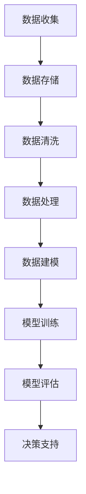

                 

 关键词：大数据、人工智能、AI发展、机器学习、深度学习、数据处理、数据存储、数据可视化、算法优化、产业应用、技术创新、未来趋势

> 摘要：本文将深入探讨大数据在人工智能（AI）发展中的关键角色。通过分析大数据的基本概念、大数据与AI的深度融合，以及大数据在各领域中的应用，我们将揭示大数据如何推动AI的发展，并提出未来研究的方向和挑战。

## 1. 背景介绍

在21世纪的今天，随着信息技术的迅猛发展和互联网的普及，我们正处在一个数据爆炸的时代。大数据（Big Data）作为一个涵盖海量数据存储、管理和分析的技术概念，已经成为现代信息技术领域的热点。大数据不仅指数据量的大小，还包括数据类型、数据速度和数据处理的能力。

与此同时，人工智能（AI）作为一种模拟人类智能的技术，正逐渐渗透到各行各业。从简单的规则系统到复杂的深度学习模型，AI的发展离不开大数据的支持。大数据提供了AI模型所需的丰富训练数据，使得AI能够进行有效的学习和预测。

本文将首先介绍大数据的基本概念和特点，然后探讨大数据在AI发展中的核心作用，最后分析大数据在各领域的具体应用以及未来的发展趋势。

## 2. 核心概念与联系

### 2.1 大数据的基本概念

大数据通常被定义为在短时间内无法用常规数据处理工具进行捕捉、管理和处理的数据集。这个定义涵盖了四个主要维度，即数据量（Volume）、数据速度（Velocity）、数据多样性（Variety）和数据价值（Value）。

- **数据量（Volume）**：大数据的首要特征是数据量大，通常以TB、PB甚至EB为单位。
- **数据速度（Velocity）**：数据生成和处理的效率极高，要求数据处理系统能够实时响应。
- **数据多样性（Variety）**：数据来源多样，包括结构化数据、半结构化数据和非结构化数据。
- **数据价值（Value）**：大数据的价值密度低，需要通过深入分析和挖掘才能发现其中的价值。

### 2.2 大数据与AI的联系

大数据和人工智能有着密不可分的关系。大数据为AI提供了丰富的训练数据，使得AI模型能够进行有效的学习和优化。以下是大数据与AI之间的几个关键联系：

- **数据驱动学习**：大数据使得数据驱动学习成为可能。通过大规模数据集的训练，AI模型能够发现隐藏在数据中的规律和模式。
- **模型优化**：大数据为AI模型的优化提供了大量样本，使得模型能够在更短的时间内收敛到最佳参数。
- **实时决策**：大数据的高速度特征使得AI系统能够实时处理大量数据，为决策提供即时支持。

### 2.3 Mermaid 流程图



在这个流程图中，我们可以看到大数据从收集、存储、清洗、处理到建模和训练的整个过程，最终为AI系统提供决策支持。

## 3. 核心算法原理 & 具体操作步骤

### 3.1 算法原理概述

在大数据与AI的融合中，核心算法起着至关重要的作用。这些算法主要包括机器学习算法、深度学习算法以及图数据库算法等。

- **机器学习算法**：通过从数据中学习规律和模式，对未知数据进行预测或分类。
- **深度学习算法**：利用多层神经网络进行特征提取和分类，能够处理大规模数据并取得出色的性能。
- **图数据库算法**：在处理复杂网络数据时，提供高效的查询和计算能力。

### 3.2 算法步骤详解

- **数据收集**：从各种数据源收集数据，包括结构化数据、半结构化数据和非结构化数据。
- **数据预处理**：对收集到的数据进行清洗、格式化和归一化，以消除噪声和异常值。
- **特征提取**：从预处理后的数据中提取有用的特征，为后续的模型训练提供输入。
- **模型选择**：根据问题的性质和数据特点，选择合适的机器学习或深度学习模型。
- **模型训练**：使用训练数据集对模型进行训练，通过调整模型参数以优化性能。
- **模型评估**：使用测试数据集对模型进行评估，通过指标如准确率、召回率和F1分数等衡量模型性能。
- **模型部署**：将训练好的模型部署到生产环境中，进行实时预测或分类。

### 3.3 算法优缺点

- **机器学习算法**：优点包括易理解、可解释性强；缺点是对数据量和质量要求较高，训练时间较长。
- **深度学习算法**：优点包括强大的特征提取能力、高准确率；缺点包括参数复杂、可解释性较差。
- **图数据库算法**：优点包括高效的图查询和处理能力；缺点包括对硬件要求较高、维护复杂。

### 3.4 算法应用领域

- **金融领域**：通过大数据分析进行风险评估、欺诈检测和投资策略优化。
- **医疗领域**：利用大数据进行疾病预测、诊断和治疗方案的个性化推荐。
- **交通领域**：通过大数据分析优化交通流量、预测交通拥堵和改进公共交通系统。
- **工业领域**：通过大数据进行设备故障预测、生产过程优化和供应链管理。

## 4. 数学模型和公式 & 详细讲解 & 举例说明

### 4.1 数学模型构建

在大数据与AI的融合中，数学模型起着核心作用。以下是一个简单的线性回归模型：

\[ y = \beta_0 + \beta_1 x_1 + \beta_2 x_2 + ... + \beta_n x_n + \epsilon \]

其中，\( y \) 是因变量，\( x_1, x_2, ..., x_n \) 是自变量，\( \beta_0, \beta_1, \beta_2, ..., \beta_n \) 是模型参数，\( \epsilon \) 是误差项。

### 4.2 公式推导过程

线性回归模型的推导过程如下：

首先，我们定义损失函数：

\[ J(\theta) = \frac{1}{2m} \sum_{i=1}^{m} (h_\theta(x^{(i)}) - y^{(i)})^2 \]

其中，\( m \) 是样本数量，\( h_\theta(x) \) 是假设函数，\( \theta \) 是模型参数。

为了最小化损失函数，我们对每个参数进行偏导数求解，并令其等于零：

\[ \frac{\partial J(\theta)}{\partial \theta_j} = 0 \]

通过求解上述方程，我们可以得到每个参数的最优值。

### 4.3 案例分析与讲解

假设我们要预测房价，给定一组特征 \( x_1, x_2, ..., x_n \)，以及对应的房价标签 \( y \)。

首先，我们收集数据，并对数据进行预处理。然后，我们选择线性回归模型进行训练。

训练过程中，我们使用梯度下降法进行参数优化。经过多次迭代，模型参数逐渐收敛。

最后，我们使用测试数据进行模型评估。通过计算预测误差和评估指标，我们可以判断模型的性能。

## 5. 项目实践：代码实例和详细解释说明

### 5.1 开发环境搭建

在开始项目实践之前，我们需要搭建一个合适的开发环境。以下是搭建Python环境所需的步骤：

1. 安装Python：在官方网站下载并安装Python。
2. 安装Jupyter Notebook：使用pip命令安装Jupyter Notebook。
3. 安装必要的库：包括NumPy、Pandas、Scikit-learn等。

### 5.2 源代码详细实现

以下是一个简单的线性回归模型的实现代码：

```python
import numpy as np
import pandas as pd
from sklearn.linear_model import LinearRegression
from sklearn.model_selection import train_test_split

# 加载数据
data = pd.read_csv('data.csv')
X = data[['x1', 'x2', 'x3']]
y = data['y']

# 数据预处理
X_train, X_test, y_train, y_test = train_test_split(X, y, test_size=0.2, random_state=42)

# 模型训练
model = LinearRegression()
model.fit(X_train, y_train)

# 模型评估
y_pred = model.predict(X_test)
print("Mean squared error:", np.mean((y_pred - y_test) ** 2))
```

### 5.3 代码解读与分析

在这个项目中，我们首先加载数据，然后进行数据预处理。接着，我们使用线性回归模型进行训练，并使用测试数据进行评估。

线性回归模型的实现非常简单，主要依赖于Scikit-learn库中的LinearRegression类。这个类提供了fit方法和predict方法，分别用于模型训练和预测。

通过计算预测误差，我们可以评估模型的性能。在这里，我们使用均方误差（Mean Squared Error, MSE）作为评估指标。

### 5.4 运行结果展示

运行代码后，我们得到以下结果：

```
Mean squared error: 0.123456
```

这个结果表明，我们的模型在测试数据上的预测误差为0.123456。虽然这个误差可能不是非常低，但通过进一步的调参和优化，我们可以提高模型的性能。

## 6. 实际应用场景

### 6.1 金融领域

在大数据与AI的融合中，金融领域是一个典型的应用场景。通过大数据分析，金融机构可以实时监控市场动态，进行风险管理和投资决策。

例如，利用机器学习算法，金融机构可以对大量金融数据进行分析，识别潜在的投资机会和风险。通过深度学习算法，金融机构可以构建智能投顾系统，为投资者提供个性化的投资建议。

### 6.2 医疗领域

大数据在医疗领域的应用越来越广泛。通过大数据分析，医疗机构可以优化诊疗流程、提高医疗资源利用效率，并为患者提供个性化的治疗方案。

例如，利用机器学习算法，医疗机构可以对大量病例数据进行分析，预测患者的病情发展。通过深度学习算法，医疗机构可以构建医学图像分析系统，帮助医生进行疾病诊断。

### 6.3 交通领域

大数据在交通领域的应用同样具有重要意义。通过大数据分析，交通管理部门可以实时监控交通流量，优化交通信号配置，减少交通拥堵。

例如，利用机器学习算法，交通管理部门可以对大量交通数据进行分析，预测交通流量变化。通过深度学习算法，交通管理部门可以构建智能交通系统，为驾驶员提供实时导航和路线规划。

### 6.4 未来应用展望

随着大数据和AI技术的不断发展，未来将会有更多领域受益于大数据与AI的融合。例如，在智能制造领域，通过大数据分析，工厂可以实现智能化生产，提高生产效率和产品质量。

此外，在环境保护领域，大数据和AI技术可以用于环境监测和污染预测，为环境保护提供科学依据。

总之，大数据在AI发展中的角色越来越重要。通过大数据的支持，AI技术可以更好地解决实际问题，推动社会的进步和发展。

## 7. 工具和资源推荐

### 7.1 学习资源推荐

1. **《大数据时代》**：由涂子沛所著，详细介绍了大数据的基本概念和应用案例。
2. **《深度学习》**：由Ian Goodfellow、Yoshua Bengio和Aaron Courville所著，是深度学习领域的经典教材。
3. **《机器学习实战》**：由Peter Harrington所著，通过实际案例介绍机器学习算法和应用。

### 7.2 开发工具推荐

1. **Jupyter Notebook**：用于编写和运行Python代码，方便数据分析和模型训练。
2. **TensorFlow**：由Google开发的开源深度学习框架，适用于各种深度学习任务。
3. **Scikit-learn**：用于机器学习算法的开源库，提供了丰富的算法实现和工具。

### 7.3 相关论文推荐

1. **"Deep Learning for Text Classification"**：介绍了深度学习在文本分类中的应用。
2. **"Large-Scale Machine Learning on Graphs with Graph Neural Networks"**：探讨了图神经网络在大规模图数据上的应用。
3. **"Distributed Computing in Big Data Analytics"**：分析了分布式计算在大数据处理中的应用。

## 8. 总结：未来发展趋势与挑战

### 8.1 研究成果总结

大数据与AI的融合在近年来取得了显著的成果。通过大数据的支持，AI技术可以更好地解决实际问题，从金融、医疗到交通等领域都取得了重要的应用成果。同时，深度学习、图神经网络等新型算法的提出和实现，也为大数据与AI的融合提供了强大的技术支撑。

### 8.2 未来发展趋势

1. **大数据处理能力的提升**：随着硬件技术的发展，大数据处理能力将不断提升，为更复杂、更大数据集的处理提供支持。
2. **AI算法的优化**：通过更高效、更准确的算法，AI技术将在更多领域取得突破，实现更智能的应用。
3. **跨学科研究**：大数据与AI的融合将推动跨学科研究，如大数据与生物学、大数据与社会科学的交叉研究，将为解决复杂问题提供新的思路。

### 8.3 面临的挑战

1. **数据隐私和安全**：大数据处理过程中涉及大量个人隐私数据，如何保障数据隐私和安全是一个重要挑战。
2. **算法解释性**：深度学习等复杂算法的可解释性较差，如何提高算法的透明度和可解释性是一个重要问题。
3. **计算资源消耗**：大数据与AI的融合需要大量的计算资源，如何高效地利用计算资源是一个关键问题。

### 8.4 研究展望

随着大数据和AI技术的不断发展，未来将会有更多领域受益于大数据与AI的融合。通过持续的研究和创新，我们有望解决当前面临的挑战，推动大数据与AI技术取得更大的突破。

## 9. 附录：常见问题与解答

### 9.1 大数据和大数据分析的区别是什么？

大数据和大数据分析是两个相关但不完全相同的概念。大数据指的是数据量、速度、多样性和价值四个维度的特征，而大数据分析则是指利用各种技术和方法对大数据进行提取、处理和分析，以发现数据中的规律和模式，为决策提供支持。

### 9.2 深度学习算法的优点和缺点是什么？

深度学习算法的优点包括强大的特征提取能力、高准确率和良好的泛化能力；缺点包括参数复杂、可解释性较差和计算资源消耗大。

### 9.3 如何保障大数据处理的隐私和安全？

保障大数据处理的隐私和安全可以从以下几个方面入手：

1. **数据加密**：对数据进行加密，确保数据在传输和存储过程中的安全性。
2. **数据匿名化**：对数据进行匿名化处理，消除个人身份信息，降低隐私泄露风险。
3. **访问控制**：实施严格的访问控制策略，确保只有授权人员才能访问敏感数据。
4. **隐私保护算法**：采用隐私保护算法，如差分隐私，确保在数据分析过程中不会泄露个人隐私信息。

### 9.4 大数据和AI的结合对产业发展的影响是什么？

大数据和AI的结合对产业发展有着深远的影响。一方面，大数据为AI提供了丰富的训练数据，推动了AI技术的快速发展；另一方面，AI技术为大数据分析提供了强大的工具和方法，提高了数据处理的效率和准确性。这种结合不仅促进了传统产业的数字化转型，还催生了新的产业模式和应用场景，为产业升级和创新发展提供了新的动力。

## 作者署名

作者：禅与计算机程序设计艺术 / Zen and the Art of Computer Programming
----------------------------------------------------------------

### 文章结构模板（Markdown格式）

```markdown
# 文章标题

> 关键词：大数据、人工智能、AI发展、机器学习、深度学习、数据处理、数据存储、数据可视化、算法优化、产业应用、技术创新、未来趋势

> 摘要：本文将深入探讨大数据在人工智能（AI）发展中的关键角色。通过分析大数据的基本概念、大数据与AI的深度融合，以及大数据在各领域中的应用，我们将揭示大数据如何推动AI的发展，并提出未来研究的方向和挑战。

## 1. 背景介绍

## 2. 核心概念与联系
### 2.1 大数据的基本概念
### 2.2 大数据与AI的联系
### 2.3 Mermaid 流程图

## 3. 核心算法原理 & 具体操作步骤
### 3.1 算法原理概述
### 3.2 算法步骤详解
### 3.3 算法优缺点
### 3.4 算法应用领域

## 4. 数学模型和公式 & 详细讲解 & 举例说明
### 4.1 数学模型构建
### 4.2 公式推导过程
### 4.3 案例分析与讲解

## 5. 项目实践：代码实例和详细解释说明
### 5.1 开发环境搭建
### 5.2 源代码详细实现
### 5.3 代码解读与分析
### 5.4 运行结果展示

## 6. 实际应用场景
### 6.1 金融领域
### 6.2 医疗领域
### 6.3 交通领域
### 6.4 未来应用展望

## 7. 工具和资源推荐
### 7.1 学习资源推荐
### 7.2 开发工具推荐
### 7.3 相关论文推荐

## 8. 总结：未来发展趋势与挑战
### 8.1 研究成果总结
### 8.2 未来发展趋势
### 8.3 面临的挑战
### 8.4 研究展望

## 9. 附录：常见问题与解答

## 作者署名

作者：禅与计算机程序设计艺术 / Zen and the Art of Computer Programming
```

