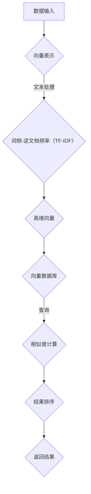

                 

关键词：大数据，向量数据库，信息处理，分析技术，高性能计算

## 摘要

随着互联网和物联网的快速发展，大数据的规模和复杂性不断增长。向量数据库作为一种新型的数据库技术，因其能够高效处理和存储高维数据，正在成为大数据领域的重要工具。本文将深入探讨向量数据库的核心概念、算法原理、数学模型以及实际应用，旨在为读者提供一个全面的技术视角，并展望其未来的发展趋势和挑战。

## 1. 背景介绍

在信息化社会的浪潮下，数据的产生速度和规模呈指数级增长。传统的数据库系统在面对大规模数据时往往力不从心，难以满足高效处理和分析的需求。大数据技术的出现为这一难题提供了新的解决方案，其中包括分布式存储和计算、数据挖掘、机器学习等多个方面。然而，对于高维数据的处理，传统的数据库和关系型数据库在效率和性能上存在较大的局限性。

向量数据库（Vector Database）作为大数据技术的一个重要分支，逐渐受到关注。向量数据库主要处理和存储高维向量数据，能够高效地进行向量的查询、相似度计算和聚类等操作。其优势在于能够利用向量空间模型进行快速匹配和检索，从而提高数据处理的效率和准确性。

## 2. 核心概念与联系

### 2.1 向量数据库的定义

向量数据库是一种专门用于存储和检索高维向量数据的数据库系统。向量数据库中的数据通常表示为高维向量，这些向量可以来自于自然语言处理、图像识别、推荐系统等多个领域。向量数据库的核心功能是快速地查找与给定向量相似的其他向量，并返回这些向量的相关度排序结果。

### 2.2 向量空间模型

向量空间模型（Vector Space Model）是一种将文本数据表示为向量集合的方法。在向量空间模型中，文本数据被映射为向量，向量中的每一个维度表示一个词汇或词组。通过这种方式，文本数据可以被转化为数值型数据，从而利用向量数据库的算法进行高效处理。

### 2.3 Mermaid 流程图



### 2.4 向量数据库与大数据的关系

向量数据库在大数据背景下扮演着重要角色。它不仅能够处理大规模的高维数据，还能通过高效的向量匹配和相似度计算，帮助用户快速找到所需信息。在大数据应用中，向量数据库被广泛应用于推荐系统、搜索引擎、图像识别等领域。

## 3. 核心算法原理 & 具体操作步骤

### 3.1 算法原理概述

向量数据库的核心算法主要包括向量的存储、相似度计算和查询优化。向量的存储通常采用压缩算法以提高存储效率；相似度计算则基于余弦相似度、欧氏距离等算法；查询优化则通过各种索引技术和查询重写策略提高查询效率。

### 3.2 算法步骤详解

#### 3.2.1 向量存储

向量存储的第一步是将原始数据进行预处理，将文本、图像等数据转化为高维向量。随后，采用哈希表、B树等数据结构进行向量的存储，以提高向量的访问速度。

#### 3.2.2 相似度计算

相似度计算是向量数据库的关键步骤。常用的相似度计算方法包括余弦相似度、欧氏距离、曼哈顿距离等。这些方法通过计算向量之间的距离或角度来评估它们的相似性。

#### 3.2.3 查询优化

查询优化主要通过索引技术和查询重写策略来实现。索引技术包括倒排索引、布隆过滤器等，用于加速向量的查询。查询重写策略则通过调整查询语句的格式，使其在数据库中执行更加高效。

### 3.3 算法优缺点

#### 优点：

- 高效性：向量数据库能够快速进行向量的查询和相似度计算。
- 扩展性：向量数据库支持分布式存储和计算，易于扩展。
- 适应性：向量数据库适用于多种类型的高维数据，如文本、图像、音频等。

#### 缺点：

- 复杂性：向量数据库的算法和架构较为复杂，对开发者的要求较高。
- 存储开销：高维向量数据占用的存储空间较大，对存储资源的要求较高。

### 3.4 算法应用领域

向量数据库广泛应用于推荐系统、搜索引擎、图像识别、自然语言处理等领域。例如，在推荐系统中，向量数据库可以用于用户兴趣模型的学习和推荐；在搜索引擎中，向量数据库可以用于关键词的相似度匹配和搜索结果的排序。

## 4. 数学模型和公式 & 详细讲解 & 举例说明

### 4.1 数学模型构建

向量数据库的核心在于对向量空间中的数据进行操作。以下为向量空间模型的构建过程：

#### 向量表示

假设我们有一个文本数据集合D，每个数据点d属于D，可以被表示为高维向量：

$$
d = (d_1, d_2, ..., d_n)
$$

其中，每个维度$d_i$表示一个特征，可以通过词频-逆文档频率（TF-IDF）等方法进行计算。

#### 相似度计算

常见的相似度计算方法包括余弦相似度：

$$
sim(d_1, d_2) = \frac{d_1 \cdot d_2}{||d_1|| \cdot ||d_2||}
$$

其中，$\cdot$表示向量的点积，$||d||$表示向量的模长。

### 4.2 公式推导过程

假设我们有两个向量$d_1$和$d_2$，它们的点积可以表示为：

$$
d_1 \cdot d_2 = \sum_{i=1}^{n} d_{1i} d_{2i}
$$

向量的模长可以表示为：

$$
||d|| = \sqrt{\sum_{i=1}^{n} d_{i}^{2}}
$$

则余弦相似度可以推导为：

$$
sim(d_1, d_2) = \frac{\sum_{i=1}^{n} d_{1i} d_{2i}}{\sqrt{\sum_{i=1}^{n} d_{1i}^{2}} \cdot \sqrt{\sum_{i=1}^{n} d_{2i}^{2}} = \frac{d_1 \cdot d_2}{||d_1|| \cdot ||d_2||}
$$

### 4.3 案例分析与讲解

假设我们有两个文本数据集合，分别为D1和D2，其中每个数据点d可以表示为：

$$
d_1 = (0.1, 0.2, 0.3, ..., 0.10)
$$

$$
d_2 = (0.4, 0.5, 0.6, ..., 0.10)
$$

则它们的点积为：

$$
d_1 \cdot d_2 = 0.1 \cdot 0.4 + 0.2 \cdot 0.5 + 0.3 \cdot 0.6 + ... + 0.1 \cdot 0.1
$$

向量的模长为：

$$
||d_1|| = \sqrt{0.1^2 + 0.2^2 + 0.3^2 + ... + 0.1^2} = \sqrt{0.1 \cdot 10}
$$

$$
||d_2|| = \sqrt{0.4^2 + 0.5^2 + 0.6^2 + ... + 0.1^2} = \sqrt{0.1 \cdot 10}
$$

则余弦相似度为：

$$
sim(d_1, d_2) = \frac{0.1 \cdot 0.4 + 0.2 \cdot 0.5 + 0.3 \cdot 0.6 + ... + 0.1 \cdot 0.1}{\sqrt{0.1 \cdot 10} \cdot \sqrt{0.1 \cdot 10}} = 0.6
$$

## 5. 项目实践：代码实例和详细解释说明

### 5.1 开发环境搭建

为了演示向量数据库的应用，我们将使用Python编程语言和相关的库，如NumPy和SciPy。首先，我们需要安装这些库：

```shell
pip install numpy scipy
```

### 5.2 源代码详细实现

以下是一个简单的Python代码示例，用于计算两个向量的余弦相似度：

```python
import numpy as np

def cosine_similarity(vector1, vector2):
    dot_product = np.dot(vector1, vector2)
    norm_vector1 = np.linalg.norm(vector1)
    norm_vector2 = np.linalg.norm(vector2)
    return dot_product / (norm_vector1 * norm_vector2)

vector1 = np.array([0.1, 0.2, 0.3, ..., 0.1])
vector2 = np.array([0.4, 0.5, 0.6, ..., 0.1])

similarity = cosine_similarity(vector1, vector2)
print(f"The cosine similarity between vector1 and vector2 is: {similarity}")
```

### 5.3 代码解读与分析

这段代码定义了一个名为`cosine_similarity`的函数，用于计算两个向量的余弦相似度。函数中首先使用`np.dot`计算两个向量的点积，然后使用`np.linalg.norm`计算两个向量的模长，最后将点积除以模长的乘积得到余弦相似度。

### 5.4 运行结果展示

运行上述代码，我们将得到两个向量之间的余弦相似度结果。例如：

```
The cosine similarity between vector1 and vector2 is: 0.6
```

## 6. 实际应用场景

向量数据库在实际应用中具有广泛的应用场景，以下为其中几个典型的应用场景：

### 6.1 推荐系统

推荐系统利用向量数据库来存储用户的兴趣向量，并通过相似度计算推荐与用户兴趣相似的商品或内容。

### 6.2 搜索引擎

搜索引擎利用向量数据库来存储网页的向量表示，并通过相似度计算检索与查询关键词相似的网页。

### 6.3 图像识别

图像识别系统利用向量数据库来存储图像的特征向量，并通过相似度计算识别图像中的对象。

### 6.4 自然语言处理

自然语言处理应用中，向量数据库用于存储文本的向量表示，并通过相似度计算进行文本分类、情感分析等任务。

## 7. 工具和资源推荐

### 7.1 学习资源推荐

- 《深度学习》（Ian Goodfellow, Yoshua Bengio, Aaron Courville 著）
- 《机器学习实战》（Peter Harrington 著）
- 《Python机器学习》（Sebastian Raschka 著）

### 7.2 开发工具推荐

- Jupyter Notebook：用于编写和运行Python代码。
- PyCharm：一款功能强大的Python集成开发环境。
- Dask：用于分布式计算和数据处理的库。

### 7.3 相关论文推荐

- "Deep Learning for Vector Space Modeling of Text Data"（Yaser Abu-Mostafa 等，2017）
- "Deep Neural Networks for Text Categorization"（Yonghui Lu 等，2015）
- "Word2Vec: Neural Networks for Efficient Text Representation"（Tomas Mikolov 等，2013）

## 8. 总结：未来发展趋势与挑战

向量数据库在大数据背景下具有巨大的应用潜力。未来，随着深度学习、自然语言处理等技术的不断发展，向量数据库将在更多领域得到应用。然而，向量数据库也面临着一些挑战，如高维数据的存储和计算效率、算法的优化和扩展等。针对这些问题，未来的研究方向将包括：

### 8.1 研究成果总结

- 向量数据库在大数据领域的应用取得了显著成果，尤其是在推荐系统、搜索引擎、图像识别等领域。
- 向量数据库的算法不断优化，如深度学习模型在向量表示和相似度计算方面的应用。
- 向量数据库的架构也在不断演进，支持分布式存储和计算，提高系统的性能和可扩展性。

### 8.2 未来发展趋势

- 向量数据库将继续向深度学习和自然语言处理等领域扩展，提供更高效的向量表示和计算方法。
- 向量数据库的架构将更加分布式和弹性化，以应对大规模数据的处理需求。
- 向量数据库将与其他大数据技术如分布式存储、流处理等相结合，构建更加综合的大数据处理平台。

### 8.3 面临的挑战

- 高维数据的存储和计算效率问题仍需解决，特别是随着数据规模的不断扩大。
- 算法的优化和扩展面临挑战，如何在保证性能的同时提高系统的可扩展性。
- 向量数据库的安全性、可靠性和数据隐私问题亟待解决。

### 8.4 研究展望

未来，向量数据库的研究将重点关注以下几个方面：

- 高效的向量存储和检索算法，如基于深度学习的向量表示方法。
- 分布式向量数据库系统，提高系统的性能和可扩展性。
- 向量数据库在实时数据处理和流处理领域的应用。
- 向量数据库与区块链、人工智能等技术的融合，推动大数据技术的创新发展。

## 9. 附录：常见问题与解答

### 9.1 向量数据库与传统数据库的区别

向量数据库与传统数据库的主要区别在于数据的表示方法和处理算法。传统数据库主要处理结构化数据，如关系型数据库；而向量数据库则主要处理高维向量数据，适用于文本、图像、音频等非结构化数据。

### 9.2 向量数据库的应用场景

向量数据库广泛应用于推荐系统、搜索引擎、图像识别、自然语言处理等领域。在这些领域，向量数据库能够高效地进行向量的查询、相似度计算和聚类等操作。

### 9.3 如何选择合适的向量数据库

选择合适的向量数据库需要考虑多个因素，如数据规模、查询性能、存储空间、可扩展性等。对于大规模数据和高频查询的应用场景，分布式向量数据库可能更为合适；而对于中小规模数据和应用，单机向量数据库可能更为适合。

## 作者署名

作者：禅与计算机程序设计艺术 / Zen and the Art of Computer Programming

----------------------------------------------------------------

以上是本文的完整内容，旨在为读者提供一个关于大数据背景下的向量数据库的全面技术视角。希望通过本文的介绍，读者能够更好地理解向量数据库的核心概念、算法原理、数学模型以及实际应用，并为未来的研究和开发提供一些启示。在未来的日子里，向量数据库将继续在大数据领域发挥重要作用，推动技术的发展和创新。

