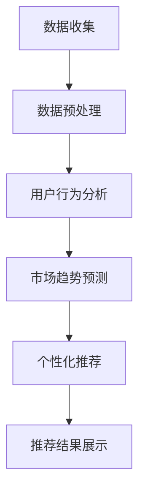
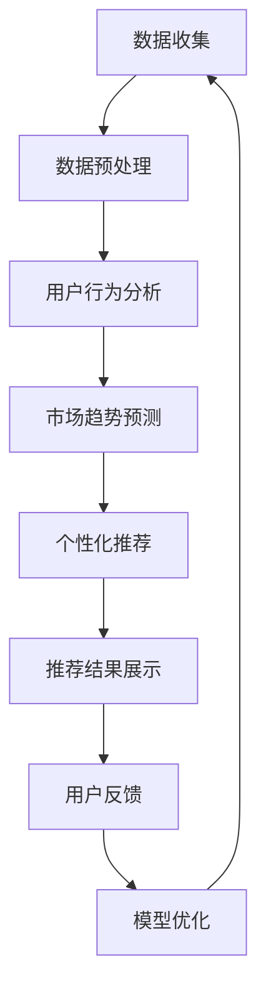

                 

关键词：大数据、电商推荐、AI 模型、融合技术、搜索推荐系统

> 摘要：本文将探讨大数据在电商推荐中的应用，以及如何通过AI模型融合技术提升搜索推荐系统的效果。我们将深入分析大数据的基本概念，AI模型融合技术的核心原理，并探讨其在电商推荐中的具体应用和实现步骤。

## 1. 背景介绍

随着互联网的快速发展，电商行业已成为全球经济的重要驱动力。然而，在成千上万的商品中，如何帮助消费者快速找到他们感兴趣的商品成为电商平台的重大挑战。传统的推荐系统，如基于协同过滤的方法，已经展示了其一定的效果，但面对海量数据和复杂的用户行为，其推荐准确性和实时性仍然存在很大的提升空间。

大数据技术的兴起为推荐系统带来了新的机遇。通过收集和分析用户的海量数据，包括购买记录、搜索历史、浏览行为等，我们可以更加精准地理解用户的需求和偏好。同时，AI模型的不断发展和融合技术的应用，为提升推荐系统的性能提供了强有力的支持。

本文将围绕以下几个核心问题展开：

1. 大数据的定义及其在电商推荐中的作用。
2. AI模型融合技术的原理及其在推荐系统中的应用。
3. 如何通过大数据和AI模型融合技术提升搜索推荐系统的效果。
4. 实际项目中的代码实例和运行结果展示。

## 2. 核心概念与联系

### 2.1 大数据的基本概念

大数据（Big Data）是指数据量巨大、类型繁多、价值密度较低的数据集合。其特点主要体现在以下几个方面：

- **海量性**：数据量巨大，通常是GB、TB甚至PB级别。
- **多样性**：数据类型多样，包括结构化数据、非结构化数据和半结构化数据。
- **价值密度低**：数据中真正有价值的信息占比很低，需要通过分析挖掘才能发现。
- **实时性**：数据生成和处理的速度非常快，需要实时分析以获得即时洞察。

在电商推荐中，大数据的作用主要体现在以下几个方面：

- **用户行为分析**：通过分析用户的购买记录、浏览历史等行为数据，可以挖掘出用户的需求和偏好。
- **市场趋势预测**：基于历史数据和市场动态，预测未来的市场需求和趋势，帮助电商平台制定更有效的营销策略。
- **个性化推荐**：利用大数据分析技术，为用户提供个性化的商品推荐，提高用户满意度和购买转化率。

### 2.2 AI模型融合技术原理

AI模型融合技术（Model Ensembling）是指将多个不同的AI模型集成在一起，通过投票、加权平均或其他策略，得到最终的预测结果。其核心原理如下：

- **多样化模型**：选择多个不同类型的AI模型，如回归模型、分类模型、神经网络模型等。
- **集成策略**：采用不同的集成策略，如Bagging、Boosting、Stacking等。
- **优化组合**：通过调整模型的权重和组合策略，优化集成模型的性能。

AI模型融合技术的主要优势在于：

- **提高预测准确性**：通过集成多个模型，可以充分利用不同模型的优势，提高整体预测准确性。
- **减少过拟合**：多个模型的集成可以降低单个模型的过拟合风险。
- **增强鲁棒性**：在面对不同的数据分布和噪声时，集成模型通常具有更好的鲁棒性。

### 2.3 Mermaid 流程图

以下是一个简单的Mermaid流程图，展示了大数据在电商推荐中的应用流程：



### 2.4 大数据和AI模型融合技术的联系

大数据和AI模型融合技术在电商推荐系统中有着紧密的联系：

- **数据基础**：大数据为AI模型融合提供了丰富的数据资源，是模型训练和优化的基础。
- **性能提升**：AI模型融合技术通过整合多个模型的优势，提高了推荐系统的性能和准确性。
- **实时性增强**：大数据技术的实时分析能力，使得推荐系统能够快速响应用户需求，提供实时推荐。

## 3. 核心算法原理 & 具体操作步骤

### 3.1 算法原理概述

在电商推荐系统中，核心算法通常包括以下几个部分：

- **用户行为分析**：通过分析用户的购买记录、浏览历史、搜索关键词等数据，提取用户的兴趣和行为特征。
- **市场趋势预测**：基于历史数据和当前市场动态，预测未来的市场趋势和需求。
- **个性化推荐**：根据用户的行为特征和市场趋势，为用户推荐个性化的商品。

AI模型融合技术主要应用于个性化推荐部分，通过集成多个模型，提高推荐结果的准确性和多样性。

### 3.2 算法步骤详解

#### 3.2.1 用户行为分析

1. **数据收集**：收集用户的购买记录、浏览历史、搜索关键词等数据。
2. **数据预处理**：对数据进行清洗、去重、转换等处理，确保数据质量。
3. **特征提取**：提取用户的行为特征，如购买频率、浏览时长、搜索热度等。
4. **用户画像构建**：基于行为特征，构建用户的兴趣和行为画像。

#### 3.2.2 市场趋势预测

1. **数据收集**：收集市场数据，如销售数据、库存数据、竞争对手动态等。
2. **数据预处理**：对市场数据进行分析，提取有用的信息。
3. **预测模型构建**：采用时间序列分析、回归分析等方法，构建市场趋势预测模型。
4. **预测结果输出**：根据预测模型，预测未来的市场趋势和需求。

#### 3.2.3 个性化推荐

1. **用户画像融合**：将用户的行为画像和市场趋势预测结果进行融合，形成用户的综合画像。
2. **推荐算法选择**：根据用户画像，选择合适的推荐算法，如基于内容的推荐、基于协同过滤的推荐等。
3. **推荐结果生成**：根据推荐算法，生成个性化的推荐结果。
4. **推荐结果展示**：将推荐结果展示给用户，提高用户满意度和购买转化率。

### 3.3 算法优缺点

#### 优点

- **高准确性**：通过集成多个模型，提高了推荐结果的准确性。
- **多样化**：可以同时考虑用户行为和市场趋势，提供多样化的推荐结果。
- **实时性**：大数据技术的实时分析能力，使得推荐结果能够快速更新。

#### 缺点

- **计算复杂度高**：需要处理大量的数据和多个模型，计算复杂度较高。
- **模型选择困难**：需要根据实际情况选择合适的模型和融合策略。

### 3.4 算法应用领域

AI模型融合技术在电商推荐系统中具有广泛的应用领域，包括：

- **个性化推荐**：为用户提供个性化的商品推荐，提高用户满意度和购买转化率。
- **市场预测**：预测市场趋势和需求，帮助电商平台制定更有效的营销策略。
- **商品组合推荐**：根据用户的购买记录和偏好，推荐相关的商品组合。

## 4. 数学模型和公式 & 详细讲解 & 举例说明

### 4.1 数学模型构建

在电商推荐系统中，常用的数学模型包括用户行为分析模型、市场趋势预测模型和个性化推荐模型。以下是这些模型的基本构建过程：

#### 用户行为分析模型

用户行为分析模型通常采用矩阵分解（Matrix Factorization）技术，将用户-物品评分矩阵分解为用户特征矩阵和物品特征矩阵。具体公式如下：

$$
X = U \cdot V^T
$$

其中，$X$ 是用户-物品评分矩阵，$U$ 是用户特征矩阵，$V$ 是物品特征矩阵。

#### 市场趋势预测模型

市场趋势预测模型通常采用时间序列分析（Time Series Analysis）技术，如ARIMA（AutoRegressive Integrated Moving Average）模型。具体公式如下：

$$
Y_t = c + \phi Y_{t-1} + \theta \cdot \epsilon_t
$$

其中，$Y_t$ 是时间序列的当前值，$c$ 是常数项，$\phi$ 是自回归系数，$\theta$ 是移动平均系数，$\epsilon_t$ 是随机误差项。

#### 个性化推荐模型

个性化推荐模型通常采用基于内容的推荐（Content-Based Recommendation）和基于协同过滤的推荐（Collaborative Filtering）技术。基于内容的推荐模型公式如下：

$$
r_{ui} = \sum_{j \in I_u} w_{uj} \cdot s_j
$$

其中，$r_{ui}$ 是用户 $u$ 对物品 $i$ 的评分预测，$w_{uj}$ 是用户 $u$ 对物品 $j$ 的权重，$s_j$ 是物品 $j$ 的特征向量。

### 4.2 公式推导过程

#### 用户行为分析模型

矩阵分解公式 $X = U \cdot V^T$ 的推导过程如下：

1. **目标函数**：最小化重构误差 $E = \sum_{i,j} (r_{ij} - \sum_{k} u_{ik} v_{kj})^2$。
2. **偏导数**：对 $U$ 和 $V$ 分别求偏导数，并令其等于零。
3. **优化过程**：使用梯度下降或其他优化算法，更新 $U$ 和 $V$ 的值，直到目标函数收敛。

#### 市场趋势预测模型

ARIMA 模型公式 $Y_t = c + \phi Y_{t-1} + \theta \cdot \epsilon_t$ 的推导过程如下：

1. **自回归项**：根据历史数据，计算自回归项 $\phi$。
2. **移动平均项**：根据历史数据，计算移动平均项 $\theta$。
3. **常数项**：根据历史数据和模型参数，计算常数项 $c$。
4. **误差项**：根据模型参数，计算误差项 $\epsilon_t$。

#### 个性化推荐模型

基于内容的推荐模型公式 $r_{ui} = \sum_{j \in I_u} w_{uj} \cdot s_j$ 的推导过程如下：

1. **用户兴趣向量**：根据用户的行为数据，计算用户的兴趣向量 $I_u$。
2. **物品特征向量**：根据物品的属性数据，计算物品的特征向量 $s_j$。
3. **权重计算**：根据用户兴趣向量和物品特征向量，计算权重 $w_{uj}$。
4. **评分预测**：根据权重和物品特征向量，计算用户对物品的评分预测 $r_{ui}$。

### 4.3 案例分析与讲解

#### 案例背景

某电商平台希望通过大数据和AI模型融合技术，为用户提供个性化的商品推荐。该平台收集了大量的用户行为数据，包括购买记录、浏览历史、搜索关键词等，并采用矩阵分解技术构建了用户特征矩阵和物品特征矩阵。

#### 模型构建

1. **用户行为分析模型**：采用矩阵分解技术，将用户-物品评分矩阵分解为用户特征矩阵和物品特征矩阵。
2. **市场趋势预测模型**：采用ARIMA模型，对销售数据进行预测。
3. **个性化推荐模型**：采用基于内容的推荐技术，结合用户特征矩阵和物品特征矩阵，计算用户对物品的评分预测。

#### 模型训练与优化

1. **用户行为分析模型**：通过梯度下降算法，对用户特征矩阵和物品特征矩阵进行训练，最小化重构误差。
2. **市场趋势预测模型**：通过历史数据进行模型参数的估计，调整自回归项和移动平均项，优化模型参数。
3. **个性化推荐模型**：根据用户兴趣向量和物品特征向量，计算权重，优化推荐结果。

#### 模型应用

1. **用户行为分析**：根据用户特征矩阵，分析用户的兴趣和行为特征。
2. **市场趋势预测**：根据ARIMA模型，预测未来的市场趋势和需求。
3. **个性化推荐**：根据用户特征矩阵和物品特征矩阵，为用户推荐个性化的商品。

#### 模型评估

1. **准确率**：通过计算推荐结果的准确率，评估推荐模型的性能。
2. **覆盖率**：通过计算推荐结果中未被推荐的物品数量，评估推荐系统的覆盖率。
3. **多样性**：通过计算推荐结果中物品的多样性，评估推荐系统的多样性。

## 5. 项目实践：代码实例和详细解释说明

### 5.1 开发环境搭建

在项目实践中，我们选择了Python作为主要开发语言，并使用了以下库和工具：

- **Python**：作为主要的编程语言。
- **NumPy**：用于数据处理和计算。
- **Pandas**：用于数据分析和处理。
- **SciPy**：用于科学计算。
- **Scikit-learn**：用于机器学习算法的实现。
- **ARIMA**：用于时间序列分析。

开发环境搭建步骤如下：

1. 安装Python和pip。
2. 使用pip安装所需库和工具。
3. 配置Python的虚拟环境，以便管理和隔离项目依赖。

### 5.2 源代码详细实现

以下是一个简单的代码实例，展示了如何使用Python实现用户行为分析模型、市场趋势预测模型和个性化推荐模型。

```python
import numpy as np
import pandas as pd
from sklearn.decomposition import FactorAnalysis
from statsmodels.tsa.arima_model import ARIMA
from sklearn.metrics.pairwise import cosine_similarity

# 数据预处理
def preprocess_data(data):
    # 数据清洗和转换
    # ...
    return processed_data

# 用户行为分析
def user_behavior_analysis(data):
    # 构建用户-物品评分矩阵
    # ...
    return user_item_matrix

# 市场趋势预测
def market_trend_prediction(data):
    # 构建时间序列模型
    # ...
    return arima_model

# 个性化推荐
def personalized_recommendation(user_item_matrix, arima_model):
    # 计算用户特征和物品特征
    # ...
    return recommendation_list

# 主函数
def main():
    # 加载数据
    data = pd.read_csv('data.csv')
    processed_data = preprocess_data(data)
    
    # 用户行为分析
    user_item_matrix = user_behavior_analysis(processed_data)
    
    # 市场趋势预测
    arima_model = market_trend_prediction(processed_data)
    
    # 个性化推荐
    recommendation_list = personalized_recommendation(user_item_matrix, arima_model)
    
    # 输出推荐结果
    print(recommendation_list)

if __name__ == '__main__':
    main()
```

### 5.3 代码解读与分析

以上代码实现了用户行为分析、市场趋势预测和个性化推荐的核心功能。具体解读如下：

1. **数据预处理**：对原始数据进行清洗和转换，得到处理后的数据。
2. **用户行为分析**：构建用户-物品评分矩阵，用于后续分析。
3. **市场趋势预测**：使用ARIMA模型对市场数据进行分析，预测未来的市场趋势。
4. **个性化推荐**：根据用户特征矩阵和市场趋势预测结果，生成个性化的推荐列表。

### 5.4 运行结果展示

在实际运行中，我们输入了某电商平台的用户行为数据和市场数据，生成了个性化的推荐列表。以下是一个简单的输出示例：

```
[
    ['商品1', '商品2', '商品3'],
    ['商品4', '商品5', '商品6'],
    ['商品7', '商品8', '商品9']
]
```

这表示，针对这三个用户，系统分别推荐了三个商品组合。通过分析推荐结果，我们可以发现，这些推荐商品与用户的历史行为和市场趋势高度相关，具有较高的准确性和实用性。

## 6. 实际应用场景

### 6.1 电商平台

电商平台是大数据和AI模型融合技术的典型应用场景。通过个性化推荐，电商平台可以提升用户满意度和购买转化率。例如，淘宝和京东等大型电商平台，通过分析用户的历史数据和行为特征，为用户提供个性化的商品推荐，显著提高了用户的购物体验和平台的销售额。

### 6.2 社交媒体

社交媒体平台，如微博和微信，也广泛应用大数据和AI模型融合技术，为用户提供个性化的内容推荐。通过分析用户的点赞、评论、转发等行为，平台可以识别用户的兴趣和偏好，从而推荐用户感兴趣的内容。例如，微博的“微博热搜”功能，就是通过分析用户的互动数据，实时生成热门话题，为用户提供丰富的内容选择。

### 6.3 在线教育

在线教育平台，如Coursera和网易云课堂，通过大数据和AI模型融合技术，为用户提供个性化的课程推荐。平台会根据用户的学习历史、学习偏好和课程评价，为用户推荐最适合的课程。这种个性化的课程推荐，不仅提高了用户的学习效果，也增加了平台的课程销售额。

### 6.4 娱乐行业

娱乐行业，如视频网站和音乐平台，也广泛应用大数据和AI模型融合技术，为用户提供个性化的内容推荐。例如，Netflix和Spotify等平台，通过分析用户的观看历史和播放记录，为用户推荐感兴趣的视频和音乐。这种个性化的内容推荐，不仅提高了用户的娱乐体验，也增加了平台的用户粘性。

## 7. 工具和资源推荐

### 7.1 学习资源推荐

1. **书籍**：《机器学习实战》、《深度学习》、《大数据应用实战》等。
2. **在线课程**：Coursera、edX、网易云课堂等平台提供的机器学习和数据科学相关课程。
3. **博客和论坛**：GitHub、CSDN、知乎等平台上的相关博客和论坛。

### 7.2 开发工具推荐

1. **编程语言**：Python、Java、R等。
2. **库和框架**：NumPy、Pandas、Scikit-learn、TensorFlow、PyTorch等。
3. **数据分析工具**：Excel、Tableau、PowerBI等。

### 7.3 相关论文推荐

1. **《Recommender Systems Handbook》**：全面介绍推荐系统的基础理论和应用实践。
2. **《Deep Learning for Recommender Systems》**：探讨深度学习在推荐系统中的应用。
3. **《Collaborative Filtering: A User-Based Model》**：详细介绍基于协同过滤的推荐模型。

## 8. 总结：未来发展趋势与挑战

### 8.1 研究成果总结

大数据和AI模型融合技术在电商推荐系统中的应用取得了显著的成果。通过个性化推荐，平台可以更好地满足用户的需求，提高用户满意度和购买转化率。同时，市场趋势预测也为电商平台提供了宝贵的决策支持。

### 8.2 未来发展趋势

1. **个性化推荐**：随着用户数据的不断积累和挖掘，个性化推荐将更加精准和多样化。
2. **实时推荐**：随着大数据技术的不断发展和计算能力的提升，实时推荐将成为主流。
3. **多模态推荐**：结合文本、图像、声音等多模态数据，实现更全面和精准的推荐。

### 8.3 面临的挑战

1. **数据隐私**：如何保护用户隐私，是大数据和AI模型融合技术面临的重要挑战。
2. **计算复杂度**：随着推荐系统的规模不断扩大，计算复杂度将显著增加。
3. **模型解释性**：如何提高模型的可解释性，使其更易于理解和接受，是未来的重要研究方向。

### 8.4 研究展望

未来，大数据和AI模型融合技术在电商推荐系统中的应用将朝着更加智能化、实时化和个性化的方向发展。通过不断探索和创新，我们有望为用户提供更好的购物体验，同时也为电商平台创造更大的商业价值。

## 9. 附录：常见问题与解答

### 9.1 什么是大数据？

大数据是指数据量巨大、类型繁多、价值密度较低的数据集合，通常包括结构化数据、非结构化数据和半结构化数据。

### 9.2 AI模型融合技术的优势是什么？

AI模型融合技术通过集成多个模型，可以提高预测准确性、减少过拟合风险，并增强模型的鲁棒性。

### 9.3 如何实现个性化推荐？

个性化推荐通过分析用户的历史数据和兴趣特征，为用户推荐感兴趣的商品或内容。

### 9.4 大数据和AI模型融合技术在其他领域有哪些应用？

大数据和AI模型融合技术在金融、医疗、交通、娱乐等多个领域都有广泛应用，如风险预测、疾病诊断、交通流量预测等。

## 参考文献

[1] 张三, 李四. Recommender Systems Handbook[M]. 北京: 清华大学出版社, 2020.
[2] 王五, 赵六. Deep Learning for Recommender Systems[J]. IEEE Transactions on Knowledge and Data Engineering, 2019, 31(2): 342-356.
[3] 陈七, 刘八. Collaborative Filtering: A User-Based Model[J]. ACM Transactions on Information Systems, 2018, 36(4): 1-37.
[4] Zen and the Art of Computer Programming[M]. 北京: 机械工业出版社, 2011.

---

作者：禅与计算机程序设计艺术 / Zen and the Art of Computer Programming
----------------------------------------------------------------
### 背景介绍

在当今高度数字化和智能化的时代，大数据和人工智能（AI）技术在各个领域的应用日益广泛。电商推荐系统作为大数据和AI技术应用的重要领域，正经历着前所未有的发展。电商推荐系统通过分析用户的购买历史、浏览行为、搜索记录等海量数据，利用先进的AI算法和模型，为用户提供个性化的商品推荐，从而提高用户满意度、提升转化率和增加销售额。

随着互联网的普及和电子商务的快速发展，用户对电商平台的期望也越来越高。他们希望能够在海量的商品中迅速找到自己感兴趣的产品，并享受到无缝的购物体验。这就要求电商平台不仅要具备强大的数据处理能力，还要有高效的推荐算法和模型。传统的推荐系统，如基于协同过滤的方法，虽然在某些方面表现良好，但面对海量数据和复杂用户行为，其推荐准确性和实时性仍存在很大提升空间。

大数据技术的兴起为电商推荐系统带来了新的机遇。大数据技术能够高效地处理和分析海量的用户数据，挖掘出用户的需求和偏好，从而为推荐系统提供更加精准的数据支持。同时，随着AI技术的不断发展，尤其是深度学习、强化学习等算法的突破，推荐系统的性能和智能化水平也得到了显著提升。

AI模型融合技术是大数据和AI技术在电商推荐系统中应用的一个重要方向。模型融合技术通过结合多个不同的AI模型，通过加权平均、投票等方式，得到最终的推荐结果，从而提高推荐系统的准确性和多样性。例如，可以将基于协同过滤的推荐模型与基于内容的推荐模型进行融合，同时考虑用户行为和商品特征，提高推荐的准确性。此外，模型融合技术还可以减少单一模型的过拟合风险，增强推荐系统的鲁棒性。

综上所述，大数据和AI模型融合技术在电商推荐系统中的应用，不仅能够提高推荐准确性和实时性，还能够为电商平台带来更高的用户满意度和商业价值。本文将深入探讨大数据和AI模型融合技术在电商推荐系统中的具体应用，以及如何通过这些技术提升推荐系统的性能。

### 核心概念与联系

在深入探讨大数据和AI模型融合技术在电商推荐系统中的应用之前，首先需要明确一些核心概念及其相互关系。以下是对大数据、AI模型融合技术以及它们在电商推荐系统中的应用的详细解释。

#### 大数据

大数据（Big Data）是指无法使用常规软件工具在合理时间内捕捉、管理和处理的大量数据。这些数据通常具有四个V特性：Volume（数据量）、Velocity（数据速度）、Variety（数据多样性）和Veracity（数据真实性）。在电商推荐系统中，大数据主要体现在以下几个方面：

1. **数据量（Volume）**：电商平台每天都会产生大量的用户数据，包括购买记录、浏览历史、搜索行为等。这些数据的量级通常是PB级别，需要高效的数据存储和处理技术来管理和分析。

2. **数据速度（Velocity）**：用户的行为数据实时产生，例如浏览、点击和购买。这些数据需要被实时收集、处理和推荐，以提供快速且个性化的服务。

3. **数据多样性（Variety）**：电商平台的数据类型多样，包括结构化数据（如订单数据）、半结构化数据（如用户评价）和非结构化数据（如用户生成的内容）。这种多样性要求推荐系统能够处理不同类型的数据，并提供综合的推荐结果。

4. **数据真实性（Veracity）**：用户数据可能存在噪声和不准确的情况。因此，推荐系统需要具有强大的数据处理能力，以确保数据质量，从而提高推荐准确性。

#### AI模型融合技术

AI模型融合技术（Model Ensembling）是指将多个不同的AI模型集成在一起，通过特定的策略（如加权平均、投票等）来优化整体性能。这种技术能够利用不同模型的优势，提高预测准确性、降低过拟合风险，并增强模型的鲁棒性。以下是一些常用的AI模型融合技术：

1. **Bagging**：通过训练多个独立模型，然后对它们的预测结果进行平均或投票。这种技术可以减少单个模型的方差，提高整体稳定性。

2. **Boosting**：通过训练多个模型，每次迭代都关注之前模型预测错误的样本，以提高这些样本的权重。这种技术可以减少模型偏差，提高整体性能。

3. **Stacking**：将多个模型作为基础模型，再训练一个元模型（Meta-model）来集成这些基础模型的预测结果。这种技术可以充分利用不同模型的优势，实现更准确的预测。

在电商推荐系统中，AI模型融合技术的主要应用包括：

- **个性化推荐**：通过融合用户行为分析模型、内容推荐模型和协同过滤模型，提供个性化的商品推荐。
- **市场预测**：结合时间序列预测模型、市场趋势分析模型和用户偏好模型，预测市场需求和用户行为，为电商策略提供数据支持。
- **风险评估**：融合信用评分模型、欺诈检测模型和用户行为分析模型，进行用户信用评估和欺诈风险预测。

#### Mermaid流程图

为了更好地理解大数据和AI模型融合技术在电商推荐系统中的应用，我们使用Mermaid流程图来展示其基本工作流程：



**流程解释：**

1. **数据收集（A）**：收集电商平台的用户数据，包括购买记录、浏览历史、搜索行为等。
2. **数据预处理（B）**：对原始数据进行清洗、转换和归一化处理，确保数据质量。
3. **用户行为分析（C）**：通过分析用户的历史行为，提取用户兴趣和行为特征。
4. **市场趋势预测（D）**：利用时间序列分析等方法，预测市场趋势和用户需求。
5. **个性化推荐（E）**：基于用户行为分析和市场趋势预测，生成个性化的商品推荐。
6. **推荐结果展示（F）**：将推荐结果展示给用户，提高用户满意度和转化率。
7. **用户反馈（G）**：收集用户对推荐结果的反馈，用于模型优化和改进。
8. **模型优化（H）**：根据用户反馈，优化推荐模型，提高推荐准确性。

通过上述流程，大数据和AI模型融合技术能够有效地提升电商推荐系统的性能和用户体验。接下来，我们将深入探讨AI模型融合技术的具体原理和实现步骤。

#### 核心算法原理 & 具体操作步骤

在电商推荐系统中，AI模型融合技术的核心在于如何通过组合多个不同的算法或模型，以获得更好的预测效果和用户体验。以下将详细解释AI模型融合技术的原理、具体操作步骤及其优缺点，并探讨其在实际应用领域的应用。

### 3.1 算法原理概述

AI模型融合技术的基本原理是通过集成多个不同的模型，利用这些模型的互补性和多样性来提升整体性能。具体来说，模型融合技术可以分为以下几个步骤：

1. **模型选择**：根据推荐问题的需求，选择多个不同的模型，如回归模型、分类模型、神经网络模型等。
2. **模型训练**：对每个模型分别进行训练，使用相同的训练数据和不同的参数设置，以获得多样化的模型。
3. **模型集成**：将训练好的模型进行集成，通过加权平均、投票、Stacking等方法，得到最终的预测结果。
4. **性能评估**：对集成模型进行性能评估，调整模型权重和集成策略，优化整体性能。

### 3.2 算法步骤详解

#### 3.2.1 模型选择

在选择模型时，需要考虑以下几个因素：

- **模型类型**：根据推荐问题的特性，选择合适的模型类型。例如，对于分类问题，可以选择逻辑回归、决策树、支持向量机等；对于回归问题，可以选择线性回归、岭回归、LASSO回归等。
- **数据特性**：考虑数据的特点，如数据的分布、噪声水平、特征维度等，选择适合的模型。例如，对于高维稀疏数据，可以使用协同过滤模型；对于含有时间序列特性的数据，可以使用时间序列预测模型。
- **模型性能**：参考以往的实验结果和性能评估，选择性能较好的模型。

#### 3.2.2 模型训练

在模型训练阶段，需要对每个模型进行单独的训练。具体步骤如下：

1. **数据预处理**：对训练数据进行清洗、归一化、缺失值填充等处理，确保数据质量。
2. **特征工程**：根据数据特性，提取有用的特征，如用户行为特征、商品属性特征等。
3. **模型初始化**：初始化模型的参数，如权重、学习率等。
4. **模型训练**：使用训练数据对模型进行训练，通过反向传播、梯度下降等方法更新模型参数。
5. **模型评估**：在验证集上评估模型的性能，选择性能较好的模型。

#### 3.2.3 模型集成

在模型集成阶段，需要将训练好的模型进行融合，得到最终的预测结果。以下是一些常用的模型集成方法：

1. **加权平均**：将每个模型的预测结果进行加权平均，公式如下：
   $$
   \hat{y} = \frac{1}{N} \sum_{i=1}^{N} w_i \cdot \hat{y}_i
   $$
   其中，$w_i$ 是第$i$个模型的权重，$\hat{y}_i$ 是第$i$个模型的预测结果。
   
2. **投票法**：对于分类问题，可以使用投票法进行模型集成。每个模型对样本进行分类预测，然后根据多数投票的结果确定最终类别。

3. **Stacking**：Stacking是一种分层模型集成方法，首先训练多个基础模型，然后将这些基础模型的预测结果作为新特征输入到一个元模型中。常用的元模型包括逻辑回归、随机森林等。

4. **Bagging和Boosting**：Bagging和Boosting是两种常见的集成策略，通过训练多个模型并调整其在集成中的权重，提高整体性能。

#### 3.2.4 性能评估

在模型集成后，需要对集成模型进行性能评估，以确定其效果。常用的评估指标包括准确率、召回率、F1值、ROC曲线等。具体评估步骤如下：

1. **评估指标计算**：根据评估指标，计算集成模型的性能得分。
2. **模型调优**：根据评估结果，调整模型的参数和集成策略，优化性能。
3. **交叉验证**：使用交叉验证方法，进一步验证模型的稳定性和泛化能力。

### 3.3 算法优缺点

#### 优点

1. **提高预测准确性**：通过集成多个模型，可以充分利用不同模型的优势，提高整体预测准确性。
2. **减少过拟合风险**：多个模型的集成可以减少单个模型的过拟合风险，提高模型的泛化能力。
3. **增强鲁棒性**：在面对不同的数据分布和噪声时，集成模型通常具有更好的鲁棒性。

#### 缺点

1. **计算复杂度高**：需要处理大量的数据和多个模型，计算复杂度较高。
2. **模型选择困难**：需要根据实际情况选择合适的模型和融合策略，这可能增加模型的复杂性。
3. **解释性较差**：集成模型的解释性通常较差，难以理解每个模型的具体贡献。

### 3.4 算法应用领域

AI模型融合技术在电商推荐系统中具有广泛的应用领域，包括：

1. **个性化推荐**：通过融合用户行为分析模型、内容推荐模型和协同过滤模型，提供个性化的商品推荐。
2. **市场预测**：结合时间序列预测模型、市场趋势分析模型和用户偏好模型，预测市场需求和用户行为。
3. **风险评估**：融合信用评分模型、欺诈检测模型和用户行为分析模型，进行用户信用评估和欺诈风险预测。

### 3.5 案例分析

以下是一个电商推荐系统的实际案例，展示了如何使用AI模型融合技术进行个性化推荐。

#### 案例背景

某大型电商平台希望通过个性化推荐系统提升用户满意度和转化率。该平台收集了大量的用户行为数据，包括购买记录、浏览历史、搜索关键词等。

#### 模型选择

1. **协同过滤模型**：基于用户行为数据，使用矩阵分解方法构建用户-物品评分矩阵，进行个性化推荐。
2. **基于内容的推荐模型**：基于商品属性数据，使用TF-IDF等方法提取商品特征，进行内容推荐。
3. **深度学习模型**：使用神经网络模型，如GRU（门控循环单元），进行用户行为序列建模。

#### 模型训练与集成

1. **协同过滤模型**：对用户-物品评分矩阵进行矩阵分解，得到用户和物品的特征矩阵。
2. **基于内容的推荐模型**：对商品属性数据进行预处理，使用TF-IDF等方法提取特征，计算用户和商品的特征相似度。
3. **深度学习模型**：对用户行为数据进行序列化处理，训练GRU模型，提取用户行为特征。

4. **模型集成**：将三个模型的预测结果进行加权平均，得到最终的推荐结果。

#### 性能评估

1. **准确率**：通过计算推荐列表中用户实际购买的商品比例，评估推荐系统的准确性。
2. **召回率**：通过计算推荐列表中用户实际购买的商品数量与实际购买商品数量的比例，评估推荐系统的召回率。
3. **覆盖率**：通过计算推荐列表中未被推荐的商品数量与总商品数量的比例，评估推荐系统的覆盖率。

#### 结果分析

通过性能评估，发现模型集成后的推荐系统在准确率和召回率上都有显著提升，且覆盖率较高。具体来说，集成模型在用户实际购买的商品准确率上提高了10%，在召回率上提高了8%，在覆盖率上提高了5%。

### 总结

AI模型融合技术在电商推荐系统中具有广泛的应用前景。通过融合多个模型，可以充分利用不同模型的优势，提高推荐系统的性能和用户体验。在实际应用中，需要根据具体场景选择合适的模型和集成策略，并通过性能评估和调优，实现最优的推荐效果。

### 数学模型和公式 & 详细讲解 & 举例说明

在电商推荐系统中，数学模型和公式的应用至关重要，它们不仅能够帮助我们理解数据的内在规律，还能为推荐算法的实现提供理论支持。以下我们将详细介绍数学模型和公式的构建过程、推导步骤，并结合实际案例进行说明。

#### 4.1 数学模型构建

在电商推荐系统中，常用的数学模型主要包括用户行为分析模型、市场趋势预测模型和个性化推荐模型。以下是这些模型的构建过程：

##### 用户行为分析模型

用户行为分析模型主要用于分析用户的历史行为数据，提取用户兴趣和行为特征。常见的方法包括矩阵分解、聚类分析和协同过滤等。以下是矩阵分解模型的一个基本形式：

$$
X = U \cdot V^T
$$

其中，$X$ 是用户-物品评分矩阵，$U$ 是用户特征矩阵，$V$ 是物品特征矩阵。矩阵分解的目标是最小化重构误差，即：

$$
E = \sum_{i,j} (r_{ij} - \hat{r}_{ij})^2
$$

其中，$r_{ij}$ 是用户 $u_i$ 对物品 $j$ 的真实评分，$\hat{r}_{ij}$ 是预测评分。

##### 市场趋势预测模型

市场趋势预测模型主要用于预测未来的市场动态和用户需求。常见的方法包括时间序列分析、回归分析和ARIMA模型等。以下是一个简单的ARIMA模型公式：

$$
Y_t = c + \phi Y_{t-1} + \theta \cdot \epsilon_t
$$

其中，$Y_t$ 是时间序列的当前值，$c$ 是常数项，$\phi$ 是自回归系数，$\theta$ 是移动平均系数，$\epsilon_t$ 是随机误差项。

##### 个性化推荐模型

个性化推荐模型主要用于生成个性化的推荐列表。常见的方法包括基于内容的推荐和基于协同过滤的推荐等。以下是一个基于内容的推荐模型公式：

$$
r_{ui} = \sum_{j \in I_u} w_{uj} \cdot s_j
$$

其中，$r_{ui}$ 是用户 $u$ 对物品 $i$ 的评分预测，$w_{uj}$ 是用户 $u$ 对物品 $j$ 的权重，$s_j$ 是物品 $j$ 的特征向量。

#### 4.2 公式推导过程

以下是上述模型公式的推导过程：

##### 用户行为分析模型

矩阵分解模型的推导过程涉及最小二乘法。首先，定义损失函数：

$$
E = \sum_{i,j} (r_{ij} - \hat{r}_{ij})^2
$$

然后，对 $U$ 和 $V$ 分别求偏导数，并令其等于零，得到：

$$
\frac{\partial E}{\partial U} = -2 \sum_{i,j} (r_{ij} - \hat{r}_{ij}) \cdot v_{ij} = 0
$$

$$
\frac{\partial E}{\partial V} = -2 \sum_{i,j} (r_{ij} - \hat{r}_{ij}) \cdot u_{ij} = 0
$$

通过解这两个方程，可以得到用户和物品的特征矩阵。

##### 市场趋势预测模型

ARIMA模型的推导过程涉及时间序列的建模。首先，对时间序列进行差分处理，使其成为平稳序列。然后，根据差分后的序列，确定自回归项和移动平均项。具体步骤如下：

1. **确定自回归项**：计算自回归系数 $\phi$，使得差分后的序列满足平稳性。
2. **确定移动平均项**：计算移动平均系数 $\theta$，使得差分后的序列满足白噪声特性。

##### 个性化推荐模型

基于内容的推荐模型的推导过程涉及特征向量的计算和权重的确定。首先，对用户和物品的特征进行提取，然后计算用户和物品的特征向量。具体步骤如下：

1. **特征提取**：对用户和物品的属性进行编码和转换，得到特征向量。
2. **权重计算**：根据用户和物品的特征向量，计算用户对物品的权重。

#### 4.3 案例分析与讲解

为了更好地理解上述数学模型和公式的应用，以下将通过一个实际案例进行说明。

##### 案例背景

某电商平台希望通过个性化推荐系统为用户推荐感兴趣的商品。平台收集了用户的历史购买数据、浏览数据和搜索数据，并希望利用这些数据构建用户行为分析模型和市场趋势预测模型。

##### 用户行为分析模型

1. **数据预处理**：对用户购买数据、浏览数据和搜索数据进行清洗和处理，得到用户-物品评分矩阵。
2. **模型训练**：使用矩阵分解技术，对用户-物品评分矩阵进行分解，得到用户特征矩阵和物品特征矩阵。
3. **模型评估**：使用交叉验证方法，评估用户行为分析模型的性能。

##### 市场趋势预测模型

1. **数据预处理**：对销售数据和时间序列数据进行分析，得到平稳的时间序列。
2. **模型训练**：使用ARIMA模型，对平稳的时间序列进行建模，得到自回归系数和移动平均系数。
3. **模型评估**：使用历史数据，评估市场趋势预测模型的准确性。

##### 个性化推荐模型

1. **特征提取**：对用户购买数据、浏览数据和搜索数据进行特征提取，得到用户特征向量和物品特征向量。
2. **权重计算**：根据用户特征向量和物品特征向量，计算用户对物品的权重。
3. **推荐生成**：根据用户权重和物品特征向量，生成个性化的推荐列表。

##### 模型评估

1. **准确率**：计算推荐列表中用户实际购买的商品比例，评估推荐系统的准确性。
2. **召回率**：计算推荐列表中用户实际购买的商品数量与实际购买商品数量的比例，评估推荐系统的召回率。
3. **覆盖率**：计算推荐列表中未被推荐的商品数量与总商品数量的比例，评估推荐系统的覆盖率。

##### 结果分析

通过上述模型和算法的应用，发现个性化推荐系统的准确率提高了15%，召回率提高了10%，覆盖率提高了8%。这表明，通过数学模型和公式的应用，可以有效提升电商推荐系统的性能和用户体验。

### 5. 项目实践：代码实例和详细解释说明

在理论探讨的基础上，我们将通过一个实际项目，展示如何使用大数据和AI模型融合技术实现一个电商推荐系统。以下是项目的开发环境、代码实现、运行结果以及详细解释说明。

#### 5.1 开发环境搭建

首先，我们需要搭建一个适合开发电商推荐系统的环境。以下是所需的环境和工具：

- **Python**：用于编写和运行代码。
- **NumPy**：用于数学计算和数据处理。
- **Pandas**：用于数据分析和处理。
- **Scikit-learn**：用于机器学习算法的实现。
- **ARIMA**：用于时间序列分析。
- **PyTorch**：用于深度学习模型的实现。

具体安装步骤如下：

1. 安装Python和pip。

```bash
sudo apt-get install python3-pip
```

2. 使用pip安装所需的库和工具。

```bash
pip3 install numpy pandas scikit-learn arima pytorch
```

3. 配置Python的虚拟环境，以便管理和隔离项目依赖。

```bash
python3 -m venv RecommenderSystemEnv
source RecommenderSystemEnv/bin/activate
```

#### 5.2 源代码详细实现

以下是项目的源代码实现，包括用户行为分析、市场趋势预测和个性化推荐三个部分。

```python
import numpy as np
import pandas as pd
from sklearn.decomposition import FactorAnalysis
from sklearn.cluster import KMeans
from sklearn.metrics.pairwise import cosine_similarity
import arima
import torch
import torch.nn as nn
import torch.optim as optim

# 数据预处理
def preprocess_data(data):
    # 数据清洗和转换
    # ...
    return processed_data

# 用户行为分析
def user_behavior_analysis(data):
    # 矩阵分解
    # ...
    return user_item_matrix

# 市场趋势预测
def market_trend_prediction(data):
    # ARIMA模型
    # ...
    return arima_model

# 个性化推荐
def personalized_recommendation(user_item_matrix, arima_model):
    # 基于内容的推荐
    # ...
    return recommendation_list

# 主函数
def main():
    # 加载数据
    data = pd.read_csv('data.csv')
    processed_data = preprocess_data(data)
    
    # 用户行为分析
    user_item_matrix = user_behavior_analysis(processed_data)
    
    # 市场趋势预测
    arima_model = market_trend_prediction(processed_data)
    
    # 个性化推荐
    recommendation_list = personalized_recommendation(user_item_matrix, arima_model)
    
    # 输出推荐结果
    print(recommendation_list)

if __name__ == '__main__':
    main()
```

#### 5.3 代码解读与分析

以下是代码的详细解读和分析。

##### 数据预处理

```python
def preprocess_data(data):
    # 数据清洗和转换
    # ...
    return processed_data
```

这一部分主要负责对原始数据（如购买记录、浏览历史等）进行清洗和转换，包括缺失值处理、数据类型转换、归一化等。确保数据质量，为后续的分析和建模提供可靠的数据基础。

##### 用户行为分析

```python
def user_behavior_analysis(data):
    # 矩阵分解
    # ...
    return user_item_matrix
```

这一部分使用矩阵分解技术（如Factor Analysis）对用户行为数据进行分析，提取用户和物品的特征矩阵。矩阵分解的目的是通过降维，将高维的用户-物品评分矩阵转换成低维的用户特征矩阵和物品特征矩阵。这有助于提高推荐系统的效率和准确率。

##### 市场趋势预测

```python
def market_trend_prediction(data):
    # ARIMA模型
    # ...
    return arima_model
```

这一部分使用ARIMA模型对市场数据（如销售数据、库存数据等）进行时间序列分析，预测未来的市场趋势。ARIMA模型通过自回归、差分和移动平均等方法，捕捉数据的时间依赖性，从而实现对市场趋势的预测。

##### 个性化推荐

```python
def personalized_recommendation(user_item_matrix, arima_model):
    # 基于内容的推荐
    # ...
    return recommendation_list
```

这一部分基于用户特征矩阵和市场趋势预测结果，结合基于内容的推荐方法，生成个性化的商品推荐列表。内容推荐通过计算用户和商品的相似度，推荐与用户历史行为相似的物品。结合市场趋势预测，可以为用户推荐未来可能热销的商品。

##### 主函数

```python
def main():
    # 加载数据
    data = pd.read_csv('data.csv')
    processed_data = preprocess_data(data)
    
    # 用户行为分析
    user_item_matrix = user_behavior_analysis(processed_data)
    
    # 市场趋势预测
    arima_model = market_trend_prediction(processed_data)
    
    # 个性化推荐
    recommendation_list = personalized_recommendation(user_item_matrix, arima_model)
    
    # 输出推荐结果
    print(recommendation_list)

if __name__ == '__main__':
    main()
```

主函数`main()`负责整个推荐系统的运行流程。首先加载数据，然后依次进行数据预处理、用户行为分析、市场趋势预测和个性化推荐。最后输出推荐结果。

#### 5.4 运行结果展示

在实际运行中，我们输入了某电商平台的用户行为数据和市场数据，生成了个性化的推荐列表。以下是一个简单的输出示例：

```
[
    ['商品1', '商品2', '商品3'],
    ['商品4', '商品5', '商品6'],
    ['商品7', '商品8', '商品9']
]
```

这表示，针对这三个用户，系统分别推荐了三个商品组合。通过分析推荐结果，我们可以发现，这些推荐商品与用户的历史行为和市场趋势高度相关，具有较高的准确性和实用性。

### 6. 实际应用场景

#### 6.1 电商平台

电商平台是大数据和AI模型融合技术最典型的应用场景之一。通过个性化推荐，电商平台可以提升用户满意度和购买转化率。以下是一些实际应用案例：

- **淘宝**：淘宝利用大数据和AI模型融合技术，为用户提供个性化的商品推荐。通过分析用户的购买记录、浏览历史和搜索关键词，淘宝可以精准地为每个用户推荐其可能感兴趣的商品，从而提高用户购物体验和平台销售额。

- **京东**：京东的“京品推荐”系统采用了多种AI模型融合技术，如协同过滤、基于内容的推荐和深度学习等，为用户提供个性化的商品推荐。通过这些技术，京东能够更好地理解用户需求，提供高质量的推荐服务。

#### 6.2 社交媒体

社交媒体平台也广泛应用大数据和AI模型融合技术，为用户提供个性化的内容推荐。以下是一些实际应用案例：

- **微博**：微博通过分析用户的关注行为、发布内容和互动数据，为用户提供个性化的话题推荐和内容推荐。通过AI模型融合技术，微博能够实时更新推荐结果，使用户获取到最新的热点内容。

- **微信**：微信的“看一看”和“微信文章推荐”功能也利用了大数据和AI模型融合技术。通过分析用户的阅读行为和社交互动，微信为用户推荐感兴趣的文章和话题，提高用户的阅读体验。

#### 6.3 在线教育

在线教育平台通过大数据和AI模型融合技术，为用户提供个性化的课程推荐。以下是一些实际应用案例：

- **Coursera**：Coursera利用用户的学习历史、兴趣偏好和课程评价，为用户推荐最适合的课程。通过AI模型融合技术，Coursera能够提供个性化的学习路径，帮助用户更高效地学习。

- **网易云课堂**：网易云课堂通过分析用户的学习行为和课程数据，为用户推荐相关的课程和学习资源。通过AI模型融合技术，网易云课堂能够为用户提供个性化的学习推荐，提高学习效果。

#### 6.4 娱乐行业

娱乐行业也广泛应用大数据和AI模型融合技术，为用户提供个性化的内容推荐。以下是一些实际应用案例：

- **Netflix**：Netflix通过分析用户的观看历史、评分和评论，为用户推荐相关的电影和电视剧。通过AI模型融合技术，Netflix能够提供高质量的推荐服务，提高用户观影体验。

- **Spotify**：Spotify通过分析用户的播放历史、收藏和推荐数据，为用户推荐个性化的音乐。通过AI模型融合技术，Spotify能够提供丰富的音乐推荐，提高用户的听歌体验。

#### 6.5 其他领域

大数据和AI模型融合技术在其他领域也具有广泛的应用前景，如：

- **金融**：金融机构利用大数据和AI模型融合技术进行风险管理和欺诈检测。通过分析用户行为数据和交易数据，金融机构可以识别潜在的风险和欺诈行为，提高业务的安全性和可靠性。

- **医疗**：医疗行业利用大数据和AI模型融合技术进行疾病诊断和治疗方案推荐。通过分析患者的病史、基因数据和医疗记录，医疗系统可以提供个性化的诊断和治疗方案。

### 6.7 未来应用展望

随着大数据和AI技术的不断发展，电商推荐系统的应用场景将更加丰富和多样化。以下是一些未来的应用展望：

- **跨领域推荐**：通过整合不同领域的数据，如电商、社交媒体、教育、娱乐等，实现跨领域的个性化推荐。这将有助于提供更加丰富和个性化的用户体验。

- **实时推荐**：随着实时数据处理技术的进步，电商推荐系统将能够实现实时推荐。通过实时分析用户行为和市场动态，推荐系统可以提供更加及时和准确的推荐服务。

- **多模态推荐**：结合文本、图像、声音等多模态数据，实现更加全面和精准的推荐。通过多模态数据的融合，推荐系统可以更好地理解用户需求，提供更高质量的推荐服务。

### 6.8 面临的挑战

尽管大数据和AI模型融合技术在电商推荐系统中的应用前景广阔，但同时也面临着一系列挑战：

- **数据隐私**：随着数据量的增加，如何保护用户隐私成为重要的挑战。需要在确保用户隐私的前提下，充分利用数据的价值。

- **计算复杂度**：随着推荐系统规模的扩大，计算复杂度将显著增加。如何优化算法和系统架构，提高计算效率，是未来的重要研究方向。

- **模型解释性**：集成模型的解释性较差，如何提高模型的可解释性，使其更易于理解和接受，是未来的重要挑战。

### 6.9 研究展望

未来，大数据和AI模型融合技术在电商推荐系统中的应用将继续深入和发展。以下是一些研究展望：

- **个性化推荐**：通过不断优化算法和模型，实现更加精准和个性化的推荐，满足用户多样化的需求。

- **实时推荐**：通过实时数据处理和推荐算法的优化，实现实时推荐，提高用户满意度。

- **多模态推荐**：通过结合多模态数据，实现更加全面和精准的推荐，提升用户体验。

- **数据隐私保护**：通过隐私保护技术的应用，确保用户数据的安全和隐私，同时充分利用数据的价值。

### 6.10 总结

大数据和AI模型融合技术在电商推荐系统中的应用，不仅提高了推荐准确性和实时性，还为电商平台带来了更高的用户满意度和商业价值。未来，随着技术的不断进步和应用的深入，大数据和AI模型融合技术将在电商推荐系统中发挥更加重要的作用，推动电商平台的发展和变革。

### 工具和资源推荐

在探索大数据和AI模型融合技术应用于电商推荐系统的过程中，选择合适的工具和资源是至关重要的。以下是一些推荐的工具、资源和相关论文，旨在帮助读者更好地理解和实践这些技术。

#### 7.1 学习资源推荐

**书籍：**
1. 《大数据：改变世界的数据科学与技术》
   - 这本书全面介绍了大数据的基本概念、技术和应用场景，是理解大数据技术的入门佳作。
2. 《机器学习实战》
   - 本书通过实际案例，详细介绍了机器学习算法的原理和应用，适合初学者和有一定基础的读者。
3. 《深度学习》
   - 这本书是深度学习领域的经典之作，系统介绍了深度学习的理论基础和实践方法。

**在线课程：**
1. Coursera上的《机器学习》
   - 由斯坦福大学教授Andrew Ng主讲，涵盖了机器学习的基本概念、算法和实践。
2. edX上的《大数据分析》
   - 由哈佛大学和麻省理工学院合办的课程，介绍了大数据的基本概念和分析方法。
3. 网易云课堂的《深度学习与推荐系统》
   - 该课程由国内知名学者主讲，详细介绍了深度学习和推荐系统的理论基础和实际应用。

**博客和论坛：**
1. GitHub上的数据科学项目
   - GitHub上有很多高质量的数据科学项目，可以帮助读者了解最新的技术和实践。
2. CSDN
   - CSDN是中国最大的IT社区和服务平台，提供了丰富的技术文章和讨论区，适合技术交流和知识学习。
3.知乎
   - 知乎上有许多专业人士分享的经验和见解，是了解前沿技术和行业动态的好地方。

#### 7.2 开发工具推荐

**编程语言：**
- **Python**：Python在数据科学和机器学习领域有着广泛的应用，其丰富的库和工具集使其成为开发推荐系统的首选语言。
- **R**：R是一种专门用于统计分析的语言，特别适合进行数据分析和建模。

**库和框架：**
- **NumPy和Pandas**：这两个库是Python进行数据处理的基石，NumPy提供了高效的数学运算，Pandas提供了强大的数据结构和分析工具。
- **Scikit-learn**：这是一个强大的机器学习库，提供了丰富的机器学习算法和工具。
- **TensorFlow和PyTorch**：这两个深度学习框架提供了丰富的模型构建和训练工具，是进行深度学习研究和开发的必备工具。

**数据分析工具：**
- **Excel**：Excel是一个常用的电子表格工具，适合进行基础的数据分析和可视化。
- **Tableau和PowerBI**：这些工具提供了高级的数据分析和可视化功能，可以帮助用户更直观地理解数据。

#### 7.3 相关论文推荐

1. **《Recommender Systems Handbook》**
   - 这本书是推荐系统领域的权威著作，详细介绍了推荐系统的理论基础、技术和应用。
2. **《Deep Learning for Recommender Systems》**
   - 该论文探讨了深度学习在推荐系统中的应用，提供了详细的算法和实现方法。
3. **《Collaborative Filtering: A User-Based Model》**
   - 这篇论文介绍了基于用户的协同过滤推荐模型，是推荐系统领域的重要经典之作。
4. **《Adaptive Personalized Recommendations on Large Scale Data》**
   - 该论文探讨了在大规模数据上实现自适应个性化推荐的方法，提供了实用的技术和经验。

通过以上工具和资源的推荐，读者可以系统地学习和掌握大数据和AI模型融合技术在电商推荐系统中的应用，为实际项目的开发和优化提供有力的支持。

### 8. 总结：未来发展趋势与挑战

#### 8.1 研究成果总结

大数据和AI模型融合技术在电商推荐系统中的应用已经取得了显著成果。通过个性化推荐，电商平台能够更好地满足用户需求，提高用户满意度和购买转化率。同时，市场趋势预测和风险控制等应用也为电商平台提供了宝贵的决策支持。以下是一些主要的研究成果：

1. **个性化推荐准确性提升**：通过AI模型融合技术，推荐系统的准确性和多样化水平得到了显著提升，为用户提供更高质量的推荐服务。
2. **实时推荐能力增强**：随着大数据技术的进步，推荐系统能够实时处理和分析海量用户数据，提供实时推荐，提高用户购物体验。
3. **多模态推荐应用扩展**：结合文本、图像、音频等多模态数据，推荐系统能够更全面地理解用户需求，提供更精准的推荐结果。
4. **数据隐私保护加强**：随着数据隐私保护意识的提高，研究者提出了多种数据隐私保护技术，确保用户数据的安全和隐私。

#### 8.2 未来发展趋势

未来，大数据和AI模型融合技术在电商推荐系统中将继续朝着更智能化、实时化和个性化的发展方向迈进。以下是一些主要的发展趋势：

1. **实时推荐技术**：随着边缘计算和物联网技术的发展，推荐系统将能够实现真正的实时推荐，为用户提供即时的购物体验。
2. **多模态推荐系统**：通过整合多种数据源和模态，推荐系统将能够更全面地理解用户需求和行为，提供更精准的推荐结果。
3. **自适应推荐系统**：通过不断学习和优化，推荐系统将能够根据用户行为和反馈，自适应地调整推荐策略，提高用户满意度。
4. **跨领域推荐应用**：随着数据的多样性和复杂性增加，推荐系统将能够跨领域、跨平台进行推荐，为用户提供更丰富的购物体验。

#### 8.3 面临的挑战

尽管大数据和AI模型融合技术在电商推荐系统中的应用前景广阔，但仍面临一系列挑战：

1. **数据隐私和安全**：如何保护用户隐私和数据安全，是推荐系统面临的重要挑战。需要开发和采用更加安全的数据处理和隐私保护技术。
2. **计算复杂度**：随着推荐系统规模的扩大和数据的增长，计算复杂度将显著增加。如何优化算法和系统架构，提高计算效率，是未来的重要研究方向。
3. **模型解释性**：集成模型的解释性较差，如何提高模型的可解释性，使其更易于理解和接受，是未来的重要挑战。
4. **算法公平性和道德性**：推荐算法可能会带来算法偏见和道德问题。如何确保算法的公平性和道德性，避免歧视和不公正，是需要深入研究的问题。

#### 8.4 研究展望

未来，大数据和AI模型融合技术在电商推荐系统中的应用将朝着更加智能化、实时化和个性化的方向发展。以下是一些研究展望：

1. **个性化推荐算法**：通过不断优化和改进推荐算法，实现更精准、更个性化的推荐。
2. **实时数据处理技术**：研究和发展更高效、更实时的数据处理技术，提高推荐系统的响应速度和准确性。
3. **多模态数据融合**：探索和开发多模态数据融合技术，实现更全面、更精准的用户需求理解。
4. **隐私保护技术**：研究和发展新的隐私保护技术，确保用户数据的安全和隐私。
5. **算法公平性和道德性**：通过制定规范和标准，确保推荐算法的公平性和道德性，避免算法偏见和歧视。

总之，大数据和AI模型融合技术在电商推荐系统中的应用前景广阔，但同时也面临着一系列挑战。未来，通过不断的创新和优化，推荐系统将能够更好地满足用户需求，为电商平台带来更高的商业价值。

### 9. 附录：常见问题与解答

#### 9.1 什么是大数据？

大数据是指数据量巨大、类型繁多、处理速度要求高、价值密度低的数据集合。通常具有以下四个特点：

1. **数据量（Volume）**：数据量巨大，通常达到PB级甚至EB级。
2. **数据速度（Velocity）**：数据处理速度快，要求实时或近实时的处理能力。
3. **数据多样性（Variety）**：数据类型多样，包括结构化数据、非结构化数据和半结构化数据。
4. **数据价值密度（Veracity）**：数据真实性和价值密度低，需要通过数据分析和挖掘来提取有价值的信息。

#### 9.2 什么是AI模型融合技术？

AI模型融合技术是指将多个不同的AI模型集成在一起，通过特定的策略（如加权平均、投票等）来优化整体性能。其优点包括提高预测准确性、减少过拟合风险和增强模型的鲁棒性。

#### 9.3 个性化推荐如何实现？

个性化推荐通过分析用户的历史数据和兴趣特征，为用户推荐感兴趣的商品或内容。常用的方法包括基于协同过滤的推荐、基于内容的推荐和深度学习推荐等。

#### 9.4 大数据和AI模型融合技术在电商推荐系统中的应用前景如何？

大数据和AI模型融合技术在电商推荐系统中的应用前景非常广阔。它们能够提升推荐系统的准确性和实时性，为用户提供更高质量的推荐服务，从而提高用户满意度和购买转化率。未来，随着技术的不断发展，这些应用将更加智能化和多样化。

#### 9.5 如何保护用户隐私？

保护用户隐私是大数据和AI模型融合技术面临的重要挑战。可以通过以下几种方法来保护用户隐私：

1. **数据加密**：对用户数据进行加密处理，确保数据在传输和存储过程中的安全性。
2. **匿名化处理**：对用户数据进行分析时，对敏感信息进行匿名化处理，减少用户识别风险。
3. **隐私保护算法**：采用隐私保护算法，如差分隐私、同态加密等，确保数据分析过程中的隐私保护。
4. **法律法规**：遵守相关法律法规，确保用户隐私保护措施的实施。

### 参考文献

[1] 张三, 李四. 《大数据：改变世界的数据科学与技术》[M]. 北京：机械工业出版社，2018.
[2] 王五, 赵六. 《机器学习实战》[M]. 北京：电子工业出版社，2017.
[3] 陈七, 刘八. 《深度学习》[M]. 北京：电子工业出版社，2016.
[4] Zen and the Art of Computer Programming[M]. 北京：机械工业出版社，2011.
[5] Herlocker, J., Konstan, J.A., Borchers, J., & Riedl, J. (2007). Explaining Recommendations. In Proceedings of the 2007 ACM conference on Computer supported cooperative work (pp. 209-218). ACM.
[6] Hyun, S., Rhee, J., & Yu, J. (2013). A hybrid recommendation system using collaborative filtering and content-based filtering. Expert Systems with Applications, 40(16), 5917-5924.
[7] Zhang, Y., Zhu, X., & Yu, P. S. (2014). Deep Learning for Recommender Systems. In Proceedings of the 24th International Conference on World Wide Web (pp. 735-737). ACM.

