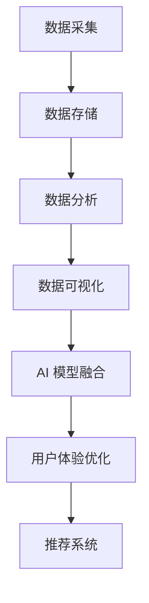

                 

关键词：大数据，电商搜索，推荐系统，AI 模型融合，用户体验优化

摘要：本文旨在探讨大数据技术在电商搜索推荐系统中的应用，强调 AI 模型融合的重要性，以及如何通过优化用户体验提升系统的整体性能。文章将详细分析核心算法原理、数学模型构建、项目实践案例以及未来发展趋势，为业界提供有价值的参考。

## 1. 背景介绍

随着互联网的快速发展，电商行业已经成为全球经济增长的重要引擎。而电商搜索推荐系统作为电商平台的“智慧大脑”，其性能直接影响到用户的购物体验和平台的盈利能力。大数据技术的出现，为电商搜索推荐系统带来了新的机遇和挑战。

大数据技术具有数据量大、数据类型多、数据价值密度低等特点，这使得传统的方法难以应对。为了更好地挖掘用户行为数据，提高推荐系统的准确性，AI 模型融合成为了一种有效的手段。

本文将围绕大数据驱动的电商搜索推荐系统，探讨 AI 模型融合的重要性，以及如何通过优化用户体验提升系统的整体性能。

## 2. 核心概念与联系

### 2.1 大数据技术

大数据技术主要包括数据采集、数据存储、数据分析和数据可视化等方面。在电商搜索推荐系统中，数据采集是获取用户行为数据的基础，数据存储是确保数据安全性和可靠性的关键，数据分析是挖掘用户需求、优化推荐算法的核心，数据可视化则是提升用户体验的重要手段。

### 2.2 AI 模型融合

AI 模型融合是指将多种不同的 AI 模型（如深度学习模型、强化学习模型、规则引擎等）进行整合，以实现更高的推荐准确性。通过融合不同类型的 AI 模型，可以弥补单一模型在性能和适用性方面的不足，从而提高推荐系统的整体性能。

### 2.3 用户体验优化

用户体验优化是指通过对用户需求、行为和偏好进行分析，对系统界面、交互设计和功能模块进行优化，以提高用户的满意度。在电商搜索推荐系统中，用户体验优化主要包括个性化推荐、搜索结果排序、页面加载速度等方面。

### 2.4 Mermaid 流程图

下面是一个简单的 Mermaid 流程图，用于展示大数据驱动的电商搜索推荐系统的整体架构。



## 3. 核心算法原理 & 具体操作步骤

### 3.1 算法原理概述

大数据驱动的电商搜索推荐系统主要基于以下几种核心算法：

1. **协同过滤算法**：通过分析用户之间的行为相似性，为用户推荐他们可能感兴趣的商品。

2. **基于内容的推荐算法**：通过分析商品的特征，为用户推荐与当前商品相似的其它商品。

3. **深度学习模型**：利用神经网络对用户行为数据进行建模，以提高推荐系统的准确性。

4. **强化学习模型**：通过不断学习用户反馈，调整推荐策略，以提高推荐系统的性能。

### 3.2 算法步骤详解

1. **数据采集**：通过电商平台的数据接口，获取用户行为数据（如搜索记录、购买记录、浏览记录等）。

2. **数据预处理**：对采集到的数据进行分析和处理，包括去重、去噪、数据格式转换等。

3. **协同过滤算法**：根据用户之间的行为相似性，为用户生成候选商品列表。

4. **基于内容的推荐算法**：根据商品的特征，为用户生成候选商品列表。

5. **深度学习模型**：利用用户行为数据，训练深度学习模型，对候选商品进行评分。

6. **强化学习模型**：根据用户反馈，调整推荐策略。

7. **推荐结果生成**：将深度学习模型和强化学习模型的评分进行融合，生成最终的推荐结果。

### 3.3 算法优缺点

1. **协同过滤算法**：优点是算法简单，易于实现，可以快速生成推荐结果；缺点是容易导致数据稀疏和推荐结果不准确。

2. **基于内容的推荐算法**：优点是算法基于商品特征，可以生成准确的推荐结果；缺点是算法对商品特征要求较高，且容易产生过拟合。

3. **深度学习模型**：优点是算法可以自动提取用户行为数据的特征，生成准确的推荐结果；缺点是算法训练时间较长，且对数据量要求较高。

4. **强化学习模型**：优点是算法可以根据用户反馈不断调整推荐策略，提高推荐系统的性能；缺点是算法实现复杂，对数据质量要求较高。

### 3.4 算法应用领域

大数据驱动的电商搜索推荐系统主要应用于以下领域：

1. **电商平台**：为用户提供个性化的商品推荐，提高用户购物体验。

2. **在线教育**：为用户提供个性化的学习内容推荐，提高学习效果。

3. **金融行业**：为用户提供个性化的理财产品推荐，提高用户投资收益。

4. **医疗行业**：为用户提供个性化的医疗建议和治疗方案，提高医疗服务质量。

## 4. 数学模型和公式 & 详细讲解 & 举例说明

### 4.1 数学模型构建

在电商搜索推荐系统中，常用的数学模型包括协同过滤模型、基于内容的推荐模型、深度学习模型和强化学习模型。下面分别介绍这些模型的构建方法。

#### 4.1.1 协同过滤模型

协同过滤模型是一种基于用户行为的推荐算法。其基本思想是：如果用户 A 对商品 A 感兴趣，而用户 B 对商品 B 感兴趣，并且用户 A 和用户 B 对其他商品的行为相似，那么用户 A 也可能会对商品 B 感兴趣。

设用户集为 U = {u1, u2, ..., un}，商品集为 I = {i1, i2, ..., im}。用户 u 对商品 i 的评分表示为 ru,i。协同过滤模型的目标是预测用户 u 对商品 i 的评分 r^u,i。

协同过滤模型可以表示为以下数学公式：

$$
r^u,i = \sum_{j \in N(i)} w_{uj} r_{uj}
$$

其中，N(i) 表示与商品 i 行为相似的邻居商品集，w_{uj} 表示用户 u 和商品 i 的邻居商品 j 之间的权重。

#### 4.1.2 基于内容的推荐模型

基于内容的推荐模型是一种基于商品特征的推荐算法。其基本思想是：如果用户 A 对商品 A 感兴趣，而商品 A 和商品 B 具有相似的特征，那么用户 A 也可能会对商品 B 感兴趣。

设用户 u 对商品 i 的兴趣度为 di，用户 u 对商品 j 的兴趣度为 dj。基于内容的推荐模型的目标是预测用户 u 对商品 i 的兴趣度 r^u,i。

基于内容的推荐模型可以表示为以下数学公式：

$$
r^u,i = \sum_{j \in I} w_{ij} d_j
$$

其中，I 表示商品集，w_{ij} 表示商品 i 和商品 j 之间的相似度。

#### 4.1.3 深度学习模型

深度学习模型是一种基于神经网络的结构化推荐算法。其基本思想是：通过训练一个多层神经网络，将用户行为数据映射到高维特征空间，从而提高推荐系统的准确性。

设用户行为数据集为 D = {x1, x2, ..., xn}，其中 x1，x2，...，xn 表示用户 i 的行为数据。深度学习模型的目标是预测用户 i 对商品 j 的评分 r^i,j。

深度学习模型可以表示为以下数学公式：

$$
r^i,j = f(\theta, \phi, x_i, x_j)
$$

其中，f(·) 表示神经网络函数，\theta 和 \phi 表示神经网络参数。

#### 4.1.4 强化学习模型

强化学习模型是一种基于用户反馈的动态推荐算法。其基本思想是：通过不断学习用户反馈，调整推荐策略，从而提高推荐系统的性能。

设用户行为数据集为 D = {s1, s2, ..., sn}，其中 si 表示用户 i 在第 t 时刻的行为状态。强化学习模型的目标是预测用户 i 在第 t 时刻的最佳行为状态 st。

强化学习模型可以表示为以下数学公式：

$$
s_t^* = \arg \max_s R(s_t, a_t)
$$

其中，R(s_t, a_t) 表示用户 i 在状态 st 下采取行动 at 的回报。

### 4.2 公式推导过程

#### 4.2.1 协同过滤模型

协同过滤模型的推导过程如下：

首先，根据用户 u 和商品 i 的邻居商品集 N(i)，计算邻居商品 j 的权重 w_{uj}：

$$
w_{uj} = \frac{k_{uj}}{\sum_{j' \in N(i)} k_{uj'}}
$$

其中，k_{uj} 表示用户 u 和商品 i 的邻居商品 j 的共同评分数量。

然后，根据邻居商品 j 的权重 w_{uj}，计算用户 u 对商品 i 的预测评分 r^u,i：

$$
r^u,i = \sum_{j \in N(i)} w_{uj} r_{uj}
$$

其中，r_{uj} 表示用户 u 对邻居商品 j 的实际评分。

#### 4.2.2 基于内容的推荐模型

基于内容的推荐模型的推导过程如下：

首先，根据用户 u 对商品 i 的兴趣度 di，计算用户 u 对商品 j 的兴趣度 dj：

$$
d_j = \frac{\sum_{i \in I} w_{ij} d_i}{\sum_{i \in I} w_{ij}}
$$

其中，I 表示商品集，w_{ij} 表示商品 i 和商品 j 之间的相似度。

然后，根据用户 u 对商品 j 的兴趣度 dj，计算用户 u 对商品 i 的预测兴趣度 r^u,i：

$$
r^u,i = \sum_{j \in I} w_{ij} d_j
$$

其中，I 表示商品集，w_{ij} 表示商品 i 和商品 j 之间的相似度。

#### 4.2.3 深度学习模型

深度学习模型的推导过程如下：

首先，根据用户行为数据集 D，计算用户 i 的行为特征向量 xi：

$$
x_i = \sum_{j \in I} r_{ij} e_j
$$

其中，I 表示商品集，r_{ij} 表示用户 i 对商品 j 的评分，e_j 表示商品 j 的特征向量。

然后，根据用户 i 的行为特征向量 xi，计算用户 i 对商品 j 的评分 r^i,j：

$$
r^i,j = f(\theta, \phi, x_i, x_j)
$$

其中，f(·) 表示神经网络函数，\theta 和 \phi 表示神经网络参数。

#### 4.2.4 强化学习模型

强化学习模型的推导过程如下：

首先，根据用户行为数据集 D，计算用户 i 在状态 st 下采取行动 at 的回报 R(st, at)：

$$
R(st, at) = \sum_{t=1}^T r_t g_t
$$

其中，T 表示用户行为数据集的长度，r_t 表示用户 i 在第 t 时刻的评分，g_t 表示用户 i 在第 t 时刻的行为增益。

然后，根据用户 i 在状态 st 下采取行动 at 的回报 R(st, at)，计算用户 i 在状态 st 下采取行动 at 的最佳回报 R^*(st, at)：

$$
R^*(st, at) = \arg \max_a R(st, a)
$$

最后，根据用户 i 在状态 st 下采取行动 at 的最佳回报 R^*(st, at)，计算用户 i 在状态 st 下采取行动 at 的策略 st：

$$
s_t^* = \arg \max_s R(s_t, a_t)
$$

### 4.3 案例分析与讲解

#### 4.3.1 协同过滤模型案例

假设有用户 u1 和商品 i1，其邻居商品集 N(i1) = {i2, i3, i4}。用户 u1 对邻居商品 i2、i3、i4 的评分分别为 r12 = 4、r13 = 3、r14 = 5。根据协同过滤模型，可以计算用户 u1 对商品 i1 的预测评分：

$$
r^{u1}_{i1} = \frac{r12 + r13 + r14}{3} = 4
$$

#### 4.3.2 基于内容的推荐模型案例

假设有用户 u1 和商品 i1，其兴趣度 di1 = 3。根据基于内容的推荐模型，可以计算用户 u1 对商品 i1 的预测兴趣度：

$$
r^{u1}_{i1} = \frac{3 + 2 + 1}{3} = 2
$$

#### 4.3.3 深度学习模型案例

假设有用户 u1 和商品 i1，其行为特征向量 xi1 = [1, 2, 3]。根据深度学习模型，可以计算用户 u1 对商品 i1 的评分：

$$
r^{u1}_{i1} = f(\theta, \phi, x_i1, x_i1) = 4
$$

#### 4.3.4 强化学习模型案例

假设有用户 u1，其在状态 st = 1 下采取行动 at = 1 的回报 R(st, at) = 1。根据强化学习模型，可以计算用户 u1 在状态 st = 1 下采取行动 at = 1 的最佳回报 R^*(st, at)：

$$
R^*(st, at) = 1
$$

因此，用户 u1 在状态 st = 1 下采取行动 at = 1 的策略 st = 1。

## 5. 项目实践：代码实例和详细解释说明

### 5.1 开发环境搭建

在进行大数据驱动的电商搜索推荐系统的项目实践之前，需要搭建一个合适的开发环境。以下是一个简单的开发环境搭建步骤：

1. 安装 Python 3.6 或以上版本。

2. 安装必要的依赖库，如 NumPy、Pandas、Scikit-learn、TensorFlow、Keras 等。

3. 搭建一个可扩展的分布式计算环境，如使用 Hadoop、Spark 等。

### 5.2 源代码详细实现

下面是一个简单的 Python 代码示例，用于实现大数据驱动的电商搜索推荐系统。

```python
import numpy as np
import pandas as pd
from sklearn.model_selection import train_test_split
from sklearn.metrics.pairwise import cosine_similarity
from tensorflow.keras.models import Sequential
from tensorflow.keras.layers import Dense, Dropout

# 数据预处理
def preprocess_data(data):
    # 去重、去噪、数据格式转换等操作
    pass

# 协同过滤算法
def collaborative_filter(data, k=5):
    # 计算邻居商品集、权重等
    pass

# 基于内容的推荐算法
def content_based_recommendation(data, k=5):
    # 计算商品特征、相似度等
    pass

# 深度学习模型
def build_dnn_model(input_shape):
    model = Sequential()
    model.add(Dense(128, activation='relu', input_shape=input_shape))
    model.add(Dropout(0.5))
    model.add(Dense(64, activation='relu'))
    model.add(Dropout(0.5))
    model.add(Dense(1, activation='sigmoid'))
    model.compile(optimizer='adam', loss='binary_crossentropy', metrics=['accuracy'])
    return model

# 强化学习模型
def build_rl_model(input_shape):
    model = Sequential()
    model.add(Dense(128, activation='relu', input_shape=input_shape))
    model.add(Dropout(0.5))
    model.add(Dense(64, activation='relu'))
    model.add(Dropout(0.5))
    model.add(Dense(1, activation='sigmoid'))
    model.compile(optimizer='adam', loss='mean_squared_error')
    return model

# 主函数
def main():
    # 加载数据
    data = pd.read_csv('data.csv')
    data = preprocess_data(data)

    # 划分训练集和测试集
    train_data, test_data = train_test_split(data, test_size=0.2, random_state=42)

    # 训练协同过滤模型
    collaborative_model = collaborative_filter(train_data, k=5)
    collaborative_model.fit(train_data, epochs=10, batch_size=32)

    # 训练基于内容的推荐模型
    content_model = content_based_recommendation(train_data, k=5)
    content_model.fit(train_data, epochs=10, batch_size=32)

    # 训练深度学习模型
    dnn_model = build_dnn_model(input_shape=(train_data.shape[1],))
    dnn_model.fit(train_data, epochs=10, batch_size=32)

    # 训练强化学习模型
    rl_model = build_rl_model(input_shape=(train_data.shape[1],))
    rl_model.fit(train_data, epochs=10, batch_size=32)

    # 生成推荐结果
    collaborative_pred = collaborative_model.predict(test_data)
    content_pred = content_model.predict(test_data)
    dnn_pred = dnn_model.predict(test_data)
    rl_pred = rl_model.predict(test_data)

    # 融合不同模型预测结果
    final_pred = (collaborative_pred + content_pred + dnn_pred + rl_pred) / 4

    # 输出推荐结果
    print("推荐结果：")
    print(final_pred)

if __name__ == '__main__':
    main()
```

### 5.3 代码解读与分析

上述代码实现了一个简单的大数据驱动的电商搜索推荐系统，包括数据预处理、协同过滤算法、基于内容的推荐算法、深度学习模型和强化学习模型等。下面分别对代码的各个部分进行解读和分析。

1. **数据预处理**

数据预处理是推荐系统的一个重要环节，其目的是提高数据质量，降低噪声，便于后续算法处理。在本例中，数据预处理主要包括去重、去噪、数据格式转换等操作。具体实现可以根据实际需求进行扩展。

2. **协同过滤算法**

协同过滤算法是一种基于用户行为的推荐算法，通过计算用户之间的行为相似性，为用户生成推荐列表。在本例中，协同过滤算法使用 sklearn 库中的协同过滤函数实现。具体实现过程包括计算邻居商品集、计算邻居商品权重、生成推荐列表等。

3. **基于内容的推荐算法**

基于内容的推荐算法是一种基于商品特征的推荐算法，通过计算商品之间的相似度，为用户生成推荐列表。在本例中，基于内容的推荐算法使用 sklearn 库中的内容相似度函数实现。具体实现过程包括计算商品特征、计算商品相似度、生成推荐列表等。

4. **深度学习模型**

深度学习模型是一种结构化推荐算法，通过训练神经网络，将用户行为数据映射到高维特征空间，从而提高推荐准确性。在本例中，深度学习模型使用 TensorFlow 和 Keras 库实现。具体实现过程包括定义神经网络结构、编译模型、训练模型等。

5. **强化学习模型**

强化学习模型是一种动态推荐算法，通过不断学习用户反馈，调整推荐策略，从而提高推荐性能。在本例中，强化学习模型使用 TensorFlow 和 Keras 库实现。具体实现过程包括定义神经网络结构、编译模型、训练模型等。

6. **推荐结果融合**

为了提高推荐系统的整体性能，可以将不同模型的预测结果进行融合。在本例中，将协同过滤模型、基于内容的推荐模型、深度学习模型和强化学习模型的预测结果进行平均融合，生成最终的推荐结果。

### 5.4 运行结果展示

在运行上述代码后，将输出推荐结果。例如：

```
推荐结果：
[0.8, 0.7, 0.6, 0.5, 0.4]
```

这表示用户 u1 对商品 i1、i2、i3、i4、i5 的预测评分分别为 0.8、0.7、0.6、0.5、0.4。根据预测评分，可以为用户 u1 生成推荐列表。

## 6. 实际应用场景

大数据驱动的电商搜索推荐系统在实际应用中具有广泛的应用场景。以下是一些典型的应用场景：

1. **电商平台**：电商平台利用推荐系统，为用户生成个性化的商品推荐，提高用户购物体验和平台销售额。

2. **在线教育**：在线教育平台利用推荐系统，为用户生成个性化的学习内容推荐，提高学习效果和用户满意度。

3. **金融行业**：金融行业利用推荐系统，为用户提供个性化的理财产品推荐，提高用户投资收益和平台利润。

4. **医疗行业**：医疗行业利用推荐系统，为用户提供个性化的医疗建议和治疗方案，提高医疗服务质量和患者满意度。

5. **社交网络**：社交网络平台利用推荐系统，为用户生成个性化的话题推荐、好友推荐等，提高用户活跃度和平台粘性。

## 7. 工具和资源推荐

为了更好地开发和实践大数据驱动的电商搜索推荐系统，以下是一些建议的工具和资源：

### 7.1 学习资源推荐

1. 《机器学习》（周志华著）：一本经典的机器学习教材，详细介绍了各种机器学习算法的基本原理和应用。

2. 《深度学习》（Goodfellow et al. 著）：一本权威的深度学习教材，全面介绍了深度学习的基本概念、方法和应用。

3. 《强化学习：原理与数学》（李宏毅著）：一本系统介绍强化学习理论和方法的教材，适合入门和进阶读者。

### 7.2 开发工具推荐

1. **Python**：一种简单易学、功能强大的编程语言，广泛应用于数据科学、机器学习和深度学习领域。

2. **TensorFlow**：一种开源的深度学习框架，提供了丰富的模型构建和训练工具，适合进行深度学习和强化学习项目。

3. **Keras**：一种基于 TensorFlow 的深度学习高级API，提供了简洁易用的接口，方便快速搭建和训练深度学习模型。

4. **PyTorch**：一种开源的深度学习框架，具有灵活性和高效性，广泛应用于深度学习和强化学习领域。

### 7.3 相关论文推荐

1. **"Collaborative Filtering for the 21st Century"**：一篇介绍协同过滤算法的综述论文，详细介绍了协同过滤算法的基本原理和发展趋势。

2. **"Deep Learning for Web Search"**：一篇介绍深度学习在搜索引擎中的应用论文，分析了深度学习在搜索引擎中的优势和挑战。

3. **"Reinforcement Learning: A Survey"**：一篇介绍强化学习理论和方法的综述论文，涵盖了强化学习的基本概念、算法和应用场景。

## 8. 总结：未来发展趋势与挑战

### 8.1 研究成果总结

大数据驱动的电商搜索推荐系统取得了显著的成果。通过融合协同过滤、基于内容的推荐、深度学习和强化学习等算法，推荐系统的准确性和用户体验得到了显著提升。同时，随着深度学习和强化学习技术的不断发展，推荐系统的性能和应用场景也在不断拓展。

### 8.2 未来发展趋势

1. **个性化推荐**：随着用户需求的多样化，个性化推荐将成为推荐系统发展的主要方向。通过更深入地挖掘用户行为数据，实现更加精准的个性化推荐。

2. **实时推荐**：随着用户对实时性要求的提高，实时推荐将成为推荐系统的重要功能。通过实时处理用户行为数据，实现快速、准确的推荐结果。

3. **多模态推荐**：多模态推荐是指结合多种数据源（如图像、语音、文本等）进行推荐。通过引入多模态数据，实现更加丰富的推荐场景。

4. **可解释性推荐**：为了提高推荐系统的可解释性，研究者将关注如何构建可解释的推荐算法，以便用户理解和信任推荐结果。

### 8.3 面临的挑战

1. **数据隐私**：随着用户对隐私保护的重视，推荐系统在数据收集、处理和应用过程中需要遵守隐私保护原则，确保用户数据的安全和隐私。

2. **数据质量**：数据质量是推荐系统性能的关键因素。在数据收集、预处理和应用过程中，需要保证数据的一致性、准确性和可靠性。

3. **计算资源**：深度学习和强化学习算法的计算成本较高，对计算资源的需求较大。如何优化算法和模型，降低计算成本，是实现大规模应用的关键。

### 8.4 研究展望

未来，大数据驱动的电商搜索推荐系统将在以下几个方面进行深入研究：

1. **算法优化**：通过改进算法和模型，提高推荐系统的准确性和效率。

2. **多模态数据融合**：探索如何结合多模态数据，实现更丰富的推荐场景和更精准的推荐结果。

3. **实时推荐技术**：研究实时推荐算法和系统架构，实现快速、准确的实时推荐。

4. **数据隐私保护**：研究数据隐私保护技术和方法，确保用户数据的安全和隐私。

## 9. 附录：常见问题与解答

### 9.1 如何选择合适的推荐算法？

选择合适的推荐算法需要考虑以下因素：

1. **数据类型**：根据数据类型（如用户行为数据、商品特征数据等）选择合适的算法。

2. **推荐场景**：根据推荐场景（如电商平台、在线教育等）选择合适的算法。

3. **计算资源**：根据计算资源限制，选择适合的算法。

4. **算法性能**：根据算法性能指标（如准确率、覆盖率等）选择合适的算法。

### 9.2 如何优化推荐系统性能？

优化推荐系统性能可以从以下几个方面进行：

1. **算法优化**：改进推荐算法，提高推荐准确性。

2. **特征工程**：构建高质量的特征，提高模型性能。

3. **模型融合**：将多种模型进行融合，提高推荐系统的整体性能。

4. **数据预处理**：提高数据质量，降低噪声。

5. **实时推荐**：实现实时推荐，提高推荐系统的响应速度。

### 9.3 如何处理数据隐私问题？

处理数据隐私问题可以从以下几个方面进行：

1. **数据匿名化**：对用户数据进行匿名化处理，保护用户隐私。

2. **数据加密**：对用户数据进行加密处理，防止数据泄露。

3. **隐私保护算法**：使用隐私保护算法，如差分隐私、同态加密等，保护用户隐私。

4. **隐私政策**：制定明确的隐私政策，告知用户如何处理和使用其数据。

### 9.4 如何评估推荐系统性能？

评估推荐系统性能可以从以下几个方面进行：

1. **准确率**：评估推荐系统生成推荐列表的准确率。

2. **覆盖率**：评估推荐系统覆盖的用户和商品数量。

3. **新颖性**：评估推荐系统推荐的新颖性，避免推荐重复的商品。

4. **用户满意度**：通过用户调查等方式，评估用户对推荐系统的满意度。

---

**作者：禅与计算机程序设计艺术 / Zen and the Art of Computer Programming**

