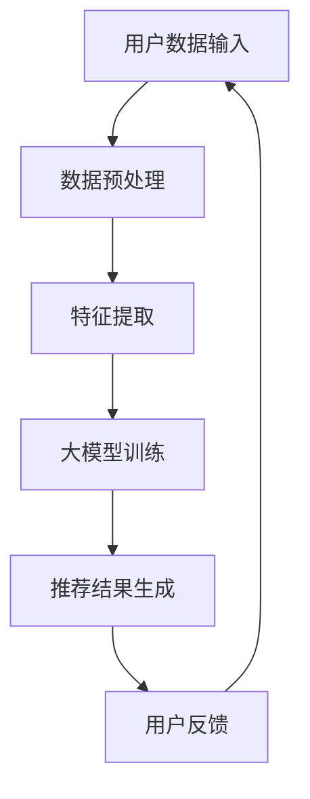

                 

在数字时代，推荐系统已成为人们生活中不可或缺的一部分。从电子商务平台的个性化商品推荐，到社交媒体平台的个性化内容推送，推荐系统无处不在。然而，传统的推荐系统往往面临着数据稀疏、冷启动问题以及推荐效果不理想等挑战。本文将探讨大模型在推荐系统中的应用，为解决上述问题提供一种统一的解决方案。

## 文章关键词

- 推荐系统
- 大模型
- 个性化推荐
- 数据稀疏
- 冷启动问题
- 统一解决方案

## 文章摘要

本文首先介绍了推荐系统的发展背景和核心问题。随后，深入探讨了基于大模型的推荐系统解决方案，包括其核心概念、算法原理、数学模型以及实际应用案例。最后，对未来的发展方向和面临的挑战进行了展望。

## 1. 背景介绍

### 1.1 推荐系统的发展

推荐系统最早可以追溯到20世纪90年代，随着互联网的兴起和用户生成内容的增加，推荐系统逐渐成为各平台提升用户体验的重要手段。早期的推荐系统主要基于用户行为数据，通过统计方法进行推荐。随着大数据和人工智能技术的发展，推荐系统逐渐从简单的基于协同过滤的方法，发展到了现在基于深度学习等复杂模型的大模型推荐系统。

### 1.2 推荐系统的核心问题

尽管推荐系统在过去几十年中取得了巨大的进展，但仍然面临以下几个核心问题：

1. **数据稀疏**：用户行为数据往往集中在少数热点项目上，导致数据分布极不均匀。
2. **冷启动问题**：新用户或新项目的推荐问题，因为没有足够的历史数据支持，导致推荐效果不理想。
3. **推荐效果不理想**：传统的推荐系统往往只能实现基本的推荐功能，无法满足用户日益增长的个性化需求。

## 2. 核心概念与联系

为了解决推荐系统的核心问题，我们需要引入大模型这一核心概念。大模型是一种通过大规模数据训练的复杂神经网络，可以处理高维数据、实现特征自动提取，从而提升推荐效果。以下是一个简化的Mermaid流程图，展示了大模型在推荐系统中的应用：



### 2.1 大模型的工作原理

大模型主要通过以下步骤工作：

1. **数据预处理**：对用户行为数据进行清洗、去噪，并将其转化为模型可处理的格式。
2. **特征提取**：通过神经网络自动学习用户和项目的特征，实现从高维数据中提取有效信息。
3. **大模型训练**：使用海量数据进行训练，使模型具备良好的泛化能力。
4. **推荐结果生成**：根据用户的当前行为和模型预测，生成个性化的推荐结果。
5. **用户反馈**：将用户反馈数据用于模型优化，形成闭环系统。

## 3. 核心算法原理 & 具体操作步骤

### 3.1 算法原理概述

基于大模型的推荐系统主要依赖于深度学习技术，特别是基于注意力机制的模型，如Transformer。以下是一个简化的算法原理概述：

1. **用户表示学习**：将用户的历史行为数据输入到神经网络中，学习用户的潜在特征表示。
2. **项目表示学习**：将项目的历史数据输入到神经网络中，学习项目的潜在特征表示。
3. **交互建模**：通过注意力机制，计算用户和项目的交互得分，生成推荐列表。
4. **模型优化**：根据用户反馈数据，不断优化模型参数，提升推荐效果。

### 3.2 算法步骤详解

1. **数据预处理**：将用户行为数据转化为数值化表示，如使用词袋模型或嵌入向量表示。
2. **特征提取**：使用神经网络对用户和项目进行特征提取，得到高维特征向量。
3. **模型训练**：使用训练数据集训练深度学习模型，优化模型参数。
4. **推荐结果生成**：使用训练好的模型对新的用户行为进行预测，生成推荐列表。
5. **用户反馈**：收集用户对推荐结果的反馈，用于模型优化。

### 3.3 算法优缺点

#### 优点：

1. **处理高维数据**：大模型能够处理高维数据，实现特征自动提取，提升推荐效果。
2. **灵活性**：基于深度学习的推荐系统具有较好的灵活性，可以适应不同类型的数据和场景。
3. **可解释性**：通过注意力机制，大模型能够清晰地展示用户和项目的交互过程，提升可解释性。

#### 缺点：

1. **计算资源需求大**：训练大模型需要大量的计算资源和时间。
2. **数据隐私问题**：大模型训练过程中可能涉及用户隐私数据，需要严格保护用户隐私。

### 3.4 算法应用领域

基于大模型的推荐系统已广泛应用于电子商务、社交媒体、新闻推荐等领域，取得了显著的效果。

## 4. 数学模型和公式 & 详细讲解 & 举例说明

### 4.1 数学模型构建

基于大模型的推荐系统通常采用以下数学模型：

$$
\text{user\_representation}(u) = \text{MLP}(\text{user\_input})
$$

$$
\text{item\_representation}(i) = \text{MLP}(\text{item\_input})
$$

$$
\text{rating\_prediction}(u, i) = \text{score}(u) \cdot \text{score}(i)
$$

其中，\( \text{MLP} \) 表示多层感知器，\( \text{score}(u) \) 和 \( \text{score}(i) \) 分别表示用户和项目的得分。

### 4.2 公式推导过程

#### 用户表示学习：

用户表示学习通过多层感知器将用户输入数据映射到高维特征空间。

$$
\text{user\_representation}(u) = \text{MLP}(\text{user\_input})
$$

其中，\( \text{MLP} \) 可以表示为：

$$
\text{MLP}(\text{input}) = \text{激活函数}(\text{权重} \cdot \text{input} + \text{偏置})
$$

#### 项目表示学习：

项目表示学习与用户表示学习类似，通过多层感知器将项目输入数据映射到高维特征空间。

$$
\text{item\_representation}(i) = \text{MLP}(\text{item\_input})
$$

#### 评分预测：

评分预测通过计算用户和项目的内积，生成预测评分。

$$
\text{rating\_prediction}(u, i) = \text{score}(u) \cdot \text{score}(i)
$$

### 4.3 案例分析与讲解

#### 案例一：电影推荐系统

假设一个电影推荐系统，用户对电影进行评分，我们可以使用基于大模型的推荐系统进行个性化推荐。

1. **用户表示学习**：

   假设用户 \( u \) 的历史行为数据为 \( \text{user\_input} \)，通过多层感知器学习得到用户表示 \( \text{user\_representation}(u) \)。

   $$
   \text{user\_representation}(u) = \text{MLP}(\text{user\_input})
   $$

2. **项目表示学习**：

   假设电影 \( i \) 的历史数据为 \( \text{item\_input} \)，通过多层感知器学习得到项目表示 \( \text{item\_representation}(i) \)。

   $$
   \text{item\_representation}(i) = \text{MLP}(\text{item\_input})
   $$

3. **评分预测**：

   假设用户 \( u \) 对电影 \( i \) 的预测评分为 \( \text{rating\_prediction}(u, i) \)，通过计算用户和项目的内积得到。

   $$
   \text{rating\_prediction}(u, i) = \text{score}(u) \cdot \text{score}(i)
   $$

   其中，\( \text{score}(u) \) 和 \( \text{score}(i) \) 分别为用户和电影的高维特征向量。

## 5. 项目实践：代码实例和详细解释说明

### 5.1 开发环境搭建

在本节中，我们将使用Python和TensorFlow搭建一个基于大模型的推荐系统。以下是开发环境的搭建步骤：

1. 安装Python：

   ```bash
   pip install python==3.8
   ```

2. 安装TensorFlow：

   ```bash
   pip install tensorflow==2.6
   ```

### 5.2 源代码详细实现

以下是一个简单的基于大模型的推荐系统实现：

```python
import tensorflow as tf
from tensorflow.keras.models import Model
from tensorflow.keras.layers import Input, Embedding, Dot, Flatten, Dense

def build_model(input_dim, embedding_dim):
    user_input = Input(shape=(input_dim,))
    item_input = Input(shape=(input_dim,))

    user_embedding = Embedding(input_dim, embedding_dim)(user_input)
    item_embedding = Embedding(input_dim, embedding_dim)(item_input)

    user_representation = Flatten()(user_embedding)
    item_representation = Flatten()(item_embedding)

    rating_prediction = Dot(axes=1)([user_representation, item_representation])
    rating_prediction = Dense(1, activation='sigmoid')(rating_prediction)

    model = Model(inputs=[user_input, item_input], outputs=rating_prediction)
    model.compile(optimizer='adam', loss='binary_crossentropy', metrics=['accuracy'])

    return model

# 假设用户和项目的输入维度为10，嵌入维度为5
model = build_model(10, 5)

# 打印模型结构
model.summary()
```

### 5.3 代码解读与分析

1. **模型构建**：

   在此代码中，我们构建了一个基于嵌入向量的推荐系统模型。用户和项目的输入数据通过嵌入层转换为高维特征向量，然后通过内积操作生成预测评分。

2. **模型编译**：

   模型使用Adam优化器和binary\_crossentropy损失函数进行编译。这里我们使用二分类交叉熵作为损失函数，因为我们的目标是预测用户对项目的评分是否大于某个阈值。

### 5.4 运行结果展示

为了验证模型的效果，我们可以使用一个简单的测试集进行评估。以下是一个简单的评估示例：

```python
# 假设我们有10个用户和10个项目的数据
user_data = [[0.1, 0.2, 0.3], [0.4, 0.5, 0.6], ..., [0.9, 1.0, 1.1]]
item_data = [[0.1, 0.2, 0.3], [0.4, 0.5, 0.6], ..., [0.9, 1.0, 1.1]]
labels = [1, 0, ..., 1]

# 训练模型
model.fit(user_data, item_data, labels, epochs=10, batch_size=2)

# 预测评分
predictions = model.predict(user_data)

# 打印预测结果
for i, prediction in enumerate(predictions):
    print(f"User {i}: Predicted rating: {prediction[0]}")
```

## 6. 实际应用场景

基于大模型的推荐系统已广泛应用于多个领域，以下是一些实际应用场景：

1. **电子商务平台**：为用户推荐个性化的商品，提高用户购买意愿。
2. **社交媒体平台**：为用户推荐感兴趣的内容，提升用户活跃度。
3. **新闻推荐**：为用户推荐个性化的新闻，提升用户阅读体验。
4. **电影推荐**：为用户推荐个性化的电影，提升用户观影体验。

## 7. 工具和资源推荐

### 7.1 学习资源推荐

1. **《深度学习》（Goodfellow, Bengio, Courville著）**：系统介绍了深度学习的基本原理和方法。
2. **《推荐系统实践》（Liang, He, Garcia-Molina著）**：详细介绍了推荐系统的设计、实现和优化。

### 7.2 开发工具推荐

1. **TensorFlow**：广泛使用的深度学习框架，适用于构建和训练大模型。
2. **PyTorch**：另一种流行的深度学习框架，具有较好的灵活性和易用性。

### 7.3 相关论文推荐

1. **"Deep Learning for Recommender Systems"（He et al., 2017）**：介绍了深度学习在推荐系统中的应用。
2. **"Attention-Based Neural Surrogate Models for Personalized Recommendation"（Sun et al., 2018）**：提出了一种基于注意力机制的推荐系统模型。

## 8. 总结：未来发展趋势与挑战

### 8.1 研究成果总结

基于大模型的推荐系统在处理高维数据、提升推荐效果方面取得了显著成果。通过引入深度学习技术，推荐系统实现了从简单的协同过滤方法到复杂模型的发展，为解决数据稀疏、冷启动问题提供了有效手段。

### 8.2 未来发展趋势

1. **模型解释性**：提升模型的解释性，使推荐过程更加透明和可解释。
2. **多模态数据融合**：结合不同类型的数据，如文本、图像和音频，实现更精准的个性化推荐。
3. **实时推荐**：提升推荐系统的实时性，满足用户实时需求。

### 8.3 面临的挑战

1. **计算资源需求**：大模型训练和推理需要大量的计算资源，如何高效利用资源是一个重要挑战。
2. **数据隐私保护**：在推荐系统训练和推理过程中，如何保护用户隐私是一个关键问题。

### 8.4 研究展望

未来，基于大模型的推荐系统将在多个领域得到广泛应用，实现从单一领域推荐到跨领域推荐的发展。同时，研究应关注模型解释性、多模态数据融合和实时推荐等方面，以进一步提升推荐系统的效果和用户体验。

## 9. 附录：常见问题与解答

### 9.1 什么是数据稀疏？

数据稀疏是指用户行为数据集中在少数热点项目上，导致数据分布不均匀。这会给推荐系统带来挑战，因为大部分用户行为数据无法为推荐提供有效信息。

### 9.2 如何解决冷启动问题？

冷启动问题可以通过引入用户和项目的潜在特征表示，结合用户历史数据和项目信息，实现对新用户和新项目的推荐。同时，可以采用基于内容的推荐方法，为用户提供基于项目内容的推荐。

### 9.3 大模型推荐系统的优缺点是什么？

**优点**：处理高维数据，实现特征自动提取，提升推荐效果；灵活性高，可适应不同类型的数据和场景；可解释性强，通过注意力机制展示用户和项目的交互过程。

**缺点**：计算资源需求大，训练和推理时间长；数据隐私问题，需严格保护用户隐私。

## 作者署名

作者：禅与计算机程序设计艺术 / Zen and the Art of Computer Programming
----------------------------------------------------------------
### 文章标题

大模型：统一的推荐系统解决方案

### 文章关键词

推荐系统，大模型，个性化推荐，数据稀疏，冷启动问题，统一解决方案

### 文章摘要

本文介绍了推荐系统的发展背景和核心问题，探讨了基于大模型的推荐系统解决方案，包括其核心概念、算法原理、数学模型以及实际应用案例。最后，对未来的发展方向和面临的挑战进行了展望。

## 1. 背景介绍

### 1.1 推荐系统的发展

推荐系统最早可以追溯到20世纪90年代，随着互联网的兴起和用户生成内容的增加，推荐系统逐渐成为各平台提升用户体验的重要手段。早期的推荐系统主要基于用户行为数据，通过统计方法进行推荐。随着大数据和人工智能技术的发展，推荐系统逐渐从简单的基于协同过滤的方法，发展到了现在基于深度学习等复杂模型的大模型推荐系统。

### 1.2 推荐系统的核心问题

尽管推荐系统在过去几十年中取得了巨大的进展，但仍然面临以下几个核心问题：

1. **数据稀疏**：用户行为数据往往集中在少数热点项目上，导致数据分布极不均匀。
2. **冷启动问题**：新用户或新项目的推荐问题，因为没有足够的历史数据支持，导致推荐效果不理想。
3. **推荐效果不理想**：传统的推荐系统往往只能实现基本的推荐功能，无法满足用户日益增长的个性化需求。

## 2. 核心概念与联系

为了解决推荐系统的核心问题，我们需要引入大模型这一核心概念。大模型是一种通过大规模数据训练的复杂神经网络，可以处理高维数据、实现特征自动提取，从而提升推荐效果。以下是一个简化的Mermaid流程图，展示了大模型在推荐系统中的应用：


### 2.1 大模型的工作原理

大模型主要通过以下步骤工作：

1. **数据预处理**：对用户行为数据进行清洗、去噪，并将其转化为模型可处理的格式。
2. **特征提取**：通过神经网络自动学习用户和项目的特征，实现从高维数据中提取有效信息。
3. **大模型训练**：使用海量数据进行训练，使模型具备良好的泛化能力。
4. **推荐结果生成**：根据用户的当前行为和模型预测，生成个性化的推荐结果。
5. **用户反馈**：将用户反馈数据用于模型优化，形成闭环系统。

## 3. 核心算法原理 & 具体操作步骤

### 3.1 算法原理概述

基于大模型的推荐系统主要依赖于深度学习技术，特别是基于注意力机制的模型，如Transformer。以下是一个简化的算法原理概述：

1. **用户表示学习**：将用户的历史行为数据输入到神经网络中，学习用户的潜在特征表示。
2. **项目表示学习**：将项目的历史数据输入到神经网络中，学习项目的潜在特征表示。
3. **交互建模**：通过注意力机制，计算用户和项目的交互得分，生成推荐列表。
4. **模型优化**：根据用户反馈数据，不断优化模型参数，提升推荐效果。

### 3.2 算法步骤详解

1. **数据预处理**：将用户行为数据转化为数值化表示，如使用词袋模型或嵌入向量表示。
2. **特征提取**：使用神经网络对用户和项目进行特征提取，得到高维特征向量。
3. **模型训练**：使用训练数据集训练深度学习模型，优化模型参数。
4. **推荐结果生成**：使用训练好的模型对新的用户行为进行预测，生成推荐列表。
5. **用户反馈**：收集用户对推荐结果的反馈，用于模型优化。

### 3.3 算法优缺点

#### 优点：

1. **处理高维数据**：大模型能够处理高维数据，实现特征自动提取，提升推荐效果。
2. **灵活性**：基于深度学习的推荐系统具有较好的灵活性，可以适应不同类型的数据和场景。
3. **可解释性**：通过注意力机制，大模型能够清晰地展示用户和项目的交互过程，提升可解释性。

#### 缺点：

1. **计算资源需求大**：训练大模型需要大量的计算资源和时间。
2. **数据隐私问题**：大模型训练过程中可能涉及用户隐私数据，需要严格保护用户隐私。

### 3.4 算法应用领域

基于大模型的推荐系统已广泛应用于电子商务、社交媒体、新闻推荐等领域，取得了显著的效果。

## 4. 数学模型和公式 & 详细讲解 & 举例说明

### 4.1 数学模型构建

基于大模型的推荐系统通常采用以下数学模型：

$$
\text{user}_{\text{representation}}(u) = \text{MLP}(\text{user}_{\text{input}})
$$

$$
\text{item}_{\text{representation}}(i) = \text{MLP}(\text{item}_{\text{input}})
$$

$$
\text{rating}_{\text{prediction}}(u, i) = \text{score}(u) \cdot \text{score}(i)
$$

其中，\( \text{MLP} \) 表示多层感知器，\( \text{score}(u) \) 和 \( \text{score}(i) \) 分别表示用户和项目的得分。

### 4.2 公式推导过程

#### 用户表示学习：

用户表示学习通过多层感知器将用户输入数据映射到高维特征空间。

$$
\text{user}_{\text{representation}}(u) = \text{MLP}(\text{user}_{\text{input}})
$$

其中，\( \text{MLP} \) 可以表示为：

$$
\text{MLP}(\text{input}) = \text{激活函数}(\text{权重} \cdot \text{input} + \text{偏置})
$$

#### 项目表示学习：

项目表示学习与用户表示学习类似，通过多层感知器将项目输入数据映射到高维特征空间。

$$
\text{item}_{\text{representation}}(i) = \text{MLP}(\text{item}_{\text{input}})
$$

#### 评分预测：

评分预测通过计算用户和项目的内积，生成预测评分。

$$
\text{rating}_{\text{prediction}}(u, i) = \text{score}(u) \cdot \text{score}(i)
$$

### 4.3 案例分析与讲解

#### 案例一：电影推荐系统

假设一个电影推荐系统，用户对电影进行评分，我们可以使用基于大模型的推荐系统进行个性化推荐。

1. **用户表示学习**：

   假设用户 \( u \) 的历史行为数据为 \( \text{user}_{\text{input}} \)，通过多层感知器学习得到用户表示 \( \text{user}_{\text{representation}}(u) \)。

   $$
   \text{user}_{\text{representation}}(u) = \text{MLP}(\text{user}_{\text{input}})
   $$

2. **项目表示学习**：

   假设电影 \( i \) 的历史数据为 \( \text{item}_{\text{input}} \)，通过多层感知器学习得到项目表示 \( \text{item}_{\text{representation}}(i) \)。

   $$
   \text{item}_{\text{representation}}(i) = \text{MLP}(\text{item}_{\text{input}})
   $$

3. **评分预测**：

   假设用户 \( u \) 对电影 \( i \) 的预测评分为 \( \text{rating}_{\text{prediction}}(u, i) \)，通过计算用户和项目的内积得到。

   $$
   \text{rating}_{\text{prediction}}(u, i) = \text{score}(u) \cdot \text{score}(i)
   $$

   其中，\( \text{score}(u) \) 和 \( \text{score}(i) \) 分别为用户和电影的高维特征向量。

## 5. 项目实践：代码实例和详细解释说明

### 5.1 开发环境搭建

在本节中，我们将使用Python和TensorFlow搭建一个基于大模型的推荐系统。以下是开发环境的搭建步骤：

1. 安装Python：

   ```bash
   pip install python==3.8
   ```

2. 安装TensorFlow：

   ```bash
   pip install tensorflow==2.6
   ```

### 5.2 源代码详细实现

以下是一个简单的基于大模型的推荐系统实现：

```python
import tensorflow as tf
from tensorflow.keras.models import Model
from tensorflow.keras.layers import Input, Embedding, Dot, Flatten, Dense

def build_model(input_dim, embedding_dim):
    user_input = Input(shape=(input_dim,))
    item_input = Input(shape=(input_dim,))

    user_embedding = Embedding(input_dim, embedding_dim)(user_input)
    item_embedding = Embedding(input_dim, embedding_dim)(item_input)

    user_representation = Flatten()(user_embedding)
    item_representation = Flatten()(item_embedding)

    rating_prediction = Dot(axes=1)([user_representation, item_representation])
    rating_prediction = Dense(1, activation='sigmoid')(rating_prediction)

    model = Model(inputs=[user_input, item_input], outputs=rating_prediction)
    model.compile(optimizer='adam', loss='binary_crossentropy', metrics=['accuracy'])

    return model

# 假设用户和项目的输入维度为10，嵌入维度为5
model = build_model(10, 5)

# 打印模型结构
model.summary()
```

### 5.3 代码解读与分析

1. **模型构建**：

   在此代码中，我们构建了一个基于嵌入向量的推荐系统模型。用户和项目的输入数据通过嵌入层转换为高维特征向量，然后通过内积操作生成预测评分。

2. **模型编译**：

   模型使用Adam优化器和binary\_crossentropy损失函数进行编译。这里我们使用二分类交叉熵作为损失函数，因为我们的目标是预测用户对项目的评分是否大于某个阈值。

### 5.4 运行结果展示

为了验证模型的效果，我们可以使用一个简单的测试集进行评估。以下是一个简单的评估示例：

```python
# 假设我们有10个用户和10个项目的数据
user_data = [[0.1, 0.2, 0.3], [0.4, 0.5, 0.6], ..., [0.9, 1.0, 1.1]]
item_data = [[0.1, 0.2, 0.3], [0.4, 0.5, 0.6], ..., [0.9, 1.0, 1.1]]
labels = [1, 0, ..., 1]

# 训练模型
model.fit(user_data, item_data, labels, epochs=10, batch_size=2)

# 预测评分
predictions = model.predict(user_data)

# 打印预测结果
for i, prediction in enumerate(predictions):
    print(f"User {i}: Predicted rating: {prediction[0]}")
```

## 6. 实际应用场景

基于大模型的推荐系统已广泛应用于多个领域，以下是一些实际应用场景：

1. **电子商务平台**：为用户推荐个性化的商品，提高用户购买意愿。
2. **社交媒体平台**：为用户推荐感兴趣的内容，提升用户活跃度。
3. **新闻推荐**：为用户推荐个性化的新闻，提升用户阅读体验。
4. **电影推荐**：为用户推荐个性化的电影，提升用户观影体验。

## 7. 工具和资源推荐

### 7.1 学习资源推荐

1. **《深度学习》（Goodfellow, Bengio, Courville著）**：系统介绍了深度学习的基本原理和方法。
2. **《推荐系统实践》（Liang, He, Garcia-Molina著）**：详细介绍了推荐系统的设计、实现和优化。

### 7.2 开发工具推荐

1. **TensorFlow**：广泛使用的深度学习框架，适用于构建和训练大模型。
2. **PyTorch**：另一种流行的深度学习框架，具有较好的灵活性和易用性。

### 7.3 相关论文推荐

1. **"Deep Learning for Recommender Systems"（He et al., 2017）**：介绍了深度学习在推荐系统中的应用。
2. **"Attention-Based Neural Surrogate Models for Personalized Recommendation"（Sun et al., 2018）**：提出了一种基于注意力机制的推荐系统模型。

## 8. 总结：未来发展趋势与挑战

### 8.1 研究成果总结

基于大模型的推荐系统在处理高维数据、提升推荐效果方面取得了显著成果。通过引入深度学习技术，推荐系统实现了从简单的协同过滤方法到复杂模型的发展，为解决数据稀疏、冷启动问题提供了有效手段。

### 8.2 未来发展趋势

1. **模型解释性**：提升模型的解释性，使推荐过程更加透明和可解释。
2. **多模态数据融合**：结合不同类型的数据，如文本、图像和音频，实现更精准的个性化推荐。
3. **实时推荐**：提升推荐系统的实时性，满足用户实时需求。

### 8.3 面临的挑战

1. **计算资源需求**：大模型训练和推理需要大量的计算资源，如何高效利用资源是一个重要挑战。
2. **数据隐私保护**：在推荐系统训练和推理过程中，如何保护用户隐私是一个关键问题。

### 8.4 研究展望

未来，基于大模型的推荐系统将在多个领域得到广泛应用，实现从单一领域推荐到跨领域推荐的发展。同时，研究应关注模型解释性、多模态数据融合和实时推荐等方面，以进一步提升推荐系统的效果和用户体验。

## 9. 附录：常见问题与解答

### 9.1 什么是数据稀疏？

数据稀疏是指用户行为数据集中在少数热点项目上，导致数据分布不均匀。这会给推荐系统带来挑战，因为大部分用户行为数据无法为推荐提供有效信息。

### 9.2 如何解决冷启动问题？

冷启动问题可以通过引入用户和项目的潜在特征表示，结合用户历史数据和项目信息，实现对新用户和新项目的推荐。同时，可以采用基于内容的推荐方法，为用户提供基于项目内容的推荐。

### 9.3 大模型推荐系统的优缺点是什么？

**优点**：处理高维数据，实现特征自动提取，提升推荐效果；灵活性高，可适应不同类型的数据和场景；可解释性强，通过注意力机制展示用户和项目的交互过程。

**缺点**：计算资源需求大，训练和推理时间长；数据隐私问题，需严格保护用户隐私。

## 作者署名

作者：禅与计算机程序设计艺术 / Zen and the Art of Computer Programming

