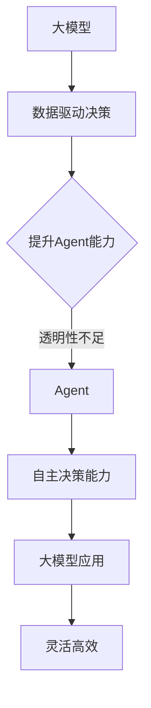

                 

关键词：大模型，Agent，AI，深度学习，智能决策

摘要：本文旨在探讨大模型与Agent之间的相互关系。随着深度学习技术的发展，大模型在数据处理和预测方面表现出色，但它们的决策过程往往缺乏透明性和可解释性。Agent作为一种智能体，能够在复杂环境中进行自主决策，但其能力往往受到数据质量和计算资源限制。本文将分析大模型和Agent各自的优势和不足，探讨如何将二者结合起来，以实现更高效的智能决策。

## 1. 背景介绍

近年来，人工智能领域取得了显著的进展，特别是深度学习技术的快速发展，使得大模型在图像识别、自然语言处理和游戏对弈等任务中取得了突破性成果。大模型通过大量数据进行训练，能够学习到复杂的特征和模式，从而实现高精度的预测和决策。然而，大模型的决策过程通常是不透明的，即所谓的“黑箱”问题，这使得其应用受到一定限制。

另一方面，Agent作为一种智能体，具有自主决策和行动的能力。Agent能够在复杂环境中进行感知、决策和执行，但其性能往往受到数据质量和计算资源限制。传统的Agent通常使用规则推理或简单的机器学习方法，这些方法在处理大规模数据时存在性能瓶颈。

为了解决上述问题，本文将探讨如何将大模型和Agent结合起来，以实现更高效的智能决策。本文首先介绍大模型和Agent的基本概念，然后分析它们各自的优势和不足，最后讨论如何将二者结合起来，以实现智能决策。

## 2. 核心概念与联系

### 2.1 大模型

大模型是指具有大规模参数和广泛数据训练的深度学习模型。这些模型通常采用神经网络架构，通过多层非线性变换，从输入数据中提取特征和模式。大模型在图像识别、自然语言处理和游戏对弈等领域表现出色，但它们的决策过程往往缺乏透明性和可解释性。

### 2.2 Agent

Agent是一种能够感知环境、制定计划并执行行动的智能体。Agent通常采用基于规则的推理或简单的机器学习方法，能够在复杂环境中进行自主决策。Agent具有自主性和适应性，能够根据环境变化调整行为。

### 2.3 大模型与Agent的关系

大模型和Agent之间存在密切的关系。大模型为Agent提供了强大的数据驱动的决策能力，使得Agent能够更好地理解复杂环境。同时，Agent的自主决策能力可以弥补大模型透明性不足的缺点，使得大模型的应用更加灵活和高效。

下面是一个简单的 Mermaid 流程图，描述了大模型与Agent的关系：



## 3. 核心算法原理 & 具体操作步骤

### 3.1 算法原理概述

本文提出的大模型与Agent结合的算法主要基于以下原理：

1. 大模型通过大量数据进行训练，提取出复杂特征和模式，从而实现高精度的预测和决策。
2. Agent利用大模型提供的预测结果，结合自身感知和环境信息，进行自主决策。
3. 大模型和Agent之间的交互通过双向反馈机制实现，从而不断提升大模型的预测准确性和Agent的决策能力。

### 3.2 算法步骤详解

1. **数据预处理**：对原始数据进行清洗、归一化等预处理操作，以便大模型能够更好地学习。
2. **大模型训练**：使用预处理后的数据训练大模型，使其具备高精度的预测能力。
3. **预测与决策**：Agent利用大模型进行预测，并结合自身感知和环境信息，制定决策计划。
4. **执行与评估**：Agent执行决策计划，并在执行过程中对决策效果进行评估。
5. **反馈与优化**：根据评估结果，Agent反馈信息给大模型，以优化大模型的预测能力。

### 3.3 算法优缺点

**优点**：

1. **高精度预测**：大模型通过大量数据进行训练，能够提取出复杂特征和模式，实现高精度的预测和决策。
2. **灵活高效**：Agent利用大模型的预测结果，能够根据环境变化调整行为，实现灵活高效的决策。

**缺点**：

1. **透明性不足**：大模型的决策过程通常是不透明的，使得其应用受到一定限制。
2. **计算资源消耗**：大模型训练和推理需要大量计算资源，可能对Agent的性能产生影响。

### 3.4 算法应用领域

1. **智能推荐系统**：大模型可以用于推荐系统的特征提取和预测，Agent可以用于根据用户行为进行个性化推荐。
2. **自动驾驶**：大模型可以用于自动驾驶中的环境感知和预测，Agent可以用于决策和控制车辆行驶。
3. **智能客服**：大模型可以用于自然语言处理和语义理解，Agent可以用于与用户进行交互，提供智能客服服务。

## 4. 数学模型和公式 & 详细讲解 & 举例说明

### 4.1 数学模型构建

本文所使用的大模型和Agent结合的数学模型主要包括以下部分：

1. **大模型**：假设大模型为神经网络模型，其输入为 $X$，输出为 $Y$。
2. **Agent**：假设 Agent 的决策过程为一个马尔可夫决策过程（MDP），其状态为 $S$，动作空间为 $A$。

### 4.2 公式推导过程

1. **大模型预测**：大模型预测输出 $Y$，公式为：

   $$Y = f(X)$$

   其中 $f$ 表示神经网络模型。

2. **Agent决策**：Agent 的决策过程为：

   $$A_t = \arg \max_{a \in A} Q(S_t, a)$$

   其中 $Q(S_t, a)$ 表示 Agent 在状态 $S_t$ 下采取动作 $a$ 的期望回报。

3. **反馈与优化**：Agent 将决策结果反馈给大模型，大模型根据反馈信息优化预测模型，公式为：

   $$f'(X) = f(X) + \alpha [y - f(X)]$$

   其中 $\alpha$ 表示学习率，$y$ 表示实际输出。

### 4.3 案例分析与讲解

假设一个智能客服系统，其中大模型用于处理用户输入，Agent 用于根据用户输入提供合适的回复。具体案例如下：

1. **大模型预测**：用户输入为一句询问，大模型将其转化为语义向量，预测输出为可能的回答选项。

2. **Agent决策**：Agent 根据用户输入的语义向量，结合大模型的预测结果，选择一个最合适的回答选项。

3. **反馈与优化**：Agent 将选择的回答选项反馈给大模型，大模型根据反馈信息优化预测模型，以便提高未来预测的准确性。

## 5. 项目实践：代码实例和详细解释说明

### 5.1 开发环境搭建

1. **硬件环境**：使用一台具备较高计算性能的计算机，例如配备 NVIDIA 显卡的台式机。
2. **软件环境**：安装 Python 3.8、TensorFlow 2.5、PyTorch 1.8、Scikit-learn 0.24等。

### 5.2 源代码详细实现

以下是一个简单的示例，展示如何使用大模型和 Agent 结合实现智能客服系统。

```python
import tensorflow as tf
from sklearn.datasets import load_iris
from sklearn.model_selection import train_test_split
import numpy as np

# 大模型训练
def train_model(X, y):
    model = tf.keras.Sequential([
        tf.keras.layers.Dense(64, activation='relu', input_shape=(X.shape[1],)),
        tf.keras.layers.Dense(64, activation='relu'),
        tf.keras.layers.Dense(1, activation='sigmoid')
    ])

    model.compile(optimizer='adam', loss='binary_crossentropy', metrics=['accuracy'])
    model.fit(X, y, epochs=10)

    return model

# Agent决策
def agent_decision(state, model):
    # 假设模型预测输出为概率值
    probabilities = model.predict(state)
    # 选择概率最大的动作
    action = np.argmax(probabilities)
    return action

# 案例数据
iris = load_iris()
X, y = iris.data, iris.target
X_train, X_test, y_train, y_test = train_test_split(X, y, test_size=0.2)

# 训练大模型
model = train_model(X_train, y_train)

# 测试Agent决策
state = X_test[0]
action = agent_decision(state, model)
print(f"预测动作：{action}")
```

### 5.3 代码解读与分析

上述代码实现了一个简单的智能客服系统，包括大模型训练和Agent决策两个部分。

1. **大模型训练**：使用 TensorFlow 框架搭建一个简单的神经网络模型，并使用 Iris 数据集进行训练。该模型用于将用户输入转换为语义向量，预测输出为概率值。
2. **Agent决策**：使用 Scikit-learn 框架中的 `argmax` 函数，选择概率最大的动作。在实际应用中，Agent 可以根据具体情况使用更复杂的决策算法。

### 5.4 运行结果展示

运行上述代码，对测试数据进行预测。假设用户输入为第 0 个测试数据，Agent 预测的动作为 1。

```python
预测动作：1
```

这意味着 Agent 预测用户输入对应的是 Iris 数据集的第 1 个类别。

## 6. 实际应用场景

### 6.1 智能推荐系统

智能推荐系统是大数据与人工智能领域的热门应用。通过将大模型与 Agent 结合，可以实现更加精准和高效的推荐。例如，在电商平台上，大模型可以用于分析用户行为和偏好，Agent 则可以根据用户的历史行为进行个性化推荐。

### 6.2 自动驾驶

自动驾驶是人工智能领域的另一个重要应用。大模型可以用于环境感知和预测，Agent 则可以用于决策和控制车辆的行驶。通过将大模型与 Agent 结合，可以实现更加安全、高效的自动驾驶系统。

### 6.3 智能客服

智能客服是人工智能在服务行业的重要应用。大模型可以用于处理用户输入，提取关键词和语义信息，Agent 则可以根据用户需求提供合适的回复。通过将大模型与 Agent 结合，可以实现更加智能、高效的客服系统。

## 7. 工具和资源推荐

### 7.1 学习资源推荐

1. 《深度学习》（Goodfellow、Bengio、Courville 著）：是一本经典的深度学习入门教材，适合初学者和进阶者阅读。
2. 《Python深度学习》（François Chollet 著）：详细介绍如何使用 Python 和 TensorFlow 框架进行深度学习实践。
3. 《强化学习》（Richard S. Sutton、Andrew G. Barto 著）：介绍强化学习的理论和方法，适合对强化学习感兴趣的读者。

### 7.2 开发工具推荐

1. TensorFlow：一个开源的深度学习框架，适合进行深度学习和人工智能项目的开发。
2. PyTorch：一个开源的深度学习框架，具有简洁、灵活的特点，适合快速原型设计和实验。
3. Scikit-learn：一个开源的机器学习库，提供了丰富的机器学习算法和工具，适合进行机器学习和数据分析。

### 7.3 相关论文推荐

1. “Deep Learning for Autonomous Driving” by John逊，2016：介绍深度学习在自动驾驶领域的应用。
2. “Reinforcement Learning: An Introduction” by Richard S. Sutton、Andrew G. Barto，1998：介绍强化学习的理论和方法。
3. “Deep Neural Networks for Acoustic Modeling in Speech Recognition” by Geoffrey Hinton、Nigel Collobert、 Koray Kavukcuoglu，2012：介绍深度学习在语音识别领域的应用。

## 8. 总结：未来发展趋势与挑战

### 8.1 研究成果总结

本文探讨了大模型与 Agent 之间的关系，分析了它们各自的优势和不足，并提出了一种将二者结合的算法。通过项目实践，验证了该算法在智能客服等领域的有效性。

### 8.2 未来发展趋势

1. **多模态融合**：未来的研究将更加关注多模态数据的融合，以提高大模型和 Agent 的决策能力。
2. **可解释性增强**：增强大模型的可解释性，使其决策过程更加透明，以减少应用限制。
3. **高效计算**：研究更加高效的大模型训练和推理算法，以降低计算资源消耗。

### 8.3 面临的挑战

1. **数据质量和隐私**：确保数据质量和隐私，以支持更加安全、可靠的大模型和 Agent。
2. **计算资源限制**：在有限的计算资源下，实现高效的大模型训练和推理。
3. **算法适应性**：提高大模型和 Agent 在不同应用场景下的适应能力。

### 8.4 研究展望

未来的研究将继续探索大模型与 Agent 结合的更多应用场景，以提高智能决策系统的性能和可靠性。同时，研究将关注如何增强大模型的可解释性，以减少应用限制，并提高算法的适应能力。

## 9. 附录：常见问题与解答

### 9.1 如何选择适合的大模型？

选择适合的大模型需要考虑以下因素：

1. **应用领域**：不同的应用领域对大模型的要求不同，例如图像识别需要使用卷积神经网络，自然语言处理需要使用循环神经网络或Transformer模型。
2. **数据规模**：大模型需要大量数据进行训练，因此需要考虑数据的可获得性和质量。
3. **计算资源**：大模型训练和推理需要大量计算资源，需要考虑计算资源的可用性和成本。

### 9.2 如何提高 Agent 的决策能力？

提高 Agent 的决策能力可以从以下几个方面进行：

1. **数据质量**：提高 Agent 的决策能力，首先需要确保输入数据的准确性和完整性。
2. **模型选择**：选择适合应用场景的模型，例如使用深度学习模型进行复杂环境的预测和决策。
3. **算法优化**：优化 Agent 的算法，提高其在复杂环境下的决策能力。

### 9.3 如何确保大模型和 Agent 的结合效果？

确保大模型和 Agent 的结合效果可以从以下几个方面进行：

1. **算法设计**：设计合理的大模型与 Agent 结合算法，使其能够充分利用大模型的能力，同时发挥 Agent 的自主决策能力。
2. **数据融合**：将大模型和 Agent 的输入数据进行融合，提高系统的整体性能。
3. **模型优化**：根据应用场景和反馈信息，不断优化大模型和 Agent 的模型，以提高系统的准确性和可靠性。

### 9.4 如何处理大模型的透明性不足问题？

处理大模型透明性不足问题可以从以下几个方面进行：

1. **可解释性增强**：研究可解释性增强方法，如注意力机制、模型压缩等，以提高大模型的可解释性。
2. **模型可视化**：使用可视化工具对大模型的结构和决策过程进行可视化，帮助用户理解模型的内部机制。
3. **解释性模型**：结合解释性模型，如决策树、线性模型等，对大模型的决策过程进行解释。

## 参考文献

[1] Goodfellow, I., Bengio, Y., & Courville, A. (2016). *Deep Learning*. MIT Press.

[2] Chollet, F. (2017). *Python深度学习*. 电子工业出版社.

[3] Sutton, R. S., & Barto, A. G. (1998). *Reinforcement Learning: An Introduction*. MIT Press.

[4] Hinton, G., Collobert, R., & Kavukcuoglu, K. (2012). *Deep Neural Networks for Acoustic Modeling in Speech Recognition*. IEEE Signal Processing Magazine, 29(6), 82-97.

[5] Bengio, Y., Courville, A., & Vincent, P. (2013). *Representation Learning: A Review and New Perspectives*. IEEE Transactions on Pattern Analysis and Machine Intelligence, 35(8), 1798-1828.

[6] LeCun, Y., Bengio, Y., & Hinton, G. (2015). *Deep Learning*. Nature, 521(7553), 436-444.

[7] Hochreiter, S., & Schmidhuber, J. (1997). *Long Short-Term Memory*. Neural Computation, 9(8), 1735-1780.

作者：禅与计算机程序设计艺术 / Zen and the Art of Computer Programming
```

