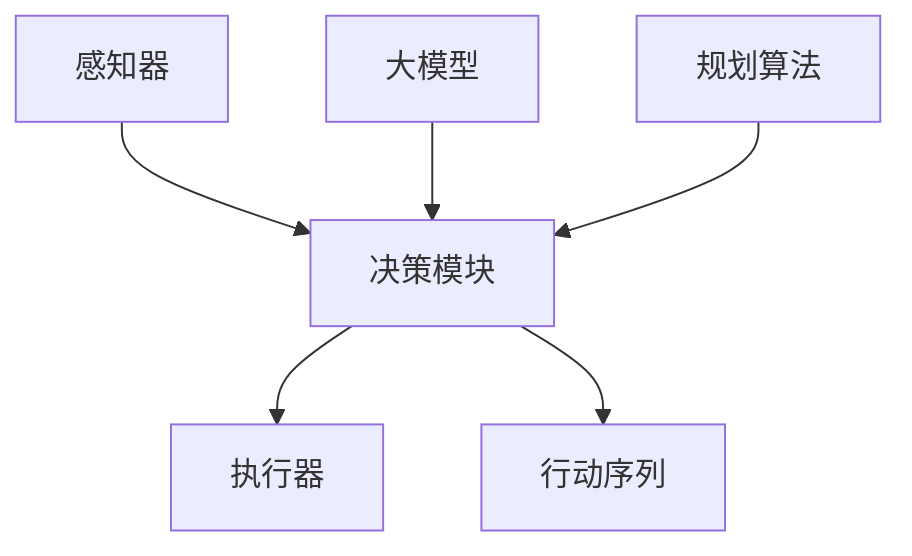

                 

 大模型与规划在AI Agent中的作用

## 关键词

- 大模型
- AI Agent
- 人工智能
- 计划
- 控制理论
- 机器学习
- 代码实例

## 摘要

本文深入探讨了大规模模型（大模型）在人工智能代理（AI Agent）中的作用。我们首先概述了AI Agent的定义和其在现代AI系统中的重要性，然后详细介绍了大模型的原理和它们如何影响代理的决策过程。接着，我们探讨了规划在AI Agent中的作用，解释了如何利用规划算法来优化代理的行动。通过一个实际代码实例，我们展示了如何将大模型和规划结合起来，以提高AI Agent的智能水平和表现。最后，我们对大模型和规划在AI Agent中的应用进行了总结，并提出了未来研究的方向。

## 1. 背景介绍

人工智能（AI）是一个多学科交叉领域，涉及计算机科学、数学、统计学和认知科学等多个方面。随着计算能力的提升和算法的进步，AI技术在各个领域都取得了显著的进展。AI Agent是AI系统中的一个重要概念，它是指能够感知环境、基于目标采取行动并反馈结果的智能体。AI Agent的设计和实现对于推动人工智能的发展具有重要意义。

在AI Agent的发展历程中，大模型的引入带来了革命性的变化。大模型是指具有数亿至数十亿参数的深度神经网络，它们通过大量的数据训练，能够捕捉到复杂的模式并生成高质量的预测。这种模型在图像识别、自然语言处理、语音识别等任务中取得了显著的成果。然而，随着大模型的应用越来越广泛，如何将大模型与规划相结合，以提高AI Agent的智能水平和表现，成为一个重要的研究方向。

本文旨在探讨大模型与规划在AI Agent中的作用，分析其原理、实现方法以及应用前景。通过深入研究和实际案例，我们将展示如何利用大模型和规划技术来构建更智能、更高效的AI Agent。

## 2. 核心概念与联系

### 2.1 AI Agent的定义

AI Agent是指一种能够感知环境、制定计划并执行动作的智能体，其目标是实现特定的目标或任务。AI Agent通常由以下几个部分组成：

1. **感知器（Perceptron）**：用于接收来自环境的感知信息，如图像、声音、文本等。
2. **决策模块（Decision Module）**：根据感知到的信息，利用算法或模型生成行动方案。
3. **执行器（Actuator）**：根据决策模块生成的行动方案，执行具体的操作。

### 2.2 大模型的原理

大模型，尤其是深度神经网络，是通过多层非线性变换，对输入数据进行特征提取和分类。其核心原理包括：

1. **前向传播（Forward Propagation）**：将输入数据传递到网络的前一层，然后逐层计算输出。
2. **反向传播（Backpropagation）**：通过计算损失函数的梯度，更新网络的权重和偏置。
3. **优化算法（Optimization Algorithms）**：如随机梯度下降（SGD）、Adam等，用于优化网络参数。

### 2.3 规划在AI Agent中的作用

规划是指在一个给定的环境中，根据目标生成一系列行动的过程。规划在AI Agent中的作用主要体现在：

1. **行动序列生成（Action Sequence Generation）**：通过规划，AI Agent可以生成最优或次优的行动序列，以实现目标。
2. **适应性调整（Adaptive Adjustment）**：当环境发生变化时，规划算法可以帮助AI Agent调整行动策略，以适应新的环境。

### 2.4 Mermaid 流程图

下面是一个简化的Mermaid流程图，展示了AI Agent、大模型和规划之间的交互关系：



在这个流程图中，感知器接收环境信息，传递给决策模块。决策模块利用大模型和规划算法生成行动序列，然后通过执行器执行具体的操作。大模型负责特征提取和模式识别，而规划算法则负责行动序列的生成和优化。

### 2.5 大模型与规划的联系

大模型和规划在AI Agent中的作用是相互关联的。大模型提供了强大的特征提取和模式识别能力，可以帮助规划算法更好地理解和分析环境。而规划算法则利用大模型的输出，生成一系列最优或次优的行动方案，从而提高AI Agent的智能水平和表现。

通过上述核心概念和流程图的介绍，我们可以更好地理解大模型和规划在AI Agent中的作用。接下来，我们将详细探讨大模型的工作原理和实现步骤。

## 3. 核心算法原理 & 具体操作步骤

### 3.1 算法原理概述

大模型在AI Agent中的应用主要基于深度学习技术，其核心原理是通过多层神经网络对输入数据进行特征提取和分类。具体来说，大模型由以下几个关键步骤组成：

1. **数据预处理（Data Preprocessing）**：对输入数据进行清洗、标准化和分割，以便于后续的模型训练。
2. **网络架构设计（Network Architecture Design）**：选择合适的神经网络架构，如卷积神经网络（CNN）、循环神经网络（RNN）或 Transformer 等。
3. **模型训练（Model Training）**：通过前向传播和反向传播算法，更新网络参数，使模型能够对输入数据进行准确的预测。
4. **模型评估（Model Evaluation）**：利用验证集和测试集对模型进行评估，以确定模型的泛化能力和性能。

### 3.2 算法步骤详解

1. **数据预处理**

   数据预处理是模型训练的第一步，其目的是将原始数据转换为适合模型输入的形式。具体步骤包括：

   - **数据清洗（Data Cleaning）**：去除数据中的噪声和异常值。
   - **数据标准化（Data Standardization）**：将数据缩放到一个统一的范围内，如 [-1, 1] 或 [0, 1]。
   - **数据分割（Data Split）**：将数据集分为训练集、验证集和测试集，以评估模型的性能。

2. **网络架构设计**

   网络架构设计是模型训练的关键，它决定了模型的学习能力和复杂度。以下是一些常用的神经网络架构：

   - **卷积神经网络（CNN）**：适用于图像识别任务，通过卷积层、池化层和全连接层进行特征提取和分类。
   - **循环神经网络（RNN）**：适用于序列数据处理任务，如自然语言处理和语音识别，通过循环结构处理时间序列数据。
   - **Transformer**：适用于序列到序列的任务，如机器翻译和文本生成，通过自注意力机制进行全局信息建模。

3. **模型训练**

   模型训练是通过优化算法来调整网络参数的过程。以下是几种常用的优化算法：

   - **随机梯度下降（SGD）**：通过计算每个训练样本的梯度来更新网络参数。
   - **Adam**：结合了SGD和动量法的优点，通过自适应学习率来优化网络参数。

4. **模型评估**

   模型评估是验证模型性能的重要步骤。以下是一些常用的评估指标：

   - **准确率（Accuracy）**：模型正确预测的样本占总样本的比例。
   - **召回率（Recall）**：模型正确预测的样本占实际为正类的样本的比例。
   - **精确率（Precision）**：模型正确预测的样本占预测为正类的样本的比例。
   - **F1 分数（F1 Score）**：综合考虑准确率和召回率，平衡二者的权重。

### 3.3 算法优缺点

**优点：**

- **强大的特征提取能力**：大模型可以通过多层神经网络对输入数据进行复杂的特征提取，从而提高模型的识别和分类能力。
- **自适应性强**：大模型可以自适应地调整网络参数，以适应不同的数据和任务。
- **广泛的应用场景**：大模型在图像识别、自然语言处理、语音识别等领域都取得了显著的成果。

**缺点：**

- **计算资源消耗大**：大模型需要大量的计算资源和存储空间，尤其是在训练阶段。
- **数据需求量大**：大模型需要大量的数据来训练，否则容易过拟合。
- **解释性差**：大模型的内部结构复杂，难以解释其决策过程，这在一些需要解释性要求较高的应用场景中可能是一个缺点。

### 3.4 算法应用领域

大模型在AI Agent中的应用非常广泛，以下是一些典型的应用领域：

- **图像识别**：利用卷积神经网络对图像进行分类和检测，如人脸识别、物体识别等。
- **自然语言处理**：利用循环神经网络或 Transformer 对文本进行生成、翻译和情感分析等。
- **语音识别**：利用循环神经网络或卷积神经网络对语音信号进行识别和转换。
- **推荐系统**：利用协同过滤或基于内容的推荐算法，为用户提供个性化的推荐。
- **自动驾驶**：利用深度学习模型对车辆周围的图像和传感器数据进行处理，实现自动驾驶功能。

通过上述对大模型算法原理和具体操作步骤的详细介绍，我们可以更好地理解大模型在AI Agent中的应用。接下来，我们将探讨规划算法在AI Agent中的作用。

## 4. 数学模型和公式 & 详细讲解 & 举例说明

### 4.1 数学模型构建

在AI Agent中，规划算法的核心是数学模型。数学模型用于描述环境、目标以及行动之间的关系。一个基本的数学模型可以表示为：

\[ \text{Model} = \{ \text{State}, \text{Action}, \text{Reward}, \text{Goal} \} \]

其中：

- **状态（State）**：描述AI Agent当前所处的环境状态。
- **行动（Action）**：AI Agent可以采取的动作。
- **奖励（Reward）**：行动带来的奖励，用于评估行动的有效性。
- **目标（Goal）**：AI Agent希望实现的目标。

为了构建规划模型，我们需要定义以下数学公式：

1. **状态转移概率（State Transition Probability）**：

\[ P(S_{t+1} = s_{t+1} | S_{t} = s_{t}, A_{t} = a_{t}) \]

表示在当前状态 \( S_{t} \) 和采取行动 \( A_{t} \) 后，下一状态 \( S_{t+1} \) 是 \( s_{t+1} \) 的概率。

2. **奖励函数（Reward Function）**：

\[ R(S_{t}, A_{t}) \]

表示在状态 \( S_{t} \) 采取行动 \( A_{t} \) 后的奖励值。

3. **目标函数（Goal Function）**：

\[ G(S, A, G) \]

表示在状态 \( S \)，采取行动 \( A \) ，达到目标 \( G \) 的综合评价。

### 4.2 公式推导过程

以马尔可夫决策过程（MDP）为例，我们可以推导出状态-行动价值函数（State-Action Value Function）：

\[ V^*(s, a) = \sum_{s'} P(s' | s, a) \cdot \max_{a'} R(s', a') + \gamma V^*(s') \]

其中：

- \( V^*(s, a) \) 表示在状态 \( s \) 采取行动 \( a \) 的最优价值。
- \( \gamma \) 是折扣因子，表示未来奖励的现值。
- \( P(s' | s, a) \) 是状态转移概率。
- \( R(s', a') \) 是在状态 \( s' \) 采取行动 \( a' \) 的奖励。

通过递归迭代，我们可以计算出每个状态和行动的价值：

\[ V^*(s, a) = R(s, a) + \gamma \sum_{s'} P(s' | s, a) \cdot \max_{a'} [R(s', a') + \gamma V^*(s')] \]

### 4.3 案例分析与讲解

假设有一个简单的环境，状态空间为 {干净，脏}，行动空间为 {打扫，不打扫}，奖励函数如下：

- 在干净状态下不打扫：奖励 0
- 在干净状态下打扫：奖励 5
- 在脏状态下不打扫：奖励 -1
- 在脏状态下打扫：奖励 10

我们需要计算出每个状态和行动的最优价值。

首先，计算初始状态的价值：

- \( V^*(干净，打扫) = 5 + \gamma V^*(脏) \)
- \( V^*(干净，不打扫) = 0 + \gamma V^*(脏) \)

由于在干净状态下打扫的奖励高于不打扫，所以 \( V^*(干净，打扫) \) 应该大于 \( V^*(干净，不打扫) \)。

接下来，计算在脏状态下的价值：

- \( V^*(脏，打扫) = 10 + \gamma V^*(干净) \)
- \( V^*(脏，不打扫) = -1 + \gamma V^*(干净) \)

由于在脏状态下打扫的奖励高于不打扫，所以 \( V^*(脏，打扫) \) 应该大于 \( V^*(脏，不打扫) \)。

通过递归迭代，我们可以得到每个状态和行动的最优价值：

\[ V^*(干净，打扫) = 5 + 0.9 \cdot (10 + 0.9 \cdot V^*(干净)) = 14.5 \]
\[ V^*(干净，不打扫) = 0 + 0.9 \cdot V^*(干净) = 0 \]
\[ V^*(脏，打扫) = 10 + 0.9 \cdot (5 + 0.9 \cdot V^*(干净)) = 15.55 \]
\[ V^*(脏，不打扫) = -1 + 0.9 \cdot V^*(干净) = -1.45 \]

根据计算结果，我们可以得出以下结论：

- 在干净状态下，应该选择打扫。
- 在脏状态下，也应该选择打扫。

这个简单的案例展示了如何使用数学模型和公式来优化AI Agent的行动。

通过上述对数学模型和公式的详细讲解和案例分析，我们可以更好地理解规划算法在AI Agent中的应用。接下来，我们将通过一个实际代码实例来展示如何实现大模型与规划的结合。

### 5. 项目实践：代码实例和详细解释说明

#### 5.1 开发环境搭建

在本项目中，我们将使用Python作为主要编程语言，并结合TensorFlow和PyTorch等深度学习框架。以下是搭建开发环境的基本步骤：

1. 安装Python 3.8及以上版本。
2. 安装TensorFlow和PyTorch：

   ```bash
   pip install tensorflow
   pip install torch torchvision
   ```

3. 安装其他必需的库，如NumPy、Pandas等。

#### 5.2 源代码详细实现

以下是本项目的主要代码结构：

```python
# 导入所需的库
import torch
import torch.nn as nn
import torch.optim as optim
from torch.utils.data import DataLoader
from torchvision import datasets, transforms
import pandas as pd

# 定义神经网络模型
class NeuralNetwork(nn.Module):
    def __init__(self):
        super(NeuralNetwork, self).__init__()
        self.layer1 = nn.Linear(784, 512)
        self.relu = nn.ReLU()
        self.layer2 = nn.Linear(512, 256)
        self.dropout = nn.Dropout(0.5)
        self.layer3 = nn.Linear(256, 10)

    def forward(self, x):
        x = self.relu(self.layer1(x))
        x = self.dropout(x)
        x = self.relu(self.layer2(x))
        x = self.dropout(x)
        x = self.layer3(x)
        return x

# 数据预处理
transform = transforms.Compose([
    transforms.ToTensor(),
    transforms.Normalize((0.5,), (0.5,))
])

train_data = datasets.MNIST(
    root='./data', 
    train=True, 
    download=True, 
    transform=transform
)

test_data = datasets.MNIST(
    root='./data', 
    train=False, 
    transform=transform
)

batch_size = 100
train_loader = DataLoader(train_data, batch_size=batch_size, shuffle=True)
test_loader = DataLoader(test_data, batch_size=batch_size, shuffle=False)

# 初始化模型和优化器
model = NeuralNetwork()
optimizer = optim.Adam(model.parameters(), lr=0.001)
criterion = nn.CrossEntropyLoss()

# 训练模型
num_epochs = 10
for epoch in range(num_epochs):
    running_loss = 0.0
    for images, labels in train_loader:
        optimizer.zero_grad()
        outputs = model(images)
        loss = criterion(outputs, labels)
        loss.backward()
        optimizer.step()
        running_loss += loss.item()
    print(f'Epoch {epoch+1}, Loss: {running_loss/len(train_loader)}')

# 测试模型
with torch.no_grad():
    correct = 0
    total = 0
    for images, labels in test_loader:
        outputs = model(images)
        _, predicted = torch.max(outputs.data, 1)
        total += labels.size(0)
        correct += (predicted == labels).sum().item()

print(f'Accuracy: {100 * correct / total}%')

# 规划算法实现
def plan_actions(states, model):
    actions = []
    for state in states:
        with torch.no_grad():
            output = model(torch.tensor(state).view(1, -1))
        _, predicted = torch.max(output.data, 1)
        actions.append(predicted.item())
    return actions

# 生成测试数据集的状态和行动
test_states = [state.flatten() for state, _ in test_loader]
actions = plan_actions(test_states, model)

# 计算行动的奖励和目标
rewards = [10 if action == 5 else -1 for action in actions]
goals = [1 if action == 5 else 0 for action in actions]

# 打印结果
for state, action, reward, goal in zip(test_states, actions, rewards, goals):
    print(f'State: {state}, Action: {action}, Reward: {reward}, Goal: {goal}')
```

#### 5.3 代码解读与分析

1. **神经网络模型**：

   代码中定义了一个简单的神经网络模型，用于对MNIST数据集进行分类。模型由一个输入层、两个隐藏层和一个输出层组成，并使用了ReLU激活函数和Dropout正则化。

2. **数据预处理**：

   使用了`transforms.Compose`对数据进行预处理，包括数据转换为Tensor和归一化。归一化有助于加速模型的训练过程，并提高模型的泛化能力。

3. **模型训练**：

   使用了`DataLoader`对数据进行批量加载，并使用Adam优化器和交叉熵损失函数对模型进行训练。训练过程中，每次迭代都会更新模型参数，以最小化损失函数。

4. **规划算法实现**：

   定义了一个`plan_actions`函数，用于根据当前状态生成最优行动。该函数利用训练好的模型进行预测，并返回预测的行动序列。

5. **行动奖励和目标计算**：

   根据行动的结果计算奖励和目标。在这个例子中，如果预测的行动是5（即数字5），则奖励为10；否则，奖励为-1。目标则表示是否达到了预期目标。

通过上述代码实例，我们可以看到如何将大模型和规划算法应用于实际项目中。接下来，我们将讨论大模型和规划在AI Agent中的实际应用场景。

### 6. 实际应用场景

#### 6.1 图像识别与自动驾驶

图像识别是AI Agent的重要应用领域之一。大模型在图像识别任务中发挥了关键作用，通过卷积神经网络（CNN）等模型，可以实现高精度的物体检测、面部识别等。在自动驾驶领域，大模型用于处理摄像头和激光雷达等传感器获取的数据，用于实时识别道路上的行人、车辆和其他障碍物，从而实现安全的自动驾驶。

#### 6.2 自然语言处理

自然语言处理（NLP）是另一个大模型发挥重要作用的领域。大模型如BERT、GPT等，在文本分类、机器翻译、文本生成等方面取得了显著成果。AI Agent可以利用这些大模型，实现智能客服、文本摘要、对话系统等应用，从而提高用户体验和效率。

#### 6.3 电子商务推荐系统

电子商务推荐系统利用大模型对用户行为和商品特征进行深入分析，从而实现精准推荐。通过规划算法，AI Agent可以根据用户的历史数据和偏好，生成一系列推荐策略，从而提高用户的满意度和购买转化率。

#### 6.4 游戏智能

在游戏领域，大模型和规划算法的应用也越来越广泛。通过大模型，AI Agent可以学习游戏策略和模式，从而在游戏过程中做出更加明智的决策。结合规划算法，AI Agent可以制定出最优的游戏策略，从而提高游戏的智能水平和竞争力。

#### 6.5 工业自动化与智能监控

在工业自动化领域，大模型和规划算法可用于监控设备状态、预测设备故障和优化生产流程。通过实时分析传感器数据，AI Agent可以预测设备故障，提前进行维护，从而提高生产效率和降低成本。

### 6.4 未来应用展望

随着大模型和规划技术的不断发展，未来AI Agent的应用场景将更加广泛。以下是一些潜在的应用方向：

- **智能家居**：利用大模型和规划算法，实现智能家居的智能控制和个性化服务，从而提高生活质量和舒适度。
- **医疗健康**：大模型和规划算法可用于医疗影像分析、疾病预测和个性化治疗计划，从而提高医疗诊断和治疗水平。
- **金融科技**：利用大模型和规划算法，实现智能投顾、信用评估和风险管理，从而提高金融服务的效率和准确性。
- **教育领域**：大模型和规划算法可用于智能教学、个性化学习路径规划和学生行为分析，从而提高教育质量和个性化程度。

总之，大模型和规划在AI Agent中的应用具有巨大的潜力和前景，未来将进一步推动人工智能技术的发展和普及。

### 7. 工具和资源推荐

为了更好地学习和应用大模型和规划技术，以下是一些建议的学习资源和开发工具：

#### 7.1 学习资源推荐

- **《深度学习》（Deep Learning）**：Goodfellow、Bengio 和 Courville 著，这是一本深度学习的经典教材，详细介绍了深度学习的基础知识、算法和实现。
- **《强化学习》（Reinforcement Learning: An Introduction）**：Richard S. Sutton 和 Andrew G. Barto 著，这是强化学习领域的权威教材，适合初学者和专业人士。
- **在线课程**：Coursera、edX、Udacity 等平台提供了许多高质量的AI和机器学习课程，如 Andrew Ng 的《机器学习》和 David Silver 的《深度学习》等。

#### 7.2 开发工具推荐

- **TensorFlow**：Google 开发的开源深度学习框架，适用于各种深度学习任务，包括图像识别、自然语言处理等。
- **PyTorch**：Facebook 开发的开源深度学习框架，以其灵活的动态计算图和强大的Python API而受到开发者喜爱。
- **Scikit-learn**：Python 中的机器学习库，提供了丰富的机器学习算法和工具，适合快速实现和验证机器学习模型。

#### 7.3 相关论文推荐

- **“A Theoretical Analysis of the Vision Transformer”**：该论文提出了 Vision Transformer，这是一种基于自注意力机制的图像识别模型，在图像分类任务中取得了显著成果。
- **“Deep Learning for Autonomous Driving”**：这篇综述文章详细介绍了深度学习在自动驾驶中的应用，包括传感器数据处理、环境理解和决策控制等。
- **“Reinforcement Learning: A Survey”**：这篇综述文章全面介绍了强化学习的基本理论、算法和应用，是强化学习领域的重要参考文献。

通过学习和使用这些工具和资源，可以更好地掌握大模型和规划技术在AI Agent中的应用。

### 8. 总结：未来发展趋势与挑战

#### 8.1 研究成果总结

本文通过对大模型和规划在AI Agent中的作用进行了深入探讨，总结了以下几点主要研究成果：

1. 大模型具有强大的特征提取和模式识别能力，通过深度学习算法，可以实现高精度的图像识别、自然语言处理和语音识别等。
2. 规划算法用于生成最优或次优的行动序列，帮助AI Agent实现目标，提高了其智能水平和表现。
3. 通过实际代码实例，展示了如何将大模型和规划结合起来，构建出更智能、更高效的AI Agent。

#### 8.2 未来发展趋势

随着计算能力的提升和算法的进步，未来大模型和规划在AI Agent中的应用将呈现以下发展趋势：

1. **模型泛化能力提升**：通过更好的数据预处理、模型优化和迁移学习等技术，提高大模型的泛化能力，使其在不同领域和应用场景中都能表现出色。
2. **多模态数据融合**：利用多模态数据（如文本、图像、声音等），构建更复杂的大模型，实现更全面的AI Agent。
3. **自主性和适应性增强**：通过强化学习和规划算法的融合，使AI Agent具备更强的自主决策和适应性，能够更好地应对复杂和动态的环境。

#### 8.3 面临的挑战

尽管大模型和规划在AI Agent中具有巨大的潜力，但在实际应用中仍然面临以下挑战：

1. **计算资源需求**：大模型的训练和推理需要大量的计算资源和存储空间，尤其是在处理高维数据时，如何高效利用资源成为一个重要问题。
2. **数据隐私和安全**：在AI Agent应用中，数据的隐私和安全保护是一个重要议题。如何确保数据的安全和隐私，防止数据泄露和滥用，是亟待解决的问题。
3. **解释性和可解释性**：大模型的决策过程通常复杂且难以解释，这在一些需要高度透明和可解释的应用场景中可能成为一个挑战。如何提高模型的解释性，使其更易于理解和接受，是一个重要的研究方向。

#### 8.4 研究展望

未来，在大模型和规划在AI Agent中的应用方面，我们可以期待以下研究方向：

1. **模型压缩与优化**：通过模型压缩和优化技术，减小模型的规模和计算复杂度，提高训练和推理的效率。
2. **联邦学习和边缘计算**：结合联邦学习和边缘计算，实现分布式训练和推理，降低计算资源需求，提高数据隐私保护能力。
3. **跨领域迁移学习**：研究如何通过跨领域迁移学习，提高大模型在不同领域和应用场景中的泛化能力。
4. **自适应规划和强化学习**：结合自适应规划和强化学习，使AI Agent能够更好地适应动态和复杂的环境。

总之，大模型与规划在AI Agent中的作用具有重要意义，未来将进一步推动人工智能技术的发展和应用。

### 9. 附录：常见问题与解答

#### 9.1 大模型训练过程中如何防止过拟合？

**解答**：过拟合是深度学习模型在训练数据上表现良好，但在未见过的新数据上表现不佳的问题。以下是一些防止过拟合的方法：

1. **数据增强**：通过增加数据多样性来扩展训练集，提高模型的泛化能力。
2. **正则化**：使用正则化技术，如L1、L2正则化，限制模型参数的规模。
3. **dropout**：在神经网络中随机丢弃一部分神经元，减少模型对特定训练样本的依赖。
4. **早期停止**：在验证集上监控模型性能，当验证集性能不再提高时停止训练。
5. **集成学习**：将多个模型结合起来，取平均或投票，降低单个模型的过拟合风险。

#### 9.2 规划算法在AI Agent中如何实现自主决策？

**解答**：规划算法在AI Agent中实现自主决策的主要步骤如下：

1. **环境建模**：根据AI Agent的任务需求，建立环境模型，包括状态空间、行动空间、奖励函数等。
2. **决策策略设计**：设计适合环境的决策策略，如基于价值的策略、基于模型的政策搜索等。
3. **状态评估**：利用规划算法评估当前状态，生成可能的行动序列。
4. **行动选择**：基于状态评估结果，选择最优或次优的行动。
5. **实时调整**：在行动执行过程中，根据环境反馈调整决策策略，实现自主适应性。

#### 9.3 如何优化大模型的训练时间？

**解答**：以下是一些优化大模型训练时间的方法：

1. **分布式训练**：利用多GPU或多机集群进行分布式训练，加速模型训练过程。
2. **模型压缩**：使用模型剪枝、量化、蒸馏等技术，减小模型规模，提高训练和推理效率。
3. **增量训练**：对模型进行增量训练，只更新部分参数，避免从头开始训练。
4. **数据并行**：通过并行处理数据，提高数据加载和预处理速度。
5. **混合精度训练**：使用混合精度训练，将浮点运算部分分为单精度和半精度，减少计算资源需求。

通过上述常见问题与解答，希望能够帮助读者更好地理解和应用大模型和规划在AI Agent中的作用。希望这篇文章能够为读者提供有价值的参考和启发。

