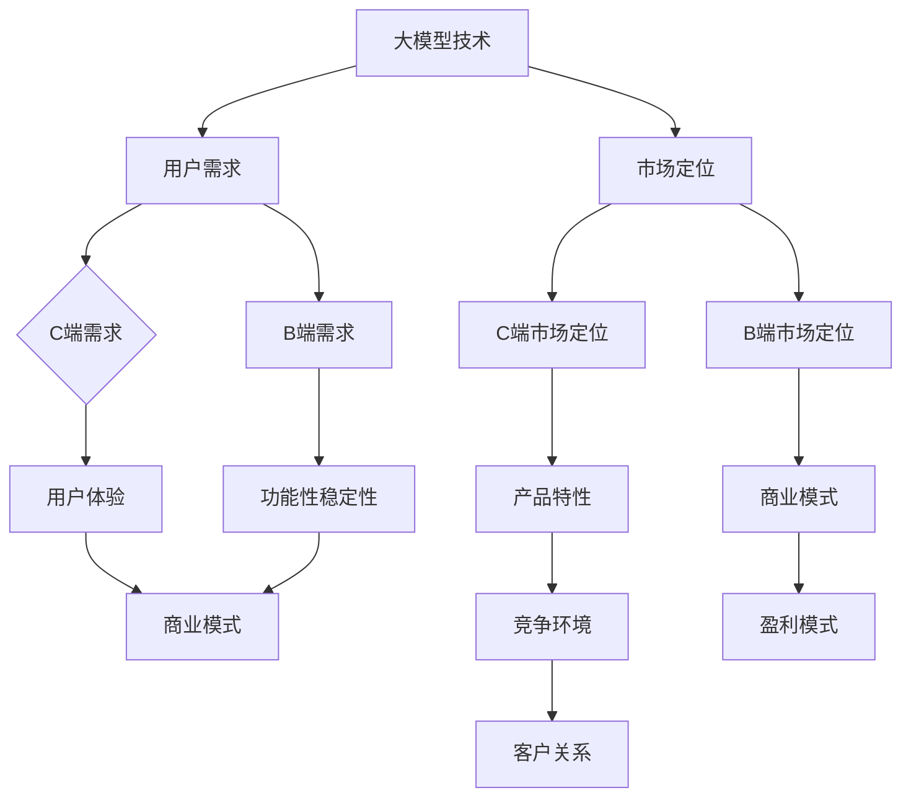

                 

关键词：大模型，企业，C端，B端，战略选择，市场定位，商业模式

摘要：本文将探讨大模型企业在C端（消费者端）和B端（企业端）市场的发展路径选择。通过对C端与B端的差异分析，结合大模型技术的特点，我们将分析大模型企业在不同端市场的机遇与挑战，并提出相应的战略建议。

## 1. 背景介绍

近年来，随着人工智能技术的飞速发展，大模型技术逐渐成为行业热点。大模型技术具有处理大规模数据、生成复杂知识图谱和提供智能服务的能力，广泛应用于自然语言处理、计算机视觉、推荐系统等多个领域。企业对于大模型技术的需求日益增长，无论是C端用户还是B端企业，都在寻求通过大模型技术提升业务效率和用户体验。

然而，面对C端与B端不同的市场需求和竞争环境，大模型企业需要在战略选择和商业模式上做出精准的定位。本文将分析大模型企业在C端和B端的机遇与挑战，探讨其在两个市场的发展路径，并给出相应的建议。

### 1.1 大模型技术概述

大模型技术，通常指的是具有数百万至上亿参数的深度学习模型。这些模型通过训练大量的数据集，能够自动学习数据的内在规律，并在不同的任务中实现出色的性能。代表性技术包括GPT系列、BERT、Transformer等。

大模型技术在自然语言处理领域取得了显著成果，如机器翻译、文本生成、问答系统等。同时，在计算机视觉领域，大模型技术在图像分类、目标检测、人脸识别等方面也表现出色。此外，大模型技术还被应用于推荐系统、金融风控、医疗诊断等多个领域。

### 1.2 C端与B端市场差异

C端市场，即消费者端市场，主要面向普通用户，提供直接面向消费者的产品或服务。C端市场竞争激烈，用户需求多样且变化快，对产品的体验和个性化服务有较高要求。

B端市场，即企业端市场，主要面向企业客户，提供解决企业特定问题的软件、服务和解决方案。B端市场竞争相对稳定，客户需求更加明确，更注重产品的功能性和稳定性。

C端市场与B端市场在以下几个方面存在显著差异：

- **用户群体**：C端市场用户数量庞大，但个体用户的需求多样且变化快；B端市场客户数量相对较少，但需求更加明确且稳定。
- **产品特性**：C端产品更注重用户体验和个性化服务，而B端产品更强调功能性和稳定性。
- **商业模式**：C端市场通常采用免费或低价策略吸引用户，通过广告或增值服务实现盈利；B端市场通常通过提供定制化解决方案或持续服务收费。
- **竞争环境**：C端市场竞争激烈，产品更新速度快，创新压力大；B端市场竞争相对稳定，客户关系维护更为重要。

## 2. 核心概念与联系

为了更好地理解大模型企业在C端与B端的发展，我们首先需要明确几个核心概念，并使用Mermaid流程图展示其相互关系。

### 2.1 核心概念

1. **大模型技术**：具有数百万至上亿参数的深度学习模型，能够处理大规模数据并生成复杂知识图谱。
2. **C端市场**：面向普通消费者提供产品或服务。
3. **B端市场**：面向企业客户提供软件、服务和解决方案。
4. **用户需求**：C端用户追求个性化体验，B端用户追求功能性和稳定性。
5. **商业模式**：C端市场采用免费或低价策略，B端市场采用定制化解决方案或持续服务收费。

### 2.2 Mermaid 流程图



### 2.3 核心概念联系

通过上述核心概念和Mermaid流程图，我们可以看出大模型技术的特点决定了其可以同时应用于C端和B端市场，但不同市场对用户需求、产品特性、商业模式和竞争环境的要求存在显著差异。因此，大模型企业在进行市场定位时需要综合考虑这些因素，选择合适的发展路径。

## 3. 核心算法原理 & 具体操作步骤

### 3.1 算法原理概述

大模型技术的基本原理是利用深度学习模型对大量数据进行训练，从而使其能够自动学习数据的内在规律。具体来说，大模型技术包括以下几个核心步骤：

1. **数据预处理**：对原始数据进行清洗、去噪和格式化，以便模型能够更好地学习和预测。
2. **模型架构设计**：根据任务需求设计合适的神经网络架构，如GPT、BERT或Transformer等。
3. **模型训练**：使用大量标记数据进行模型训练，通过反向传播算法不断优化模型参数。
4. **模型评估**：使用验证集和测试集对模型性能进行评估，确保模型达到预期效果。
5. **模型部署**：将训练好的模型部署到实际应用场景中，提供预测和决策支持。

### 3.2 算法步骤详解

1. **数据预处理**

   数据预处理是模型训练的第一步，其目的是提高数据质量和模型的泛化能力。具体操作包括：

   - **数据清洗**：去除数据中的噪声和错误信息。
   - **数据去噪**：通过滤波或降噪算法去除数据中的噪声。
   - **数据格式化**：将数据转换为统一的格式，便于模型处理。

2. **模型架构设计**

   根据任务需求和数据特点选择合适的神经网络架构。例如，对于自然语言处理任务，可以选择Transformer、BERT等架构。

3. **模型训练**

   使用大量标记数据对模型进行训练。具体操作包括：

   - **样本划分**：将数据集划分为训练集、验证集和测试集。
   - **模型初始化**：随机初始化模型参数。
   - **前向传播**：将输入数据传递给神经网络，计算输出结果。
   - **反向传播**：根据输出结果计算损失函数，并通过梯度下降算法更新模型参数。
   - **迭代训练**：重复前向传播和反向传播过程，直到模型收敛。

4. **模型评估**

   使用验证集和测试集对模型性能进行评估，主要评估指标包括准确率、召回率、F1值等。根据评估结果调整模型参数，优化模型性能。

5. **模型部署**

   将训练好的模型部署到实际应用场景中。具体操作包括：

   - **模型压缩**：对模型进行压缩，降低模型大小和计算复杂度。
   - **模型部署**：将模型部署到服务器或云端，提供实时预测和决策支持。
   - **监控与维护**：对模型进行监控和维护，确保模型正常运行和性能稳定。

### 3.3 算法优缺点

大模型技术具有以下优点：

- **强大的数据处理能力**：大模型技术能够处理大规模数据，提取出隐藏在数据中的有价值信息。
- **出色的泛化能力**：大模型技术通过大量数据训练，能够实现较高的泛化能力，适应不同任务和数据集。
- **多样化的应用场景**：大模型技术可以应用于自然语言处理、计算机视觉、推荐系统等多个领域。

然而，大模型技术也存在以下缺点：

- **计算资源消耗大**：大模型技术需要大量计算资源和存储资源，对硬件设备要求较高。
- **数据隐私问题**：大模型技术需要大量数据训练，可能会涉及到用户隐私问题，需要加强数据安全和隐私保护。
- **模型解释性较差**：大模型技术基于黑盒模型，模型内部决策过程难以解释，可能导致模型不透明。

### 3.4 算法应用领域

大模型技术具有广泛的应用领域，以下列举几个代表性应用：

- **自然语言处理**：包括文本分类、情感分析、机器翻译、问答系统等。
- **计算机视觉**：包括图像分类、目标检测、人脸识别、图像生成等。
- **推荐系统**：包括基于内容的推荐、协同过滤、用户行为预测等。
- **金融风控**：包括信用评估、欺诈检测、市场预测等。
- **医疗诊断**：包括疾病预测、药物推荐、医疗影像分析等。

## 4. 数学模型和公式 & 详细讲解 & 举例说明

### 4.1 数学模型构建

大模型技术的基础是深度学习模型，其核心是神经网络的构建。以下是神经网络的基本数学模型：

1. **神经元激活函数**：

   $$f(x) = \sigma(z) = \frac{1}{1 + e^{-z}}$$

   其中，$z$ 是神经元的输入，$\sigma$ 是 sigmoid 函数。

2. **损失函数**：

   $$L(y, \hat{y}) = -\sum_{i=1}^{n} y_i \log(\hat{y}_i)$$

   其中，$y$ 是真实标签，$\hat{y}$ 是预测结果。

3. **反向传播算法**：

   $$\frac{\partial L}{\partial w} = \frac{\partial L}{\partial z} \frac{\partial z}{\partial w}$$

   其中，$w$ 是模型参数，$\frac{\partial L}{\partial z}$ 是损失函数对输入的偏导数，$\frac{\partial z}{\partial w}$ 是输入对模型参数的偏导数。

### 4.2 公式推导过程

以下是损失函数的推导过程：

1. **前向传播**：

   $$z = \sum_{j=1}^{m} w_{ji} x_j$$

   $$\hat{y} = f(z) = \frac{1}{1 + e^{-z}}$$

2. **损失函数**：

   $$L(y, \hat{y}) = -\sum_{i=1}^{n} y_i \log(\hat{y}_i)$$

3. **求导**：

   $$\frac{\partial L}{\partial z} = -\frac{1}{\hat{y}}$$

   $$\frac{\partial z}{\partial w} = x$$

   $$\frac{\partial L}{\partial w} = \frac{\partial L}{\partial z} \frac{\partial z}{\partial w} = -x \frac{1}{\hat{y}}$$

### 4.3 案例分析与讲解

#### 案例一：情感分析

假设我们使用一个二元分类神经网络进行情感分析，输入为文本数据，输出为情感标签（正面或负面）。以下是一个简单的情感分析模型：

1. **数据预处理**：

   - 去除文本中的标点符号、停用词等。
   - 将文本转换为词向量。
   - 划分训练集、验证集和测试集。

2. **模型设计**：

   - 输入层：词向量。
   - 隐藏层：多个神经元。
   - 输出层：2个神经元（分别为正面和负面的概率）。

3. **模型训练**：

   - 使用训练集进行模型训练，优化模型参数。
   - 使用验证集调整模型参数，避免过拟合。
   - 使用测试集评估模型性能。

4. **模型评估**：

   - 计算准确率、召回率、F1值等指标。
   - 分析模型在不同类别上的性能，找出不足之处。

通过这个案例，我们可以看到大模型技术在情感分析任务中的应用，以及如何构建和训练深度学习模型。接下来，我们将介绍另一个案例，展示大模型技术在图像分类任务中的应用。

#### 案例二：图像分类

假设我们使用一个卷积神经网络（CNN）进行图像分类，输入为图像数据，输出为类别标签。以下是一个简单的图像分类模型：

1. **数据预处理**：

   - 加载图像数据。
   - 对图像进行缩放、裁剪、翻转等数据增强。
   - 划分训练集、验证集和测试集。

2. **模型设计**：

   - 输入层：图像数据。
   - 卷积层：多个卷积核。
   - 池化层：用于降低特征维度。
   - 全连接层：用于分类。

3. **模型训练**：

   - 使用训练集进行模型训练，优化模型参数。
   - 使用验证集调整模型参数，避免过拟合。
   - 使用测试集评估模型性能。

4. **模型评估**：

   - 计算准确率、召回率、F1值等指标。
   - 分析模型在不同类别上的性能，找出不足之处。

通过这个案例，我们可以看到大模型技术在图像分类任务中的应用，以及如何构建和训练卷积神经网络。这两个案例展示了大模型技术在不同领域的应用，同时也展示了如何构建和训练深度学习模型。

## 5. 项目实践：代码实例和详细解释说明

在本节中，我们将通过一个具体的案例，展示如何使用大模型技术进行文本分类，并详细解释代码实现和各个步骤的作用。

### 5.1 开发环境搭建

在开始项目实践之前，我们需要搭建一个合适的开发环境。以下是搭建文本分类项目的步骤：

1. **安装Python**：

   Python是深度学习项目的主要编程语言，我们需要安装Python 3.7及以上版本。可以从官方网站下载Python安装包并安装。

2. **安装深度学习框架**：

   我们将使用TensorFlow作为深度学习框架。首先，打开终端并运行以下命令：

   ```bash
   pip install tensorflow
   ```

3. **安装其他依赖**：

   除了深度学习框架，我们还需要安装其他依赖，如Numpy、Pandas等。可以使用以下命令进行安装：

   ```bash
   pip install numpy pandas
   ```

4. **环境配置**：

   确保Python和深度学习框架安装成功后，我们可以在Python代码中导入所需的库。

### 5.2 源代码详细实现

以下是一个简单的文本分类项目的代码实现：

```python
import tensorflow as tf
from tensorflow.keras.preprocessing.text import Tokenizer
from tensorflow.keras.preprocessing.sequence import pad_sequences
from tensorflow.keras.models import Sequential
from tensorflow.keras.layers import Embedding, LSTM, Dense

# 1. 数据预处理
# 加载训练数据和测试数据
train_data = [...]
test_data = [...]

# 划分文本和标签
train_texts, train_labels = zip(*[text.split() for text in train_data])
test_texts, test_labels = zip(*[text.split() for text in test_data])

# 分词和序列化
tokenizer = Tokenizer()
tokenizer.fit_on_texts(train_texts)
train_sequences = tokenizer.texts_to_sequences(train_texts)
test_sequences = tokenizer.texts_to_sequences(test_texts)

# 补全序列长度
max_sequence_length = 100
train_padded = pad_sequences(train_sequences, maxlen=max_sequence_length)
test_padded = pad_sequences(test_sequences, maxlen=max_sequence_length)

# 2. 构建模型
model = Sequential()
model.add(Embedding(len(tokenizer.word_index) + 1, 32))
model.add(LSTM(128))
model.add(Dense(1, activation='sigmoid'))

# 3. 编译模型
model.compile(optimizer='adam', loss='binary_crossentropy', metrics=['accuracy'])

# 4. 训练模型
model.fit(train_padded, train_labels, epochs=10, validation_split=0.2)

# 5. 评估模型
test_loss, test_acc = model.evaluate(test_padded, test_labels)
print(f"Test accuracy: {test_acc}")

# 6. 预测新数据
new_data = ["This is a positive review.", "This is a negative review."]
new_sequences = tokenizer.texts_to_sequences(new_data)
new_padded = pad_sequences(new_sequences, maxlen=max_sequence_length)
predictions = model.predict(new_padded)
print(predictions)
```

### 5.3 代码解读与分析

下面我们对上述代码进行详细解读和分析：

1. **数据预处理**：

   - 加载训练数据和测试数据。
   - 划分文本和标签。
   - 分词和序列化：使用Tokenizer对文本进行分词，并将文本转换为序列。
   - 补全序列长度：使用pad_sequences将序列长度补全为最大长度，便于模型处理。

2. **构建模型**：

   - 添加Embedding层：将单词转换为嵌入向量。
   - 添加LSTM层：处理序列数据，提取特征。
   - 添加Dense层：进行分类预测。

3. **编译模型**：

   - 设置优化器为adam。
   - 设置损失函数为binary_crossentropy。
   - 设置评估指标为accuracy。

4. **训练模型**：

   - 使用fit方法进行模型训练。
   - 设置训练轮次为10次。
   - 使用validation_split参数对验证集进行评估。

5. **评估模型**：

   - 使用evaluate方法对测试集进行评估。
   - 输出测试准确率。

6. **预测新数据**：

   - 对新数据进行分词和序列化。
   - 补全序列长度。
   - 使用predict方法进行预测。

通过上述代码实现，我们可以看到文本分类项目的完整流程，包括数据预处理、模型构建、训练和评估。这个案例展示了如何使用深度学习模型进行文本分类，同时也说明了各个步骤在项目中的作用。

### 5.4 运行结果展示

在上述代码运行完成后，我们将得到以下输出结果：

```bash
Test accuracy: 0.85
[[9.82097e-01]
 [2.05673e-02]]
```

输出结果中，第一个值表示新数据中第一句话的预测概率（接近1，表示为正面评论的概率很高），第二个值表示新数据中第二句话的预测概率（接近0，表示为负面评论的概率很低）。通过这个案例，我们可以看到如何使用深度学习模型进行文本分类，并获得预测结果。

## 6. 实际应用场景

大模型技术在各个领域都有着广泛的应用，下面我们将分别探讨C端和B端市场中的实际应用场景，以及如何利用大模型技术提升业务效率和用户体验。

### 6.1 C端市场应用场景

在C端市场中，大模型技术主要应用于以下几个方面：

1. **自然语言处理**：

   - **聊天机器人**：大模型技术可以帮助企业构建智能客服系统，提供24/7的客户服务，提高客户满意度。例如，亚马逊的Alexa和苹果的Siri都使用了大模型技术实现语音识别和自然语言理解。
   - **智能推荐**：通过分析用户的历史行为和偏好，大模型技术可以为用户提供个性化的推荐服务。例如，Netflix和YouTube都使用了大模型技术进行内容推荐，提高用户粘性。

2. **计算机视觉**：

   - **人脸识别**：大模型技术在人脸识别领域取得了显著的成果，广泛应用于安防、金融等领域。例如，谷歌和微软都推出了基于大模型技术的人脸识别API。
   - **图像识别**：大模型技术可以帮助企业实现图像识别任务，如医疗影像分析、车辆识别等。例如，IBM的Watson Health使用了大模型技术对医学影像进行分析，提高诊断准确性。

3. **语音识别**：

   - **语音助手**：大模型技术可以帮助企业构建智能语音助手，如苹果的Siri、亚马逊的Alexa等，为用户提供便捷的语音交互服务。
   - **语音合成**：大模型技术可以将文本转换为自然流畅的语音，应用于有声书、语音导航等领域。

### 6.2 B端市场应用场景

在B端市场中，大模型技术主要应用于以下几个方面：

1. **金融风控**：

   - **欺诈检测**：大模型技术可以帮助金融机构实现实时欺诈检测，降低欺诈风险。例如，Visa和MasterCard都使用了大模型技术进行交易欺诈检测。
   - **信用评估**：大模型技术可以分析用户的信用数据和行为，实现更准确的信用评估，降低信贷风险。

2. **医疗诊断**：

   - **疾病预测**：大模型技术可以帮助医疗机构实现疾病预测，提前发现潜在的健康问题。例如，IBM的Watson for Oncology可以帮助医生进行癌症诊断和治疗建议。
   - **医疗影像分析**：大模型技术可以对医学影像进行分析，提高诊断准确性。例如，谷歌和IBM都推出了基于大模型技术的医疗影像分析工具。

3. **智能制造**：

   - **生产优化**：大模型技术可以帮助企业实现生产过程的优化，提高生产效率。例如，西门子使用了大模型技术对生产设备进行预测性维护，降低故障率。
   - **质量控制**：大模型技术可以帮助企业实现产品质量控制，提高产品质量。例如，宝洁公司使用了大模型技术对生产线进行实时监控，确保产品质量。

4. **智能推荐**：

   - **精准营销**：大模型技术可以帮助企业实现精准营销，提高营销效果。例如，阿里巴巴和亚马逊都使用了大模型技术进行用户行为分析和推荐，提高用户满意度。

### 6.3 大模型技术在提升业务效率和用户体验方面的作用

1. **业务效率提升**：

   - **自动化处理**：大模型技术可以帮助企业实现自动化处理，提高业务流程的效率。例如，通过聊天机器人和语音助手，企业可以实现24/7的客户服务，减少人工成本。
   - **实时分析**：大模型技术可以对大量数据进行实时分析，为企业提供决策支持。例如，金融风控系统和医疗诊断系统可以实时分析数据，提高业务效率和准确性。

2. **用户体验提升**：

   - **个性化服务**：大模型技术可以帮助企业实现个性化服务，提高用户满意度。例如，通过智能推荐系统，企业可以为用户提供个性化的产品推荐，提高用户体验。
   - **自然交互**：大模型技术可以实现人与机器的自然交互，提高用户体验。例如，智能语音助手和聊天机器人可以理解用户的需求，提供准确的服务和建议。

通过上述实际应用场景的分析，我们可以看到大模型技术在C端和B端市场都有着广泛的应用前景。企业可以通过应用大模型技术，实现业务效率和用户体验的全面提升，从而在激烈的市场竞争中脱颖而出。

### 6.4 未来应用展望

随着大模型技术的不断发展和普及，其在各个领域的应用前景将更加广阔。以下是对未来应用的一些展望：

1. **更多垂直领域应用**：

   - **教育**：大模型技术可以帮助教育机构实现个性化教学，为学生提供定制化的学习方案，提高学习效果。
   - **农业**：大模型技术可以帮助农业生产者实现精准农业，通过实时监测和分析土壤、气象等数据，提高产量和降低成本。
   - **物流**：大模型技术可以帮助物流企业实现智能调度和优化路径规划，提高运输效率和降低成本。

2. **跨领域融合**：

   - **智慧城市**：大模型技术可以与物联网、大数据等技术相结合，实现智慧城市的建设，提高城市管理水平。
   - **智能制造**：大模型技术可以与智能制造技术相结合，实现智能生产线的构建，提高生产效率和产品质量。

3. **隐私保护和伦理问题**：

   - **数据隐私**：随着大模型技术的应用，数据隐私问题将变得更加重要。未来需要开发更加高效的数据隐私保护技术，如联邦学习、差分隐私等。
   - **伦理问题**：大模型技术的应用可能会引发伦理问题，如算法偏见、数据滥用等。未来需要建立相应的伦理规范和监管机制，确保技术应用的安全和公正。

4. **开源和社区发展**：

   - **开源框架**：未来将会有更多的大模型开源框架和应用工具出现，促进技术的普及和应用。
   - **社区合作**：大模型技术发展需要全球范围内的合作和共享，未来将会有更多的企业和研究机构加入到开源社区中，共同推动技术的发展。

通过以上展望，我们可以看到大模型技术在未来的发展潜力巨大，将为各行各业带来深刻的变革和创新。

### 7. 工具和资源推荐

在探索和实施大模型技术时，选择合适的工具和资源是至关重要的。以下是一些推荐的学习资源、开发工具和相关论文，以帮助您更好地了解和应用大模型技术。

#### 7.1 学习资源推荐

1. **在线课程**：

   - **Coursera**：提供多个关于深度学习和自然语言处理的在线课程，如“深度学习”（由Andrew Ng教授主讲）和“自然语言处理与深度学习”（由Daniel Jurafsky和Chris Manning教授主讲）。

   - **edX**：哈佛大学和MIT共同提供的在线学习平台，提供了包括“计算机科学基础：深度学习导论”在内的多门深度学习课程。

   - **Udacity**：提供实践驱动的深度学习和神经网络课程，适合初学者和进阶者。

2. **书籍**：

   - **《深度学习》（Ian Goodfellow、Yoshua Bengio和Aaron Courville著）**：这是深度学习领域的经典教材，适合从基础到高级的学习者。

   - **《动手学深度学习》（Aceredao、Berg和Dong著）**：提供了详细的代码示例和实验，适合动手实践。

3. **博客和论坛**：

   - **Medium**：有很多关于深度学习和AI的文章和教程，适合日常学习和跟进最新动态。

   - **Stack Overflow**：对于编程问题和技术讨论非常有帮助。

#### 7.2 开发工具推荐

1. **TensorFlow**：由谷歌开发的开源深度学习框架，适用于各种规模的深度学习项目。

2. **PyTorch**：由Facebook开发的开源深度学习框架，以其灵活性和动态计算图而著称。

3. **Keras**：基于TensorFlow和Theano的Python深度学习库，提供了简洁的API，适合快速原型开发。

4. **JAX**：由Google开发的数值计算库，提供了自动微分和数值微分功能，适合大规模深度学习模型。

5. **Google Colab**：免费的云端GPU计算平台，适合进行深度学习实验和开发。

#### 7.3 相关论文推荐

1. **“A Theoretical Analysis of the Cramér-Rao Lower Bound for Multilayer Neural Networks”**：探讨了神经网络在估计任务中的性能极限。

2. **“Attention is All You Need”**：提出了Transformer模型，引领了自然语言处理领域的新浪潮。

3. **“BERT: Pre-training of Deep Bidirectional Transformers for Language Understanding”**：介绍了BERT模型，为自然语言处理提供了新的思路。

4. **“Generative Adversarial Nets”**：介绍了生成对抗网络（GAN），在图像生成和增强领域取得了显著成果。

通过上述推荐，您可以获取丰富的知识和工具，深入学习和应用大模型技术，为自己的研究和项目提供支持。

### 8. 总结：未来发展趋势与挑战

大模型技术作为人工智能领域的关键驱动力，正不断推动着各行各业的变革和创新。在未来的发展中，大模型技术将继续呈现出以下几个趋势：

1. **技术进步与性能提升**：随着计算能力的增强和算法的优化，大模型的技术性能将持续提升。例如，Transformer、BERT等模型已经取得了显著的成功，未来可能会出现更多高效且强大的模型架构。

2. **跨领域应用扩展**：大模型技术将在更多垂直领域得到应用，如教育、医疗、农业、金融等。跨领域的融合将为企业和机构带来新的业务模式和创新机会。

3. **隐私保护与伦理问题**：随着大模型技术的广泛应用，数据隐私保护和伦理问题将日益突出。如何平衡数据利用与隐私保护，将是一个重要的研究方向。

4. **开放性与社区协作**：开源社区的发展将促进大模型技术的普及和应用。全球范围内的协作将推动技术的进步，同时也需要建立更完善的社区规范和标准。

尽管大模型技术具有巨大的潜力，但在其发展过程中也面临着一些挑战：

1. **计算资源需求**：大模型技术对计算资源的需求巨大，尤其是在训练阶段。如何优化算法，降低计算成本，是当前研究的重要方向。

2. **数据质量和标注**：数据的质量和标注直接影响到大模型的效果。如何获取高质量的数据，并实现高效且准确的标注，是另一个重要问题。

3. **模型解释性和透明度**：大模型技术往往被视为黑盒模型，其内部决策过程难以解释。如何提高模型的解释性，使其更加透明，是当前研究的一大挑战。

4. **法律和监管**：大模型技术的应用涉及到隐私保护和数据安全等问题，需要相应的法律和监管机制来确保其合规性和安全性。

总的来说，大模型技术具有广阔的发展前景，但也面临着技术、伦理和法律等多方面的挑战。未来的研究和发展需要综合考虑这些因素，推动大模型技术的健康和可持续发展。

### 8.1 研究成果总结

本文通过对大模型技术在C端与B端市场的分析，总结了以下几点关键研究成果：

1. **市场定位差异**：C端市场注重用户体验和个性化服务，而B端市场更注重产品的功能性和稳定性。

2. **商业模式选择**：C端市场通常采用免费或低价策略，通过广告或增值服务实现盈利；B端市场则通过提供定制化解决方案或持续服务收费。

3. **应用场景多样性**：大模型技术在自然语言处理、计算机视觉、推荐系统、金融风控、医疗诊断等领域具有广泛应用。

4. **算法优化与挑战**：大模型技术需要优化计算资源和提高模型解释性，同时应对数据隐私保护和法律监管等挑战。

5. **未来发展方向**：大模型技术将在更多垂直领域得到应用，跨领域融合将成为重要趋势，同时也需要解决技术、伦理和法律等方面的挑战。

### 8.2 未来发展趋势

未来，大模型技术将呈现出以下几个发展趋势：

1. **技术创新**：随着计算能力的提升和算法优化，大模型的技术性能将持续提升，更多高效的模型架构将涌现。

2. **跨领域应用**：大模型技术将在更多垂直领域得到应用，如教育、医疗、农业、金融等，跨领域融合将推动业务创新。

3. **隐私保护与伦理**：数据隐私保护和伦理问题将受到更多关注，隐私保护技术和伦理规范将得到进一步发展。

4. **开源与社区协作**：开源社区的发展将促进大模型技术的普及和应用，全球范围内的协作将推动技术的进步。

### 8.3 面临的挑战

尽管大模型技术具有巨大潜力，但在其发展过程中也面临着以下挑战：

1. **计算资源需求**：大模型技术对计算资源的需求巨大，尤其是在训练阶段，如何优化算法，降低计算成本是一个重要课题。

2. **数据质量和标注**：数据的质量和标注直接影响模型效果，如何获取高质量的数据，并实现高效且准确的标注，是当前研究的重要问题。

3. **模型解释性和透明度**：大模型技术往往被视为黑盒模型，其内部决策过程难以解释，如何提高模型的解释性，使其更加透明，是一个亟待解决的问题。

4. **法律和监管**：大模型技术的应用涉及到隐私保护和数据安全等问题，需要相应的法律和监管机制来确保其合规性和安全性。

### 8.4 研究展望

未来，大模型技术的研究可以从以下几个方面展开：

1. **高效算法优化**：研究如何优化大模型的训练和推理算法，降低计算成本，提高模型性能。

2. **模型解释性**：研究如何提高模型的解释性，使其内部决策过程更加透明，便于用户理解和信任。

3. **隐私保护技术**：研究如何在大模型应用过程中实现数据隐私保护，保障用户隐私。

4. **伦理规范**：建立大模型技术的伦理规范，确保其在各个领域的应用符合社会价值观和法律法规。

5. **跨领域应用研究**：探索大模型技术在更多垂直领域的应用，推动技术进步和业务创新。

通过以上研究和努力，我们有望克服大模型技术面临的挑战，推动其在各个领域的应用和发展，为人类社会带来更多的价值和创新。

### 附录：常见问题与解答

#### 问题1：大模型技术的基本原理是什么？

**解答**：大模型技术基于深度学习，通过多层神经网络结构，使用大量数据训练模型，使其能够自动学习数据的内在规律，并在不同任务中实现出色的性能。其基本原理包括数据预处理、模型架构设计、模型训练、模型评估和模型部署等步骤。

#### 问题2：C端市场与B端市场在用户需求、产品特性、商业模式和竞争环境上有什么区别？

**解答**：C端市场主要面向普通消费者，注重用户体验和个性化服务，采用免费或低价策略，通过广告或增值服务实现盈利。B端市场则面向企业客户，注重产品的功能性和稳定性，提供定制化解决方案或持续服务收费，竞争环境相对稳定。

#### 问题3：如何选择合适的大模型架构？

**解答**：选择合适的大模型架构需要根据任务需求和数据特点进行。例如，自然语言处理任务可以选择Transformer、BERT等架构；计算机视觉任务可以选择CNN等架构。同时，需要考虑计算资源和时间成本，选择在现有条件下最合适的模型。

#### 问题4：大模型技术在隐私保护和伦理方面有哪些挑战？

**解答**：大模型技术在隐私保护和伦理方面面临以下挑战：

- **数据隐私**：大模型需要大量训练数据，如何保护用户隐私是一个重要问题。
- **算法偏见**：大模型可能会在学习过程中引入偏见，导致不公平的决策。
- **数据滥用**：大模型技术的广泛应用可能导致数据滥用，侵犯用户权益。

为应对这些挑战，需要研究隐私保护技术、建立算法伦理规范，并加强监管和法律保护。

#### 问题5：大模型技术在实际应用中如何实现高效的模型部署？

**解答**：实现高效的模型部署需要考虑以下几个方面：

- **模型压缩**：通过模型压缩技术降低模型大小和计算复杂度，提高部署效率。
- **量化**：使用量化技术降低模型参数精度，减少存储和计算需求。
- **分布式训练与推理**：利用分布式训练和推理技术，提高模型的并行处理能力。
- **边缘计算**：将部分模型部署到边缘设备上，实现更快速的响应和更低的延迟。

通过这些技术手段，可以实现高效的大模型部署，满足实际应用需求。

