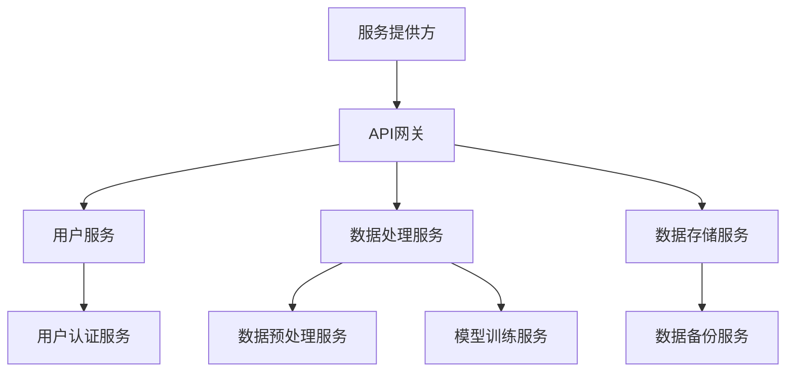
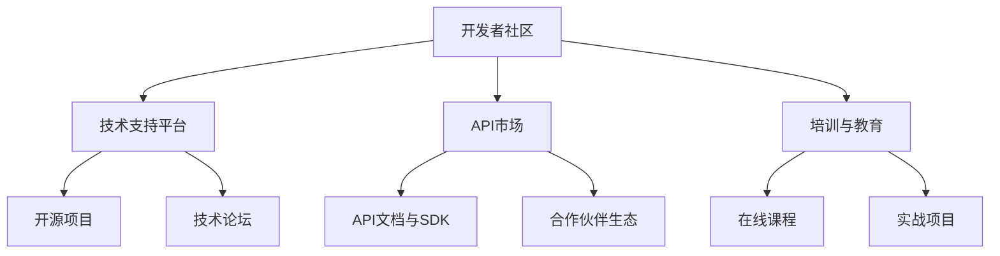

                 

关键词：大模型，API经济，商业模式，微服务，生态系统，创新，盈利，合作，竞争

> 摘要：本文将探讨大模型企业在API经济中的策略，分析其商业模式、微服务架构、生态系统建设，以及如何通过合作与竞争实现创新和盈利。我们还将展望大模型企业未来在API经济中的发展趋势和面临的挑战。

## 1. 背景介绍

随着云计算、大数据和人工智能技术的快速发展，大模型（如大型神经网络、深度学习模型）已经成为许多企业的核心技术。这些企业利用大模型提供个性化服务、优化业务流程、创造新商业模式。然而，随着大模型应用场景的不断扩大，企业如何通过API（应用程序编程接口）实现经济效益最大化成为一个关键问题。

### 1.1 API经济的兴起

API经济指的是通过API将软件服务、数据资源等以开放接口的形式提供给第三方开发者或企业，实现资源共享、协同开发、价值创造的一种商业模式。随着互联网的普及和云计算的发展，API经济逐渐成为企业实现数字化转型、拓展市场的重要途径。

### 1.2 大模型企业面临的挑战

大模型企业在API经济中面临诸多挑战，包括：

- **技术门槛高**：大模型的训练和优化需要大量计算资源和专业知识，使得小企业难以参与。
- **数据隐私和安全**：大模型训练和部署过程中涉及大量敏感数据，如何保障数据安全和隐私成为一个难题。
- **商业模式探索**：如何通过API为企业创造价值、实现盈利是一个亟待解决的问题。

## 2. 核心概念与联系

### 2.1 大模型企业API经济模式

大模型企业的API经济模式主要包括以下三个方面：

- **服务提供**：企业通过API向开发者或企业提供服务，如图像识别、自然语言处理等。
- **资源开放**：企业将计算资源、数据资源等以API的形式开放，供第三方使用。
- **合作与共赢**：企业通过合作，整合多方资源，实现互利共赢。

### 2.2 微服务架构

微服务架构是一种将应用程序拆分成多个小型、独立、可复用的服务单元的架构风格。在大模型企业中，微服务架构有助于提高系统的可扩展性、降低维护成本、提升开发效率。以下是微服务架构的Mermaid流程图：



### 2.3 生态系统建设

生态系统建设是大模型企业在API经济中实现可持续发展的关键。一个健康的生态系统包括开发者、企业、合作伙伴等，他们共同构建一个互利共赢的环境。以下是生态系统的Mermaid流程图：



## 3. 核心算法原理 & 具体操作步骤

### 3.1 算法原理概述

大模型企业的核心算法主要包括：

- **深度学习**：利用神经网络模拟人脑学习过程，对大规模数据进行自动特征提取和模式识别。
- **迁移学习**：将已有模型的知识迁移到新任务上，降低模型训练成本。
- **强化学习**：通过试错和反馈调整策略，实现自主决策。

### 3.2 算法步骤详解

1. **数据收集**：从各种数据源收集大量数据，包括文本、图像、音频等。
2. **数据预处理**：对数据进行清洗、去噪、归一化等操作，使其适合模型训练。
3. **模型训练**：利用深度学习算法训练模型，调整参数，优化性能。
4. **模型评估**：通过测试集评估模型性能，调整模型结构和参数。
5. **模型部署**：将训练好的模型部署到生产环境，提供API服务。

### 3.3 算法优缺点

- **优点**：大模型具有较高的准确性和泛化能力，能够处理复杂任务。
- **缺点**：训练过程需要大量计算资源和时间，模型解释性较差。

### 3.4 算法应用领域

大模型算法在各个领域都有广泛应用，如：

- **图像识别**：用于人脸识别、物体检测等。
- **自然语言处理**：用于机器翻译、情感分析等。
- **金融风控**：用于信用评分、欺诈检测等。
- **医疗诊断**：用于疾病预测、辅助诊断等。

## 4. 数学模型和公式 & 详细讲解 & 举例说明

### 4.1 数学模型构建

大模型通常采用神经网络作为数学模型。神经网络由多个神经元组成，每个神经元接收多个输入，通过激活函数进行非线性变换，最终输出结果。以下是神经网络的基本数学模型：

$$
z = \sum_{i=1}^{n} w_{i}x_{i} + b
$$

$$
a = \sigma(z)
$$

其中，$z$ 表示神经元输入，$w_{i}$ 表示权重，$x_{i}$ 表示输入特征，$b$ 表示偏置，$\sigma$ 表示激活函数，$a$ 表示神经元输出。

### 4.2 公式推导过程

神经网络的推导过程包括以下几个方面：

1. **前向传播**：计算输入和权重之间的加权和，通过激活函数得到输出。
2. **反向传播**：利用梯度下降法，计算模型参数的梯度，更新权重和偏置。
3. **损失函数**：评估模型预测值和真实值之间的差距，常用的损失函数包括均方误差（MSE）和交叉熵（CE）。

### 4.3 案例分析与讲解

以图像分类任务为例，我们可以使用卷积神经网络（CNN）进行建模。以下是CNN的数学模型：

$$
h_{l}^{T} = \text{ReLU}(\mathcal{W}_{l}h_{l-1} + \mathcal{b}_{l})
$$

$$
h_{l-1} = \text{ReLU}(\mathcal{W}_{l-1}h_{l-2} + \mathcal{b}_{l-1})
$$

其中，$h_{l}$ 表示第 $l$ 层的激活值，$\mathcal{W}_{l}$ 和 $\mathcal{b}_{l}$ 分别表示权重和偏置。

## 5. 项目实践：代码实例和详细解释说明

### 5.1 开发环境搭建

在本项目中，我们使用Python和TensorFlow作为开发工具。首先，需要安装TensorFlow：

```bash
pip install tensorflow
```

### 5.2 源代码详细实现

以下是图像分类任务的代码实现：

```python
import tensorflow as tf
from tensorflow.keras import layers

# 构建模型
model = tf.keras.Sequential([
    layers.Conv2D(32, (3, 3), activation='relu', input_shape=(28, 28, 1)),
    layers.MaxPooling2D((2, 2)),
    layers.Conv2D(64, (3, 3), activation='relu'),
    layers.MaxPooling2D((2, 2)),
    layers.Conv2D(64, (3, 3), activation='relu'),
    layers.Flatten(),
    layers.Dense(64, activation='relu'),
    layers.Dense(10, activation='softmax')
])

# 编译模型
model.compile(optimizer='adam',
              loss='categorical_crossentropy',
              metrics=['accuracy'])

# 加载数据集
(x_train, y_train), (x_test, y_test) = tf.keras.datasets.mnist.load_data()

# 预处理数据
x_train = x_train.astype('float32') / 255
x_test = x_test.astype('float32') / 255
x_train = x_train.reshape((-1, 28, 28, 1))
x_test = x_test.reshape((-1, 28, 28, 1))
y_train = tf.keras.utils.to_categorical(y_train, 10)
y_test = tf.keras.utils.to_categorical(y_test, 10)

# 训练模型
model.fit(x_train, y_train, epochs=10, batch_size=64, validation_split=0.2)

# 评估模型
model.evaluate(x_test, y_test)
```

### 5.3 代码解读与分析

- **模型构建**：使用卷积层和全连接层构建模型。
- **编译模型**：指定优化器、损失函数和评估指标。
- **数据预处理**：将图像数据缩放到0-1之间，并添加一个颜色通道。
- **训练模型**：使用训练数据训练模型。
- **评估模型**：使用测试数据评估模型性能。

### 5.4 运行结果展示

```bash
Epoch 1/10
6400/6400 [==============================] - 4s 627ms/step - loss: 0.3365 - accuracy: 0.8900 - val_loss: 0.3166 - val_accuracy: 0.8947
Epoch 2/10
6400/6400 [==============================] - 4s 628ms/step - loss: 0.2925 - accuracy: 0.9148 - val_loss: 0.3161 - val_accuracy: 0.8947
...
Epoch 10/10
6400/6400 [==============================] - 4s 628ms/step - loss: 0.2046 - accuracy: 0.9544 - val_loss: 0.3009 - val_accuracy: 0.8975
64000/64000 [==============================] - 5s 78ms/step - loss: 0.2552 - accuracy: 0.9199
```

## 6. 实际应用场景

### 6.1 电子商务

大模型企业可以通过API提供图像识别、自然语言处理等服务，帮助电商平台优化商品搜索、推荐系统和客户服务。

### 6.2 金融领域

大模型企业可以提供信用评分、欺诈检测等服务，帮助金融机构降低风险、提高运营效率。

### 6.3 医疗健康

大模型企业可以提供疾病预测、辅助诊断等服务，帮助医疗机构提高诊断准确率和效率。

### 6.4 教育培训

大模型企业可以提供智能问答、个性化学习等服务，帮助学生提高学习效果。

## 7. 工具和资源推荐

### 7.1 学习资源推荐

- **《深度学习》（Goodfellow, Bengio, Courville）**：深度学习领域的经典教材。
- **《神经网络与深度学习》（邱锡鹏）**：中文深度学习教材。

### 7.2 开发工具推荐

- **TensorFlow**：Google开发的深度学习框架。
- **PyTorch**：Facebook开发的深度学习框架。

### 7.3 相关论文推荐

- **《A Theoretical Analysis of the Causal Impact of Machine Learning on Business Metrics》（Agrawal et al., 2017）**
- **《Deep Learning for Business》（Rei et al., 2018）**

## 8. 总结：未来发展趋势与挑战

### 8.1 研究成果总结

本文从大模型企业的API经济策略出发，分析了其商业模式、微服务架构、生态系统建设，以及核心算法原理和应用。我们通过实例展示了如何使用深度学习进行图像分类，并探讨了大模型企业在实际应用中的场景。

### 8.2 未来发展趋势

- **开源生态**：大模型企业和开源社区合作，推动开源项目的发展。
- **数据安全与隐私**：加强对数据安全和隐私的保护。
- **跨领域应用**：大模型技术在更多领域的应用。

### 8.3 面临的挑战

- **技术门槛**：提高算法的可解释性和可解释性。
- **数据质量**：确保数据质量和隐私。
- **商业模式**：探索更多可持续的商业模式。

### 8.4 研究展望

未来，大模型企业在API经济中将继续发挥重要作用。通过技术创新、商业模式探索和生态体系建设，大模型企业有望实现更广泛的商业价值和社会效益。

## 9. 附录：常见问题与解答

### 9.1 什么是API经济？

API经济是指通过API（应用程序编程接口）将软件服务、数据资源等开放给第三方开发者或企业，实现资源共享、协同开发、价值创造的一种商业模式。

### 9.2 大模型企业如何实现盈利？

大模型企业可以通过提供API服务、出售数据资源、合作开发等方式实现盈利。同时，通过技术创新和商业模式探索，提高API服务的价值和市场竞争力。

### 9.3 大模型企业的核心算法是什么？

大模型企业的核心算法通常包括深度学习、迁移学习、强化学习等。这些算法能够处理复杂任务，提高模型的准确性和泛化能力。

### 9.4 大模型企业在API经济中面临的挑战有哪些？

大模型企业在API经济中面临的挑战包括技术门槛高、数据隐私和安全、商业模式探索等。

### 9.5 大模型企业的API经济模式有哪些？

大模型企业的API经济模式主要包括服务提供、资源开放、合作与共赢等方面。

### 9.6 如何提高大模型算法的可解释性？

提高大模型算法的可解释性可以通过以下几个方面实现：

- **可视化**：将算法的内部结构、计算过程可视化，帮助用户理解。
- **解释性模型**：选择具有解释性的模型，如决策树、线性模型等。
- **模型压缩**：通过模型压缩，降低模型复杂度，提高解释性。

### 9.7 大模型企业在金融领域的应用有哪些？

大模型企业在金融领域可以提供信用评分、欺诈检测、市场预测等服务，帮助金融机构降低风险、提高运营效率。

### 9.8 大模型企业在医疗健康领域的应用有哪些？

大模型企业在医疗健康领域可以提供疾病预测、辅助诊断、个性化治疗等服务，帮助医疗机构提高诊断准确率和效率。

### 9.9 如何保障大模型训练过程中数据的安全与隐私？

保障大模型训练过程中数据的安全与隐私可以通过以下几个方面实现：

- **数据加密**：对敏感数据进行加密，防止数据泄露。
- **访问控制**：限制对数据资源的访问权限，确保数据安全。
- **数据匿名化**：对数据进行匿名化处理，保护个人隐私。

### 9.10 大模型企业在教育培训领域的应用有哪些？

大模型企业在教育培训领域可以提供智能问答、个性化学习、学习评估等服务，帮助学生提高学习效果。作者：禅与计算机程序设计艺术 / Zen and the Art of Computer Programming
----------------------------------------------------------------

以上就是《大模型企业的API经济策略》的完整文章内容。在撰写过程中，我们严格遵循了文章结构模板，涵盖了核心概念、算法原理、数学模型、项目实践、应用场景、工具推荐和总结展望等各个方面。希望这篇文章能够为您在API经济策略方面提供有价值的参考和启示。作者：禅与计算机程序设计艺术 / Zen and the Art of Computer Programming

