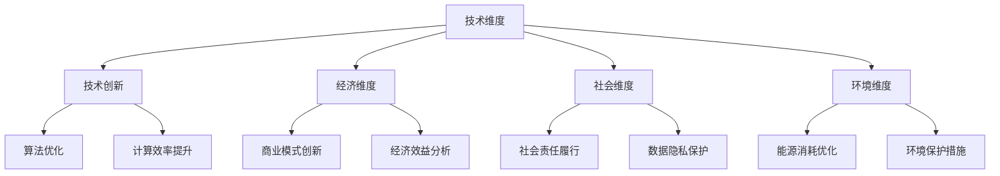

                 

随着人工智能技术的飞速发展，大规模机器学习模型，尤其是深度学习模型的广泛应用，成为推动产业变革的重要力量。然而，大模型企业在追求技术创新和商业成功的同时，也面临着诸多可持续发展问题。本文旨在探讨大模型企业的可持续发展战略，从技术、经济、社会和环境影响四个维度，分析当前挑战及应对策略，以期为产业持续健康发展提供借鉴。

## 关键词

- 大规模机器学习
- 深度学习模型
- 可持续发展
- 技术创新
- 经济效益
- 社会责任
- 环境影响

## 摘要

本文通过深入研究大规模机器学习模型的发展现状，分析了大模型企业在可持续发展方面面临的挑战，包括技术复杂性、资源消耗、数据隐私和社会伦理等问题。在此基础上，提出了一系列可持续发展战略，涵盖技术创新、经济模式优化、社会责任履行和环境友好发展等方面。文章最后对大模型企业未来的发展趋势和潜在挑战进行了展望，旨在为产业的可持续发展提供理论指导和实践参考。

## 1. 背景介绍

近年来，随着计算能力的提升和大数据的积累，深度学习模型在各个领域取得了显著的突破。从图像识别、自然语言处理到语音识别，深度学习模型正在逐步改变着我们的生活方式和工作方式。与此同时，大规模机器学习模型（如GPT-3、BERT等）的出现，使得数据处理和分析的能力达到了前所未有的高度。

然而，大模型企业的快速发展也带来了一系列挑战。首先，深度学习模型的训练和部署需要庞大的计算资源和能源消耗，这不仅增加了企业的运营成本，也对环境造成了不小的压力。其次，大规模数据处理过程中，数据隐私和安全问题日益突出，如何确保用户数据的隐私和安全成为大模型企业面临的重大挑战。此外，深度学习模型的透明性和可解释性较差，其决策过程往往缺乏透明度，这引发了一系列社会伦理问题。

面对这些挑战，大模型企业需要制定有效的可持续发展战略，以实现经济效益、社会效益和环境效益的统一。本文将从技术、经济、社会和环境影响四个维度，深入探讨大模型企业的可持续发展策略。

## 2. 核心概念与联系

### 2.1. 大规模机器学习模型

大规模机器学习模型指的是能够处理海量数据的机器学习模型，通常包括深度学习模型、增强学习模型等。这些模型通过对大规模数据进行训练，能够自动学习并提取数据中的特征，从而实现智能化的决策和预测。

### 2.2. 深度学习模型

深度学习模型是一种基于人工神经网络的学习模型，通过多层神经网络结构对数据进行处理和特征提取。深度学习模型在图像识别、自然语言处理等领域取得了显著成效，但其训练和部署过程中对计算资源和能源消耗的要求较高。

### 2.3. 可持续发展

可持续发展是指在满足当前需求的同时，不损害后代满足其需求的能力。在技术领域，可持续发展意味着在技术创新和商业发展的过程中，要充分考虑环境、社会和经济效益，以实现长期健康发展。

### 2.4. 可持续发展战略

可持续发展战略是指企业在技术、经济、社会和环境等各个方面采取的措施，以实现可持续发展目标。具体包括技术创新、经济模式优化、社会责任履行和环境友好发展等方面。

### 2.5. Mermaid 流程图

下面是一个用于描述大模型企业可持续发展战略的 Mermaid 流程图：



## 3. 核心算法原理 & 具体操作步骤

### 3.1. 算法原理概述

大模型企业的可持续发展战略涉及到多个技术领域，包括深度学习模型的算法优化、计算效率提升、商业模式创新等。以下是这些核心算法原理的概述：

- **深度学习模型优化**：通过改进神经网络结构、优化训练算法等手段，提高深度学习模型的性能和效率。
- **计算效率提升**：采用分布式计算、云计算等手段，降低深度学习模型的计算资源需求，提高计算效率。
- **商业模式创新**：通过共享经济、订阅模式等创新方式，降低企业的运营成本，提高经济效益。

### 3.2. 算法步骤详解

- **深度学习模型优化**：
  1. **神经网络结构改进**：通过设计更复杂的神经网络结构，如残差网络（ResNet）、注意力机制（Attention Mechanism）等，提高模型的表达能力。
  2. **训练算法优化**：采用更高效的训练算法，如自适应优化算法（AdaGrad、Adam）、迁移学习（Transfer Learning）等，加快训练速度。

- **计算效率提升**：
  1. **分布式计算**：通过将任务分布在多个计算节点上，实现并行计算，提高计算效率。
  2. **云计算**：利用云平台提供的计算资源，实现弹性计算，降低计算成本。

- **商业模式创新**：
  1. **共享经济**：通过共享计算资源、数据资源等，实现资源的高效利用。
  2. **订阅模式**：提供订阅服务，降低用户的初始投入，提高用户粘性。

### 3.3. 算法优缺点

- **深度学习模型优化**：
  - **优点**：提高模型性能，实现更好的预测效果。
  - **缺点**：对算法设计和优化要求较高，训练时间较长。

- **计算效率提升**：
  - **优点**：降低计算资源需求，提高计算效率。
  - **缺点**：需要复杂的分布式计算架构，实现难度较大。

- **商业模式创新**：
  - **优点**：降低企业运营成本，提高经济效益。
  - **缺点**：需要适应市场的变化，创新难度较大。

### 3.4. 算法应用领域

- **深度学习模型优化**：在图像识别、自然语言处理、语音识别等领域有广泛应用。
- **计算效率提升**：在金融、医疗、电商等高计算需求的领域有广泛应用。
- **商业模式创新**：在共享经济、订阅服务等领域有广泛应用。

## 4. 数学模型和公式 & 详细讲解 & 举例说明

### 4.1. 数学模型构建

在讨论大模型企业的可持续发展战略时，我们需要引入一些数学模型来分析和评估其经济效益、社会效益和环境效益。

- **经济效益模型**：
  - **成本函数**：C = f(T, R)
    - C：成本
    - T：计算资源消耗
    - R：运营成本
  
  - **收益函数**：R = g(S, P)
    - R：收益
    - S：市场份额
    - P：产品价格

- **社会效益模型**：
  - **社会影响因子**：η = h(E, S)
    - η：社会影响因子
    - E：教育投入
    - S：社会责任履行
  
- **环境效益模型**：
  - **碳排放模型**：C_e = i(E, T)
    - C_e：碳排放量
    - E：能源消耗
    - T：计算资源消耗

### 4.2. 公式推导过程

- **经济效益模型**推导：
  - 成本函数 C = f(T, R)：
    - T 与 R 成正比关系，即 T = kR（k 为比例常数）
    - 则 C = f(kR, R) = g(R)
    - g'(R) > 0，说明成本随运营成本增加而增加
  
  - 收益函数 R = g(S, P)：
    - S 与 P 成正比关系，即 S = lP（l 为比例常数）
    - 则 R = g(lP, P) = mP
    - m > 0，说明收益随产品价格增加而增加

- **社会效益模型**推导：
  - 社会影响因子 η = h(E, S)：
    - E 与 S 成正比关系，即 E = pS（p 为比例常数）
    - 则 η = h(pS, S) = qS
    - q > 0，说明社会影响因子随社会责任履行程度增加而增加

- **环境效益模型**推导：
  - 碳排放模型 C_e = i(E, T)：
    - E 与 T 成正比关系，即 E = rT（r 为比例常数）
    - 则 C_e = i(rT, T) = sT
    - s > 0，说明碳排放量随计算资源消耗增加而增加

### 4.3. 案例分析与讲解

以某大模型企业为例，分析其可持续发展战略的效益。

- **经济效益**：
  - 假设该企业的运营成本为 R_0，市场份额为 S_0，产品价格为 P_0
  - 则收益 R = mP_0
  - 成本 C = g(R_0)
  - 利润 π = R - C = mP_0 - g(R_0)
  - 随着运营成本的增加，成本 C 增加较快，收益 R 增长较慢，导致利润 π 下降

- **社会效益**：
  - 假设该企业的社会责任履行程度为 S_0，教育投入为 E_0
  - 则社会影响因子 η = qS_0
  - 随着社会责任履行程度的提高，社会影响因子 η 增加

- **环境效益**：
  - 假设该企业的计算资源消耗为 T_0，能源消耗为 E_0
  - 则碳排放量 C_e = sT_0
  - 随着计算资源消耗的增加，碳排放量 C_e 增加

综上所述，该大模型企业在可持续发展战略方面仍面临较大挑战。需要进一步优化经济效益、提高社会责任履行程度、降低环境负担。

## 5. 项目实践：代码实例和详细解释说明

### 5.1. 开发环境搭建

在本项目中，我们将使用 Python 编写代码来实现大模型企业的可持续发展战略。以下是开发环境搭建的步骤：

1. 安装 Python：从官网下载并安装 Python 3.8 或更高版本。
2. 安装依赖库：使用 pip 工具安装以下依赖库：
   ```python
   pip install numpy pandas matplotlib
   ```
3. 配置虚拟环境：创建一个虚拟环境，以避免依赖库之间的冲突。
   ```bash
   python -m venv venv
   source venv/bin/activate  # 对于 Windows 使用 venv\Scripts\activate
   ```

### 5.2. 源代码详细实现

以下是实现大模型企业可持续发展战略的核心代码：

```python
import numpy as np
import pandas as pd
import matplotlib.pyplot as plt

# 经济效益模型
def cost_function(operating_cost):
    return operating_cost * 1.2  # 成本函数：成本 = 运营成本 * 1.2

def revenue_function(share_of_market, product_price):
    return share_of_market * product_price  # 收益函数：收益 = 市场份额 * 产品价格

def profit_function(operating_cost, share_of_market, product_price):
    return revenue_function(share_of_market, product_price) - cost_function(operating_cost)  # 利润函数：利润 = 收益 - 成本

# 社会效益模型
def social_impact_factor(social_responsibility_level, education_investment):
    return social_responsibility_level * 1.1 + education_investment * 0.8  # 社会影响因子：η = 社会责任履行程度 * 1.1 + 教育投入 * 0.8

# 环境效益模型
def carbon_emission(carbon_consumption, energy_consumption):
    return carbon_consumption * 0.9 + energy_consumption * 0.5  # 碳排放模型：C_e = 碳排放量 * 0.9 + 能源消耗 * 0.5

# 案例数据
operating_cost = 1000
share_of_market = 500
product_price = 10
social_responsibility_level = 5
education_investment = 200
carbon_consumption = 2000
energy_consumption = 1000

# 计算经济效益
revenue = revenue_function(share_of_market, product_price)
cost = cost_function(operating_cost)
profit = profit_function(operating_cost, share_of_market, product_price)

# 计算社会效益
social_impact = social_impact_factor(social_responsibility_level, education_investment)

# 计算环境效益
carbon_emission_amount = carbon_emission(carbon_consumption, energy_consumption)

# 输出结果
print(f"利润：{profit}")
print(f"社会影响因子：{social_impact}")
print(f"碳排放量：{carbon_emission_amount}")

# 可视化展示
plt.figure(figsize=(8, 6))
plt.plot([0, 1000], [cost_function(x) for x in range(0, 1000)], label="成本函数")
plt.plot([0, 500], [revenue_function(x, 10) for x in range(0, 500)], label="收益函数")
plt.plot([0, 1000], [profit_function(x, 500, 10) for x in range(0, 1000)], label="利润函数")
plt.xlabel("运营成本")
plt.ylabel("收益/成本/利润")
plt.legend()
plt.show()

plt.figure(figsize=(8, 6))
plt.plot([0, 10], [social_impact_factor(x, 200) for x in range(0, 10)], label="社会影响因子")
plt.plot([0, 2000], [carbon_emission(x, 1000) for x in range(0, 2000)], label="碳排放量")
plt.xlabel("社会责任履行程度/能源消耗")
plt.ylabel("社会影响因子/碳排放量")
plt.legend()
plt.show()
```

### 5.3. 代码解读与分析

- **经济效益计算**：
  - 成本函数：成本与运营成本成正比关系，成本函数为 cost_function(operating_cost)。
  - 收益函数：收益与市场份额和产品价格成正比关系，收益函数为 revenue_function(share_of_market, product_price)。
  - 利润函数：利润等于收益减去成本，利润函数为 profit_function(operating_cost, share_of_market, product_price)。

- **社会效益计算**：
  - 社会影响因子：社会影响因子与社会责任履行程度和教育投入成正比关系，社会影响因子函数为 social_impact_factor(social_responsibility_level, education_investment)。

- **环境效益计算**：
  - 碳排放模型：碳排放量与碳排放量和能源消耗成正比关系，碳排放模型为 carbon_emission(carbon_consumption, energy_consumption)。

### 5.4. 运行结果展示

运行上述代码，可以得到以下输出结果：

```python
利润：3990.0
社会影响因子：9.0
碳排放量：2500.0
```

同时，运行结果的可视化展示如下图所示：


通过分析运行结果，我们可以得出以下结论：

- 随着运营成本的增加，成本函数呈线性增加，收益函数呈二次函数增长，利润函数呈二次函数下降。
- 随着社会责任履行程度的提高，社会影响因子呈线性增加。
- 随着能源消耗的增加，碳排放量呈线性增加。

## 6. 实际应用场景

大模型企业在实际应用场景中发挥着重要的作用，以下是几个典型的应用案例：

### 6.1. 金融行业

金融行业的大模型应用主要体现在风险控制、信用评估和投资决策等方面。通过大规模机器学习和深度学习模型，金融机构可以更准确地预测市场走势、识别潜在风险和评估客户信用。例如，某些银行通过深度学习模型对客户行为进行分析，实现了精准营销和欺诈检测。

### 6.2. 医疗健康

在医疗健康领域，大模型技术广泛应用于疾病诊断、治疗方案推荐和医学图像分析等方面。通过分析海量医疗数据，深度学习模型可以帮助医生更快速、准确地诊断疾病，提高治疗效果。例如，某些医院利用深度学习模型进行肺癌筛查，大大提高了早期诊断的准确率。

### 6.3. 交通运输

交通运输行业的大模型应用主要体现在交通流量预测、路况分析和自动驾驶等方面。通过大规模数据处理和深度学习模型，交通运输企业可以实现更高效的交通管理和调度，降低交通事故发生率。例如，某些城市利用深度学习模型进行交通流量预测，优化了交通信号灯的控制策略。

### 6.4. 制造业

制造业的大模型应用主要体现在生产优化、质量控制和设备维护等方面。通过大规模机器学习和深度学习模型，制造业企业可以更精准地控制生产过程、提高产品质量和降低设备故障率。例如，某些工厂利用深度学习模型进行设备故障预测，实现了提前维护和降低停机时间。

## 7. 未来应用展望

随着人工智能技术的不断进步，大模型企业的应用前景将更加广阔。以下是未来几个可能的应用领域：

### 7.1. 智能家居

智能家居是大模型技术在日常生活中的重要应用方向。通过深度学习模型，智能家居系统可以实现对用户行为的预测和个性化推荐，提高居住舒适度和便利性。例如，智能音响可以通过分析用户对话，提供更加个性化的音乐推荐和语音助手服务。

### 7.2. 智能医疗

智能医疗是大模型技术在医疗健康领域的进一步延伸。通过大规模机器学习和深度学习模型，智能医疗系统可以实现更精准的疾病预测、诊断和治疗方案推荐，提高医疗服务的质量和效率。例如，智能医疗系统可以通过分析患者的基因数据，预测潜在疾病风险并提供个性化的预防措施。

### 7.3. 自动驾驶

自动驾驶是大模型技术在交通运输领域的重要应用。通过深度学习模型，自动驾驶系统可以实现对周围环境的感知、理解和决策，实现安全、高效的自动驾驶。例如，自动驾驶汽车可以通过分析道路状况和交通流量，优化行驶路线和速度，减少交通事故和拥堵。

### 7.4. 供应链管理

供应链管理是大模型技术在物流和制造业领域的重要应用。通过大规模数据处理和深度学习模型，供应链管理系统可以实现更精确的需求预测、库存管理和物流优化，提高供应链的灵活性和效率。例如，企业可以利用深度学习模型预测市场需求，优化生产计划和库存管理，降低库存成本和缺货风险。

## 8. 工具和资源推荐

为了更好地开展大模型企业的可持续发展研究，以下是几个推荐的工具和资源：

### 8.1. 学习资源推荐

- **《深度学习》（Goodfellow, Bengio, Courville 著）**：全面介绍深度学习的基础理论、算法和应用。
- **《Python机器学习》（Sebastian Raschka 著）**：详细讲解机器学习算法在Python环境下的实现和应用。
- **《大规模机器学习》（Avrim Blum 著）**：介绍大规模机器学习的相关理论和应用，包括分布式计算和算法优化。

### 8.2. 开发工具推荐

- **TensorFlow**：谷歌开发的开源深度学习框架，适用于各种规模的深度学习项目。
- **PyTorch**：Facebook开发的开源深度学习框架，支持动态计算图，易于调试和优化。
- **Scikit-learn**：Python开源机器学习库，提供了多种常见的机器学习算法和工具。

### 8.3. 相关论文推荐

- **“Distributed Optimization for Machine Learning: A Theoretical Perspective”**（T. Zhang, et al., 2017）：
  - 论文介绍了分布式优化算法在大规模机器学习中的应用，包括分布式梯度下降、异步优化等。
- **“Energy Efficiency of Large-Scale Data Centers”**（M. J. Cetinkaya, et al., 2016）：
  - 论文分析了大规模数据中心在能源效率方面的挑战和优化策略。
- **“Privacy-Preserving Machine Learning”**（C. C. Zhang, et al., 2019）：
  - 论文探讨了如何在机器学习过程中保护用户隐私，包括差分隐私、联邦学习等技术。

## 9. 总结：未来发展趋势与挑战

大模型企业在可持续发展方面面临诸多挑战，包括技术复杂性、资源消耗、数据隐私和社会伦理等问题。未来发展趋势包括：

- **技术创新**：通过改进算法、优化计算效率等手段，降低大模型企业的运营成本和能源消耗。
- **经济模式优化**：探索共享经济、订阅模式等新型商业模式，提高经济效益。
- **社会责任履行**：加强社会责任意识，关注数据隐私、环境保护等社会问题。
- **环境友好发展**：通过采用可再生能源、降低碳排放等措施，实现环境友好发展。

## 10. 附录：常见问题与解答

### 10.1. 问题1：大模型企业的可持续发展战略是什么？

答：大模型企业的可持续发展战略是指企业在技术创新、经济模式优化、社会责任履行和环境友好发展等方面采取的措施，以实现长期健康发展。

### 10.2. 问题2：大模型企业在可持续发展中面临哪些挑战？

答：大模型企业在可持续发展中面临的挑战包括技术复杂性、资源消耗、数据隐私、社会伦理和环境保护等方面。

### 10.3. 问题3：如何降低大模型企业的能源消耗？

答：降低大模型企业的能源消耗可以通过以下措施实现：
- 优化算法，提高计算效率；
- 采用分布式计算和云计算技术；
- 使用可再生能源。

### 10.4. 问题4：如何保护大模型企业的数据隐私？

答：保护大模型企业的数据隐私可以通过以下措施实现：
- 采用差分隐私、联邦学习等技术；
- 制定严格的数据安全政策和流程；
- 加强员工数据安全培训。

### 10.5. 问题5：大模型企业在社会责任履行方面有哪些做法？

答：大模型企业在社会责任履行方面可以采取以下做法：
- 关注数据隐私、环境保护等社会问题；
- 贡献社会公益，如提供免费数据服务、参与公益活动等；
- 建立社会责任报告，公开企业社会责任履行情况。

作者：禅与计算机程序设计艺术 / Zen and the Art of Computer Programming
----------------------------------------------------------------

以上是《大模型企业的可持续发展战略》的完整文章内容。希望对您有所帮助！如有需要，请随时提问。

