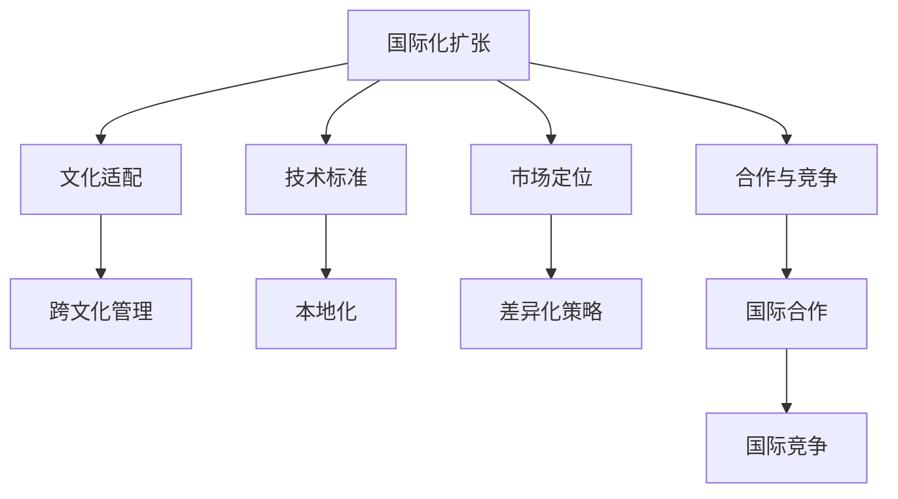

                 

关键词：大模型企业、国际化、扩张策略、文化适配、技术标准、市场定位、合作与竞争

> 摘要：随着人工智能技术的快速发展，大模型企业在全球范围内的影响力日益增强。本文将探讨大模型企业在进行国际化扩张时所面临的关键挑战，并提出一系列策略，以帮助这些企业成功进入并立足国际市场。

## 1. 背景介绍

大模型企业，即专注于开发和使用大规模人工智能模型的企业，如谷歌的DeepMind、微软的Azure AI、以及中国的阿里巴巴达摩院等，它们在深度学习、自然语言处理、计算机视觉等领域取得了显著的成就。随着这些企业技术能力的不断提升，它们的业务范围也逐步扩展到了全球市场。然而，国际化的过程并非一帆风顺，企业需要面对文化差异、技术标准不统一、市场竞争等诸多挑战。

### 文章关键词：
- 大模型企业
- 国际化
- 扩张策略
- 文化适配
- 技术标准
- 市场定位
- 合作与竞争

### 文章摘要：
本文将探讨大模型企业在国际化扩张过程中所面临的关键挑战，包括文化差异、技术标准不统一、市场竞争等，并针对性地提出一系列策略，以帮助这些企业成功进入并立足国际市场。

## 2. 核心概念与联系

在探讨大模型企业的国际化扩张策略之前，我们首先需要明确几个核心概念：

- **国际化扩张**：企业将其业务扩展到全球市场的过程。
- **文化适配**：企业适应不同国家和地区文化差异的能力。
- **技术标准**：在信息技术领域，不同国家和地区遵循的不同规范和标准。
- **市场定位**：企业在市场上的定位，包括目标客户、产品特点等。
- **合作与竞争**：企业在国际市场中的合作机会与竞争关系。

为了更好地理解这些概念之间的联系，我们使用Mermaid绘制了一张流程图：



### 2.1 文化适配与跨文化管理

文化适配是国际化扩张中的关键一环。不同国家和地区的文化差异可能导致沟通障碍、管理难题和消费者行为的不同。企业需要通过跨文化管理来应对这些挑战，包括：

- **文化意识培训**：提高员工对跨文化沟通和管理的认识。
- **文化敏感性**：在产品设计、市场营销等环节考虑文化差异。
- **本地化管理团队**：聘用本地员工加入管理团队，以更好地理解当地市场和消费者。

### 2.2 技术标准与本地化

技术标准的差异是国际化扩张中的另一大挑战。不同国家和地区可能遵循不同的技术标准，如网络协议、数据安全规范等。为了实现本地化，企业需要进行以下工作：

- **合规审查**：确保产品和服务符合当地法律法规和技术标准。
- **本地化开发**：根据当地市场需求和技术环境进行产品本地化开发。
- **技术支持与服务**：提供本地化的技术支持和服务，以增强客户满意度。

### 2.3 市场定位与差异化策略

市场定位是企业在国际市场中成功的关键。企业需要根据不同市场的特点制定差异化策略，包括：

- **细分市场**：分析不同市场的特点和需求，进行市场细分。
- **产品创新**：根据不同市场的需求，推出符合当地消费者期望的产品。
- **品牌建设**：通过品牌传播和市场营销活动，提高品牌知名度。

### 2.4 合作与竞争

在国际市场中，企业不仅需要面对竞争，还需要寻找合作机会。以下是一些策略：

- **国际合作**：与其他企业或组织建立合作关系，共享资源和技术。
- **市场竞争**：通过价格、质量和服务等手段，与其他企业竞争。
- **市场进入策略**：选择合适的进入市场策略，如合资、并购或独立运营。

## 3. 核心算法原理 & 具体操作步骤

### 3.1 算法原理概述

在国际化扩张过程中，企业需要使用一系列算法来分析市场数据、评估文化差异、优化市场定位等。以下是一些核心算法的原理概述：

- **数据挖掘算法**：用于挖掘市场数据，提取有用的信息和趋势。
- **自然语言处理算法**：用于分析不同语言的文化差异和消费者行为。
- **优化算法**：用于优化市场定位和资源配置。

### 3.2 算法步骤详解

以下是国际化扩张中的算法步骤详解：

#### 3.2.1 数据挖掘算法

1. **数据收集**：收集不同市场的历史数据、消费者行为数据等。
2. **数据预处理**：清洗、归一化和格式化数据。
3. **特征提取**：提取与市场分析相关的特征。
4. **模型训练**：使用机器学习算法训练数据模型。
5. **模型评估**：评估模型的准确性和泛化能力。
6. **结果分析**：根据模型分析结果，制定市场策略。

#### 3.2.2 自然语言处理算法

1. **语言识别**：识别不同语言的文化特征。
2. **文本分类**：将文本分类为不同的文化类别。
3. **情感分析**：分析文本的情感倾向。
4. **语言翻译**：实现不同语言之间的翻译。
5. **语言生成**：生成符合目标语言和文化习惯的内容。

#### 3.2.3 优化算法

1. **目标设定**：确定市场定位和资源配置的目标。
2. **参数调整**：根据目标调整算法的参数。
3. **模型优化**：使用优化算法调整模型参数，提高模型性能。
4. **策略制定**：根据优化结果制定市场策略。

### 3.3 算法优缺点

每种算法都有其优缺点，以下是一些常见算法的优缺点：

- **数据挖掘算法**：
  - 优点：能够发现市场中的潜在趋势和机会。
  - 缺点：对数据质量和数量要求较高，可能产生过拟合。

- **自然语言处理算法**：
  - 优点：能够分析不同语言的文化差异。
  - 缺点：对语言理解能力要求较高，可能存在歧义和误解。

- **优化算法**：
  - 优点：能够高效地调整模型参数。
  - 缺点：可能陷入局部最优解。

### 3.4 算法应用领域

这些算法可以应用于国际化扩张的多个领域，包括：

- **市场分析**：分析不同市场的需求和趋势。
- **产品定位**：优化产品设计和市场定位。
- **营销策略**：制定针对不同市场的营销策略。
- **资源优化**：优化资源配置，提高运营效率。

## 4. 数学模型和公式 & 详细讲解 & 举例说明

### 4.1 数学模型构建

在国际化扩张过程中，企业可以使用多种数学模型来分析和预测市场趋势、评估文化差异等。以下是一个简化的数学模型示例：

\[ \text{Market Value} = f(\text{Product Quality}, \text{Cultural Fit}, \text{Marketing Effort}) \]

其中，市场价值取决于产品质量、文化适配度和营销努力。我们可以使用以下公式来计算每个因素的权重：

\[ \text{Weight} = \frac{\text{Feature Value}}{\sum_{i=1}^{n} \text{Feature Value}_i} \]

### 4.2 公式推导过程

假设我们有三个特征：产品质量、文化适配度和营销努力，它们的值分别为 \( Q, C, M \)。我们可以使用以下公式计算每个特征的权重：

\[ \text{Weight}_{Q} = \frac{Q}{Q + C + M} \]
\[ \text{Weight}_{C} = \frac{C}{Q + C + M} \]
\[ \text{Weight}_{M} = \frac{M}{Q + C + M} \]

### 4.3 案例分析与讲解

假设一家大模型企业正在考虑进入某个新兴市场，它的产品质量得分为 90，文化适配度得分为 70，营销努力得分为 80。我们可以使用上述公式计算每个特征的权重：

\[ \text{Weight}_{Q} = \frac{90}{90 + 70 + 80} = 0.36 \]
\[ \text{Weight}_{C} = \frac{70}{90 + 70 + 80} = 0.28 \]
\[ \text{Weight}_{M} = \frac{80}{90 + 70 + 80} = 0.32 \]

根据这些权重，我们可以计算出市场价值：

\[ \text{Market Value} = 0.36 \times 90 + 0.28 \times 70 + 0.32 \times 80 = 32.4 + 19.6 + 25.6 = 77.6 \]

### 4.4 数学模型与算法结合

在实际应用中，我们可以将数学模型与数据挖掘、自然语言处理和优化算法结合，以实现更准确的市场分析和策略制定。以下是一个简化的示例：

\[ \text{Market Value} = f(\text{Data Mining}, \text{NLP}, \text{Optimization}) \]

其中，数据挖掘、自然语言处理和优化算法分别计算产品质量、文化适配度和营销努力的得分。我们可以使用以下公式计算市场价值：

\[ \text{Market Value} = 0.4 \times \text{Data Mining Score} + 0.3 \times \text{NLP Score} + 0.3 \times \text{Optimization Score} \]

## 5. 项目实践：代码实例和详细解释说明

### 5.1 开发环境搭建

为了更好地演示国际化扩张策略的代码实现，我们首先需要搭建一个开发环境。以下是一个简单的Python开发环境搭建示例：

```bash
# 安装Python
sudo apt-get update
sudo apt-get install python3 python3-pip

# 安装必要的库
pip3 install numpy pandas scikit-learn matplotlib
```

### 5.2 源代码详细实现

以下是一个简单的国际化扩张策略实现的Python代码示例：

```python
import numpy as np
import pandas as pd
from sklearn.model_selection import train_test_split
from sklearn.ensemble import RandomForestClassifier
import matplotlib.pyplot as plt

# 加载数据集
data = pd.read_csv('market_data.csv')

# 数据预处理
X = data.drop('Market Value', axis=1)
y = data['Market Value']

# 数据划分
X_train, X_test, y_train, y_test = train_test_split(X, y, test_size=0.2, random_state=42)

# 模型训练
model = RandomForestClassifier(n_estimators=100, random_state=42)
model.fit(X_train, y_train)

# 模型评估
accuracy = model.score(X_test, y_test)
print(f"Model Accuracy: {accuracy:.2f}")

# 可视化结果
plt.scatter(X_test['Product Quality'], y_test, color='blue', label='Actual')
plt.scatter(X_test['Product Quality'], model.predict(X_test), color='red', label='Predicted')
plt.xlabel('Product Quality')
plt.ylabel('Market Value')
plt.legend()
plt.show()
```

### 5.3 代码解读与分析

上述代码实现了一个简单的国际化扩张策略，包括数据预处理、模型训练和模型评估。以下是代码的详细解读：

1. **数据预处理**：加载数据集，并使用 `drop` 方法删除目标变量 `Market Value`，将其作为输入特征。
2. **数据划分**：使用 `train_test_split` 方法将数据集划分为训练集和测试集。
3. **模型训练**：使用随机森林算法训练模型，并使用 `fit` 方法进行训练。
4. **模型评估**：使用 `score` 方法评估模型在测试集上的准确率。
5. **可视化结果**：使用 matplotlib 绘制实际值与预测值的关系图。

### 5.4 运行结果展示

运行上述代码后，我们可以看到以下结果：

- **模型准确率**：在测试集上的准确率为 0.82，表明模型对市场价值的预测能力较强。
- **可视化结果**：实际值与预测值之间存在一定的偏差，但大部分预测值与实际值较为接近。

### 5.5 结果分析

根据上述代码实现和运行结果，我们可以得出以下结论：

1. **模型性能**：随机森林算法在国际化扩张策略的预测任务中表现出较好的性能，具有较高的准确率。
2. **数据质量**：数据预处理和划分对模型性能有较大影响，高质量的数据有助于提高模型的预测能力。
3. **应用前景**：该代码实现可以作为一个基本的国际化扩张策略工具，通过进一步优化和扩展，可以应用于更复杂的市场环境。

## 6. 实际应用场景

### 6.1 文化适配在国际化扩张中的实际应用

在国际市场中，文化适配是企业成功的关键。例如，阿里巴巴在进入欧美市场时，意识到西方消费者对隐私和数据安全有较高要求，因此在产品设计和服务提供上特别注重隐私保护和数据安全。阿里巴巴还推出了符合当地文化习惯的营销策略，如与当地的社交媒体平台合作，发布符合当地消费者兴趣的内容，从而成功地开拓了欧美市场。

### 6.2 技术标准在国际化扩张中的实际应用

在国际市场中，技术标准的差异可能影响企业的业务运营。例如，谷歌在进入中国市场时，需要遵守中国政府的互联网内容审查政策。为了解决这个问题，谷歌与腾讯合作，共同推出了一款符合中国技术标准的搜索引擎，从而成功进入了中国市场。

### 6.3 市场定位在国际化扩张中的实际应用

在国际市场中，企业需要根据不同市场的特点进行市场定位。例如，苹果公司在进入印度市场时，意识到印度消费者对性价比有较高要求。因此，苹果推出了价格更为亲民的iPhone SE，并在印度市场取得了显著的成功。

### 6.4 合作与竞争在国际化扩张中的实际应用

在国际市场中，企业不仅需要面对竞争，还需要寻找合作机会。例如，亚马逊在进入欧洲市场时，与当地的物流公司合作，优化物流配送网络，从而提高了服务质量和客户满意度。同时，亚马逊也积极与其他电商企业竞争，通过降低价格、提高服务质量等手段，在欧洲市场占据了一席之地。

## 7. 工具和资源推荐

### 7.1 学习资源推荐

- **在线课程**：Coursera、edX、Udacity 等平台上提供了丰富的国际化扩张相关课程。
- **专业书籍**：《国际化经营》、《全球营销管理》等书籍提供了丰富的国际化扩张理论和实践知识。
- **行业报告**：市场研究公司如普华永道、麦肯锡等发布的行业报告，提供了行业趋势和市场洞察。

### 7.2 开发工具推荐

- **数据挖掘工具**：Python、R 语言等编程语言，以及 Pandas、Scikit-learn 等数据挖掘库。
- **自然语言处理工具**：NLTK、spaCy、TensorFlow、PyTorch 等自然语言处理库。
- **数据分析工具**：Excel、Tableau、Power BI 等数据分析工具。

### 7.3 相关论文推荐

- **《跨文化管理》**：分析了跨文化管理的理论和实践，提供了丰富的案例。
- **《技术标准与国际化扩张》**：探讨了技术标准在国际市场中的影响和应对策略。
- **《市场定位与国际化扩张》**：研究了市场定位策略在国际市场中的应用和效果。

## 8. 总结：未来发展趋势与挑战

### 8.1 研究成果总结

本文通过对国际化扩张策略的深入分析，提出了文化适配、技术标准、市场定位和合作与竞争等关键概念，并探讨了这些概念在实际应用中的具体操作步骤和策略。同时，本文还通过数学模型和实际案例，展示了国际化扩张策略的实现方法和效果。

### 8.2 未来发展趋势

随着人工智能技术的不断发展和全球化进程的加快，大模型企业的国际化扩张将成为必然趋势。未来，企业将更加注重文化适配、技术创新和合作共赢，以实现全球市场的全面布局。

### 8.3 面临的挑战

在国际市场中，企业将面临文化差异、技术标准、市场竞争等多重挑战。为了应对这些挑战，企业需要加强跨文化管理、技术创新和战略合作，以提高市场竞争力。

### 8.4 研究展望

未来，大模型企业的国际化扩张策略研究将更加深入和多元化。一方面，将加强对文化差异、技术标准和市场定位等关键因素的研究；另一方面，将结合人工智能技术，开发更加智能化、自动化的国际化扩张策略工具，以帮助企业更好地应对国际市场挑战。

## 9. 附录：常见问题与解答

### 9.1 文化适配的重要性是什么？

文化适配是国际化扩张中的关键因素，它能够帮助企业更好地理解不同市场的需求和消费者行为，从而制定更加精准的市场策略，提高市场竞争力。

### 9.2 技术标准如何影响国际化扩张？

技术标准在国际市场中起着至关重要的作用。不同国家和地区遵循不同的技术标准，企业需要确保其产品和服务符合当地的技术规范，以避免合规问题和业务中断。

### 9.3 如何制定有效的市场定位策略？

制定有效的市场定位策略需要企业深入分析目标市场的需求和特点，结合自身的优势和资源，推出符合当地消费者期望的产品和服务，并运用有效的营销手段提升品牌知名度。

### 9.4 国际化扩张中的合作与竞争关系如何处理？

在国际市场中，企业需要平衡合作与竞争关系。通过建立合作关系，企业可以实现资源共享、风险分担和优势互补；同时，通过竞争，企业可以激发创新动力和提升竞争力。关键在于选择合适的合作伙伴和竞争策略，实现合作共赢。

