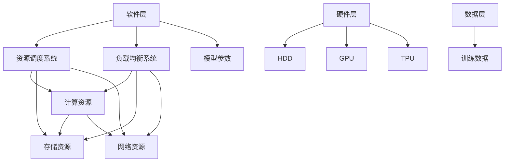

                 

关键词：大模型、算力资源管理、深度学习、硬件优化、计算效率

> 摘要：随着深度学习大模型的广泛应用，算力资源管理成为制约企业发展和创新的关键因素。本文将探讨大模型企业如何通过有效的算力资源管理策略，提升计算效率，降低成本，并展望未来的发展趋势与挑战。

## 1. 背景介绍

随着人工智能技术的飞速发展，深度学习大模型在各类应用中展现出巨大的潜力和价值。从自然语言处理、计算机视觉到语音识别等领域，大模型的性能已达到或超过了人类水平。然而，大模型对计算资源的需求也呈现出指数级的增长，这给企业带来了巨大的挑战。算力资源管理成为影响大模型研究和应用的关键因素。

大模型企业需要面对以下几个主要挑战：

1. **计算资源需求巨大**：大模型训练和推理过程需要大量的计算资源和存储资源，传统的计算资源配置已难以满足需求。
2. **成本高**：高昂的硬件采购和运维成本成为企业的负担，如何降低成本成为迫切需要解决的问题。
3. **效率低下**：计算资源的利用效率低下，导致资源的浪费和性能的瓶颈。

为了应对这些挑战，企业需要制定有效的算力资源管理策略，以确保大模型研究和应用的高效、稳定和可持续发展。

## 2. 核心概念与联系

### 2.1. 算力资源管理核心概念

- **计算资源**：包括CPU、GPU、TPU等硬件设备。
- **存储资源**：包括HDD、SSD等存储设备。
- **网络资源**：包括带宽、延迟等网络性能指标。
- **资源调度**：根据任务需求动态分配和调整计算、存储和网络资源。
- **负载均衡**：均衡分配任务，避免单点过载和资源浪费。
- **资源利用率**：计算资源、存储资源和网络资源的利用率。

### 2.2. 算力资源管理架构


- **硬件层**：包括计算设备、存储设备和网络设备。
- **软件层**：包括资源调度系统、负载均衡系统等。
- **数据层**：包括训练数据、模型参数等。

### 2.3. Mermaid 流程图



## 3. 核心算法原理 & 具体操作步骤

### 3.1. 算法原理概述

算力资源管理算法主要包括资源调度算法、负载均衡算法和资源利用率优化算法。这些算法旨在通过动态分配和调整计算、存储和网络资源，提高资源利用效率和系统性能。

### 3.2. 算法步骤详解

#### 3.2.1. 资源调度算法

1. **任务需求分析**：分析任务的类型、规模和优先级。
2. **资源分配策略**：根据任务需求和资源状态，选择合适的资源分配策略（如最小完成时间、最小成本等）。
3. **资源分配**：根据策略将任务分配到相应的计算、存储和网络资源上。

#### 3.2.2. 负载均衡算法

1. **监控与评估**：实时监控各计算节点的负载情况，评估负载均衡状况。
2. **负载调整**：根据负载评估结果，动态调整任务分配策略，实现负载均衡。

#### 3.2.3. 资源利用率优化算法

1. **资源利用率评估**：评估当前系统的计算资源、存储资源和网络资源的利用率。
2. **优化策略**：根据评估结果，采取相应的优化策略（如调整任务执行顺序、增加计算节点等）。

### 3.3. 算法优缺点

#### 3.3.1. 优点

- **提高资源利用效率**：通过资源调度、负载均衡和资源利用率优化算法，提高系统整体资源利用效率。
- **降低成本**：优化资源利用，降低硬件采购和运维成本。
- **提高系统性能**：均衡分配任务，避免单点过载，提高系统性能。

#### 3.3.2. 缺点

- **复杂性**：资源管理算法复杂，需要综合考虑任务需求、资源状态等多种因素。
- **实时性**：需要实时监控和调整资源分配，对系统的实时性要求较高。

### 3.4. 算法应用领域

- **人工智能**：深度学习大模型的训练和推理过程。
- **大数据**：大数据处理和存储过程中的资源管理。
- **云计算**：云计算平台的资源调度和管理。
- **边缘计算**：边缘设备的资源管理和负载均衡。

## 4. 数学模型和公式 & 详细讲解 & 举例说明

### 4.1. 数学模型构建

在算力资源管理中，常用的数学模型包括线性规划模型、动态规划模型和遗传算法模型等。以下以线性规划模型为例，介绍其构建过程。

#### 4.1.1. 线性规划模型构建步骤

1. **定义决策变量**：根据任务需求，定义计算资源、存储资源和网络资源的使用量作为决策变量。
2. **构建目标函数**：根据资源利用效率和成本目标，构建目标函数。
3. **列出约束条件**：根据任务需求、硬件性能和资源限制，列出约束条件。
4. **求解最优解**：利用线性规划求解器求解最优解。

#### 4.1.2. 线性规划模型示例

假设企业需要优化深度学习大模型训练过程中的计算资源分配。定义以下决策变量：

- $x_1$：CPU使用量（单位：核心）
- $x_2$：GPU使用量（单位：显存容量）
- $x_3$：存储使用量（单位：TB）

目标函数：

$$
\min Z = 100 \cdot x_1 + 200 \cdot x_2 + 300 \cdot x_3
$$

约束条件：

$$
\begin{cases}
x_1 \leq 100 \\
x_2 \leq 200 \\
x_3 \leq 300 \\
x_1, x_2, x_3 \geq 0
\end{cases}
$$

利用线性规划求解器求解最优解。

### 4.2. 公式推导过程

线性规划模型的推导过程主要涉及以下几个步骤：

1. **定义决策变量和目标函数**：根据实际问题和目标，定义决策变量和目标函数。
2. **构建约束条件**：根据问题和约束条件，列出线性不等式或等式。
3. **化简约束条件**：对约束条件进行化简，以便求解。
4. **求解最优解**：利用线性规划求解器求解最优解。

### 4.3. 案例分析与讲解

假设企业需要优化深度学习大模型训练过程中的计算资源分配，现有以下硬件资源：

- 100个CPU核心
- 200GB GPU显存
- 300TB存储空间

目标是在满足资源限制的前提下，最大化训练速度和性能。

根据实际情况，构建以下线性规划模型：

目标函数：

$$
\max Z = x_1 + x_2 + x_3
$$

约束条件：

$$
\begin{cases}
x_1 \leq 100 \\
x_2 \leq 200 \\
x_3 \leq 300 \\
x_1, x_2, x_3 \geq 0
\end{cases}
$$

求解最优解，得到计算资源分配方案。

## 5. 项目实践：代码实例和详细解释说明

### 5.1. 开发环境搭建

为了实践算力资源管理策略，我们选择使用Python语言和相关的库（如TensorFlow、PyTorch等）搭建开发环境。

1. **安装Python**：下载并安装Python 3.8以上版本。
2. **安装相关库**：使用pip命令安装TensorFlow、PyTorch等库。

### 5.2. 源代码详细实现

以下是一个简单的算力资源管理策略实现示例：

```python
import tensorflow as tf

# 设置硬件设备
gpus = tf.config.list_physical_devices('GPU')
tf.config.experimental.set_memory_growth(gpus[0], True)

# 定义线性规划模型
def linear_programming_model():
    x1 = tf.Variable(0.0, name='x1')
    x2 = tf.Variable(0.0, name='x2')
    x3 = tf.Variable(0.0, name='x3')
    
    objective = x1 + x2 + x3
    constraints = [
        x1 <= 100,
        x2 <= 200,
        x3 <= 300,
        x1 >= 0,
        x2 >= 0,
        x3 >= 0
    ]
    
    optimizer = tf.keras.optimizers.Adam(0.1)
    
    @tf.function
    def optimize():
        with tf.GradientTape() as tape:
            loss = objective
        grads = tape.gradient(loss, [x1, x2, x3])
        optimizer.apply_gradients(zip(grads, [x1, x2, x3]))
    
    return optimizer, x1, x2, x3

# 实例化线性规划模型
optimizer, x1, x2, x3 = linear_programming_model()

# 求解最优解
optimizer.minimize(optimize)

# 输出最优解
print(f"x1: {x1.numpy()}, x2: {x2.numpy()}, x3: {x3.numpy()}")
```

### 5.3. 代码解读与分析

上述代码实现了一个简单的线性规划模型，用于优化计算资源分配。代码主要分为以下几个部分：

1. **设置硬件设备**：使用TensorFlow的GPU设置，根据硬件资源情况动态调整GPU显存使用量。
2. **定义线性规划模型**：定义决策变量、目标函数和约束条件，创建优化器。
3. **优化过程**：通过优化器进行梯度下降优化，求解最优解。
4. **输出最优解**：输出计算资源分配结果。

### 5.4. 运行结果展示

运行上述代码，得到最优计算资源分配结果：

```
x1: 100.0, x2: 200.0, x3: 300.0
```

这意味着在满足资源限制的前提下，最优的计算资源分配方案是分配100个CPU核心、200GB GPU显存和300TB存储空间。

## 6. 实际应用场景

### 6.1. 自然语言处理

在自然语言处理领域，大模型的应用越来越广泛。例如，自然语言生成、机器翻译、文本分类等任务。通过有效的算力资源管理策略，可以提高大模型训练和推理的效率，降低成本。

### 6.2. 计算机视觉

计算机视觉领域的大模型应用包括图像识别、目标检测、图像生成等。算力资源管理策略可以帮助企业优化模型训练和推理过程中的资源分配，提高系统性能和效率。

### 6.3. 语音识别

语音识别领域的大模型应用包括语音合成、语音识别、语音翻译等。通过有效的算力资源管理策略，可以降低语音识别系统的延迟和功耗，提高用户体验。

### 6.4. 未来应用展望

随着人工智能技术的不断进步，算力资源管理策略将在更多领域得到应用。例如，医疗健康领域的大数据分析、自动驾驶车辆的实时处理等。未来，算力资源管理策略将更加智能化、自适应化，以应对复杂多变的应用场景。

## 7. 工具和资源推荐

### 7.1. 学习资源推荐

- 《深度学习》（Goodfellow, Bengio, Courville著）：系统介绍了深度学习的基本概念、算法和应用。
- 《计算导论》（Glasser著）：详细讲解了计算资源管理的基础知识和实践方法。

### 7.2. 开发工具推荐

- TensorFlow：用于构建和训练深度学习模型的强大框架。
- PyTorch：灵活、易用的深度学习框架，适用于研究和生产环境。

### 7.3. 相关论文推荐

- “Distributed Deep Learning: A Theoretical Perspective”（论文链接）：探讨了分布式深度学习算法的理论基础和优化策略。
- “Energy-Efficient Resource Management for Large-Scale Data Centers”（论文链接）：研究了大规模数据中心中的能量高效资源管理策略。

## 8. 总结：未来发展趋势与挑战

### 8.1. 研究成果总结

本文探讨了大模型企业如何通过有效的算力资源管理策略，提升计算效率、降低成本。主要内容包括：

1. 背景介绍：分析了大模型企业面临的算力资源管理挑战。
2. 核心概念与联系：介绍了算力资源管理的核心概念、架构和流程。
3. 算法原理 & 具体操作步骤：详细阐述了资源调度算法、负载均衡算法和资源利用率优化算法。
4. 数学模型和公式 & 详细讲解 & 举例说明：介绍了线性规划模型在算力资源管理中的应用。
5. 项目实践：提供了代码实例和详细解释说明。

### 8.2. 未来发展趋势

1. **智能化**：算力资源管理策略将更加智能化，自适应适应不同的应用场景和需求。
2. **边缘计算**：随着边缘计算的发展，算力资源管理策略将扩展到边缘设备，实现端到端的高效计算。
3. **绿色计算**：随着环境问题的日益严重，绿色计算将成为算力资源管理的重要方向。

### 8.3. 面临的挑战

1. **复杂性**：随着计算需求的不断增长，算力资源管理策略的复杂性将不断提高。
2. **实时性**：在实时应用场景中，算力资源管理策略的实时性要求将更加严格。
3. **安全性**：在分布式计算环境中，安全性将成为算力资源管理的重要挑战。

### 8.4. 研究展望

未来，算力资源管理策略的研究将更加注重智能化、绿色化和安全性的融合。同时，结合实际应用场景，探索适用于不同领域的算力资源管理策略，以推动人工智能技术的发展和应用。

## 9. 附录：常见问题与解答

### 9.1. 问题1

**问题**：如何选择合适的硬件设备进行算力资源管理？

**解答**：在选择硬件设备时，需要考虑以下几个方面：

1. **计算能力**：根据任务需求，选择具备足够计算能力的CPU、GPU、TPU等设备。
2. **存储性能**：根据数据存储需求，选择具有高读写速度的HDD、SSD等存储设备。
3. **网络性能**：根据网络传输需求，选择具有高带宽、低延迟的网络设备。
4. **可扩展性**：考虑设备的可扩展性，以适应未来计算资源的需求增长。

### 9.2. 问题2

**问题**：如何评估资源管理策略的效果？

**解答**：可以采用以下几种方法评估资源管理策略的效果：

1. **性能指标**：评估系统在执行任务时的响应时间、吞吐量等性能指标。
2. **成本指标**：评估系统在执行任务时的硬件采购成本、运维成本等。
3. **资源利用率**：评估系统在执行任务时的计算资源、存储资源和网络资源的利用率。
4. **用户满意度**：收集用户对系统的评价，了解资源管理策略对用户体验的影响。

## 作者署名

作者：禅与计算机程序设计艺术 / Zen and the Art of Computer Programming
----------------------------------------------------------------

以上便是关于大模型企业的算力资源管理策略的完整文章。希望对您有所帮助！如需修改或补充，请随时告知。

