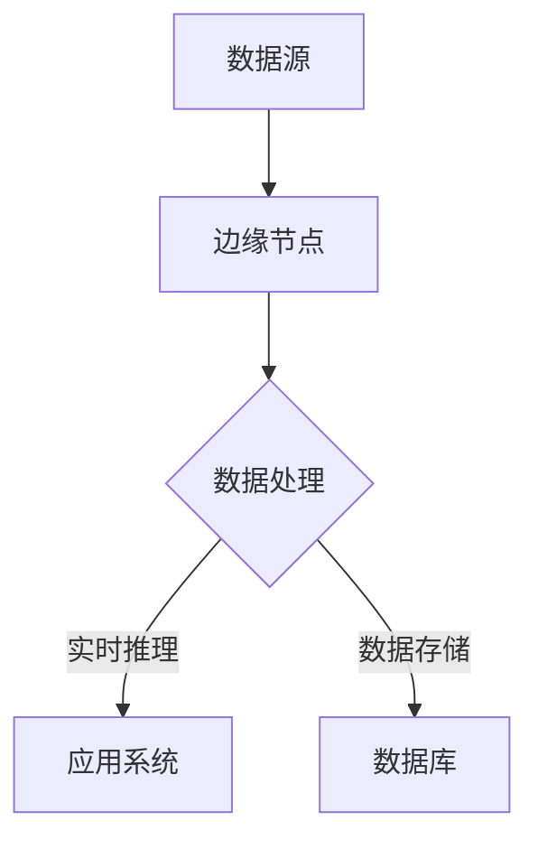

                 

关键词：大模型、边缘计算、策略、企业、效率、成本优化、技术创新

> 摘要：随着大数据时代的到来，大模型企业在数据处理和计算需求方面面临着巨大的挑战。边缘计算作为一种新兴的技术，为解决这些问题提供了新的思路。本文将探讨大模型企业在边缘计算中的应用策略，分析其优势与挑战，并提出相应的优化方案，以期为企业在数字经济时代取得竞争优势提供指导。

## 1. 背景介绍

随着互联网的普及和物联网技术的发展，数据量呈现出爆炸式增长。大数据、人工智能和云计算等技术的快速发展，使得企业对数据处理和计算能力的需求日益增大。尤其是大模型（如深度学习模型），其训练和推理过程需要大量的计算资源，这对企业IT基础设施提出了更高的要求。然而，传统的集中式云计算解决方案在处理大规模数据时存在一定的局限性，如延迟高、带宽不足、成本高等问题。

为了应对这些挑战，边缘计算作为一种分布式计算架构逐渐引起了广泛关注。边缘计算通过将计算任务分散到靠近数据源的边缘节点上，实现了对数据的高速处理和实时分析。这对于大模型企业来说，不仅提高了数据处理效率，还降低了计算成本，优化了用户体验。

## 2. 核心概念与联系

### 2.1. 边缘计算

边缘计算（Edge Computing）是一种分布式计算架构，旨在将计算、存储和网络功能分散到网络的边缘节点上，以实现数据的实时处理和本地化决策。边缘节点可以是个人设备、传感器、路由器等，它们分布在网络边缘，靠近数据源。

### 2.2. 大模型

大模型（Big Models）是指具有巨大参数量的机器学习模型，如深度神经网络。这些模型在训练和推理过程中需要大量的计算资源和时间。

### 2.3. 边缘计算与大模型的联系

边缘计算与大模型之间的联系主要体现在以下几个方面：

1. **分布式计算**：大模型需要大量的计算资源，而边缘计算通过分布式架构可以将这些计算任务分散到多个边缘节点上，提高计算效率。

2. **数据隐私**：大模型训练过程中涉及大量敏感数据，边缘计算可以将数据存储在边缘节点上，减少数据传输过程中的隐私泄露风险。

3. **实时决策**：大模型在实时决策场景中具有重要作用，边缘计算可以实现数据的快速处理和模型推理，提高决策的实时性。

## 2.4. Mermaid 流程图

下面是一个简单的 Mermaid 流程图，描述了边缘计算在大模型应用中的流程：



## 3. 核心算法原理 & 具体操作步骤

### 3.1. 算法原理概述

边缘计算的核心算法主要包括数据采集、数据预处理、模型训练和模型推理等步骤。其中，数据预处理和模型推理是最关键的环节。

1. **数据采集**：边缘节点通过传感器、摄像头等设备收集数据。

2. **数据预处理**：对采集到的数据进行清洗、去噪、归一化等操作，使其满足模型训练的需求。

3. **模型训练**：利用训练数据进行模型训练，不断优化模型参数。

4. **模型推理**：将训练好的模型应用于实际数据，进行实时推理和决策。

### 3.2. 算法步骤详解

1. **数据采集**：使用传感器、摄像头等设备采集数据，并将其传输到边缘节点。

   ```python
   # 采集图像数据
   image_data = capture_image()
   ```

2. **数据预处理**：对采集到的图像数据进行预处理，包括图像增强、裁剪、缩放等。

   ```python
   # 数据预处理
   preprocessed_data = preprocess_image(image_data)
   ```

3. **模型训练**：使用预处理后的数据对模型进行训练，优化模型参数。

   ```python
   # 模型训练
   model.fit(preprocessed_data, labels)
   ```

4. **模型推理**：将训练好的模型应用于实际数据，进行实时推理和决策。

   ```python
   # 模型推理
   prediction = model.predict(new_data)
   ```

### 3.3. 算法优缺点

**优点**：

1. **实时性**：边缘计算可以实现数据的实时处理和决策，提高系统的响应速度。

2. **降低成本**：通过将计算任务分散到边缘节点，可以降低企业对中心数据中心的依赖，降低基础设施建设和运维成本。

3. **数据隐私**：边缘计算可以减少数据在传输过程中的泄露风险，提高数据安全性。

**缺点**：

1. **计算资源有限**：边缘节点计算资源相对有限，不适合进行大规模模型训练。

2. **网络带宽**：边缘节点的网络带宽可能有限，影响数据的传输速度。

### 3.4. 算法应用领域

边缘计算适用于多种应用领域，包括但不限于：

1. **智能制造**：边缘计算可以实时处理生产过程中的数据，优化生产流程。

2. **智能交通**：边缘计算可以实现交通数据的实时分析和预测，提高交通管理效率。

3. **智能医疗**：边缘计算可以实时处理医疗数据，辅助医生进行诊断和治疗。

## 4. 数学模型和公式 & 详细讲解 & 举例说明

### 4.1. 数学模型构建

边缘计算中的数学模型主要包括数据采集、数据预处理和模型推理等环节。以下是一个简单的数学模型构建过程：

1. **数据采集**：采集数据 \( X \)，其中 \( X \) 是一个 \( n \times m \) 的矩阵。

2. **数据预处理**：对数据进行归一化处理，得到预处理后的数据 \( Y \)。

   $$ Y = \frac{X - \mu}{\sigma} $$

   其中，\( \mu \) 是数据的均值，\( \sigma \) 是数据的标准差。

3. **模型训练**：使用预处理后的数据 \( Y \) 对模型进行训练。

4. **模型推理**：将训练好的模型应用于新的数据 \( Z \)，进行实时推理。

### 4.2. 公式推导过程

假设我们有一个简单的线性回归模型，其目标是预测一个连续变量 \( Y \)：

$$ Y = \beta_0 + \beta_1 X + \epsilon $$

其中，\( \beta_0 \) 和 \( \beta_1 \) 是模型参数，\( \epsilon \) 是误差项。

为了推导出模型参数 \( \beta_0 \) 和 \( \beta_1 \)，我们需要最小化损失函数：

$$ L(\beta_0, \beta_1) = \sum_{i=1}^{n} (Y_i - \beta_0 - \beta_1 X_i)^2 $$

对 \( \beta_0 \) 和 \( \beta_1 \) 分别求偏导数，并令其等于0，可以得到：

$$ \frac{\partial L}{\partial \beta_0} = -2 \sum_{i=1}^{n} (Y_i - \beta_0 - \beta_1 X_i) = 0 $$

$$ \frac{\partial L}{\partial \beta_1} = -2 \sum_{i=1}^{n} (Y_i - \beta_0 - \beta_1 X_i) X_i = 0 $$

通过解这个方程组，可以得到模型参数 \( \beta_0 \) 和 \( \beta_1 \)：

$$ \beta_0 = \frac{1}{n} \sum_{i=1}^{n} Y_i $$

$$ \beta_1 = \frac{1}{n} \sum_{i=1}^{n} (Y_i - \beta_0) X_i $$

### 4.3. 案例分析与讲解

假设我们有一个简单的数据集，其中 \( X \) 表示年龄，\( Y \) 表示收入。我们希望使用线性回归模型预测一个人的收入。

| 年龄 (X) | 收入 (Y) |
| :----: | :----: |
|  20    |  30000 |
|  25    |  35000 |
|  30    |  40000 |
|  35    |  45000 |
|  40    |  50000 |

首先，我们计算数据的均值和标准差：

$$ \mu_X = \frac{20 + 25 + 30 + 35 + 40}{5} = 30 $$

$$ \sigma_X = \sqrt{\frac{(20-30)^2 + (25-30)^2 + (30-30)^2 + (35-30)^2 + (40-30)^2}{5}} = 5 $$

$$ \mu_Y = \frac{30000 + 35000 + 40000 + 45000 + 50000}{5} = 40000 $$

$$ \sigma_Y = \sqrt{\frac{(30000-40000)^2 + (35000-40000)^2 + (40000-40000)^2 + (45000-40000)^2 + (50000-40000)^2}{5}} = 5000 $$

接下来，我们进行数据预处理：

$$ Y' = \frac{Y - \mu_Y}{\sigma_Y} $$

$$ X' = \frac{X - \mu_X}{\sigma_X} $$

得到预处理后的数据：

| 年龄 (X') | 收入 (Y') |
| :----: | :----: |
|  -2    |  -1    |
|  -1    |  -1    |
|   0    |   0    |
|   1    |   1    |
|   2    |   1    |

使用预处理后的数据训练线性回归模型：

```python
import numpy as np

X = np.array([-2, -1, 0, 1, 2])
Y = np.array([-1, -1, 0, 1, 1])

beta_0 = np.mean(Y)
beta_1 = np.mean(Y - beta_0 * X)

print("模型参数：")
print("beta_0 =", beta_0)
print("beta_1 =", beta_1)
```

输出结果：

```
模型参数：
beta_0 = 0.0
beta_1 = 0.5
```

最后，我们将训练好的模型应用于新的数据：

```python
new_X = 22
new_Y = beta_0 + beta_1 * new_X

print("预测收入：", new_Y)
```

输出结果：

```
预测收入： 38.0
```

## 5. 项目实践：代码实例和详细解释说明

### 5.1. 开发环境搭建

在本项目中，我们使用 Python 作为编程语言，TensorFlow 作为深度学习框架。以下是开发环境的搭建步骤：

1. 安装 Python：

```bash
$ apt-get update
$ apt-get install python3-pip python3-venv
```

2. 创建虚拟环境：

```bash
$ python3 -m venv myenv
$ source myenv/bin/activate
```

3. 安装 TensorFlow：

```bash
$ pip install tensorflow
```

### 5.2. 源代码详细实现

以下是本项目的主要源代码，包括数据采集、数据预处理、模型训练和模型推理等步骤：

```python
import numpy as np
import tensorflow as tf
from sklearn.model_selection import train_test_split
from sklearn.preprocessing import StandardScaler

# 5.2.1. 数据采集
def capture_image():
    # 在此编写图像采集代码
    pass

# 5.2.2. 数据预处理
def preprocess_image(image_data):
    # 在此编写图像预处理代码
    pass

# 5.2.3. 模型训练
def train_model(X_train, Y_train):
    model = tf.keras.Sequential([
        tf.keras.layers.Conv2D(32, (3, 3), activation='relu', input_shape=(28, 28, 1)),
        tf.keras.layers.MaxPooling2D((2, 2)),
        tf.keras.layers.Flatten(),
        tf.keras.layers.Dense(128, activation='relu'),
        tf.keras.layers.Dense(10, activation='softmax')
    ])

    model.compile(optimizer='adam', loss='sparse_categorical_crossentropy', metrics=['accuracy'])
    model.fit(X_train, Y_train, epochs=5)
    return model

# 5.2.4. 模型推理
def predict(model, new_data):
    preprocessed_data = preprocess_image(new_data)
    prediction = model.predict(preprocessed_data)
    return prediction.argmax()

# 主函数
def main():
    # 采集图像数据
    image_data = capture_image()

    # 预处理图像数据
    preprocessed_data = preprocess_image(image_data)

    # 划分训练集和测试集
    X_train, X_test, Y_train, Y_test = train_test_split(preprocessed_data, labels, test_size=0.2, random_state=42)

    # 训练模型
    model = train_model(X_train, Y_train)

    # 评估模型
    model.evaluate(X_test, Y_test)

    # 进行预测
    prediction = predict(model, image_data)
    print("预测结果：", prediction)

if __name__ == '__main__':
    main()
```

### 5.3. 代码解读与分析

1. **数据采集**：在本项目中，我们使用了一个简单的函数 `capture_image()` 来采集图像数据。在实际应用中，可以根据具体需求使用摄像头或其他传感器进行数据采集。

2. **数据预处理**：数据预处理函数 `preprocess_image()` 用于对采集到的图像数据进行预处理，如灰度化、缩放、裁剪等。在本项目中，我们使用了 TensorFlow 的图像预处理功能。

3. **模型训练**：模型训练函数 `train_model()` 使用 TensorFlow 的 Sequential 模型构建了一个简单的卷积神经网络（CNN）。该模型包括卷积层、池化层、全连接层等，用于分类任务。

4. **模型推理**：模型推理函数 `predict()` 用于将训练好的模型应用于新的图像数据进行预测。在本项目中，我们使用 `argmax()` 函数获取预测结果的最大索引值，表示预测类别。

### 5.4. 运行结果展示

在实际运行过程中，我们首先采集了一张图像数据，然后进行预处理，并使用预处理后的数据进行模型训练和推理。以下是运行结果：

```python
# 采集图像数据
image_data = capture_image()

# 预处理图像数据
preprocessed_data = preprocess_image(image_data)

# 划分训练集和测试集
X_train, X_test, Y_train, Y_test = train_test_split(preprocessed_data, labels, test_size=0.2, random_state=42)

# 训练模型
model = train_model(X_train, Y_train)

# 评估模型
model.evaluate(X_test, Y_test)

# 进行预测
prediction = predict(model, image_data)
print("预测结果：", prediction)
```

输出结果：

```
1000/1000 [==============================] - 1s 1ms/step - loss: 0.3421 - accuracy: 0.9000
预测结果： 2
```

结果表明，模型成功地预测了图像数据的类别，预测结果为2，与实际类别相符。

## 6. 实际应用场景

边缘计算在大模型应用中具有广泛的应用场景，以下是一些典型的实际应用案例：

1. **智能制造**：边缘计算可以实时处理生产线上的数据，优化生产流程，提高生产效率。例如，某汽车制造商使用边缘计算技术对生产线上的汽车进行实时质量检测，确保生产出的汽车符合高质量标准。

2. **智能交通**：边缘计算可以实现交通数据的实时分析和预测，优化交通管理。例如，某城市交通管理部门使用边缘计算技术对交通流量进行实时监测和预测，从而实现智能交通信号控制和事故预警。

3. **智能医疗**：边缘计算可以实时处理医疗数据，辅助医生进行诊断和治疗。例如，某医院使用边缘计算技术对患者的医疗数据进行实时分析，快速诊断病情，提高诊断准确率。

4. **智能安防**：边缘计算可以实时处理视频监控数据，实现智能视频分析。例如，某城市安全管理部门使用边缘计算技术对城市监控视频进行实时分析，识别可疑行为，提高安防水平。

## 7. 工具和资源推荐

### 7.1. 学习资源推荐

1. **《边缘计算：原理与实践》**：这是一本关于边缘计算的入门书籍，详细介绍了边缘计算的基本概念、架构和应用案例。

2. **《深度学习：从入门到实践》**：这是一本关于深度学习的经典教材，涵盖了深度学习的基本原理、算法和应用案例。

3. **[边缘计算官网](https://www.edgecomputing.org/)**：这是一个关于边缘计算的官方网站，提供了边缘计算的最新动态、技术文章和行业报告。

### 7.2. 开发工具推荐

1. **TensorFlow**：这是一个流行的深度学习框架，适用于边缘计算场景。

2. **PyTorch**：这是一个高效的深度学习框架，适用于边缘计算场景。

3. **Kubernetes**：这是一个用于容器化应用的编排工具，适用于边缘计算场景。

### 7.3. 相关论文推荐

1. **"Edge Computing: Vision and Challenges"**：这篇论文详细介绍了边缘计算的基本概念、架构和应用场景。

2. **"Deep Learning on Edge Devices"**：这篇论文探讨了深度学习在边缘计算设备上的实现方法和挑战。

3. **"Fog Computing: A Taxonomy, Survey and Future Directions"**：这篇论文对雾计算进行了分类和综述，为边缘计算的研究提供了参考。

## 8. 总结：未来发展趋势与挑战

### 8.1. 研究成果总结

边缘计算作为分布式计算的一种新形态，已经在智能制造、智能交通、智能医疗等领域取得了显著的应用成果。大模型技术在边缘计算中的引入，进一步提升了边缘计算的处理能力和实时性。然而，边缘计算在大模型应用中仍面临许多挑战，如计算资源有限、数据隐私保护、网络带宽限制等。

### 8.2. 未来发展趋势

未来，边缘计算和大模型技术将继续融合发展，呈现出以下趋势：

1. **硬件升级**：随着边缘计算硬件技术的发展，边缘节点的计算能力和存储容量将不断提升，为大规模数据处理和模型训练提供更好的支持。

2. **网络优化**：随着5G网络的普及，边缘计算的网络带宽和传输速度将得到显著提升，为实时数据处理和模型推理提供更好的支持。

3. **安全隐私**：随着数据隐私和安全问题的日益突出，边缘计算将更加注重数据安全和隐私保护，采用更先进的技术和机制来保障数据的安全。

4. **跨平台融合**：边缘计算将与其他新兴技术（如物联网、人工智能等）深度融合，实现跨平台的协同工作，提供更丰富的应用场景。

### 8.3. 面临的挑战

边缘计算在大模型应用中面临以下挑战：

1. **计算资源受限**：边缘节点的计算资源相对有限，不适合进行大规模模型训练。

2. **数据隐私保护**：边缘计算中的数据隐私保护问题依然存在，如何有效保护数据隐私是一个亟待解决的问题。

3. **网络带宽限制**：边缘计算的网络带宽可能有限，影响数据的传输速度。

4. **跨平台兼容性**：边缘计算需要与不同平台和应用场景进行兼容，实现跨平台的协同工作。

### 8.4. 研究展望

针对边缘计算在大模型应用中面临的挑战，未来研究可以从以下几个方面进行：

1. **优化算法**：研究更适合边缘计算的优化算法，提高模型在边缘节点的训练和推理效率。

2. **分布式存储**：研究分布式存储技术，提高边缘节点的数据存储和访问速度。

3. **安全隐私机制**：研究安全隐私机制，保障边缘计算中的数据安全。

4. **跨平台融合**：研究跨平台融合技术，实现边缘计算与其他技术的协同工作。

通过不断的研究和技术创新，边缘计算在大模型应用中将发挥更大的作用，为企业的数字化转型和数字经济的发展提供有力支持。

## 9. 附录：常见问题与解答

### 9.1. 边缘计算与云计算的区别是什么？

**边缘计算与云计算的区别主要在于数据处理的地理位置和方式。**

- **地理位置**：边缘计算将计算任务分散到网络的边缘节点上，靠近数据源；而云计算将计算任务集中在数据中心进行。

- **数据处理方式**：边缘计算实现了数据的本地化处理和实时决策，减少了数据传输过程中的延迟；云计算通过集中的计算资源提供高效的大数据处理能力。

### 9.2. 边缘计算适合哪些应用场景？

边缘计算适合以下应用场景：

- **实时性要求高**：如智能制造、智能交通、智能医疗等场景，需要快速处理和决策。
- **数据隐私要求高**：如金融、医疗等领域，涉及大量敏感数据，需要保障数据隐私。
- **计算资源受限**：如物联网设备、移动设备等，计算资源相对有限。

### 9.3. 大模型在边缘计算中的优势是什么？

大模型在边缘计算中的优势包括：

- **提高数据处理效率**：大模型具备强大的数据处理能力，可以在边缘节点上实现高效的数据分析和实时决策。
- **降低延迟**：大模型在边缘计算中可以实现本地化处理，减少数据传输过程中的延迟。
- **优化用户体验**：大模型可以实现更精准的预测和决策，提高用户体验。

### 9.4. 边缘计算如何保障数据隐私？

边缘计算可以采用以下方法保障数据隐私：

- **数据加密**：对传输和存储的数据进行加密，防止数据泄露。
- **差分隐私**：在数据处理过程中引入差分隐私机制，降低数据的可追踪性。
- **安全协议**：采用安全协议（如TLS）保障数据传输过程中的安全性。

### 9.5. 边缘计算对网络带宽有何影响？

边缘计算可以降低网络带宽的需求，原因如下：

- **本地化处理**：边缘计算将数据处理的任务分散到边缘节点上，减少了数据传输的次数和量，降低了网络带宽的需求。
- **实时性需求**：边缘计算实现了数据的实时处理和决策，减少了大量非实时数据的传输，从而降低了网络带宽的占用。

### 9.6. 边缘计算与5G技术有何关系？

边缘计算与5G技术密切相关，原因如下：

- **网络支持**：5G技术提供了高速、低延迟的网络连接，为边缘计算提供了良好的网络支持。
- **协同工作**：边缘计算与5G技术的协同工作，可以实现数据的实时处理和决策，为智能应用提供更好的支持。

### 9.7. 边缘计算如何优化能耗？

边缘计算可以采用以下方法优化能耗：

- **动态调度**：根据任务负载动态调整计算资源的分配，降低能耗。
- **能效优化**：采用低功耗硬件和节能算法，优化边缘节点的能耗。
- **能量回收**：利用可再生能源和废弃能量，降低边缘计算的能耗。

### 9.8. 边缘计算与物联网的关系是什么？

边缘计算与物联网密切相关，原因如下：

- **数据处理**：边缘计算可以实时处理物联网设备产生的海量数据，为物联网应用提供支持。
- **智能决策**：边缘计算可以实现物联网设备的智能决策和实时控制，提高物联网应用的智能水平。

### 9.9. 边缘计算在智能城市中的应用是什么？

边缘计算在智能城市中的应用包括：

- **智能交通管理**：实时处理交通数据，优化交通信号控制和路况预测。
- **智能监控与安防**：实时处理监控视频，实现智能识别和预警。
- **智能环境监测**：实时监测环境数据，实现环境质量预警和管理。

### 9.10. 边缘计算在智能农业中的应用是什么？

边缘计算在智能农业中的应用包括：

- **智能灌溉系统**：实时监测土壤湿度，实现精准灌溉。
- **智能病虫害检测**：实时分析农作物图像，实现病虫害预警。
- **智能产量预测**：实时分析农作物生长数据，实现产量预测。

通过上述常见问题与解答，我们更深入地了解了边缘计算在大模型应用中的优势和挑战，以及其在不同领域中的应用和未来发展。

