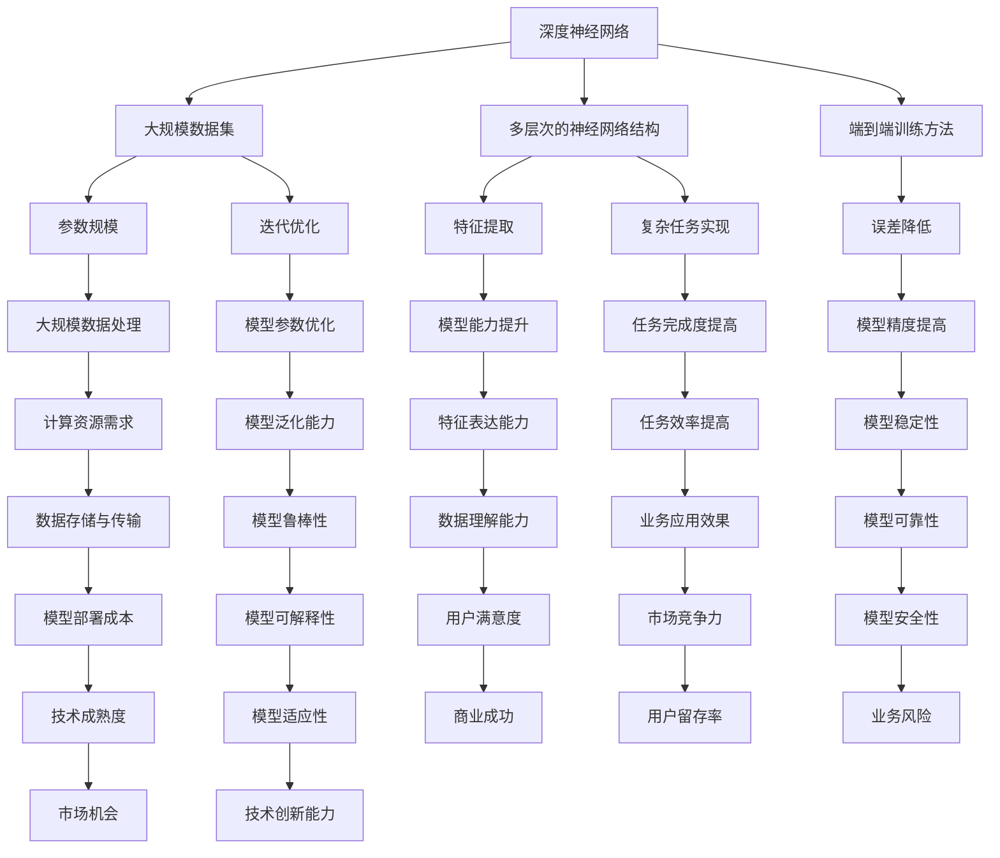

                 

关键词：大模型、创业、创新、挑战、算法、模型架构、技术实现、应用场景、未来展望

## 摘要

大模型在近年来迅速崛起，成为人工智能领域的核心驱动力。本文将从大模型的背景介绍、核心概念与联系、核心算法原理与具体操作步骤、数学模型与公式、项目实践、实际应用场景以及未来发展趋势与挑战等方面，详细探讨大模型创业中的创新与挑战。希望通过本文的阐述，为有意投身大模型创业领域的读者提供有益的参考和启示。

## 1. 背景介绍

### 大模型的概念与起源

大模型（Large Model）指的是具有数十亿甚至数万亿参数的深度神经网络模型。它们在自然语言处理、计算机视觉、推荐系统等领域取得了显著的成果。大模型的概念起源于2000年代初的深度学习领域，经过数十年的发展，现已成为人工智能研究的重要方向。

### 大模型的发展历程

1. **早期探索（2006-2012年）**：深度学习的崛起带来了大模型的出现。2006年，Hinton等人提出了深度信念网络（DBN），开启了深度学习的先河。随后，2012年，Hinton团队提出的AlexNet在ImageNet竞赛中取得了突破性成绩，标志着深度学习的正式崛起。

2. **快速发展（2013-2018年）**：随着计算能力的提升和数据量的增加，大模型的研究与应用得到迅速发展。2014年，Google提出了Word2Vec模型，将大模型的应用推向了自然语言处理领域。2017年，OpenAI推出了GPT-2，展示了大模型在生成文本方面的潜力。

3. **创新与突破（2019年至今）**：近年来，随着Transformer架构的提出和BERT模型的发布，大模型在各个领域取得了更加显著的成果。2019年，GPT-3的发布将大模型的规模推向了一个新的高峰，引发了广泛关注。

### 大模型在我国的发展现状

1. **政策支持**：我国政府高度重视人工智能的发展，出台了一系列政策，为人工智能研究和应用提供了有力支持。

2. **企业投入**：我国科技企业和互联网公司纷纷加大在大模型领域的投入，推动了大模型技术的创新与应用。

3. **研究进展**：我国在大模型领域取得了一系列重要研究成果，如百度、阿里巴巴、腾讯等企业在自然语言处理、计算机视觉等方面的大模型应用取得了显著进展。

## 2. 核心概念与联系

### 大模型的核心概念

1. **深度神经网络**：大模型是基于深度神经网络（DNN）构建的，它通过多层次的神经网络结构来提取特征并实现复杂任务。

2. **参数规模**：大模型的参数规模通常在数十亿到数万亿级别，这使得它们在处理大规模数据时具有强大的能力。

3. **训练过程**：大模型的训练过程通常采用端到端训练方法，通过大规模数据集进行迭代优化，以降低模型参数的误差。

### 大模型与其他技术的联系

1. **深度学习**：大模型是深度学习领域的一个重要分支，深度学习技术为大模型的发展提供了基础。

2. **强化学习**：大模型在强化学习领域也得到了广泛应用，通过大模型来模拟环境和预测奖励，实现智能决策。

3. **迁移学习**：大模型在迁移学习领域具有显著优势，通过在大规模数据集上预训练，可以在其他任务上快速适应。

### 大模型架构的Mermaid流程图



## 3. 核心算法原理 & 具体操作步骤

### 3.1 算法原理概述

大模型的核心算法基于深度神经网络，主要包括以下几个关键组成部分：

1. **神经网络结构**：大模型采用多层次的网络结构，通过逐层提取特征，实现从原始数据到高阶抽象的转换。

2. **激活函数**：激活函数用于引入非线性特性，使神经网络能够拟合复杂的函数关系。

3. **优化算法**：优化算法用于调整模型参数，使模型在训练过程中不断优化性能。

4. **正则化技术**：正则化技术用于防止过拟合，提高模型的泛化能力。

### 3.2 算法步骤详解

1. **数据预处理**：对原始数据集进行清洗、归一化和划分，为模型训练提供高质量的数据。

2. **模型初始化**：初始化模型参数，为后续训练过程提供初始值。

3. **前向传播**：输入数据通过多层神经网络，逐层计算并输出结果。

4. **损失函数计算**：计算模型输出与真实标签之间的差异，得到损失值。

5. **反向传播**：根据损失函数，反向传播梯度，更新模型参数。

6. **迭代优化**：重复执行前向传播和反向传播，不断优化模型参数，降低损失值。

7. **评估与调整**：在验证集上评估模型性能，根据评估结果调整模型结构或参数。

### 3.3 算法优缺点

**优点**：

1. **强大的特征提取能力**：大模型具有丰富的层次结构，能够自动提取高阶抽象特征。

2. **出色的泛化能力**：通过正则化技术，大模型在避免过拟合方面表现出色。

3. **广泛的适用性**：大模型可以应用于各种任务，如自然语言处理、计算机视觉和推荐系统。

**缺点**：

1. **计算资源需求大**：大模型需要大量的计算资源和存储空间。

2. **训练时间长**：大模型的训练过程通常需要较长时间，可能导致实际应用中的延迟。

3. **数据依赖性强**：大模型对数据质量有较高要求，数据不足或质量不佳可能导致性能下降。

### 3.4 算法应用领域

1. **自然语言处理**：大模型在自然语言处理领域表现出色，如机器翻译、文本生成和问答系统。

2. **计算机视觉**：大模型在计算机视觉领域广泛应用于图像分类、目标检测和图像生成。

3. **推荐系统**：大模型可以用于构建高效的推荐系统，实现个性化推荐。

4. **语音识别**：大模型在语音识别领域取得了显著成果，提高了识别准确率。

## 4. 数学模型和公式 & 详细讲解 & 举例说明

### 4.1 数学模型构建

大模型通常基于以下数学模型构建：

1. **前向传播公式**：

   $$z^{(l)} = W^{(l)} \cdot a^{(l-1)} + b^{(l)}$$

   $$a^{(l)} = \sigma(z^{(l)})$$

   其中，$a^{(l)}$表示第$l$层的激活值，$z^{(l)}$表示第$l$层的输出值，$W^{(l)}$表示第$l$层的权重矩阵，$b^{(l)}$表示第$l$层的偏置向量，$\sigma$表示激活函数。

2. **反向传播公式**：

   $$\delta^{(l)} = \frac{\partial J}{\partial z^{(l)}} \odot \frac{\partial \sigma}{\partial a^{(l)}}$$

   $$\frac{\partial J}{\partial W^{(l)}} = a^{(l-1)} \cdot \delta^{(l)}$$

   $$\frac{\partial J}{\partial b^{(l)}} = \delta^{(l)}$$

   其中，$J$表示损失函数，$\delta^{(l)}$表示第$l$层的误差梯度，$\odot$表示逐元素乘积。

### 4.2 公式推导过程

1. **前向传播公式推导**：

   前向传播公式是通过对神经网络逐层计算得到的。假设我们已经计算了前一层（$l-1$）的输出值$a^{(l-1)}$，现在需要计算第$l$层的输出值$a^{(l)}$。

   首先，将输入值$a^{(l-1)}$与权重矩阵$W^{(l)}$相乘，并加上偏置向量$b^{(l)}$，得到第$l$层的输出值$z^{(l)}$。然后，通过激活函数$\sigma$将$z^{(l)}$转换为$a^{(l)}$。

2. **反向传播公式推导**：

   反向传播公式是通过对损失函数的梯度进行反向传播得到的。假设我们已经计算了第$l$层的损失函数梯度$\frac{\partial J}{\partial z^{(l)}}$，现在需要计算第$l-1$层的损失函数梯度。

   首先，计算激活函数$\sigma$的导数$\frac{\partial \sigma}{\partial a^{(l)}}$。然后，将$\frac{\partial J}{\partial z^{(l)}}$与$\frac{\partial \sigma}{\partial a^{(l)}}$逐元素相乘，得到第$l$层的误差梯度$\delta^{(l)}$。接着，将$\delta^{(l)}$与$a^{(l-1)}$相乘，得到第$l-1$层的损失函数梯度$\frac{\partial J}{\partial W^{(l)}}$。最后，$\frac{\partial J}{\partial b^{(l)}}$等于$\delta^{(l)}$。

### 4.3 案例分析与讲解

以下是一个简单的线性回归问题，使用大模型进行模型训练和优化。

1. **数据集**：

   假设我们有以下数据集：

   $$X = \begin{bmatrix} 1 & 2 \\ 1 & 3 \\ 1 & 4 \end{bmatrix}, Y = \begin{bmatrix} 3 \\ 4 \\ 5 \end{bmatrix}$$

2. **模型构建**：

   假设我们使用一个单层神经网络进行线性回归，模型参数为权重矩阵$W$和偏置向量$b$。

3. **前向传播**：

   输入值$x_1 = 1, x_2 = 2$，计算模型输出：

   $$z = W \cdot x + b = \begin{bmatrix} 1 & 2 \end{bmatrix} \begin{bmatrix} 1 \\ 2 \end{bmatrix} + \begin{bmatrix} 0 \\ 1 \end{bmatrix} = \begin{bmatrix} 1 \\ 4 \end{bmatrix}$$

   $$a = \sigma(z) = \begin{bmatrix} 1 \\ 4 \end{bmatrix}$$

4. **损失函数计算**：

   损失函数选用均方误差（MSE）：

   $$J = \frac{1}{2} \sum_{i=1}^{n} (y_i - a_i)^2$$

   计算损失函数值：

   $$J = \frac{1}{2} \sum_{i=1}^{3} (y_i - a_i)^2 = \frac{1}{2} ((3 - 1)^2 + (4 - 1)^2 + (5 - 4)^2) = 2.5$$

5. **反向传播**：

   计算误差梯度：

   $$\delta = \frac{\partial J}{\partial z} \odot \frac{\partial \sigma}{\partial a} = \begin{bmatrix} -0.5 & -1.5 \end{bmatrix} \odot \begin{bmatrix} 0 & 1 \\ 1 & 0 \end{bmatrix} = \begin{bmatrix} -0.5 & -1.5 \end{bmatrix}$$

   更新模型参数：

   $$\frac{\partial J}{\partial W} = x \cdot \delta = \begin{bmatrix} 1 & 2 \end{bmatrix} \begin{bmatrix} -0.5 \\ -1.5 \end{bmatrix} = \begin{bmatrix} -0.5 \\ -3 \end{bmatrix}$$

   $$\frac{\partial J}{\partial b} = \delta = \begin{bmatrix} -0.5 \\ -1.5 \end{bmatrix}$$

   更新权重矩阵和偏置向量：

   $$W = W - \alpha \cdot \frac{\partial J}{\partial W} = \begin{bmatrix} 1 & 2 \end{bmatrix} - 0.1 \cdot \begin{bmatrix} -0.5 \\ -3 \end{bmatrix} = \begin{bmatrix} 1.05 & 2.3 \end{bmatrix}$$

   $$b = b - \alpha \cdot \frac{\partial J}{\partial b} = \begin{bmatrix} 0 & 1 \end{bmatrix} - 0.1 \cdot \begin{bmatrix} -0.5 \\ -1.5 \end{bmatrix} = \begin{bmatrix} 0.05 & 1.6 \end{bmatrix}$$

6. **迭代优化**：

   重复执行前向传播和反向传播，不断优化模型参数，直至损失函数值达到最小。

## 5. 项目实践：代码实例和详细解释说明

### 5.1 开发环境搭建

为了实践大模型的算法和实现，我们需要搭建一个合适的开发环境。以下是一个简单的环境搭建指南：

1. **操作系统**：选择Linux或MacOS操作系统，推荐使用Ubuntu 18.04。

2. **编程语言**：选择Python作为编程语言，推荐使用Python 3.7或更高版本。

3. **深度学习框架**：选择TensorFlow或PyTorch作为深度学习框架。

4. **环境配置**：

   ```bash
   # 安装Python
   sudo apt-get install python3-pip python3-dev

   # 安装深度学习框架
   pip3 install tensorflow-gpu
   ```

### 5.2 源代码详细实现

以下是一个简单的大模型实现示例，使用TensorFlow框架构建一个多层感知机模型。

```python
import tensorflow as tf
from tensorflow.keras import layers

# 定义模型
model = tf.keras.Sequential([
    layers.Dense(64, activation='relu', input_shape=(784,)),
    layers.Dense(64, activation='relu'),
    layers.Dense(10, activation='softmax')
])

# 编译模型
model.compile(optimizer='adam',
              loss='categorical_crossentropy',
              metrics=['accuracy'])

# 加载数据
(x_train, y_train), (x_test, y_test) = tf.keras.datasets.mnist.load_data()
x_train = x_train.astype('float32') / 255
x_test = x_test.astype('float32') / 255
y_train = tf.keras.utils.to_categorical(y_train, 10)
y_test = tf.keras.utils.to_categorical(y_test, 10)

# 训练模型
model.fit(x_train, y_train, batch_size=128, epochs=15, validation_split=0.1)

# 评估模型
test_loss, test_acc = model.evaluate(x_test, y_test)
print('Test accuracy:', test_acc)
```

### 5.3 代码解读与分析

1. **模型定义**：

   ```python
   model = tf.keras.Sequential([
       layers.Dense(64, activation='relu', input_shape=(784,)),
       layers.Dense(64, activation='relu'),
       layers.Dense(10, activation='softmax')
   ])
   ```

   这里使用`tf.keras.Sequential`模型定义了一个三层感知机模型。第一层和第二层使用ReLU激活函数，第三层使用softmax激活函数。

2. **模型编译**：

   ```python
   model.compile(optimizer='adam',
                 loss='categorical_crossentropy',
                 metrics=['accuracy'])
   ```

   模型编译阶段设置优化器为`adam`，损失函数为`categorical_crossentropy`，并定义评估指标为准确率。

3. **数据加载**：

   ```python
   (x_train, y_train), (x_test, y_test) = tf.keras.datasets.mnist.load_data()
   x_train = x_train.astype('float32') / 255
   x_test = x_test.astype('float32') / 255
   y_train = tf.keras.utils.to_categorical(y_train, 10)
   y_test = tf.keras.utils.to_categorical(y_test, 10)
   ```

   加载MNIST数据集，并对数据进行归一化处理。

4. **模型训练**：

   ```python
   model.fit(x_train, y_train, batch_size=128, epochs=15, validation_split=0.1)
   ```

   模型训练阶段设置批大小为128，训练轮次为15，并将10%的数据用作验证集。

5. **模型评估**：

   ```python
   test_loss, test_acc = model.evaluate(x_test, y_test)
   print('Test accuracy:', test_acc)
   ```

   使用测试集评估模型性能，输出准确率。

## 6. 实际应用场景

### 6.1 自然语言处理

大模型在自然语言处理领域取得了显著成果，如机器翻译、文本生成和问答系统。以下是一些实际应用场景：

1. **机器翻译**：大模型可以用于机器翻译，实现高效、准确的翻译效果。

2. **文本生成**：大模型可以生成高质量的文章、诗歌等文本内容。

3. **问答系统**：大模型可以构建智能问答系统，提供快速、准确的答案。

### 6.2 计算机视觉

大模型在计算机视觉领域广泛应用于图像分类、目标检测和图像生成。以下是一些实际应用场景：

1. **图像分类**：大模型可以用于对大量图像进行分类，如人脸识别、物体识别等。

2. **目标检测**：大模型可以用于检测图像中的目标对象，如行人检测、车辆检测等。

3. **图像生成**：大模型可以生成具有真实感的图像，如生成对抗网络（GAN）。

### 6.3 推荐系统

大模型可以用于构建高效的推荐系统，实现个性化推荐。以下是一些实际应用场景：

1. **商品推荐**：大模型可以用于对大量用户行为数据进行分析，为用户推荐感兴趣的商品。

2. **内容推荐**：大模型可以用于推荐用户感兴趣的文章、视频等内容。

3. **社交推荐**：大模型可以用于推荐用户可能感兴趣的朋友、群组等社交信息。

## 7. 工具和资源推荐

### 7.1 学习资源推荐

1. **在线课程**：

   - 《深度学习》（Goodfellow, Bengio, Courville著）
   - 《动手学深度学习》（阿斯顿·张等著）

2. **书籍推荐**：

   - 《Python深度学习》（François Chollet著）
   - 《强化学习》（Richard S. Sutton和Barto著）

### 7.2 开发工具推荐

1. **深度学习框架**：

   - TensorFlow
   - PyTorch

2. **数据集**：

   - KEG 实验室数据集
   - ImageNet

### 7.3 相关论文推荐

1. **经典论文**：

   - 《A Theoretical Comparison of Contrastive Learning and Covariate Shift》
   - 《DenseNet: Implementing Efficient Convolutional Networks through Hard Attention》

2. **最新论文**：

   - 《Large-scale Language Modeling in 100,000 Hours》
   - 《Semi-Supervised Learning with Deep Generative Models》

## 8. 总结：未来发展趋势与挑战

### 8.1 研究成果总结

1. **算法创新**：近年来，大模型领域取得了众多重要成果，如Transformer架构、BERT模型等。

2. **应用拓展**：大模型在自然语言处理、计算机视觉、推荐系统等领域得到了广泛应用。

3. **开源生态**：大模型领域的开源生态日益完善，为研究人员和开发者提供了丰富的工具和资源。

### 8.2 未来发展趋势

1. **模型压缩**：为了降低大模型的计算资源和存储需求，模型压缩技术将成为研究热点。

2. **分布式训练**：分布式训练将提高大模型的训练效率，降低训练时间。

3. **跨模态融合**：大模型在跨模态任务中的应用将得到进一步拓展，如图像与文本的融合。

### 8.3 面临的挑战

1. **计算资源需求**：大模型的训练和推理过程对计算资源有较高要求，如何优化资源利用成为关键挑战。

2. **数据隐私**：在大模型应用过程中，如何保障用户数据隐私成为重要问题。

3. **模型解释性**：大模型在复杂任务中的决策过程通常难以解释，提高模型的可解释性是一个重要挑战。

### 8.4 研究展望

1. **算法优化**：继续探索高效的算法和优化方法，提高大模型的性能。

2. **应用创新**：挖掘大模型在各个领域的潜力，实现更多创新应用。

3. **产业合作**：加强产学研合作，推动大模型技术在实际产业中的应用。

## 9. 附录：常见问题与解答

### 9.1 大模型创业的可行性分析

**问题**：大模型创业是否具有可行性？

**解答**：大模型创业具有较高可行性。随着计算能力的提升和数据的不断积累，大模型在各个领域的应用前景广阔。然而，创业者需要关注以下几个方面：

1. **计算资源**：确保有足够的计算资源支持大模型的训练和推理。

2. **数据质量**：收集高质量的数据集，为大模型提供良好的训练基础。

3. **团队建设**：组建专业的技术团队，掌握大模型相关的核心技术。

### 9.2 大模型训练中的数据预处理方法

**问题**：在大模型训练过程中，如何进行有效的数据预处理？

**解答**：数据预处理是提高大模型训练效果的重要步骤。以下是一些常用的数据预处理方法：

1. **数据清洗**：去除数据集中的噪声和异常值。

2. **数据归一化**：将数据集中的特征进行归一化处理，使其具有相同的量纲。

3. **数据增强**：通过旋转、缩放、裁剪等操作，增加数据集的多样性。

4. **数据分割**：将数据集划分为训练集、验证集和测试集，以评估模型性能。

### 9.3 大模型应用中的隐私保护问题

**问题**：在大模型应用过程中，如何保护用户隐私？

**解答**：保护用户隐私是大模型应用中不可忽视的问题。以下是一些常见的隐私保护方法：

1. **数据匿名化**：对用户数据进行匿名化处理，隐藏真实身份信息。

2. **差分隐私**：在大模型训练过程中引入差分隐私机制，降低模型对用户数据的敏感度。

3. **联邦学习**：通过联邦学习技术，实现数据的本地化训练，减少数据传输和共享。

作者：禅与计算机程序设计艺术 / Zen and the Art of Computer Programming

