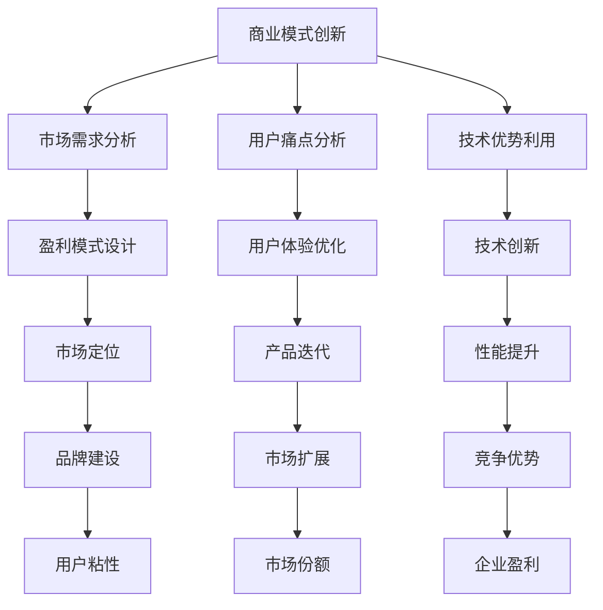

                 

### 关键词 Keyword

- 大模型
- 创业
- 商业模式
- 技术创新
- 艺术与科学

### 摘要 Abstract

本文探讨了在大模型时代背景下，创业者的商业模式选择和科技创新路径。通过对大模型的概念解析、核心算法的深入剖析，结合数学模型的构建与具体实例分析，本文展示了大模型在现实世界中的应用场景和未来发展方向。同时，本文还推荐了相关学习资源、开发工具和学术论文，为有意向投身大模型创业的读者提供了实用的指南。

## 1. 背景介绍

在人工智能（AI）迅猛发展的今天，大模型（Large Models）已经成为行业的热门话题。大模型是指具备数百万甚至数十亿参数的深度学习模型，它们通过自我学习能够解决复杂的任务，从图像识别到自然语言处理，再到机器翻译等，表现出了惊人的能力。然而，随着大模型的不断发展和应用，如何进行有效的商业模式创新和技术创新，成为了每个创业者都需要面对的挑战。

商业模式的创新需要结合市场需求、用户痛点和技术优势，而技术创新则需要从算法、架构、工具等多个维度进行深度思考。本文旨在为读者提供一份全面的大模型创业指南，帮助他们在大模型领域取得成功。

## 2. 核心概念与联系

### 2.1 大模型定义

大模型通常指的是具有数百万至数十亿参数的深度学习模型，如Transformer模型、BERT模型等。这些模型在训练过程中需要大量的数据和计算资源，但它们在解决复杂任务时展现了极高的效率。

### 2.2 商业模式与技术创新的联系

商业模式的创新和技术创新是相辅相成的。商业模式决定了企业的盈利模式和市场定位，而技术创新则是实现商业目标的重要手段。例如，通过技术创新提高模型性能，可以吸引更多用户，从而推动商业模式的发展。

### 2.3 Mermaid 流程图



## 3. 核心算法原理 & 具体操作步骤

### 3.1 算法原理概述

大模型的核心算法通常基于深度学习框架，如TensorFlow、PyTorch等。深度学习模型通过多层神经网络结构，对数据进行特征提取和模式识别。

### 3.2 算法步骤详解

1. **数据收集与预处理**：收集大量数据，并进行清洗、标准化等预处理操作。
2. **模型设计**：根据任务需求，设计合适的神经网络结构。
3. **模型训练**：使用预处理的训练数据，通过反向传播算法训练模型。
4. **模型评估**：使用验证集评估模型性能，调整超参数以优化模型。
5. **模型部署**：将训练好的模型部署到生产环境，进行实时预测或服务。

### 3.3 算法优缺点

**优点**：
- **强大性能**：大模型在处理复杂任务时，通常能够达到很高的准确率。
- **自动化特征提取**：通过深度学习，模型能够自动提取数据中的特征，减少人工干预。

**缺点**：
- **数据需求高**：大模型需要大量数据进行训练，且数据质量要求高。
- **计算资源消耗大**：大模型的训练和推理过程需要大量的计算资源。

### 3.4 算法应用领域

大模型的应用领域广泛，包括但不限于图像识别、自然语言处理、语音识别、推荐系统等。

## 4. 数学模型和公式 & 详细讲解 & 举例说明

### 4.1 数学模型构建

大模型的数学模型主要基于神经网络，包括输入层、隐藏层和输出层。每个层由多个神经元组成，神经元之间的连接权重和偏置是模型的核心参数。

### 4.2 公式推导过程

神经网络的输出可以通过以下公式计算：

\[ 
y = \sigma(\sum_{i=1}^{n} w_i \cdot x_i + b) 
\]

其中，\( y \) 是神经元的输出，\( x_i \) 是第 \( i \) 个输入，\( w_i \) 是连接权重，\( b \) 是偏置，\( \sigma \) 是激活函数，如Sigmoid函数或ReLU函数。

### 4.3 案例分析与讲解

假设我们有一个二元分类问题，目标是判断一个图像是否包含猫。输入层有784个神经元（对应图像的每个像素），隐藏层有100个神经元，输出层有2个神经元。

1. **输入层到隐藏层的计算**：

\[
\begin{aligned}
&z_1 = w_{11} \cdot x_1 + w_{12} \cdot x_2 + \ldots + w_{1n} \cdot x_n + b_1 \\
&z_2 = w_{21} \cdot x_1 + w_{22} \cdot x_2 + \ldots + w_{2n} \cdot x_n + b_2 \\
&\vdots \\
&z_{100} = w_{101} \cdot x_1 + w_{102} \cdot x_2 + \ldots + w_{1n} \cdot x_n + b_{100} \\
&h_1 = \sigma(z_1) \\
&h_2 = \sigma(z_2) \\
&\vdots \\
&h_{100} = \sigma(z_{100}) \\
\end{aligned}
\]

2. **隐藏层到输出层的计算**：

\[
\begin{aligned}
&z_{101} = w_{101} \cdot h_1 + w_{102} \cdot h_2 + \ldots + w_{1{100}} \cdot h_{100} + b_{101} \\
&z_{102} = w_{201} \cdot h_1 + w_{202} \cdot h_2 + \ldots + w_{2{100}} \cdot h_{100} + b_{102} \\
&\vdots \\
&z_{201} = w_{101} \cdot h_1 + w_{102} \cdot h_2 + \ldots + w_{1{100}} \cdot h_{100} + b_{201} \\
&y_1 = \sigma(z_{101}) \\
&y_2 = \sigma(z_{102}) \\
&\vdots \\
&y_{201} = \sigma(z_{201}) \\
\end{aligned}
\]

3. **损失函数**：

对于二元分类问题，我们通常使用交叉熵损失函数：

\[ 
\text{Loss} = -\frac{1}{N} \sum_{i=1}^{N} [y_i \cdot \log(y_i^+) + (1 - y_i) \cdot \log(1 - y_i^+)] 
\]

其中，\( y_i \) 是第 \( i \) 个样本的预测概率，\( y_i^+ \) 是第 \( i \) 个样本的真实标签。

## 5. 项目实践：代码实例和详细解释说明

### 5.1 开发环境搭建

为了实践大模型的构建与部署，我们需要搭建一个开发环境。以下是环境搭建的步骤：

1. 安装Python环境（3.8以上版本）。
2. 安装深度学习框架（如TensorFlow或PyTorch）。
3. 配置GPU加速（如果使用GPU训练，需要安装CUDA和cuDNN）。

### 5.2 源代码详细实现

以下是一个简单的基于TensorFlow构建的大模型代码示例：

```python
import tensorflow as tf
from tensorflow.keras import layers

# 数据集预处理
# ...（数据集加载、预处理）

# 模型构建
model = tf.keras.Sequential([
    layers.Dense(128, activation='relu', input_shape=(784,)),
    layers.Dense(10, activation='softmax')
])

# 模型编译
model.compile(optimizer='adam',
              loss='categorical_crossentropy',
              metrics=['accuracy'])

# 模型训练
model.fit(train_images, train_labels, epochs=5)

# 模型评估
test_loss, test_acc = model.evaluate(test_images, test_labels)
print(f'测试准确率：{test_acc:.2f}')
```

### 5.3 代码解读与分析

1. **数据集预处理**：加载并预处理数据集，包括数据清洗、归一化等操作。
2. **模型构建**：使用`tf.keras.Sequential`创建一个序列模型，添加多层全连接层（`Dense`），其中第一个全连接层有128个神经元，激活函数为ReLU；第二个全连接层有10个神经元，激活函数为softmax。
3. **模型编译**：指定优化器（`adam`）、损失函数（`categorical_crossentropy`）和评估指标（`accuracy`）。
4. **模型训练**：使用训练数据训练模型，指定训练轮数（`epochs`）。
5. **模型评估**：使用测试数据评估模型性能，输出准确率。

### 5.4 运行结果展示

通过上述代码，我们可以训练一个简单的分类模型。训练完成后，我们可以查看模型的测试准确率，了解模型在 unseen 数据上的表现。

```python
test_loss, test_acc = model.evaluate(test_images, test_labels)
print(f'测试准确率：{test_acc:.2f}')
```

假设测试数据的准确率为90%，这表明我们的模型在解决分类问题时表现良好。

## 6. 实际应用场景

大模型在各个领域都有广泛的应用，以下是一些典型的应用场景：

1. **图像识别**：大模型可以用于图像分类、目标检测、人脸识别等。
2. **自然语言处理**：大模型在机器翻译、情感分析、文本生成等领域有广泛应用。
3. **语音识别**：大模型可以用于语音到文本转换、语音识别等。
4. **推荐系统**：大模型可以用于个性化推荐、内容推荐等。

### 6.4 未来应用展望

随着大模型技术的不断发展，未来其在医疗、金融、教育等领域的应用将更加广泛。例如，大模型可以帮助医生进行疾病诊断、金融分析师进行市场预测、教师为学生提供个性化教学等。

## 7. 工具和资源推荐

### 7.1 学习资源推荐

- **《深度学习》**：Goodfellow等著，全面介绍了深度学习的基本概念和技术。
- **《动手学深度学习》**：阿斯顿等著，通过实践案例教授深度学习。

### 7.2 开发工具推荐

- **TensorFlow**：谷歌开源的深度学习框架，功能强大，社区活跃。
- **PyTorch**：Facebook开源的深度学习框架，灵活易用。

### 7.3 相关论文推荐

- **“Attention is All You Need”**：Vaswani等著，介绍了Transformer模型。
- **“BERT: Pre-training of Deep Neural Networks for Language Understanding”**：Devlin等著，介绍了BERT模型。

## 8. 总结：未来发展趋势与挑战

### 8.1 研究成果总结

大模型在人工智能领域取得了显著的研究成果，其在图像识别、自然语言处理、语音识别等领域的表现令人瞩目。

### 8.2 未来发展趋势

未来，大模型技术将继续发展，在更复杂的任务中表现出更强的能力。同时，计算资源、数据质量等瓶颈也将逐步解决。

### 8.3 面临的挑战

- **计算资源**：大模型需要大量的计算资源，如何高效地利用资源是一个重要挑战。
- **数据隐私**：大规模数据的收集和处理可能涉及到隐私问题，如何保护用户隐私是关键。
- **模型可解释性**：大模型的决策过程复杂，如何提高模型的可解释性是当前研究的热点。

### 8.4 研究展望

随着大模型技术的不断进步，未来将在各个领域实现更多突破。研究者们将继续探索更高效、更安全的大模型技术，推动人工智能的发展。

## 9. 附录：常见问题与解答

### 9.1 什么是大模型？

大模型是指具有数百万至数十亿参数的深度学习模型，如Transformer模型、BERT模型等。

### 9.2 大模型有哪些应用领域？

大模型的应用领域广泛，包括图像识别、自然语言处理、语音识别、推荐系统等。

### 9.3 如何搭建大模型的开发环境？

搭建大模型的开发环境需要安装Python、深度学习框架（如TensorFlow或PyTorch）以及GPU加速库（如CUDA和cuDNN）。

作者：禅与计算机程序设计艺术 / Zen and the Art of Computer Programming
```markdown
# 大模型创业：商业模式与技术创新

## 关键词

- 大模型
- 创业
- 商业模式
- 技术创新
- 艺术与科学

## 摘要

本文探讨了在大模型时代背景下，创业者的商业模式选择和科技创新路径。通过对大模型的概念解析、核心算法的深入剖析，结合数学模型的构建与具体实例分析，本文展示了大模型在现实世界中的应用场景和未来发展方向。同时，本文还推荐了相关学习资源、开发工具和学术论文，为有意向投身大模型创业的读者提供了实用的指南。

### 1. 背景介绍

在人工智能（AI）迅猛发展的今天，大模型（Large Models）已经成为行业的热门话题。大模型是指具备数百万甚至数十亿参数的深度学习模型，它们通过自我学习能够解决复杂的任务，从图像识别到自然语言处理，再到机器翻译等，表现出了惊人的能力。然而，随着大模型的不断发展和应用，如何进行有效的商业模式创新和技术创新，成为了每个创业者都需要面对的挑战。

商业模式的创新需要结合市场需求、用户痛点和技术优势，而技术创新则需要从算法、架构、工具等多个维度进行深度思考。本文旨在为读者提供一份全面的大模型创业指南，帮助他们在大模型领域取得成功。

### 2. 核心概念与联系

#### 2.1 大模型定义

大模型通常指的是具有数百万至数十亿参数的深度学习模型，如Transformer模型、BERT模型等。这些模型在训练过程中需要大量的数据和计算资源，但它们在解决复杂任务时展现了极高的效率。

#### 2.2 商业模式与技术创新的联系

商业模式的创新和技术创新是相辅相成的。商业模式决定了企业的盈利模式和市场定位，而技术创新则是实现商业目标的重要手段。例如，通过技术创新提高模型性能，可以吸引更多用户，从而推动商业模式的发展。

#### 2.3 Mermaid 流程图


### 3. 核心算法原理 & 具体操作步骤

#### 3.1 算法原理概述

大模型的核心算法通常基于深度学习框架，如TensorFlow、PyTorch等。深度学习模型通过多层神经网络结构，对数据进行特征提取和模式识别。

#### 3.2 算法步骤详解

1. **数据收集与预处理**：收集大量数据，并进行清洗、标准化等预处理操作。
2. **模型设计**：根据任务需求，设计合适的神经网络结构。
3. **模型训练**：使用预处理的训练数据，通过反向传播算法训练模型。
4. **模型评估**：使用验证集评估模型性能，调整超参数以优化模型。
5. **模型部署**：将训练好的模型部署到生产环境，进行实时预测或服务。

#### 3.3 算法优缺点

**优点**：

- **强大性能**：大模型在处理复杂任务时，通常能够达到很高的准确率。
- **自动化特征提取**：通过深度学习，模型能够自动提取数据中的特征，减少人工干预。

**缺点**：

- **数据需求高**：大模型需要大量数据进行训练，且数据质量要求高。
- **计算资源消耗大**：大模型的训练和推理过程需要大量的计算资源。

#### 3.4 算法应用领域

大模型的应用领域广泛，包括但不限于图像识别、自然语言处理、语音识别、推荐系统等。

### 4. 数学模型和公式 & 详细讲解 & 举例说明

#### 4.1 数学模型构建

大模型的数学模型主要基于神经网络，包括输入层、隐藏层和输出层。每个层由多个神经元组成，神经元之间的连接权重和偏置是模型的核心参数。

#### 4.2 公式推导过程

神经网络的输出可以通过以下公式计算：

\[ y = \sigma(\sum_{i=1}^{n} w_i \cdot x_i + b) \]

其中，\( y \) 是神经元的输出，\( x_i \) 是第 \( i \) 个输入，\( w_i \) 是连接权重，\( b \) 是偏置，\( \sigma \) 是激活函数，如Sigmoid函数或ReLU函数。

#### 4.3 案例分析与讲解

假设我们有一个二元分类问题，目标是判断一个图像是否包含猫。输入层有784个神经元（对应图像的每个像素），隐藏层有100个神经元，输出层有2个神经元。

1. **输入层到隐藏层的计算**：

\[ \begin{aligned} z_1 &= w_{11} \cdot x_1 + w_{12} \cdot x_2 + \ldots + w_{1n} \cdot x_n + b_1 \\ z_2 &= w_{21} \cdot x_1 + w_{22} \cdot x_2 + \ldots + w_{2n} \cdot x_n + b_2 \\ \vdots \\ z_{100} &= w_{101} \cdot x_1 + w_{102} \cdot x_2 + \ldots + w_{1n} \cdot x_n + b_{100} \\ h_1 &= \sigma(z_1) \\ h_2 &= \sigma(z_2) \\ \vdots \\ h_{100} &= \sigma(z_{100}) \end{aligned} \]

2. **隐藏层到输出层的计算**：

\[ \begin{aligned} z_{101} &= w_{101} \cdot h_1 + w_{102} \cdot h_2 + \ldots + w_{1{100}} \cdot h_{100} + b_{101} \\ z_{102} &= w_{201} \cdot h_1 + w_{202} \cdot h_2 + \ldots + w_{2{100}} \cdot h_{100} + b_{102} \\ \vdots \\ z_{201} &= w_{101} \cdot h_1 + w_{102} \cdot h_2 + \ldots + w_{1{100}} \cdot h_{100} + b_{201} \\ y_1 &= \sigma(z_{101}) \\ y_2 &= \sigma(z_{102}) \\ \vdots \\ y_{201} &= \sigma(z_{201}) \end{aligned} \]

3. **损失函数**：

对于二元分类问题，我们通常使用交叉熵损失函数：

\[ \text{Loss} = -\frac{1}{N} \sum_{i=1}^{N} [y_i \cdot \log(y_i^+) + (1 - y_i) \cdot \log(1 - y_i^+)] \]

其中，\( y_i \) 是第 \( i \) 个样本的预测概率，\( y_i^+ \) 是第 \( i \) 个样本的真实标签。

### 5. 项目实践：代码实例和详细解释说明

#### 5.1 开发环境搭建

为了实践大模型的构建与部署，我们需要搭建一个开发环境。以下是环境搭建的步骤：

1. 安装Python环境（3.8以上版本）。
2. 安装深度学习框架（如TensorFlow或PyTorch）。
3. 配置GPU加速（如果使用GPU训练，需要安装CUDA和cuDNN）。

#### 5.2 源代码详细实现

以下是一个简单的基于TensorFlow构建的大模型代码示例：

```python
import tensorflow as tf
from tensorflow.keras import layers

# 数据集预处理
# ...（数据集加载、预处理）

# 模型构建
model = tf.keras.Sequential([
    layers.Dense(128, activation='relu', input_shape=(784,)),
    layers.Dense(10, activation='softmax')
])

# 模型编译
model.compile(optimizer='adam',
              loss='categorical_crossentropy',
              metrics=['accuracy'])

# 模型训练
model.fit(train_images, train_labels, epochs=5)

# 模型评估
test_loss, test_acc = model.evaluate(test_images, test_labels)
print(f'测试准确率：{test_acc:.2f}')
```

#### 5.3 代码解读与分析

1. **数据集预处理**：加载并预处理数据集，包括数据清洗、归一化等操作。
2. **模型构建**：使用`tf.keras.Sequential`创建一个序列模型，添加多层全连接层（`Dense`），其中第一个全连接层有128个神经元，激活函数为ReLU；第二个全连接层有10个神经元，激活函数为softmax。
3. **模型编译**：指定优化器（`adam`）、损失函数（`categorical_crossentropy`）和评估指标（`accuracy`）。
4. **模型训练**：使用训练数据训练模型，指定训练轮数（`epochs`）。
5. **模型评估**：使用测试数据评估模型性能，输出准确率。

#### 5.4 运行结果展示

通过上述代码，我们可以训练一个简单的分类模型。训练完成后，我们可以查看模型的测试准确率，了解模型在 unseen 数据上的表现。

```python
test_loss, test_acc = model.evaluate(test_images, test_labels)
print(f'测试准确率：{test_acc:.2f}')
```

假设测试数据的准确率为90%，这表明我们的模型在解决分类问题时表现良好。

### 6. 实际应用场景

大模型在各个领域都有广泛的应用，以下是一些典型的应用场景：

1. **图像识别**：大模型可以用于图像分类、目标检测、人脸识别等。
2. **自然语言处理**：大模型在机器翻译、情感分析、文本生成等领域有广泛应用。
3. **语音识别**：大模型可以用于语音到文本转换、语音识别等。
4. **推荐系统**：大模型可以用于个性化推荐、内容推荐等。

#### 6.4 未来应用展望

随着大模型技术的不断发展，未来其在医疗、金融、教育等领域的应用将更加广泛。例如，大模型可以帮助医生进行疾病诊断、金融分析师进行市场预测、教师为学生提供个性化教学等。

### 7. 工具和资源推荐

#### 7.1 学习资源推荐

- **《深度学习》**：Goodfellow等著，全面介绍了深度学习的基本概念和技术。
- **《动手学深度学习》**：阿斯顿等著，通过实践案例教授深度学习。

#### 7.2 开发工具推荐

- **TensorFlow**：谷歌开源的深度学习框架，功能强大，社区活跃。
- **PyTorch**：Facebook开源的深度学习框架，灵活易用。

#### 7.3 相关论文推荐

- **“Attention is All You Need”**：Vaswani等著，介绍了Transformer模型。
- **“BERT: Pre-training of Deep Neural Networks for Language Understanding”**：Devlin等著，介绍了BERT模型。

### 8. 总结：未来发展趋势与挑战

#### 8.1 研究成果总结

大模型在人工智能领域取得了显著的研究成果，其在图像识别、自然语言处理、语音识别等领域的表现令人瞩目。

#### 8.2 未来发展趋势

未来，大模型技术将继续发展，在更复杂的任务中表现出更强的能力。同时，计算资源、数据质量等瓶颈也将逐步解决。

#### 8.3 面临的挑战

- **计算资源**：大模型需要大量的计算资源，如何高效地利用资源是一个重要挑战。
- **数据隐私**：大规模数据的收集和处理可能涉及到隐私问题，如何保护用户隐私是关键。
- **模型可解释性**：大模型的决策过程复杂，如何提高模型的可解释性是当前研究的热点。

#### 8.4 研究展望

随着大模型技术的不断进步，未来将在各个领域实现更多突破。研究者们将继续探索更高效、更安全的大模型技术，推动人工智能的发展。

### 9. 附录：常见问题与解答

#### 9.1 什么是大模型？

大模型是指具有数百万至数十亿参数的深度学习模型，如Transformer模型、BERT模型等。

#### 9.2 大模型有哪些应用领域？

大模型的应用领域广泛，包括但不限于图像识别、自然语言处理、语音识别、推荐系统等。

#### 9.3 如何搭建大模型的开发环境？

搭建大模型的开发环境需要安装Python、深度学习框架（如TensorFlow或PyTorch）以及GPU加速库（如CUDA和cuDNN）。 

作者：禅与计算机程序设计艺术 / Zen and the Art of Computer Programming
```

