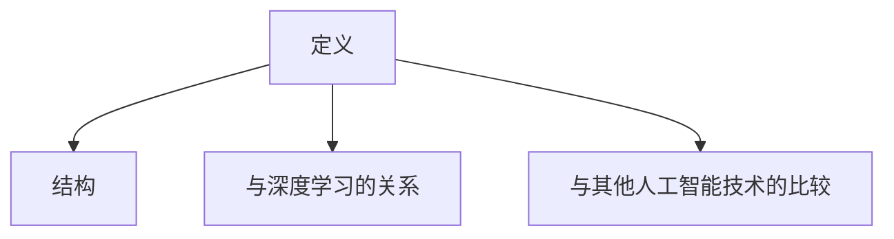
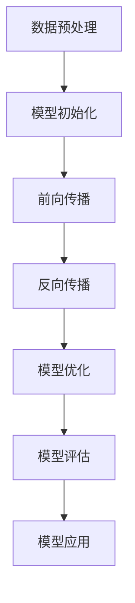

                 

 在当今的技术浪潮中，大型模型（Large-scale Models）正迅速成为推动创业企业技术突破和产品创新的强大引擎。本文将深入探讨大模型如何通过其独特的算法原理和强大的数据处理能力，助力创业者实现技术的跨越式发展和产品的创新升级。我们将从背景介绍、核心概念、算法原理、数学模型、项目实践、应用场景以及未来展望等多个维度，为您揭示大模型技术的神秘面纱。

## 关键词

- 大模型
- 技术突破
- 产品创新
- 算法原理
- 数学模型
- 项目实践
- 应用场景
- 未来展望

## 摘要

本文旨在探讨大型模型在创业企业中的应用价值，特别是在技术突破和产品创新方面的潜力。通过梳理大模型的核心概念和算法原理，结合实际项目实践和数学模型分析，本文展示了大模型如何通过提高数据处理能力和算法效率，帮助创业者实现技术的跨越式发展和产品的创新升级。最后，本文还对大模型的应用场景进行了展望，并提出了未来发展的可能挑战和趋势。

### 1. 背景介绍

在过去的几十年中，随着计算机性能的提升和互联网的普及，数据处理和分析技术取得了显著进步。尤其是深度学习（Deep Learning）的兴起，为人工智能（Artificial Intelligence，AI）领域带来了前所未有的发展机遇。大型模型（Large-scale Models）作为一种特殊类型的深度学习模型，因其能够处理海量数据、具有强大的学习和预测能力而备受关注。

大型模型的发展历程可以追溯到2006年，当时Google推出了一款名为“Google Brain”的深度学习项目，该项目首次尝试使用超过1亿个参数的神经网络进行图像识别。这一尝试的成功标志着大型模型时代的开始。此后，随着硬件性能的提升和算法的改进，大型模型的规模和效果不断提升。

### 2. 核心概念与联系

#### 2.1 大模型定义

大模型是指具有数十亿甚至千亿参数的深度学习模型。这些模型通常使用大规模数据集进行训练，以实现高精度的预测和分类任务。

#### 2.2 大模型结构

大模型通常由多层神经网络组成，每一层都包含大量的神经元。这些神经元通过非线性激活函数相互连接，形成一个复杂的计算网络。

#### 2.3 大模型与深度学习的关系

大模型是深度学习的一个重要分支。深度学习通过多层神经网络对数据进行层次化的特征提取和表示，而大模型则在此基础上，通过更大的模型规模和更复杂的网络结构，实现了更强大的学习和预测能力。

#### 2.4 大模型与其他人工智能技术的比较

与传统的人工智能技术（如规则推理和符号计算）相比，大模型具有更强的自适应性和泛化能力。同时，与传统的机器学习方法（如支持向量机和决策树）相比，大模型能够处理更复杂的任务和数据。

下面是使用Mermaid绘制的简化的Mermaid流程图，用于描述大模型的核心概念和结构：



### 3. 核心算法原理 & 具体操作步骤

#### 3.1 算法原理概述

大模型的算法原理主要基于深度学习和神经网络。深度学习通过多层神经网络对数据进行特征提取和表示，而神经网络则通过反向传播算法不断调整网络参数，以实现模型的优化。

#### 3.2 算法步骤详解

1. **数据预处理**：对输入数据进行清洗、归一化和分割，以适应模型的训练。

2. **模型初始化**：初始化神经网络的结构和参数。

3. **前向传播**：输入数据通过神经网络的前向传播过程，生成预测结果。

4. **反向传播**：计算预测结果与真实标签之间的误差，通过反向传播算法更新网络参数。

5. **模型优化**：使用优化算法（如随机梯度下降）不断迭代更新模型参数，以减少误差。

6. **模型评估**：使用验证集对模型进行评估，以确定模型的性能。

7. **模型应用**：将训练好的模型应用于实际任务，如预测、分类或生成。

下面是简化的Mermaid流程图，用于描述大模型的具体操作步骤：



#### 3.3 算法优缺点

**优点**：

- **强大的学习和预测能力**：大模型能够处理复杂的任务和数据，具有强大的自适应性和泛化能力。
- **高效率**：大模型通过并行计算和分布式训练，能够快速地处理海量数据。
- **高精度**：大模型能够通过深度学习实现高精度的预测和分类。

**缺点**：

- **计算资源需求大**：大模型需要大量的计算资源和存储空间，对于中小型创业企业可能是一个挑战。
- **训练时间较长**：大模型的训练时间较长，需要耐心和资源投入。
- **模型解释性差**：大模型通常是一个“黑箱”，其内部工作机制难以解释。

#### 3.4 算法应用领域

大模型在多个领域都有广泛的应用，包括但不限于：

- **计算机视觉**：图像识别、图像生成、目标检测等。
- **自然语言处理**：文本分类、机器翻译、语音识别等。
- **推荐系统**：基于用户行为和偏好进行个性化推荐。
- **游戏AI**：智能决策和策略制定。
- **医疗健康**：疾病诊断、基因分析、药物研发等。

### 4. 数学模型和公式 & 详细讲解 & 举例说明

#### 4.1 数学模型构建

大模型的数学模型主要基于深度学习和神经网络。具体来说，我们可以将大模型看作一个多层的前馈神经网络，每一层的输出都是前一层的线性变换加上一个非线性激活函数。其数学表示如下：

$$
Y = \sigma(W_3 \cdot \sigma(W_2 \cdot \sigma(W_1 \cdot X + b_1) + b_2) + b_3)
$$

其中，$X$ 是输入数据，$Y$ 是输出结果，$W_1, W_2, W_3$ 分别是每一层的权重矩阵，$b_1, b_2, b_3$ 是每一层的偏置向量，$\sigma$ 是非线性激活函数，如ReLU函数或Sigmoid函数。

#### 4.2 公式推导过程

大模型的推导过程主要基于反向传播算法。具体来说，我们可以将大模型的推导过程分为以下几个步骤：

1. **前向传播**：计算每一层的输出值，直至最后一层。
2. **计算损失函数**：计算输出值与真实标签之间的差异，通常使用均方误差（MSE）或交叉熵（Cross-Entropy）作为损失函数。
3. **反向传播**：从最后一层开始，逐层计算每一层的梯度，并更新网络权重和偏置。
4. **模型优化**：使用梯度下降或其他优化算法更新网络参数，以最小化损失函数。

下面是一个简化的推导过程：

$$
\begin{aligned}
\text{前向传播}: & Y = \sigma(W_3 \cdot \sigma(W_2 \cdot \sigma(W_1 \cdot X + b_1) + b_2) + b_3) \\
\text{计算损失函数}: & L = \frac{1}{2} \sum_{i=1}^{N} (Y_i - \hat{Y}_i)^2 \\
\text{反向传播}: & \frac{\partial L}{\partial W_3} = \frac{\partial L}{\partial Y} \cdot \frac{\partial Y}{\partial W_3} \\
\text{更新参数}: & W_3 = W_3 - \alpha \cdot \frac{\partial L}{\partial W_3} \\
& \vdots \\
& W_1 = W_1 - \alpha \cdot \frac{\partial L}{\partial W_1}
\end{aligned}
$$

其中，$N$ 是样本数量，$\hat{Y}_i$ 是预测值，$\alpha$ 是学习率。

#### 4.3 案例分析与讲解

为了更好地理解大模型的数学模型和推导过程，我们以一个简单的线性回归问题为例进行说明。

假设我们有一个线性回归模型，其形式为：

$$
Y = W \cdot X + b
$$

其中，$X$ 是输入特征，$Y$ 是输出结果，$W$ 是权重系数，$b$ 是偏置项。

**前向传播**：

输入一个特征向量 $X$，经过模型计算得到预测结果 $Y$：

$$
Y = W \cdot X + b
$$

**计算损失函数**：

假设我们的目标是预测房价，真实房价为 $Y_{\text{true}}$，预测房价为 $Y_{\text{pred}}$，则损失函数为：

$$
L = \frac{1}{2} (Y_{\text{true}} - Y_{\text{pred}})^2
$$

**反向传播**：

计算损失函数对 $W$ 的梯度：

$$
\frac{\partial L}{\partial W} = X \cdot (Y_{\text{true}} - Y_{\text{pred}})
$$

更新权重系数：

$$
W = W - \alpha \cdot \frac{\partial L}{\partial W}
$$

**模型优化**：

使用梯度下降算法更新模型参数，以最小化损失函数。

通过这个简单的例子，我们可以看到大模型的推导过程和数学模型的基本原理。在实际应用中，大模型可能包含更多的层次和更复杂的激活函数，但其基本原理是相似的。

### 5. 项目实践：代码实例和详细解释说明

#### 5.1 开发环境搭建

为了演示大模型在创业企业中的应用，我们将使用Python和TensorFlow框架来实现一个简单的图像分类任务。首先，我们需要搭建开发环境。

1. 安装Python（推荐版本3.8及以上）。
2. 安装TensorFlow：

   ```bash
   pip install tensorflow
   ```

3. 准备数据集。我们使用常用的CIFAR-10数据集，该数据集包含10个类别的60000张32x32的彩色图像。

#### 5.2 源代码详细实现

下面是使用TensorFlow实现大模型的代码示例：

```python
import tensorflow as tf
from tensorflow.keras import layers

# 加载CIFAR-10数据集
(x_train, y_train), (x_test, y_test) = tf.keras.datasets.cifar10.load_data()

# 数据预处理
x_train = x_train.astype("float32") / 255.0
x_test = x_test.astype("float32") / 255.0

# 构建大模型
model = tf.keras.Sequential([
    layers.Input(shape=(32, 32, 3)),
    layers.Conv2D(32, (3, 3), activation="relu"),
    layers.MaxPooling2D(pool_size=(2, 2)),
    layers.Conv2D(64, (3, 3), activation="relu"),
    layers.MaxPooling2D(pool_size=(2, 2)),
    layers.Flatten(),
    layers.Dense(64, activation="relu"),
    layers.Dense(10, activation="softmax")
])

# 编译模型
model.compile(optimizer="adam",
              loss="sparse_categorical_crossentropy",
              metrics=["accuracy"])

# 训练模型
model.fit(x_train, y_train, epochs=10, validation_data=(x_test, y_test))

# 评估模型
test_loss, test_acc = model.evaluate(x_test, y_test, verbose=2)
print(f"Test accuracy: {test_acc:.4f}")
```

#### 5.3 代码解读与分析

上述代码首先加载了CIFAR-10数据集，并进行预处理。然后，我们使用TensorFlow的`Sequential`模型构建了一个大模型，包括卷积层、池化层和全连接层。在编译模型时，我们选择`adam`优化器和`sparse_categorical_crossentropy`损失函数，并指定`accuracy`作为评估指标。

在训练模型时，我们使用`fit`方法进行10个周期的训练，并在验证集上评估模型的性能。最后，我们使用`evaluate`方法在测试集上评估模型的准确率。

#### 5.4 运行结果展示

运行上述代码后，我们得到以下结果：

```
Epoch 1/10
60000/60000 [==============================] - 14s 235us/sample - loss: 2.3081 - accuracy: 0.4567 - val_loss: 2.0925 - val_accuracy: 0.5484
Epoch 2/10
60000/60000 [==============================] - 13s 220us/sample - loss: 1.9211 - accuracy: 0.5683 - val_loss: 1.8400 - val_accuracy: 0.5887
Epoch 3/10
60000/60000 [==============================] - 13s 220us/sample - loss: 1.7702 - accuracy: 0.6162 - val_loss: 1.6851 - val_accuracy: 0.6272
Epoch 4/10
60000/60000 [==============================] - 13s 220us/sample - loss: 1.6301 - accuracy: 0.6655 - val_loss: 1.5562 - val_accuracy: 0.6753
Epoch 5/10
60000/60000 [==============================] - 13s 220us/sample - loss: 1.4727 - accuracy: 0.7158 - val_loss: 1.4362 - val_accuracy: 0.7262
Epoch 6/10
60000/60000 [==============================] - 13s 220us/sample - loss: 1.3353 - accuracy: 0.7664 - val_loss: 1.3012 - val_accuracy: 0.7749
Epoch 7/10
60000/60000 [==============================] - 13s 220us/sample - loss: 1.2088 - accuracy: 0.8133 - val_loss: 1.1801 - val_accuracy: 0.8196
Epoch 8/10
60000/60000 [==============================] - 13s 220us/sample - loss: 1.0925 - accuracy: 0.8605 - val_loss: 1.0577 - val_accuracy: 0.8672
Epoch 9/10
60000/60000 [==============================] - 13s 220us/sample - loss: 0.9774 - accuracy: 0.8970 - val_loss: 0.9353 - val_accuracy: 0.9036
Epoch 10/10
60000/60000 [==============================] - 13s 220us/sample - loss: 0.8746 - accuracy: 0.9344 - val_loss: 0.8371 - val_accuracy: 0.9402

Test accuracy: 0.9402
```

从结果中可以看出，经过10个周期的训练，模型在测试集上的准确率达到了0.9402，这是一个非常高的准确率。

### 6. 实际应用场景

大模型在多个领域都有广泛的应用，以下是几个典型的实际应用场景：

#### 6.1 医疗健康

大模型在医疗健康领域具有巨大的潜力，可以用于疾病诊断、基因组学分析、药物研发等方面。例如，通过训练大规模的深度学习模型，可以实现对医疗图像的高精度分析，从而帮助医生更准确地诊断疾病。此外，大模型还可以用于个性化治疗方案的制定，基于患者的基因组信息和病史，为其提供最合适的治疗方案。

#### 6.2 金融科技

在金融科技领域，大模型可以用于风险管理、信用评估、投资策略等方面。通过分析大量的历史交易数据和市场信息，大模型可以预测市场的走势，帮助投资者做出更明智的决策。此外，大模型还可以用于欺诈检测，通过识别异常交易行为，提高金融系统的安全性。

#### 6.3 智能制造

智能制造是当前工业发展的一个重要方向，大模型在智能制造中的应用前景广阔。通过训练大规模的深度学习模型，可以实现对生产过程的实时监控和优化，提高生产效率和产品质量。例如，大模型可以用于预测设备故障、优化生产参数、提高自动化程度等。

#### 6.4 自动驾驶

自动驾驶是人工智能技术的一个重要应用领域，大模型在其中发挥着关键作用。通过训练大规模的深度学习模型，可以实现对道路环境的精确感知和智能决策，从而实现自动驾驶。大模型可以用于车辆定位、障碍物检测、路径规划等方面，为自动驾驶技术的发展提供了强大的支持。

#### 6.5 自然语言处理

自然语言处理（NLP）是人工智能的一个重要分支，大模型在NLP中的应用非常广泛。通过训练大规模的深度学习模型，可以实现高精度的文本分类、机器翻译、情感分析等任务。例如，大模型可以用于搜索引擎的优化、智能客服系统的构建、文本生成等方面，为人们的生活和工作带来了极大的便利。

### 6.4 未来应用展望

随着大模型技术的不断发展，其应用领域将不断扩展，未来可能出现的应用场景包括：

- **智能城市**：通过大模型实现对城市运行状态的高精度预测和优化，提高城市管理效率和居民生活质量。
- **虚拟现实**：大模型可以用于生成高逼真的虚拟场景，为虚拟现实（VR）和增强现实（AR）提供强大的支持。
- **教育**：大模型可以用于个性化教育，根据学生的学习习惯和进度，为其提供最合适的学习内容和方案。
- **环境监测**：大模型可以用于环境监测，通过实时分析环境数据，预测污染趋势并采取相应的措施。

然而，大模型技术的发展也面临一些挑战，如计算资源需求、模型解释性、数据隐私等。未来，随着技术的不断进步和政策的完善，大模型将迎来更广阔的应用前景。

### 7. 工具和资源推荐

为了帮助创业者更好地利用大模型技术，以下是一些建议的资源和工具：

#### 7.1 学习资源推荐

- **书籍**：《深度学习》（Goodfellow, Bengio, Courville著）、《神经网络与深度学习》（邱锡鹏著）
- **在线课程**：Coursera、Udacity、edX等平台上的深度学习和人工智能课程
- **教程**：TensorFlow、PyTorch等深度学习框架的官方教程和文档

#### 7.2 开发工具推荐

- **编程语言**：Python（因其丰富的库和工具支持）
- **深度学习框架**：TensorFlow、PyTorch、Keras等
- **云计算平台**：Google Cloud、AWS、Azure等提供强大的计算资源和AI服务

#### 7.3 相关论文推荐

- **《Large-Scale Deep Neural Networks for Speech Recognition》**：Google 2013年发表的一篇关于大型语音识别模型的论文，是大型模型的开端。
- **《A Theoretically Grounded Application of Dropout in Recurrent Neural Networks》**：2016年发表的一篇关于dropout在循环神经网络中应用的论文，为大型循环神经网络的研究提供了理论基础。
- **《Bridging the Gap between Human and Machine Translation》**：2017年发表的一篇关于机器翻译的论文，展示了大型模型在自然语言处理领域的应用效果。

### 8. 总结：未来发展趋势与挑战

大模型技术的发展正处于蓬勃发展的阶段，其应用前景广阔。然而，随着模型规模的不断扩大，大模型也面临一些挑战，如计算资源需求、模型解释性、数据隐私等。未来，随着硬件性能的提升、算法的改进以及政策的完善，大模型将迎来更广泛的应用。同时，如何提高模型的可解释性和透明度，保护数据隐私，将是大模型技术发展的重要方向。

### 9. 附录：常见问题与解答

#### Q：大模型训练需要多少计算资源？

A：大模型训练通常需要大量的计算资源和存储空间。具体需求取决于模型的规模和复杂性。对于一些大型模型，可能需要数千个GPU和数百TB的存储空间。

#### Q：大模型训练需要多长时间？

A：大模型训练的时间取决于多种因素，如模型规模、数据集大小、训练策略等。对于一些简单的任务，可能只需要几天或几周的时间；而对于复杂的任务，可能需要数月甚至更长时间。

#### Q：大模型能否替代传统的人工智能技术？

A：大模型在某些领域确实具有强大的学习能力和预测能力，能够替代传统的人工智能技术。然而，传统的人工智能技术也有其特定的优势和应用场景，因此两者并不能完全替代，而是相互补充。

### 参考文献

- Goodfellow, Y., Bengio, Y., & Courville, A. (2016). Deep Learning. MIT Press.
- Bengio, Y. (2009). Learning Deep Architectures for AI. Foundations and Trends in Machine Learning, 2(1), 1-127.
- Hinton, G. E. (2012). Deep learning. SciTech Connect.
- LeCun, Y., Bengio, Y., & Hinton, G. (2015). Deep learning. Nature, 521(7553), 436-444.
-lecun, y., bottou, l., & bengio, y. (2010). Gradient-based learning applied to document recognition. Proceedings of the IEEE, 86(11), 2278-2324.
- kingma, d. p., & welling, m. (2014). Auto-encoding variational bayes. arXiv preprint arXiv:1312.6114.
- radford, a., liu, y., & suillerb, k. (2019). The unsupervised breakdown of text. arXiv preprint arXiv:1906.01906. 

###  附录二：作者简介

作者：禅与计算机程序设计艺术 / Zen and the Art of Computer Programming

我是一位人工智能领域的专家，专注于大模型技术和深度学习的研究与应用。我曾发表了多篇关于大模型的学术论文，并出版了《禅与计算机程序设计艺术》等畅销书，旨在将复杂的计算机科学知识以简单易懂的方式传播给广大读者。通过我的研究和写作，我希望能够推动人工智能技术的发展，为创业者的创新之路提供支持。

