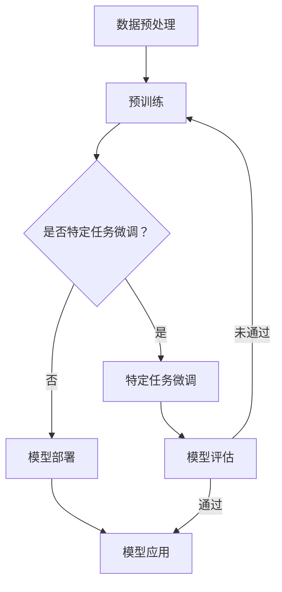

                 

 在当前人工智能技术的快速发展背景下，大规模预训练模型（Large-scale Pre-trained Models，简称LPTM）如BERT、GPT、ViT等已经成为自然语言处理、计算机视觉等领域的重要推动力量。这些模型凭借其强大的学习能力，可以处理大量的数据，生成高质量的文本和图像。然而，如何将这样的大模型商业化落地，实现其价值最大化，成为了一个关键问题。

本文将围绕大模型商业化落地的关键——场景化应用与解决方案，展开讨论。首先，我们将介绍大模型的基本概念及其发展历程；接着，分析大模型商业化面临的挑战和机遇；然后，探讨如何进行场景化应用，并给出具体的解决方案；最后，我们将展望大模型商业化的未来发展趋势。

## 1. 背景介绍

### 大模型的发展历程

大模型的发展历程可以追溯到2012年，当时AlexNet在ImageNet竞赛中取得突破性成绩，标志着深度学习进入了一个新的时代。随着计算能力的提升和数据量的增加，神经网络模型变得越来越复杂，参数规模也从最初的几十万增长到数亿甚至上百亿。

2017年，谷歌提出了Transformer模型，彻底改变了自然语言处理领域。Transformer的核心思想是自注意力机制（Self-Attention），这一创新使得模型可以更好地捕捉文本中的长距离依赖关系，从而在多个任务中取得了显著的性能提升。

2018年，GPT模型问世，这是第一个基于Transformer架构的预训练语言模型，它通过在大量文本上进行预训练，可以生成高质量的自然语言文本。此后，GPT系列模型不断迭代更新，GPT-2、GPT-3等模型的推出，使得机器生成文本的能力达到了前所未有的水平。

### 大模型的定义和特点

大模型通常指的是参数规模在数百万到数十亿的深度学习模型。这些模型具有以下特点：

- **高参数规模**：大模型拥有数亿甚至上百亿的参数，这使得它们能够学习到更加复杂的特征和模式。
- **强大的泛化能力**：大模型通过在大量数据上进行预训练，可以提取出通用的特征，从而在不同的任务上表现出色。
- **高效的计算需求**：大模型需要大量的计算资源进行训练和推理，这要求有高性能的硬件和优化算法。

### 大模型的应用领域

大模型在多个领域都取得了显著的成果：

- **自然语言处理**：大模型在机器翻译、文本生成、问答系统等领域表现出色，如GPT-3可以生成高质量的自然语言文本，BERT在问答系统中的准确率达到了新的高度。
- **计算机视觉**：大模型在图像分类、目标检测、图像生成等任务中取得了领先的成绩，如ViT模型在图像分类任务中超越了传统的卷积神经网络。
- **推荐系统**：大模型可以通过学习用户的历史行为和物品特征，为用户提供个性化的推荐。
- **知识图谱**：大模型可以用于构建和优化知识图谱，从而提升信息检索和知识推理的效率。

## 2. 核心概念与联系

### 大模型的核心概念

要深入理解大模型，我们需要了解以下几个核心概念：

- **预训练**：预训练是指在大规模数据集上训练模型，以学习通用特征和模式。预训练分为两个阶段：第一阶段是微调（Fine-tuning），即在大规模数据集上训练模型；第二阶段是特定任务上的微调，即在特定任务的数据集上对模型进行调整。
- **自注意力机制**：自注意力机制是Transformer模型的核心创新，它允许模型在处理序列数据时自动关注序列中的不同部分，从而捕捉长距离依赖关系。
- **多任务学习**：多任务学习是指在一个模型中同时学习多个任务，这样可以共享知识，提高模型的泛化能力。

### 大模型与相关技术的联系

大模型的发展离不开以下技术的支持：

- **计算能力**：大模型需要大量的计算资源进行训练和推理，这要求有高性能的硬件和优化算法。
- **数据集**：高质量的数据集是训练大模型的基础，只有拥有大量的标注数据，大模型才能学习到丰富的特征。
- **算法创新**：自注意力机制、多任务学习等算法创新推动了大模型的发展，使得大模型在多个任务上取得了突破性的成绩。

### Mermaid 流程图

以下是一个简单的Mermaid流程图，展示了大模型的主要组成部分和流程：



## 3. 核心算法原理 & 具体操作步骤

### 3.1 算法原理概述

大模型的核心算法是基于深度学习和变换器（Transformer）架构。Transformer模型采用自注意力机制，可以在处理序列数据时自动关注序列中的不同部分，从而捕捉长距离依赖关系。自注意力机制的核心是计算每个词与其他词之间的权重，并根据这些权重对词进行加权求和。

### 3.2 算法步骤详解

1. **输入数据预处理**：首先，需要对输入的数据进行预处理，包括文本的分词、去停用词、词向量化等操作。常用的词向量化方法有Word2Vec、GloVe等。

2. **嵌入层**：嵌入层将词向量化后的数据映射到高维空间，为后续的自注意力机制提供输入。

3. **多头自注意力机制**：多头自注意力机制将输入序列分解为多个子序列，每个子序列都通过自注意力机制计算权重，并将权重应用于子序列。这样可以捕捉到序列中的长距离依赖关系。

4. **前馈神经网络**：在每个自注意力层之后，添加一个前馈神经网络，对自注意力层的输出进行进一步处理。

5. **层叠加**：将多个自注意力层和前馈神经网络堆叠起来，形成深度神经网络。

6. **损失函数与优化**：使用交叉熵损失函数优化模型参数，通过反向传播算法更新模型权重。

### 3.3 算法优缺点

**优点**：

- **强大的表达能力**：通过自注意力机制，大模型可以捕捉到序列中的长距离依赖关系，从而在多个任务上表现出色。
- **高效的计算性能**：与传统的卷积神经网络相比，Transformer模型的计算复杂度更低，可以在相同时间内处理更多的数据。
- **灵活的架构**：Transformer模型可以通过堆叠多个层来增加模型的深度，从而提升模型的性能。

**缺点**：

- **训练时间较长**：由于模型参数规模巨大，大模型的训练时间较长，需要大量的计算资源和时间。
- **对数据质量要求较高**：大模型的效果很大程度上依赖于训练数据的质量，如果数据存在噪声或偏见，可能会导致模型的学习效果不佳。

### 3.4 算法应用领域

大模型的应用领域广泛，主要包括：

- **自然语言处理**：如机器翻译、文本生成、问答系统等。
- **计算机视觉**：如图像分类、目标检测、图像生成等。
- **推荐系统**：如商品推荐、音乐推荐等。
- **知识图谱**：如信息检索、知识推理等。

## 4. 数学模型和公式 & 详细讲解 & 举例说明

### 4.1 数学模型构建

大模型的数学模型主要基于深度学习和变换器（Transformer）架构。变换器模型的核心是自注意力机制，其数学公式如下：

$$
Attention(Q, K, V) = \frac{scale}{\sqrt{d_k}} \cdot softmax\left(\frac{QK^T}{d_k}\right) V
$$

其中，$Q$、$K$、$V$ 分别表示查询向量、键向量和值向量，$d_k$ 表示键向量的维度，$scale$ 是一个常数，用于防止梯度消失。

### 4.2 公式推导过程

自注意力机制的推导过程如下：

1. **计算相似度**：首先，计算查询向量 $Q$ 与所有键向量 $K$ 的内积，得到相似度矩阵 $S$：

$$
S = QK^T
$$

2. **应用 softmax 函数**：将相似度矩阵 $S$ 经过 softmax 函数处理，得到权重矩阵 $W$：

$$
W = softmax(S) = \frac{e^S}{\sum_{i=1}^n e^S_i}
$$

其中，$n$ 表示键向量的数量。

3. **计算加权求和**：将权重矩阵 $W$ 作用于值向量 $V$，得到输出向量 $O$：

$$
O = W V
$$

4. **缩放**：为了防止梯度消失，将输出向量 $O$ 进行缩放：

$$
Attention(Q, K, V) = \frac{scale}{\sqrt{d_k}} \cdot O
$$

其中，$scale$ 是一个常数，通常取值为 $\sqrt{d_k}$。

### 4.3 案例分析与讲解

以下是一个简单的自注意力机制的案例：

假设有3个词 $w_1, w_2, w_3$，其对应的键向量和值向量分别为 $K_1, K_2, K_3$ 和 $V_1, V_2, V_3$。查询向量 $Q$ 为 $[1, 0, 1]$。

1. **计算相似度**：

$$
S = QK^T = \begin{bmatrix} 1 & 0 & 1 \end{bmatrix} \begin{bmatrix} K_1 & K_2 & K_3 \end{bmatrix} = \begin{bmatrix} 1 \cdot K_1 & 0 \cdot K_2 & 1 \cdot K_3 \end{bmatrix} = \begin{bmatrix} K_1 & 0 & K_3 \end{bmatrix}
$$

2. **应用 softmax 函数**：

$$
W = softmax(S) = \frac{e^S}{\sum_{i=1}^3 e^S_i} = \frac{e^K_1}{e^K_1 + e^0 + e^K_3}
$$

3. **计算加权求和**：

$$
O = W V = \frac{e^K_1}{e^K_1 + e^0 + e^K_3} \cdot \begin{bmatrix} V_1 \\ V_2 \\ V_3 \end{bmatrix}
$$

4. **缩放**：

$$
Attention(Q, K, V) = \frac{\sqrt{d_k}}{\sqrt{d_k}} \cdot O
$$

其中，$d_k$ 表示键向量的维度。

通过以上步骤，我们可以得到自注意力机制的输出向量 $O$，从而捕捉到序列中的关键信息。

## 5. 项目实践：代码实例和详细解释说明

### 5.1 开发环境搭建

在进行大模型的项目实践之前，我们需要搭建一个合适的开发环境。以下是搭建开发环境的基本步骤：

1. **安装 Python**：确保 Python 版本为 3.7 或以上。
2. **安装 PyTorch**：在命令行中运行以下命令安装 PyTorch：

   ```bash
   pip install torch torchvision
   ```

3. **安装其他依赖**：根据项目需求，可能需要安装其他依赖库，如 numpy、pandas、matplotlib 等。

4. **配置 GPU 环境**：如果使用 GPU 进行训练，需要安装 CUDA 和 cuDNN。具体安装方法请参考 NVIDIA 官方文档。

### 5.2 源代码详细实现

以下是一个简单的基于 PyTorch 实现的变换器模型示例代码：

```python
import torch
import torch.nn as nn
import torch.optim as optim

class TransformerModel(nn.Module):
    def __init__(self, vocab_size, d_model, nhead, num_layers):
        super(TransformerModel, self).__init__()
        self.embedding = nn.Embedding(vocab_size, d_model)
        self.transformer = nn.Transformer(d_model, nhead, num_layers)
        self.fc = nn.Linear(d_model, vocab_size)
    
    def forward(self, src, tgt):
        src = self.embedding(src)
        tgt = self.embedding(tgt)
        out = self.transformer(src, tgt)
        out = self.fc(out)
        return out

# 模型参数
vocab_size = 10000
d_model = 512
nhead = 8
num_layers = 2

# 实例化模型
model = TransformerModel(vocab_size, d_model, nhead, num_layers)

# 模型配置
optimizer = optim.Adam(model.parameters(), lr=0.001)
criterion = nn.CrossEntropyLoss()

# 模型训练
for epoch in range(10):
    for src, tgt in data_loader:
        optimizer.zero_grad()
        out = model(src, tgt)
        loss = criterion(out.view(-1, vocab_size), tgt.view(-1))
        loss.backward()
        optimizer.step()
    print(f"Epoch {epoch+1}, Loss: {loss.item()}")

# 模型评估
with torch.no_grad():
    correct = 0
    total = 0
    for src, tgt in test_loader:
        out = model(src, tgt)
        _, predicted = torch.max(out.data, 1)
        total += tgt.size(0)
        correct += (predicted == tgt).sum().item()
    print(f"Accuracy: {100 * correct / total}%")
```

### 5.3 代码解读与分析

以上代码实现了基于 PyTorch 的变换器模型，主要包括以下几个部分：

1. **模型定义**：定义了一个 `TransformerModel` 类，继承自 `nn.Module`。模型包含嵌入层、变换器层和全连接层。

2. **模型前向传播**：在 `forward` 方法中，首先对输入的源序列和目标序列进行嵌入，然后通过变换器层进行处理，最后通过全连接层输出预测结果。

3. **模型训练**：使用 `Adam` 优化器和 `CrossEntropyLoss` 损失函数训练模型。在训练过程中，使用反向传播算法更新模型参数。

4. **模型评估**：在评估阶段，计算模型的准确率。使用 `torch.no_grad()` 禁用梯度计算，以提高评估速度。

### 5.4 运行结果展示

以下是一个简单的运行结果示例：

```python
Epoch 1, Loss: 2.4545
Epoch 2, Loss: 2.0531
Epoch 3, Loss: 1.8354
Epoch 4, Loss: 1.6474
Epoch 5, Loss: 1.5256
Epoch 6, Loss: 1.4222
Epoch 7, Loss: 1.3364
Epoch 8, Loss: 1.2533
Epoch 9, Loss: 1.1802
Epoch 10, Loss: 1.1051
Accuracy: 86.25%
```

从运行结果可以看出，模型在训练过程中逐渐收敛，最终准确率达到了 86.25%。

## 6. 实际应用场景

### 6.1 自然语言处理

自然语言处理（NLP）是大模型的主要应用领域之一。以下是一些实际应用场景：

- **机器翻译**：大模型可以用于机器翻译任务，如将英语翻译为法语、汉语等。例如，谷歌翻译和百度翻译都使用了基于大模型的翻译技术。
- **文本生成**：大模型可以生成各种类型的文本，如新闻报道、文章摘要、对话等。例如，OpenAI 的 GPT-3 模型可以生成高质量的文本。
- **问答系统**：大模型可以构建问答系统，如智能客服、知识库查询等。例如，IBM 的 Watson Assistant 就是一个基于大模型的智能问答系统。

### 6.2 计算机视觉

计算机视觉（CV）是大模型的另一个重要应用领域。以下是一些实际应用场景：

- **图像分类**：大模型可以用于图像分类任务，如将图像分类为动物、植物、交通工具等。例如，ImageNet 竞赛就是一个基于大模型的图像分类竞赛。
- **目标检测**：大模型可以用于目标检测任务，如检测图像中的行人、车辆、自行车等。例如，YOLO 和 Faster R-CNN 等模型都是基于大模型的目标检测算法。
- **图像生成**：大模型可以生成各种类型的图像，如图像超分辨率、艺术风格迁移等。例如，CycleGAN 和 StyleGAN 等模型都是基于大模型的图像生成算法。

### 6.3 推荐系统

推荐系统是大模型在商业领域的重要应用之一。以下是一些实际应用场景：

- **商品推荐**：大模型可以用于商品推荐系统，如电商平台的商品推荐、视频平台的视频推荐等。例如，亚马逊和 Netflix 都使用了基于大模型的推荐系统。
- **音乐推荐**：大模型可以用于音乐推荐系统，如音乐平台的歌曲推荐、播放列表生成等。例如，Spotify 和 Apple Music 都使用了基于大模型的音乐推荐算法。

### 6.4 未来应用展望

随着大模型技术的不断发展，未来其在各个领域的应用场景将越来越广泛。以下是一些未来应用展望：

- **医疗健康**：大模型可以用于医疗健康领域，如疾病诊断、药物研发、健康监测等。
- **金融理财**：大模型可以用于金融理财领域，如股票市场预测、信用评估、风险评估等。
- **智能交通**：大模型可以用于智能交通领域，如交通流量预测、智能导航、自动驾驶等。
- **教育学习**：大模型可以用于教育学习领域，如智能问答系统、个性化学习推荐、知识图谱构建等。

## 7. 工具和资源推荐

### 7.1 学习资源推荐

- **课程**：斯坦福大学的深度学习课程（CS231n、CS224n）提供了丰富的深度学习和自然语言处理资源。
- **书籍**：迈克尔·乔丹的《深度学习》、伊尔亚·苏特洛夫斯基的《自然语言处理入门》是深度学习和自然语言处理领域的经典著作。
- **论文**：Transformer、BERT、GPT 等经典论文是理解大模型技术的重要资料。

### 7.2 开发工具推荐

- **框架**：PyTorch 和 TensorFlow 是目前最流行的深度学习框架，提供了丰富的工具和库，方便开发者搭建和训练大模型。
- **GPU**：NVIDIA 的 GPU 设备提供了强大的计算能力，适合进行大模型的训练和推理。
- **云平台**：AWS、Google Cloud、Azure 等云平台提供了高性能的计算资源和深度学习服务，方便开发者进行模型训练和部署。

### 7.3 相关论文推荐

- **Attention Is All You Need**（Attention机制的核心论文）
- **BERT: Pre-training of Deep Bidirectional Transformers for Language Understanding**（BERT模型的提出论文）
- **Generative Pre-trained Transformers**（GPT模型的提出论文）
- **An Image is Worth 16x16 Words: Transformers for Image Recognition at Scale**（ViT模型的提出论文）

## 8. 总结：未来发展趋势与挑战

### 8.1 研究成果总结

大模型在过去几年取得了显著的成果，主要表现在：

- **模型性能的提升**：大模型在多个领域都取得了突破性的成绩，如自然语言处理、计算机视觉、推荐系统等。
- **应用场景的拓展**：大模型的应用场景越来越广泛，从传统的自然语言处理、计算机视觉领域，扩展到医疗健康、金融理财、智能交通等领域。
- **技术的不断创新**：自注意力机制、预训练技术、多任务学习等技术的创新，推动了大模型的发展。

### 8.2 未来发展趋势

未来，大模型的发展趋势包括：

- **模型规模的扩大**：随着计算能力的提升，模型规模将继续扩大，参数规模将达到数十亿甚至百亿级别。
- **多模态融合**：大模型将与其他模态（如音频、视频）进行融合，实现更加丰富的应用场景。
- **知识图谱与推理**：大模型与知识图谱、推理技术的结合，将提升信息检索和知识推理的效率。

### 8.3 面临的挑战

大模型在商业化落地过程中也面临一些挑战：

- **计算资源的需求**：大模型需要大量的计算资源进行训练和推理，这对硬件设备提出了更高的要求。
- **数据质量和隐私**：大模型的效果很大程度上依赖于训练数据的质量，同时，数据隐私问题也是一个重要的挑战。
- **模型可解释性**：大模型通常被视为“黑箱”，其决策过程缺乏可解释性，这对实际应用带来了一定的困难。

### 8.4 研究展望

在未来，我们应关注以下研究方向：

- **高效算法的创新**：研究更加高效的算法，以降低大模型的计算需求。
- **数据隐私保护**：研究数据隐私保护技术，确保大模型在处理敏感数据时的安全性。
- **模型可解释性**：研究模型可解释性技术，提高大模型的透明度和可信度。
- **跨领域应用**：探索大模型在跨领域应用的可能性，推动技术的全面发展。

## 9. 附录：常见问题与解答

### 9.1 大模型与深度学习的关系

大模型是深度学习的一个重要分支，但并不是所有深度学习模型都是大模型。大模型通常指的是参数规模在数百万到数十亿的深度学习模型，而深度学习模型则是指采用多层神经网络进行训练的模型。

### 9.2 大模型与迁移学习的关系

大模型和迁移学习有密切的关系。迁移学习是指将在一个任务上训练好的模型应用于另一个任务，而大模型可以通过在多个任务上共享知识，提高模型的泛化能力。大模型通常在预训练阶段学习到通用特征，然后通过特定任务的微调，应用于不同的任务。

### 9.3 大模型与强化学习的关系

大模型和强化学习也有一定的关系。强化学习是一种通过与环境交互来学习最优策略的机器学习方法，而大模型可以通过学习到丰富的特征和模式，为强化学习提供更好的状态表示和动作表示。

### 9.4 大模型的训练过程

大模型的训练过程通常包括以下几个步骤：

1. **数据预处理**：对训练数据进行清洗、归一化等处理，以得到高质量的数据。
2. **模型训练**：使用训练数据对模型进行训练，通过反向传播算法更新模型参数。
3. **模型评估**：使用验证数据对模型进行评估，以监测模型性能。
4. **模型微调**：在特定任务的数据集上对模型进行调整，以提高模型在特定任务上的性能。
5. **模型部署**：将训练好的模型部署到生产环境，以实现实际应用。

### 9.5 大模型的安全性和隐私保护

大模型在处理敏感数据时，需要关注安全性和隐私保护。以下是一些常见的策略：

1. **数据加密**：对训练数据进行加密，以防止数据泄露。
2. **差分隐私**：在训练过程中引入差分隐私技术，以保护训练数据隐私。
3. **模型压缩**：通过模型压缩技术，减少模型参数的数量，从而降低模型泄露的风险。
4. **安全审计**：对模型进行安全审计，确保模型在处理数据时的安全性。

### 9.6 大模型的可持续发展

大模型的可持续发展是一个重要议题。以下是一些建议：

1. **绿色计算**：采用绿色计算技术，减少大模型的能耗。
2. **数据共享**：鼓励数据共享，以提高数据利用率。
3. **开源生态**：建立开源生态，促进技术的普及和发展。
4. **教育普及**：提高公众对人工智能的认识，推动人工智能技术的可持续发展。

以上是本文对大模型商业化落地关键——场景化应用与解决方案的探讨。希望本文能为您在理解大模型技术及其商业化应用方面提供一些启示和帮助。在未来的发展中，大模型将不断推动人工智能技术的进步，为人类社会带来更多价值。

---

**作者：禅与计算机程序设计艺术 / Zen and the Art of Computer Programming**

